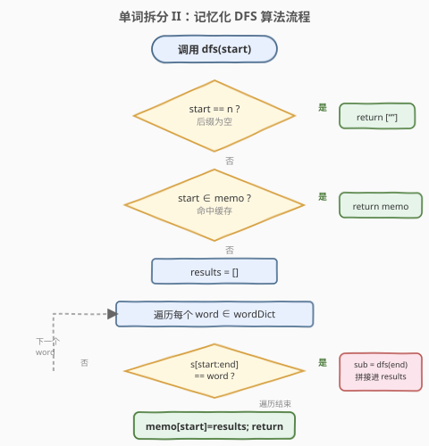
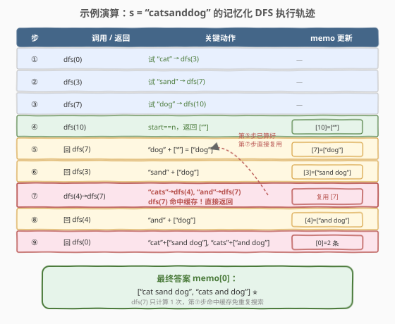

# LeetCode 单词拆分 II 题解

## 1. 题目概述

- **标题 / 题号**：单词拆分 II（#140，hard）
- **链接**：https://leetcode.cn/problems/word-break-ii/
- **难度**：困难
- **标签**：字典树、记忆化搜索、哈希表、字符串、动态规划、回溯

**题意**：给定一个字符串 `s` 和一个字符串字典 `wordDict`，在 `s` 中增加空格将其拆分成若干个单词，使得**每个单词都在字典中**。返回所有可能的拆分方案。每个方案是一个由单词组成的字符串（单词之间用空格连接）。

> 💡 **与 [139. 单词拆分](../0101-0200/139_单词拆分.md) 的区别**：139 只问「能否拆分」（返回 `true/false`）；140 要求返回**所有拆分方案**。从「判定可行性」升级为「枚举全部方案」，这正是 [131. 分割回文串](../0101-0200/131_分割回文串.md)（枚举全部）与 [132. 分割回文串 II](../0101-0200/132_分割回文串II.md)（求最小值）之间的同款分野。

**示例 1**：

```text
输入：s = "catsanddog", wordDict = ["cat","cats","and","sand","dog"]
输出：["cats and dog","cat sand dog"]
解释：两种拆分方案：
  "cat sand dog" → cat | sand | dog
  "cats and dog" → cats | and | dog
```

**示例 2**：

```text
输入：s = "pineapplepenapple", wordDict = ["apple","pen","applepen","pine","pineapple"]
输出：["pine apple pen apple","pineapple pen apple","pine applepen apple"]
解释：注意 "applepen" 是字典中的一个词，与 "apple pen" 不同
```

**示例 3**：

```text
输入：s = "catsandog", wordDict = ["cats","dog","sand","and","cat"]
输出：[]
解释：虽然 "cats and" 能匹配前 7 个字符，但剩余 "og" 不在字典中，无完整方案
```

**约束**：

- `1 <= s.length <= 20`
- `1 <= wordDict.length <= 1000`
- `1 <= wordDict[i].length <= 10`
- `s` 和 `wordDict[i]` 仅由小写英文组成
- `wordDict` 中所有字符串互不相同

> ⚠️ 注意 `s.length <= 20`——远小于 139 的 `300`。这是因为 140 要**枚举所有方案**，而方案数可能指数级增长，LeetCode 用小数据规模把输出规模控制在合理范围。

## 2. 解题思路

### 2.1 暴力思路：朴素回溯枚举所有切分点

长度为 $n$ 的字符串有 $n-1$ 个间隙，每个间隙「切或不切」，朴素 DFS 逐一尝试所有 $2^{n-1}$ 种切法，验证每段是否在字典中，收集合法方案。

问题：大量切法在**前几段就匹配失败**，却仍要穷举到底——存在海量「无效搜索」。更严重的是，**同一个后缀会被反复搜索**：例如 `s = "catsanddog"` 中，`dfs(3)`（后缀 `"sanddog"`）和 `dfs(4)`（后缀 `"anddog"`）最终都会递归到 `dfs(7)`（后缀 `"dog"`），朴素 DFS 会把 `dfs(7)` 整棵子树搜两遍。

> 💡 与 139 一样，关键在于「子问题复用」——但 139 的 `dp[i]` 只存一个布尔值（能不能拆），140 要存的是**这个位置开始的全部句子列表**。从「缓存布尔」升级为「缓存方案集合」。

### 2.2 核心观察：记忆化 DFS（缓存后缀的全部句子）

![记忆化 DFS：dfs(start) 返回 s[start:] 的所有句子，memo 缓存避免重复搜索](../images/wordbreak2_memo_concept.svg)

关键洞察：定义 `dfs(start)` 返回**从位置 `start` 开始的后缀 `s[start:]` 能拆出的所有句子**（字符串列表）。用 `memo[start]` 缓存结果，同一个 `start` 只搜索一次。

递推结构十分自然：

1. **基准情形**：`start == n`（后缀为空）→ 返回 `[""]`（一个空句子，表示「不用再拼词了」）。
2. **递推**：枚举终点 `end`（从 `start+1` 到 `n`），若 `s[start:end]` 在字典中，则对 `dfs(end)` 返回的每个子句 `sub`，拼成 `word + " " + sub`（`sub` 为空时只取 `word`），加入当前结果。
3. **缓存**：搜索完后写入 `memo[start]`，下次直接命中。

> 💡 **为什么 `dfs(n)` 返回 `[""]` 而不是 `[]`**：`[""]` 表示「空后缀有 1 种拆法——空句子」；`[]` 表示「无解」。若返回 `[]`，则任意拼到 `end == n` 的分支都会因「子句列表为空」而无法拼接，导致漏解。`[""]` 的作用是让最末一个词能被正确收集（`word + "" = word`）。

> ⚠️ **对比 139**：139 的 `dp[i]` 是布尔（能/不能），用「前缀 DP」从左到右填表；140 的 `memo[start]` 是字符串列表，用「后缀 DFS」从右往左归。两者子问题定义方向相反——139 问「前 i 个字符能否拆」，140 问「从 i 开始的后缀能拆成哪些句子」。DFS 天然适合「拼方案」，DP 天然适合「判定」。

### 2.3 算法流程图



**步骤**：

1. 调用 `dfs(start)`。
2. 若 `start == n`：返回 `[""]`（空后缀的基准情形）。
3. 若 `start` 已在 `memo` 中：直接返回缓存（命中）。
4. 初始化 `res = []`，遍历每个 `word ∈ wordDict`（或等价地枚举 `end`，取 `word = s[start:end]` 查字典）。
5. 若 `word` 匹配 `s[start:end]`：递归 `subs = dfs(end)`，对每个 `sub ∈ subs` 拼接 `word + " " + sub`（或仅 `word`）加入 `res`。
6. 写入 `memo[start] = res`，返回。

### 2.4 示例演算



以 `s = "catsanddog"`, `wordDict = ["cat","cats","and","sand","dog"]` 为例：

| 步 | 调用 / 返回 | 关键动作 | memo 更新 |
|----|------------|----------|-----------|
| ① | `dfs(0)` | 试 `"cat"` → `dfs(3)` | — |
| ② | `dfs(3)` | 试 `"sand"` → `dfs(7)` | — |
| ③ | `dfs(7)` | 试 `"dog"` → `dfs(10)` | — |
| ④ | `dfs(10)` | `start==n`，返回 `[""]` | `memo[10]=[""]` |
| ⑤ | 回 `dfs(7)` | `"dog" + ""` = `["dog"]` | `memo[7]=["dog"]` |
| ⑥ | 回 `dfs(3)` | `"sand" + "dog"` = `["sand dog"]` | `memo[3]=["sand dog"]` |
| ⑦ | `dfs(0)` 试 `"cats"` → `dfs(4)` → 试 `"and"` → `dfs(7)` | **命中缓存！** 直接返回 `["dog"]` | 复用 `memo[7]` |
| ⑧ | 回 `dfs(4)` | `"and" + "dog"` = `["and dog"]` | `memo[4]=["and dog"]` |
| ⑨ | 回 `dfs(0)` | `"cat"+["sand dog"]`, `"cats"+["and dog"]` | `memo[0]` = 2 条 |

> ⚠️ **看第⑦步**：`dfs(4)` 通过 `"and"` 调到 `dfs(7)`，而 `dfs(7)` 在第⑤步已算好（`memo[7]=["dog"]`），直接命中缓存返回，**不必再搜 `"dog"` 这棵子树**。这就是记忆化把「朴素 DFS 的重复搜索」压成「一次计算 + 多次复用」的关键。若无缓存，`dfs(7)` 会被搜两遍；有缓存只搜一遍。

**最终答案**：

```text
memo[0] = ["cat sand dog", "cats and dog"]
```

> 💡 **拼接细节**：第⑤步 `"dog" + ""` 时，子句为空串，故只取 `"dog"`（不拼空格）。代码中用 `sub.empty() ? word : word + " " + sub` 处理这一边界。若错误地拼成 `"dog "`（带尾空格），输出会多一个尾随空格导致格式错误。

## 3. 参考代码

### C++

```cpp
// 单词拆分II.cpp —— 记忆化 DFS：dfs(start) 返回 s[start:] 的所有句子
// 编译: g++ -O2 -std=c++17 单词拆分II.cpp -o wordbreak2
#include <vector>
#include <string>
#include <unordered_set>
#include <unordered_map>
using namespace std;

class Solution {
    unordered_map<int, vector<string>> memo;
    unordered_set<string> dict;
    string s;
    int n;

  public:
    vector<string> wordBreak(string s, vector<string>& wordDict) {
        this->s = s;
        this->n = s.size();
        dict = unordered_set<string>(wordDict.begin(), wordDict.end());
        memo.clear();
        return dfs(0);
    }

  private:
    vector<string> dfs(int start) {
        if (memo.count(start)) return memo[start];    // 命中缓存

        vector<string> res;
        if (start == n) {                              // 基准：空后缀 → 一个空句子
            res.push_back("");
            memo[start] = res;
            return res;
        }
        for (int end = start + 1; end <= n; ++end) {
            string word = s.substr(start, end - start);
            if (dict.count(word)) {                    // 匹配字典中的词
                for (const string& sub : dfs(end)) {   // 递归后缀的全部句子
                    res.push_back(sub.empty() ? word : word + " " + sub);
                }
            }
        }
        memo[start] = res;                             // 写缓存
        return res;
    }
};
```

> 💡 **`memo` 作为成员变量**：在 `wordBreak` 入口 `memo.clear()` 重置，保证多次调用不串数据。`dfs` 返回值类型为 `vector<string>`（按值拷贝），而真正持久化的是 `memo[start]`——缓存命中时返回的是 `memo[start]` 的拷贝，安全且直观。

### Python

```python
class Solution:
    def wordBreak(self, s: str, wordDict: List[str]) -> List[str]:
        word_set = set(wordDict)
        n = len(s)
        memo = {}

        def dfs(start: int) -> List[str]:
            if start in memo:                # 命中缓存
                return memo[start]
            if start == n:                   # 基准：空后缀 → 一个空句子
                memo[start] = [""]
                return memo[start]

            res = []
            for end in range(start + 1, n + 1):
                word = s[start:end]
                if word in word_set:         # 匹配字典中的词
                    for sub in dfs(end):     # 递归后缀的全部句子
                        res.append(word if not sub else word + " " + sub)
            memo[start] = res               # 写缓存
            return res

        return dfs(0)
```

> 💡 **`[""]` 而非 `[]`**：`dfs(n)` 返回 `[""]` 表示空后缀有 1 种拆法（空句子）。若返回 `[]`，最末一个词会因子句列表为空而无法拼接，导致所有方案丢失。这是本题最易踩的坑。

## 4. 复杂度分析

| 维度 | 复杂度 | 说明 |
|------|--------|------|
| 时间 | $O(n^2 \cdot L + P \cdot L)$ | 框架部分：$n$ 个子问题，每个枚举 $O(n)$ 个 `end`，子串提取+哈希 $O(L)$，共 $O(n^2 \cdot L)$；拼接部分：产出 $P$ 条句子各长 $O(L)$，$P$ 为答案条数（最坏指数级，本题 $n \le 20$ 可控） |
| 空间 | $O(n \cdot P' + P \cdot L)$ | `memo` 存 $n$ 个位置各 $P'$ 条子句；答案存储 $P$ 条句子各 $O(L)$ |

> ⚠️ **指数下界**：当字符串的每一段都有多种拆法时，方案数 $P$ 随长度指数增长（如 `s = "aaaa..."`，`wordDict = ["a","aa","aaa"]`）。这是「输出所有方案」问题的**固有下界**——答案本身就那么大，任何算法都至少要花 $O(P \cdot L)$ 时间输出。LeetCode 用 $n \le 20$ 把 $P$ 限制在可接受范围。

> 💡 **对比 139**：139 的 $O(n^2 \cdot L)$ 是「判定」的完整代价；140 多出的 $P \cdot L$ 是「枚举全部方案」的必要代价。框架部分（搜索 $O(n^2 \cdot L)$）两者同构，记忆化保证每个子问题只搜一次。

## 5. 扩展：DP 可行性剪枝

记忆化 DFS 已能通过本题，但存在一个优化空间：**某些 `start` 根本无法到达 `n`**（后缀无法完整拆分），DFS 仍会进入这些死分支搜索一番才得到空列表。可先用 139 的 DP 预计算「每个位置能否到达终点」，DFS 时跳过不可行的 `end`，避免徒劳搜索。

**两阶段做法**：

1. **Phase 1（可行性 DP）**：先反向算 `reachable[i]`（从 `i` 能否拆到 `n`）。`reachable[n] = True`；`reachable[i] = any(reachable[end] and s[i:end] in dict)`。
2. **Phase 2（记忆化 DFS + 剪枝）**：DFS 时只递归 `reachable[end]` 为真的 `end`，死分支直接剪掉。

```python
def wordBreak(self, s: str, wordDict: List[str]) -> List[str]:
    word_set = set(wordDict)
    n = len(s)

    # Phase 1: 反向 DP 算 reachable
    reachable = [False] * (n + 1)
    reachable[n] = True
    for i in range(n - 1, -1, -1):
        for end in range(i + 1, n + 1):
            if reachable[end] and s[i:end] in word_set:
                reachable[i] = True
                break
    if not reachable[0]:          # 整体不可拆，提前返回
        return []

    # Phase 2: 记忆化 DFS + 剪枝
    memo = {}
    def dfs(start):
        if start in memo:
            return memo[start]
        if start == n:
            memo[start] = [""]
            return memo[start]
        res = []
        for end in range(start + 1, n + 1):
            if reachable[end] and s[start:end] in word_set:   # 剪枝
                word = s[start:end]
                for sub in dfs(end):
                    res.append(word if not sub else word + " " + sub)
        memo[start] = res
        return res

    return dfs(0)
```

> 💡 本题 $n \le 20$，纯记忆化 DFS 已足够快，剪枝的收益主要在 $n$ 较大的变体（如 139 的 $n \le 300$ 改成「返回方案」时）。但「可行性预筛 + 方案枚举」是通用范式，面试中主动提此优化是加分项。

### 按词长枚举优化

内层循环不必枚举所有 `end`，只需枚举**字典中出现的词长**。预处理 `word_lens = set(len(w) for w in wordDict)`，DFS 时 `for L in word_lens: end = start + L`，把 $O(n)$ 降到 $O(|\text{wordLens}|)$，对 `wordDict` 词长种类少时显著加速。

### Trie 优化

将 `wordDict` 建成 Trie，DFS 时从 `start` 沿 Trie 向下走，在 Trie 节点标记词尾处递归 `dfs(end)`。优势：一次遍历同时完成「匹配所有可能的词」，无需对每个词长单独切子串查哈希。适合 `wordDict` 很大、词长种类多的场景。

## 6. 面试要点

1. **`dfs(n)` 为什么返回 `[""]` 而不是 `[]`？**

   - `[""]` 表示「空后缀有 1 种拆法——空句子」，让最末一个词能被正确拼接（`word + ""` = `word`）。若返回 `[]`，表示「无解」，则任何拼到 `end == n` 的分支都因子句列表为空而无法收集，所有方案丢失。这是本题**最易踩的坑**，务必向面试官强调。

2. **记忆化 DFS 和 139 的 DP 有什么区别？**

   - 子问题定义方向相反：139 的 `dp[i]` 是「前 i 个字符能否拆」（前缀、布尔、从左到右填表）；140 的 `memo[start]` 是「从 start 开始的后缀能拆成哪些句子」（后缀、字符串列表、DFS 自顶向下带缓存）。
   - 139 用 DP 是因为它只判定可行性（布尔可滚动转移）；140 要枚举方案，DFS 拼接字符串更自然，且记忆化保证每个子问题只搜一次。

3. **朴素回溯为什么会超时？记忆化省在哪里？**

   - 朴素回溯对同一个后缀会**反复搜索**。如 `s = "catsanddog"` 中 `dfs(7)`（后缀 `"dog"`）会被 `dfs(3)`（经 `"sand"`）和 `dfs(4)`（经 `"and"`）各调用一次。记忆化让第二次调用直接命中缓存返回，把「搜两遍」压成「搜一遍 + 查一次哈希」。子问题越多、重叠越严重，收益越大。

4. **本题 $n \le 20$，为什么数据规模这么小？**

   - 140 要枚举**所有方案**，而方案数随长度指数增长（如 `s = "aaa..."`，`wordDict = ["a","aa"]` 时方案数是 Fibonacci 级）。$n$ 太大会导致输出爆炸。LeetCode 用 $n \le 20$ 把答案规模控制在合理范围。对比 139 的 $n \le 300$——判定可行性没有指数爆炸问题。

5. **能不能先跑 139 的 DP 再回溯？**

   - 可以，即第 5 节的「DP 可行性剪枝」：先用 139 的 DP 算出每个位置能否到达终点，DFS 时只递归可行位置，剪掉死分支。本题 $n$ 小收益有限，但 $n$ 大时能避免大量徒劳搜索，是「判定 + 枚举」的通用优化范式。

> 💡 **一句话总结**：140 = 139 的子问题复用思想 + 「缓存方案列表而非布尔」+ `dfs(n)=[""]` 的基准处理。记忆化把朴素 DFS 的重复搜索压成一次计算，是「枚举所有方案」类问题（如 131 分割回文串、126 单词接龙 II）的通用武器。

## 同类练习题

| # | 题目 | 与本题的关联 |
|---|------|-------------|
| 139 | [单词拆分](https://leetcode.cn/problems/word-break/)（[题解](../0101-0200/139_单词拆分.md)） | 本题的「判定可行性」版，DP 求布尔。掌握 139 的子问题定义后，140 只需把「缓存布尔」改成「缓存方案列表」+ DFS 拼接 |
| 131 | [分割回文串](https://leetcode.cn/problems/palindrome-partitioning/)（[题解](../0101-0200/131_分割回文串.md)） | 同款「枚举所有分割方案」，回溯切分 + 判定每段回文。与 140 的区别仅在「判定条件」（回文 vs 在字典中），骨架一致 |
| 127 | [单词接龙](https://leetcode.cn/problems/word-ladder/)（[题解](../0101-0200/127_单词接龙.md)）/ [126. 单词接龙 II](https | //leetcode.cn/problems/word-ladder-ii/)（[题解](../0101-0200/126_单词接龙II.md)）：另一对「求长度」vs「返回全部最短序列」的姊妹题，同样体现「判定」到「枚举」的升级 |
| 472 | [连接词](https://leetcode.cn/problems/concatenated-words/) | DFS + 字典树，判定一个词能否由其他更短的词拼接而成，是 139 思路的字典树变体 |
| 473 | [火柴拼正方形](https://leetcode.cn/problems/matchsticks-to-square/) | DFS 回溯 + 剪枝枚举所有分配方案，与 140 同属「记忆化/剪枝回溯枚举」家族 |
