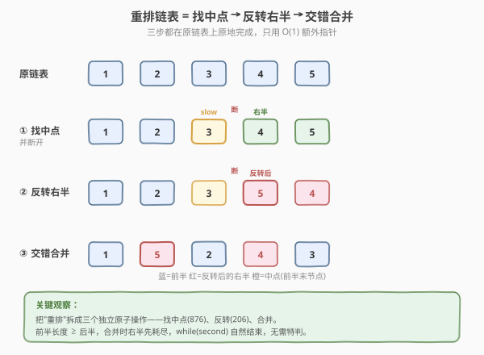
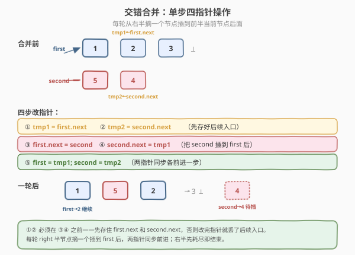
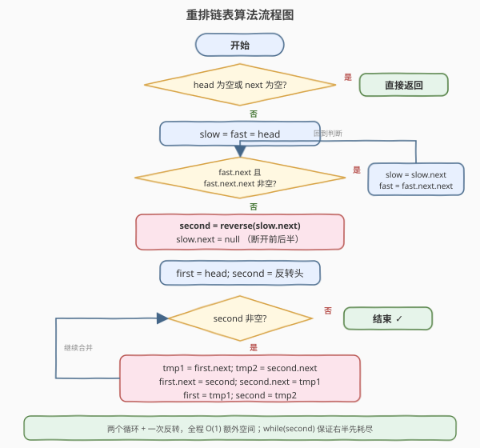
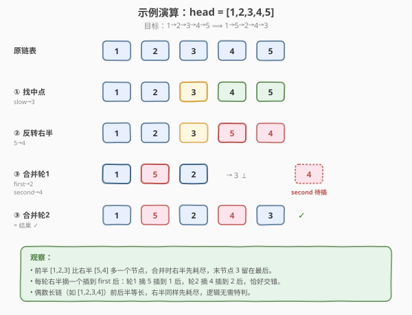

# LeetCode 重排链表 题解

## 1. 题目概述

- **标题 / 题号**：重排链表（#143，medium）
- **链接**：https://leetcode.cn/problems/reorder-list/
- **难度**：中等
- **标签**：链表、双指针、递归

**题意**：给定单链表 `L0 → L1 → ... → Ln-1 → Ln` 的头节点 `head`，请将其**原地**重排为：

```text
L0 → Ln → L1 → Ln-1 → L2 → Ln-2 → ...
```

你不能只是修改节点内部的值，必须**实际修改节点的 `next` 指针**来完成重排。

**示例 1**：

```text
输入：head = [1,2,3,4]
输出：[1,4,2,3]
解释：首尾交替——1(头) → 4(尾) → 2 → 3。
```

**示例 2**：

```text
输入：head = [1,2,3,4,5]
输出：[1,5,2,4,3]
解释：1 → 5 → 2 → 4 → 3，中间的 3 留在最后。
```

**约束**：

- 链表长度 `[1, 5 * 10^4]`
- `1 <= Node.val <= 1000`

> 💡 这是一道"组合拳"题：它本身没有新算法，但把**找中点、反转链表、合并链表**三个原子操作串成一条流水线。掌握它等于同时复习了 876（找中点）、206（反转）和链表合并，是面试中链表综合能力的标准试金石。

## 2. 解题思路

### 2.1 暴力思路：线性表按下标重连

最直白的做法：一遍遍历把所有节点存进数组，然后按下标 `0, n-1, 1, n-2, 2, n-3, ...` 的顺序依次重连 `next` 指针。

- **时间** `O(n)`，**空间** `O(n)`（数组存了所有节点指针）。
- 正确、好写，但题目明确要求"原地"，开 `O(n)` 数组不符合面试官对空间的要求。

```python
def reorderList(self, head):
    nodes = []
    cur = head
    while cur:
        nodes.append(cur)
        cur = cur.next
    i, j = 0, len(nodes) - 1
    while i < j:
        nodes[i].next = nodes[j]
        i += 1
        nodes[j].next = nodes[i] if i < j else None
        j -= 1
    nodes[i].next = None   # 处理奇数长度时中间节点收尾
```

> ⚠️ 这种写法虽然能 AC，但**没有练习到链表指针操作**，面试时通常会被追问"能不能做到 `O(1)` 额外空间"。下面的三步法才是正解。

### 2.2 核心观察：找中点 → 反转右半 → 交错合并

把"重排"拆解成三个独立的原子操作，每一步都只改指针、只用 `O(1)` 额外空间：

1. **找中点**：用快慢指针定位链表中点，把链表切成前后两半。
2. **反转右半**：把后半段反转，使其从"正向"变成"逆向"，方便从尾部往头部取节点。
3. **交错合并**：前半与反转后的后半逐个交替拼接。



**为什么这样能拼出目标序列？** 目标序列 `L0 → Ln → L1 → Ln-1 → ...` 本质是"前半正序"与"后半逆序"的交错。前半天然正序，后半只要反转一下就得到逆序，然后两边轮流取一个节点接上即可。

> 💡 **关键转化**：不要想着"每次去链表尾部摘一个节点"（摘尾要遍历到尾，`O(n²)`），而是**先把后半反转**，这样"尾部节点"变成了反转后的"头部节点"，`O(1)` 就能取到。

### 2.3 三步详解

**第一步：找中点（快慢指针）**

`slow` 走一步、`fast` 走两步，当 `fast` 到尾时 `slow` 恰在中点。循环条件用 `fast.next && fast.next.next`，可保证 `slow` 停在**前半的最后一个节点**（前半长度 ≥ 后半）。

```text
1 → 2 → 3 → 4 → 5
        ↑slow      （slow 停在 3，后半从 4 开始）
1 → 2 → 3 → 4
    ↑slow          （slow 停在 2，后半从 3 开始）
```

找到后立刻 `slow.next = null` **断开**前后半，避免合并时形成环。

> ⚠️ **为什么前半要比后半长或相等？** 合并时我们用 `while (second)` 控制循环，右半较短会先耗尽，循环自然结束，末尾不需要特判。若前半短，`first` 会先到 `null`，剩余右半节点接不上。所以中点判断条件务必让前半 ≥ 后半。

**第二步：反转右半（套用 206）**

标准的"三指针掉头"反转：`prev`、`curr`、`nxt`，逐个把 `curr.next` 指向 `prev`，三指针整体右移。反转后右半的头节点变成原来的尾节点。

**第三步：交错合并**

这是最容易写错的一步。设 `first` 指向前半当前节点、`second` 指向反转后右半当前节点。每轮把 `second` 插到 `first` 后面，然后两指针各前进一步。



单步四指针操作：

1. `tmp1 = first.next`　—— 存住前半下一个入口
2. `tmp2 = second.next`　—— 存住右半下一个入口
3. `first.next = second`　—— 把 `second` 接到 `first` 后
4. `second.next = tmp1`　—— `second` 接上原前半的后续

然后 `first = tmp1`、`second = tmp2`，两指针同步前进，进入下一轮。

> ⚠️ **顺序不能错**：①② 必须在 ③④ 之前。一旦先执行 `first.next = second`，原 `first.next` 就被覆盖丢了，后续入口断裂。所以先存 `tmp1/tmp2`，再改指针。

### 2.4 算法流程图



### 2.5 示例演算

以 `head = [1,2,3,4,5]` 为例，目标重排为 `1→5→2→4→3`：



| 阶段 | 操作 | 链表状态 |
|------|------|----------|
| 原链表 | — | 1→2→3→4→5 |
| ① 找中点 | slow 走到 3，后半从 4 开始 | 1→2→3  ⊥  4→5 |
| ② 反转右半 | 反转 4→5 | 1→2→3  /  5→4 |
| ③ 合并轮 1 | 摘 5 插到 1 后 | 1→5→2→3  +  second→4 |
| ③ 合并轮 2 | 摘 4 插到 2 后 | **1→5→2→4→3** ✓ |
| 结束 | second 为空，循环结束 | first→3 自然作尾 |

两轮合并后右半耗尽，`first` 停在节点 3（前半末节点，`next` 已在断开时设为 `null`），正好作尾，无需收尾操作。

> 💡 若是偶数长链 `[1,2,3,4]`：中点 slow=2，前半 `[1,2]`、后半反转得 `[4,3]`，合并两轮得 `1→4→2→3`。前后半等长时右半同样先耗尽，逻辑完全一致，无需特判。

## 3. 参考代码

### C++

```cpp
/**
 * Definition for singly-linked list.
 * struct ListNode {
 *     int val;
 *     ListNode *next;
 *     ListNode() : val(0), next(nullptr) {}
 *     ListNode(int x) : val(x), next(nullptr) {}
 *     ListNode(int x, ListNode *next) : val(x), next(next) {}
 * };
 */
class Solution {
  public:
    void reorderList(ListNode* head) {
        if (!head || !head->next) return;
        // ① 找中点：slow 停在前半最后一个节点
        ListNode* slow = head;
        ListNode* fast = head;
        while (fast->next && fast->next->next) {
            slow = slow->next;
            fast = fast->next->next;
        }
        // ② 断开 + 反转右半
        ListNode* second = reverseList(slow->next);
        slow->next = nullptr;
        // ③ 交错合并
        ListNode* first = head;
        while (second) {
            ListNode* tmp1 = first->next;
            ListNode* tmp2 = second->next;
            first->next = second;       // second 插到 first 后
            second->next = tmp1;        // 接上原前半后续
            first = tmp1;
            second = tmp2;
        }
    }
  private:
    ListNode* reverseList(ListNode* head) {
        ListNode* prev = nullptr;
        while (head) {
            ListNode* nxt = head->next;
            head->next = prev;
            prev = head;
            head = nxt;
        }
        return prev;
    }
};
```

### Python

```python
# Definition for singly-linked list.
# class ListNode:
#     def __init__(self, val=0, next=None):
#         self.val = val
#         self.next = next
class Solution:
    def reorderList(self, head: Optional[ListNode]) -> None:
        if not head or not head.next:
            return
        # ① 找中点：slow 停在前半最后一个节点
        slow = fast = head
        while fast.next and fast.next.next:
            slow = slow.next
            fast = fast.next.next
        # ② 断开 + 反转右半
        second = self._reverse(slow.next)
        slow.next = None
        # ③ 交错合并
        first = head
        while second:
            tmp1, tmp2 = first.next, second.next
            first.next = second            # second 插到 first 后
            second.next = tmp1             # 接上原前半后续
            first, second = tmp1, tmp2

    def _reverse(self, head: Optional[ListNode]) -> Optional[ListNode]:
        prev = None
        while head:
            nxt = head.next
            head.next = prev
            prev = head
            head = nxt
        return prev
```

> 💡 两版代码结构一致：找中点用 `while fast.next and fast.next.next`；反转是 206 的标准三指针；合并用 `tmp1/tmp2` 先存后续入口再改指针。注意 `slow.next = None` 这一行不可省——它切断前后半，保证合并后前半末节点自然成尾。

## 4. 复杂度分析

| 维度 | 复杂度 | 说明 |
|------|--------|------|
| **时间复杂度** | `O(n)` | 找中点遍历 `n/2`，反转右半遍历 `n/2`，合并遍历 `n/2`，总计约 `1.5n`，线性 |
| **空间复杂度** | `O(1)` | 仅用 `slow`/`fast`/`first`/`second`/`tmp1`/`tmp2`/`prev` 等常数个指针，原地操作 |

> ⚠️ 若用线性表法空间为 `O(n)`；若用"每次摘尾"法时间为 `O(n²)`。三步法是时间与空间的最优解。

## 5. 扩展：递归法的代价

本题也能用**递归**做：递归到链表末尾，回溯时把尾节点插到当前头节点之后，并用一个全局指针从前往后推进。核心是"双向往中间收拢"。

```python
def reorderList(self, head):
    def rec(node):
        if not node:
            return False
        stop = rec(node.next)
        if stop:
            return True
        if node is self.front or self.front.next is node:
            node.next = None
            return True
        tmp = self.front.next
        self.front.next = node
        node.next = tmp
        self.front = tmp
        return False
    self.front = head
    rec(head)
```

- **时间** `O(n)`、**空间** `O(n)`（递归栈深度为链表长度）。
- 思路巧妙但空间不优，且链表很长时可能栈溢出。**面试作为补充思路提及即可**，主答仍推荐三步迭代法。

> 💡 递归法的价值在于展示"链表 + 双向收拢"的思维方式，与 [234. 回文链表](https://leetcode.cn/problems/palindrome-linked-list/) 的递归后序遍历思路一脉相承。

## 6. 面试要点

1. **为什么用快慢指针找中点，而不是先数长度再走一半？**

   - 快慢指针**一遍**定位中点，`O(n)` 时间 `O(1)` 空间；数长度则要两遍遍历（先数 `n` 再走 `n/2`），虽同为 `O(n)` 但常数更大。更重要的是快慢指针是链表找中点的**通用模板**（876），面试官想看到你对这个模板的熟练度。
   - 循环条件必须是 `fast.next && fast.next.next`：保证 `slow` 停在**前半最后一个节点**，使前半 ≥ 后半。

2. **为什么要断开 `slow.next = null`？**

   - 不断开，前半末节点仍指向右半头，合并时会形成环或错连。断开后前半成为独立链，合并循环结束后前半末节点的 `next` 恰为 `null`（断开时设定），自然作尾，无需额外收尾。

3. **合并时为什么用 `while (second)` 而不是 `while (first && second)`？**

   - 前半长度 ≥ 后半，右半必然先耗尽，用 `second` 作循环条件即可，且循环结束时 `first` 恰好指向前半末节点。若写 `first && second`，当 `first` 多一个时也能正确停止，但语义上 `second` 才是较短的一边，用它更准确。

4. **合并的四步赋值顺序能换吗？**

   - ①②（存 `tmp1`/`tmp2`）必须在 ③④（改 `first.next`/`second.next`）之前，否则 `first.next` 被覆盖后原后续入口丢失。③④ 内部顺序：先 `first.next = second` 再 `second.next = tmp1`，不能反过来——若先 `second.next = tmp1` 再 `first.next = second`，逻辑上也可，但易和"接前半后续"混淆，推荐固定"先接 `second` 到 `first` 后，再让 `second` 接前半后续"的顺序。

5. **和 234 回文链表是什么关系？**

   - 几乎同款三步：234 是"找中点 → 反转右半 → **比较**前后半是否相等"，143 是"找中点 → 反转右半 → **交错合并**"。掌握 143 等于掌握了 234 的前两步，只需把"合并"换成"逐节点比较"即可。

> 💡 **一句话总结**：143 把重排拆成"找中点（876）+ 反转（206）+ 交错合并"三步，全程 `O(n)` 时间 `O(1)` 空间。难点只在合并那四步指针操作——先存 `tmp1/tmp2` 保住入口，再 `first.next=second`、`second.next=tmp1`，两指针同步前进。它是链表综合操作的集大成题，也是 234 回文链表的"姊妹题"。

## 同类练习题

| # | 题目 | 与本题的关联 |
|---|------|-------------|
| 876 | [链表的中间结点](https://leetcode.cn/problems/middle-of-the-linked-list/) | 纯找中点，本题第一步的原子操作，模板完全复用 |
| 206 | [反转链表](https://leetcode.cn/problems/reverse-linked-list/) | 整条反转，本题第二步的原子操作，三指针掉头基础 |
| 234 | [回文链表](https://leetcode.cn/problems/palindrome-linked-list/) | 找中点 + 反转 + 比较，几乎同款三步，把"合并"换成"比较"即可 |
| 92 | [反转链表 II](https://leetcode.cn/problems/reverse-linked-list-ii/) | 区间反转，链表指针操作进阶，强化改 `next` 的熟练度 |
| 25 | [K 个一组翻转链表](https://leetcode.cn/problems/reverse-nodes-in-k-group/) | 分段反转，反转操作的批量综合应用 |
