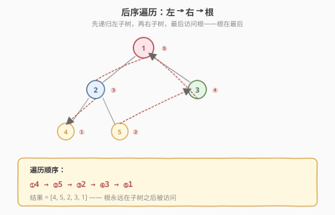
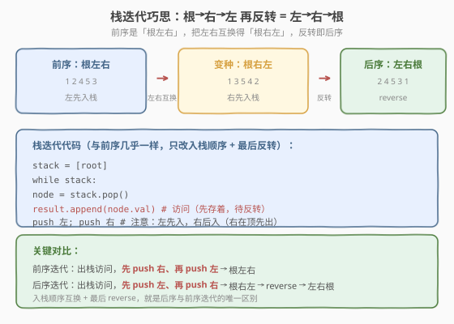
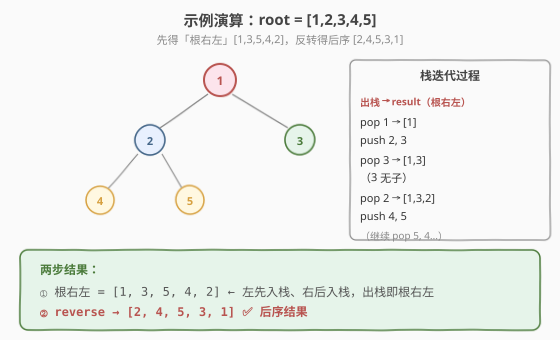

# 二叉树的后序遍历

- **题目名称**：二叉树的后序遍历
- **链接**：[145. 二叉树的后序遍历](https://leetcode.cn/problems/binary-tree-postorder-traversal/)
- **难度**：简单
- **标签**：树、栈

## 1. 题目概述

给定二叉树的根节点 `root`，返回其节点值的**后序遍历**结果。后序遍历的顺序为：**左 → 右 → 根**。

**示例 1**：

```text
输入：root = [1,null,2,3]
    1
     \
      2
     /
    3
输出：[3,2,1]
```

**示例 2**：

```text
输入：root = [1,2,3,4,5]
        1
       / \
      2   3
     / \
    4   5
输出：[4,5,2,3,1]
```

**约束条件**：

- 树中节点数目范围 `[0, 100]`
- `-100 <= Node.val <= 100`

> 💡 后序遍历是三种遍历里**迭代最难写**的一个——因为「根在最后」，必须等左右子树都访问完才能访问根，栈迭代时难以判断「何时该访问根」。本题有个巧妙技巧：把前序迭代的入栈顺序反过来，得到「根右左」，再 `reverse` 就是后序「左右根」。掌握这个技巧，后序迭代就和前序一样简单。

---

## 2. 解题思路

### 2.1 基础思路：递归

后序的递归定义与前序同构，只是「访问根」的位置挪到最后：

```text
postorder(node):
    if node == null: return
    postorder(node.left)       // ① 左
    postorder(node.right)      // ② 右
    result.append(node.val)    // ③ 根（最后）
```

### 2.2 核心观察：前序反转法



后序「左右根」很难直接用栈模拟，但有一个巧妙的转换：

| 遍历 | 顺序 | 栈迭代入栈顺序 |
|------|------|--------------|
| 前序 | 根 左 右 | 先右后左 |
| 变种 | 根 右 左 | 先左后右 |
| 后序 | 左 右 根 | = 变种的反转 |

**关键洞察**：把前序迭代的「先右后左入栈」改成「先左后右入栈」，出栈顺序就从「根左右」变成「根右左」。再把结果 `reverse`，就得到「左右根」——即后序！



> 💡 为什么要绕这一圈？因为「根在前」的遍历（前序/变种）用栈很好写——出栈即访问，孩子入栈即可。而「根在后」的后序需要判断「左右子树是否已访问」，直接写很复杂。反转法把后序转化为两个简单操作：变种前序 + `reverse`，避开了「判断子树访问状态」的难题。

### 2.3 算法流程图

**反转法完整步骤**：

1. **特判**：`root == null` 返回空列表
2. **初始化**：栈 `stack = [root]`，结果 `result = []`
3. **while 栈非空**：
   - `node = stack.pop()`（出栈）
   - `result.append(node.val)`（先存着，此时是「根右左」顺序）
   - `if node.left: stack.push(node.left)`（左先入栈）
   - `if node.right: stack.push(node.right)`（右后入栈，右在顶先出）
4. **反转**：`reverse(result)`
5. 返回 `result`

> ⚠️ 与前序迭代的**唯一区别**：① 入栈顺序从「先右后左」改成「先左后右」；② 最后多一步 `reverse`。记住了这点，后序迭代就不再难。

### 2.4 示例演算

以 `root = [1,2,3,4,5]` 为例：



**栈迭代过程**（先左后右入栈）：

| 步骤 | 栈（底→顶） | 出栈节点 | 访问 | 入栈（左先右后） | result（根右左） |
|------|-----------|---------|------|----------------|-----------------|
| 1 | [1] | 1 | 1 | push 2, push 3 → [2,3] | [1] |
| 2 | [2,3] | 3 | 3 | （无子）→ [2] | [1,3] |
| 3 | [2] | 2 | 2 | push 4, push 5 → [4,5] | [1,3,2] |
| 4 | [4,5] | 5 | 5 | （无子）→ [4] | [1,3,2,5] |
| 5 | [4] | 4 | 4 | （无子）→ [] | [1,3,2,5,4] |
| 6 | [] | — | 栈空，结束 | — | [1,3,2,5,4] |

**反转**：`[1,3,2,5,4]` → `[4,5,2,3,1]` ✅

> 💡 注意步骤 2：出栈 3（1 的右子，因为右后入栈在顶）先于 2（1 的左子）。这正符合「根右左」——先把右子树全访问完，再访问左子树。反转后变成「左右根」，左子树 [4,5,2] 在前、右子树 [3] 在中、根 [1] 在后。

---

## 3. 参考代码

### C++

```cpp
// 二叉树的后序遍历.cpp —— 递归 + 反转法栈迭代
#include <vector>
#include <stack>
#include <algorithm>
using namespace std;

struct TreeNode {
    int val;
    TreeNode* left;
    TreeNode* right;
    TreeNode() : val(0), left(nullptr), right(nullptr) {
    }
    TreeNode(int x) : val(x), left(nullptr), right(nullptr) {
    }
    TreeNode(int x, TreeNode* l, TreeNode* r) : val(x), left(l), right(r) {
    }
};

// 递归
class Solution {
  public:
    vector<int> postorderTraversal(TreeNode* root) {
        vector<int> result;
        dfs(root, result);
        return result;
    }
  private:
    void dfs(TreeNode* node, vector<int>& result) {
        if (!node) return;
        dfs(node->left, result);      // ① 左
        dfs(node->right, result);     // ② 右
        result.push_back(node->val);  // ③ 根
    }
};

// 反转法栈迭代
class SolutionIter {
  public:
    vector<int> postorderTraversal(TreeNode* root) {
        vector<int> result;
        if (!root) return result;
        stack<TreeNode*> st;
        st.push(root);
        while (!st.empty()) {
            TreeNode* node = st.top(); st.pop();
            result.push_back(node->val);         // 访问（根右左顺序）
            if (node->left)  st.push(node->left);  // 左先入栈
            if (node->right) st.push(node->right); // 右后入栈（右在顶先出）
        }
        reverse(result.begin(), result.end());   // 反转得左右根
        return result;
    }
};
```

### Python

```python
# 递归
class Solution:
    def postorderTraversal(self, root: TreeNode | None) -> list[int]:
        result = []
        def dfs(node):
            if not node:
                return
            dfs(node.left)            # ① 左
            dfs(node.right)           # ② 右
            result.append(node.val)   # ③ 根
        dfs(root)
        return result

# 反转法栈迭代
class SolutionIter:
    def postorderTraversal(self, root: TreeNode | None) -> list[int]:
        result = []
        if not root:
            return result
        stack = [root]
        while stack:
            node = stack.pop()
            result.append(node.val)          # 访问（根右左顺序）
            if node.left:
                stack.append(node.left)      # 左先入栈
            if node.right:
                stack.append(node.right)     # 右后入栈（右在顶先出）
        result.reverse()                     # 反转得左右根
        return result
```

> 💡 Python 的 `list.reverse()` 是原地反转 `O(n)`，也可用 `result[::-1]` 返回新列表。C++ 用 `std::reverse` 同样原地反转。反转的 `O(n)` 不影响整体复杂度——遍历本身就是 `O(n)`。

---

## 4. 复杂度分析

| 维度 | 复杂度 | 说明 |
|------|--------|------|
| **时间复杂度** | `O(n)` | 每个节点入栈/出栈一次 + 反转一次 |
| **空间复杂度** | `O(h)` | 栈深度 = 树高 `h`；最坏链状 `O(n)` |

> ⚠️ 反转法的 `reverse` 是 `O(n)`，但遍历也是 `O(n)`，总时间仍 `O(n)`（`2n` 量级）。与前序迭代的 `O(n)` 同阶，常数因子稍大但可忽略。空间上栈深度 `O(h)` 与前序一致。

---

## 5. 扩展：prev 标记法（不反转的栈迭代）

反转法虽然简单，但需要额外 `O(n)` 反转。若想「一次性」按后序顺序输出，可用 **prev 标记法**——记录上一个访问的节点，判断右子树是否已访问：

```python
class Solution:
    def postorderTraversal(self, root: TreeNode | None) -> list[int]:
        result = []
        if not root:
            return result
        stack = []
        prev = None
        node = root
        while node or stack:
            while node:                         # 一路向左压栈
                stack.append(node)
                node = node.left
            node = stack.pop()
            if node.right and node.right != prev:  # 右子存在且未访问
                stack.append(node)              # 当前节点重新入栈
                node = node.right               # 转向右子
            else:
                result.append(node.val)         # 访问当前节点
                prev = node                     # 记录已访问
                node = None
        return result
```

> 💡 `prev` 标记法的核心：出栈一个节点后，若它有右子且右子未访问（`prev != node.right`），就把当前节点重新入栈、转向右子；否则访问当前节点。这保证「左右根」的顺序——右子树访问完（`prev == node.right`）才访问根。代码比反转法复杂，但无需反转、严格 `O(n)` 时间、`O(h)` 空间。

---

## 6. 面试要点

1. **后序为什么比前序难迭代？**

   - 前序「根在前」：出栈即访问，孩子入栈即可，无需判断。
   - 后序「根在后」：出栈一个节点时，不能立即访问——必须先确认左右子树都已访问完。若右子树未访问，当前节点要重新入栈、先去右子树。
   - 反转法巧妙避开这个难点：先按「根右左」访问（根在前，好写），再反转。

2. **反转法的「根右左」是怎么得到的？**

   - 前序迭代「根左右」：先 push 右、再 push 左（左在顶先出）。
   - 把入栈顺序换成先 push 左、再 push 右（右在顶先出），出栈顺序就变成「根右左」。
   - 「根右左」反转 = 「左右根」= 后序。本质是：后序 = reverse(根右左)。

3. **反转法 vs prev 标记法，哪个更好？**

   - 反转法：代码极简（与前序只差入栈顺序 + reverse），但需 `O(n)` 反转。
   - prev 标记法：无需反转、严格一次遍历，但代码复杂、易写错。
   - 面试推荐反转法——简洁不易错，`O(n)` 反转不影响总复杂度。若面试官追问「能否不反转」，再写 prev 标记法。

4. **后序遍历有什么实际应用？**

   - **删除树**：必须先删子树再删根（否则删了根就找不到子树了）——后序天然适合。
   - **计算目录大小**：先算子目录大小，再汇总到父目录——后序汇总。
   - **表达式树求值**：先算左右子树（操作数），再算根（运算符）——后序。
   - 后序的「根在最后」适合「需要子树结果才能处理根」的场景，与 [236. 最近公共祖先](https://leetcode.cn/problems/lowest-common-ancestor-of-a-binary-tree/) 的后序 DFS 同理。

5. **三种遍历的递归骨架有何区别？**

   - 完全相同，只有「访问根」这行的位置不同：
     - 前序：`visit(root); dfs(left); dfs(right)` —— 根在前
     - 中序：`dfs(left); visit(root); dfs(right)` —— 根在中
     - 后序：`dfs(left); dfs(right); visit(root)` —— 根在后
   - 一行代码的位置决定了遍历顺序，这是理解三种遍历的最简视角。

> 💡 **一句话总结**：后序遍历「左右根」的栈迭代难点在于「根在最后」，反转法巧妙化解——把入栈顺序改成「先左后右」得到「根右左」，再 `reverse` 就是后序。记住「后序迭代 = 前序迭代交换入栈顺序 + reverse」，三种遍历的迭代写法就都掌握了。

---

## 7. 同类练习题

- [144. 二叉树的前序遍历](https://leetcode.cn/problems/binary-tree-preorder-traversal/)：根左右，栈迭代先右后左（[题解](144_二叉树的前序遍历.md)）
- [94. 二叉树的中序遍历](https://leetcode.cn/problems/binary-tree-inorder-traversal/)：左根右，栈迭代一路向左（[题解](../0001-0100/94_二叉树的中序遍历.md)）
- [590. N 叉树的后序遍历](https://leetcode.cn/problems/n-ary-tree-postorder-traversal/)：N 叉树版，孩子入栈后反转
- [236. 二叉树的最近公共祖先](https://leetcode.cn/problems/lowest-common-ancestor-of-a-binary-tree/)：后序 DFS 汇总（[题解](../0201-0300/236_二叉树的最近公共祖先.md)）
- [114. 二叉树展开为链表](https://leetcode.cn/problems/flatten-binary-tree-to-linked-list/)：后序（右左根）展开（[题解](114_二叉树展开为链表.md)）
