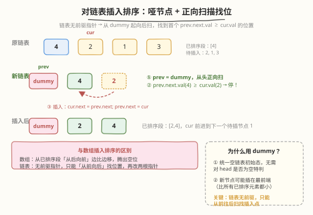
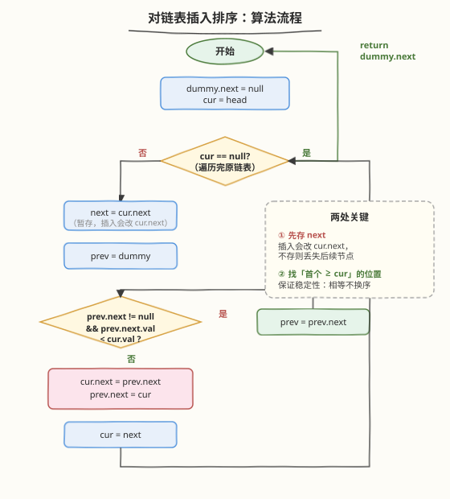

# 对链表进行插入排序

- **题目名称**：对链表进行插入排序
- **链接**：[147. 对链表进行插入排序](https://leetcode.cn/problems/insertion-sort-list/)
- **难度**：中等
- **标签**：链表、排序、插入排序、模拟

## 1. 题目概述

给定单个链表的头节点 `head`，请使用**插入排序**对链表进行排序，并返回排序后链表的头节点。

**插入排序的算法步骤**（题目给定，数组版）：

1. 从第一个元素开始，该元素可认为已被排序；
2. 取出下一个元素，在已排序的元素序列中**从后向前**扫描；
3. 如果该元素（已排序）大于新元素，将该元素移到下一位置；
4. 重复步骤 3，直到找到已排序元素小于或等于新元素的位置；
5. 将新元素插入到该位置后；
6. 重复步骤 2~5。

> ⚠️ 链表没有前驱指针，无法"从后向前"扫描——这是本题的核心改编点：改为**从哑节点起正向扫描**找插入位置。

**示例 1**：

```text
输入：head = [4,2,1,3]
输出：[1,2,3,4]
```

**示例 2**：

```text
输入：head = [-1,5,3,4,0]
输出：[-1,0,3,4,5]
```

**示例 3**：

```text
输入：head = []
输出：[]
```

**约束条件**：

- 链表中节点数目在范围 `[0, 500]` 内
- `-5000 <= Node.val <= 5000`

> 💡 注意节点数上界只有 `500`，远小于 148 题的 `5 * 10^4`——这暗示 `O(n²)` 的插入排序在本题规模下是可接受的，本题考的就是"插入排序"本身，而非追求 `O(n log n)`。

---

## 2. 解题思路

### 2.1 暴力思路（转数组排序）

把链表值复制到数组，`sort()` 排序后重建链表。`O(n log n)` 时间、`O(n)` 空间。**违背题目要求**（题目明确要求用插入排序），但可作为"先说一个能跑的解"再引入正解的过渡。

### 2.2 核心观察：哑节点 + 正向扫描插入



数组的插入排序"从后向前"是为了边比边移、原地腾位。链表改用**新建一条已排序链表**的思路：

1. **哑节点 `dummy`**：挂在已排序链表最前端，统一"插在最前面"的边界（新节点比所有已排序元素都小时无需特判）。
2. **逐节点摘下**：`cur` 指向原链表当前待插节点，**先存 `next = cur.next`**（因为插入会改 `cur.next`，不存就丢链）。
3. **正向扫描找位**：`prev` 从 `dummy` 起向后走，停在**首个 `prev.next.val >= cur.val`** 的位置（用 `>=` 而非 `>`，保证稳定性——相等元素不换序）。
4. **两步改指针插入**：`cur.next = prev.next; prev.next = cur;`
5. `cur = next`，回到步骤 2，直到原链表遍历完。

> 💡 **为什么是 `prev.next.val < cur.val` 才前进？** 因为我们要找的是"第一个不小于 cur 的位置"，等价于"跳过所有严格小于 cur 的节点"。停下来的 `prev.next` 要么为空（cur 最大，插末尾），要么 `prev.next.val >= cur.val`（插在 prev 之后）。

### 2.3 算法流程图



```text
dummy = new Node(-1)
cur = head
while cur != null:
    next = cur.next              # 暂存：插入会改 cur.next
    prev = dummy
    while prev.next != null and prev.next.val < cur.val:
        prev = prev.next         # 正向扫描，跳过所有 < cur 的
    cur.next = prev.next         # 插入两步曲
    prev.next = cur
    cur = next                   # 处理下一个
return dummy.next
```

### 2.4 示例演算

`head = [4,2,1,3]`，逐轮追踪已排序段状态：

![示例演算：head = [4,2,1,3]](../images/insertion_sort_list_walkthrough.svg)

| 轮次 | cur | prev 扫描路径 | 插入位置 | 已排序段（dummy 之后） |
|------|-----|--------------|----------|------------------------|
| 1 | 4 | dummy（prev.next=null） | 最前 | `4` |
| 2 | 2 | dummy（prev.next.val=4 ≥ 2，停） | 4 之前 | `2 → 4` |
| 3 | 1 | dummy（prev.next.val=2 ≥ 1，停） | 2 之前 | `1 → 2 → 4` |
| 4 | 3 | dummy → 1 → 2（prev.next.val=4 ≥ 3，停） | 2 与 4 之间 | `1 → 2 → 3 → 4` ✓ |

> ⚠️ **第 4 轮是关键**：`prev` 走过 `1`、`2`（都 `< 3`，继续前进），到达 `2` 时 `prev.next.val = 4 ≥ 3` 停下，把 `3` 插在 `2` 与 `4` 之间。这一步体现了"正向扫描"与数组版"从后向前"的对照：数组会从 `4` 往前比到 `2`，链表只能从 `dummy` 往后扫到 `2`。

---

## 3. 参考代码

### C++

```cpp
class Solution {
public:
    ListNode* insertionSortList(ListNode* head) {
        ListNode dummy(0);                 // 哑节点，统一"插最前"边界
        ListNode* cur = head;
        while (cur) {
            ListNode* next = cur->next;    // 暂存：插入会改 cur->next
            ListNode* prev = &dummy;
            // 正向扫描：跳过所有严格小于 cur 的已排序节点
            while (prev->next && prev->next->val < cur->val) {
                prev = prev->next;
            }
            cur->next = prev->next;        // 插入两步曲
            prev->next = cur;
            cur = next;                    // 处理原链表下一个
        }
        return dummy.next;
    }
};
```

### Python

```python
class Solution:
    def insertionSortList(self, head: Optional[ListNode]) -> Optional[ListNode]:
        dummy = ListNode(0)                # 哑节点，统一"插最前"边界
        cur = head
        while cur:
            nxt = cur.next                 # 暂存：插入会改 cur.next
            prev = dummy
            # 正向扫描：跳过所有严格小于 cur 的已排序节点
            while prev.next and prev.next.val < cur.val:
                prev = prev.next
            cur.next = prev.next           # 插入两步曲
            prev.next = cur
            cur = nxt                      # 处理原链表下一个
        return dummy.next
```

---

## 4. 复杂度分析

| 维度 | 复杂度 | 说明 |
|------|--------|------|
| **时间（最好）** | `O(n)` | 原链表已升序：每轮 `prev` 直接停（`prev.next.val >= cur.val`），不前进，总比较 `n` 次 |
| **时间（最坏）** | `O(n²)` | 原链表降序：每轮 `prev` 走完整段已排序部分，总比较 `1+2+…+(n−1) = n(n−1)/2` |
| **时间（平均）** | `O(n²)` | 每轮平均扫描已排序段的一半 |
| **空间** | `O(1)` | 仅 `dummy/cur/prev/next` 几个指针，原地改链，无递归栈、无额外数组 |
| **稳定性** | 稳定 ✓ | 用 `<`（而非 `<=`）作前进条件，相等元素不换序，相对次序保持 |

> 💡 **对比 148**：148 题要求 `O(n log n)` 故用归并排序；本题节点数 ≤ 500，规模小，`O(n²)` 完全可接受，考的就是插入排序在链表上的正确改编。

---

## 5. 扩展：链表插入排序 vs 数组插入排序

| 维度 | 数组插入排序 | 链表插入排序 |
|------|--------------|--------------|
| 扫描方向 | 从后向前 | 从前向后（哑节点起） |
| 腾位方式 | 边比边后移元素 | 改两根指针，无需移动 |
| 插入代价 | `O(n)` 移动 + `O(n)` 比较 | `O(1)` 改指针 + `O(n)` 比较 |
| 空间 | `O(1)` 原地 | `O(1)` 原地 |
| 稳定性 | 稳定 | 稳定 |
| 缓存友好 | 好（连续内存） | 差（节点分散） |

链表的优势在于"插入只需改指针、无需批量移动元素"；劣势在于无法随机访问、缓存不友好。**这也是链表排序通常用归并（148）而非插入的原因**——但本题规模小且明确要求插入排序，正好考察这一改编。

---

## 6. 面试要点

1. **为什么链表插入排序要"从前向后"扫，而数组"从后向前"？**

   - 数组从后向前是为了边比边移、原地腾出空位（`a[j+1] = a[j]`）
   - 链表无前驱指针，无法回退；但插入只需改两根指针（无需批量后移），所以从哑节点正向扫到合适位置即可插入

2. **哑节点 `dummy` 的作用是什么？能不能不用？**

   - 不用哑节点时，新节点若比已排序段所有元素都小（要插在最前），需特判更新 `head`
   - 用 `dummy` 后，新节点永远插在某个 `prev` 之后（最前时 `prev = dummy`），无需特判，逻辑统一
   - 这是链表题的通用套路：凡可能修改头节点的操作都加 `dummy`（参见 21 合并有序链表、82 删重复、86 分隔链表）

3. **为什么必须先存 `next = cur.next`？**

   - 插入操作 `cur.next = prev.next` 会覆盖 `cur` 原本的 `next` 指针
   - 若不先存，插入后 `cur.next` 指向已排序段，原链表后续节点就丢了
   - 这是链表指针操作的经典坑：**改指针前先存会被覆盖的值**

4. **前进条件用 `prev.next.val < cur.val` 还是 `<=`？**

   - 用 `<`（严格小于才前进），相等时停下插入在相等元素**之后**
   - 这保证稳定性：值相等的节点保持原相对次序
   - 若改 `<=`，相等元素会被换到前面，变为不稳定排序

5. **本题与 148 排序链表的本质区别？**

   - 算法：插入排序 `O(n²)` vs 归并排序 `O(n log n)`
   - 规模：本题 ≤ 500，148 ≤ `5*10^4`——约束暗示了期望复杂度
   - 适配性：链表天然适合归并（不需随机访问、合并是 `O(1)`），插入排序在链表上无优势（比较次数一样多，只是省了元素移动）
   - 面试策略：先说插入排序的正确实现（本题要求），再主动提"节点多时改用归并（148）优化到 `O(n log n)`"

---

## 7. 同类练习题

- [148. 排序链表](https://leetcode.cn/problems/sort-list/)（[题解](148_排序链表.md)）：链表排序的进阶版，要求 `O(n log n)`，用归并排序——对照本题的插入排序 `O(n²)`
- [21. 合并两个有序链表](https://leetcode.cn/problems/merge-two-sorted-lists/)：哑节点 + 尾插的经典模板，归并排序链表的子过程，与本题同用 `dummy` 套路
- [86. 分隔链表](https://leetcode.cn/problems/partition-list/)：双子链 + 哑节点尾插拼接，同样是"逐节点摘下、按规则插入新链"的链表改编范式
- [82. 删除排序链表中的重复元素 II](https://leetcode.cn/problems/remove-duplicates-from-sorted-list-ii/)：哑节点统一头节点删除边界，与本题 `dummy` 用途一致
- [707. 设计双向链表](https://leetcode.cn/problems/design-linked-list/)：哑节点 + 指针操作基本功，强化"改指针前先存"的肌肉记忆
