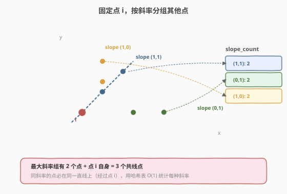
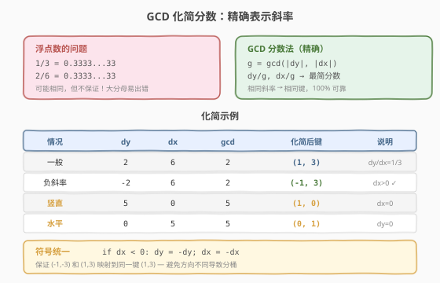
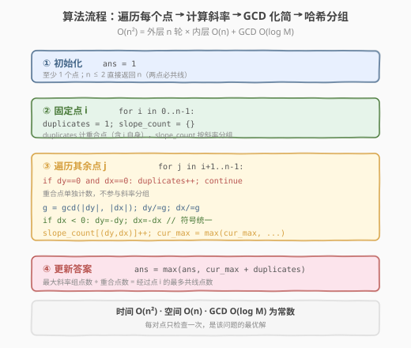

# LeetCode 直线上最多的点数 题解

## 1. 题目概述

- **标题 / 题号**：直线上最多的点数（#149，hard）
- **链接**：https://leetcode.cn/problems/max-points-on-a-line/
- **难度**：困难
- **标签**：哈希表、数学、几何

**题意**：给定一个平面上的点集 `points`，其中 `points[i] = [xi, yi]`，求**同一条直线上**最多的点数。

**示例 1**：

```text
输入：points = [[1,1],[2,2],[3,3]]
输出：3
解释：所有三个点都在直线 y = x 上
```

**示例 2**：

```text
输入：points = [[1,1],[3,2],[5,3],[4,1],[2,3],[1,4]]
输出：4
解释：点 [1,1]、[3,2]、[5,3] 在直线 y = (1/2)x + 1/2 上，共 4 个点
```

**约束**：

- `1 <= points.length <= 300`
- `points[i].length == 2`
- `-10^4 <= xi, yi <= 10^4`
- 所有点各不相同（但可能有完全重合的坐标）

> 💡 这是一道经典的**几何 + 哈希**题。核心直觉与「两数之和」异曲同工：两数之和对每个元素查"补数"，本题对每个点统计"与之斜率相同的其他点"。难点不在思路，而在**如何精确表示斜率**——浮点数有精度误差，必须用 GCD 化简分数来作为哈希键。

## 2. 解题思路

### 2.1 暴力思路：两两配对 + 逐条验证

最直观的做法：枚举所有点对 `(i, j)` 确定一条直线，再遍历所有点判断是否在该直线上，取最大值。

```text
for i in 0..n:
    for j in i+1..n:
        count = 2
        for k in 0..n:
            if k != i and k != j and 三点共线(i, j, k):
                count++
        ans = max(ans, count)
```

三点共线可用叉积判定：`(x2−x1)(y3−y1) == (x3−x1)(y2−y1)`。时间复杂度 $O(n^3)$，`n=300` 时约 $2.7 \times 10^7$，勉强能过但不够优雅。

> ⚠️ 暴力法的问题是：对同一条直线上的点对**重复验证**。比如直线 `y=x` 上有 3 个点，点对 (0,1)、(0,2)、(1,2) 确定的是同一条直线，却各验证一遍。破局思路：固定一个点，**按斜率分组**，同斜率的点天然在同一条直线上。

### 2.2 核心观察：固定一个点，按斜率分组



**关键转换**：对每个点 `i`，计算它到其余所有点的斜率。**斜率相同的点必在同一条直线上**（且都经过点 `i`）。

用哈希表 `slope_count` 记录"斜率 → 该斜率的点数"，对每个点 `i`：

1. 遍历其余所有点 `j`，计算斜率 `slope(i, j)`
2. `slope_count[slope]++`
3. 以点 `i` 为中心的最多共线点数 = `max(slope_count.values()) + 1`（加 1 是点 `i` 自身）

最终答案取所有点中的最大值。

> 💡 **为什么这样不会重复？** 每条直线被其经过的每个点各"发现"一次。比如直线 L 上有 4 个点 `{A, B, C, D}`，当固定 A 时发现 B/C/D 同斜率（计数 3 + A 自身 = 4），固定 B 时同样发现 4。虽然重复计算了同一条直线，但取 max 不影响正确性，且避免了暴力法的逐点验证。

### 2.3 关键难点：用 GCD 精确表示斜率



斜率 `slope = Δy / Δx`，但直接用浮点数 `dy / dx` 作为哈希键有**精度问题**：

- `1/3` 和 `2/6` 理论上斜率相同，但浮点除法结果可能因舍入误差而不一致
- `3/0`（竖直线）会触发除零异常

**解法**：把斜率表示为**最简分数** `(Δy/g, Δx/g)`，其中 `g = gcd(|Δy|, |Δx|)`。化简后相同的分数一定代表同一斜率。

| 情况 | Δy | Δx | g | 化简后键 |
|------|-----|-----|---|---------|
| 一般 | 2 | 6 | 2 | `(1, 3)` |
| 一般 | 4 | 6 | 2 | `(2, 3)` |
| 一般 | -2 | 6 | 2 | `(-1, 3)` |
| 竖直 | 5 | 0 | 5 | `(1, 0)` |
| 水平 | 0 | 5 | 5 | `(0, 1)` |

**符号统一**：化简后让 `Δx` 始终非负（若 `Δx < 0`，则 `Δy` 和 `Δx` 同时取反），保证 `(1, 3)` 和 `(-1, -3)` 映射到同一个键。

> ⚠️ **重合点**需单独计数。当 `Δy == 0 && Δx == 0` 时表示点 `j` 与点 `i` 重合，不能当作某个斜率，而是单独用 `duplicates` 计数，最后加到所有斜率分组的结果上。

### 2.4 算法流程图



**完整步骤**：

1. **初始化** `ans = 1`（至少 1 个点）
2. **外层循环**：对每个点 `i`
   - `duplicates = 1`（点 `i` 自身）
   - `slope_count = {}`（空哈希表）
   - **内层循环**：对每个点 `j ≠ i`
     - 若 `points[j] == points[i]`：`duplicates++`，跳过
     - 否则计算 `Δy = yj − yi`，`Δx = xj − xi`
     - `g = gcd(|Δy|, |Δx|)`
     - `Δy /= g`，`Δx /= g`
     - **符号统一**：若 `Δx < 0`，则 `Δy = −Δy`，`Δx = −Δx`
     - `slope_count[(Δy, Δx)]++`
   - `cur = duplicates + (max(slope_count.values()) if slope_count else 0)`
   - `ans = max(ans, cur)`
3. 返回 `ans`

### 2.5 示例演算

以 `points = [[1,1],[2,2],[3,3],[4,1],[1,4]]` 为例，看固定点 `i=0` 即 `(1,1)` 时如何统计：

| 点 j | 坐标 | Δy | Δx | g | 化简 (Δy, Δx) | slope_count |
|-------|------|-----|-----|---|-------------|-------------|
| 1 | (2,2) | 1 | 1 | 1 | (1, 1) | {(1,1): 1} |
| 2 | (3,3) | 2 | 2 | 2 | (1, 1) | {(1,1): 2} |
| 3 | (4,1) | 0 | 3 | 3 | (0, 1) | {(1,1): 2, (0,1): 1} |
| 4 | (1,4) | 3 | 0 | 3 | (1, 0) | {(1,1): 2, (0,1): 1, (1,0): 1} |

- `duplicates = 1`（无重合点）
- 最大斜率组 `(1,1)` 有 2 个点，加自身 = **3**
- 即点 (1,1)、(2,2)、(3,3) 共线（直线 y = x）

> 💡 点 `i=0` 得到 3。继续检查其他点也会得到同样的最大值 3。最终答案为 **3**。

## 3. 参考代码

### C++

```cpp
// 直线上最多的点数.cpp —— 固定点 + GCD 斜率哈希
// 编译: g++ -O2 -std=c++17 直线上最多的点数.cpp -o maxpoints
#include <vector>
#include <unordered_map>
#include <algorithm>
#include <numeric>
using namespace std;

class Solution {
  public:
    int maxPoints(vector<vector<int>>& points) {
        int n = points.size();
        if (n <= 2) return n;
        int ans = 1;

        for (int i = 0; i < n; ++i) {
            int duplicates = 1;
            unordered_map<long long, int> slope_count;
            int cur_max = 0;

            for (int j = i + 1; j < n; ++j) {
                int dy = points[j][1] - points[i][1];
                int dx = points[j][0] - points[i][0];

                if (dy == 0 && dx == 0) {
                    duplicates++;
                    continue;
                }

                int g = gcd(abs(dy), abs(dx));
                dy /= g;
                dx /= g;

                if (dx < 0) { dy = -dy; dx = -dx; }

                long long key = (long long)dy * 100000LL + dx;
                cur_max = max(cur_max, ++slope_count[key]);
            }
            ans = max(ans, cur_max + duplicates);
        }
        return ans;
    }
};
```

### Python

```python
from math import gcd
from collections import defaultdict

class Solution:
    def maxPoints(self, points: list[list[int]]) -> int:
        n = len(points)
        if n <= 2:
            return n
        ans = 1

        for i in range(n):
            duplicates = 1
            slope_count = defaultdict(int)
            cur_max = 0

            for j in range(i + 1, n):
                dy = points[j][1] - points[i][1]
                dx = points[j][0] - points[i][0]

                if dy == 0 and dx == 0:
                    duplicates += 1
                    continue

                g = gcd(abs(dy), abs(dx))
                dy //= g
                dx //= g

                if dx < 0:
                    dy, dx = -dy, -dx

                slope_count[(dy, dx)] += 1
                cur_max = max(cur_max, slope_count[(dy, dx)])

            ans = max(ans, cur_max + duplicates)
        return ans
```

> ⚠️ C++ 中用 `long long` 编码斜率键（`dy * 100000 + dx`），因为 `pair<int,int>` 需自定义哈希。`dx` 范围 `[-10^4, 10^4]`，化简后绝对值 ≤ `10^4`，乘 `10^5` 不会溢出 `long long`。Python 直接用元组 `(dy, dx)` 作键更简洁。

## 4. 复杂度分析

| 维度 | 复杂度 | 说明 |
|------|--------|------|
| **时间复杂度** | $O(n^2)$ | 外层 $n$ 轮 × 内层 $O(n)$ 遍历其余点，每对计算 GCD $O(\log M)$（$M$ 为坐标范围） |
| **空间复杂度** | $O(n)$ | 每轮的哈希表最多存 $n-1$ 个斜率 |
| **最优时间** | $O(n^2)$ | 该问题下界为 $O(n^2)$（每对点至少检查一次） |

> 💡 GCD 的 $O(\log M)$ 是常数级别（$M \le 2 \times 10^4$，$\log M \approx 15$），对总复杂度影响很小，通常写作 $O(n^2)$。

## 5. 扩展：浮点数为什么不行？

用 `double` 存斜率 `dy / dx` 看似更简单，但会出错：

- `1 / 3 = 0.3333...`（浮点存储为 `0.3333333333333333`）
- `2 / 6 = 0.3333...`（浮点存储可能为 `0.3333333333333333`，**通常**相同）
- `1 / 49 = 0.02040816...`（周期无限循环，截断后 `2 / 98` 可能产生不同舍入）

绝大多数情况下浮点数可行，但在竞赛/面试中一旦遇到极端数据就会失败。**GCD 分数法是 100% 精确的**，且 `gcd` 运算本身极快，是首选方案。

> 💡 面试中被问到"能不能用浮点数"时，回答：理论上可以但不可靠，浮点除法对某些分数（尤其分母较大时）会产生不同舍入，导致相同斜率映射到不同哈希键。用 GCD 化简分数是精确且高效的标准做法。

## 6. 面试要点

1. **为什么固定每个点分别统计，而不是全局统计所有直线？**

   - 全局统计需要维护"直线 → 点集"的映射，但两点确定一条直线，不同点对可能确定同一直线，去重复杂。
   - 固定点 `i` 后，"经过 `i` 且斜率为 `s` 的直线"是唯一的——无需显式构造直线方程，斜率即可区分。时间同为 $O(n^2)$，但实现简洁。

2. **GCD 化简斜率时，为什么要统一符号？**

   - 从 `(1,1)` 到 `(3,3)` 的 `Δy=2, Δx=2` 化简为 `(1,1)`；从 `(3,3)` 到 `(1,1)` 的 `Δy=-2, Δx=-2` 化简为 `(-1,-1)`。两者代表同一斜率但元组不同，哈希表会分到不同桶。
   - 统一让 `Δx` 非负（同时取反），保证 `(-1,-1) → (1,1)`，映射到同一键。

3. **重合点如何处理？为什么不能当作某个斜率？**

   - `Δy=0, Δx=0` 时无法定义斜率（0/0 不确定）。重合点与点 `i` 的关系是"同位置"而非"同斜率"。
   - 单独用 `duplicates` 计数，因为它与**所有斜率组**都共线（重合点在任何经过 `i` 的直线上），所以最终结果 = `某斜率组点数 + duplicates`。

4. **`n <= 2` 时直接返回 `n` 的正确性？**

   - 1 个点：答案 1。2 个点：任何两点确定一条直线，答案 2。直接返回避免 GCD 计算（`gcd(0,0)` 在某些实现中返回 0，会引发除零）。

5. **时间复杂度为什么是 $O(n^2)$ 而非 $O(n^2 \log M)$？**

   - 严格来说是 $O(n^2 \log M)$，但 $M \le 2 \times 10^4$，$\log M \approx 15$ 是很小的常数。在面试和竞赛中通常简写为 $O(n^2)$。如果坐标范围增大到 $10^9$，$\log M \approx 30$，仍可接受。

> 💡 **一句话总结**：本题是"哈希表 + 数学技巧"的经典组合——思路与两数之和同构（固定一个、查与之匹配的），难点在用 GCD 化简分数来精确表示斜率。掌握"分数 → 最简分数 → 哈希键"的技巧，可迁移到一切需要精确表示有理数的场景。

## 同类练习题

| # | 题目 | 与本题的关联 |
|---|------|-------------|
| 1 | [两数之和](https://leetcode.cn/problems/two-sum/)（[题解](../0001-0100/1_两数之和.md)） | 哈希表"固定一个查匹配"的母题 |
| 352 | [将数据流变为多个不相交区间](https://leetcode.cn/problems/data-stream-as-disjoint-intervals/) | 需要精确表示/查找数值，可用有序数据结构 |
| 2280 | [表示一个折线图的最少线段数](https://leetcode.cn/problems/minimum-lines-to-represent-a-line-chart/) | 同样需要精确斜率比较，GCD 分数法直接适用 |
