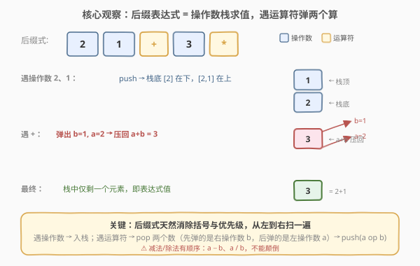
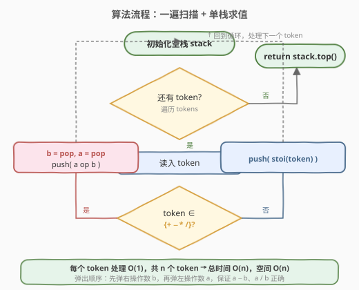

# 逆波兰表达式求值

- **题目名称**：逆波兰表达式求值
- **链接**：[150. 逆波兰表达式求值](https://leetcode.cn/problems/evaluate-reverse-polish-notation/)
- **难度**：中等
- **标签**：栈、数组、数学

## 1. 题目概述

给定一个字符串数组 `tokens`，表示一个**逆波兰表达式**（后缀表达式），求其值。有效的运算符为 `+`、`-`、`*`、`/`。每个操作数可以是整数或另一个表达式。

**注意**：

- 两个整数之间的除法**向零截断**（truncates toward zero）。
- 题目保证给定的逆波兰表达式总是有效的，且结果在 32 位整数范围内。

**示例 1**：

```text
输入：tokens = ["2","1","+","3","*"]
输出：9
解释：该表达式转化为常见的中缀算术表达式为 ((2 + 1) * 3) = 9
```

**示例 2**：

```text
输入：tokens = ["4","13","5","/","+"]
输出：6
解释：该表达式转化为常见的中缀算术表达式为 (4 + (13 / 5)) = 4 + 2 = 6
```

**示例 3**：

```text
输入：tokens = ["10","6","9","3","+","-11","*","/","*","17","+","5","+"]
输出：22
解释：该表达式转化为常见的中缀算术表达式为：
  ((10 * (6 / ((9 + 3) * -11))) + 17) + 5
= ((10 * (6 / -132)) + 17) + 5
= ((10 * 0) + 17) + 5
= 22
```

**约束条件**：

- `1 <= tokens.length <= 10^4`
- `tokens[i]` 是运算符（`"+"`、`"-"`、`"*"`、`"/"`）或 `[-200, 200]` 范围内的整数表示
- 输入的逆波兰表达式总是有效的

> 💡 后缀表达式（逆波兰式）把**运算符写在两个操作数之后**，如 `2 1 +` 即 `2 + 1`。它最大的好处是**不需要括号、不需要优先级**——从左到右扫一遍就能唯一确定运算顺序。因此用栈求值极其自然。

---

## 2. 解题思路

### 2.1 暴力思路

反复扫描 `tokens`，每次找一个形如 `数 数 运算符` 的三元组，把它替换成计算结果，直到只剩一个数。每轮扫描 `O(n)`，最多 `n/2` 轮，总计 `O(n²)`，且要处理原数组删除/收缩，实现繁琐。

> ⚠️ 问题的本质：后缀表达式的运算总是作用于**最近出现的两个操作数**——这正是栈「后进先出」的语义。一遍扫描配一个栈即可。

### 2.2 核心观察：操作数栈求值



后缀表达式求值只有两条规则：

- **遇操作数**：压入栈（暂时「待用」）。
- **遇运算符**：连续弹出两个数——**先弹出的是右操作数 $b$，后弹出的是左操作数 $a$**——计算 $a \text{ op } b$，把结果压回栈。

扫描结束后，栈中只剩一个元素，即整个表达式的值。

> 为什么运算符弹出两个数就够了？因为后缀式里每个运算符的作用域就是「紧挨它前面的两个已完成子表达式」。比如 `4 13 5 / +`：扫到 `/` 时，栈顶是 `5`、`13`（5 在上，13 在下），弹两个算 `13 / 5 = 2` 压回，栈变成 `[4, 2]`；再扫到 `+`，弹 `2`、`4` 算 `4 + 2 = 6`。运算符何时出现、就何时归约，天然消除了中缀式里「优先级 + 括号」的歧义。

> ⚠️ **减法 / 除法的顺序**：先弹出的是 $b$（右操作数），后弹出的是 $a$（左操作数），结果是 $a - b$、$a / b$，**不能颠倒**。例如 `["3","2","-"]` → $3 - 2 = 1$，若写反成 $2 - 3 = -1$ 就错了。

### 2.3 算法流程图



```
1. 初始化空栈 stack
2. 逐个 token 扫描 tokens：
   a. 若 token 是 + - * /：
      - b = stack.pop()      // 先弹右操作数
      - a = stack.pop()      // 再弹左操作数
      - stack.push(a op b)   // 计算并压回
   b. 否则（token 是数字）：
      - stack.push(stoi(token))
3. 扫描结束：return stack.top()
```

每个 token 处理 `O(1)`（数字压栈、运算符弹两次压一次都是常数），共 $n$ 个 token，总时间 $O(n)$。

### 2.4 示例演算

![示例演算：tokens = ["2","1","+","3","*"]](../images/rpn_example_walkthrough.svg)

逐步跟踪 `tokens = ["2","1","+","3","*"]`，重点看运算符处「弹两个、算、压回」：

| 步 | token | 动作 | 栈状态 |
|----|-------|------|--------|
| ① | `"2"` | push(2) | `[2]` |
| ② | `"1"` | push(1) | `[2, 1]` |
| ③ | `"+"` | pop b=1, a=2；push(2+1=3) | `[3]` |
| ④ | `"3"` | push(3) | `[3, 3]` |
| ⑤ | `"*"` | pop b=3, a=3；push(3×3=9) | `[9]` |

扫描结束，栈仅剩 `9` → **返回 9** ✓

对应中缀式 $((2+1)\times 3) = 9$，后缀式无需括号也无歧义。

> 💡 再看示例 2 `["4","13","5","/","+"]`：扫到 `"/"` 时弹 `5`、`13` 算 `13/5=2`（向零截断）压回，栈 `[4,2]`；扫到 `"+"` 弹 `2`、`4` 算 `4+2=6`。结果是 `6`。

---

## 3. 参考代码

### C++

```cpp
class Solution {
public:
    int evalRPN(vector<string>& tokens) {
        stack<int> st;
        for (const string& t : tokens) {
            if (t == "+" || t == "-" || t == "*" || t == "/") {
                int b = st.top(); st.pop();
                int a = st.top(); st.pop();
                if (t == "+")      st.push(a + b);
                else if (t == "-") st.push(a - b);
                else if (t == "*") st.push(a * b);
                else               st.push(a / b);  // C++ 整数除法天然向零截断
            } else {
                st.push(stoi(t));
            }
        }
        return st.top();
    }
};
```

### Python

```python
class Solution:
    def evalRPN(self, tokens: List[str]) -> int:
        stack = []
        for t in tokens:
            if t in "+-*/":
                b = stack.pop()
                a = stack.pop()
                if t == "+":
                    stack.append(a + b)
                elif t == "-":
                    stack.append(a - b)
                elif t == "*":
                    stack.append(a * b)
                else:  # "/": 向零截断
                    stack.append(int(a / b))
            else:
                stack.append(int(t))
        return stack[0]
```

> ⚠️ **Python 除法的坑**：题目要求向零截断，而 Python 的 `//` 是**向下取整**（floor），对负数会出错。例如 `int(a / b)`：`a=1, b=-132` 时 `1 / -132 ≈ -0.0076`，`int()` 截断得 `0`（正确）；若用 `1 // -132` 会得 `-1`（错误）。所以必须用 `int(a / b)` 或 `int(operator.truediv(a, b))`，**不要用 `//`**。
>
> 验证示例 3：`(9 + 3) * -11 = -132`，`6 / -132` 向零截断得 `0`（不是 `-1`），`10 * 0 = 0`，`0 + 17 + 5 = 22` ✓。

> 💡 **C++ 为什么不用防溢出？** 题目保证结果在 32 位 `int` 范围内，但中间乘法可能短暂溢出？实际上 LeetCode 用例里中间结果也在 `int` 内。若追求稳妥，可把 `a`、`b` 声明为 `long long`，最后返回 `(int)st.top()`。

---

## 4. 复杂度分析

| 维度 | 复杂度 | 说明 |
|------|--------|------|
| **时间** | `O(n)` | 每个 token 处理一次 `O(1)`（数字压栈、运算符弹两次压一次） |
| **空间** | `O(n)` | 最坏情况前半段全是数字，栈存 `⌈n/2⌉` 个操作数 |

---

## 5. 扩展：中缀转后缀（调度场算法）

本题直接给了后缀式，省去了转换。面试中常追问：**如何把中缀式 `(2+1)*3` 转成后缀式 `2 1 + 3 *`？** 用 Dijkstra 的**调度场算法（Shunting Yard）**：

- 维护一个**运算符栈**，从左到右扫描中缀式。
- 遇操作数：直接输出到结果。
- 遇运算符 `op`：只要栈顶运算符优先级 `≥ op`，就弹出并输出；然后把 `op` 压栈（保证左结合）。
- 遇 `(`：压栈；遇 `)`：不断弹出并输出，直到弹出对应的 `(`。

```
中缀: ( 2 + 1 ) * 3
扫描: ( → 压栈
      2 → 输出 "2"
      + → 栈顶 ( 优先级低，压栈
      1 → 输出 "2 1"
      ) → 弹出到 (，输出 "+" → "2 1 +"
      * → 栈空，压栈
      3 → 输出 "2 1 + 3"
      结束 → 弹出 "*" → "2 1 + 3 *"
```

得到后缀式 `2 1 + 3 *`，再用本题的栈求值即可。整族表达式题的完整链路是：**中缀（调度场）→ 后缀（本题）→ 求值**。

---

## 6. 面试要点

**Q1：为什么后缀表达式不需要括号和优先级？**
> 后缀式把运算符放在两个操作数之后，运算符的出现顺序就是运算顺序——每个运算符作用于它前面最近完成的两个子表达式。中缀式里的优先级（`*` 高于 `+`）和括号都是为了**显式改变默认求值顺序**，而后缀式通过位置直接编码了顺序，所以无需额外标记。

**Q2：遇运算符时，先弹出的是左操作数还是右操作数？为什么不能颠倒？**
> 先弹出的是**右操作数 $b$**，后弹出的是**左操作数 $a$**（栈是 LIFO，左操作数先进栈所以在下面）。对于 `+`、`*` 满足交换律无所谓，但 `-`、`/` 必须算 $a - b$、$a / b$。例如 `["3","2","-"]` 应得 $3-2=1$，若写反成 $2-3=-1$ 就错了。

**Q3：除法向零截断是什么意思？各语言怎么实现？**
> 向零截断即丢弃小数部分、往 0 的方向取整：`13/5=2`、`-13/5=-2`（不是 floor 的 `-3`）。C/C++/Java 的整数除法**天然向零截断**，直接 `a / b` 即可；Python 的 `//` 是向下取整，对负数出错，必须用 `int(a / b)`。

**Q4：这题和基本计算器系列（224/227）有什么区别和联系？**
> 224/227 处理的是**中缀式**，要面对优先级（`* /` vs `+ -`）和括号嵌套，所以需要「符号变量 + 栈暂存上下文」或「带符号入栈 + 立即结合」。本题输入已经是**后缀式**，优先级和括号已被消除，只剩最纯粹的栈求值——遇运算符弹两个数算。可以说 224/227 是「中缀直接求值」，本题是「中缀转后缀后再求值」的后半段。掌握本题的栈求值，再看调度场算法，就能理解整族表达式题。

**Q5：栈里最多存多少元素？能否用递归替代？**
> 最坏情况 `tokens` 前半段全是数字、后半段才是运算符，栈最多存 $\lceil n/2 \rceil$ 个元素，空间 $O(n)$。也可以用递归：遇运算符就递归解析它的两个操作数（每个操作数可能是数字或子表达式），递归返回值即该子表达式的值。递归本质和栈等价（调用栈模拟操作数栈），但写起来不如显式栈直观，且深递归可能栈溢出，面试推荐显式栈。

---

## 7. 同类练习题

- [224. 基本计算器](https://leetcode.cn/problems/basic-calculator/)（[题解](../0201-0300/224_基本计算器.md)）：中缀式直接求值（含括号、一元负号），用「符号变量 + 栈暂存上下文」
- [227. 基本计算器 II](https://leetcode.cn/problems/basic-calculator-ii/)（[题解](../0201-0300/227_基本计算器II.md)）：中缀式含 `* /`，用「带符号入栈 + 乘除立即结合」
- [394. 字符串解码](https://leetcode.cn/problems/decode-string/)（[题解](../0301-0400/394_字符串解码.md)）：同样用栈处理「延迟落地」的嵌套结构，栈里存外层上下文
- [20. 有效的括号](https://leetcode.cn/problems/valid-parentheses/)（[题解](../0001-0100/20_有效括号.md)）：栈的最基础应用，匹配即消去
- [71. 简化路径](https://leetcode.cn/problems/simplify-path/)：用栈处理 `..` 弹栈、目录名压栈，最后拼路径
