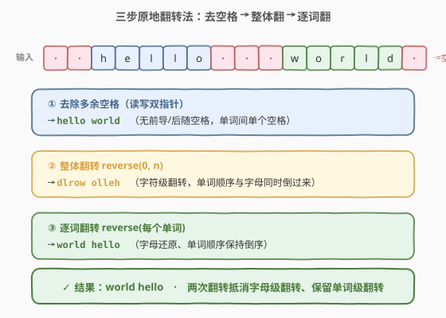
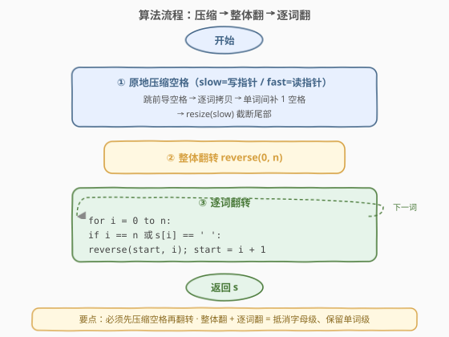
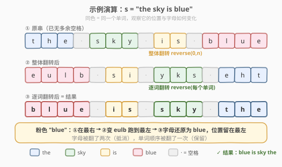

# 反转字符串中的单词

- **题目名称**：反转字符串中的单词
- **链接**：[151. 反转字符串中的单词](https://leetcode.cn/problems/reverse-words-in-a-string/)
- **难度**：中等
- **标签**：字符串、双指针

## 1. 题目概述

给你一个字符串 `s`，请你反转字符串中**单词的顺序**。

- **单词**：由非空格字符组成的连续序列。
- 单词间以**至少一个空格**分隔，`s` 中可能存在**前导空格、后随空格或单词间多个空格**。
- 返回的字符串中，单词之间只能有**单个空格**，且**不能包含任何额外的空格**。

**示例 1**：

```text
输入：s = "the sky is blue"
输出："blue is sky the"
解释：单词顺序反转，单个空格连接。
```

**示例 2**：

```text
输入：s = "  hello world  "
输出："hello world"
解释：去除前后空格，单词间多余空格压缩为一个。
```

**示例 3**：

```text
输入：s = "a good   example"
输出："example good a"
解释：单词间多个空格被压缩为单个。
```

**约束条件**：

- `1 <= s.length <= 10^4`
- `s` 包含英文大小写字母、数字、空格 `' '`
- `s` 中**至少存在一个单词**

> ⚠️ **进阶要求**：对于 C++，要求用 `O(1)` 额外空间**原地**完成（即不允许开辟新数组/新字符串，只能用常数辅助变量）。这一限制把「`split` + 反转 + `join`」的偷懒做法排除在外，必须真正操作字符数组。

---

## 2. 解题思路

### 2.1 暴力思路

**开新数组法**：用 `split` 把字符串按空格切成单词列表，反转列表顺序，再用单个空格 `join` 回来。时间 `O(n)`、空间 `O(n)`。

```python
return " ".join(s.split()[::-1])
```

简单正确，但额外空间 `O(n)`，不满足 C++ 的进阶原地要求。

### 2.2 核心观察：两次翻转法（整体翻 + 逐词翻）



关键洞察是：**「反转单词顺序」可以分解为两次字符级翻转**。

设去空格后的字符串为 `W1 W2 ... Wk`（每个 `Wi` 是一个单词，用单个空格分隔）。则：

1. **整体翻转**后变成 `Wkᴿ ... W2ᴿ W1ᴬ`（每个单词的字母也被翻了过来）。
2. **逐词翻转**每个单词的字母，把 `Wiᴿ` 还原成 `Wi`，得到 `Wk ... W2 W1`。

这正是我们想要的「单词顺序反转、单词内部不变」。

> 💡 **为什么成立**：整体翻转同时做了两件事——把单词顺序倒了过来，也把每个单词的字母顺序倒了过来。再对每个单词单独翻转一次，字母顺序恢复原状，而单词之间的相对顺序仍是整体翻转后的「倒序」。两次翻转恰好抵消字母级别的翻转、保留单词级别的翻转。

> ⚠️ 在两次翻转之前，必须先把**多余空格压缩为单个、并去掉首尾空格**，否则翻转后空格位置会错乱、且无法保证「单词间只能有单个空格」。

### 2.3 第一步：原地压缩空格（读写双指针）

压缩空格是整个流程里最容易写错的一步，用**读写双指针**原地完成：

- `slow`：写入位置（写指针）。
- `fast`：扫描位置（读指针）。

扫描规则：

1. 先跳过所有前导空格。
2. 每写完一个单词后，若后面还有单词，就在 `slow` 处补**一个**空格，再跳过连续空格。
3. 最终 `slow` 就是压缩后字符串长度，`resize(slow)` 截断尾部。

这样保证：无前导空格、单词间恰好一个空格、无后随空格。

### 2.4 算法流程图



### 2.5 示例演算

以 `s = "the sky is blue"` 为例（该串无多余空格，故直接从翻转开始）：



| 阶段 | 字符串 | 说明 |
|------|--------|------|
| 原串 | `the sky is blue` | 无多余空格，压缩后不变 |
| 整体翻转 | `eulb si yks eht` | 整串字符级翻转 |
| 逐词翻转 | `blue is sky the` | 每个单词字母再翻一次，恢复原词 |
| 结果 | `blue is sky the` | 单词顺序反转 ✓ |

> 💡 观察颜色对应关系：整体翻转后 `blue` 变成了 `eulb`，逐词翻转又把 `eulb` 还原成 `blue`——但它的**位置**已经从最右跑到了最左。这正是「两次翻转抵消字母级翻转、保留单词级翻转」的直观体现。

---

## 3. 参考代码

### C++

```cpp
class Solution {
  public:
    string reverseWords(string s) {
        // 1. 原地压缩空格：去前导/后随，单词间压成单个空格
        int n = s.size();
        int slow = 0, fast = 0;
        while (fast < n && s[fast] == ' ') fast++;   // 跳过前导空格
        while (fast < n) {
            // 拷贝一个完整单词
            while (fast < n && s[fast] != ' ') {
                s[slow++] = s[fast++];
            }
            // 单词间补一个空格（前提是后面还有单词）
            if (fast < n) {
                s[slow++] = ' ';
                while (fast < n && s[fast] == ' ') fast++;  // 跳过多余空格
            }
        }
        s.resize(slow);   // 截断为压缩后的长度

        // 2. 整体翻转
        reverse(s.begin(), s.end());

        // 3. 逐词翻转
        int start = 0;
        for (int i = 0; i <= (int)s.size(); i++) {
            if (i == (int)s.size() || s[i] == ' ') {
                reverse(s.begin() + start, s.begin() + i);
                start = i + 1;
            }
        }
        return s;
    }
};
```

### Python

```python
class Solution:
    def reverseWords(self, s: str) -> str:
        # Python 字符串不可变，无法原地；用 split 处理多余空格最简洁
        return " ".join(reversed(s.split()))
```

> ⚠️ C++ 版的 `i <= (int)s.size()` 中 `i` 会取到 `s.size()`，此时表示末尾单词的右边界；必须把 `s.size()` 强转为 `int`，否则无符号 `size()` 减 1 的循环边界会出错。这是 C++ 字符串题的高频陷阱。

---

## 4. 复杂度分析

| 维度 | 复杂度 | 说明 |
|------|--------|------|
| 时间复杂度 | $O(n)$ | 压缩空格扫一遍、整体翻转扫一遍、逐词翻转累计扫一遍，共至多 $3n$ 次操作 |
| 空间复杂度 | $O(1)$ | C++ 原地修改，仅用 `slow`/`fast`/`start` 等常数指针；Python 因字符串不可变为 $O(n)$ |

---

## 5. 扩展：手动翻转的 Python 实现

若面试官要求展示算法细节而非调用库函数，可手写翻转逻辑（Python 仍需 $O(n)$ 空间存放列表，但流程与 C++ 一致）：

```python
class Solution:
    def reverseWords(self, s: str) -> str:
        # 1. 手动 split（处理多余空格）
        words = []
        i, n = 0, len(s)
        while i < n:
            while i < n and s[i] == ' ':   # 跳过空格
                i += 1
            if i >= n:
                break
            j = i
            while j < n and s[j] != ' ':   # 取一个单词
                j += 1
            words.append(s[i:j])
            i = j
        # 2. 反转单词顺序
        words.reverse()
        # 3. 单空格连接
        return " ".join(words)
```

> 💡 **「两次翻转法」vs「切分反转法」**：切分反转法（`split`+`reverse`+`join`）思路直观、易写对，是 Python/Java 面试的首选；两次翻转法适用于 C++ 原地场景，也常作为「能否不用额外空间」的追问考点。两种方法时间都是 $O(n)$，差别只在空间。

---

## 6. 面试要点

1. **为什么先整体翻再逐词翻，而不是反过来？**
   - 先逐词翻只会把每个单词内部字母倒过来，单词顺序不变；再整体翻会同时倒字母和单词顺序，最终字母被翻了三次而非两次，结果错误。必须「整体翻 → 逐词翻」这个顺序，让字母级翻转恰好抵消。

2. **压缩空格时为什么不能边翻转边压缩？**
   - 翻转依赖单词间的单个空格作为边界标记；若仍有多个空格，翻转后空格分布会错乱、单词边界丢失。因此**先压缩、后翻转**是正确的前提。

3. **`reverse(s.begin()+start, s.begin()+i)` 的右边界为什么是开区间？**
   - STL 的 `reverse` 是 `[first, last)` 左闭右开。当 `s[i] == ' '` 时，单词为 `[start, i)`；当 `i == size()` 时，末尾单词为 `[start, size())`。两者统一用 `i` 作右边界。

4. **如何处理全空格或只有一个单词的边界？**
   - 题目保证至少一个单词。压缩时先跳前导空格，若跳完 `fast >= n` 说明无单词（本题不会发生）；只有一个单词时整体翻转和逐词翻转效果抵消，结果就是该单词本身，逻辑天然正确。

5. **能否用 `std::istringstream` 自动分词？**
   - 可以：`istringstream iss(s); string w, ans; while(iss>>w) ans = w + " " + ans;` 再去掉末尾空格。但额外空间 $O(n)$，且面试通常要求手写以考察指针控制能力。

---

## 7. 同类练习题

- [344. 反转字符串](https://leetcode.cn/problems/reverse-string/)：本题翻转操作的基本积木——双指针首尾交换
- [541. 反转字符串 II](https://leetcode.cn/problems/reverse-reverse-string-ii/)：分段翻转的变体，固定步长每 $2k$ 翻前 $k$ 个
- [557. 反转字符串中的单词 III](https://leetcode.cn/problems/reverse-words-in-a-string-iii/)：只翻转每个单词的字母、不反转单词顺序——本题的「半步」
- [189. 轮转数组](https://leetcode.cn/problems/rotate-array/)：同样用「三次翻转」完成原地轮转，是两次翻转法的姊妹套路
- [186. 反转字符串中的单词 II](https://leetcode.cn/problems/reverse-words-in-a-string-ii/)：进阶版，输入已无多余空格，专注考察两次翻转的原地实现
