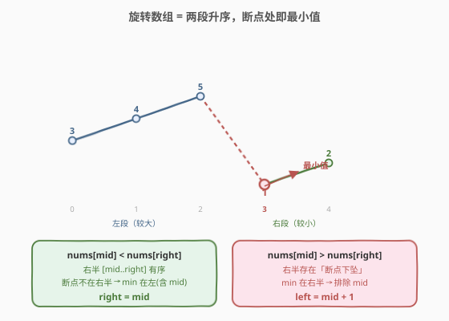
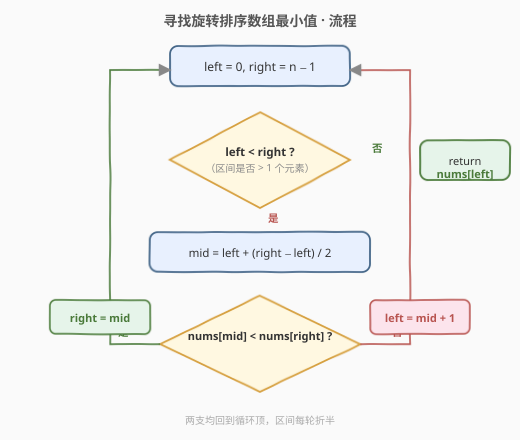
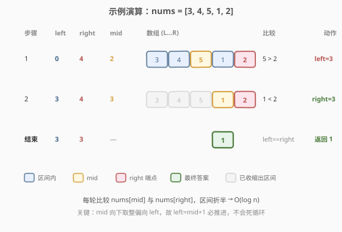

# LeetCode 寻找旋转排序数组中的最小值 题解

## 1. 题目概述

- **标题 / 题号**：寻找旋转排序数组中的最小值（#153，medium）
- **链接**：https://leetcode.cn/problems/find-minimum-in-rotated-sorted-array/
- **难度**：中等
- **标签**：数组、二分查找

**题意**：已知一个长度为 `n` 的数组 `nums`，它**预先按升序排列**，并在**下标 `k`（`0 <= k < n`）处旋转**了一次，变为：

$$[\text{nums}[k],\ \text{nums}[k+1],\ \ldots,\ \text{nums}[n-1],\ \text{nums}[0],\ \text{nums}[1],\ \ldots,\ \text{nums}[k-1]]$$

例如 `[1,2,3,4,5]` 在 `k=3` 旋转后得到 `[4,5,1,2,3]`。数组中**元素互不相同**。请找出并返回数组中的**最小元素**，要求 $O(\log n)$ 时间。

**示例 1**：

```text
输入：nums = [3,4,5,1,2]
输出：1
解释：原数组 [1,2,3,4,5] 在 k=3 处旋转，最小值 1 位于下标 3。
```

**示例 2**：

```text
输入：nums = [4,5,6,7,0,1,2]
输出：0
```

**示例 3**：

```text
输入：nums = [11,13,15,17]
输出：11
解释：k=0（未旋转），首元素即最小值。
```

**约束**：

- $n == \text{nums.length}$
- $1 \le n \le 5000$
- $-5000 \le \text{nums}[i] \le 5000$
- `nums` 中的元素**互不相同**
- `nums` 原为升序并旋转过一次（`k` 可为 `0`，即未旋转）

> ⚠️ 三点注意：① **只旋转了一次**，数组至多被切成两段升序；② **元素互不相同**，因此 `nums[mid]` 与 `nums[right]` 不会相等（这是 [154 题](https://leetcode.cn/problems/find-minimum-in-rotated-sorted-array-ii/) 有重复元素时的额外难点）；③ `k` 可为 `0`，即数组可能根本没旋转，算法需自然处理这种情况。

## 2. 解题思路

### 2.1 暴力思路：线性扫描

最直接的做法是扫一遍取最小值，时间 $O(n)$。简单正确，但不满足 $O(\log n)$ 的要求，且浪费了「旋转一次后仍大体有序」的结构。问题在于：**如何利用「两段升序」的性质把搜索区间折半？**

### 2.2 核心观察：与右端点比较缩区间



旋转后的数组由**两段升序**拼接而成：左段元素整体较大，右段整体较小，二者之间有一个「**断点下坠**」（左段末尾 $>$ 右段开头）。**最小值恰是右段的第一个元素**，也就是断点的位置。

我们不知道断点在哪，但可以用中点 `mid` 与**右端点** `nums[right]` 的大小关系来判定断点落在哪一半：

- **`nums[mid] < nums[right]`**：`mid` 到 `right` 这一段是**升序**（没有断点下坠）。说明断点不在 `(mid, right]` 内，最小值在 `mid` 处或 `mid` 左侧。于是**向左收缩**：`right = mid`（`mid` 自身可能是最小值，需保留）。
- **`nums[mid] > nums[right]`**：`mid` 到 `right` 出现了下坠，断点必然落在 `(mid, right]` 内，最小值在 `mid` 右侧。于是**向右收缩**：`left = mid + 1`（`mid` 处于较大的左段，不可能是最小值，排除）。

> 💡 **一句话直觉**：站在 `mid` 往右端点 `right` 看——如果「一路向上」是升序，那最小值不在右边（在左含 `mid`）；如果中途「掉下去了」，那最小值就藏在掉下去的那一段里（在右不含 `mid`）。每轮用一次比较排除掉一半。

> ⚠️ **为什么和「右端点」比，不和「左端点」比？** 若 `nums[mid] > nums[left]`，只能说明 `[left, mid]` 升序，但最小值可能是 `nums[left]`（未旋转时），也可能在右半（旋转时），**存在歧义**，需额外判断 `nums[left] < nums[right]` 是否整体有序。而和右端点比较时：`nums[mid] < nums[right]` 直接等价于「右半无下坠」，判定无歧义、无需额外分支。这就是「**与右端点比较**」模板更简洁的原因。

### 2.3 算法流程图



循环不变量：**最小值始终落在闭区间 `[left, right]` 内**。每轮把区间折半，直到区间只剩一个元素，它即为答案。

### 2.4 示例演算

以 `nums = [3,4,5,1,2]` 为例，每轮比较 `nums[mid]` 与 `nums[right]`：



| 轮次 | left | right | mid | nums[mid] | nums[right] | 比较 | 动作 |
|------|------|-------|-----|-----------|-------------|------|------|
| 1 | 0 | 4 | 2 | 5 | 2 | $5 > 2$ | left = mid+1 = 3 |
| 2 | 3 | 4 | 3 | 1 | 2 | $1 < 2$ | right = mid = 3 |
| 结束 | 3 | 3 | — | — | — | left==right | 返回 nums[3] = 1 |

`nums[3] = 1` 确为最小值 ✓。注意第 1 轮 `5 > 2` 说明断点在右半，果断丢弃左段 `[3,4,5]`；第 2 轮 `1 < 2` 说明右半升序、`mid` 本身就是断点，把 `right` 拉到 `mid` 锁定答案。

## 3. 参考代码

### C++

```cpp
class Solution {
  public:
    int findMin(vector<int>& nums) {
        int left = 0, right = nums.size() - 1;
        while (left < right) {
            int mid = left + (right - left) / 2;
            if (nums[mid] < nums[right]) {
                right = mid;          // 右半升序：min 在左（含 mid）
            } else {
                left = mid + 1;       // 右半有下坠：min 在右（不含 mid）
            }
        }
        return nums[left];
    }
};
```

### Python

```python
class Solution:
    def findMin(self, nums: List[int]) -> int:
        left, right = 0, len(nums) - 1
        while left < right:
            mid = (left + right) // 2
            if nums[mid] < nums[right]:
                right = mid           # 右半升序：min 在左（含 mid）
            else:
                left = mid + 1        # 右半有下坠：min 在右（不含 mid）
        return nums[left]
```

> 💡 未旋转的情况（如 `[11,13,15,17]`）无需特判：每轮都有 `nums[mid] < nums[right]`，`right` 一路收到 `0`，最终返回 `nums[0]` 即首元素，正确。

## 4. 复杂度分析

| 维度 | 复杂度 | 说明 |
|------|--------|------|
| 时间复杂度 | $O(\log n)$ | 每轮区间折半，共 $O(\log n)$ 轮，每轮 $O(1)$ 比较 |
| 空间复杂度 | $O(1)$ | 仅 `left` / `right` / `mid` 三个指针，无额外空间 |

## 5. 扩展：有重复元素时（154 题）

[154. 寻找旋转排序数组的最小值 II](https://leetcode.cn/problems/find-minimum-in-rotated-sorted-array-ii/) 允许元素重复。此时会出现一个致命情形：**`nums[mid] == nums[right]`**，无法判断断点在哪一半。

例如 `[2,2,2,0,2]` 与 `[0,1,2,2,2]`，仅看 `nums[mid]==nums[right]==2` 无法区分断点在左还是在右。处理方式是**保守退缩**：既然 `right` 不可能是唯一最小值（`mid` 处有相等值），就 `right -= 1` 缩小一个，逐步消解歧义。

```cpp
while (left < right) {
    int mid = left + (right - left) / 2;
    if (nums[mid] < nums[right])      right = mid;
    else if (nums[mid] > nums[right]) left = mid + 1;
    else                              --right;   // nums[mid] == nums[right]
}
return nums[left];
```

最坏情况（全相同）退化为 $O(n)$，这是不可免的——信息不足以支撑对数判定。

> ⚠️ 本题（153）由于元素互不相同，`==` 分支不会触发，故 `else` 直接等价于 `nums[mid] > nums[right]`。把 153 的模板加上 `==` 退缩分支即得 154 的解法，**两题共用同一套骨架**。

## 6. 面试要点

1. **为什么用 `nums[mid]` 和 `nums[right]` 比较，而不是 `nums[left]`？**
   - 与右端点比较时，`nums[mid] < nums[right]` 直接等价于「右半无下坠」，最小值在左含 `mid`；与左端点比较时，`nums[mid] > nums[left]` 存在歧义（整体有序 vs 旋转），需额外判断 `nums[left] < nums[right]`。右端点模板更简洁、分支最少。

2. **为什么 `right = mid` 而不是 `right = mid - 1`？**
   - `nums[mid] < nums[right]` 时 `mid` 自身就可能是最小值（它处在较小的右段开头）。写成 `mid - 1` 会把 `mid` 这个候选错误排除。本题是「找满足条件的位置」型二分，条件成立侧需保留 `mid`。

3. **`while` 用 `left < right` 还是 `left <= right`？**
   - 用 `left < right`。当 `left == right` 时区间只剩一个元素，由不变量保证它就是最小值，直接返回。用 `left <= right` 反而要在循环内处理 `left == right` 的退出，并担心 `mid` 不推进导致死循环。**「区间型二分」统一用 `left < right`**，退出后 `left` 即答案。

4. **为什么不会死循环？`mid` 取整方向有何讲究？**
   - `mid = left + (right-left)/2` 向下取整，偏向 `left`。当 `left + 1 == right` 时 `mid == left`：若走 `left = mid + 1` 分支，`left` 推进到 `right`，区间收敛；若走 `right = mid` 分支，`right` 拉到 `left`，区间也收敛。两个分支都能让区间严格缩小，故不死循环。若改用向上取整，`right = mid` 分支会卡死。

5. **数组未旋转（`k=0`）时算法正确吗？**
   - 正确。此时整段升序，每轮都满足 `nums[mid] < nums[right]`，`right` 不断收到 `mid`，最终 `right` 落到 `0`，返回 `nums[0]` 即全局最小。无需特判，模板自带「未旋转」语义。

## 同类练习题

| # | 题目 | 与本题的关联 |
|---|------|-------------|
| 154 | [寻找旋转排序数组的最小值 II](https://leetcode.cn/problems/find-minimum-in-rotated-sorted-array-ii/) | 本题的有重复元素版，新增 `nums[mid] == nums[right]` 的退缩分支，最坏 $O(n)$ |
| 33 | [搜索旋转排序数组](https://leetcode.cn/problems/search-in-rotated-sorted-array/)（[题解](../0001-0100/33_搜索旋转排序数组.md)） | 同结构但找「目标值」而非最小值，需先判哪半有序再决定去哪——可对比「找 min」与「找 target」两种二分套路 |
| 162 | [寻找峰值](https://leetcode.cn/problems/find-peak-element/)（[题解](../0101-0200/162_寻找峰值.md)） | 另一道「无整体有序但可二分」的经典，比较 `mid` 与 `mid+1` 沿斜率走 |
| 704 | [二分查找](https://leetcode.cn/problems/binary-search/) | 闭区间二分的母题，本题的 `left < right` + `right = mid` 模板即源于此 |
| 875 | [爱吃香蕉的珂珂](https://leetcode.cn/problems/koko-eating-bananas/)（[题解](../0801-0900/875_爱吃香蕉的珂珂.md)） | 对比「二分答案」与本题「二分结构断点」两种范式，同属二分家族 |
