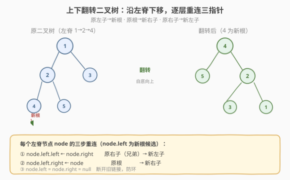
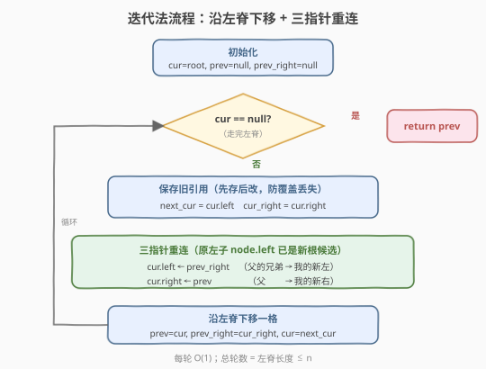
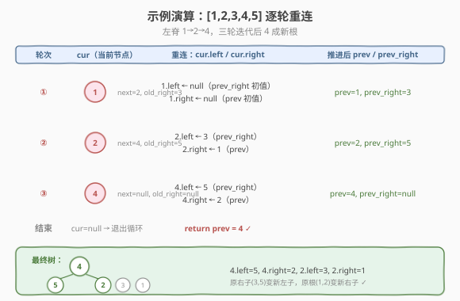

# 上下翻转二叉树

- **题目名称**：上下翻转二叉树
- **链接**：[156. 上下翻转二叉树](https://leetcode.cn/problems/binary-tree-upside-down/)
- **难度**：中等
- **标签**：树、二叉树、深度优先搜索

## 1. 题目概述

给定一棵二叉树的根节点 `root`，将其**上下翻转**（upside down）并返回新根。

翻转规则（对每个**左脊节点** `node` 执行）：

1. **原左子** `node.left` → **新根**（整体翻转后由它接管）；
2. **原根** `node` → **新右子**（挂在 `node.left` 的右下方）；
3. **原右子** `node.right` → **新左子**（挂在 `node.left` 的左下方）。

> ⚠️ **题目保证**：所有右节点要么是**有兄弟左节点的叶子**，要么为空。这意味着树的结构是「**一条左脊**，左脊上每个节点至多带一个右叶子」——左脊走到头即最左叶子，翻转后它成为新根。

**示例 1**：

```text
输入：root = [1,2,3,4,5]
输出：返回新根 4

      1                       4
     / \                     / \
    2   3        →          5   2
   / \                         / \
  4   5                       3   1
```

**示例 2**：

```text
输入：root = []
输出：null
```

**示例 3**：

```text
输入：root = [1]
输出：1
```

**约束条件**：

- 树中节点数目范围 `[0, 10^4]`
- `-1000 <= Node.val <= 1000`
- 所有右节点要么是有兄弟左节点的叶子，要么为空

> 💡 本题是「**原地修改树指针**」家族的一员。与 [226. 翻转二叉树](../0201-0300/226_翻转二叉树.md) 的「逐节点交换左右孩子」不同，本题是把**整条左脊**「立起来」：左脊变成新树的**右脊**，每个节点的右叶子翻到左侧。核心是沿左脊下移、逐层重连三个指针。

---

## 2. 解题思路

### 2.1 暴力思路：层序收集 + 重建

最直观的做法：沿左脊把节点和它们的右兄弟成对收集进列表，再从最左叶子开始按规则重建。时间 $O(n)$，但空间 $O(n)$（存所有左脊节点及其右兄弟）。能过，但**完全没利用「沿左脊逐层重连」的原地特性**——翻转本质上只需在左脊上「边走边改指针」，无需额外容器。

### 2.2 核心观察：左脊即翻转轴



**关键洞察**：题目保证「右节点都是叶子或有兄弟」，意味着**有效结构只有一条左脊**——从根出发一直走 `left` 到最左叶子，这条路径上的每个节点 `node` 至多带一个右叶子 `node.right`。翻转就是把这条**左脊**「立起来」变成新树的**右脊**：

- 最左叶子（左脊末端）→ **新根**；
- 左脊上每个 `node` → 它原左子（新根方向）的**右子**；
- `node` 的原右兄弟 → 它原左子的**左子**。

于是只需沿左脊**自顶向下**走一遍，每到一个节点 `node`，把它的三个指针按规则重连即可。关键细节：**改指针前必须先存住 `node.left`（下一站）与 `node.right`（待挂的右兄弟）**，否则改完就丢了。

> 💡 **为什么能自顶向下？** 看似翻转是「自底向上」的（最左叶子成新根），但指针重连不必等子树先翻好——因为题目的结构保证左脊上**没有更深的左子树**（左脊节点的右子都是叶子），逐层重连不会破坏尚未处理的下游结构。我们只需用 `prev` / `prev_right` 两个游标记住「上一轮处理的节点及其右兄弟」，下一轮把它们挂到当前节点的左、右即可。

### 2.3 算法流程图



**迭代法完整步骤**：

1. **初始化三个游标**：`cur = root`（当前左脊节点）、`prev = null`（上一轮节点，初值空）、`prev_right = null`（上一轮的右兄弟，初值空）；
2. **循环**（`cur != null`）：
   - **先存后改**：`next_cur = cur.left`（保存下一站）、`cur_right = cur.right`（保存原右兄弟）；
   - **三指针重连**：`cur.left = prev_right`（父的兄弟 → 我的新左）、`cur.right = prev`（父 → 我的新右）；
   - **推进**：`prev = cur`、`prev_right = cur_right`、`cur = next_cur`；
3. **返回** `prev`（最后一个处理的左脊节点 = 原最左叶子 = 新根）。

> ⚠️ **「先存后改」是防错核心**：`cur.left` 与 `cur.right` 都会被覆盖，必须在覆盖前把 `next_cur`（继续下行的凭借）和 `cur_right`（下一轮的 `prev_right`）存进局部变量，否则一旦改了 `cur.right` 就再也找不回原右兄弟。

### 2.4 示例演算

以 `root = [1,2,3,4,5]`（左脊 `1 → 2 → 4`）为例，三轮迭代：



| 轮次 | cur | next_cur | cur_right | 重连 cur.left / cur.right | 推进后 prev / prev_right |
|------|-----|----------|-----------|---------------------------|--------------------------|
| ① | 1 | 2 | 3 | `1.left=null`，`1.right=null` | prev=1, prev_right=3 |
| ② | 2 | 4 | 5 | `2.left=3`，`2.right=1` | prev=2, prev_right=5 |
| ③ | 4 | null | null | `4.left=5`，`4.right=2` | prev=4, prev_right=null |
| 结束 | null | — | — | — | 返回 prev=4 |

最终树：`4.left=5, 4.right=2, 2.left=3, 2.right=1`，与预期完全一致 ✓。注意第 ① 轮 `prev` / `prev_right` 均为初值 `null`，所以原根 `1` 的左右被清空（它在新树中是右脊末端叶子，本就该无孩子）。

> 💡 **观察游标的「时滞」**：`prev` / `prev_right` 总比 `cur` 慢一拍——当前轮用的 `prev` / `prev_right` 是**上一轮**存下的节点及其右兄弟。这正是「自顶向下重连」能模拟「自底向上翻转」的关键：游标把上一层的身份带到下一层，让每个节点在改指针时知道「我的父是谁、父的兄弟是谁」。

---

## 3. 参考代码

### C++

```cpp
class Solution {
  public:
    TreeNode* upsideDownBinaryTree(TreeNode* root) {
        TreeNode* cur = root;
        TreeNode* prev = nullptr;          // 上一轮节点（原父），初值空
        TreeNode* prevRight = nullptr;     // 上一轮右兄弟，初值空
        while (cur) {
            TreeNode* nextCur = cur->left; // 先存：下一站
            TreeNode* curRight = cur->right; // 先存：原右兄弟
            cur->left = prevRight;         // 父的兄弟 → 我的新左
            cur->right = prev;             // 父 → 我的新右
            prev = cur;                    // 推进游标
            prevRight = curRight;
            cur = nextCur;
        }
        return prev;                       // 原最左叶子 = 新根
    }
};
```

### Python

```python
class Solution:
    def upsideDownBinaryTree(self, root: Optional[TreeNode]) -> Optional[TreeNode]:
        cur = root
        prev = None            # 上一轮节点（原父），初值空
        prev_right = None      # 上一轮右兄弟，初值空
        while cur:
            next_cur = cur.left    # 先存：下一站
            cur_right = cur.right  # 先存：原右兄弟
            cur.left = prev_right  # 父的兄弟 → 我的新左
            cur.right = prev       # 父 → 我的新右
            prev, prev_right = cur, cur_right
            cur = next_cur
        return prev                # 原最左叶子 = 新根
```

> 💡 两版等价。Python 用元组解包 `prev, prev_right = cur, cur_right` 在赋值前先求值右侧，免去引入临时变量。注意 `next_cur` 与 `cur_right` 必须在改 `cur.left` / `cur.right` **之前**取出——否则覆盖后即丢失。

---

## 4. 复杂度分析

| 维度 | 复杂度 | 说明 |
|------|--------|------|
| 时间复杂度 | $O(n)$ | 沿左脊走一遍，每轮 $O(1)$ 指针操作；左脊长度 $\le n$ |
| 空间复杂度 | $O(1)$ | 仅 `cur` / `prev` / `prev_right` / `next_cur` / `cur_right` 五个游标，无递归栈 |
| 最坏左脊长度 | $O(n)$ | 退化成纯左偏斜链时左脊即整棵树，仍只需一遍扫描 |

> ⚠️ 题目结构保证右子都是叶子，故左脊长度就是树的有效深度。即便树退化为左偏斜链（左脊 $n$ 个节点），迭代法也只走 $n$ 步、$O(1)$ 额外空间——这正是迭代优于递归之处：递归版本需 $O(n)$ 栈空间。

---

## 5. 扩展：自底向上递归解法

翻转的「自然方向」是自底向上——最左叶子成新根，逐层把父挂到自己右侧。递归写法更贴近这个直觉：

```cpp
class Solution {
  public:
    TreeNode* upsideDownBinaryTree(TreeNode* root) {
        if (root == nullptr || root->left == nullptr) return root; // 空或左脊到头
        TreeNode* newRoot = upsideDownBinaryTree(root->left); // 递归翻左子树
        root->left->left = root->right;   // 原右子 → 新左子
        root->left->right = root;         // 原根 → 新右子
        root->left = nullptr;             // 断开旧链接防环
        root->right = nullptr;
        return newRoot;                   // newRoot 始终是最左叶子
    }
};
```

```python
class Solution:
    def upsideDownBinaryTree(self, root: Optional[TreeNode]) -> Optional[TreeNode]:
        if not root or not root.left:
            return root                       # 空或左脊到头
        new_root = self.upsideDownBinaryTree(root.left)  # 递归翻左子树
        root.left.left = root.right          # 原右子 → 新左子
        root.left.right = root               # 原根 → 新右子
        root.left = None                     # 断开旧链接防环
        root.right = None
        return new_root                      # new_root 始终是最左叶子
```

> 💡 **递归 vs 迭代**：递归版本在「回溯阶段」改指针（先递到最左叶子，再一层层回上来重连），语义清晰——`root.left` 此刻仍是原左子（递归未改它），直接用 `root.left.left` / `root.left.right` 挂值即可。时间同样 $O(n)$，但空间 $O(h)$ 递归栈（$h$ = 左脊长度，最坏 $O(n)$）。**面试推荐迭代版**：空间 $O(1)$，且「先存后改 + 游标时滞」的写法更能体现对指针操作的掌控力。

> ⚠️ **递归版易错点**：改完 `root.left.left` / `root.left.right` 后**必须**把 `root.left` / `root.right` 置 `null`。否则 `root` 仍指向原左子，而原左子又通过新右指针指回 `root`，形成**环**——后续遍历会死循环。

---

## 6. 面试要点

1. **翻转的三条规则是什么？为什么只需沿左脊处理？**

   > 对每个左脊节点 `node`：原左子 `node.left` 成新根、原根 `node` 成新右子、原右子 `node.right` 成新左子。题目保证右节点都是叶子或有兄弟，意味着有效结构只有一条左脊（左脊上每个节点至多带一个右叶子），没有更深的左子树——翻转不破坏下游结构，所以沿左脊走一遍即可。

2. **迭代法为什么需要 `prev` 和 `prev_right` 两个游标？**

   > 自顶向下重连时，当前节点 `cur` 需要知道「我的父是谁」（挂为新右子）和「父的右兄弟是谁」（挂为新新左子）。但父节点已经在上一轮被改过指针、不再是原来的形状，所以用 `prev` / `prev_right` 把上一轮的身份「时滞一拍」带到当前轮。两者总比 `cur` 慢一步。

3. **为什么必须「先存后改」？不存会怎样？**

   > `cur.left` 是继续下行的凭借（下一站 `next_cur`），`cur.right` 是下一轮的 `prev_right`。改 `cur.left` / `cur.right` 会覆盖这两个值，覆盖后即丢失。必须先用 `next_cur` / `cur_right` 局部变量存住，再改指针。这是所有「原地改链表/树指针」题的通用纪律。

4. **迭代和递归哪个更好？**

   > 时间都是 $O(n)$。迭代空间 $O(1)$，递归空间 $O(h)$（栈，最坏 $O(n)$）。面试推荐迭代——既能展示对指针的精细掌控，又满足「原地」的进阶期望。递归版语义更直观（回溯阶段改指针，`root.left` 仍是原左子可直接用），适合作为思路讲解的跳板，再优化到迭代。

5. **递归版为什么改完指针还要把 `root.left` / `root.right` 置空？**

   > 防环。`root.left`（原左子）已通过新右指针指回 `root`，若 `root` 仍保留 `root.left` 指向原左子，两者互指成环，后续遍历死循环。置空 `root` 的左右指针，让它在翻转后成为右脊末端的叶子（无孩子）。

> 💡 **一句话总结**：156 的灵魂是「**沿左脊下移 + 游标时滞重连**」——`prev` / `prev_right` 慢 `cur` 一拍，把上一层身份带到当前层，让自顶向下的指针操作模拟出自底向上的翻转效果，原地 $O(n)$ 时间 $O(1)$ 空间。这个「游标时滞 + 先存后改」模板在所有「原地重构链表/树指针」题中反复出现，是面试必会的核心套路。

---

## 7. 同类练习题

- [226. 翻转二叉树](https://leetcode.cn/problems/invert-binary-tree/)（[题解](../0201-0300/226_翻转二叉树.md)）：原地修改树结构入门，逐节点交换左右孩子，对照本题的「整条左脊立起来」
- [114. 二叉树展开为链表](https://leetcode.cn/problems/flatten-binary-tree-to-linked-list/)（[题解](114_二叉树展开为链表.md)）：另一种原地树指针重构，反向后序 + `prev` 头插把树压成右链，同套「先存后改 + 游标」思路
- [116. 填充每个节点的下一个右侧节点指针](https://leetcode.cn/problems/populating-next-right-pointers-in-each-node/)（[题解](116_填充每个节点的下一个右侧节点指针.md)）：原地修改树指针的又一形态，用 `next` 串接层序相邻节点
- [206. 反转链表](https://leetcode.cn/problems/reverse-linked-list/)（[题解](../0201-0300/206_反转链表.md)）：链表版「沿脊下移 + 游标重连」，`prev` / `cur` / `next` 三指针翻转，是本题迭代写法的最小原型
