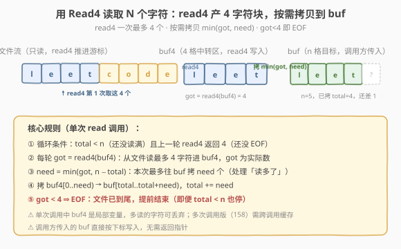
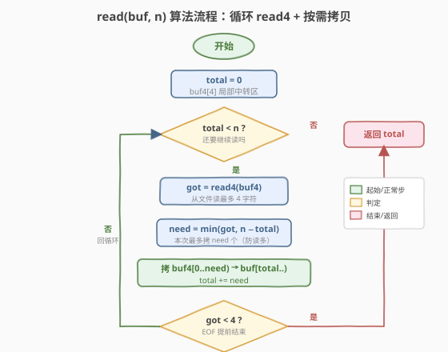
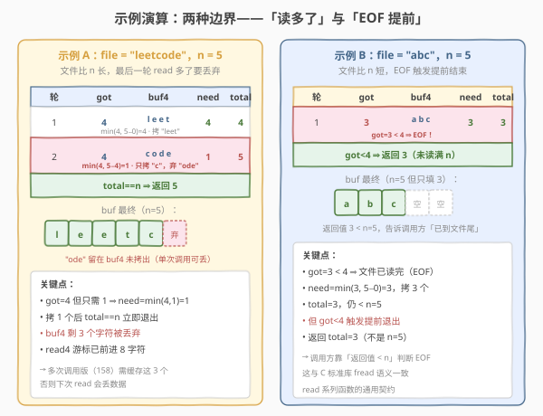

# LeetCode 用 Read4 读取 N 个字符 题解

## 1. 题目概述

- **标题 / 题号**：用 Read4 读取 N 个字符（#157，easy）
- **链接**：https://leetcode.cn/problems/read-n-characters-given-read4/
- **难度**：简单
- **标签**：字符串、模拟、交互式 API

**题意**：给定一个**只读文件**与一个已实现的接口 `read4`，要求你实现 `read`，从文件中读取**至多 `n` 个字符**写入调用方提供的缓冲区 `buf`，并返回**实际读取的字符数**。

**接口契约**：

```cpp
// 从文件读最多 4 个字符，写入 buf4，返回实际读到的个数
// 返回值 < 4 表示已读到文件尾（EOF）
int read4(char *buf4);

// 你需要实现：从文件读最多 n 个字符写入 buf，返回实际个数
int read(char *buf, int n);
```

> ⚠️ 注意 `read4` 的两个关键性质：① 每次最多读 **4** 个字符；② 返回值 `< 4` 即 **EOF 信号**（文件已读完，不是出错）。`read4` 内部维护文件游标，每次调用自动推进——你无法回退、无法 peek，只能顺序调用。

**示例 1**：

```text
输入：file = "abc", n = 4
输出：3
解释：read4 第 1 次返回 3（"abc"，EOF），拷 3 个；返回 3 < n=4。
```

**示例 2**：

```text
输入：file = "abcde", n = 5
输出：5
解释：第 1 次 read4 → "abcd"（4），拷 4；第 2 次 read4 → "e"（1，EOF），拷 1；返回 5。
```

**示例 3**：

```text
输入：file = "abcdABCD1234", n = 12
输出：12
解释：3 次 read4 各返回 4，共 12 个字符，正好读满。
```

**约束**：

- `1 <= file.length <= 500`
- `1 <= n <= 1000`
- 保证 `buf` 至少有 `n` 字节可用空间
- `read` 在整个测试中**只被调用一次**（本题是单次调用版；多次调用版见 [158](https://leetcode.cn/problems/read-n-characters-given-read4-ii-call-multiple-times/)）

> 💡 本题是「**API 模拟 + 内部缓冲区**」家族的入门款。核心是处理 `read4` 一次产出 **4 个字符**与 `read` 一次需要 **`n` 个字符**之间的**粒度不匹配**：要么 `read4` 读多了要丢弃，要么 `read4` 读少了（EOF）要提前结束。下文 2.2 给出统一处理范式。

## 2. 解题思路

### 2.1 暴力思路：一次性读全部再截断

最朴素的想法：循环调 `read4` 把整个文件读进一个临时大缓冲区，再一次性 `memcpy` 前 `n` 个到 `buf`。能过，但有两个硬伤：

1. **空间 $O(\text{file.length})$**：文件可能很大，临时缓冲区随文件增长，不优雅；
2. **多读了文件**：即便 `n=1`，也可能把整个文件读完（`read4` 一直调到 EOF），做了无谓的 I/O。

正确做法是**「边读边拷、按需停止」**：每读完一个 `buf4`（4 字符）就立刻按需拷到 `buf`，读满 `n` 或撞上 EOF 立即停。

### 2.2 核心观察：read4 是 4 字节中转区，按需拷贝



**关键洞察**：把 `read4` 看作一个**容量为 4 的中转桶**——每轮它从文件舀最多 4 字符进 `buf4`，你立刻从 `buf4` 舀 `need = min(got, n - total)` 个进 `buf`。两件事决定每轮舀多少：

- **`got`**：`read4` 这一轮实际给了几个（`0 ≤ got ≤ 4`）；
- **`need`**：`buf` 还差几个才到 `n`，即 `n - total`。

两者取小就是本轮实际拷贝数。`got < 4` 时不管 `need` 还多大，都意味着文件已尽、拷完这轮就停。于是只需**一个循环 + 两个出口**：

```text
while total < n:
    got = read4(buf4)              # 舀一桶
    need = min(got, n - total)     # 这桶能用上几个
    拷 buf4[0..need) → buf[total..total+need)
    total += need
    if got < 4: break              # EOF，文件已尽
return total
```

> 💡 **为什么 `need = min(got, n - total)` 是全题核心？** 它统一处理了两种边界：① `got` 大于剩余需求（`read4` 读多了）——只拷 `n - total` 个，多出的留在 `buf4` 里**本轮丢弃**（单次调用合法）；② `got` 小于剩余需求（EOF 临近）——只拷 `got` 个，并靠 `got < 4` 触发提前退出。一行 `min` 把两个 if 收敛掉，是模板的精髓。

> ⚠️ **单次调用 vs 多次调用**：本题保证 `read` 只被调一次，故 `buf4` 是**局部变量**，多读的字符丢弃无妨。但 [158. 用 Read4 读取 N 个字符 II（多次调用）](https://leetcode.cn/problems/read-n-characters-given-read4-ii-call-multiple-times/) 中 `read` 会被多次调用——上次 `read4` 多读的字符必须**跨调用缓存**到下次 `read` 先消费，否则数据丢失。这正是 158 把 `buf4` 与一个「缓存指针」升格为成员变量的原因。本题只需理解「按需拷贝」骨架，158 在此基础上加一层持久化。

### 2.3 算法流程图



**完整步骤**：

1. **初始化** `total = 0`（已拷到 `buf` 的字符数），声明局部 `buf4[4]`（4 字节中转区）；
2. **循环**（`total < n` 时）：
   - 调 `got = read4(buf4)`，从文件读最多 4 字符进 `buf4`；
   - 算 `need = min(got, n - total)`：本轮能往 `buf` 拷的上限；
   - 拷 `buf4[0..need)` 到 `buf[total..total + need)`；
   - `total += need`；
   - **EOF 判定**：`got < 4` ⇒ 文件已尽，`break`（即便 `total < n` 也停）；
3. **返回** `total`（实际读到的字符数，可能 `< n`）。

> ⚠️ **两个出口缺一不可**：`total < n`（读满即停，处理「读多了」）与 `got < 4`（EOF 即停，处理「读少了」）。只写前者会无限读文件（多读的丢掉但循环不停）；只写后者会越过 `n` 写溢出 `buf`。

### 2.4 示例演算

用两个对比例子覆盖两种边界——「读多了要丢弃」与「EOF 提前结束」：



| 示例 | file | n | 轮次 | got | buf4 | need | total 后 | 出口 |
|------|------|---|------|-----|------|------|----------|------|
| A | `"leetcode"` | 5 | 1 | 4 | `l e e t` | `min(4,5)=4` | 4 | 继续 |
| A | — | — | 2 | 4 | `c o d e` | `min(4,1)=1` | 5 | `total==n` 退 |
| B | `"abc"` | 5 | 1 | 3 | `a b c` | `min(3,5)=3` | 3 | `got<4` 退 |

- **示例 A**：第 2 轮 `read4` 给了 4 个（`c o d e`），但 `buf` 只差 1 个，`need = 1`，只拷 `c`，丢弃 `ode`，`total` 到 5 立即退出。`read4` 游标虽前进了 8 字符（读了 `leetcode`），但 `buf` 只保留前 5 个——单次调用合法。
- **示例 B**：第 1 轮 `read4` 只返回 3（`got = 3 < 4` ⇒ EOF），拷 3 个后即便 `total = 3 < n = 5` 也得停，返回 3。调用方靠「返回值 `< n`」判断文件已尽——这与 C 标准库 `fread` 的语义完全一致。

> 💡 **观察「丢弃」的发生条件**：仅当 `got > n - total` 即 `read4` 这一桶给得比剩余需求多时才有丢弃。这种丢弃在单次调用中无害（`buf4` 是局部的，函数返回即销毁）；但它是 158 多次调用版必须解决的痛点——多读的字符要存进成员变量供下次 `read` 优先消费。

## 3. 参考代码

### C++

```cpp
/**
 * The read4 API is defined in the parent class Reader4.
 * int read4(char *buf4);
 */
class Solution {
  public:
    int read(char *buf, int n) {
        int total = 0;                 // 已拷到 buf 的字符数
        char buf4[4];                  // 4 字节中转区（局部，单次调用专用）
        while (total < n) {
            int got = read4(buf4);     // 从文件读最多 4 个进 buf4
            int need = min(got, n - total);  // 本轮能往 buf 拷的上限
            // 拷 buf4[0..need) → buf[total..total+need)
            for (int i = 0; i < need; ++i) {
                buf[total + i] = buf4[i];
            }
            total += need;
            if (got < 4) break;        // EOF：文件已尽，提前退出
        }
        return total;
    }
};
```

### Python

```python
"""
The read4 API is already defined for you.
    @param buf4: List[str]
    @return: int
    def read4(buf4: List[str]) -> int:
"""

class Solution:
    def read(self, buf: List[str], n: int) -> int:
        total = 0                       # 已拷到 buf 的字符数
        while total < n:
            buf4 = [''] * 4             # 4 字节中转区（局部，单次调用专用）
            got = read4(buf4)           # 从文件读最多 4 个进 buf4
            need = min(got, n - total)  # 本轮能往 buf 拷的上限
            # 拷 buf4[0..need) → buf[total..total+need)
            for i in range(need):
                buf[total + i] = buf4[i]
            total += need
            if got < 4:                 # EOF：文件已尽，提前退出
                break
        return total
```

> 💡 两版等价，骨架完全一致：`while total < n` 主循环 + `need = min(got, n - total)` 按需拷贝 + `got < 4` 双出口。C++ 用 `memcpy(buf + total, buf4, need)` 也可替代手写循环（更短且可能更快），但手写循环更直观地展示「按下标逐字符拷贝」的语义，便于面试讲解。注意 `buf4` 在 Python 版中每轮重建——因为 `read4` 是按引用写入 `buf4` 的，重建无副作用且免去手动清空。

## 4. 复杂度分析

| 维度 | 复杂度 | 说明 |
|------|--------|------|
| 时间复杂度 | $O(n)$ | 每轮拷 $\le 4$ 字符，循环 $\lceil n/4 \rceil$ 轮即读满 $n$；若文件短于 $n$ 则提前 EOF，总轮数 $\le \lceil \text{file.length}/4 \rceil$ |
| 空间复杂度 | $O(1)$ | 仅 `buf4[4]` 与 `total` / `got` / `need` 常数个局部变量，与 $n$、文件大小无关 |
| `read4` 调用次数 | $\lceil \min(n, \text{file.length}) / 4 \rceil$ | 读满 $n$ 或撞 EOF 即停，不会多调（读满后 `total==n` 直接退出循环，不再调 `read4`） |

> ⚠️ 注意「读多了」场景下 `read4` 可能多读至多 3 个字符（最后一轮 `got=4` 但只拷 `need≤3`），但**至多一轮**的过量读取——因为拷完 `need` 后 `total==n` 立即退出循环，不会再调 `read4`。故 `read4` 调用次数仍为 $\lceil n/4 \rceil$（文件足够长时），过量读取量 $\le 3$。

## 5. 扩展：多次调用版（LeetCode 158）

本题保证 `read` 只被调一次，故 `buf4` 多读的字符可丢弃。但 [158. 用 Read4 读取 N 个字符 II（多次调用）](https://leetcode.cn/problems/read-n-characters-given-read4-ii-call-multiple-times/) 把这层「保护」撤掉——`read` 会被多次调用，上次 `read4` 多读的字符必须**跨调用保留**，下次 `read` 先消费它们再调 `read4`。

**升级点**：把 `buf4` 与一个「缓存指针」升格为**成员变量**：

```cpp
class Solution {
    char buf4[4] = {0};      // 持久化：跨调用保留多读的字符
    int buf4Ptr = 0;         // buf4 中待消费的下标
    int buf4Cnt = 0;         // 上次 read4 实际读到的个数
  public:
    int read(char *buf, int n) {
        int total = 0;
        while (total < n) {
            // 先消费上次缓存里剩下的
            if (buf4Ptr == 0) {            // 缓存空，重新调 read4
                buf4Cnt = read4(buf4);
                if (buf4Cnt == 0) break;   // EOF
            }
            int need = min(buf4Cnt - buf4Ptr, n - total);  // 从缓存取 need 个
            for (int i = 0; i < need; ++i) {
                buf[total + i] = buf4[buf4Ptr + i];
            }
            buf4Ptr += need;
            total += need;
            if (buf4Ptr == buf4Cnt) buf4Ptr = 0;  // 缓存消费完，下轮重新 read4
            if (buf4Cnt < 4 && buf4Ptr == buf4Cnt) break;  // EOF 且缓存空
        }
        return total;
    }
};
```

> 💡 **158 的灵魂**：在 157 的「按需拷贝」骨架上加一层**持久化中转区**。`buf4Ptr` / `buf4Cnt` 两个成员变量把「上次多读的字符」从「丢弃」改成「暂存」。本质是把 `read4` 的 4 字节粒度与 `read` 的 `n` 字节粒度之间的**不匹配**用一个跨调用的缓冲区消解——这是所有「流式 API 包装器」（如 `BufferedReader` 包装 `InputStream`）的通用套路。

> ⚠️ **158 的最易踩坑点**：`buf4Ptr == buf4Cnt`（缓存消费完）时必须**重置 `buf4Ptr = 0`** 并在下一轮重新调 `read4`；否则 `buf4Ptr` 越界读到上次残留数据。本题 157 因为 `buf4` 是局部的、每轮重建，不存在这个坑——这正是单次调用版简单的根本原因。

## 6. 面试要点

1. **`read4` 的返回值含义是什么？为什么 `< 4` 是 EOF 信号？**

   > `read4(buf4)` 从文件读最多 4 个字符写入 `buf4`，返回实际读到的个数。返回 `< 4`（即 `0`、`1`、`2`、`3`）表示文件剩余不足 4 个，已读到尾——这是「EOF 信号」而非错误。返回 `0` 表示文件在本次调用前已读完。理解这一点是写对循环出口的前提。

2. **为什么需要 `need = min(got, n - total)`？只写 `n - total` 行不行？**

   > 不行。`read4` 每次最多给 4 个，但 `buf` 当前剩余需求 `n - total` 可能 $> 4$（继续读）也可能 $< 4$（最后一轮读多了）。若直接拷 `n - total` 个，当 `n - total > got`（EOF 临近）时会越界读 `buf4` 未初始化区域；当 `n - total < got`（读多了）会写溢出 `buf`。`min` 同时守住两端边界。

3. **「读多了」时多读的字符去哪了？为什么本题可以丢弃？**

   > 多读的字符留在 `buf4` 里未被拷出，随 `buf4`（局部变量）的销毁而丢弃。本题保证 `read` 只被调一次，丢弃合法——下次没有 `read` 调用需要这些字符。但 158 多次调用版不能丢：上次多读的必须跨调用保留到成员变量，下次 `read` 先消费它们，否则数据丢失（文件游标已前进，无法回退重读）。

4. **两个循环出口分别处理什么场景？去掉任一会怎样？**

   > `total < n` 处理「读满即停」——去掉会无限循环（`read4` 一直返回 4 但 `buf` 已满，写溢出）；`got < 4` 处理「EOF 提前」——去掉会继续调 `read4`（返回 0），虽不写溢出但浪费 I/O 且语义错误（应返回 `< n` 告知调用方文件已尽）。两者共同覆盖「读多了」与「读少了」两种边界。

5. **本题与 158 多次调用版的本质区别是什么？**

   > **`buf4` 的生命周期**：157 中 `buf4` 是局部变量，每次 `read` 调用独立，多读可丢；158 中 `buf4` 升格为成员变量，跨调用保留多读的字符。158 额外引入 `buf4Ptr`（缓存消费指针）与 `buf4Cnt`（上次读到的个数）两个成员，在 `read` 开头先消费缓存里的剩余再决定是否调 `read4`。骨架（`while total < n` + `need = min(...)` + 双出口）完全相同，区别仅在「中转区是局部的还是持久的」。

> 💡 **一句话总结**：157 的灵魂是「**4 字节中转区 + 按需拷贝**」——`read4` 是粒度为 4 的舀水桶，`buf` 是粒度为 `n` 的目标容器，`need = min(got, n - total)` 用一行 `min` 同时守住「读多了」与「读少了」两端边界，双出口（`total == n` / `got < 4`）覆盖满与 EOF。这个「中转区 + 按需拷贝 + min 守边界」模板是所有流式 I/O 包装器的最小原型，158 仅在其上加一层持久化。

## 同类练习题

| # | 题目 | 与本题的关联 |
|---|------|-------------|
| 158 | [用 Read4 读取 N 个字符 II（多次调用）](https://leetcode.cn/problems/read-n-characters-given-read4-ii-call-multiple-times/) | 本题的多次调用版，把 `buf4` 升格为成员变量 + 缓存指针，处理跨调用的「多读暂存」，骨架相同只加一层持久化 |
| 682 | [棒球比赛](https://leetcode.cn/problems/baseball-game/) | 另一类「按规则操作缓冲区」的模拟题，用栈记录历史得分，对照本题的「按 API 契约操作缓冲区」 |
| 1700 | [无法吃午餐的学生数量](https://leetcode.cn/problems/number-of-students-unable-to-eat-lunch/) | 双队列模拟 + 提前退出判定，同属「模拟 + 边界条件触发停止」家族 |
| 860 | [柠檬水找零](https://leetcode.cn/problems/lemonade-change/) | 贪心模拟 + 状态变量记录可用零钱，对照本题用 `total` 状态变量记录已读进度 |
| 159 | [至多包含两个不同字符的最长子串](https://leetcode.cn/problems/longest-substring-with-at-most-two-distinct-characters/) | 滑动窗口「按需扩展/收缩」的边界控制，对照本题「按需拷贝/停止」的边界控制思维 |
