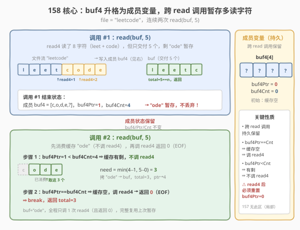
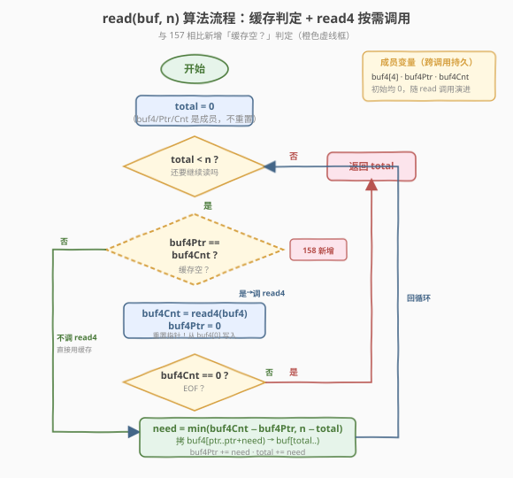
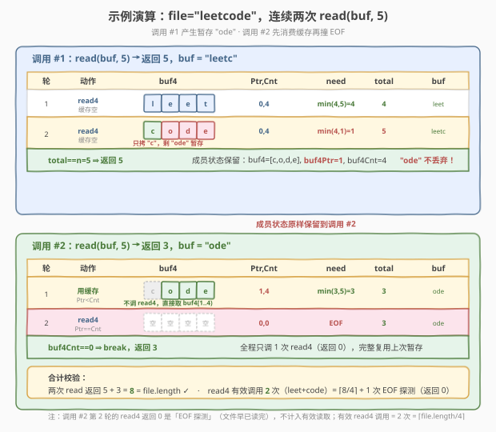

# 用 Read4 读取 N 个字符 II（多次调用）

- **题目名称**：用 Read4 读取 N 个字符 II（多次调用）
- **链接**：[158. Read N Characters Given Read4 II - Call multiple times](https://leetcode.cn/problems/read-n-characters-given-read4-ii-call-multiple-times/)
- **难度**：困难
- **标签**：字符串、模拟、交互式 API、设计

## 1. 题目概述

给定一个**只读文件**与一个已实现的接口 `read4`，要求你实现 `read`，从文件中读取**至多 `n` 个字符**写入调用方提供的缓冲区 `buf`，并返回**实际读取的字符数**。与 [157](https://leetcode.cn/problems/read-n-characters-given-read4/) 的唯一区别是：**`read` 在整个测试中会被调用多次**，且各次调用共享同一个文件游标——你必须保证上次 `read4`「多读」的字符不丢失，在下次 `read` 中优先交付。

**接口契约**：

```cpp
// 从文件读最多 4 个字符，写入 buf4，返回实际读到的个数
// 返回值 < 4 表示已读到文件尾（EOF）
int read4(char *buf4);

// 你需要实现：从文件读最多 n 个字符写入 buf，返回实际个数
// ⚠️ 本题中 read 会被多次调用，跨调用共享文件游标
int read(char *buf, int n);
```

> ⚠️ `read4` 内部维护文件游标，每次调用自动推进——**你无法回退、无法 peek，只能顺序调用**。一旦某轮 `read4` 读出了 4 个字符但本轮 `read` 只需要其中 1 个，剩下的 3 个若不存下来，下次 `read` 就再也读不到它们（文件游标已越过）。这是 158 相对 157 的唯一新增难点。

**示例 1**（多次调用，跨调用复用缓存）：

```text
file = "abc"
read(buf, 1) → 返回 1，buf = "a"     // read4 一次读出 "abc"（got=3, EOF），只交付 "a"，剩 "bc" 暂存
read(buf, 2) → 返回 2，buf = "bc"    // 先消费上次暂存的 "bc"，无需再调 read4
read(buf, 1) → 返回 0，buf = ""      // 缓存空，调 read4 返回 0（EOF），返回 0
```

**示例 2**（单次调用内也会产生暂存）：

```text
file = "leetcode"，read(buf, 5) → 返回 5，buf = "leetc"
解释：
  第 1 次 read4 → "leet"（got=4），拷 4，total=4
  第 2 次 read4 → "code"（got=4），need=min(4,1)=1，只拷 "c"，剩 "ode" 暂存
  返回 5。若紧接着再 read(buf, 5)，下次会先消费 "ode" 再调 read4。
```

**约束条件**：

- `1 <= file.length <= 500`
- `1 <= n <= 1000`
- 保证 `buf` 至少有 `n` 字节可用空间
- `read` 在整个测试中**会被调用多次**（这是本题与 157 的本质区别）

> 💡 本题是 [157](https://leetcode.cn/problems/read-n-characters-given-read4/) 的多次调用版。157 中 `buf4` 是局部变量、用完即丢；158 中 `buf4` 必须升格为**成员变量**，配一个消费指针 `buf4Ptr` 与已读计数 `buf4Cnt`，把「上次多读的字符」从「丢弃」改成「跨调用暂存」。骨架（`while total < n` + `need = min(...)` + 双出口）完全沿用 157，只加一层持久化。

---

## 2. 解题思路

### 2.1 暴力思路：每次 read 都从文件重新读

最朴素的错误做法：照搬 157，每次 `read` 用局部 `buf4` 循环调 `read4` 直到读满 `n` 或 EOF。问题在于：上次 `read` 多读的字符（留在局部 `buf4` 里）随函数返回销毁了，而文件游标已被 `read4` 推进——下次 `read` 调 `read4` 拿到的是**后续字符**，中间那段永久丢失。

```text
file = "abc"
read(buf,1)：read4 → "abc"（got=3），只拷 "a"，局部 buf4 销毁，"bc" 丢失 ❌
read(buf,2)：read4 → 0（EOF，文件已读完），返回 0 ❌   // 应返回 2，buf="bc"
```

**根因**：`read4` 的粒度是 4，`read` 的粒度是 `n`，两者不匹配时 `read4` 会「读多了」。单次调用中多读可丢（157），多次调用中多读必须存。修复办法是引入一个**跨调用持久化的中转区**。

### 2.2 核心观察：buf4 升格为成员变量，先消费缓存再 read4



**关键洞察**：把 157 里的局部 `buf4[4]` 升格为**成员变量**，再配两个状态量：

- **`buf4[4]`**：持久化中转区，跨 `read` 调用保留 `read4` 上次多读的字符；
- **`buf4Ptr`**：`buf4` 中下一个待消费的下标（已消费到哪了）；
- **`buf4Cnt`**：上次 `read4` 实际读到的个数（`buf4` 里有效数据是 `buf4[0..buf4Cnt)`）。

每次 `read` 进入循环后，**先看缓存里还有没有剩的**：

- **`buf4Ptr == buf4Cnt`**（缓存空）⇒ 调 `read4` 重新装一桶，重置 `buf4Ptr = 0`；若 `read4` 返回 0 即 EOF，直接 break；
- **`buf4Ptr < buf4Cnt`**（缓存有剩）⇒ 不调 `read4`，直接从 `buf4[buf4Ptr..buf4Cnt)` 里取。

取多少仍由 157 那行 `min` 决定，只是「剩余供给」从 `got` 变成 `buf4Cnt - buf4Ptr`（缓存里还剩几个）：

```text
need = min(buf4Cnt - buf4Ptr, n - total)   // 供给取小：缓存剩的 vs buf 还差的
拷 buf4[buf4Ptr..buf4Ptr+need) → buf[total..total+need)
buf4Ptr += need
total += need
```

> 💡 **为什么 `buf4Ptr == buf4Cnt` 是「缓存空」的信号？** 初始时 `buf4Ptr = buf4Cnt = 0`，天然触发首次 `read4`。之后每消费一个字符 `buf4Ptr++`，当 `buf4Ptr` 追上 `buf4Cnt` 即表示这一桶已全部交付，需要重新装。这避免了「何时调 read4」的额外标志位——两个下标的相等关系就是信号，是本题最优雅的写法。

> ⚠️ **最易踩坑点**：缓存消费完后**必须重置 `buf4Ptr = 0`** 再调 `read4`（因为 `read4` 从 `buf4[0]` 开始写）。若忘了重置，`buf4Ptr` 会越界读到上次残留数据，或新数据被写到旧位置后下标对不上。157 因为 `buf4` 每轮重建，不存在这个坑——这正是单次调用版简单的根本原因。

### 2.3 算法流程图



**完整步骤**：

1. **初始化** `total = 0`（本次 `read` 已拷到 `buf` 的字符数）；`buf4` / `buf4Ptr` / `buf4Cnt` 是成员变量，跨调用持久，首次进入时均为 0；
2. **主循环**（`total < n` 时）：
   - **缓存判定**：`buf4Ptr == buf4Cnt`（缓存空）⇒ 调 `buf4Cnt = read4(buf4)`，重置 `buf4Ptr = 0`；
   - **EOF 出口**：若 `buf4Cnt == 0`（`read4` 没读到，文件已尽），`break`；
   - **按需拷贝**：`need = min(buf4Cnt - buf4Ptr, n - total)`，拷 `buf4[buf4Ptr..buf4Ptr+need)` 到 `buf[total..)`；
   - **推进指针**：`buf4Ptr += need`，`total += need`；
3. **返回** `total`（本次实际读到的字符数，可能 `< n`）。

> ⚠️ **三个出口/分支缺一不可**：① `total < n` 主循环条件（读满即停）；② `buf4Ptr == buf4Cnt` 判定（决定调不调 `read4`，避免无谓 I/O 与数据丢失）；③ `buf4Cnt == 0` 的 EOF 出口（文件已尽，即便 `total < n` 也停）。157 的 `got < 4` 出口在这里被拆成两步：`read4` 返回值存入 `buf4Cnt`，下一轮循环若 `buf4Ptr == buf4Cnt == 0` 自然 break——但显式判 `buf4Cnt == 0` 更清晰。

### 2.4 示例演算

用 `file = "leetcode"`、连续两次 `read(buf, 5)` 演示「单次调用内产生暂存 + 跨调用复用暂存 + EOF 终止」三阶段：



| 调用 | 轮次 | 触发动作 | buf4 状态 | need | total 后 | 说明 |
|------|------|----------|-----------|------|----------|------|
| `read(buf,5)` #1 | 1 | `read4`→"leet" | `[l,e,e,t,?]` ptr=0,cnt=4 | `min(4,5)=4` | 4 | 缓存空，调 read4，全拷 |
| #1 | 2 | `read4`→"code" | `[c,o,d,e,?]` ptr=0,cnt=4 | `min(4,1)=1` | 5 | 缓存空，再调 read4，只拷 `c`，**剩 `ode`** |
| #1 返回 | — | `total==n` 退出 | ptr=1,cnt=4 | — | 5 | buf="leetc"，**`ode` 留在成员 buf4** |
| `read(buf,5)` #2 | 1 | 不调 read4 | `[c,o,d,e,?]` ptr=1,cnt=4 | `min(3,5)=3` | 3 | **先消费缓存 `ode`**，ptr 追到 4 |
| #2 | 2 | `read4`→0 (EOF) | ptr=0,cnt=0 | — | 3 | ptr==cnt→调 read4，返回 0，break |
| #2 返回 | — | EOF 退出 | ptr=0,cnt=0 | — | 3 | buf="ode"，两次合计 5+3=8=文件长 ✓ |

- **调用 #1**：与 157 单次调用版行为完全一致——第 2 轮 `read4` 给了 4 个（`code`），但只差 1 个，`need=1` 只拷 `c`。区别在于：157 里 `ode` 随局部 `buf4` 销毁丢弃；158 里 `buf4` 是成员变量，`ode` 连同 `buf4Ptr=1` / `buf4Cnt=4` 一起**保留到对象下一次 `read`**。
- **调用 #2**：进入循环时 `buf4Ptr=1 < buf4Cnt=4`，**不调 `read4`**，直接从缓存取 `buf4[1..4)` 即 `ode`，`need = min(3, 5) = 3`，一次拷完，`total=3`。接着 `buf4Ptr=4 == buf4Cnt=4`，触发 `read4` 返回 0（文件早已读完），break，返回 3。**全程只调了 1 次 `read4`**（且返回 0），完整复用了上次暂存。
- **合计**：两次 `read` 共返回 $5 + 3 = 8$ 个字符，恰等于 `file.length`，无丢失无重复——这正是 158 正确性的判据。

> 💡 **观察「暂存」与「丢弃」的边界**：暂存发生在「`read4` 给的比本轮 `read` 需要的多」时，即 `buf4Cnt - buf4Ptr > n - total`。157 把这部分丢弃（局部变量），158 把这部分保留（成员变量）。两者分界线就是 `buf4` 的存储期——这是 158 相对 157 的**唯一**新增语义。

---

## 3. 参考代码

### C++

```cpp
/**
 * The read4 API is defined in the parent class Reader4.
 * int read4(char *buf4);
 */
class Solution {
    char buf4[4] = {0};      // 持久化中转区：跨 read 调用保留多读的字符
    int buf4Ptr = 0;         // buf4 中下一个待消费的下标
    int buf4Cnt = 0;         // 上次 read4 实际读到的个数（有效区间 [0, buf4Cnt)）
  public:
    int read(char *buf, int n) {
        int total = 0;
        while (total < n) {
            // 缓存已消费完（buf4Ptr 追上 buf4Cnt），重新调 read4 装一桶
            if (buf4Ptr == buf4Cnt) {
                buf4Cnt = read4(buf4);
                buf4Ptr = 0;
                if (buf4Cnt == 0) break;   // EOF：文件已尽
            }
            // 从缓存取 need 个到 buf（供给 = buf4Cnt - buf4Ptr，需求 = n - total）
            int need = min(buf4Cnt - buf4Ptr, n - total);
            for (int i = 0; i < need; ++i) {
                buf[total + i] = buf4[buf4Ptr + i];
            }
            buf4Ptr += need;
            total += need;
        }
        return total;
    }
};
```

### Python

```python
"""
The read4 API is already defined for you.
    @param buf4: List[str]
    @return: int
    def read4(buf4: List[str]) -> int:
"""

class Solution:
    def __init__(self):
        self.buf4 = [''] * 4     # 持久化中转区：跨 read 调用保留多读的字符
        self.buf4Ptr = 0         # buf4 中下一个待消费的下标
        self.buf4Cnt = 0         # 上次 read4 实际读到的个数

    def read(self, buf: List[str], n: int) -> int:
        total = 0
        while total < n:
            # 缓存已消费完，重新调 read4 装一桶
            if self.buf4Ptr == self.buf4Cnt:
                self.buf4Cnt = read4(self.buf4)
                self.buf4Ptr = 0
                if self.buf4Cnt == 0:        # EOF：文件已尽
                    break
            # 从缓存取 need 个到 buf（供给 = buf4Cnt - buf4Ptr，需求 = n - total）
            need = min(self.buf4Cnt - self.buf4Ptr, n - total)
            for i in range(need):
                buf[total + i] = self.buf4[self.buf4Ptr + i]
            self.buf4Ptr += need
            total += need
        return total
```

> 💡 两版骨架完全一致，与 157 的差异仅在三处：① `buf4` / `buf4Ptr` / `buf4Cnt` 升格为**成员变量**（Python 版需显式 `__init__` 初始化）；② 循环开头加 `if (buf4Ptr == buf4Cnt)` 判定，决定「调 read4 还是直接用缓存」；③ EOF 判定从 `got < 4` 改为 `buf4Cnt == 0`（`read4` 返回 0 才是真 EOF；返回 1~3 时缓存里还有数据，下一轮循环自然消费完再退出）。Python 版注意 `read4` 按引用写入 `self.buf4`，故 `buf4` 必须是成员而非每次新建——这正是「持久化」的物理体现。

> ⚠️ **Python `__init__` 不能省**：LeetCode 的 Solution 对象在一次测试中被复用（多次调 `read`），`__init__` 在对象创建时执行一次，把三个状态量初始化为 0/空。若把初始化写进 `read` 里，每次调用都会清空缓存，退化成 157 的错误版本。

---

## 4. 复杂度分析

| 维度 | 复杂度 | 说明 |
|------|--------|------|
| 时间复杂度（单次 read） | $O(n)$ | 每轮拷 $\le 4$ 字符，循环 $\lceil n/4 \rceil$ 轮即读满；若文件短于剩余需求则提前 EOF |
| 时间复杂度（全程） | $O(\text{file.length} + q)$ | $q$ 为 `read` 调用次数。所有 `read` 合计读取字符数 $\le$ 文件长度，每字符拷一次；每次 `read` 至多一次 EOF 探测（`read4` 返回 0） |
| 空间复杂度 | $O(1)$ | 仅 `buf4[4]` 与 `buf4Ptr` / `buf4Cnt` / `total` 常数个成员/局部变量，与 $n$、文件大小无关 |
| `read4` 有效调用次数 | $\lceil \text{file.length} / 4 \rceil$ | 返回 $> 0$ 的调用数：每个 4 字符块至多调一次，跨调用复用缓存后**绝不重复读**已读部分 |
| `read4` EOF 探测次数 | $\le q$ | 返回 0 的调用数：仅在缓存空且 `total < n` 时探测，每次 `read` 至多 1 次 |

> ⚠️ 关键不变量：**`read4` 返回 $> 0$ 的调用数 = $\lceil \text{file.length} / 4 \rceil$**，与 `read` 被拆成多少次调用无关。因为缓存保证「读过的字符必先交付给某个 `read`，绝不丢弃」，故 `read4` 只会单调前进直到 EOF。若你的实现中**返回 $> 0$ 的 `read4` 调用数**超过这个值，说明缓存逻辑有 bug（重复读了已读部分）。注意：缓存空且文件已尽时仍会调一次 `read4` 拿到 0 来确认 EOF——这是「EOF 探测」，不读数据，每次 `read` 至多一次。

---

## 5. 扩展：与 157 的对照与流式包装器模式

### 5.1 157 vs 158 差异矩阵

| 维度 | 157（单次调用） | 158（多次调用） |
|------|----------------|----------------|
| `buf4` 存储期 | 局部变量，函数返回即销毁 | **成员变量**，跨调用持久 |
| 多读的字符 | 丢弃（合法，无后续调用） | **暂存**到成员 `buf4`，下次 `read` 先消费 |
| 状态变量 | 仅 `total` / `got` / `need`（局部） | 多 `buf4Ptr` / `buf4Cnt`（成员） |
| 「何时调 read4」 | 每轮必调 | **`buf4Ptr == buf4Cnt` 时才调** |
| EOF 判定 | `got < 4` | `buf4Cnt == 0`（read4 返回 0） |
| 骨架 | `while total<n` + `need=min(got, n-total)` + 双出口 | **完全相同**，仅 `got` 换成 `buf4Cnt - buf4Ptr` |
| 难度 | 简单 | 困难（仅因跨调用状态管理） |

两题共用同一套「中转区 + 按需拷贝 + `min` 守边界」骨架，158 仅在其上加一层持久化。理解 157 后，158 的新增心智负担只有一件事：**`buf4` 从局部变成员，配两个下标管消费进度**。

### 5.2 流式 API 包装器模式

本题是「**流式包装器**」模式的最小原型——用一个内部缓冲区把「底层粗粒度 I/O（`read4`，4 字节）」适配成「上层细粒度 I/O（`read`，`n` 字节）」。这套模式在工程中无处不在：

| 上层 API | 底层 API | 中转区 | 对应关系 |
|----------|----------|--------|----------|
| `BufferedReader.read()` | `InputStream.read(byte[])` | 内部 `char[]` 缓冲 | `buf4` = 内部缓冲，`buf4Ptr`/`buf4Cnt` = 缓冲游标 |
| `fread(buf, 1, n, fp)` | OS `read(fd, block, BLOCK_SIZE)` | stdio 内部 `FILE.buf` | C 标准库的 `FILE` 结构体里就有等价的缓冲区与指针 |
| `Scanner.nextInt()` | `InputStream.read()` | 内部 token 缓冲 | 读一个 int 却要读一整行/一块，多读的暂存下次用 |

> 💡 **设计精髓**：底层 I/O 按「块」读（减少系统调用/磁盘寻道，摊销开销），上层按「字节/少量字节」消费。两者粒度不匹配时，中间用一块缓冲区消解——多读的暂存，少读的再补。158 的 `buf4` 就是这块缓冲区的最小化形（容量仅 4），`buf4Ptr`/`buf4Cnt` 就是缓冲区的读游标与有效长度。把这个最小原型想通，再看 `BufferedReader` 源码会豁然开朗。

---

## 6. 面试要点

1. **158 与 157 的本质区别是什么？为什么不能直接套用 157 的代码？**

   > **`buf4` 的生命周期**：157 中 `buf4` 是局部变量，每次 `read` 独立、多读可丢；158 中 `buf4` 升格为成员变量，跨调用保留多读的字符。若直接套 157，上次 `read` 多读的字符随局部 `buf4` 销毁丢失，而文件游标已被 `read4` 推进——下次 `read` 拿到的是后续字符，中间那段永久丢失。修复：把 `buf4` 与 `buf4Ptr`/`buf4Cnt` 升格为成员，下次 `read` 先消费缓存再调 `read4`。

2. **为什么用 `buf4Ptr == buf4Cnt` 判断「是否调 read4」？用一个单独的 bool 标志位行不行？**

   > 行，但多余。`buf4Ptr` 与 `buf4Cnt` 的相等关系天然就是「缓存空」的信号：初始 `0==0` 触发首次 read4；每消费一个 `buf4Ptr++`，追上 `buf4Cnt` 即表示这一桶交付完毕。引入额外 bool 既增加状态又多一处需同步的不变量，违背「用数据本身的相等关系表达状态」的极简原则。两个下标一对照，状态自明。

3. **缓存消费完后为什么要重置 `buf4Ptr = 0`？不重置会怎样？**

   > `read4` 始终从 `buf4[0]` 开始写入。若 `buf4Ptr` 不归零就调 `read4`，新数据覆盖 `buf4[0..got)` 但 `buf4Ptr` 仍指向旧位置，下次消费会从错位下标读取——读到残留旧数据或越界。157 因 `buf4` 每轮重建（局部变量），`buf4Ptr` 隐式归零，没这个坑。158 必须显式 `buf4Ptr = 0` 与 `read4` 配对出现，这是最易踩的 bug。

4. **EOF 的判定为什么从 157 的 `got < 4` 改成 `buf4Cnt == 0`？**

   > 157 中 `read4` 返回值 `got` 当轮用当轮判，`got < 4`（含 1/2/3）即 EOF。158 中 `read4` 的结果存进 `buf4Cnt` 跨轮使用：返回 1~3 时缓存里还有数据，必须先消费完才能退出，不能见 `< 4` 就 break（否则丢数据）。只有 `read4` 返回 **0** 才是「文件在本次调用前已读完」的真 EOF。所以判定收紧为 `buf4Cnt == 0`，而「返回 1~3 的尾部数据」靠下一轮 `buf4Ptr == buf4Cnt` 自然消费完再触发退出。

5. **如何验证你的实现是正确的？有哪些不变量？**

   > 三个不变量：① **字符无丢失无重复**——所有 `read` 调用返回值之和 $\le$ 文件长度，且拼接后是文件的某个前缀；② **`read4` 返回 $> 0$ 的调用数 = $\lceil \text{file.length}/4 \rceil$**——缓存保证不重复读已读部分（另可能有至多 $q$ 次 EOF 探测返回 0，$q$ 为 `read` 调用数）；③ **每次 `read` 返回值 $\le n$**——`need = min(...)` 守住上界。测试时用「文件长度非 4 的倍数」+「`n` 非 4 的倍数」+「多次小 `n` 拆分读取」的组合最容易暴露 bug，例如 `file="abc"` + `[1,2,1]` 三次调用应返回 `[1,2,0]`。

> 💡 **一句话总结**：158 的灵魂是「**4 字节中转区升格为成员变量 + 跨调用暂存多读字符**」——把 157 的局部 `buf4` 加两个下标 `buf4Ptr`/`buf4Cnt` 升格为成员，`read` 开头先消费缓存里剩下的再调 `read4`，骨架（`while total<n` + `need=min(供给, 需求)` + 双出口）完全沿用 157。这是所有「流式 I/O 包装器」（`BufferedReader` / `fread` / `Scanner`）的最小原型：用一块内部缓冲区消解底层粗粒度与上层细粒度之间的不匹配。

---

## 7. 同类练习题

- [157. 用 Read4 读取 N 个字符](https://leetcode.cn/problems/read-n-characters-given-read4/)：本题的单次调用版，`buf4` 是局部变量、多读可丢。先做 157 掌握「中转区 + 按需拷贝 + min 守边界」骨架，再加一层持久化即得 158
- [232. 用栈实现队列](https://leetcode.cn/problems/implement-queue-using-stacks/)：双栈倒换摊销 O(1)，与本题「中转区 + 跨操作暂存」同属「用内部缓冲区适配两种粒度/两种顺序」的设计模式
- [933. 最近的请求次数](https://leetcode.cn/problems/number-of-recent-calls/)：跨多次调用维护一个队列状态，对照本题跨多次 `read` 维护 `buf4` 缓存状态
- [715. Range 模块](https://leetcode.cn/problems/range-module/)：跨多次调用维护区间状态的设计题，对照本题跨调用维护缓冲区状态
- [139. 单词拆分](https://leetcode.cn/problems/word-break/)：用 `dp` 数组缓存子问题结果避免重复计算，对照本题用 `buf4` 缓存多读字符避免重复读文件——都是「缓存换 I/O/计算」的思维
