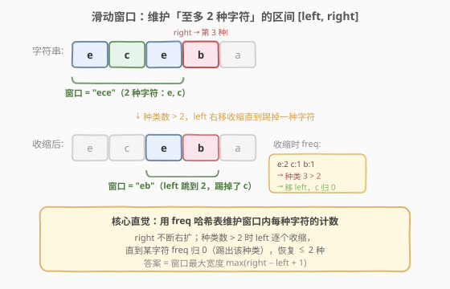
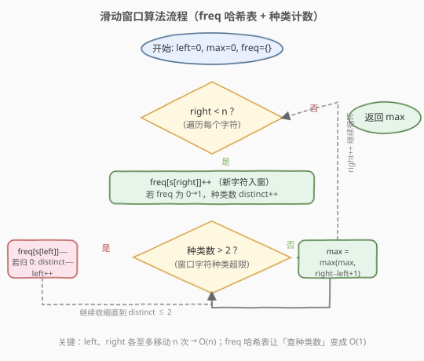
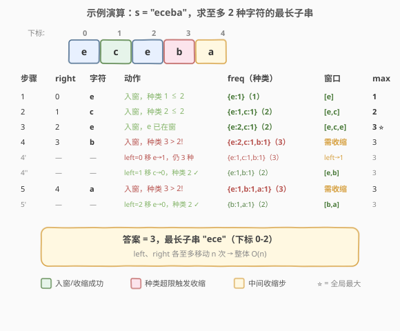

# LeetCode 至多包含两个不同字符的最长子串 题解

## 1. 题目概述

- **标题 / 题号**：至多包含两个不同字符的最长子串（#159，medium）
- **链接**：https://leetcode.cn/problems/longest-substring-with-at-most-two-distinct-characters/
- **难度**：中等
- **标签**：哈希表、字符串、滑动窗口

**题意**：给定一个字符串 `s`，找出其中**至多包含两个不同字符**的最长子串的长度，并返回该长度。

**示例 1**：

```text
输入：s = "eceba"
输出：3
解释：子串 "ece" 包含 2 种字符（e、c），长度为 3，是满足条件的最长子串。
```

**示例 2**：

```text
输入：s = "ccaabbb"
输出：5
解释：子串 "aabbb" 包含 2 种字符（a、b），长度为 5，是满足条件的最长子串。
```

**约束**：

- `1 <= s.length <= 10^4`
- `s` 由英文字母组成

> 💡 本题是 LeetCode 会员题，但其泛化版 [340. 至多包含 K 个不同字符的最长子串](https://leetcode.cn/problems/longest-substring-with-at-most-k-distinct-characters/) 为公开题。把 340 的 `k` 取 2 即是本题，因此两题完全同构。

## 2. 解题思路

### 2.1 暴力思路

枚举所有子串 `[i, j]`，用集合统计其中不同字符的种类数，若 `≤ 2` 则更新答案。时间复杂度 $O(n^2)$（枚举 $O(n^2)$ × 集合判定 $O(1)$ 均摊），对于 $n = 10^4$ 会达到 $10^8$ 量级，边界上可能超时且不够优雅。

### 2.2 核心观察：滑动窗口 + 频率哈希表



关键直觉是维护一个**至多含 2 种字符的窗口** `[left, right]`：

- `right` 指针不断右移，把新字符纳入窗口（`freq[c]++`）。
- 一旦窗口内**不同字符种类数 > 2**，就从 `left` 端逐个收缩（`freq[s[left]]--`，归 0 则该种类被踢出），直到种类数恢复 `≤ 2`。
- 窗口在每次收缩后都满足条件，答案就是窗口宽度的最大值 `max(right - left + 1)`。

> **为什么用频率表而不是像第 3 题那样记录「最新下标」直接跳？** 第 3 题的约束是「无重复字符」——窗口内每种字符最多出现 1 次，因此遇到重复时可以精准定位旧位置并跳跃。而本题允许同种字符出现多次，仅靠「最新下标」无法判断「踢掉一个字符后种类数是否降到了 2」——必须用频率表计数，直到某字符 `freq` 归 0 才确认该种类被彻底移出窗口。

### 2.3 算法流程图



整体只有一重 `right` 循环，内层 `while` 收缩 `left`。由于 `left`、`right` 都只增不减，二者各自至多移动 `n` 次，总移动次数不超过 `2n`，因此时间复杂度为 $O(n)$。

### 2.4 示例演算



上表逐步展示了 `s = "eceba"` 的完整执行过程：

- 前 3 步窗口不断扩张，`max` 达到 `3`（子串 `"ece"`，2 种字符 e、c）。
- 第 4 步 `right=3` 遇到 `'b'`，种类数升到 3，触发收缩：先移走 `left=0` 的 `'e'`（仍 3 种），再移走 `left=1` 的 `'c'`（`c` 归 0，种类降回 2），窗口变为 `"eb"`。
- 第 5 步 `right=4` 遇到 `'a'`，种类数再次升到 3，收缩移走 `left=2` 的 `'e'`，窗口变为 `"ba"`。
- 最终答案为 `3`。

## 3. 参考代码

### C++（频率哈希表 + 种类计数）

```cpp
class Solution {
  public:
    int lengthOfLongestSubstringTwoDistinct(string s) {
        unordered_map<char, int> freq; // 字符 -> 窗口内出现次数
        int left = 0, max_len = 0, distinct = 0;

        for (int right = 0; right < s.size(); right++) {
            char c = s[right];
            if (freq[c]++ == 0) {   // 新种类入窗
                distinct++;
            }

            while (distinct > 2) {  // 种类超限，收缩 left
                char d = s[left++];
                if (--freq[d] == 0) { // 该种类频率归 0
                    distinct--;
                }
            }

            max_len = max(max_len, right - left + 1);
        }

        return max_len;
    }
};
```

### Python

```python
class Solution:
    def lengthOfLongestSubstringTwoDistinct(self, s: str) -> int:
        freq = {}            # 字符 -> 窗口内出现次数
        left = 0
        max_len = 0
        distinct = 0

        for right, c in enumerate(s):
            freq[c] = freq.get(c, 0) + 1
            if freq[c] == 1:         # 新种类入窗
                distinct += 1

            while distinct > 2:      # 种类超限，收缩 left
                d = s[left]
                freq[d] -= 1
                if freq[d] == 0:    # 该种类频率归 0
                    distinct -= 1
                left += 1

            max_len = max(max_len, right - left + 1)

        return max_len
```

> ⚠️ **易错点**：`distinct` 的增减必须与 `freq` 归 0 严格绑定——`freq[c]` 从 0→1 时 `distinct++`，从 1→0 时 `distinct--`。若忘记维护 `distinct` 而每次都去数哈希表的大小，单次判定会退化到 $O(|\Sigma|)$，虽然不影响整体复杂度但常数更大。

## 4. 复杂度分析

| 维度 | 复杂度 | 说明 |
|------|--------|------|
| 时间复杂度 | $O(n)$ | `left`、`right` 各至多遍历一次，哈希表操作 $O(1)$ |
| 空间复杂度 | $O(|\Sigma|)$ | 哈希表最多存字符集大小；本题英文字母故 $O(1)$，通用字符集为 $O(\min(|\Sigma|, n))$ |

## 5. 扩展：泛化至 K 种字符与「最新下标」优化

### 5.1 泛化为 K 种字符（第 340 题）

把 `while (distinct > 2)` 中的 `2` 换成参数 `k`，即得第 340 题的通用解法：

```cpp
int lengthOfLongestSubstringKDistinct(string s, int k) {
    unordered_map<char, int> freq;
    int left = 0, max_len = 0, distinct = 0;
    for (int right = 0; right < s.size(); right++) {
        if (freq[s[right]]++ == 0) distinct++;
        while (distinct > k) {
            if (--freq[s[left++]] == 0) distinct--;
        }
        max_len = max(max_len, right - left + 1);
    }
    return max_len;
}
```

> 💡 当 `k = 0` 时返回 `0`（空窗口）；当 `k = 1` 时退化为「最长同字符子串」；当 `k = 2` 即本题。

### 5.2 「最新下标」跳跃优化

频率表方案在收缩时需要**逐个移动 `left`**，虽然是均摊 $O(n)$ 但单步可能移动多次。另一种思路是用哈希表记录每种字符的**最新下标**，当种类数超限时，找到「最新下标最小的那个字符」直接把 `left` 跳到它之后——一步完成收缩：

```cpp
int lengthOfLongestSubstringTwoDistinct(string s) {
    unordered_map<char, int> lastPos; // 字符 -> 最新下标
    int left = 0, max_len = 0;
    for (int right = 0; right < s.size(); right++) {
        lastPos[s[right]] = right;
        if (lastPos.size() > 2) {
            // 找最新下标最小的字符，踢掉它
            char toRemove;
            int minPos = INT_MAX;
            for (auto& [ch, pos] : lastPos) {
                if (pos < minPos) { minPos = pos; toRemove = ch; }
            }
            lastPos.erase(toRemove);
            left = minPos + 1;
        }
        max_len = max(max_len, right - left + 1);
    }
    return max_len;
}
```

这个版本 `left` 直接跳跃、无需内层 `while`，但每次超限需 $O(k)$ 扫描哈希表找最小值。当 $k$ 很小时（本题 $k=2$）常数极低；当 $k$ 很大时频率表方案更优。两种方案整体都是 $O(n)$。

## 6. 面试要点

1. **本题和第 3 题（无重复字符的最长子串）的区别是什么？**

   - 第 3 题约束「每种字符至多出现 1 次」，等价于 `k = 1` 的「至多 1 种字符」——遇到重复可直接用「最新下标」跳跃。本题允许同种字符出现多次，需要用**频率表**计数，直到某字符频率归 0 才确认踢出该种类，因此收缩是逐个移动而非跳跃。

2. **`distinct` 变量能否省掉，每次直接看哈希表大小？**

   - 可以用 `freq.size()` 判断种类数，但要注意频率归 0 的键需要主动 `erase`（C++）或 `del`（Python），否则 `size()` 会偏大。维护独立的 `distinct` 计数器可以避免频繁删除键，代码更简洁且常数更小。

3. **为什么 `left` 是逐个移动而不是跳跃？**

   - 频率表只记录「窗口内某字符的总数」，不记录每个实例的位置。要知道「踢掉哪种字符后种类数降到 2」，必须逐个减少 `left` 端字符的频率，直到某个字符频率归 0。这与第 3 题能跳跃的本质区别在于：第 3 题的「重复」是精确到位置的，而本题的「种类超限」是集合层面的。

4. **如何泛化到 K 种字符？**

   - 把 `while (distinct > 2)` 的阈值换成 `k` 即可（第 340 题）。频率表方案对任意 `k` 都适用，是最通用的模板。

5. **如果字符串只含小写字母，有什么优化？**

   - 用 `int freq[26]` 代替哈希表，常数更小；`distinct` 仍按 `freq[c]` 在 0↔1 之间变化时增减。

## 同类练习题

| # | 题目 | 与本题的关联 |
|---|------|-------------|
| 3 | [无重复字符的最长子串](https://leetcode.cn/problems/longest-substring-without-repeating-characters/)（[题解](../0001-0100/3_无重复字符的最长子串.md)） | 同向滑窗 + 哈希表记录最新下标，本题 `k = 1` 的对照 |
| 340 | [至多包含 K 个不同字符的最长子串](https://leetcode.cn/problems/longest-substring-with-at-most-k-distinct-characters/) | 本题的泛化版，把阈值 2 换成 `k` |
| 424 | [替换后的最长重复字符](https://leetcode.cn/problems/longest-repeating-character-replacement/) | 滑窗 + 频率表变体（允许替换 k 次使窗口全同，窗口合法性由「max_freq + k ≥ 窗口长度」判定） |
| 76 | [最小覆盖子串](https://leetcode.cn/problems/minimum-window-substring/)（[题解](../0001-0100/76_最小覆盖子串.md)） | 频率表滑窗求「最小」满足条件窗口，对照本题求「最大」 |
| 209 | [长度最小的子数组](https://leetcode.cn/problems/minimum-size-subarray-sum/) | 同向滑窗求最小窗口，正数单调性驱动收缩 |
