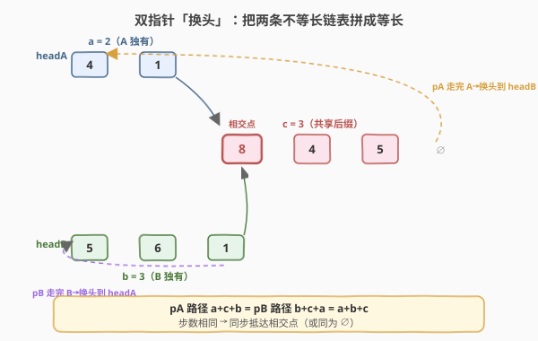
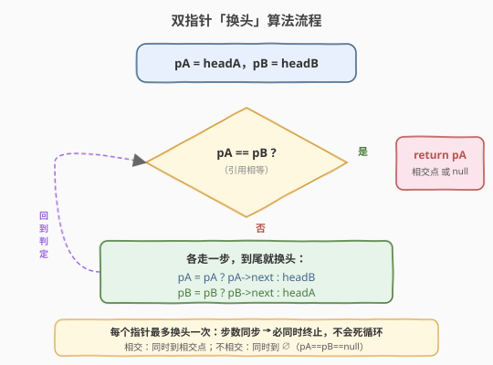
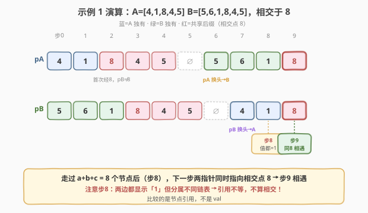

# LeetCode 相交链表 题解

## 1. 题目概述

- **标题 / 题号**：相交链表（#160，easy）
- **链接**：https://leetcode.cn/problems/intersection-of-two-linked-lists/
- **难度**：简单
- **标签**：链表、双指针

**题意**：给你两个单链表的头节点 `headA` 和 `headB`，请你找出并返回两个单链表**相交的起始节点**。如果两个链表不存在相交节点，返回 `null`。

注意：相交指的是**按引用相交**——从某个节点开始，两条链表共享同一段后缀（整体呈 Y 形），而不是仅节点值 `val` 相同。题目保证整条链表中**没有环**，且函数返回结果后链表必须**保持原始结构**（不能修改指针）。

**示例 1**：

```text
输入：intersectVal = 8, listA = [4,1,8,4,5], listB = [5,6,1,8,4,5], skipA = 2, skipB = 3
输出：Intersected at '8'
解释：相交节点的值为 8（注意，如果两个链表相交则不能为 0）。
      从各自的表头开始算起，链表 A 为 [4,1,8,4,5]，链表 B 为 [5,6,1,8,4,5]。
      在 A 中，相交节点前有 2 个节点；在 B 中，相交节点前有 3 个节点。
```

**示例 2**：

```text
输入：intersectVal = 2, listA = [1,9,1,2,4], listB = [3,2,4], skipA = 3, skipB = 1
输出：Intersected at '2'
解释：相交节点的值为 2（注意，如果两个链表相交则不能为 0）。
      在 A 中，相交节点前有 3 个节点；在 B 中，相交节点前有 1 个节点。
```

**示例 3**：

```text
输入：intersectVal = 0, listA = [2,6,4], listB = [1,5], skipA = 3, skipB = 2
输出：null
解释：两链表不相交，返回 null。
```

**约束**：

- `listA` 的节点数目为 `m`，`listB` 的节点数目为 `n`，`0 <= m, n <= 3 * 10^4`
- `1 <= Node.val <= 10^5`
- `0 <= skipA <= m`，`0 <= skipB <= n`
- `intersectVal` 为 `0` 时表示不相交，否则为相交节点的值

**进阶要求**：时间复杂度 $O(m + n)$，空间复杂度 $O(1)$，且不修改链表。

## 2. 解题思路

### 2.1 暴力思路：双重遍历

对链表 A 的每个节点，都去链表 B 里从头扫一遍，看是否**同一个引用**。一旦命中就是相交点。

- 时间 $O(m \times n)$，空间 $O(1)$。
- 数据量大时（$3 \times 10^4$ 级别）会超时，面试只能作为「最先想到但不够好」的起点。

### 2.2 核心观察：双指针「换头」等长法



设链表 A 独有前缀长度为 $a$，链表 B 独有前缀长度为 $b$，共享后缀长度为 $c$（含相交节点本身）。关键直觉是：**两条链表的「独有部分 + 对方的独有部分」长度相等**。

让指针 `pA` 从 `headA` 出发，走完 A 后**跳到** `headB` 继续；指针 `pB` 从 `headB` 出发，走完 B 后**跳到** `headA` 继续：

- `pA` 走过的路径：先走完 A 的 $a + c$ 个节点，再走 B 独有的 $b$ 个节点，共 $a + c + b$ 个节点；
- `pB` 走过的路径：先走完 B 的 $b + c$ 个节点，再走 A 独有的 $a$ 个节点，共 $b + c + a$ 个节点。

两者都走过 $a + b + c$ 个节点，于是**下一步同时指向相交点**——这就是答案。

> 💡 本质：把「两条不等长的链表」拼成「两条等长的虚拟链表」。`pA` 走 `A + B`，`pB` 走 `B + A`，末端对齐后，从共享后缀的起点开始步调一致，第一次「引用相等」处即相交点。

**不相交时呢？** 两指针各走 $m + n$ 步后同时到达 `null`，此时 `pA == pB == null`，循环自然退出并返回 `null`。每个指针最多「换头」一次，不会死循环。

### 2.3 算法流程图



核心循环只做一件事：若 `pA == pB` 就返回；否则各走一步，到末尾就跳到对方头节点。流程极简：

1. `pA = headA`，`pB = headB`。
2. 当 `pA != pB`：
   - `pA` 为空则跳到 `headB`，否则 `pA = pA->next`；
   - `pB` 为空则跳到 `headA`，否则 `pB = pB->next`。
3. 循环退出时 `pA`（即 `pB`）就是相交节点，或同为 `null`。

> ⚠️ **关键细节**：「跳到对方头节点」用 `pA = pA ? pA->next : headB` 实现。每个指针只在第一次碰到 `null` 时换头一次；由于两指针总步数相等，它们必然**同时**到达 `null`（不相交）或**同时**到达相交点，因此不会出现某指针换头两次导致死循环的情况。

### 2.4 示例演算



以示例 1 为例：`A = [4,1,8,4,5]`（$a=2$），`B = [5,6,1,8,4,5]`（$b=3$），相交点为节点 `8`，共享后缀 `[8,4,5]`（$c=3$）。

- `pA` 从 A 出发，走完 A 的 $a+c=5$ 个节点（`4→1→8→4→5→∅`）后换头到 B，再走 B 独有的 $b=3$ 个节点（`5→6→1`），下一步即指向相交点 `8`；
- `pB` 从 B 出发，走完 B 的 $b+c=6$ 个节点（`5→6→1→8→4→5→∅`）后换头到 A，再走 A 独有的 $a=2$ 个节点（`4→1`），下一步同样指向相交点 `8`。

两指针都走过 $a + b + c = 2 + 3 + 3 = 8$ 个节点，于是**下一步同时停在相交点 `8`**。注意是**引用相等**：它们停在内存中同一个 `8` 节点；演算表里还能看到，中途两指针曾都指向 `1` 却分属不同链表（步 8），此时引用不等、不能算相遇。

## 3. 参考代码

### C++（双指针，O(1) 空间，推荐）

```cpp
/**
 * Definition for singly-linked list.
 * struct ListNode {
 *     int val;
 *     ListNode *next;
 *     ListNode(int x) : val(x), next(nullptr) {}
 * };
 */
class Solution {
  public:
    ListNode *getIntersectionNode(ListNode *headA, ListNode *headB) {
        if (headA == nullptr || headB == nullptr) return nullptr;
        ListNode *pA = headA, *pB = headB;
        while (pA != pB) {
            pA = pA ? pA->next : headB; // 走完 A 就跳到 B 的头
            pB = pB ? pB->next : headA; // 走完 B 就跳到 A 的头
        }
        return pA; // 相交点，或同为 null
    }
};
```

### Python（双指针）

```python
class Solution:
    def getIntersectionNode(self, headA: ListNode, headB: ListNode) -> ListNode:
        if not headA or not headB:
            return None
        pA, pB = headA, headB
        while pA is not pB:
            pA = pA.next if pA else headB  # 走完 A 就跳到 B 的头
            pB = pB.next if pB else headA  # 走完 B 就跳到 A 的头
        return pA
```

### 哈希集合法（补充，O(m) 空间）

思路直观：把链表 A 的所有节点引用存入集合，再遍历 B 查第一个命中者。空间换时间，面试可作为「先给出再优化」的过渡方案。

```cpp
class Solution {
  public:
    ListNode *getIntersectionNode(ListNode *headA, ListNode *headB) {
        unordered_set<ListNode*> seen;
        for (ListNode* p = headA; p; p = p->next) seen.insert(p);
        for (ListNode* p = headB; p; p = p->next)
            if (seen.count(p)) return p;
        return nullptr;
    }
};
```

## 4. 复杂度分析

| 维度 | 复杂度 | 说明 |
|------|--------|------|
| 时间复杂度 | $O(m + n)$ | 双指针各最多走 $m + n$ 步；哈希集合法遍历 A+B 同阶 |
| 空间复杂度 | $O(1)$ | 双指针只用两个指针变量；哈希集合法为 $O(m)$ |

## 5. 扩展：长度差对齐法

双指针「换头」法的等价变体是**先对齐长度再同步走**，思路更朴素，适合面试时口述：

1. 分别遍历求出 A、B 的长度 $m$、$n$；
2. 让长链表的指针先走 $|m - n|$ 步，使两指针到末端的剩余距离相等；
3. 两指针同时前进，第一个**引用相等**的节点即相交点。

```cpp
class Solution {
  public:
    ListNode *getIntersectionNode(ListNode *headA, ListNode *headB) {
        int m = 0, n = 0;
        for (ListNode* p = headA; p; p = p->next) ++m;
        for (ListNode* p = headB; p; p = p->next) ++n;
        ListNode *pA = headA, *pB = headB;
        while (m > n) { pA = pA->next; --m; }   // A 更长，A 先走
        while (n > m) { pB = pB->next; --n; }   // B 更长，B 先走
        while (pA != pB) { pA = pA->next; pB = pB->next; }
        return pA;
    }
};
```

> 💡 **两种 $O(1)$ 方法对比**：换头法代码更短、不需预扫长度，但「换头」技巧偏巧；长度差法多一遍遍历但逻辑直白、好解释。面试可先讲长度差法，再秀换头法作为「一步到位」的优雅版本。

## 6. 面试要点

1. **相交的定义是「引用相等」还是「值相等」？**

   - 是**引用相等**。从相交节点起两条链表共享同一段后缀（同一个节点对象），因此比较的是指针/引用，不是 `val`。`val` 相同但不是同一节点不算相交。

2. **为什么双指针「换头」法一定能在相交点相遇？**

   - `pA` 走 $a + c + b$ 步、`pB` 走 $b + c + a$ 步，两者都等于 $a + b + c$，步数相同，因此同步到达共享后缀的起点（相交点）。

3. **不相交时会不会死循环？**

   - 不会。不相交时两指针各走 $m + n$ 步后**同时**到达 `null`，`pA == pB` 成立，循环退出返回 `null`。每个指针只在首次碰到 `null` 时换头一次，因步数同步而不会换头第二次。

4. **为什么每个指针只换头一次？**

   - 换头发生在指针首次走到 `null` 时。换头后它走的是对方链表，由于两指针总步数相等（都是 $m+n$ 或 $a+b+c$），它们必然同时终止（同时到 null 或同时到相交点），不会出现一方已经走完又再次为 `null` 而另一方还没走完的情况。

5. **题目要求「不修改链表」，双指针法满足吗？**

   - 满足。全程只读指针、移动游标，没有任何 `->next` 的写入，链表结构完全不变。

6. **如果允许修改链表，有没有更短的解法？**

   - 有个取巧法：把 A 的尾节点接到 B 的头，问题就转化为「找链表入环节点」（即 142 题），用快慢指针解决后再断开还原。但这会临时改结构，不符合本题「保持原始结构」的要求，仅作思路拓展。

## 同类练习题

| # | 题目 | 与本题的关联 |
|---|------|-------------|
| 141 | [环形链表](https://leetcode.cn/problems/linked-list-cycle/) | 快慢指针判环，同属「链表 + 双指针」家族 |
| 142 | [环形链表 II](https://leetcode.cn/problems/linked-list-cycle-ii/) | 快慢指针找入环点，与「把尾接头的取巧法」直接对应 |
| 876 | [链表的中间结点](https://leetcode.cn/problems/middle-of-the-linked-list/) | 快慢指针模板，强化指针操作 |
| 19 | [删除链表的倒数第 N 个结点](https://leetcode.cn/problems/remove-nth-node-from-end-of-list/) | 先对齐再同步走，与本题「长度差法」同思路 |
