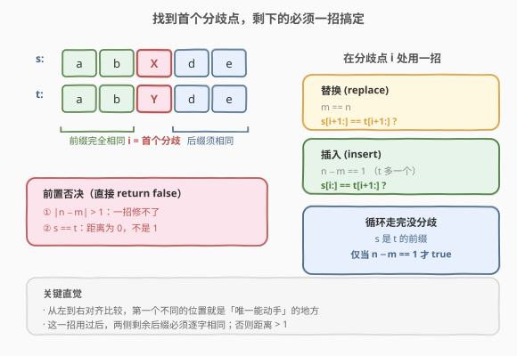
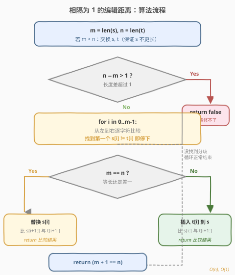
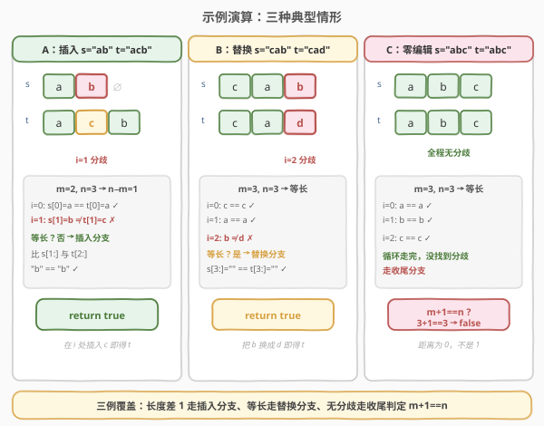

# 相隔为1的编辑距离

- **题目名称**：相隔为1的编辑距离
- **链接**：[161. One Edit Distance](https://leetcode.cn/problems/one-edit-distance/)
- **难度**：中等
- **标签**：字符串、双指针

## 1. 题目概述

给定两个字符串 `s` 和 `t`，判断它们的**编辑距离是否恰好为 1**。一次编辑操作定义为以下三者之一：

- **插入**一个字符；
- **删除**一个字符；
- **替换**一个字符。

若恰好一次操作能把 `s` 变成 `t`，返回 `true`；否则返回 `false`。注意「距离为 0」（即 `s == t`）应返回 `false`——题目要求**恰好**为 1。

**示例 1**：

```text
输入：s = "ab", t = "acb"
输出：true
解释：在 s 的下标 1 处插入 'c'，得到 "acb" = t，一次插入即可。
```

**示例 2**：

```text
输入：s = "cab", t = "ad"
输出：false
解释：长度差为 1，但首字符 c≠a，替换后还需删除 b，至少 2 次操作。
```

**示例 3**：

```text
输入：s = "abc", t = "abc"
输出：false
解释：两串相同，编辑距离为 0，不满足「恰好为 1」。
```

**约束条件**：

- `0 <= s.length, t.length <= 2 * 10^4`
- `s` 和 `t` 仅由小写英文字母组成

> ⚠️ 三个易错点：① 「恰好为 1」要排除距离 0（`s == t`）；② 插入与删除互为逆操作，只需保留一种视角；③ 长度差超过 1 直接否决，无需细看字符。

---

## 2. 解题思路

### 2.1 暴力思路：套用编辑距离 DP

经典 72 题「编辑距离」的二维 DP 可算出任意两串的最小编辑距离，最后判断 `dp[m][n] == 1`。但本题只问**是否恰好为 1**，不需要通用解，DP 的 $O(mn)$ 时间与 $O(mn)$ 空间对 $2 \times 10^4$ 级数据会超时/超内存。杀鸡用牛刀，且没利用「至多一招」的特殊结构。

### 2.2 核心观察：定位首个分歧点，一招定胜负



既然**至多一次操作**，那么从左到右对齐比较 `s` 与 `t`，**第一个不同的位置**就是「唯一能动手的地方」——在此之前两串完全相同，动手之后再比，剩余后缀必须**逐字相同**，否则就需要第二次操作，距离就超过 1 了。

为消除「插入/删除」的对称性，先确保 `s` 不比 `t` 长（若 `len(s) > len(t)` 就交换二者）。于是只需面对两种长度关系：

- **等长**（$m = n$）：唯一可能是**替换** `s[i]`。比较 `s[i+1:]` 与 `t[i+1:]` 是否相同。
- **`t` 比 `s` 多一个**（$n - m = 1$）：唯一可能是**向 `s` 插入** `t[i]`。比较 `s[i:]` 与 `t[i+1:]` 是否相同。

> 💡 **一句话直觉**：两串「对齐左边」一路走，走到第一个对不上的位置停下来——这一处用一招（换一个字符 / 塞一个字符），之后剩下的部分必须完全一样。若长度差超过 1，一招根本填不平长度，直接否决。

**两个前置否决**（无需进入主循环）：

1. $|n - m| > 1$ → 一次操作最多改变长度 1，差超过 1 必然 `false`；
2. `s == t` → 距离为 0，不满足「恰好为 1」，`false`（这一条会被主循环的收尾逻辑自动覆盖，但单列出来更清晰）。

> ⚠️ **收尾分支**：若主循环走完 `m` 个字符都没发现分歧，说明 `s` 是 `t` 的前缀。此时只有在 $n - m = 1$（`t` 恰多一个尾部字符）时才 `true`；若 $m = n$ 则两串完全相同，`false`。代码里用一句 `return m + 1 == n` 统一表达。

### 2.3 算法流程图



### 2.4 示例演算



下面用三个典型例子覆盖三条分支：

| 例 | s | t | m,n | 首个分歧 i | 分支 | 后缀比较 | 结果 |
|----|---|---|-----|-----------|------|---------|------|
| A | `"ab"` | `"acb"` | 2,3 | i=1（b≠c） | 插入（n−m=1） | `s[1:]="b"` vs `t[2:]="b"` | `true` |
| B | `"cab"` | `"cad"` | 3,3 | i=2（b≠d） | 替换（等长） | `s[3:]=""` vs `t[3:]=""` | `true` |
| C | `"abc"` | `"abc"` | 3,3 | 无分歧 | 收尾 | `m+1==n` → `4==3` | `false` |

- **例 A**：`i=0` 处 `a==a` 通过；`i=1` 处 `b≠c` 停下。长度不等走插入分支，比 `s[1:]="b"` 与 `t[2:]="b"`，相等 → `true`（在 `s` 下标 1 处插入 `c` 即得 `t`）。
- **例 B**：`i=0,1` 全通过；`i=2` 处 `b≠d` 停下。等长走替换分支，比 `s[3:]=""` 与 `t[3:]=""`，相等 → `true`（把 `b` 换成 `d` 即得 `t`）。
- **例 C**：三个位置全相同，循环正常结束无分歧。走收尾判定 `m+1==n`，`3+1==3` 为假 → `false`（距离为 0，不是 1）。

---

## 3. 参考代码

### Python

```python
class Solution:
    def isOneEditDistance(self, s: str, t: str) -> bool:
        m, n = len(s), len(t)
        if m > n:                       # 保证 s 不比 t 长
            return self.isOneEditDistance(t, s)
        if n - m > 1:                   # 长度差超过 1，一招修不了
            return False
        for i in range(m):
            if s[i] != t[i]:            # 首个分歧点
                if m == n:
                    return s[i + 1:] == t[i + 1:]   # 替换 s[i]
                else:
                    return s[i:] == t[i + 1:]        # 向 s 插入 t[i]
        return m + 1 == n              # 无分歧：仅当 t 多一个尾字符才 true
```

### C++

```cpp
class Solution {
  public:
    bool isOneEditDistance(string s, string t) {
        int m = s.size(), n = t.size();
        if (m > n) return isOneEditDistance(t, s);          // 保证 s 不比 t 长
        if (n - m > 1) return false;                        // 长度差超过 1
        for (int i = 0; i < m; ++i) {
            if (s[i] != t[i]) {                             // 首个分歧点
                if (m == n) return s.substr(i + 1) == t.substr(i + 1);  // 替换
                else        return s.substr(i) == t.substr(i + 1);      // 插入
            }
        }
        return m + 1 == n;                                  // 无分歧收尾
    }
};
```

### 双指针版（O(1) 额外空间，避免 substr 切片）

```cpp
class Solution {
  public:
    bool isOneEditDistance(string s, string t) {
        int m = s.size(), n = t.size();
        if (m > n) return isOneEditDistance(t, s);
        if (n - m > 1) return false;
        int i = 0;
        while (i < m && s[i] == t[i]) ++i;          // 跳过公共前缀
        if (i < m) {                                // 在 i 处发现分歧
            if (m == n) ++i;                        // 替换：两边都跳过 i
            // 插入：只让 t 多跳一格
            int j = (m == n) ? i : i + 1;           // t 的游标从 j 起
            while (i < m && s[i] == t[j]) { ++i; ++j; }
            return i == m;                          // s 走完即后缀全同
        }
        return m + 1 == n;                          // 无分歧收尾
    }
};
```

> 💡 `substr` 版与双指针版复杂度同阶，前者更易读、面试首选；后者展示「不用切片也能写」的细节掌控，作为追问时的备选。

---

## 4. 复杂度分析

| 维度 | 复杂度 | 说明 |
|------|--------|------|
| 时间复杂度 | $O(n)$ | 至多一次线性扫描找分歧点 + 一次后缀比较，整体线性 |
| 空间复杂度 | $O(1)$ | 仅用下标/游标；`substr` 版切片在多数语言中为 $O(n)$ 临时对象但额外空间仍为常数级 |

---

## 5. 扩展：与通用编辑距离 DP 的关系

本题是 72 题「编辑距离」的**特例**——把允许的操作次数从任意次收紧到**恰好一次**，从而把 $O(mn)$ 的 DP 降为 $O(n)$ 的双指针扫描。这种「从一般到特殊」的降阶是常见思路：

- **一般情况**（任意次数）：状态 `dp[i][j]` 表示前缀编辑距离，依赖左、上、左上三方向递推，$O(mn)$。
- **本题**（恰好一次）：操作次数被锁死为 1，意味着两串**几乎完全相同**——只有一个位置的「一处不同」或「一处多/少一个字符」。于是「定位唯一分歧点」取代「逐格填表」，扫描一遍即可。

> ⚠️ 这种「限制操作次数」的特化思路也出现在 72 的进阶变体里（如「最多 k 次编辑」），当 $k$ 很小时可用类似「找前 k 个分歧」的扫描法做到 $O(kn)$，比通用 DP 更优。

---

## 6. 面试要点

1. **为什么 `s == t` 要返回 `false`？**
   - 题目要求编辑距离**恰好为 1**，相同字符串距离为 0，不满足。这是本题最常踩的坑，主循环收尾的 `m+1==n` 会自动给出 `false`，但口述时务必点明这一边界。

2. **为什么要交换使 `s` 不比 `t` 长？**
   - 把「向 `s` 插入」和「从 `t` 删除」统一成**一种视角**——总是「`t` 比 `s` 多 0 或 1 个字符」。这样主循环只剩「替换」与「插入」两条分支，避免写四份对称代码。

3. **长度差超过 1 为什么直接否决？**
   - 一次插入/删除最多改变长度 1，一次替换不改变长度。若 $|n - m| > 1$，长度本身就无法用一招对齐，必然 `false`，无需看字符内容。这是最早的剪枝。

4. **收尾的 `return m + 1 == n` 在处理什么？**
   - 主循环走完 `m` 个字符都没分歧，说明 `s` 是 `t` 的前缀。此时只有 `t` 恰多一个尾部字符（$n - m = 1$）才成立一次插入；若 $m = n$ 则两串完全相同，返回 `false`。一句表达式同时覆盖两种收尾。

5. **能不能不切 `substr`、用 $O(1)$ 额外空间？**
   - 可以。用双游标在分歧点之后继续同步推进比较，全部走完即后缀相同。逻辑等价，但代码更长；面试可先给 `substr` 版讲清思路，再口述或补写指针版展示细节掌控。

---

## 7. 同类练习题

- [72. 编辑距离](https://leetcode.cn/problems/edit-distance/)（[题解](../0001-0100/72_编辑距离.md)）：通用版，二维 DP 求「最小编辑距离」，本题是其「恰好 1 次」的特例与降阶
- [583. 两个字符串的删除操作](https://leetcode.cn/problems/delete-operation-for-two-strings/)：只允许删除的编辑距离变体，可化为最长公共子序列
- [1143. 最长公共子序列](https://leetcode.cn/problems/longest-common-subsequence/)（[题解](../1101-1200/1143_最长公共子序列.md)）：求公共部分长度，常用于推导各类「只删/只插」的距离
- [392. 判断子序列](https://leetcode.cn/problems/is-subsequence/)（[题解](../0301-0400/392_判断子序列.md)）：双指针贪心匹配，与本题「跳过公共前缀」的扫描思想同源
