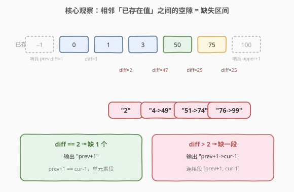
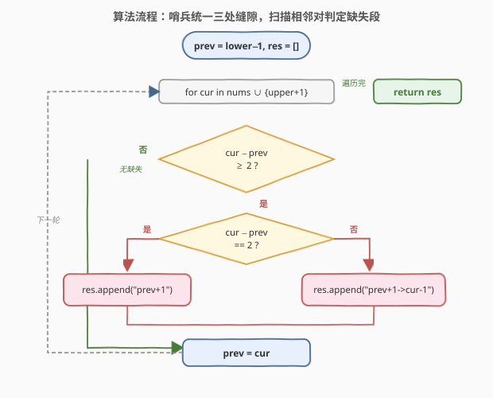
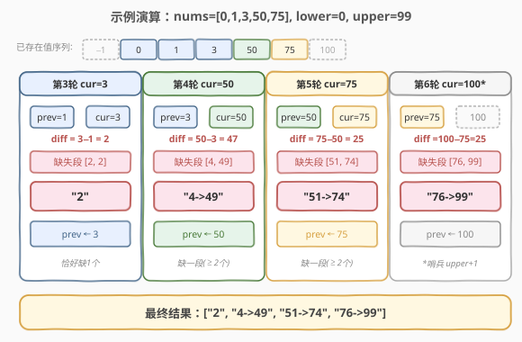

# 缺失的区间

- **题目名称**：缺失的区间
- **链接**：[163. 缺失的区间](https://leetcode.cn/problems/missing-ranges/)
- **难度**：简单
- **标签**：数组、一次遍历、边界处理

## 1. 题目概述

给你一个**已升序排序**且**元素互不相同**的整数数组 `nums`，以及两个闭区间端点 `lower` 和 `upper`。`nums` 中的所有元素都落在 `[lower, upper]` 范围内。

请你找出 `[lower, upper]` 中**未出现在** `nums` 里的所有缺失数字，并按升序整理成区间列表返回。返回格式：

- 缺失的只有一个数 `a` → `"a"`；
- 缺失的是连续一段 `a, a+1, ..., b`（长度 ≥ 2）→ `"a->b"`。

**示例 1**：

```text
输入：nums = [0,1,3,50,75], lower = 0, upper = 99
输出：["2","4->49","51->74","76->99"]
解释：[0,99] 内缺失的数字段为 2；4~49；51~74；76~99。
```

**示例 2**：

```text
输入：nums = [-1], lower = -1, upper = -1
输出：[]
解释：[-1,-1] 内唯一的数 -1 已在 nums 中，无缺失。
```

**约束条件**：

- $-10^9 \leq \text{lower} \leq \text{upper} \leq 10^9$
- $0 \leq \text{nums.length} \leq 10^5$
- $\text{lower} \leq \text{nums[i]} \leq \text{upper}$
- `nums` 中的所有值**互不相同**
- `nums` 已按**升序**排列

> ⚠️ 注意三个边界：① `nums` 可能为空，此时整个 `[lower, upper]` 都缺失；② 缺失段可能出现在**首部**（`lower` 到第一个元素之前）或**尾部**（最后一个元素到 `upper`），不能只看相邻元素之间的缝隙；③ `lower`、`upper` 可达 $\pm 10^9$，构造 `lower - 1` / `upper + 1` 作哨兵时虽未越 `int` 范围，但用 `long long` 是更稳妥的工程习惯（与 [228. 汇总区间](../0201-0300/228_汇总区间.md) 一脉相承）。

---

## 2. 解题思路

### 2.1 暴力思路

把 `nums` 转成哈希集合，然后从 `lower` 枚举到 `upper`，逐个检查是否在集合中，再把连续的缺失段拼成字符串。时间 $O(\text{upper}-\text{lower})$，空间 $O(n)$。问题很明显：`upper - lower` 可达 $2 \times 10^9$，枚举会直接超时。可见「逐个数检查」不可行，必须利用 `nums` **已排序**的结构，**按段**而非按点推进。

### 2.2 核心观察：相邻已存在数之间的「空隙」即缺失区间



由于 `nums` 已排序且无重复，`[lower, upper]` 中**所有缺失的数字必然夹在两个「已存在值」之间**——这两个「已存在值」要么是 `nums` 中相邻的两个元素，要么是 `lower` 与首个元素，要么是末个元素与 `upper`。

于是问题转化为：**扫描相邻「已存在值」对，若两者之差 ≥ 2，就存在一段缺失区间**。

> 💡 **哨兵统一三处边界**：为避免对「首部缝隙」「中部缝隙」「尾部缝隙」写三套逻辑，引入一个游标 `prev`，初始为 `lower - 1`（虚拟的「第一个已存在值」），并在 `nums` 末尾虚拟追加一个 `upper + 1` 作「最后一个已存在值」。这样所有缝隙都变成统一的 `(prev, cur)` 相邻对，只需一套判定逻辑：

- 设 `cur` 为当前扫到的「已存在值」（`nums` 中的元素，或末尾哨兵 `upper + 1`）；
- 若 `cur - prev >= 2`：说明 `prev` 与 `cur` 之间存在缺失段
  - `cur - prev == 2`：恰好缺一个数 `prev + 1`，输出 `"prev+1"`；
  - `cur - prev > 2`：缺一段 `[prev+1, cur-1]`，输出 `"prev+1->cur-1"`；
- 随后 `prev = cur`，继续扫描下一个。

> ⚠️ **为何用「差 ≥ 2」而非「差 > 1」？** 两者等价，但 `cur - prev == 2` 恰好对应「缺一个」的特例，写成分支更直观——这正是单元素段与连续段的分界线（`cur - prev == 2` ⇔ 缺 1 个，`cur - prev > 2` ⇔ 缺 ≥ 2 个）。这一判据与 [228. 汇总区间](../0201-0300/228_汇总区间.md) 的「相邻差为 1 即连续」互为对偶：228 找的是**存在**的连续段，163 找的是**缺失**的连续段，两者的「单元素 vs 连续段」格式化逻辑完全一致。

### 2.3 算法流程图



维护变量：

- `prev`：上一个「已存在值」，初始为 `lower - 1`（`long long`）；
- `res`：结果字符串数组。

**主循环**：让 `cur` 依次取 `nums` 中每个元素，最后再取一次 `upper + 1`：

1. 计算 `diff = cur - prev`。
2. **`diff >= 2`**：存在缺失段——`diff == 2` 输出 `"prev+1"`，否则输出 `"prev+1->cur-1"`。
3. **`diff <= 1`**：无缺失（`diff == 1` 相邻，`diff == 0` 不可能因元素互异且哨兵越界），跳过。
4. `prev = cur`，进入下一轮。

**循环结束**：`prev` 已被末尾哨兵 `upper + 1` 推进，尾部缝隙在第 4 步已被处理，无需额外收尾——这正是哨兵技巧带来的简洁性。

### 2.4 示例演算

以 `nums = [0,1,3,50,75]`，`lower = 0`，`upper = 99` 为例，`prev` 初值 `lower - 1 = -1`，末尾哨兵 `upper + 1 = 100`：



| 轮次 | cur | prev | diff=cur−prev | 缺失段 | 输出 | prev 更新 |
|------|-----|------|---------------|--------|------|-----------|
| 1 | 0 | −1 | 1 | — | — | 0 |
| 2 | 1 | 0 | 1 | — | — | 1 |
| 3 | 3 | 1 | 2 | [2, 2] | "2" | 3 |
| 4 | 50 | 3 | 47 | [4, 49] | "4->49" | 50 |
| 5 | 75 | 50 | 25 | [51, 74] | "51->74" | 75 |
| 6 | 100（哨兵） | 75 | 25 | [76, 99] | "76->99" | 100 |

最终返回 `["2","4->49","51->74","76->99"]`。

> 💡 注意第 6 轮：哨兵 `upper + 1 = 100` 与最后一个真实元素 `75` 之间的缝隙 `[76, 99]`，被同一套 `(prev, cur)` 逻辑自然捕获，无需任何特殊分支——这正是哨兵的价值。

---

## 3. 参考代码

### C++

```cpp
class Solution {
  public:
    vector<string> findMissingRanges(vector<int>& nums, int lower, int upper) {
        vector<string> res;
        long long prev = (long long)lower - 1;        // 虚拟首元素，long long 规避溢出
        for (int x : nums) {
            if ((long long)x - prev >= 2) {           // prev 与 x 之间有缺失段
                res.push_back(rangeStr(prev + 1, (long long)x - 1));
            }
            prev = x;
        }
        if ((long long)upper + 1 - prev >= 2) {       // 末尾哨兵：处理尾部缝隙
            res.push_back(rangeStr(prev + 1, (long long)upper));
        }
        return res;
    }
  private:
    string rangeStr(long long lo, long long hi) {     // 单元素 "lo"，连续段 "lo->hi"
        return lo == hi ? to_string(lo) : to_string(lo) + "->" + to_string(hi);
    }
};
```

### Python

```python
class Solution:
    def findMissingRanges(self, nums: List[int], lower: int, upper: int) -> List[str]:
        res = []
        prev = lower - 1                              # 虚拟首元素
        for x in nums:
            if x - prev >= 2:                         # prev 与 x 之间有缺失段
                res.append(self._range(prev + 1, x - 1))
            prev = x
        if upper + 1 - prev >= 2:                     # 末尾哨兵：处理尾部缝隙
            res.append(self._range(prev + 1, upper))
        return res

    def _range(self, lo: int, hi: int) -> str:
        return str(lo) if lo == hi else f"{lo}->{hi}"
```

> 💡 **两种哨兵写法**：C++ 版把末尾哨兵「展开」为循环后的一次额外判定（`upper + 1` 与 `prev` 比），避免真正修改 `nums`；Python 版同理。若题目允许修改入参，也可在 `nums` 末尾 `append(upper + 1)` 后用单层循环统一处理，逻辑等价但侵入性更强。这里采用「不修改入参 + 循环后补判」的写法，更干净也更安全。

---

## 4. 复杂度分析

| 维度 | 复杂度 | 说明 |
|------|--------|------|
| 时间复杂度 | $O(n)$ | 仅一次线性扫描 `nums`，每个元素做一次差值比较与至多一次区间格式化 |
| 空间复杂度 | $O(1)$ | 除结果数组外只用 `prev` 一个游标；结果空间不计入额外开销 |

> 💡 相比暴力枚举的 $O(\text{upper}-\text{lower})$，本解法把复杂度从「值域宽度」降到「数组长度」，这正是利用「已排序」结构把**按点推进**升级为**按段推进**的收益。

---

## 5. 扩展：与 228 汇总区间的对偶关系

本题与 [228. 汇总区间](../0201-0300/228_汇总区间.md) 构成一对「对偶题」：

| 维度 | 228 汇总区间 | 163 缺失的区间 |
|------|--------------|----------------|
| 输入 | 排序无重数组 | 排序无重数组 + `[lower, upper]` |
| 输出 | 数组中**存在**的连续段 | 区间内**缺失**的连续段 |
| 断点判据 | `nums[i] - nums[i-1] != 1` → 在此切分 | `cur - prev >= 2` → 中间有缺失 |
| 段格式化 | `start == end ? "x" : "x->y"` | `lo == hi ? "x" : "x->y"`（完全一致） |
| 末段处理 | 循环后补一次闭合 | 哨兵 `upper+1` 触发尾部判定 |
| 复杂度 | $O(n)$ / $O(1)$ | $O(n)$ / $O(1)$ |

两题的**格式化函数**完全相同，**断点判据互为补集**（228 找「连续处」切分，163 找「不连续处」即缝隙）。掌握其一即可秒杀另一题。更进一步，若把 `nums` 视作「黑名单」，则 163 本质是「在值域上挖掉黑名单点后剩下的连续段」——这与区间调度、区间合并的思想同源（参见 [56. 合并区间](../0001-0100/56_合并区间.md)）。

---

## 6. 面试要点

1. **为什么不能直接枚举 `[lower, upper]`？**
   - 值域宽度可达 $2 \times 10^9$，枚举会超时。必须利用 `nums` 已排序的性质，按「相邻已存在值的缝隙」推进，把 $O(\text{值域})$ 降到 $O(n)$。

2. **哨兵 `lower - 1` / `upper + 1` 的作用是什么？**
   - 把「首部缝隙」（`lower` 到首个元素）和「尾部缝隙」（末个元素到 `upper`）统一成与「中部缝隙」相同的 `(prev, cur)` 相邻对判定，避免写三套分支。这是消除边界特判的通用技巧。

3. **`lower - 1` / `upper + 1` 会溢出吗？**
   - 本题约束 $-10^9 \leq \text{lower}, \text{upper} \leq 10^9$，而 32 位 `int` 范围约 $\pm 2.1 \times 10^9$，故 `lower - 1`、`upper + 1` 仍在范围内。但若约束放宽到 `INT_MIN` / `INT_MAX`，则直接减加会溢出。用 `long long` 存 `prev` 与哨兵是稳妥的防御性写法。

4. **单元素段和连续段如何区分？**
   - 用 `cur - prev` 的差值：`== 2` 恰好缺一个数，输出 `"prev+1"`；`> 2` 缺一段，输出 `"prev+1->cur-1"`。这与 228 中 `start == end ? "x" : "x->y"` 的判据同构——前者看「缝隙宽度」，后者看「段内元素数」，本质都是「单点 vs 多点」。

5. **`nums` 为空时怎么处理？**
   - `prev = lower - 1`，循环不执行，循环后的哨兵判定 `upper + 1 - prev >= 2` 即 `upper + 1 - (lower - 1) = upper - lower + 2 >= 2` 恒成立（只要 `upper >= lower`），输出整个 `[lower, upper]` 作为单一缺失段。哨兵写法天然覆盖空数组，无需特判。

---

## 7. 同类练习题

- [228. 汇总区间](https://leetcode.cn/problems/summary-ranges/)（[题解](../0201-0300/228_汇总区间.md)）：本题的对偶——输出排序数组中**存在**的连续段，断点判据与格式化逻辑完全可复用
- [56. 合并区间](https://leetcode.cn/problems/merge-intervals/)（[题解](../0001-0100/56_合并区间.md)）：处理任意重叠区间的合并，对比「由连续性天然确定的段」与「需排序后贪心合并的段」
- [57. 插入区间](https://leetcode.cn/problems/insert-interval/)（[题解](../0001-0100/57_插入区间.md)）：在已有区间列表中插入新区间并合并，哨兵/边界处理思想相通
- [352. 将数据流变为多个不相交区间](https://leetcode.cn/problems/data-stream-as-disjoint-intervals/)：动态维护连续区间集合的进阶版，需用有序结构（TreeMap / 并查集）支持插入与汇总
- [128. 最长连续序列](https://leetcode.cn/problems/longest-consecutive-sequence/)（[题解](../0101-0200/128_最长连续序列.md)）：数组未排序时求最长连续段长度，对比「有序」与「无序」两种前提下的解法选择
