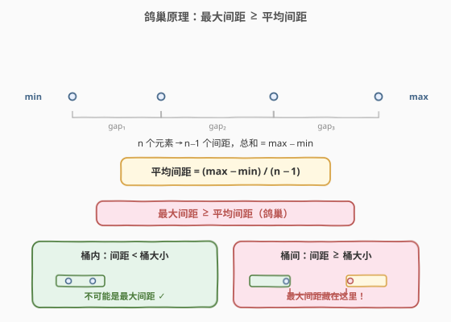
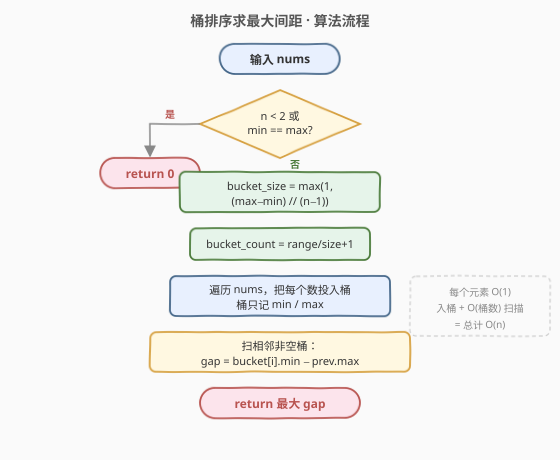
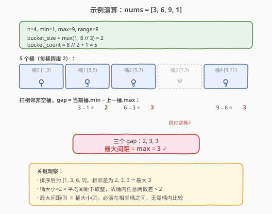

# 最大间距

- **题目名称**：最大间距
- **链接**：[164. 最大间距](https://leetcode.cn/problems/maximum-gap/)
- **难度**：困难
- **标签**：数组、桶排序、基数排序

## 1. 题目概述

给定一个无序的整数数组 `nums`，返回它在排序之后**两个相邻元素之间最大的差值**。如果数组元素个数少于 2，则返回 0。

> ⚠️ **进阶要求**：你必须写出一个在 $O(n)$ 时间复杂度且 $O(n)$ 空间复杂度下运行的算法。

**示例 1**：

```text
输入：nums = [3,6,9,1]
输出：3
解释：排序后的数组是 [1,3,6,9], 其中相邻元素 (3,6) 和 (6,9) 之间都存在最大差值 3。
```

**示例 2**：

```text
输入：nums = [10]
输出：0
解释：数组元素个数小于 2，因此返回 0。
```

**约束条件**：

- `1 <= nums.length <= 10^5`
- `0 <= nums[i] <= 10^9`

> 💡 题目的核心矛盾在于：**排序**的最坏下界是 $O(n \log n)$（基于比较的排序），而题目**要求线性**。这意味着必须使用**非比较排序**（桶排序 / 基数排序），或利用「鸽巢原理」对桶排序做极致裁剪——只比较桶与桶之间，不比较桶内。

---

## 2. 解题思路

### 2.1 暴力思路

直接调用 `sort(nums)` 排序，再线性扫描相邻差取最大值，时间 $O(n \log n)$、空间 $O(\log n)$。简单正确，但**不满足线性时间要求**。

问题来了：基于比较的排序已被证明下界为 $O(n \log n)$，如何突破？答案是把元素按值域**分桶**，让比较只发生在桶与桶之间。

### 2.2 核心观察：鸽巢原理定下界，桶内可跳过



设排序后的数组为 $x_1 \le x_2 \le \dots \le x_n$，共有 $n-1$ 个相邻间距，它们的总和恰好等于 $x_n - x_1 = \max - \min$。由**鸽巢原理**（平均值原理）：

$$
\max_{1 \le i < n}(x_{i+1} - x_i) \;\ge\; \frac{\max - \min}{n - 1}
$$

即**最大间距一定不小于平均间距**。令

$$
\text{bucket\_size} = \max\!\left(1,\; \left\lfloor \frac{\max - \min}{n - 1} \right\rfloor\right)
$$

那么每个桶的跨度至多为 $\text{bucket\_size}$，而最大间距 $\ge \text{bucket\_size}$。于是得出两个关键推论：

- **桶内不可能产生最大间距**：同一桶内任意两数之差 $< \text{bucket\_size} \le$ 最大间距，因此桶内**无需排序、无需两两比较**，每个桶只需记录落入其中的 **`min` 和 `max`** 两个值即可。
- **最大间距必在相邻非空桶之间**：即「当前桶的 `min`」减去「上一个非空桶的 `max`」。

> ⚠️ **bucket_size 至少为 1**：当所有元素都相等时 $\max-\min=0$，除以 $n-1$ 为 0，此时桶大小取 1 避免除零；而这种情况其实最大间距就是 0，可在入口直接特判返回。

### 2.3 算法流程图



具体步骤：

1. **入口特判**：若 $n < 2$ 或 $\min = \max$，直接返回 0。
2. **算桶参数**：`bucket_size = max(1, (max - min) // (n - 1))`；`bucket_count = (max - min) // bucket_size + 1`。
3. **建桶**：开 `bucket_count` 个桶，每个桶只存 `has_min`（是否非空）、`bmin`、`bmax`。
4. **入桶**：对每个 `x`，算 `idx = (x - min) // bucket_size`，更新该桶的 `bmin`/`bmax`。
5. **扫桶求最大间距**：维护 `prev_max`（上一个非空桶的 `max`），对每个非空桶算 `gap = bmin - prev_max`，更新答案，然后 `prev_max = bmax`。
6. **返回**最大 `gap`。

### 2.4 示例演算

以 `nums = [3,6,9,1]` 为例：



| 步骤 | 内容 |
|------|------|
| 参数 | $n=4,\ \min=1,\ \max=9,\ \text{range}=8$ |
| 桶大小 | $\max(1,\ 8 // 3) = 2$ |
| 桶数 | $8 // 2 + 1 = 5$（覆盖 $[1,11)$） |
| 入桶 | 1→桶0, 3→桶1, 6→桶2, 9→桶4；桶3 空 |
| 扫桶 | $3-1=2;\ 6-3=3;\ 9-6=3$（跳过空桶3） |
| 结果 | $\max(2,3,3) = 3$ ✓ |

> 💡 注意桶 3 `[7,9)` 为空被跳过——这正是「最大间距藏在相邻**非空**桶之间」的体现：空桶意味着上一个非空桶的 `max` 到下一个非空桶的 `min` 之间留出了更大的间隔，反而更可能是答案。

---

## 3. 参考代码

### C++

```cpp
class Solution {
  public:
    int maximumGap(vector<int>& nums) {
        int n = nums.size();
        if (n < 2) return 0;

        auto lo = min_element(nums.begin(), nums.end());
        auto hi = max_element(nums.begin(), nums.end());
        int minVal = *lo, maxVal = *hi;
        if (minVal == maxVal) return 0;

        int bucketSize = max(1, (maxVal - minVal) / (n - 1));
        int bucketCount = (maxVal - minVal) / bucketSize + 1;

        vector<int> bMin(bucketCount, INT_MAX);
        vector<int> bMax(bucketCount, INT_MIN);
        vector<char> has(bucketCount, 0);

        for (int x : nums) {
            int idx = (x - minVal) / bucketSize;
            bMin[idx] = min(bMin[idx], x);
            bMax[idx] = max(bMax[idx], x);
            has[idx] = 1;
        }

        int ans = 0;
        int prevMax = bMax[0];   // 桶 0 必非空（含 minVal）
        for (int i = 1; i < bucketCount; ++i) {
            if (!has[i]) continue;
            ans = max(ans, bMin[i] - prevMax);
            prevMax = bMax[i];
        }
        return ans;
    }
};
```

### Python

```python
class Solution:
    def maximumGap(self, nums: List[int]) -> int:
        n = len(nums)
        if n < 2:
            return 0

        lo, hi = min(nums), max(nums)
        if lo == hi:
            return 0

        bucket_size = max(1, (hi - lo) // (n - 1))
        bucket_count = (hi - lo) // bucket_size + 1

        bmin = [None] * bucket_count
        bmax = [None] * bucket_count

        for x in nums:
            idx = (x - lo) // bucket_size
            if bmin[idx] is None:
                bmin[idx] = bmax[idx] = x
            else:
                bmin[idx] = min(bmin[idx], x)
                bmax[idx] = max(bmax[idx], x)

        ans = 0
        prev_max = bmax[0]        # 桶 0 必非空（含 lo）
        for i in range(1, bucket_count):
            if bmin[i] is None:
                continue
            ans = max(ans, bmin[i] - prev_max)
            prev_max = bmax[i]
        return ans
```

---

## 4. 复杂度分析

| 维度 | 复杂度 | 说明 |
|------|--------|------|
| 时间复杂度 | $O(n)$ | 求 min/max 一遍 $O(n)$；入桶一遍 $O(n)$（每元素 $O(1)$）；扫桶 $O(\text{bucket\_count}) \le O(n)$（桶数 $\le n$） |
| 空间复杂度 | $O(n)$ | 桶数 $\text{bucket\_count} \le n$，每桶 $O(1)$，总计 $O(n)$ |

> 💡 **桶数为什么 $\le n$**：$\text{bucket\_count} = \lceil \frac{\max-\min}{\text{bucket\_size}} \rceil$，而 $\text{bucket\_size} = \max(1, \lfloor\frac{\max-\min}{n-1}\rfloor)$。当 $\max>\min$ 时 $\text{bucket\_size} \ge 1$，桶数 $\le \max-\min+1$；更紧地，由 $\text{bucket\_size} \approx \frac{\max-\min}{n-1}$ 得桶数 $\approx n-1$，故 $O(n)$。

---

## 5. 扩展：基数排序解法

除桶排序外，**基数排序**（LSD，从低位到高位）也是符合 $O(n)$ 的经典解法：

- 按十进制位（或二进制位）分 10（或 2）个桶，从低位到高位做 $k$ 轮计数排序（$k$ 为最大值的位数）。
- 最大值 $\le 10^9$，故十进制下 $k \le 10$，总复杂度 $O(k \cdot n) = O(n)$。
- 排序完成后再线性扫描相邻差。

对比两种解法：

| 维度 | 桶排序（鸽巢） | 基数排序 |
|------|----------------|----------|
| 思想 | 利用鸽巢下界跳过桶内比较 | 逐位稳定排序 |
| 常数 | 小，一轮入桶 + 一轮扫桶 | 大，需 $k$ 轮计数排序 |
| 通用性 | 依赖「间距」语义，仅适合本题 | 通用线性排序，排序后可解多种问题 |
| 代码量 | 短 | 略长（需实现计数排序） |

> ⚠️ 基数排序是「先把数组彻底排好，再求差」的通解；桶排序（鸽巢）是「不排序，只比较桶间」的巧解。面试中两种都可讲，鸽巢版更能体现对问题结构的洞察。

---

## 6. 面试要点

1. **为什么基于比较的排序做不到 $O(n)$？**
   - 比较排序的判定树有 $n!$ 个叶子，树高至少 $\lceil \log_2 n! \rceil = \Omega(n \log n)$，这是信息论下界。要突破必须用非比较排序（桶、基数、计数），利用元素的**值域信息**。

2. **鸽巢原理在本题中起什么作用？**
   - $n$ 个数有 $n-1$ 个间距，总和为 $\max-\min$，故最大间距 $\ge \frac{\max-\min}{n-1}$。这给出了最大间距的**下界**，也就是桶大小。有了这个下界，就能保证「桶内任意两数之差严格小于最大间距」，从而跳过桶内比较。

3. **为什么每个桶只存 min/max 就够了？**
   - 最大间距只可能出现在相邻非空桶之间，即「本桶 min − 上桶 max」。桶内部的元素无论怎么排，其相邻差都 $<$ 桶大小 $\le$ 最大间距，不可能是答案，所以桶内无需排序、无需存全部元素。

4. **空桶要处理吗？为什么跳过即可？**
   - 空桶意味着该值域段没有元素。扫桶时用 `prev_max` 记录上一个**非空**桶的 max，遇到空桶直接 `continue`——这样空桶自然把「上一个非空桶 max」与「下一个非空桶 min」的间隔拉大，恰好是潜在的更大间距，逻辑自洽。

5. **当所有元素相同时会发生什么？**
   - $\max = \min$，入口特判直接返回 0。若不加特判，`bucket_size` 公式分母虽不为零（$n\ge 2$），但 $\max-\min=0$ 导致 `bucket_size = max(1, 0) = 1`，所有元素落入桶 0，扫桶时无非空相邻桶，`ans` 保持 0——也能得到正确结果，但特判更清晰且省去建桶开销。

---

## 7. 同类练习题

- [561. 数组拆分](https://leetcode.cn/problems/array-partition/)：排序后两两配对取最小值之和，对比「排序后线性扫描」与本题「不排序只比桶间」的不同线性化策略
- [274. H 指数](https://leetcode.cn/problems/h-index/)：同样可用计数排序（值域桶）降到 $O(n)$，桶思想在本题与 164 中都用于「绕过比较排序下界」
- [215. 数组中的第K个最大元素](https://leetcode.cn/problems/kth-largest-element-in-an-array/)（[题解](../0201-0300/215_数组中的第K个最大元素.md)）：快速选择 / 值域桶选择，对比「分治剪枝」与「桶排序」两种线性化思路
- [347. 前 K 个高频元素](https://leetcode.cn/problems/top-k-frequent-elements/)：桶排序按频率分桶求 Top-K，与本题「按值域分桶求最大间距」是桶排序的两个经典应用面
- [163. 缺失的区间](https://leetcode.cn/problems/missing-ranges/)（[题解](../0101-0200/163_缺失的区间.md)）：同属 160 系列的值域/区间处理题，对比「线性扫描值域找缺口」与「分桶跳过桶内」两种区间策略
