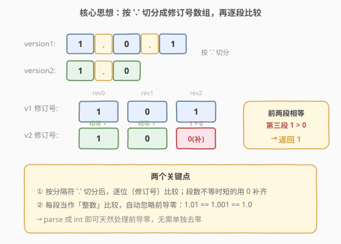
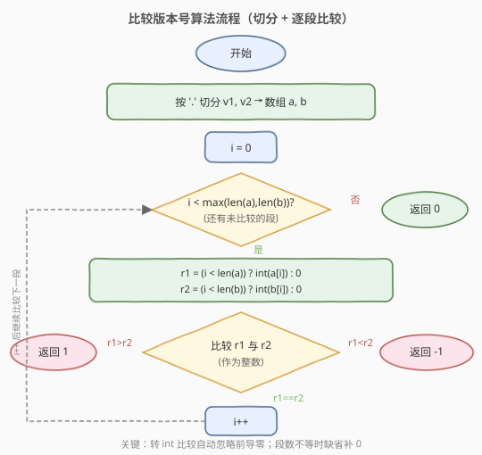
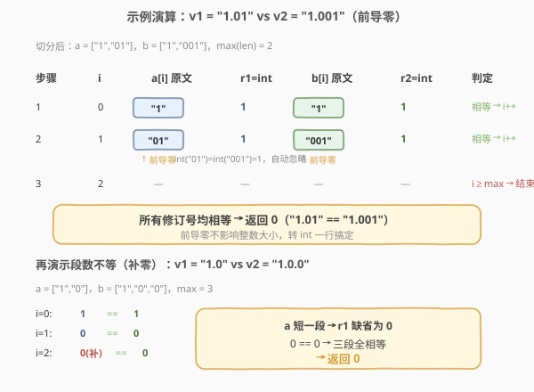

# LeetCode 比较版本号 题解

## 1. 题目概述

- **标题 / 题号**：比较版本号（#165，medium）
- **链接**：https://leetcode.cn/problems/compare-version-numbers/
- **难度**：中等
- **标签**：字符串、双指针

**题意**：给你两个版本字符串 `version1` 和 `version2`，请你比较它们。版本号由一个或多个**修订号**组成，修订号之间用点号 `'.'` 分隔。每个修订号可能包含**前导零**，比较时应当忽略（即 `1.01` 和 `1.001` 视为相等）。

从左到右依次比较每个对应的修订号：

- 若 `version1 > version2`，返回 `1`；
- 若 `version1 < version2`，返回 `-1`；
- 否则返回 `0`。

> ⚠️ 注意：版本号段数可能不等。若某一方在某一段已经没有修订号，则该段视作 `0`。例如 `1.0` 等于 `1.0.0`。

**示例 1**：

```text
输入：version1 = "1.01", version2 = "1.001"
输出：0
解释：忽略前导零，"01" == "001"，所以两个版本号相等。
```

**示例 2**：

```text
输入：version1 = "1.0", version2 = "1.0.0"
输出：0
解释：version1 没有第三段，视作 0；第三段 0 == 0，二者相等。
```

**示例 3**：

```text
输入：version1 = "0.1", version2 = "1.1"
输出：-1
解释：第一段 0 < 1，version1 < version2。
```

**约束**：

- `1 <= version1.length, version2.length <= 500`
- `version1` 和 `version2` 只包含数字和 `'.'`
- `version1` 和 `version2` 都是合法版本号
- 所有修订号可以存入 32 位整数

## 2. 解题思路

### 2.1 暴力思路

直接调用库函数 `split('.')` 把两个版本号切成数组，再用一个循环逐段比较。段数不等的部分补 `0`。这其实已经是最优解，时间复杂度 `O(n + m)`。

真正需要思考的不是「怎么降复杂度」，而是**两个边界细节**：

1. **前导零**怎么处理？—— `"01"` 与 `"001"` 怎么判断相等？
2. **段数不等**怎么处理？—— `1.0` 和 `1.0.0` 谁大？

### 2.2 核心观察：切分 + 逐段比较



关键直觉是把版本号看作**修订号数组**，从左到右对齐比较：

- **按 `'.'` 切分**：`"1.0.1"` → `[1, 0, 1]`，`"1.0"` → `[1, 0]`。
- **逐段比较**：第 `i` 段谁大谁就大；若有一方没有第 `i` 段，该段视作 `0`（即短的用 `0` 补齐）。
- **前导零**：把每段 `parse` 成整数再比较，前导零天然消失——`int("01") == int("001") == 1`，无需单独去零。

> 💡 为什么不直接按字符串字典序比较每段？因为字典序下 `"9" > "10"`（单字符更长反而小），而数值上 `9 < 10`。版本号比较的是**数值大小**，所以必须转成整数。

### 2.3 算法流程图



整体一重循环，最多遍历 `max(n, m)` 段，每段处理 `O(1)`（含转 int），因此总复杂度由切分主导。

### 2.4 示例演算



上表演算了两类典型情形：

- **前导零**：`"1.01"` vs `"1.001"`，两段都 `1 == 1`，返回 `0`。`int("01")` 自动忽略前导零。
- **段数不等**：`"1.0"` vs `"1.0.0"`，第三段 `version1` 缺省补 `0`，`0 == 0`，返回 `0`。

## 3. 参考代码

### C++（split + 逐段比较）

```cpp
class Solution {
  public:
    int compareVersion(string version1, string version2) {
        vector<int> a = split(version1);
        vector<int> b = split(version2);
        int n = max(a.size(), b.size());
        for (int i = 0; i < n; i++) {
            int r1 = i < a.size() ? a[i] : 0; // 缺省补 0
            int r2 = i < b.size() ? b[i] : 0;
            if (r1 > r2) return 1;
            if (r1 < r2) return -1;
        }
        return 0;
    }

  private:
    vector<int> split(const string &s) {
        vector<int> res;
        stringstream ss(s);
        string token;
        while (getline(ss, token, '.')) {
            res.push_back(stoi(token)); // stoi 自动忽略前导零
        }
        return res;
    }
};
```

### Python

```python
class Solution:
    def compareVersion(self, version1: str, version2: str) -> int:
        a = list(map(int, version1.split(".")))
        b = list(map(int, version2.split(".")))
        n = max(len(a), len(b))
        for i in range(n):
            r1 = a[i] if i < len(a) else 0
            r2 = b[i] if i < len(b) else 0
            if r1 > r2:
                return 1
            if r1 < r2:
                return -1
        return 0
```

> ⚠️ **注意**：不要用字符串字典序比较每段（`"9"` vs `"10"` 会出错），必须转成整数。`stoi` / `int()` 在解析时会自动跳过前导零，所以无需手动处理。

## 4. 复杂度分析

| 维度 | 复杂度 | 说明 |
|------|--------|------|
| 时间复杂度 | $O(n + m)$ | 切分两串各遍历一次 `O(n + m)`；逐段比较最多 `max(n, m)` 段，每段 `O(1)` |
| 空间复杂度 | $O(n + m)$ | 存切分后的两个修订号数组 |

其中 `n`、`m` 分别为两个版本字符串的长度。

## 5. 扩展：双指针原地切分（O(1) 额外空间）

如果不允许使用 `split`（或想做到 `O(1)` 额外空间），可以用双指针**边遍历边解析每一段**，遇到 `'.'` 或字符串末尾就结算当前段并立即比较：

```cpp
class Solution {
  public:
    int compareVersion(string version1, string version2) {
        int i = 0, j = 0, n = version1.size(), m = version2.size();
        while (i < n || j < m) {
            int r1 = 0, r2 = 0;
            while (i < n && version1[i] != '.') {
                r1 = r1 * 10 + (version1[i++] - '0'); // 累加，前导零自然不影响
            }
            while (j < m && version2[j] != '.') {
                r2 = r2 * 10 + (version2[j++] - '0');
            }
            if (r1 > r2) return 1;
            if (r1 < r2) return -1;
            i++; // 跳过 '.'
            j++;
        }
        return 0;
    }
};
```

> 💡 这里用 `r1 = r1 * 10 + digit` 累加，前导零乘以 10 仍为 0，**天然忽略**，无需 `stoi`。段数不等时，一方已到末尾会直接得到 `r = 0`，相当于自动补零。

## 6. 面试要点

1. **为什么不能用字典序直接比较每一段？**

   - 字典序按字符逐位比较，`"9"` 比 `"10"` 长（单字符更大），得到 `9 > 10` 的错误结论。版本号比较的是数值大小，必须转成整数。

2. **前导零如何处理？**

   - 把每段 `parse` 成整数（`stoi` / `int()`），前导零自动消失。用 `r = r * 10 + digit` 累加同样天然忽略前导零。无需单独去零逻辑。

3. **段数不等时怎么比较？**

   - 较短的一方在缺失段处视作 `0`。实现上用三元判断 `i < len ? a[i] : 0`，或双指针法中一方到末尾自然得到 `0`。这是 `1.0 == 1.0.0` 的关键。

4. **`split` 法和双指针法各有什么取舍？**

   - `split` 法直观、不易错，空间 `O(n + m)`；双指针法空间 `O(1)` 且只需一次遍历，但边界（末尾、连续点号）需要小心。面试先写 `split` 法讲清思路，再口述或补写双指针优化即可。

5. **如果修订号可能超出 32 位整数范围怎么办？**

   - 题目保证可存入 32 位整数；若不保证，可用字符串比较（先比长度，等长再字典序）或大整数处理。主动提出这个边界能体现严谨性。

## 同类练习题

| # | 题目 | 与本题的关联 |
|---|------|-------------|
| 14 | [最长公共前缀](https://leetcode.cn/problems/longest-common-prefix/) | 字符串逐位扫描，纵向比较字符 |
| 468 | [验证 IP 地址](https://leetcode.cn/problems/validate-ip-address/) | 按分隔符切分 + 分段规则校验，同类字符串切分题 |
| 179 | [最大数](https://leetcode.cn/problems/largest-number/) | 自定义比较规则（字符串拼接比较），对比本题的「转整数比较」思路 |
| 8 | [字符串转换整数 (atoi)](https://leetcode.cn/problems/string-to-integer-atoi/) | 字符串解析成整数 + 边界处理，与双指针法的累加解析相通 |
