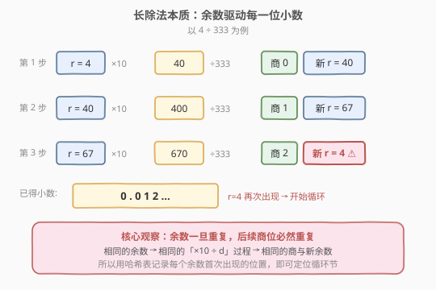
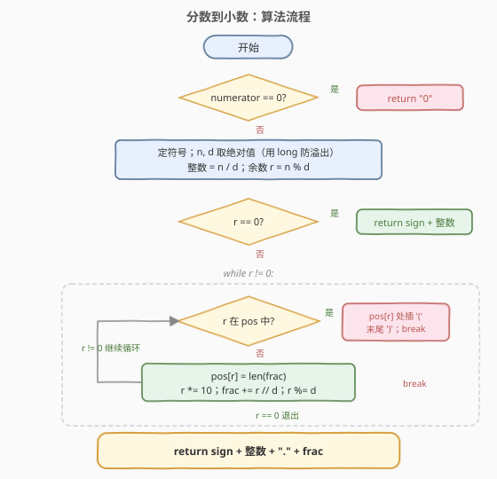
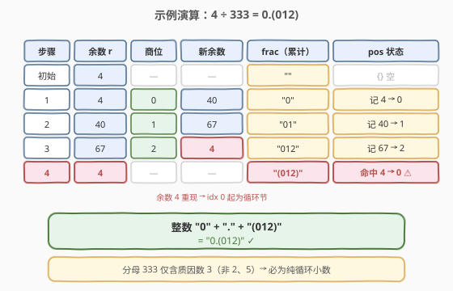
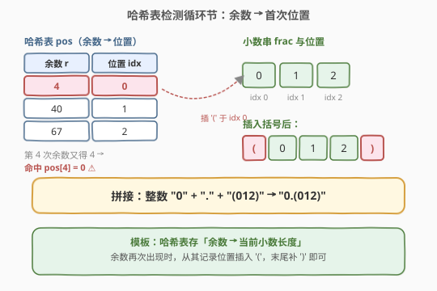

# 分数到小数

- **题目名称**：分数到小数
- **链接**：[166. 分数到小数](https://leetcode.cn/problems/fraction-to-recurring-decimal/)
- **难度**：中等
- **标签**：哈希表、数学、字符串、模拟

## 1. 题目概述

给定两个整数 `numerator`（分子）和 `denominator`（分母），以**字符串**形式返回对应的小数。如果小数部分**循环**，则把循环节用括号括起来；如果存在多种答案，返回任意一个即可。

**示例 1**：

```text
输入：numerator = 1, denominator = 2
输出："0.5"
解释：1 / 2 = 0.5，能除尽，没有循环节。
```

**示例 2**：

```text
输入：numerator = 2, denominator = 1
输出："2"
解释：2 / 1 = 2，没有小数部分。
```

**示例 3**：

```text
输入：numerator = 4, denominator = 333
输出："0.(012)"
解释：4 / 333 = 0.012012012...，"012" 无限循环。
```

**示例 4**：

```text
输入：numerator = 1, denominator = 6
输出："0.1(6)"
解释：1 / 6 = 0.1666...，"1" 不循环，"6" 循环。
```

**约束条件**：

- $-2^{31} \le \text{numerator}, \text{denominator} \le 2^{31} - 1$
- $\text{denominator} \ne 0$
- 保证答案字符串长度小于 $10^4$。

> ⚠️ 两个坑点：① 输入可能为负，需单独处理符号；② `numerator = -2^{31}` 时取绝对值会溢出 32 位 `int`，必须用 `long`（C++）或依赖 Python 的任意精度整数。

---

## 2. 解题思路

### 2.1 暴力思路

直接用浮点除法 `numerator / denominator` 得到 `double`，再转字符串？不可行：`double` 只有约 15~17 位有效数字，无法表示无限循环小数，更无法定位循环节。题面要求字符串长度可达 $10^4$，浮点数完全装不下。

正确做法是**模拟手算长除法**：一位一位地求小数位，并在这个过程中**识别循环节**。

### 2.2 核心观察：余数重复 ⇄ 小数循环



长除法的每一步只依赖当前的**余数** $r$：

$$\text{商位} = \lfloor (r \times 10) / d \rfloor, \qquad r_{\text{新}} = (r \times 10) \bmod d$$

> 💡 **关键洞察**：既然每一步完全由余数决定，那么**只要某个余数再次出现，它后续产生的商位序列必然和上次完全一样**——小数就此开始循环。反过来，若余数变为 $0$，除法终止（有限小数）。

所以识别循环节只需要：**用哈希表记录每个余数首次出现时对应的小数位置**。一旦某个余数第二次出现，从它第一次记录的位置到当前末尾，就是循环节，插一对括号即可。

整数的除法只可能在 $\{0, 1, \dots, d-1\}$ 这 $d$ 个余数之间循环，因此循环必然在至多 $d$ 步内被检测到——这也解释了为何答案长度有上界。

### 2.3 算法流程图



1. **特判** `numerator == 0`：直接返回 `"0"`（避免出现 `"-0"`）。
2. **定符号**：若分子分母异号，结果前缀 `"-"`。随后对绝对值运算。
3. **整数部分**：`integer = n / d`（整除），`r = n % d`。若 `r == 0`，直接返回 `符号 + integer`。
4. **小数部分**：进入循环 `while r != 0`：
   - 若 `r` 已在哈希表 `pos` 中：在 `pos[r]` 处插入 `'('`，末尾追加 `')'`，`break`。
   - 否则：`pos[r] = len(frac)`；`r *= 10`；`frac += r / d`（整除取商位）；`r %= d`。
5. 返回 `符号 + integer + "." + frac`。

### 2.4 示例演算



以 `numerator = 4, denominator = 333` 为例：

| 步骤 | 余数 r | r×10 | 商位 | 新余数 | frac | pos 状态 |
|------|--------|------|------|--------|------|----------|
| 初始 | 4 | — | — | — | "" | {} |
| 1 | 4 | 40 | 0 | 40 | "0" | 记 4 → 0 |
| 2 | 40 | 400 | 1 | 67 | "01" | 记 40 → 1 |
| 3 | 67 | 670 | 2 | 4 | "012" | 记 67 → 2 |
| 4 | 4 | — | — | — | "(012)" | 命中 4 → 0 ⚠ |

第 4 步余数又变回 $4$，它在 `pos` 中记录的位置是 $0$，于是从 `frac` 的第 0 位起 `012` 就是循环节，插括号得到 `"(012)"`，最终 `"0.(012)"`。



---

## 3. 参考代码

### C++

```cpp
class Solution {
  public:
    string fractionToDecimal(int numerator, int denominator) {
        if (numerator == 0) return "0";

        long long n = numerator, d = denominator;
        string sign = ((n < 0) ^ (d < 0)) ? "-" : "";
        n = n < 0 ? -n : n;   // 用 long long，避免 INT_MIN 取绝对值溢出
        d = d < 0 ? -d : d;

        string res = sign + to_string(n / d);
        long long r = n % d;
        if (r == 0) return res;

        res += '.';
        unordered_map<long long, int> pos;
        string frac;
        while (r != 0) {
            if (pos.count(r)) {
                frac.insert(pos[r], 1, '(');
                frac.push_back(')');
                break;
            }
            pos[r] = frac.size();
            r *= 10;
            frac.push_back('0' + r / d);
            r %= d;
        }
        return res + frac;
    }
};
```

### Python

```python
class Solution:
    def fractionToDecimal(self, numerator: int, denominator: int) -> str:
        if numerator == 0:
            return "0"

        sign = "-" if (numerator < 0) != (denominator < 0) else ""
        n, d = abs(numerator), abs(denominator)   # Python 整数任意精度，无溢出

        res = sign + str(n // d)
        r = n % d
        if r == 0:
            return res

        res += "."
        pos = {}
        frac = []
        while r != 0:
            if r in pos:
                frac.insert(pos[r], "(")
                frac.append(")")
                break
            pos[r] = len(frac)
            r *= 10
            frac.append(str(r // d))
            r %= d
        return res + "".join(frac)
```

> ⚠️ **先查表再记录**：循环里必须先判断 `r in pos` 再写入 `pos[r]`。若先记录后判断，会把当前余数也算作“重复”，导致立刻误判成空循环节。注意 `pos[r] = len(frac)` 记录的是**插入这个余数时小数串的长度**，正好是它对应商位（即将追加的那一位）的下标。

> 💡 **为什么记录余数而非商位？** 商位可能重复出现但并不标志循环（例如 `0.101010...` 里 `0` 和 `1` 反复出现，但循环节是 `10` 整体）。余数才唯一决定了“之后的所有商位”，所以以余数为键才正确。

---

## 4. 复杂度分析

| 维度 | 复杂度 | 说明 |
|------|--------|------|
| 时间复杂度 | $O(\text{答案长度})$ | 每次循环产生一个小数位；余数至多 $d$ 种，循环在 $d$ 步内必终止或被检出。题面保证答案长度 $< 10^4$ |
| 空间复杂度 | $O(\text{答案长度})$ | 哈希表 `pos` 与小数串 `frac` 最多存到答案长度为止 |

---

## 5. 扩展：什么样的分数会循环？

一个**既约分数** $\frac{n}{d}$ 的小数何时有限、何时循环，由分母的质因数决定：

- **有限小数**：把 $d$ 约分后，其质因数**只含 2 和 5**（即 $d = 2^a \cdot 5^b$）。此时小数位数 $= \max(a, b)$，余数最终必为 $0$。
- **纯循环小数**：$d$ 与 $10$ 互质（不含因子 2 或 5），如 $333 = 3^2 \times 37$，与 $10$ 互质，故 $4/333$ 是纯循环 `0.(012)`。
- **混循环小数**：$d$ 既含 2/5 又含其它因子，如 $6 = 2 \times 3$，故 $1/6 = 0.1(6)$，不循环的前段长度由 2/5 的幂决定。

循环节长度等于 $10$ 在模 $d'$ 下的**乘法阶**（$d'$ 为 $d$ 去除所有 2、5 因子后剩余的部分）。这些性质是数论中费马小定理、欧拉定理的延伸，面试中能顺带提一句会显得功底扎实，但本题**并不需要**预先约分——长除法 + 哈希已能通吃所有情况。

---

## 6. 面试要点

1. **为什么用哈希表记录余数就能定位循环节？**

   长除法中“下一步的商位和新余数”完全由当前余数决定。若余数 $r$ 再次出现，从它开始后续的商位序列必然与上一轮完全相同，于是形成循环。哈希表 `余数 → 首次出现位置` 在 $O(1)$ 内检出这种重复，并直接给出循环起止下标。

2. **为什么要用 `long long`（C++）？**

   输入下界是 $-2^{31}$（`INT_MIN`），对其取相反数 $2^{31}$ 超出 `int` 上界 $2^{31}-1$，发生溢出。先把 `n, d` 提升为 `long long` 再取绝对值即可。Python 的整数无此问题。

3. **符号怎么处理最稳妥？**

   单独算符号：`(n < 0) ^ (d < 0)` 为真则加 `"-"`，随后用绝对值做除法。这样不必在循环里反复处理负数取模的歧义（C++ 中负数取模结果由实现定义，容易出错）。同时特判 `numerator == 0` 直接返回 `"0"`，避免输出 `"-0"`。

4. **循环里先查表还是先记录？**

   必须先 `if r in pos` 判断，再 `pos[r] = len(frac)`。否则当前余数会被立刻判为重复，循环节长度为 0。记录的值 `len(frac)` 是当前小数串长度，等于“即将追加的商位”在串中的下标，正是循环起点。

5. **不预先约分能AC吗？**

   能。长除法 + 哈希不依赖分数是否既约：即便 $\frac{2}{6}$ 没约分成 $\frac{1}{3}$，余数序列照样会在重复处被检出，得到正确的 `0.(3)`。约分只是数论层面的解释，不写进算法。

6. **如果要求循环节必须从最早可能出现的位置开始（最短循环节），算法还成立吗？**

   成立且自然满足。因为我们记录的是**每个余数的首次出现位置**，一旦某个余数第二次出现就立刻括起——这给出的正是最短循环节。例如 $1/6$：余数序列 $1 \to 4 \to 4 \to \dots$，第二个 $4$ 命中第一个 $4$，得到 `0.1(6)` 而非 `0.(16)`。

---

## 7. 同类练习题

- [202. 快乐数](https://leetcode.cn/problems/happy-number/)：用哈希集合检测「各位平方和」序列中的循环，与本题「余数重复即小数循环」同属「哈希判环」模板
- [415. 字符串相加](https://leetcode.cn/problems/add-strings/)（[题解](../0401-0500/415_字符串相加.md)）：逐位模拟入门题，边界处理风格相近
- [8. 字符串转换整数 (atoi)](https://leetcode.cn/problems/string-to-integer-atoi/)（[题解](../0001-0100/8_字符串转换整数atoi.md)）：模拟 + 溢出边界处理，同为「模拟易错题」
- [141. 环形链表](https://leetcode.cn/problems/linked-list-cycle/)（[题解](../0101-0200/141_环形链表.md)）：另一类「环检测」问题，用快慢指针代替哈希
- [287. 寻找重复数](https://leetcode.cn/problems/find-the-duplicate-number/)（[题解](../0201-0300/287_寻找重复数.md)）：Floyd 判圈法的经典应用，与哈希判环互为对照
