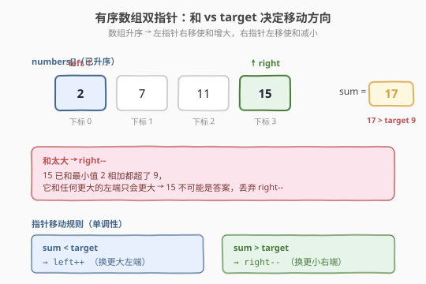
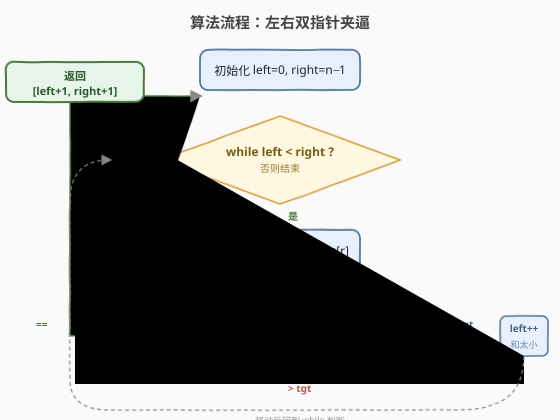

# LeetCode 两数之和 II - 输入有序数组 题解

## 1. 题目概述

- **标题 / 题号**：两数之和 II - 输入有序数组（#167，medium）
- **链接**：https://leetcode.cn/problems/two-sum-ii-input-array-is-sorted/
- **难度**：中等
- **标签**：数组、双指针、二分查找

**题意**：给你一个**下标从 1 开始**的整数数组 `numbers`，该数组已按**非递减顺序**排列，请你从数组中找出满足相加之和等于目标数 `target` 的两个数。返回这两个数的**下标** `index1` 和 `index2`（满足 `1 <= index1 < index2 <= numbers.length`）。

只存在**唯一**答案，且不能使用相同元素两次。返回的下标要求**以 1 为起点**。

**示例 1**：

```text
输入：numbers = [2,7,11,15], target = 9
输出：[1,2]
解释：2 与 7 之和等于目标数 9 ，下标分别为 1 和 2 ，返回 [1, 2]。
```

**示例 2**：

```text
输入：numbers = [2,3,4], target = 6
输出：[1,3]
解释：2 与 4 之和等于 6 ，下标 1 和 3 。
```

**示例 3**：

```text
输入：numbers = [-1,0], target = -1
输出：[1,2]
解释：-1 与 0 之和等于 -1 。
```

**约束**：

- `2 <= numbers.length <= 3 * 10^4`
- `-1000 <= numbers[i] <= 1000`
- `numbers` 按**非递减顺序**排列
- `-1000 <= target <= 1000`
- **仅存在一个有效答案**

**进阶要求**：使用空间复杂度为 $O(1)$ 的算法。

> 💡 这是「**有序数组双指针**」的招牌题。与 [1. 两数之和](../0001-0100/1_两数之和.md) 的「无序数组 + 哈希表」不同，本题的**有序**这个前提是关键：它让我们能用左右双指针在 $O(n)$ 时间、$O(1)$ 空间内解决，无需哈希表。这个「排序 + 双指针」模板是 [15. 三数之和](../0001-0100/15_三数之和.md)、[18. 四数之和] 等一系列题的内层骨架，必须熟练。

## 2. 解题思路

### 2.1 暴力思路：二分查找补数

由于数组有序，遍历每个 `numbers[i]`，用**二分查找**在 `[i+1, n-1]` 范围内找 `target - numbers[i]`：

```text
for i in 0..n-1:
    j = binary_search(numbers, i+1, n-1, target - numbers[i])
    if j != -1: return [i+1, j+1]
```

时间复杂度 $O(n \log n)$，空间 $O(1)$，能过但不是最优。问题在于：对每个元素独立地二分，**没有利用上一次比较的信息**——双指针能把每步的「和与目标的关系」连续地指导下一步移动，从而把 $O(n \log n)$ 降到 $O(n)$。

> ⚠️ 也可以直接套用第 1 题的**哈希表**做法（一次遍历查补数），时间 $O(n)$、空间 $O(n)$。但它**完全没用到「有序」这个条件**，且不满足进阶的 $O(1)$ 空间要求。本题考查的就是「有序 → 双指针」的转化能力。

### 2.2 核心观察：左右双指针 + 单调性



关键定义：`left` 从最左、`right` 从最右出发，计算 $s = \text{numbers}[l] + \text{numbers}[r]$，根据 $s$ 与 `target` 的关系移动指针：

- $s = \text{target}$：命中，返回 $[\text{left}+1,\ \text{right}+1]$（题目要求 1 起始下标）。
- $s < \text{target}$：和**太小**，`left++`（换一个更大的左端）。
- $s > \text{target}$：和**太大**，`right--`（换一个更小的右端）。

**为什么这样移动是正确的？** 这是有序双指针的灵魂，分两种情况：

- **当 $s < \text{target}$ 时**：$\text{numbers}[l]$ 太小了。因为数组升序，$\text{numbers}[l]$ 是当前能配对的最小值都已不够——它与 `right`（当前最大可选值）相加都不够，那它与 `[l+1, right-1]` 中任何一个更小的值相加只会**更小**。所以 $\text{numbers}[l]$ **不可能**是答案的一部分，必须丢弃它，`left++`。
- **当 $s > \text{target}$ 时**：对称地，$\text{numbers}[r]$ 太大了。它和当前最小的 $\text{numbers}[l]$ 相加都超了，换任何更大的左端只会**更大**。所以 $\text{numbers}[r]$ 不可能是答案的一部分，丢弃它，`right--`。

> 💡 **一句话直觉**：有序数组让「和」关于两个指针是**单调**的——左指针右移使和增大，右指针左移使和减小。所以每比较一次就能**确定地淘汰一侧的一个元素**，绝无回头路，因此总移动次数不超过 $n$。

### 2.3 算法流程图



整体只有一重 `while left < right` 循环，每轮要么命中返回，要么 `left` 或 `right` 之一移动一步，二者都**只增不减**，合计至多 $n-1$ 步。

### 2.4 示例演算

![示例演算：numbers=[2,7,11,15], target=9](../images/ts2_example_walkthrough.svg)

以 `numbers = [2,7,11,15]`，`target = 9` 为例（下标从 0 计，最后 +1 输出）：

| 步骤 | left | right | numbers[l] | numbers[r] | sum | 与 9 比 | 动作 |
|------|------|-------|------------|------------|-----|---------|------|
| 1 | 0 | 3 | 2 | 15 | 17 | > 9 | right-- |
| 2 | 0 | 2 | 2 | 11 | 13 | > 9 | right-- |
| 3 | 0 | 1 | 2 | 7 | 9 | == 9 | 返回 `[1,2]` ⭐ |

第 1 步：`2 + 15 = 17 > 9`，和太大，`15` 不可能是答案的一部分（它和最小的 `2` 相加都超了），`right--`。第 2 步同理淘汰 `11`。第 3 步 `2 + 7 = 9` 命中，返回 1 起始下标 `[1, 2]`。

> 💡 为了覆盖 `left++` 分支，看 `numbers = [1,2,3,4,7]`，`target = 7`：
> - `l=0,r=4`：`1+7=8 > 7` → `right--`
> - `l=0,r=3`：`1+4=5 < 7` → `left++`（和太小，`1` 配当前最大 `4` 都不够，淘汰 `1`）
> - `l=1,r=3`：`2+4=6 < 7` → `left++`
> - `l=2,r=3`：`3+4=7 == 7` → 返回 `[3,5]` ⭐
>
> 这个例子同时出现 `right--`、`left++` 和命中，说明指针方向由「和 vs 目标」动态决定，无需回溯。

## 3. 参考代码

### C++

```cpp
class Solution {
  public:
    vector<int> twoSum(vector<int>& numbers, int target) {
        int left = 0, right = numbers.size() - 1;
        while (left < right) {
            int sum = numbers[left] + numbers[right];
            if (sum == target) {
                return {left + 1, right + 1}; // 题目要求 1 起始下标
            } else if (sum < target) {
                ++left;  // 和太小，换更大的左端
            } else {
                --right; // 和太大，换更小的右端
            }
        }
        return {}; // 题目保证有解，不会走到这里
    }
};
```

### Python

```python
class Solution:
    def twoSum(self, numbers: List[int], target: int) -> List[int]:
        left, right = 0, len(numbers) - 1
        while left < right:
            s = numbers[left] + numbers[right]
            if s == target:
                return [left + 1, right + 1]
            elif s < target:
                left += 1
            else:
                right -= 1
        return []  # 题目保证有解
```

> ⚠️ **下标陷阱**：本题下标从 **1** 开始，返回前务必 `+1`。这是本题最常见的低级错误——双指针逻辑全对，却因下标从 0 算而 WA。

## 4. 复杂度分析

| 维度 | 复杂度 | 说明 |
|------|--------|------|
| 时间复杂度 | $O(n)$ | `left`、`right` 合计至多移动 $n-1$ 次，每轮 $O(1)$ |
| 空间复杂度 | $O(1)$ | 只用两个指针变量，满足进阶要求 |

> ⚠️ 与第 1 题哈希表的 $O(n)$ 空间相比，本题靠「有序」省掉了哈希表，做到 $O(1)$ 空间。这正是「有序」条件的价值。

## 5. 扩展：两数之和家族的选型决策

「两数之和」有三条主流解法，选用哪条取决于**数组是否有序**和**要返回下标还是值**：

| 解法 | 时间 | 空间 | 前提 | 适用题 |
|------|------|------|------|--------|
| 哈希表（查补数） | $O(n)$ | $O(n)$ | 无 | [1. 两数之和](../0001-0100/1_两数之和.md)（无序、要下标） |
| 排序 + 双指针 | $O(n \log n)$ | $O(1)$ | 需排序 | 返回值、可破坏原序 |
| 有序 + 双指针 | $O(n)$ | $O(1)$ | 已有序 | **本题 167** |

> 💡 **决策口诀**：要下标且无序 → 哈希表；要值或已有序 → 双指针。本题是「已有序」的特例，直接双指针最优，连排序都省了。

### 5.1 推广到三数之和 / 四数之和

本题的双指针是 [15. 三数之和](../0001-0100/15_三数之和.md) 的内层骨架：外层固定一个数 `nums[i]`，内层在 `[i+1, n-1]` 上跑一次「有序两数之和」（target = `0 - nums[i]`），整体 $O(n^2)$。四数之和再套一层循环，$O(n^3)$。掌握本题，三数之和就只剩「排序 + 去重 + 外层枚举」的包装了。

## 6. 面试要点

1. **为什么 $s < \text{target}$ 时移动 `left` 而不是 `right`？**

   - $s < \text{target}$ 说明和太小。数组升序，$\text{numbers}[l]$ 已是当前可选最小值，它与当前最大值 $\text{numbers}[r]$ 相加都不够，那它和 `[l+1, r-1]` 中任何更小的值相加只会更小。所以 $\text{numbers}[l]$ 不可能是答案，必须 `left++` 淘汰它。若此时反而 `right--`，和会**更小**，南辕北辙。

2. **双指针为什么不会漏掉唯一解？**

   - 每次移动都**确定地淘汰一个不可能成为解的元素**（见上）。设唯一解为 $(l^*, r^*)$，夹逼过程中指针一定会先到达 $l^*$ 或 $r^*$ 之一；在到达另一个端点之前，被移动的指针所淘汰的元素都已被严格证明不可能是解，所以 $l^*$、$r^*$ 永远不会被错误淘汰，最终必然相遇于解。

3. **能不能用第 1 题的哈希表做？为什么面试官会追问？**

   - 能，时间 $O(n)$ 但空间 $O(n)$。面试官追问是因为本题给了「有序」这个强条件，用哈希表等于**无视条件**，且不满足进阶的 $O(1)$ 空间。考的是你能否识别「有序 → 双指针」的转化。

4. **下标为什么要 +1？数组里有负数会影响吗？**

   - 题目规定下标从 1 开始，返回前 +1。负数**不影响**双指针逻辑——升序依然成立，`sum < target` 时 `left++` 使和增大、`sum > target` 时 `right--` 使和减小的单调性对负数同样成立。示例 3（`[-1,0]`，`target=-1`）即验证了负数情形。

5. **如果数组无序但要求 $O(1)$ 空间返回值（非下标），怎么做？**

   - 先 `sort` 排序（$O(n \log n)$），再跑本题的双指针。代价是排序破坏原下标，所以只能返回值、不能返回下标。这正是「排序 + 双指针」通用模板的来源。

> 💡 **一句话总结**：167 是「有序两数之和」的标准模板——左右双指针，靠「和 vs 目标」的单调性决定每步淘汰哪一侧，$O(n)$ 时间、$O(1)$ 空间。它是三数之和、四数之和的内层骨架，面试中一旦看到「有序 + 两数之和」就该条件反射地写双指针。

## 同类练习题

| # | 题目 | 与本题的关联 |
|---|------|-------------|
| 1 | [两数之和](https://leetcode.cn/problems/two-sum/)（[题解](../0001-0100/1_两数之和.md)） | 无序 + 哈希表，对比「有序 → 双指针」的选型 |
| 15 | [三数之和](https://leetcode.cn/problems/3sum/)（[题解](../0001-0100/15_三数之和.md)） | 外层枚举 + 内层跑本题的双指针 |
| 653 | [两数之和 IV - 输入二叉搜索树](https://leetcode.cn/problems/two-sum-iv-input-is-a-bst/) | BST 中序遍历得有序序列，再套双指针 |
| 2824 | [统计和小于目标的下标对数目](https://leetcode.cn/problems/count-pairs-whose-sum-is-less-than-target/) | 有序数组双指针计数，移动规则的同款单调性 |
