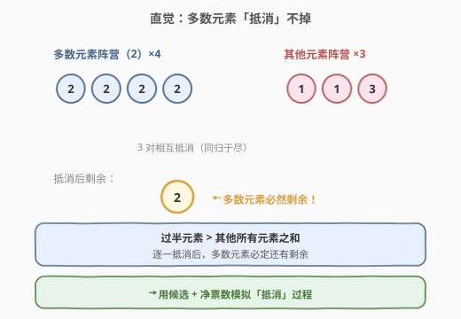
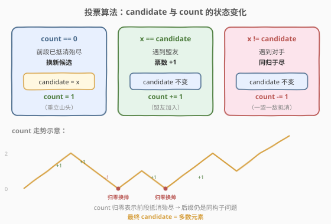
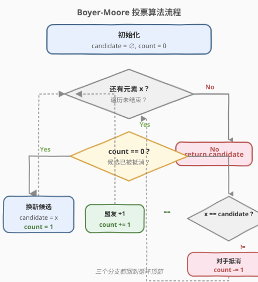
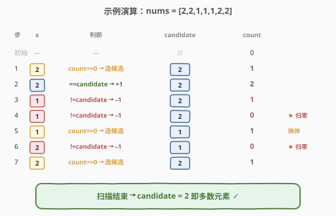

# LeetCode 多数元素 题解

## 1. 题目概述

- **标题 / 题号**：多数元素（#169，easy）
- **链接**：https://leetcode.cn/problems/majority-element/
- **难度**：简单
- **标签**：数组、哈希表、分治、Boyer-Moore 投票算法

**题意**：给定一个大小为 `n` 的数组 `nums`，返回其中的**多数元素**。多数元素是指在数组中出现次数 **大于 `⌊n/2⌋`** 的元素。

你可以假设数组是非空的，并且给定的数组总是存在多数元素。

**示例 1**：

```text
输入：nums = [3,2,3]
输出：3
解释：3 出现 2 次，大于 ⌊3/2⌋ = 1，是多数元素。
```

**示例 2**：

```text
输入：nums = [2,2,1,1,1,2,2]
输出：2
解释：2 出现 4 次，大于 ⌊7/2⌋ = 3，是多数元素。
```

**约束**：

- `n == nums.length`
- `1 <= n <= 5 * 10^4`
- `-10^9 <= nums[i] <= 10^9`

> ⚠️ **关键前提**：多数元素出现次数**严格大于 `⌊n/2⌋`**，即它在数组中**比所有其他元素加起来还多**。这个「过半」性质是 Boyer-Moore 投票算法成立的基础；若无此保证，则必须用哈希表严格计数后再判断次数。

## 2. 解题思路

### 2.1 暴力思路

用哈希表统计每个元素的出现次数，再扫描哈希表找出计数大于 `⌊n/2⌋` 的元素。时间 `O(n)`、空间 `O(n)`，能过但用了额外空间。也可排序后取下标 `n/2`（多数元素必覆盖中点），时间 `O(n log n)`、空间 `O(log n)`。

### 2.2 核心观察：过半元素「抵消」不掉



把寻找多数元素想象成一场**「投票对决」**：每个元素把与自己不同的元素「同归于尽」地抵消掉。由于多数元素超过半数，即使把所有非多数元素都拿来抵消，多数元素**最后一定还有剩余**。

> 💡 **关键转化**：维护一个 `candidate`（候选）和 `count`（净票数）。扫描时：相同则 `count+1`，不同则 `count−1`；当 `count` 跌到 0，说明之前的候选已被完全抵消，换下一个元素当候选。最终剩下的候选就是多数元素。

### 2.3 Boyer-Moore 投票算法



算法只需一遍扫描、两个变量：

1. `candidate` 初始无值，`count = 0`。
2. 对每个 `x`：
   - 若 `count == 0`：选 `x` 为新候选，`count = 1`。
   - 否则若 `x == candidate`：`count += 1`（盟友加入）。
   - 否则：`count -= 1`（与对手抵消）。
3. 扫描结束，`candidate` 即多数元素。

> ⚠️ **正确性直觉**：每次 `count` 归零意味着「之前这段区间内候选与非候选相互抵消殆尽」，剩余部分仍是原数组的「多数子问题」——多数元素在剩余后缀中依然过半。因此最终候选必为全局多数元素。本题保证存在多数元素，故无需二次验证。

### 2.4 算法流程图



### 2.5 示例演算

以 `nums = [2,2,1,1,1,2,2]` 为例：



| 步骤 | 元素 x | count 变化前 | 判断 | candidate | count 变化后 |
|------|--------|--------------|------|-----------|--------------|
| 初始 | — | — | — | — | 0 |
| 1 | 2 | 0 | count==0 → 选候选 | 2 | 1 |
| 2 | 2 | 1 | ==candidate | 2 | 2 |
| 3 | 1 | 2 | ≠candidate → 抵消 | 2 | 1 |
| 4 | 1 | 1 | ≠candidate → 抵消 | 2 | 0 |
| 5 | 1 | 0 | count==0 → 选候选 | 1 | 1 |
| 6 | 2 | 1 | ≠candidate → 抵消 | 1 | 0 |
| 7 | 2 | 0 | count==0 → 选候选 | 2 | 1 |

扫描结束，`candidate = 2` 即多数元素 ✓。注意第 4、6 步 count 归零后「换帅」，但最终剩余的仍是真正的多数元素。

## 3. 参考代码

### C++

```cpp
class Solution {
  public:
    int majorityElement(vector<int>& nums) {
        int candidate = 0, count = 0;
        for (int x : nums) {
            if (count == 0) {
                candidate = x;
                count = 1;
            } else if (x == candidate) {
                count++;
            } else {
                count--;
            }
        }
        return candidate;
    }
};
```

### Python

```python
class Solution:
    def majorityElement(self, nums: List[int]) -> int:
        candidate = None
        count = 0
        for x in nums:
            if count == 0:
                candidate = x
                count = 1
            elif x == candidate:
                count += 1
            else:
                count -= 1
        return candidate
```

## 4. 复杂度分析

| 维度 | 复杂度 | 说明 |
|------|--------|------|
| 时间复杂度 | O(n) | 只遍历数组一次，每次 `O(1)` 比较 / 更新 |
| 空间复杂度 | O(1) | 仅用 `candidate` 与 `count` 两个变量 |

> 💡 这是该题的最优解：时间已达下界 `O(n)`（必须至少看一遍所有元素），空间为常数。

## 5. 扩展：不保证存在多数元素时的验证

若题目**不保证**存在过半元素（如 [229. 多数元素 II] 求 `⌊n/3⌋`，或一般「众数」问题），Boyer-Moore 给出的只是**候选**，必须**再扫一遍**统计其真实出现次数，确认 `> ⌊n/2⌋` 后才能返回：

```python
count = sum(1 for x in nums if x == candidate)
return candidate if count > len(nums) // 2 else -1   # 无多数元素
```

> 💡 **分治解法**：把数组切成两半递归求各自的多数元素，再合并——若左右相同则取之，否则比较两者在当前区间的实际计数取较大者。时间 `O(n log n)`、空间 `O(log n)`，虽非最优但能体现分治思想。

## 6. 面试要点

1. **Boyer-Moore 投票为什么能得到多数元素？**
   - 每次抵消「一个候选 + 一个非候选」一对，多数元素因过半而无法被全部抵消；`count` 归零只表示「前缀段抵消殆尽」，后缀中多数元素依然过半，故最终候选必为多数元素。

2. **为什么 `count == 0` 时要换候选？**
   - `count == 0` 意味着当前候选已被前面的非候选完全抵消，它不可能是「剩余区间」的多数元素；后缀是一个规模更小的同构子问题，应从中重新选出候选。

3. **算法是否一定需要「存在过半元素」的前提？**
   - 是。若不存在，最终候选可能任意（如 `[1,2,3]` 得 `3`，但无过半元素）。因此一般场景必须二次扫描验证计数。

4. **能否推广到求出现次数大于 `⌊n/k⌋` 的元素？**
   - 可以。这类元素最多 `k−1` 个，维护 `k−1` 个 `(candidate, count)`，遇到相同则 +1，遇到不同且有空槽则填入，否则全部 −1；最后同样需二次验证。详见 [229. 多数元素 II]。

5. **排序取中点的方法为什么正确？**
   - 多数元素出现超过 `⌊n/2⌋` 次，排序后它必然覆盖下标 `⌊n/2⌋`（无论它分布在数组左端、右端还是两端），故 `nums[n//2]` 一定是多数元素。时间 `O(n log n)`，简洁但非最优。

## 同类练习题

| # | 题目 | 与本题的关联 |
|---|------|-------------|
| 229 | [多数元素 II](https://leetcode.cn/problems/majority-element-ii/) | 求出现大于 `⌊n/3⌋` 的所有元素，Boyer-Moore 的 k=3 推广 + 二次验证 |
| 1150 | [检查一个数是否在数组中占绝大多数](https://leetcode.cn/problems/check-if-a-number-is-majority-element-in-a-sorted-array/) | 有序数组中验证某值是否过半，可用二分边界模板（见 34 题） |
| — | [面试题 17.10. 主要元素](https://leetcode.cn/problems/find-majority-element-lcci/) | 不保证存在多数元素，Boyer-Moore + 二次验证的标准变体 |
| 34 | [在排序数组中查找元素的第一个和最后一个位置](https://leetcode.cn/problems/find-first-and-last-position-of-element-in-sorted-array/)（[题解](../0001-0100/34_在排序数组中查找元素的第一个和最后一个位置.md)） | 配合二分可在有序数组中 `O(log n)` 统计某元素次数 |
| 剑指 Offer 39 | [数组中出现次数超过一半的数字](https://leetcode.cn/problems/shu-zu-zhong-chu-xian-ci-shu-chao-guo-yi-ban-de-shu-zi-lcof/) | 本题同款，Boyer-Moore 投票的中文版经典题 |
