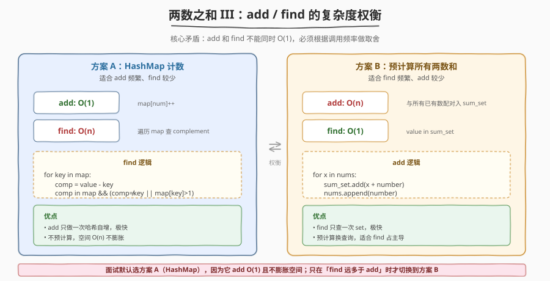
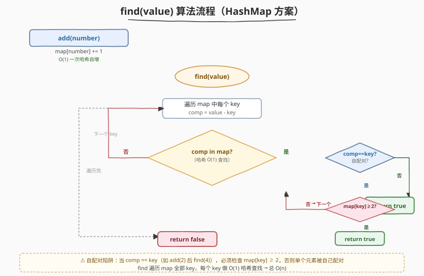
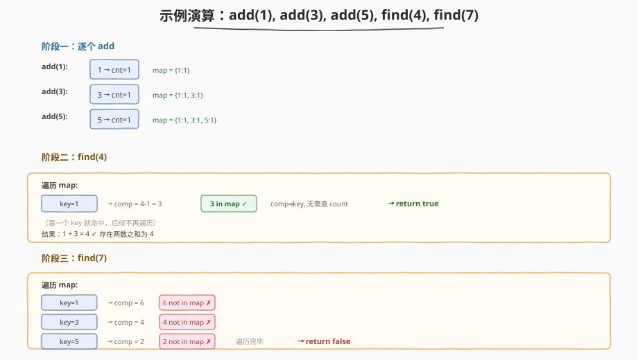

# LeetCode 两数之和 III - 数据结构设计 题解

## 1. 题目概述

- **标题 / 题号**：两数之和 III - 数据结构设计（#170，easy）
- **链接**：https://leetcode.cn/problems/two-sum-iii-data-structure-design/
- **难度**：简单
- **标签**：设计、哈希表

**题意**：设计一个数据结构，接受一个整数流，并支持以下两种操作：

- `add(number)`：向数据结构中添加一个整数 `number`。
- `find(value)`：判断数据结构中是否存在**两个**整数的和等于 `value`，存在返回 `true`，否则返回 `false`。

**示例**：

```text
输入：
  TwoSum twoSum = new TwoSum();
  twoSum.add(1);
  twoSum.add(3);
  twoSum.add(5);
  twoSum.find(4);   → 返回 true  （1 + 3 = 4）
  twoSum.find(7);   → 返回 false （没有两数之和为 7）
```

**约束**：

- $-10^5 \leq \text{number} \leq 10^5$
- $-2^{31} \leq \text{value} \leq 2^{31} - 1$
- `add` 和 `find` 最多被调用 $3 \times 10^4$ 次

> 💡 本题是 [1. 两数之和](../0001-0100/1_两数之和.md) 的**数据结构化变体**：第 1 题在一个**静态数组**里做一次性查询，用「一次遍历 + 哈希补数」即可；而本题数据是**动态流入**的，`add` 和 `find` 交替调用，必须把查询所需的索引结构**持久化**到对象内部。核心矛盾是：`add` 和 `find` 的复杂度**无法同时做到 O(1)**，必须根据调用频率做权衡。

## 2. 解题思路

### 2.1 暴力思路

用数组存所有数字。`add` 直接 `append`，O(1)；`find` 用双重循环枚举所有两数对，判断和是否等于 `value`，O(n²)。当 `find` 调用频繁且数据量较大时，$O(n^2)$ 不可接受。

> ⚠️ 暴力法的 `find` 与第 1 题一样，都是枚举两数对。区别在于第 1 题只需做**一次**查询，$O(n)$ 哈希即可；本题 `find` 会反复调用，每次都从头枚举浪费了「数据没变时查询结果可复用」的信息。

### 2.2 核心观察：add / find 的复杂度权衡



关键洞察：`add` 和 `find` 存在**跷跷板效应**——优化一个必然牺牲另一个。根据哪个操作调用更频繁，选择不同策略：

| 场景 | 策略 | add 复杂度 | find 复杂度 | 空间 |
|------|------|------------|-------------|------|
| `add` 频繁、`find` 较少 | **HashMap 计数** | $O(1)$ | $O(n)$ | $O(n)$ |
| `find` 频繁、`add` 较少 | **预计算所有两数和** | $O(n)$ | $O(1)$ | $O(n^2)$ |

> 💡 **方案 A（HashMap 计数）** 是面试默认选择：`add` 只做一次 `map[num]++`，`find` 时遍历 `map` 的每个 `key`，查 `value - key` 是否也在 `map` 中。空间 $O(n)$，不膨胀。
>
> **方案 B（预计算两数和）** 在 `add` 时把新数与所有已有数配对、把和塞进一个 `sum_set`，`find` 只需查 `value in sum_set`。但 `add` 是 $O(n)$，且 `sum_set` 最多存 $O(n^2)$ 个和，空间开销大。

### 2.3 算法流程图（方案 A：HashMap 计数）



```
add(number):
  map[number] += 1              // O(1)

find(value):
  for key in map:               // 遍历所有不同的数
    comp = value - key
    if comp in map:
      if comp != key:           // 两数不同 → 直接命中
        return true
      if map[key] >= 2:         // 两数相同 → 需要 key 出现至少 2 次
        return true
  return false                  // 遍历完无命中
```

> ⚠️ **自配对陷阱**：当 `comp == key`（即 `value = 2 * key`，如 `add(2)` 后 `find(4)`），不能只查 `comp in map`——一个 `2` 不能和自己配对。必须额外检查 `map[key] >= 2`，确认有两个相同的数可用。这是本题最易踩的坑。

### 2.4 示例演算

以 `add(1), add(3), add(5), find(4), find(7)` 为例：



| 操作 | map 状态 | find 检查过程 | 结果 |
|------|----------|--------------|------|
| `add(1)` | `{1:1}` | — | — |
| `add(3)` | `{1:1, 3:1}` | — | — |
| `add(5)` | `{1:1, 3:1, 5:1}` | — | — |
| `find(4)` | 不变 | key=1 → comp=3, `3 in map` ✓, `3≠1` → 命中 | **true** |
| `find(7)` | 不变 | key=1 → comp=6 ✗; key=3 → comp=4 ✗; key=5 → comp=2 ✗ | **false** |

`find(4)` 在第一个 `key=1` 就命中（`1+3=4`），无需继续遍历。`find(7)` 遍历完所有 `key` 都未命中，返回 `false`。

## 3. 参考代码

### C++

```cpp
class TwoSum {
    unordered_map<int, int> freq;

  public:
    TwoSum() {}

    void add(int number) {
        freq[number]++;
    }

    bool find(int value) {
        for (auto& [key, cnt] : freq) {
            long comp = (long)value - key;        // 用 long 防 value - key 溢出
            auto it = freq.find((int)comp);
            if (it == freq.end()) continue;
            if (comp != key) return true;          // 两数不同 → 直接命中
            if (it->second >= 2) return true;      // 两数相同 → 需出现 ≥2 次
        }
        return false;
    }
};
```

### Python

```python
class TwoSum:
    def __init__(self):
        self.freq = {}          # number → 出现次数

    def add(self, number: int) -> None:
        self.freq[number] = self.freq.get(number, 0) + 1

    def find(self, value: int) -> bool:
        for key, cnt in self.freq.items():
            comp = value - key
            if comp in self.freq:
                if comp != key:          # 两数不同 → 直接命中
                    return True
                if cnt >= 2:             # 两数相同 → 需出现 ≥2 次
                    return True
        return False
```

> 💡 **溢出处理**：`value` 的范围是 $[-2^{31}, 2^{31}-1]$，而 `key` 也是 `int`，`value - key` 可能超出 `int` 范围（如 `value = INT_MIN, key = 1`）。C++ 中用 `long` 计算 `comp` 再转回 `int` 查找；Python 的 `int` 无溢出问题，无需特殊处理。

## 4. 复杂度分析

| 维度 | 复杂度 | 说明 |
|------|--------|------|
| add 时间 | $O(1)$ | 一次哈希表自增 |
| find 时间 | $O(n)$ | 遍历 `map` 中所有不同的数（$n$ = 不同数的个数），每个做 $O(1)$ 哈希查找 |
| 空间 | $O(n)$ | 哈希表存储每个数及其出现次数 |

> 💡 方案 B（预计算）的 `find` 为 $O(1)$、`add` 为 $O(n)$，但 `sum_set` 空间达 $O(n^2)$。面试默认选方案 A，在 `add` 远多于 `find` 时更优；若 `find` 远多于 `add` 才考虑方案 B。

## 5. 扩展：方案 B（预计算两数和，优化 find）

当 `find` 调用远多于 `add` 时，可在 `add` 时预计算所有两数之和存入 `sum_set`，使 `find` 降为 $O(1)$：

```python
class TwoSum:
    def __init__(self):
        self.nums = []
        self.sum_set = set()

    def add(self, number: int) -> None:
        for x in self.nums:              # 与所有已有数配对
            self.sum_set.add(x + number)
        self.nums.append(number)

    def find(self, value: int) -> bool:
        return value in self.sum_set     # O(1)
```

> ⚠️ 代价：`add` 从 $O(1)$ 升到 $O(n)$，`sum_set` 空间从 $O(n)$ 膨胀到 $O(n^2)$。只有当 `find` 调用次数 $\gg$ `add` 调用次数时才值得。面试中先讲方案 A，再主动提出方案 B 并分析其权衡，体现对「数据结构设计题本质是复杂度权衡」的理解。

## 6. 面试要点

1. **本题和第 1 题「两数之和」有什么区别？**

   - 第 1 题在**静态数组**上做一次性查询，用「一次遍历 + 哈希补数」$O(n)$ 即可。本题数据是**动态流入**的，`add` 和 `find` 交替调用，必须把索引结构持久化。第 1 题只需回答一次，本题要支持反复查询——这是「一次性算法」与「数据结构设计」的本质分野。

2. **`find` 时 `comp == key` 为什么要额外判断 `count >= 2`？**

   - 当 `value = 2 * key` 时，补数就是 `key` 自身。如果 `key` 只出现了一次，它不能和自己配对（题目要求**两个**整数）。所以必须确认 `map[key] >= 2`，即至少有两个相同的数可用。漏掉这个检查会导致单个元素被「自配对」而错误返回 `true`。

3. **为什么 `add` 和 `find` 不能同时 O(1)？**

   - 如果 `add` 是 $O(1)$（只存数），`find` 就必须在查询时遍历所有数对，至少 $O(n)$。如果 `find` 是 $O(1)$（查预计算的和集），`add` 就必须在插入时与所有已有数配对，至少 $O(n)$。这是**信息论下界**——两数和对的空间是 $O(n^2)$，要么查询时算（find 慢），要么插入时算（add 慢），无法两头都快。

4. **如何选择方案 A 还是方案 B？**

   - 看 `add` 和 `find` 的调用频率比。面试默认选方案 A（HashMap 计数）：`add` $O(1)$ / `find` $O(n)$ / 空间 $O(n)$，适合「写多读少」。若面试官说 `find` 会被大量调用，再切换到方案 B：`add` $O(n)$ / `find` $O(1)$ / 空间 $O(n^2)$，适合「读多写少」。关键是在切换前主动分析权衡，而非直接猜。

5. **`value - key` 会溢出吗？怎么处理？**

   - 会。`value` 范围 $[-2^{31}, 2^{31}-1]$，`key` 也是 `int`，`value - key` 可达 $[-2^{32}+1, 2^{32}-2]$，超出 32 位有符号整数范围。C++ 中用 `long` 类型计算 `comp`，再做查找；Python 无此问题。虽然实际测试中溢出用例较少，但面试时应主动提及以体现边界意识。

## 同类练习题

| # | 题目 | 与本题的关联 |
|---|------|-------------|
| 1 | [两数之和](https://leetcode.cn/problems/two-sum/)（[题解](../0001-0100/1_两数之和.md)） | 静态数组版一次性查询，哈希补数 $O(n)$，本题的「前身」 |
| 15 | [三数之和](https://leetcode.cn/problems/3sum/)（[题解](../0001-0100/15_三数之和.md)） | 排序 + 双指针枚举三数对，从「两数之和」到「三数之和」的扩展 |
| 454 | [四数相加 II](https://leetcode.cn/problems/4sum-ii/)（[题解](../0401-0500/454_四数相加 II.md)） | 四个独立数组分组 + 哈希，Meet in the Middle 思想 |
| 146 | [LRU 缓存](https://leetcode.cn/problems/lru-cache/)（[题解](146_LRU缓存.md)） | 另一道经典数据结构设计题，哈希 + 双向链表，对比不同设计的权衡思路 |
| 705 | [设计哈希集合](https://leetcode.cn/problems/design-hashset/) | 从零实现哈希结构，理解哈希表底层原理有助于分析本题的 $O(1)$ 操作来源 |
