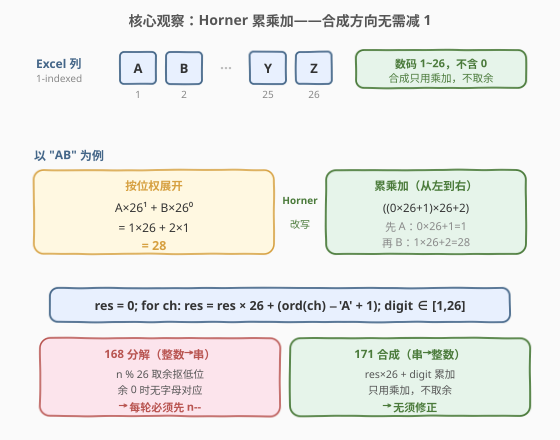
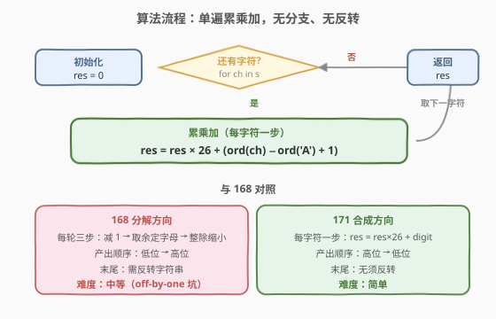
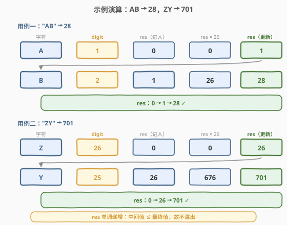

# Excel表列序号

- **题目名称**：Excel表列序号
- **链接**：[171. Excel表列序号](https://leetcode.cn/problems/excel-sheet-column-number/)
- **难度**：简单
- **标签**：数学、字符串

## 1. 题目概述

给定一个字符串 `columnTitle`，表示 Excel 表格中的列名称，返回它对应的**列序号**。Excel 列的命名规则与 26 进制类似但**并非普通 26 进制**：

```text
A -> 1
B -> 2
C -> 3
...
Z -> 26
AA -> 27
AB -> 28
...
```

**示例 1**：

```text
输入：columnTitle = "A"
输出：1
```

**示例 2**：

```text
输入：columnTitle = "AB"
输出：28
```

**示例 3**：

```text
输入：columnTitle = "ZY"
输出：701
```

**约束条件**：

- $1 \le \text{columnTitle.length} \le 7$
- `columnTitle` 仅由大写英文字母组成
- `columnTitle` 在范围 `["A", "FXSHRXW"]` 内（即结果 $\le 2^{31}-1$）

> 💡 本题是 [168. Excel表列名称](../0001-0100/168_Excel表列名称.md) 的**逆问题**：168 是「整数 → 字符串」（分解），171 是「字符串 → 整数」（合成）。两题合看，才能完整理解「1-indexed 进制」的两个方向。有趣的是，**合成方向比分解方向简单得多**——171 不需要 168 那个让人头疼的「每轮先减 1」修正，原因见 2.2 节。

---

## 2. 解题思路

### 2.1 暴力思路：按位权展开求和

既然这是一套「字母对应 $1 \sim 26$」的进制，最直白的想法是**按位权展开**：从右向左，第 $i$ 位（从 0 开始）的字母值乘以 $26^i$，全部加起来。

以 `columnTitle = "AB"`（期望 $28$）为例：

$$\text{result} = \underbrace{1}_{A} \times 26^1 + \underbrace{2}_{B} \times 26^0 = 26 + 2 = 28$$

这个做法**完全正确**，但有两个小缺点：

- 需要从右向左遍历（或预先反转），不如从左向右自然；
- 需要计算 $26^i$（要么调 `pow`，要么维护一个不断翻倍的基数变量），多一份状态。

> 💡 **更本质的写法**：把「按位权展开」用**秦九韶算法（Horner 法）**改写成「从左向右、单遍累乘加」的形式，既免去求幂、又免去反向遍历。这正是所有「字符串转整数」算法（包括十进制的 `atoi`）的统一骨架。

### 2.2 核心观察：Horner 累乘加——合成方向无需 off-by-one



**关键洞察**：把目标数看成多项式 $\sum d_i \cdot 26^i$，用 Horner 法从**高位向低位**逐层嵌套求值：

$$\text{result} = 0;\quad \text{for } ch \text{ in } s:\ \text{result} = \text{result} \times 26 + \text{digit}(ch)$$

其中字母到数码的映射**直接取 1-indexed 的值**：

$$\text{digit}(ch) = \text{ord}(ch) - \text{ord}(\text{'A'}) + 1 \in [1, 26]$$

以 `"AB"` 验证：`res = 0 → 0×26+1 = 1 → 1×26+2 = 28` ✓。以 `"ZY"` 验证：`res = 0 → 0×26+26 = 26 → 26×26+25 = 701` ✓。

> ⚠️ **为什么 171 不用像 168 那样「先减 1」？** 这是面试最爱追问的点，务必想透：
>
> - **168 是分解**（整数 → 字符串）：每轮用 `n % 26` 抠出最低位。但数码是 $1 \sim 26$（不含 0），当最低位是 `Z`（值 26）时 `n % 26 = 0`，没有字母对应 0——必须先 `n--` 把 $1 \sim 26$ 平移成 $0 \sim 25$ 才能对齐整除。
> - **171 是合成**（字符串 → 整数）：每轮用 `ord(ch) - ord('A') + 1` 取数码，**直接得到 $1 \sim 26$**，根本不涉及取余运算，也就不存在「余 0 无字母」的尴尬。累乘加天然接受 $1 \sim 26$ 的数码——因为位权 $26^i$ 本就以 1-indexed 的方式叠加（$26^1$ 表示「进一位等于 26 个低位」，恰好让 `A` 在第二位贡献 $1 \times 26 = 26$，与 `Z` 在第一位贡献 $26$ 拼成 `AA = 27 = 26+1`）。
>
> 一句话：**分解要除法，除法怕 0，故须平移；合成只用乘加，乘加不怕非 0，故无须平移**。

> 💡 **与普通进制的对照**：把 `atoi`（十进制字符串转整数）的模板拿来对比——`res = res * 10 + (ch - '0')`。唯一差别是基数从 10 换成 26、数码从 `ch - '0'`（得 $0 \sim 9$）换成 `ord(ch) - ord('A') + 1`（得 $1 \sim 26$）。普通进制数码含 0，这里数码不含 0——但 Horner 累乘加对「数码是否含 0」完全不敏感，所以模板照搬即可。

**时间复杂度**：$O(n)$，$n$ 为字符串长度；**空间复杂度**：$O(1)$。

### 2.3 算法流程图



流程比 168 更简单——**没有分支判断**：初始化 `res = 0`，从左到右逐个字符执行 `res = res * 26 + (ord(ch) - ord('A') + 1)`，遍历完返回 `res`。对照 168 的「每轮三步（减 1 → 取余 → 整除）+ 末尾反转」，这里只有「每字符一步（累乘加）」，方向天然从高位到低位，**无需反转**。

### 2.4 示例演算



逐步展示两个典型用例的累加过程：

**用例一：`columnTitle = "AB"` → `28`**

| 步骤 | 字符 | `digit = ord(ch)-'A'+1` | `res`（进入） | `res × 26` | `res`（更新） |
|------|------|------------------------|---------------|------------|---------------|
| 1 | `A` | $1$ | 0 | 0 | $0 + 1 = 1$ |
| 2 | `B` | $2$ | 1 | 26 | $26 + 2 = 28$ |

返回 `28` ✓。

**用例二：`columnTitle = "ZY"` → `701`**

| 步骤 | 字符 | `digit = ord(ch)-'A'+1` | `res`（进入） | `res × 26` | `res`（更新） |
|------|------|------------------------|---------------|------------|---------------|
| 1 | `Z` | $26$ | 0 | 0 | $0 + 26 = 26$ |
| 2 | `Y` | $25$ | 26 | 676 | $676 + 25 = 701$ |

返回 `701` ✓。

> 💡 **观察 `res` 的单调性**：每一步 `res` 从旧值变到 `res×26 + digit`，由于 `digit ≥ 1` 且 `26 > 1`，新值严格大于旧值。这意味着**中间累加值始终 ≤ 最终结果**——只要最终结果不溢出，中间过程就不会溢出（详见第 4 节的溢出分析）。

---

## 3. 参考代码

### C++

```cpp
class Solution {
  public:
    int titleToNumber(string columnTitle) {
        long long res = 0;                 // long long 防御性，详见第 4 节
        for (char ch : columnTitle) {
            res = res * 26 + (ch - 'A' + 1);
        }
        return res;
    }
};
```

### Python

```python
class Solution:
    def titleToNumber(self, columnTitle: str) -> int:
        res = 0
        for ch in columnTitle:
            res = res * 26 + (ord(ch) - ord('A') + 1)
        return res
```

> 💡 两版逻辑完全一致，核心只有一行 `res = res * 26 + (ord(ch) - ord('A') + 1)`。C++ 用 `long long` 是防御性写法（题目保证结果 $\le 2^{31}-1$，`int` 其实够用，但用 `long long` 可消除「万一溢出」的疑虑，详见第 4 节）。Python 整数任意精度，无溢出问题。注意数码取值用 `ord(ch) - ord('A') + 1`——**末尾的 `+1` 不可省**，它把 $0 \sim 25$ 平移成 $1 \sim 26$，正是 1-indexed 的体现（但与 168 不同，这里的 `+1` 是「映射到正确数码」，不是「修正除法」）。

---

## 4. 复杂度分析

| 维度 | 复杂度 | 说明 |
|------|--------|------|
| 时间复杂度 | $O(n)$ | 单遍扫描字符串，每字符一次乘加；$n = \text{columnTitle.length} \le 7$，实际为常数级 |
| 空间复杂度 | $O(1)$ | 仅 `res` 一个累加变量，与输入长度无关 |

> ⚠️ **溢出分析**（C++ 才需关心）：题目保证 `columnTitle` 在 `["A", "FXSHRXW"]` 内，即结果 $\le 2^{31}-1 = \text{INT\_MAX}$。由于 `res` 单调递增（见 2.4），所有中间值 $\le$ 最终值 $\le \text{INT\_MAX}$，故用 `int` 不会溢出。但「单调性」这个结论依赖 `digit ≥ 1`——若哪天题目改成允许「代表 0 的字母」，单调性可能被打破。用 `long long` 是不依赖题意细节的稳健写法，面试时说出这层分析比直接写 `int` 更显严谨。
>
> 验证上界：`"FXSHRXW"` 逐位累加 $\to 2147483647 = 2^{31}-1$ ✓。

---

## 5. 扩展：与 168 的对照——1-indexed 进制的两个方向

本题与 [168. Excel表列名称](../0001-0100/168_Excel表列名称.md) 互为逆运算，合起来构成「1-indexed 26 进制」的完整双向转换。下表把两个方向并排对照，是面试时讲清「为什么 168 要减 1、171 不要」的最佳脚手架：

| 维度 | 168（分解：整数 → 字符串） | 171（合成：字符串 → 整数） |
|------|---------------------------|---------------------------|
| 方向 | 从低位到高位 | 从高位到低位 |
| 核心运算 | `n % 26` 取余 + `n / 26` 整除 | `res * 26 + digit` 累乘加 |
| 数码取值 | 需 $0 \sim 25$ 对齐整除 | 直接用 $1 \sim 26$ |
| off-by-one | **必须先 `n--`**（平移 $1 \sim 26 \to 0 \sim 25$） | **无须修正**（累乘加不涉及取余） |
| 产出顺序 | 低位先产出 → **需反转**字符串 | 高位先处理 → **天然正序** |
| 对应模板 | 「除 K 取余」进制分解 | 「字符串转整数」Horner 法（atoi 类） |
| 难度 | 中等（坑在 off-by-one） | 简单 |

> 💡 **一句话记忆**：「**分解怕 0 要平移，合成乘加随便填**」。任何「没有 0 数码」的 1-indexed 进制（Excel 列名、某些编码方案）都遵循这个规律——分解方向必须先减 1 归一化，合成方向直接用原值累加即可。

### 5.1 通用的「字符串转 K 进制整数」模板

把本题的 Horner 累乘加抽象成通用模板，适用于**任意基数**、**任意数码映射**的「字符串 → 整数」转换：

```python
def str_to_int(s, base, digit_of):
    res = 0
    for ch in s:
        res = res * base + digit_of(ch)
    return res
```

- 本题：`base = 26`，`digit_of(ch) = ord(ch) - ord('A') + 1`；
- 十进制 `atoi`：`base = 10`，`digit_of(ch) = ord(ch) - ord('0')`（数码含 0）；
- 十六进制：`base = 16`，`digit_of` 把 `0-9` 映射 $0 \sim 9$、`a-f`/`A-F` 映射 $10 \sim 15$。

模板对「数码是否含 0」不敏感——这是 Horner 法相对于「按位权展开 $\sum d_i \cdot \text{base}^i$」的最大优势：不用求幂、不用反向、对数码偏移透明。

---

## 6. 面试要点

1. **为什么 171 不需要像 168 那样「先减 1」？**

   > 168 是分解方向，每轮用 `n % 26` 抠最低位，但数码是 $1 \sim 26$（不含 0），当最低位是 `Z`（值 26）时 `n % 26 = 0` 无字母对应，必须先 `n--` 把 $1 \sim 26$ 平移成 $0 \sim 25$ 对齐整除。171 是合成方向，每轮用 `ord(ch) - ord('A') + 1` 直接取 $1 \sim 26$ 的数码，通过 `res = res * 26 + digit` 累加——全程只用乘法和加法，不涉及取余，故不存在「余 0」问题，无须平移。一句话：**除法怕 0 要平移，乘加不怕非 0 无须平移**。

2. **为什么用 Horner 累乘加，而不是按位权 $\sum d_i \cdot 26^i$ 求和？**

   > 两者数学等价，但 Horner 有三处工程优势：① 从左向右遍历，符合字符串天然顺序，不用反向或预处理；② 不必计算 $26^i$（省去 `pow` 调用或维护翻倍基数变量）；③ 对数码偏移透明——数码含 0 或不含 0 都用同一套模板，扩展到任意进制只需改 `base` 与 `digit_of`。这也是 `atoi`、十六进制解析等所有「字符串转整数」算法的统一骨架。

3. **`ord(ch) - ord('A') + 1` 末尾的 `+1` 是干什么的？能省掉吗？**

   > 它把 `A`~`Z` 映射到 $1 \sim 26$（1-indexed 的数码值）。**不能省**：若省掉 `+1`，`A` 会映射到 0，于是 `"A"` 算成 0、`"AA"` 算成 $0 \times 26 + 0 = 0$，全错。注意这里的 `+1` 与 168 的 `n--` 性质不同——168 的 `n--` 是「修正除法的 off-by-one」，171 的 `+1` 是「把字母映射到正确的 1-indexed 数码」，两者只是恰好都涉及「1 的平移」但语义不同。

4. **结果会溢出吗？C++ 用 `int` 还是 `long long`？**

   > 题目保证结果 $\le 2^{31}-1 = \text{INT\_MAX}$，且 `res` 单调递增（每步 `res×26 + digit > res`），故中间值 $\le$ 最终值 $\le \text{INT\_MAX}$，`int` 不会溢出。但「单调性」依赖 `digit ≥ 1` 这一题意细节；用 `long long` 是不依赖题意、稳健的防御性写法。面试时先说清「`int` 够用，理由是单调性 + 题目上界」，再补一句「保险起见用 `long long`」最显严谨。

5. **和 LeetCode 168（表列名称）是什么关系？**

   > 互为逆运算。168 是「整数 → 字符串」的分解（除 26 取余，需先减 1、需反转），171 是「字符串 → 整数」的合成（Horner 累乘加，无须减 1、天然正序）。两者合在一起展示了「1-indexed 进制」的两个方向，是面试常一起追问的姊妹题——通常会先问简单的 171，再追问 168 的 off-by-one 坑。

> 💡 **一句话总结**：171 是「1-indexed 26 进制」的合成方向，用 Horner 累乘加 `res = res*26 + (ord(ch)-ord('A')+1)` 一遍扫完，O(n)/O(1)，无分支无反转。它比逆问题 168 简单的根源在于——合成只用乘加、不涉及取余，故对「数码不含 0」完全不敏感，无需 off-by-one 修正。

---

## 7. 同类练习题

- [168. Excel表列名称](https://leetcode.cn/problems/excel-sheet-column-title/)（[题解](../0001-0100/168_Excel表列名称.md)）：本题逆问题，分解方向，对比理解「合成无需平移、分解需要平移」
- [8. 字符串转换整数 (atoi)](https://leetcode.cn/problems/string-to-integer-atoi/)：十进制版的「字符串转整数」，同一套 Horner 累乘加骨架（基数 10、数码 `ch-'0'`），多出符号与溢出处理
- [13. 罗马数字转整数](https://leetcode.cn/problems/roman-to-integer/)：另一类「符号串 → 整数」转换，但罗马数字用「左小右大则减」的贪心规则而非位权累加，可对比两种映射思路
- [504. 七进制数](https://leetcode.cn/problems/base-7/)：标准 0-indexed 进制转换（含负数与分解方向），对比「数码含 0」时分解方向也无需 off-by-one 的简单情况
