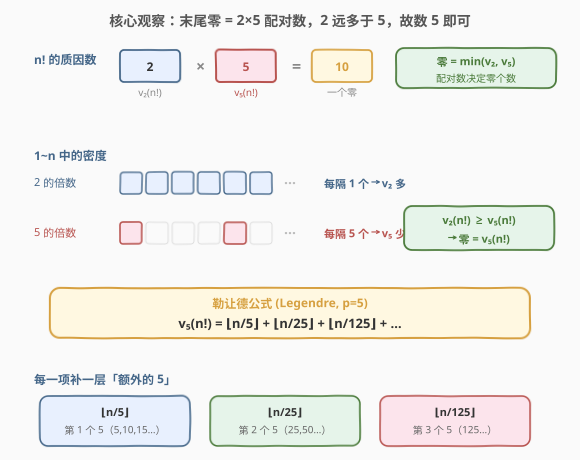
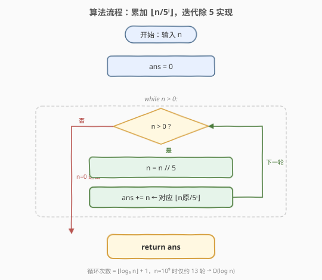
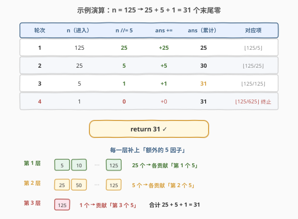

# 阶乘后的零

- **题目名称**：阶乘后的零
- **链接**：[172. 阶乘后的零](https://leetcode.cn/problems/factorial-trailing-zeroes/)
- **难度**：中等
- **标签**：数学、数论

## 1. 题目概述

给定一个整数 `n`，返回 `n!`（阶乘）结果中**末尾零的数量**（即从最低位起连续的 0 的个数）。

> 💡 `n! = 1 × 2 × 3 × … × n`。约定 `0! = 1`。

**示例 1**：

```text
输入：n = 3
输出：0
解释：3! = 6，末尾没有零。
```

**示例 2**：

```text
输入：n = 5
输出：1
解释：5! = 120，末尾有一个零。
```

**示例 3**：

```text
输入：n = 0
输出：0
解释：0! = 1，末尾没有零。
```

**约束条件**：

- $0 \le n \le 10^9$

> ⚠️ **进阶要求**：能否在对数时间复杂度内解决？直接计算 `n!` 是不可行的——当 $n = 10^9$ 时，$n!$ 约有 $8.5 \times 10^9$ 位十进制数字，任何标准整数类型都装不下，即便用 Python 大整数逐位相乘也远超时间限制。必须从**数论结构**切入，绕开 `n!` 本身。

---

## 2. 解题思路

### 2.1 暴力思路：算出 n! 再数零？

最直白的做法：先算出 `n!`，再不断 `% 10` 数末尾零。这条路上有两个致命障碍：

1. **溢出**：`n!` 增长极快，`20! = 2432902008176640000` 已逼近 64 位无符号上界，`21!` 直接溢出 `unsigned long long`。对 $n \le 10^9$ 完全无望。
2. **太慢**：即便用 Python 任意精度整数，计算 $10^9$ 的阶乘需要 $O(n)$ 次大数乘法，每次乘法本身又是 $O(\text{位数})$，总复杂度约 $O(n^2 \log n)$，远超时限。

> 💡 暴力法的失败提示我们：**不要构造 `n!`，而要直接数「产生零的因子」**。零的个数由因子 $10$ 的个数决定，而 $10 = 2 \times 5$——这就把问题从「算阶乘」转化为「数质因子」。

### 2.2 核心观察：零 = 2×5 配对数，瓶颈在 5



**末尾零的本质**：一个末尾零对应 `n!` 的质因数分解中**一对** $(2, 5)$。因此末尾零的数量等于

$$\text{zeros}(n) = \min\bigl(v_2(n!),\ v_5(n!)\bigr)$$

其中 $v_p(n!)$ 表示 $n!$ 中质数 $p$ 的指数（即 $p$ 作为因子出现的总次数）。

**关键洞察——5 是瓶颈**：在 $1 \sim n$ 中，**偶数的密度远高于 5 的倍数**，因此 $v_2(n!) \ge v_5(n!)$ 恒成立。直观地说：

- 每隔一个数就贡献一个 $2$（$2, 4, 6, 8, \dots$）；
- 每隔五个数才贡献一个 $5$（$5, 10, 15, 20, \dots$）。

更严格地，对任意 $i \ge 1$ 都有 $\lfloor n/2^i \rfloor \ge \lfloor n/5^i \rfloor$，求和后 $v_2(n!) \ge v_5(n!)$。于是

$$\text{zeros}(n) = v_5(n!) = \sum_{i=1}^{\infty} \left\lfloor \frac{n}{5^i} \right\rfloor = \left\lfloor\frac{n}{5}\right\rfloor + \left\lfloor\frac{n}{25}\right\rfloor + \left\lfloor\frac{n}{125}\right\rfloor + \cdots$$

这正是数论中**勒让德公式（Legendre's formula）**在 $p=5$ 时的特例。该和式在 $5^i > n$ 时项变为 $0$，自然终止，至多 $\log_5 n$ 项。

> 💡 **为什么求和而不是只取 $\lfloor n/5 \rfloor$？** 因为 $25 = 5^2$ 这类数**贡献多个 5**：$25$ 贡献 $2$ 个、$125$ 贡献 $3$ 个……$\lfloor n/5 \rfloor$ 只数了「第一个 5」，$\lfloor n/25 \rfloor$ 补上「第二个 5」，$\lfloor n/125 \rfloor$ 补上「第三个 5」，依此类推。每一项恰好对应一层「额外」的 5 因子，加起来才完整。

> ⚠️ **配对而非单数**：末尾零取决于 $2$ 与 $5$ 的**配对数**，不是单独的 $5$ 的个数。只是因为 $2$ 总是过剩，配对数被 $5$ 卡住，才简化成「数 5」。若题目改成「三进制下的末尾零」，瓶颈就换成 $3$ 了——这套思路可迁移到任意进制。

### 2.3 算法流程图



流程极简——**无分支判断**（除循环终止外）：

1. 初始化 `ans = 0`。
2. 当 `n > 0`：执行 `n //= 5`，再 `ans += n`。
3. 返回 `ans`。

> 💡 **`n //= 5; ans += n` 的巧妙之处**：每次把 `n` 除以 $5$ 后，新的 `n` 恰好就是 $\lfloor n_{\text{原}} / 5^i \rfloor$（第 $i$ 轮对应第 $i$ 项）。于是**无需显式维护幂 $5^i$**，靠 `n` 自身的迭代就顺次吐出和式的每一项——既避免了 `power *= 5` 可能的整数溢出（C++ 中 $5^{14} > 2^{31}$），也省去一个变量。这与 [171. Excel表列序号](../0101-0200/171_Excel表列序号.md) 的 Horner 累乘加异曲同工：都是用「单变量递推」替代「显式位权」。

### 2.4 示例演算



以 `n = 125` 为例（它同时是 $5$、$25$、$125$ 的倍数，能完整展示三层贡献）：

| 轮次 | `n`（进入） | `n //= 5` | `ans +=` | `ans`（累计） | 对应和式项 | 含义 |
|------|------------|-----------|----------|--------------|-----------|------|
| 1 | 125 | 25 | 25 | 25 | $\lfloor 125/5 \rfloor = 25$ | $1\sim125$ 中 $25$ 个 $5$ 的倍数，各贡献「第 1 个 5」 |
| 2 | 25 | 5 | 5 | 30 | $\lfloor 125/25 \rfloor = 5$ | $25,50,75,100,125$ 共 $5$ 个 $25$ 的倍数，各贡献「第 2 个 5」 |
| 3 | 5 | 1 | 1 | 31 | $\lfloor 125/125 \rfloor = 1$ | $125$ 自身，贡献「第 3 个 5」 |
| 4 | 1 | 0 | 0 | 31 | $\lfloor 125/625 \rfloor = 0$ | $5^4 = 625 > 125$，项变 $0$，循环终止 |

返回 `31` ✓。验证：$125!$ 末尾确实有 $31$ 个零（$25 + 5 + 1 = 31$）。

> 💡 **观察「n 的演化」**：进入各轮的 `n` 依次是 $125 \to 25 \to 5 \to 1 \to 0$，正好是 $125 / 5^i$ 的序列。第 $4$ 轮 `n=1` 除以 $5$ 得 $0$，`ans += 0` 不改变结果，随后 `n=0` 退出——这一轮「空跑」是 `while n > 0` 写法的自然产物，无害但可被 `while n >= 5` 的写法省去（见第 5 节对照）。

再以 `n = 30` 快速验证（含一个 $25$，展示非幂情况）：

| 轮次 | `n` | `n //= 5` | `ans` | 含义 |
|------|-----|-----------|-------|------|
| 1 | 30 | 6 | 6 | $5,10,15,20,25,30$ 共 $6$ 个 $5$ 的倍数 |
| 2 | 6 | 1 | 7 | $25$ 贡献第 $2$ 个 $5$ |
| 3 | 1 | 0 | 7 | 终止 |

$30!$ 末尾 $7$ 个零 ✓。注意 $25$ 这一个数贡献了 $2$ 个 $5$，所以 $6$ 个 $5$ 的倍数却产生 $7$ 个 $5$——这正是「求和而非只数倍数」的原因。

---

## 3. 参考代码

### C++

```cpp
class Solution {
  public:
    int trailingZeroes(int n) {
        int ans = 0;
        while (n > 0) {
            n /= 5;
            ans += n;
        }
        return ans;
    }
};
```

### Python

```python
class Solution:
    def trailingZeroes(self, n: int) -> int:
        ans = 0
        while n > 0:
            n //= 5
            ans += n
        return ans
```

> 💡 两版逻辑完全一致，核心只有两行 `n //= 5; ans += n`。`n` 每轮除以 $5$ 后即等于 $\lfloor n_{\text{原}}/5^i \rfloor$，故 `ans += n` 累加的正是勒让德和式的第 $i$ 项。C++ 用 `int` 足够：`n` 单调递减且初值 $\le 10^9 < 2^{31}$，全程无溢出风险（详见第 4 节）。Python 整数任意精度，更无需担心。

---

## 4. 复杂度分析

| 维度 | 复杂度 | 说明 |
|------|--------|------|
| 时间复杂度 | $O(\log_5 n)$ | 每轮 `n` 缩为原来的 $1/5$，循环次数 $= \lfloor \log_5 n \rfloor + 1$。$n = 10^9$ 时仅约 $13$ 轮，满足进阶的对数时间要求 |
| 空间复杂度 | $O(1)$ | 仅 `ans`、`n` 两个变量，与输入规模无关 |

> ⚠️ **为何 C++ 用 `int` 不会溢出？** 题目保证 $n \le 10^9 < 2^{31}-1$，`n` 在循环中只做 `n /= 5`（单调递减），`ans` 的上界为 $\frac{n}{4} \approx 2.5 \times 10^8 < 2^{31}-1$（因为 $\sum_{i\ge1} n/5^i = n/4$）。故 `int` 完全够用，无需 `long long`。这与 [166. 分数到小数](../0101-0200/166_分数到小数.md) 因 `INT_MIN` 取绝对值溢出而必须升 `long long` 的情况不同——本题没有「放大」运算。

> 💡 **对数时间的本质**：之所以能做到 $O(\log n)$，是因为我们**没有遍历 $1 \sim n$ 的每个数**，而是直接用勒让德公式按 $5$ 的幂次「分层」计数。每层用一次整除 $O(1)$，层数 $\log_5 n$。对比暴力「数每个数的因子 5」需 $O(n \log_5 n)$，这是数论带来的指数级降维。

---

## 5. 扩展：等价写法与 793 逆问题

### 5.1 两种等价写法对照

勒让德和式 $\sum \lfloor n/5^i \rfloor$ 有两种常见实现，本质完全相同：

```python
# 写法 A：迭代除 n（推荐，无溢出、变量少）
def trailingZeroes(n):
    ans = 0
    while n > 0:
        n //= 5
        ans += n
    return ans

# 写法 B：显式维护幂 power
def trailingZeroes(n):
    ans = 0
    power = 5
    while power <= n:
        ans += n // power
        power *= 5
    return ans
```

| 维度 | 写法 A（迭代除 n） | 写法 B（显式幂） |
|------|-------------------|-----------------|
| 变量 | `ans, n` | `ans, power` |
| 终止条件 | `n == 0` | `power > n` |
| 溢出风险 | 无（`n` 只减不增） | C++ 中 `power *= 5` 在 $5^{14} = 6103515625 > 2^{32}$ 时溢出 `int`，需用 `long long` |
| 直观性 | 略隐（靠「n 即 $\lfloor n/5^i \rfloor$」的洞察） | 直白对应和式 |
| 多余轮次 | 末尾多一轮 `ans += 0`（无害） | 无 |

面试推荐写法 A：**更短、无溢出、更显「洞察」**。但能讲清写法 B 的「逐项对应」更说明你理解了勒让德公式本身。

### 5.2 逆问题：793. 阶乘函数后 K 个零

[793. 阶乘函数后 K 个零](https://leetcode.cn/problems/preimage-size-of-factorial-zeroes-function/) 是本题的直接进阶：给定 $k$，问有多少个 $n$ 使得 `trailingZeroes(n) == k`？

关键观察：`trailingZeroes(n)` 关于 $n$ **单调不减**（$n$ 越大，$5$ 的因子越多）。于是可用**二分查找**定位使得 `trailingZeroes(n) == k` 的 $n$ 区间，而区间长度恰为 $5$（或 $0$）——因为每跨过 $5$ 的倍数，零的个数才可能增加。本题的计数函数正是 793 的**单调判定器**，两题合看才能完整理解「阶乘末尾零」这个数论对象的正逆两个方向。

---

## 6. 面试要点

1. **为什么数 5 的个数，而不是数 2？**

   > 末尾零由 $10 = 2 \times 5$ 的配对数决定，即 $\min(v_2(n!), v_5(n!))$。在 $1 \sim n$ 中 $2$ 的倍数远比 $5$ 的倍数密集（每隔一个数就有一个 $2$，每隔五个数才有一个 $5$），对任意 $i$ 都有 $\lfloor n/2^i \rfloor \ge \lfloor n/5^i \rfloor$，求和得 $v_2(n!) \ge v_5(n!)$。故配对数被 $5$ 卡住，简化为「数 $5$」。一句话：**2 总是过剩，5 才是瓶颈**。

2. **为什么不能只取 $\lfloor n/5 \rfloor$，还要加 $\lfloor n/25 \rfloor$、$\lfloor n/125 \rfloor$？**

   > 因为 $25=5^2$ 这类数贡献多个 $5$：$25$ 贡献 $2$ 个、$125$ 贡献 $3$ 个。$\lfloor n/5 \rfloor$ 只数了每个 $5$ 的倍数的「第一个 $5$」，漏掉了 $25$ 的倍数里的「第二个 $5$」、$125$ 的倍数里的「第三个 $5$」……每一项 $\lfloor n/5^i \rfloor$ 恰好补上「第 $i$ 层」的额外 $5$，全部加起来才完整。这正是勒让德公式 $v_p(n!) = \sum_{i\ge1} \lfloor n/p^i \rfloor$ 的含义。

3. **为什么 `n //= 5; ans += n` 能正确累加和式？**

   > 每轮把 `n` 除以 $5$ 后，新的 `n` 恰好等于 $\lfloor n_{\text{原始}} / 5^i \rfloor$（第 $i$ 轮对应第 $i$ 项）。所以 `ans += n` 累加的就是勒让德和式的第 $i$ 项，无需显式维护 $5^i$。这种「用变量自身迭代吐出位权序列」的技巧与 Horner 累乘加异曲同工——都是用单变量递推替代显式幂计算，既省变量又避免 `power *= 5` 的潜在溢出。

4. **时间复杂度是多少？为什么是对数级？**

   > $O(\log_5 n)$。每轮 `n` 缩为原来的 $1/5$，循环次数约 $\log_5 n$；$n = 10^9$ 时仅约 $13$ 轮。之所以是对数而非线性，是因为我们没有遍历 $1 \sim n$ 的每个数，而是按 $5$ 的幂次「分层」计数——每层一次整除 $O(1)$，层数 $\log_5 n$。这是数论结构带来的降维。

5. **为什么不直接算 `n!` 再数零？**

   > 两个原因：① **溢出**——$n!$ 增长极快，$21!$ 就溢出 64 位无符号整数，$n \le 10^9$ 时 $n!$ 有约 $8.5 \times 10^9$ 位，任何标准类型都装不下；② **太慢**——即便用 Python 大整数，计算 $10^9$ 的阶乘需 $O(n)$ 次大数乘法，总复杂度约 $O(n^2 \log n)$，远超时限。必须从「数因子」而非「构造阶乘」切入。

6. **如果题目改成「三进制下末尾零的数量」，怎么处理？**

   > 三进制下末尾零对应因子 $3$ 的个数，即 $v_3(n!)$。把本题的 $5$ 全部换成 $3$ 即可：`while n > 0: n //= 3; ans += n`。末尾零的个数 $= \min(v_3(n!), \text{其它因子})$，通常 $3$ 是瓶颈（取决于进制基数的质因数）。这体现了思路的**进制可迁移性**——勒让德公式对任意质数 $p$ 都成立。

> 💡 **一句话总结**：172 是勒让德公式 $v_5(n!) = \sum \lfloor n/5^i \rfloor$ 的直接应用——末尾零由 $2\times5$ 配对数决定，$2$ 恒过剩故数 $5$，用 `n //= 5; ans += n` 迭代累加至 $n=0$，$O(\log n)$ 时间 $O(1)$ 空间搞定。核心洞察是「$n$ 自身的除法序列即和式各项」，把显式幂计算折叠进了单变量递推。

---

## 7. 同类练习题

- [793. 阶乘函数后 K 个零](https://leetcode.cn/problems/preimage-size-of-factorial-zeroes-function/)：本题的逆问题——给定零的个数 $k$，求有多少个 $n$。利用 `trailingZeroes` 的单调性做二分查找，把本题的计数器变成判定器
- [204. 计数质数](https://leetcode.cn/problems/count-primes/)（[题解](../0201-0300/204_计数质数.md)）：同为数论计数题，用埃氏筛枚举 $\le n$ 的质数；两题都依赖「质数性质」做高效计数，可对比「筛法枚举」与「勒让德公式闭合求和」两种数论套路
- [50. Pow(x, n)](https://leetcode.cn/problems/powx-n/)（[题解](../0001-0100/50_Powx_n.md)）：快速幂计算 $x^n$。本题累加 $\lfloor n/5^i \rfloor$ 时 $5^i$ 增长是核心，对照「显式维护幂」写法与快速幂的「折半翻倍」思想
- [233. 数字 1 的个数](https://leetcode.cn/problems/number-of-digit-one/)：按位值分解统计 $[1,n]$ 中数字 $1$ 出现的总次数，同为「按位/按幂分层累加」的数论计数题，可对比「$5$ 进制位权」与「$10$ 进制位权」两套分解
