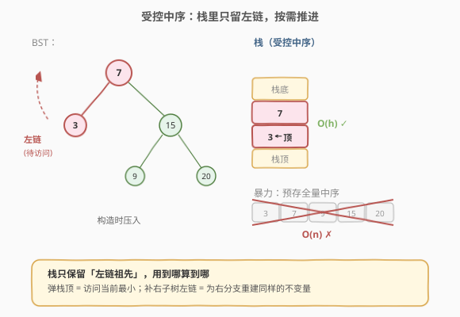
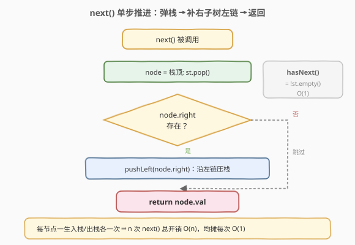
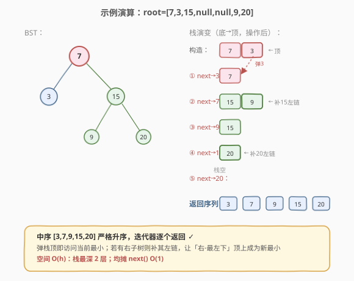

# 二叉搜索树迭代器

- **题目名称**：二叉搜索树迭代器
- **链接**：[173. 二叉搜索树迭代器](https://leetcode.cn/problems/binary-search-tree-iterator/)
- **难度**：中等
- **标签**：树、BST、栈、设计、中序遍历

## 1. 题目概述

实现一个**二叉搜索树（BST）迭代器**类 `BSTIterator`，按**升序**逐个访问 BST 中的节点。要求：

- `BSTIterator(TreeNode root)`：用 BST 的根节点初始化迭代器。指针应位于一个**不存在的虚拟节点**上，调用 `next()` 才会移动到 BST 中第一个（最小）节点。
- `int next()`：将指针向右移动一次，返回指针所指节点的值。
- `bool hasNext()`：若指针向右移动后仍存在节点，返回 `true`，否则返回 `false`。

> 💡 直白理解：迭代器要能像「遍历一个升序数组」那样，每次 `next()` 吐出下一个最小值。BST 的中序遍历正是升序，所以本质是**把中序遍历拆成可控的单步推进**。

**示例**：

```text
输入
["BSTIterator", "next", "next", "hasNext", "next", "hasNext", "next", "hasNext", "next", "hasNext"]
[[[7, 3, 15, null, null, 9, 20]], [], [], [], [], [], [], [], [], []]
输出
[null, 3, 7, true, 9, true, 15, true, 20, false]

解释
BSTIterator bSTIterator = new BSTIterator([7, 3, 15, null, null, 9, 20]);
bSTIterator.next();    // 返回 3
bSTIterator.next();    // 返回 7
bSTIterator.hasNext(); // 返回 True
bSTIterator.next();    // 返回 9
bSTIterator.hasNext(); // 返回 True
bSTIterator.next();    // 返回 15
bSTIterator.hasNext(); // 返回 True
bSTIterator.next();    // 返回 20
bSTIterator.hasNext(); // 返回 False
```

**约束条件**：

- 树中节点数在范围 `[1, 10^5]` 内
- `0 <= Node.val <= 10^6`
- 最多调用 `10^5` 次 `next` 和 `hasNext` 操作
- **进阶**：`next()` 和 `hasNext()` 能否均摊 $O(1)$ 时间复杂度，且使用 $O(h)$ 内存（$h$ 为树高）？

> ⚠️ 这里的进阶要求是本题的灵魂：不能预先把整个中序序列存进数组（那是 $O(n)$ 内存），必须**边遍历边推进**，只保留从根到当前节点路径上的节点，即 $O(h)$ 栈空间。

---

## 2. 解题思路

### 2.1 暴力思路：预存中序数组

构造时做一次完整中序遍历，把所有值存入数组 `arr`，用一个下标 `idx` 记录当前位置。`next()` 返回 `arr[idx++]`，`hasNext()` 判断 `idx < arr.size()`。

简单直接，`next()`/`hasNext()` 都是 $O(1)$，但**内存 $O(n)$**，不满足进阶的 $O(h)$ 要求。当 $n = 10^5$ 时数组开销明显，且如果树后续被修改，预存数组会失效。

### 2.2 核心观察：受控中序 + 栈 = 延迟求值



关键想法：**把一次完整的中序遍历拆解成「单步」**，每调一次 `next()` 只走中序的一步。用显式栈模拟递归，栈中始终保存「待访问节点 + 它们的左祖先链」。

回顾迭代中序的骨架（如 [230. 二叉搜索树中第K小的元素](../0201-0300/230_二叉搜索树中第K小的元素.md)）：外层 `while (cur || !st.empty())`，内层「一路向左压栈」，弹栈即访问根，再转向右子树。**BSTIterator 把这段循环切成两半**：

- **初始化**：把根节点的**整条左链**压栈（内层 `while (cur)`）。
- **`next()`**：弹栈顶（即当前最小），得到返回值；若它有右子树，则把**右子树的整条左链**压栈（相当于「访问根后转向右，并继续向左压栈」）。
- **`hasNext()`**：栈非空即为 `true`。

> 💡 **为什么栈顶总是当前最小？** 因为栈里存的永远是「尚未访问、且左子树已全部访问完」的节点，栈顶是其中**最靠左下**的那个——也就是 BST 中尚未访问的最小值。每次弹出栈顶并补入其右子树的左链，恰好对应中序「左→根→右」的一步推进。

> ⚠️ **核心不变量**：任意时刻，栈中节点从底到顶构成一条「祖先链」，且每个节点的左子树要么已访问完，要么正在栈的更上方。弹栈顶 = 访问该节点；补右子树左链 = 为「右」分支建立同样的不变量。这保证了每次 `next()` 都精确返回中序的下一个值。

### 2.3 算法流程图



**`next()` 步骤**：

1. 弹出栈顶节点 `node`（它就是当前最小，左子树已处理完）。
2. 令 `cur = node.right`，沿其左链一路压栈：`while (cur) { push(cur); cur = cur.left; }`。
3. 返回 `node.val`。

**`hasNext()`**：直接返回 `!st.empty()`（构造时已压栈，只要树非空，初始栈就不空）。

**构造函数**：`cur = root`，执行同样的「一路向左压栈」。

### 2.4 示例演算

以示例中的 `root = [7,3,15,null,null,9,20]` 为例，BST 结构为：

- 7 是根，左孩子 3，右孩子 15；15 的左孩子 9，右孩子 20。



| 调用 | 动作 | 栈（底→顶，操作后） | 返回 |
|------|------|----------------------|------|
| 构造 | 从 7 向左压栈 | [7, 3] | — |
| next() ① | 弹 3；3 无右子树 | [7] | 3 |
| next() ② | 弹 7；补右子树 15 的左链 → [7→15, 15→9] | [15, 9] | 7 |
| hasNext() | 栈非空 | [15, 9] | true |
| next() ③ | 弹 9；9 无右子树 | [15] | 9 |
| hasNext() | 栈非空 | [15] | true |
| next() ④ | 弹 15；补右子树 20 的左链 → [20] | [20] | 15 |
| hasNext() | 栈非空 | [20] | true |
| next() ⑤ | 弹 20；20 无右子树 | [] | 20 |
| hasNext() | 栈空 | [] | false |

返回序列 `3, 7, 9, 15, 20`，恰为 BST 中序升序，验证正确。

---

## 3. 参考代码

### C++

```cpp
class BSTIterator {
    stack<TreeNode*> st;

    void pushLeft(TreeNode* node) {
        while (node) {                 // 一路向左压栈
            st.push(node);
            node = node->left;
        }
    }
  public:
    BSTIterator(TreeNode* root) {
        pushLeft(root);                // 构造：压根的整条左链
    }

    int next() {
        TreeNode* node = st.top();
        st.pop();                      // 弹栈顶 = 访问当前最小
        if (node->right) {
            pushLeft(node->right);     // 补右子树的左链
        }
        return node->val;
    }

    bool hasNext() {
        return !st.empty();
    }
};
```

### Python

```python
class BSTIterator:
    def __init__(self, root: Optional[TreeNode]):
        self.stack = []
        self._push_left(root)          # 构造：压根的整条左链

    def _push_left(self, node: Optional[TreeNode]) -> None:
        while node:                    # 一路向左压栈
            self.stack.append(node)
            node = node.left

    def next(self) -> int:
        node = self.stack.pop()        # 弹栈顶 = 访问当前最小
        if node.right:
            self._push_left(node.right)  # 补右子树的左链
        return node.val

    def hasNext(self) -> bool:
        return len(self.stack) > 0
```

> ⚠️ **易错点**：
> - 构造函数里**必须**先压一次左链，否则第一次 `next()` 会弹空栈。`hasNext()` 在构造后立即可用就靠这一步。
> - `next()` 弹出节点后，只补**右子树**的左链，不要把当前节点再压回去——它已经「访问」过了。
> - `_push_left` 处理 `node` 为 `nullptr`/`None` 的情况（用 `while node` 守卫），所以 `next()` 里即便 `node->right` 存在才调用也是安全的，写成 `if node.right: pushLeft(node.right)` 更清晰。

---

## 4. 复杂度分析

| 维度 | 复杂度 | 说明 |
|------|--------|------|
| 时间：`hasNext()` | $O(1)$ | 仅判断栈是否为空 |
| 时间：`next()` | **均摊 $O(1)$** | 单次 `next()` 若补左链可能压多个节点，但整棵树每个节点**恰好入栈、出栈各一次**，故 $n$ 次 `next()` 总压栈/弹栈次数为 $O(n)$，均摊到每次 $O(1)$ |
| 空间 | $O(h)$ | 栈深度等于从根到当前节点的路径长，最坏 $O(n)$（链状），平衡时 $O(\log n)$；满足进阶的 $O(h)$ 内存要求 |

> 💡 **均摊分析**：每个节点只在 `pushLeft` 中入栈一次、在 `next()` 中出栈一次。$n$ 次 `next()` 总共的压栈次数 $\leq n$，所以平均每次 `next()` 的压栈次数 $\leq 1$，加上固定的 1 次弹栈，均摊 $O(1)$。这正是「进阶要求」的答案。

---

## 5. 扩展：双向迭代器与前驱后继

**前驱/后继迭代器**：若要支持 `prev()`（回退到上一个），单向栈不够，需额外维护已访问节点列表或用**父指针 + Morris 思路**。一个实用做法是同时维护一个「已访问值数组」记录走过的中序序列，`prev()` 取末尾，空间升为 $O(n)$。

**带 `before`/`after` 的双向迭代器**（如某些面试变体）：在节点中维护 `parent` 指针，配合中序前驱/后继规则可在 $O(h)$ 时间内双向移动，仍保持 $O(h)$ 额外空间。

**频繁修改的 BST**：若树会动态插入/删除且仍需迭代，可用**线索化（Morris）**或在节点中维护子树大小，但实现复杂度大幅上升，超出本题范围。

---

## 6. 面试要点

1. **为什么栈顶总是当前未访问的最小值？**
   - 栈中保存的是「左子树已处理完、自身待访问」的节点，栈顶是最靠左下的那个。BST 的「左 < 根 < 右」性质保证最左下即最小；弹栈后补右子树左链，相当于把「右子树的最左下」顶上来，仍是新的最小。

2. **`next()` 为什么均摊 $O(1)$？**
   - 聚合分析：每个节点一生只入栈一次、出栈一次。$n$ 次 `next()` 触发的总压栈次数 $\leq n$，总弹栈次数 $= n$。把总开销 $O(n)$ 摊到 $n$ 次 `next()` 上，每次均摊 $O(1)$。单次最坏（补一条长左链）虽可能 $O(h)$，但不会连续发生。

3. **空间为什么是 $O(h)$ 而非 $O(n)$？**
   - 栈里只存「从根到当前节点路径」上的祖先链，长度等于树高 $h$。预存中序数组的做法要 $O(n)$，而受控遍历「用到哪算到哪」，所以是 $O(h)$。链状树 $h = n$ 退化为 $O(n)$，平衡树 $h = O(\log n)$。

4. **如何改造为「第 k 大」「降序迭代」？**
   - 改成「右-根-左」的**逆中序**：构造时一路向**右**压栈，`next()` 弹栈顶后补**左子树的右链**。这样栈顶是当前最大，逐次 `next()` 得到降序序列。本质是把 `left`/`right` 全部对调。

5. **`hasNext()` 在构造后立即调用一定为 `true` 吗？**
   - 题目约束树至少 1 个节点，构造时 `pushLeft(root)` 必压入 root，所以首次 `hasNext()` 必为 `true`。当所有节点访问完，栈空，`hasNext()` 返回 `false`，符合预期。

---

## 7. 同类练习题

- [230. 二叉搜索树中第K小的元素](https://leetcode.cn/problems/kth-smallest-element-in-a-bst/)（[题解](../0201-0300/230_二叉搜索树中第K小的元素.md)）：同一套「迭代中序 + 栈」模板，`next()` 调 k 次即第 k 小，对比「单步推进」与「计数终止」
- [94. 二叉树的中序遍历](https://leetcode.cn/problems/binary-tree-inorder-traversal/)：迭代中序的基础模板，理解「一路向左压栈 + 弹栈转右」的骨架
- [285. 二叉搜索树中的中序后继](https://leetcode.cn/problems/inorder-successor-in-bst/)：找给定节点的中序下一个，即迭代器的「单步 `next()`」特化版
- [1586. 二叉搜索树迭代器 II](https://leetcode.cn/problems/binary-search-tree-iterator-ii/)：本题升级版，额外要求支持 `prev()` 和 `hasPrev()`，需在栈基础上维护已访问序列
- [270. 最接近的二叉搜索树值](https://leetcode.cn/problems/closest-binary-search-tree-value/)：用受控中序边遍历边比较，可提前终止，体会「迭代器式」的惰性求值优势
