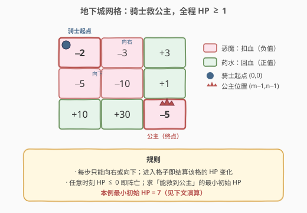
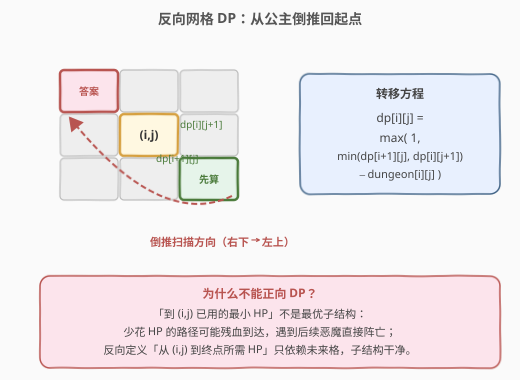
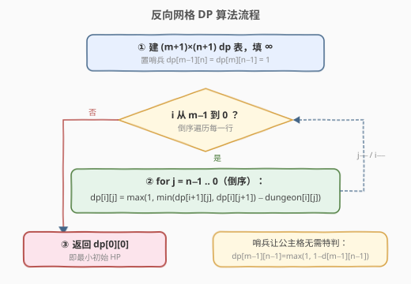
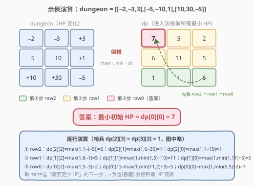

# 地下城游戏

- **题目名称**：地下城游戏
- **链接**：[174. 地下城游戏](https://leetcode.cn/problems/dungeon-game/)
- **难度**：困难
- **标签**：数组、动态规划、网格 DP、反向 DP

## 1. 题目概述

给定一个 $m \times n$ 的网格 `dungeon`，骑士从左上角 `(0,0)` 出发去右下角 `(m-1,n-1)` 解救公主。每一步只能**向右**或**向下**移动。每个格子的值 `dungeon[i][j]` 表示该格的事件：

- **负值**为恶魔，进入该格时骑士损失相应生命值；
- **非负值**为药水，进入该格时骑士恢复相应生命值。

骑士的初始生命值是一个**正整数**，且**任意时刻生命值 $\leq 0$ 即阵亡**。进入格子时立即结算该格事件（包括起点和终点）。求**能保证救到公主的最小初始生命值**。

> ⚠️ 是「存在某条路径能活到终点」所需的最小初始 HP，骑士可以**选择最优路径**。不是求所有路径都存活的下界。

**示例 1**：

```text
输入：dungeon = [[-2,-3,3],[-5,-10,1],[10,30,-5]]
输出：7
解释：初始 HP = 7 时，走 (0,0)→(1,0)→(2,0)→(2,1)→(2,2)：
      7 −2 −5 +10 +30 −5 = 35，全程 HP 恒 ≥ 1，存活救到公主。
      若初始 HP = 6，起手 6−2=4、4−5=−1 ≤0 即在 (1,0) 阵亡。
```

**示例 2**：

```text
输入：dungeon = [[0]]
输出：1
```

**约束条件**：

- $m = \text{dungeon.length}$
- $n = \text{dungeon}[i].\text{length}$
- $1 \leq m, n \leq 200$
- $-1000 \leq \text{dungeon}[i][j] \leq 1000$

> 💡 本题是 [64. 最小路径和](../0001-0100/64_最小路径和.md) 与 [120. 三角形最小路径和](120_三角形最小路径和.md) 的「反向版」：同样是「只能右/下」的网格 DP，但状态要定义成「**从当前格走到终点**所需的最小 HP」而非「从起点走到当前格的累计量」——这是本题最关键、也最反直觉的一步。

---

## 2. 解题思路

### 2.1 暴力思路

从 `(0,0)` 出发 DFS 枚举所有「向右/向下」的走法，对每条路径模拟：给定初始 HP，沿路径结算各格事件，检查全程 HP 是否 $\geq 1$；再二分或线性扫描「最小的可行初始 HP」。路径数约 $\binom{m+n-2}{m-1}$，$m=n=200$ 时直接指数爆炸。

> 💡 暴力会大量重复计算「从 `(i,j)` 走到终点的最优结果」，这正是**重叠子问题**信号 → 上 DP。但 DP 的方向选错会直接失败（见 2.2）。

### 2.2 核心观察：为什么必须反向——状态定义决定子结构



第一直觉是照搬 64 题：设 $f[i][j]$ 为「从 `(0,0)` 走到 `(i,j)` 所用的最小初始 HP」，由 $f[i-1][j]$、$f[i][j-1]$ 转移。**但这套正向定义没有最优子结构**：

- 「以更少初始 HP 到达 `(i,j)`」的路径，可能残血到达（HP=1），后续遇到大恶魔直接阵亡；
- 「多花一点初始 HP」的路径，可能满血到达（HP=100），后续轻松通关。

也就是说，到 `(i,j)` 的「历史」不能只用「最小初始 HP」一个量概括——**它还依赖当前剩余 HP**，状态不闭合，正向 DP 失败。



**破局点**：把状态反过来定义——设 $dp[i][j]$ 为「**站在 `(i,j)` 进入该格前**所需的最小 HP，使得从此格出发能活到终点」。这样：

- $dp[i][j]$ 只依赖**未来**两格 $dp[i+1][j]$（向下走）与 $dp[i][j+1]$（向右走）；
- 未来格已经把「后面所有恶魔/药水」都吸收进去了，所以当前格只需关心「进入本格后剩 HP 是否够踏出下一步」——**最优子结构成立**，方向天然是从右下到左上。

**转移推导**：进入 `(i,j)` 时 HP 为 $hp$，结算本格后剩 $hp + d[i][j]$。这个余量必须满足两条：

1. **能踏出下一步**：$\geq$ 下一步所需的进入 HP，即 $\geq \min(dp[i+1][j],\ dp[i][j+1])$；
2. **本格结算后仍存活**：$\geq 1$。

由于 $dp$ 值本身恒 $\geq 1$，第 1 条已蕴含第 2 条，故只需：

$$
hp + d[i][j] \geq \min(dp[i+1][j],\ dp[i][j+1]) \;\Longrightarrow\; hp \geq \min(dp[i+1][j],\ dp[i][j+1]) - d[i][j]
$$

再叠加「HP 自身必须 $\geq 1$」，取下界即得：

$$
dp[i][j] = \max\bigl(1,\ \min(dp[i+1][j],\ dp[i][j+1]) - d[i][j]\bigr)
$$

> 💡 **两个反直觉点**：① 方向倒过来——从**终点**往**起点**算；② 取 `min` 而非 `max`——下一步选「**需要更少 HP**」的方向更省（因为当前格只需补足到那个更低的门槛）。负值（恶魔）会把所需 HP 顶高，正值（药水）会把它压低，但 `max(1, …)` 保证「至少 1 点血」。

> ⚠️ **公主格的边界**：终点 `(m-1,n-1)` 没有「下一步」，只需本格结算后存活，即 $\min(\text{下一步})$ 退化为 $1$。为避免特判，常用**哨兵**：把 $dp$ 扩成 $(m+1)\times(n+1)$，全部填 $\infty$，再令 $dp[m-1][n] = dp[m][n-1] = 1$。于是公主格走 `min(dp[m][n-1]=1, dp[m-1][n]=1) - d[m-1][n-1]`，公式全局统一，**零边界特判**。

### 2.3 算法流程图



主流程：

1. 建 $(m+1)\times(n+1)$ 的 $dp$ 表，全部初始化为 $\infty$；置哨兵 $dp[m-1][n] = dp[m][n-1] = 1$。
2. 行下标 $i$ 从 $m-1$ **倒序**到 $0$：
   - 列下标 $j$ 从 $n-1$ **倒序**到 $0$：
     - $dp[i][j] = \max(1,\ \min(dp[i+1][j],\ dp[i][j+1]) - \text{dungeon}[i][j])$
3. 返回 $dp[0][0]$。

> ⚠️ **扫描顺序**：行、列都**倒序**（从右下向左上）。因为 $dp[i][j]$ 依赖「下一行同列」与「本行右列」，二者都必须先于本格算好——倒序行保证下一行已就绪，倒序列保证本行右邻已就绪。若列正序则会先覆盖右邻读到错误值。

### 2.4 示例演算

以 `dungeon = [[-2,-3,3],[-5,-10,1],[10,30,-5]]` 为例，反向填表（哨兵 $dp[2][3]=dp[3][2]=1$，图中略）：



最终 $dp$ 表（进入各格前所需最小 HP）：

| 格子 (i,j) | 计算 | dp[i][j] |
|------------|------|----------|
| (2,2) 公主 | max(1, min(1,1) − (−5)) | 6 |
| (2,1) | max(1, min(∞, 6) − 30) | 1 |
| (2,0) | max(1, min(∞, 1) − 10) | 1 |
| (1,2) | max(1, min(6, ∞) − 1) | 5 |
| (1,1) | max(1, min(1, 5) − (−10)) | 11 |
| (1,0) | max(1, min(1, 11) − (−5)) | 6 |
| (0,2) | max(1, min(5, ∞) − 3) | 2 |
| (0,1) | max(1, min(11, 2) − (−3)) | 5 |
| (0,0) 起点 | max(1, min(6, 5) − (−2)) | **7** |

最终 $dp[0][0] = 7$，即最小初始 HP。回溯最优路径 `(0,0)→(1,0)→(2,0)→(2,1)→(2,2)`：$7-2-5+10+30-5=35$，全程 HP 恒 $\geq 1$。

> 💡 注意 `(1,1)` 的 $dp=11$ 反而最高——因为它的右下两格一个是 $1$（需补到 1）、本格又是 $-10$ 大恶魔，要进入它得先攒够 $1+10=11$ 血。而绕道左下角 `(2,0)→(2,1)` 一路药水，所需 HP 更低，这正是反向 DP 自动「选最优路径」的体现。

---

## 3. 参考代码

### C++（二维 DP + 哨兵，推荐）

```cpp
class Solution {
  public:
    int calculateMinimumHP(vector<vector<int>>& dungeon) {
        int m = dungeon.size(), n = dungeon[0].size();
        // (m+1)×(n+1) 表，全部 ∞；哨兵让公主格无需特判
        vector<vector<int>> dp(m + 1, vector<int>(n + 1, INT_MAX));
        dp[m - 1][n] = dp[m][n - 1] = 1;

        for (int i = m - 1; i >= 0; --i) {
            for (int j = n - 1; j >= 0; --j) {
                int need = min(dp[i + 1][j], dp[i][j + 1]) - dungeon[i][j];
                dp[i][j] = max(1, need);          // HP 至少为 1
            }
        }
        return dp[0][0];
    }
};
```

### Python

```python
class Solution:
    def calculateMinimumHP(self, dungeon: List[List[int]]) -> int:
        m, n = len(dungeon), len(dungeon[0])
        dp = [[float('inf')] * (n + 1) for _ in range(m + 1)]
        dp[m - 1][n] = dp[m][n - 1] = 1            # 哨兵

        for i in range(m - 1, -1, -1):
            for j in range(n - 1, -1, -1):
                need = min(dp[i + 1][j], dp[i][j + 1]) - dungeon[i][j]
                dp[i][j] = max(1, need)            # HP 至少为 1
        return dp[0][0]
```

> 💡 **正确性要点**：`min(dp[i+1][j], dp[i][j+1])` 中虽可能含 $\infty$（哨兵），但真实格子的另一方向必有有限值，`min` 永不选中 $\infty$，故 `need` 不会溢出。$dp$ 值上界约 $1 + (\text{路径长})\times 1000 \leq 4\times10^5$，`int` 完全够用。

---

## 4. 复杂度分析

| 维度 | 复杂度 | 说明 |
|------|--------|------|
| 时间复杂度 | $O(m \cdot n)$ | 每个格子计算一次，共 $m \times n$ 格 |
| 空间复杂度（二维） | $O(m \cdot n)$ | 显式维护 $(m+1)\times(n+1)$ 的 $dp$ 表 |
| 空间复杂度（滚动） | $O(n)$ | 仅保留一行 $dp[j]$，见第 5 节 |

---

## 5. 扩展：一维滚动数组

每个 $dp[i][j]$ 只依赖**下一行同列** $dp[i+1][j]$ 与**本行右列** $dp[i][j+1]$。若把二维压成一维 `dp[j]`：

- 更新前 `dp[j]` 仍存**下一行第 j 列**（即「下方」）；
- `dp[j+1]` 在本轮已更新为**本行第 j+1 列**（即「右方」）。

故行列均倒序时，`dp[j] = max(1, min(dp[j], dp[j+1]) - dungeon[i][j])`。哨兵需稍作处理：公主列正下方的 `dp[m][n-1]=1` 用初值 `dp[n-1]=1` 表达；公主行右侧的 `dp[m-1][n]=1` 仅最后一行需要，其余行应为 $\infty$，故每行开头按需重置 `dp[n]`。

### C++（一维滚动，$O(n)$ 空间）

```cpp
class Solution {
  public:
    int calculateMinimumHP(vector<vector<int>>& dungeon) {
        int m = dungeon.size(), n = dungeon[0].size();
        vector<int> dp(n + 1, INT_MAX);
        dp[n - 1] = 1;                              // 下哨兵：公主正下方 dp[m][n-1]=1
        for (int i = m - 1; i >= 0; --i) {
            dp[n] = (i == m - 1) ? 1 : INT_MAX;     // 右哨兵：仅公主行 dp[m-1][n]=1
            for (int j = n - 1; j >= 0; --j) {
                dp[j] = max(1, min(dp[j], dp[j + 1]) - dungeon[i][j]);
            }
        }
        return dp[0];
    }
};
```

> 💡 **面试取舍**：二维 + 哨兵的版本最易讲清、不易写错，是**白板首选**；一维滚动作为「能否优化空间」的追问答案，知道哨兵处理方式即可。务必先讲清「为什么反向」再写代码，这是本题的真正考点。

---

## 6. 面试要点

1. **为什么正向 DP 不行？**

   - 正向状态「到 `(i,j)` 已用的最小初始 HP」不闭合：少花 HP 的路径可能残血到达，遇后续恶魔阵亡；多花 HP 的路径可能满血到达，后续更稳。即「历史最优」无法用单一标量概括，**最优子结构被破坏**。反向定义「从 `(i,j)` 到终点所需 HP」只依赖未来格，未来已吸收全部后续事件，子结构干净。

2. **转移里为什么取 `min` 而不是 `max`？**

   - $dp[i+1][j]$、$dp[i][j+1]$ 是「走该方向后，下一步所需的最小进入 HP」。当前格只需补足到**更低的那道门槛**即可存活（选更省的方向），故取 `min`。再减去本格事件 $d[i][j]$（恶魔为负、会抬高所需 HP），最后 `max(1, …)` 保证初始 HP 至少为 1。

3. **哨兵 `dp[m-1][n]=dp[m][n-1]=1` 的作用？**

   - 公主格 `(m-1,n-1)` 没有「下一步」，只需本格结算后存活，等价于「下一步所需 HP = 1」。哨兵把这一点融入通用公式，使公主格与普通格共用同一转移，**消除边界特判**。其余越界位置保持 $\infty$，表示「不能往那个方向走」，`min` 会自动避开。

4. **扫描顺序为什么行、列都倒序？**

   - $dp[i][j]$ 依赖「下一行同列」（需行倒序保证已算）与「本行右列」（需列倒序保证已算）。任一方向正序都会先覆盖依赖值、读到错误结果。这与 [64. 最小路径和](../0001-0100/64_最小路径和.md) 正向 DP「行正序、列正序」恰好对称——方向反过来，扫描顺序也反过来。

5. **和 [64. 最小路径和](../0001-0100/64_最小路径和.md) / [120. 三角形最小路径和](120_三角形最小路径和.md) 的异同？**

   - 三者都是「只能右/下」的网格 DP，共享无后效性。区别在于**状态方向**：64/120 求累计量和，状态「从起点到当前格」有最优子结构，正向算；本题求「存活所需 HP」，状态必须「从当前格到终点」反向算。120 的自底向上是为了消除边界特判，本题的反向则是**子结构成立的前提**——这是本题最值得记住的进阶点。

6. **如果允许向四个方向走，还能这么 DP 吗？**

   - 不能。四方向会形成环，无后效性被破坏，需改用最短路类算法（如带「最小初始 HP」约束的变形 Dijkstra / 二分 + BFS）。本题「只能右/下」是无环的保证。

---

## 7. 同类练习题

- [64. 最小路径和](https://leetcode.cn/problems/minimum-path-sum/)（[题解](../0001-0100/64_最小路径和.md)）：正向网格 DP 母题，对比「从起点累加」与「从终点倒推」的方向选择
- [120. 三角形最小路径和](https://leetcode.cn/problems/triangle/)（[题解](120_三角形最小路径和.md)）：自底向上网格 DP，同样用「反向」消除边界特判，思想同源
- [62. 不同路径](https://leetcode.cn/problems/unique-paths/)（[题解](../0001-0100/62_不同路径.md)）：网格 DP 计数版，巩固无后效性 + 最优子结构的判定
- [931. 下降路径最小和](https://leetcode.cn/problems/minimum-falling-path-sum/)：方形矩阵下降路径，三子取 min，网格 DP 的自然扩展
- [221. 最大正方形](https://leetcode.cn/problems/maximal-square/)（[题解](../0201-0300/221_最大正方形.md)）：二维 DP，对比不同状态定义下「右下角」与「左上角」的转移方向
