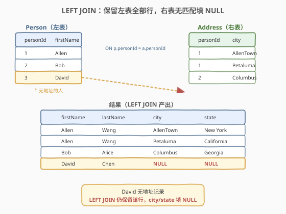
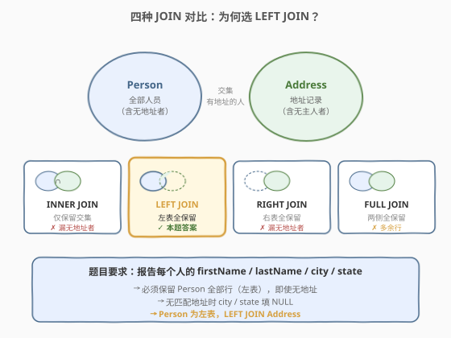
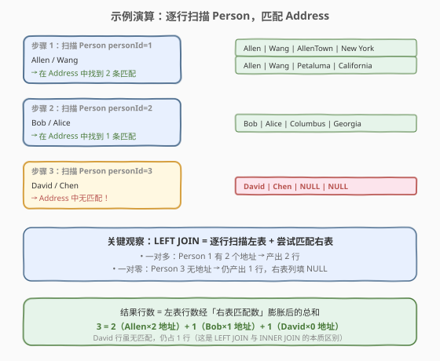

# 组合两个表

- **题目名称**：组合两个表
- **链接**：[175. 组合两个表](https://leetcode.cn/problems/combine-two-tables/)
- **难度**：简单
- **标签**：SQL、JOIN、数据库

## 1. 题目概述

给定两张表 `Person`（人员）和 `Address`（地址），要求编写 SQL 查询，报告**每个人的** `firstName`、`lastName`、`city`、`state`。如果某人在 `Address` 表中没有地址记录，则 `city` 和 `state` 报告为 `NULL`。

**表结构**：

```text
Table: Person
+-------------+---------+
| Column Name | Type    |
+-------------+---------+
| personId    | int     |  ← 主键
| lastName    | varchar |
| firstName   | varchar |
+-------------+---------+

Table: Address
+-------------+---------+
| Column Name | Type    |
+-------------+---------+
| addressId   | int     |  ← 主键
| personId    | int     |  ← 外键（指向 Person）
| city        | varchar |
| state       | varchar |
+-------------+---------+
```

> 💡 **关键约束**：`Address.personId` 是指向 `Person.personId` 的外键。一个人可能有**多条地址**，也可能**没有地址**。题目要求「无论有没有地址，每个人都要出现在结果中」——这决定了 JOIN 方向。

**示例 1**：

```text
输入：
Person 表:
+----------+----------+-----------+
| personId | lastName | firstName |
+----------+----------+-----------+
| 1        | Wang     | Allen     |
| 2        | Alice    | Bob       |
+----------+----------+-----------+

Address 表:
+-----------+----------+---------------+------------+
| addressId | personId | city          | state      |
+-----------+----------+---------------+------------+
| 1         | 1        | AllenTown     | New York   |
| 2         | 1        | Petaluma      | California |
| 3         | 2        | Columbus      | Georgia    |
+-----------+----------+---------------+------------+

输出:
+-----------+----------+---------------+----------+
| firstName | lastName | city          | state    |
+-----------+----------+---------------+----------+
| Allen     | Wang     | AllenTown     | New York |
| Allen     | Wang     | Petaluma      | California |
| Bob       | Alice    | Columbus      | Georgia  |
+-----------+----------+---------------+----------+
```

**示例 2**（展示无地址的情况）：

```text
输入：
Person 表:
+----------+----------+-----------+
| personId | lastName | firstName |
+----------+----------+-----------+
| 1        | Wang     | Allen     |
| 2        | Alice    | Bob       |
| 3        | Chen     | David     |  ← Address 中无 personId=3
+----------+----------+-----------+

Address 表:（同示例 1，无 personId=3 的记录）

输出:
+-----------+----------+---------------+----------+
| firstName | lastName | city          | state    |
+-----------+----------+---------------+----------+
| Allen     | Wang     | AllenTown     | New York |
| Allen     | Wang     | Petaluma      | California |
| Bob       | Alice    | Columbus      | Georgia  |
| David     | Chen     | null          | null     |  ← LEFT JOIN 保留
+-----------+----------+---------------+----------+
```

**约束条件**：

- `personId` 是 `Person` 表的主键，`addressId` 是 `Address` 表的主键
- 一个人可有多条地址，也可没有地址
- 结果可按任意顺序返回

---

## 2. 解题思路

### 2.1 暴力思路：子查询逐列填充

最直觉的写法是对每个输出列分别写子查询：

```sql
SELECT firstName,
       lastName,
       (SELECT city   FROM Address a WHERE a.personId = p.personId) AS city,
       (SELECT state  FROM Address a WHERE a.personId = p.personId) AS state
FROM Person p;
```

但这里有个致命问题：当一个人有**多条地址**时，子查询会报错（返回多行）。即便用 `LIMIT 1` 修正，也只能取到一条地址，**丢失其他地址行**——与题目期望的「一人多地址各占一行」不符。

> ⚠️ 根本问题在于：子查询是「**按列**关联」，而 JOIN 是「**按行**关联」。需要把行展开（一人多地址→多行）时，必须用 JOIN。

### 2.2 核心观察：LEFT JOIN 保留左表全部行



题目要求**报告每个人**的信息——这意味着 `Person` 表的全部行都必须出现在结果中，无论是否在 `Address` 表中有匹配。这正是 **LEFT JOIN**（左外连接）的语义：

- **LEFT JOIN**：以左表为基准，逐行去右表找匹配；找到则拼接，找不到则右表列填 `NULL`。
- 左表选 `Person`（因为「每个人都要出现」），右表选 `Address`。

> 💡 **如何判断用哪种 JOIN**：问自己一个问题——「哪张表的行必须全部保留？」答案就是左表，用 LEFT JOIN。本题是「每个人都要出现」，所以 `Person` 在左、`LEFT JOIN Address`。

**JOIN 方向选择**：为什么不是 `RIGHT JOIN`？虽然 `Address RIGHT JOIN Person` 等价，但 SQL 惯例是**从左到右阅读**，把「基准表」放左侧更自然，且多数数据库对 LEFT JOIN 的优化优于 RIGHT JOIN。

### 2.3 四种 JOIN 对比



| JOIN 类型 | 保留哪些行 | 本题是否适用 |
|-----------|-----------|-------------|
| **INNER JOIN** | 仅两表都有的交集 | ✗ 漏掉无地址的人 |
| **LEFT JOIN** | 左表全部 + 右表匹配 | ✓ **正确选择** |
| **RIGHT JOIN** | 右表全部 + 左表匹配 | ✗ Person 放右表才等价，不直观 |
| **FULL JOIN** | 两表全部 | ✗ 多出「无主人的地址」行 |

> ⚠️ 注意 `INNER JOIN`（默认 `JOIN`）会**丢弃** `Person` 中无地址的行——这是本题最常见的错误。`JOIN` 不写修饰词时默认是 `INNER JOIN`，务必显式写 `LEFT JOIN`。

### 2.4 示例演算

以「示例 2」（含无地址的 David）为例，观察 LEFT JOIN 如何逐行处理：



| 步骤 | Person 行 | Address 匹配 | 产出行数 | 结果 |
|------|-----------|-------------|----------|------|
| 1 | personId=1 (Allen/Wang) | 2 条（AllenTown + Petaluma） | 2 | Allen×2 行 |
| 2 | personId=2 (Bob/Alice) | 1 条（Columbus） | 1 | Bob×1 行 |
| 3 | personId=3 (David/Chen) | 0 条 | 1 | David×1 行（city/state=NULL） |
| **合计** | 3 行 Person | 3 条 Address | **4 行** | — |

> 💡 **行数规律**：LEFT JOIN 的结果行数 = Σ（左表每行在右表中的匹配数），无匹配行贡献 1 行。对比 INNER JOIN 会丢弃步骤 3，只产出 3 行——这正是两种 JOIN 的本质区别。

---

## 3. 参考代码

### SQL

```sql
SELECT p.firstName, p.lastName, a.city, a.state
FROM Person p
LEFT JOIN Address a ON p.personId = a.personId;
```

> 💡 **写法要点**：
> - `p` / `a` 是表别名，避免每次写全名，也让 `ON` 条件更简洁。
> - `ON p.personId = a.personId` 是连接条件，指定两张表按哪列匹配。
> - `SELECT` 中 `a.city` / `a.state` 无匹配时自动返回 `NULL`，无需手动处理。
> - 输出列顺序为 `firstName, lastName, city, state`，与题目要求一致。

### Python（pandas）

```python
import pandas as pd

def combine_two_tables(person: pd.DataFrame, address: pd.DataFrame) -> pd.DataFrame:
    return person.merge(address, on='personId', how='left')[['firstName', 'lastName', 'city', 'state']]
```

> 💡 **pandas 对照**：`merge(..., how='left')` 等价于 SQL 的 `LEFT JOIN`，`on='personId'` 等价于 `ON p.personId = a.personId`。`how` 参数取值 `'inner'`/`'left'`/`'right'`/`'outer'` 分别对应四种 JOIN。最后列选择保证输出顺序。

---

## 4. 复杂度分析

| 维度 | 复杂度 | 说明 |
|------|--------|------|
| **时间复杂度** | $O(n + m)$ ~ $O(n \log m)$ | 取决于数据库优化器：若 `Address.personId` 有索引则按行查找为 $O(\log m)$，总计 $O(n \log m)$；若用哈希连接则为 $O(n + m)$。$n$ = Person 行数，$m$ = Address 行数 |
| **空间复杂度** | $O(n + m)$ | 结果集最坏 $O(n \times k)$（$k$ = 人均地址数），但通常 $k$ 很小 |
| **结果行数** | $O(n)$ ~ $O(n \cdot k)$ | 每人至少 1 行，最多 $k$ 行（$k$ = 其地址数） |

> ⚠️ SQL 查询的复杂度分析与传统算法不同：它取决于**数据库执行计划**（索引、连接策略、表统计信息）。面试中只需说明「LEFT JOIN 会扫描左表每行并在右表中查找匹配，有索引时为 $O(\log m)$，无索引时退化为 $O(n \cdot m)$」即可。

---

## 5. 扩展：JOIN 的执行原理

### 5.1 数据库如何执行 LEFT JOIN

数据库优化器通常选择以下两种策略之一来执行 JOIN：

- **Nested Loop Join**（嵌套循环）：对外表（左表）每行，扫描内表（右表）全部行找匹配。$O(n \times m)$，但若内表连接列有索引则降为 $O(n \log m)$。
- **Hash Join**（哈希连接）：先扫一遍内表建哈希表（key = 连接列），再扫外表逐行查哈希。$O(n + m)$，适合大表无索引场景。

> 💡 这也解释了为什么给 `Address.personId` 建索引能大幅加速 JOIN——把 Nested Loop 的 $O(m)$ 查找降为 $O(\log m)$ 的索引查找。

### 5.2 LEFT JOIN vs LEFT OUTER JOIN

两者**完全等价**。`LEFT JOIN` 是 `LEFT OUTER JOIN` 的简写——`OUTER` 关键字可省略。同理 `RIGHT JOIN` = `RIGHT OUTER JOIN`，`FULL JOIN` = `FULL OUTER JOIN`。SQL 标准中 `JOIN` 默认是 `INNER JOIN`，所以写 `LEFT JOIN` 时 `OUTER` 可省，但 `INNER` 不写时是隐式的。

### 5.3 多地址展开与去重

本题一人多地址时结果自然展开为多行（符合题意）。若题目改为「每人只取一条地址」，则需：
- `LIMIT 1` 子查询（取任意一条），或
- `ROW_NUMBER() OVER (PARTITION BY personId ORDER BY addressId)` 窗口函数取第一条。

---

## 6. 面试要点

1. **为什么用 LEFT JOIN 而不是 INNER JOIN？**

   - 题目要求「报告每个人」的信息，即使该人没有地址记录。INNER JOIN 只保留两表都有匹配的行，会丢弃无地址的 Person 行。LEFT JOIN 保证左表（Person）全部行保留，无匹配时右表列填 NULL，正好满足需求。

2. **Person 和 Address 谁在左谁在右？**

   - `Person` 在左。因为「必须保留全部行」的是 Person（题目说「每个人」），LEFT JOIN 保留的是左表。若把 Address 放左则变成了「保留全部地址行」，语义完全不同。判断方法：问「哪张表的行不能丢」→ 那就是 LEFT JOIN 的左表。

3. **一个人有多条地址时结果会怎样？**

   - 会展开为多行。LEFT JOIN 的语义是「左表每行 × 右表匹配行数」，一对一则 1 行、一对多则 N 行、一对零则 1 行（右表列 NULL）。本题示例中 personId=1 有 2 条地址，结果中占 2 行。

4. **为什么子查询方案不行？**

   - 子查询在 `SELECT` 列表中是标量上下文，一人多地址时子查询返回多行会报错。即便用 `LIMIT 1` 也只能取一条，丢失其他地址行。JOIN 是「按行展开」的正确工具——它把行数从「Person 行数」扩展为「Person × 匹配地址数」。

5. **`ON` 条件和 `WHERE` 条件有什么区别？**

   - `ON` 是 JOIN 条件，决定两表如何匹配，在连接时生效。`WHERE` 是后过滤，在 JOIN 完成后对结果行筛选。对 LEFT JOIN 而言，若把右表列的过滤条件放在 `WHERE` 中（如 `WHERE a.city IS NOT NULL`），会**抵消** LEFT JOIN 的效果——把无匹配行（右表列为 NULL）过滤掉，退化成 INNER JOIN。若需过滤右表且保留左表全部行，应把条件放在 `ON` 中。

> 💡 **一句话总结**：175 是 SQL JOIN 的**入门母题**——核心就一句 `LEFT JOIN`。考点不在写法难度，而在**判断该用哪种 JOIN**：「哪张表的行必须全部保留」→ 那就是 LEFT JOIN 的左表。

---

## 7. 同类练习题

- [176. 第二高的薪水](https://leetcode.cn/problems/second-highest-salary/)：SQL 基础题，用 `IFNULL` + 子查询处理 NULL 返回，与本题的「无匹配填 NULL」思想呼应
- [181. 超过经理收入的员工](https://leetcode.cn/problems/employees-earning-more-than-their-managers/)：**自连接**（Self JOIN），同一张表 JOIN 自身，JOIN 语法的进阶用法
- [183. 从不订购的客户](https://leetcode.cn/problems/customers-who-never-order/)：**LEFT JOIN + IS NULL 筛选**，用 LEFT JOIN 找「右表无匹配」的行，是本题的直接延伸
- [595. 大的国家](https://leetcode.cn/problems/big-countries/)：SQL 基础 `WHERE` 筛选，配合 175 理解 SELECT / FROM / WHERE / JOIN 的基本骨架
- [570. 至少有5名直接下属的经理](https://leetcode.cn/problems/managers-with-at-least-5-direct-reports/)：Self JOIN + `GROUP BY` + `HAVING`，在 181 自连接基础上加聚合
