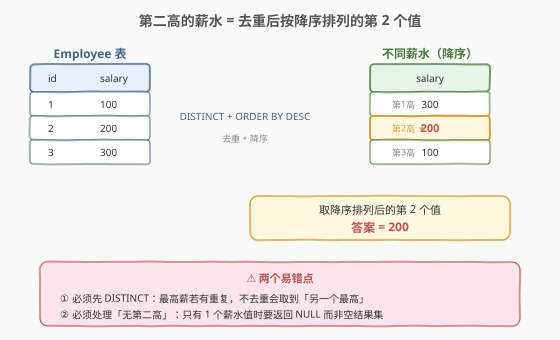
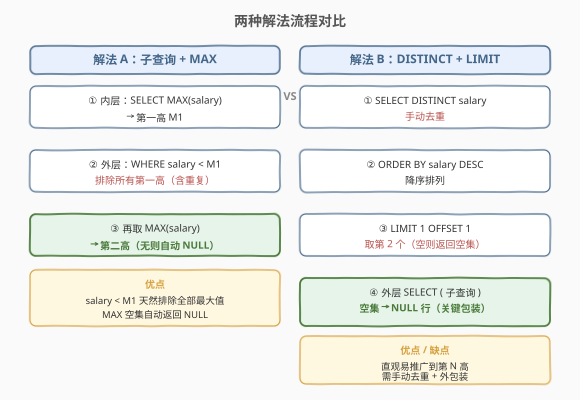
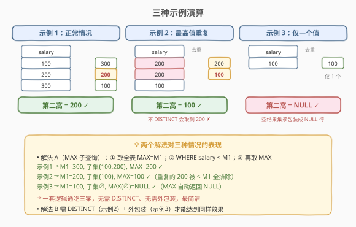

# LeetCode 第二高的薪水 题解

## 1. 题目概述

- **标题 / 题号**：第二高的薪水（#176，medium）
- **链接**：https://leetcode.cn/problems/second-highest-salary/
- **难度**：中等
- **标签**：SQL、子查询、聚合函数、LIMIT/OFFSET

**题意**：给定一张 `Employee` 表，编写 SQL 查询，返回**第二高（Second Highest）**的薪水 `salary`。如果不存在第二高的薪水（即不同薪水值少于 2 个），查询应返回 `NULL`。

**表结构**：

```text
Table: Employee
+-------------+------+
| Column Name | Type |
+-------------+------+
| id          | int  |  ← 主键
| salary      | int  |
+-------------+------+
```

> 💡 **关键约束**：`salary` 可能**有重复**（多人同薪），「第二高」指的是**去重后**降序排列的第 2 个值，不是表里第 2 行。当全表只有一个薪水值时，不存在第二高，必须返回 `NULL`（一行一列、值为 NULL），而非空结果集。

**示例 1**：

```text
输入：Employee 表
+----+--------+
| id | salary |
+----+--------+
| 1  | 100    |
| 2  | 200    |
| 3  | 300    |
+----+--------+
输出：
+---------------------+
| SecondHighestSalary |
+---------------------+
| 200                 |
+---------------------+
```

**示例 2**：

```text
输入：Employee 表
+----+--------+
| id | salary |
+----+--------+
| 1  | 100    |
+----+--------+
输出：
+---------------------+
| SecondHighestSalary |
+---------------------+
| null                |
+---------------------+
```

**约束**：

- `id` 是 `Employee` 表的主键
- `salary` 可重复
- 结果须返回**一行**：有第二高时为该值，无时为 `NULL`
- 结果列名须为 `SecondHighestSalary`

> 💡 本题是 SQL 「**取第 N 高**」家族的入门款（[177. 第 N 高的薪水](https://leetcode.cn/problems/nth-highest-salary/) 是其泛化）。考点不在写法难度，而在两个**边界**：① 重复值要去重；② 无第二高时要返回 `NULL` 而非空集。下文 2.2 给出最优雅的统一处理范式。

## 2. 解题思路

### 2.1 暴力思路：ORDER BY + LIMIT/OFFSET 裸写

最直觉的写法是「降序排好后跳过第一个取一个」：

```sql
SELECT DISTINCT salary
FROM Employee
ORDER BY salary DESC
LIMIT 1 OFFSET 1;
```

能过示例 1，但在示例 2（只有一个薪水值）下返回**空结果集**（0 行），而题目要求返回**一行 `NULL`**。原因：`OFFSET 1` 在去重后只有 1 行时跳过了唯一一行，剩下的为空。这是本题最经典的坑——**「空集」与「NULL 行」在 SQL 里是两回事**。

> ⚠️ 修这个坑有两种方向：① 用 `IFNULL` / 外层 `SELECT (子查询)` 把空集包装成 NULL；② 换一个「天然返回 NULL」的写法——用 `MAX` 聚合函数。下文 2.2 的解法 A 走方向 ②，更简洁。

### 2.2 核心观察：第二高 = 严格小于最高中的最大值



**关键洞察**：把「第二高」重新表述为——**在所有严格小于「最高薪水」的薪水中取最大值**。设 $M_1 = \max(\text{salary})$ 为全表最高，则：

$$\text{SecondHighest} = \max\{\,\text{salary} \mid \text{salary} < M_1\,\}$$

这个表述有两个隐藏的好处，恰好消解 2.1 的两个坑：

- **天然去重**：条件 `salary < M_1` 一次性排除**所有**等于 $M_1$ 的行（含其全部重复副本），剩下的都是「严格更低」的薪水，再取 `MAX` 自然得到下一个不同值——无需显式 `DISTINCT`。
- **天然返回 NULL**：`MAX` 是**聚合函数**，即便输入集合为空（即全表只有一个薪水值，没有任何 `salary < M_1` 的行），它也**保证返回一行 `NULL`**，而不是空结果集。这正好满足题目「无第二高返回 NULL」的要求。

> 💡 **聚合函数的空集语义**：`MAX` / `MIN` / `SUM` / `AVG` / `COUNT` 对空集合都会返回**一行**（`MAX`/`MIN`/`SUM` 返回 `NULL`，`COUNT` 返回 `0`）。这是它们与标量子查询「空则无行」语义的根本区别，也是本题解法 A 的精髓。

### 2.3 两种解法流程对比



**解法 A（推荐）：MAX 子查询**——套用 2.2 的公式，两层 `MAX`：

- 内层 `SELECT MAX(salary) FROM Employee` → 得到第一高 $M_1$；
- 外层 `SELECT MAX(salary) FROM Employee WHERE salary < M1` → 在「严格更低」的子集里取最大，即第二高；子集为空时自动返回 `NULL`。

**解法 B：DISTINCT + LIMIT/OFFSET + 外包装**——回到 2.1 的暴力思路，补上两块拼图：

- `DISTINCT` 去重 → `ORDER BY DESC` 降序 → `LIMIT 1 OFFSET 1` 取第 2 个；
- 外层用 `SELECT ( 子查询 ) AS ...` 把子查询的空结果集提升为 `NULL` 行（标量子查询在无行返回时取 `NULL`）。

> ⚠️ 解法 B 的外包装不可省。常见错误是给裸 `LIMIT OFFSET` 套 `IFNULL(..., NULL)`——但 `IFNULL` 的第一个参数若本身是**空结果集**（而非 NULL 值），`IFNULL` 根本拿不到参数。必须先用外层 `SELECT (子查询)` 把空集「塌缩」成 `NULL` 标量，`IFNULL` 才有意义。其实外层 `SELECT (子查询)` 本身就已把空集变 `NULL`，连 `IFNULL` 都不必再写。

### 2.4 示例演算



以三种典型情况验证解法 A 的「一招通吃」：

| 步骤 | 示例 1 `[100,200,300]` | 示例 2 `[200,200,100]` | 示例 3 `[100]` |
|------|------------------------|------------------------|----------------|
| ① 内层 $M_1$ | `MAX(salary)` = 300 | `MAX(salary)` = 200 | `MAX(salary)` = 100 |
| ② `WHERE salary < M1` 的子集 | `{100, 200}` | `{100}`（两个 200 被排除） | `∅`（空集） |
| ③ 外层 `MAX(子集)` | 200 | 100 | `NULL` |
| **结果** | **200** ✓ | **100** ✓ | **NULL** ✓ |

> 💡 **示例 2 的精髓**：解法 A 用 `salary < 200` 一次性排除了**两个** 200，无需 `DISTINCT` 就正确得到 100。这正是「条件去重」比「`DISTINCT` 去重」更优雅之处——前者把去重融入筛选条件，后者需单独一步。示例 3 则靠 `MAX(∅) = NULL` 兜底，无需外包装。

## 3. 参考代码

### SQL（解法 A：MAX 子查询，推荐）

```sql
SELECT MAX(salary) AS SecondHighestSalary
FROM Employee
WHERE salary < (SELECT MAX(salary) FROM Employee);
```

> 💡 **写法要点**：
> - 内层 `(SELECT MAX(salary) FROM Employee)` 是标量子查询，返回第一高 $M_1$，可直接用于 `WHERE` 比较。
> - 外层 `WHERE salary < M1` 排除全部最高值（含重复），`MAX` 取剩下的最大值即第二高。
> - 整个查询**必返回一行**：有第二高时为该值，无时 `MAX` 返回 `NULL`——无需 `IFNULL`、无需外包装。
> - 列别名 `AS SecondHighestSalary` 满足题目对输出列名的要求。

### SQL（解法 B：DISTINCT + LIMIT/OFFSET + 外包装）

```sql
SELECT (
    SELECT DISTINCT salary
    FROM Employee
    ORDER BY salary DESC
    LIMIT 1 OFFSET 1
) AS SecondHighestSalary;
```

> 💡 外层 `SELECT ( 子查询 )` 是「标量子查询上下文」：子查询返回一行时取该值，返回**空集**时取 `NULL`。这把 2.1 裸写法的「空结果集」提升为「一行 NULL」，正好满足题意。`IFNULL(..., NULL)` 可加可不加（外层已保证 NULL）。

### SQL（解法 C：窗口函数 DENSE_RANK，可推广到第 N 高）

```sql
SELECT DISTINCT salary AS SecondHighestSalary
FROM (
    SELECT salary, DENSE_RANK() OVER (ORDER BY salary DESC) AS rk
    FROM Employee
) t
WHERE rk = 2;
```

> ⚠️ 解法 C 在「无第二高」时同样返回**空结果集**，需再套一层 `SELECT (子查询)` 或 `IFNULL` 包装才能转成 NULL 行。`DENSE_RANK` 的优势在「并列名次不跳号」——相同薪水给同一名次，下一个不同薪水名次 +1，正好对应「去重后排名」。这套写法把 `rk = 2` 换成 `rk = N` 即得 [177. 第 N 高的薪水](https://leetcode.cn/problems/nth-highest-salary/) 的解。

### Python（pandas）

```python
import pandas as pd

def second_highest_salary(employee: pd.DataFrame) -> pd.DataFrame:
    distinct = employee['salary'].drop_duplicates().sort_values(ascending=False)
    second = distinct.iloc[1] if len(distinct) >= 2 else None
    return pd.DataFrame({'SecondHighestSalary': [second]})
```

> 💡 **pandas 对照**：`drop_duplicates()` 等价 `DISTINCT`，`sort_values(ascending=False)` 等价 `ORDER BY DESC`，`iloc[1]` 等价 `LIMIT 1 OFFSET 1`。`len < 2` 时返回 `None` 对应 SQL 的 `NULL` 行。注意必须返回 `DataFrame`（一行一列），不是裸标量。

## 4. 复杂度分析

| 维度 | 复杂度 | 说明 |
|------|--------|------|
| **时间复杂度** | $O(n)$ | 解法 A 扫两遍表：内层 `MAX` 全扫一次，外层 `WHERE` 再扫一次，各 $O(n)$；若 `salary` 有索引则可走索引有序遍历，`MAX` 为 $O(\log n)$ 的索引最右叶子。$n$ = Employee 行数 |
| **空间复杂度** | $O(1)$ | 仅维护标量 $M_1$ 与结果，无额外结构（解法 B 的 `DISTINCT` + 排序在内存中需 $O(k)$，$k$ = 不同薪水数） |
| **结果行数** | $1$ | 聚合查询保证恰好一行 |

> ⚠️ SQL 复杂度取决于**执行计划**：解法 A 的两次 `MAX` 若走 `salary` 索引则为 $O(\log n)$；`WHERE salary < M1` 若走索引范围扫描则为 $O(\log n + m)$（$m$ 为满足条件的行数）。面试中说明「扫两遍表、可被索引加速」即可。

## 5. 扩展：取第 N 高的薪水

### 5.1 解法 A 的泛化（连续 MAX）

把解法 A 套两层得第二高，套三层得第三高……但「第 N 高」需套 N 层 `MAX`，不优雅。解法 A 的价值在**第二高**这个特例——两层 `MAX` 足矣。

### 5.2 解法 B 的泛化（LIMIT N-1 OFFSET N-1）

把 `LIMIT 1 OFFSET 1` 换成 `LIMIT 1 OFFSET N-1` 即得第 N 高，这是 [177. 第 N 高的薪水](https://leetcode.cn/problems/nth-highest-salary/) 的主流写法。仍需外包装 `SELECT (子查询)` 处理空集，且 `OFFSET` 在 MySQL 中必须是常量（177 题要求 `CREATE FUNCTION`，需把 `N-1` 预计算）。

### 5.3 解法 C 的泛化（DENSE_RANK）

`WHERE rk = N` 直接替换 `rk = 2`，是「第 N 高」最通用的写法，且天然支持**并列名次**（同薪同 rank，不跳号）。`ROW_NUMBER()` 会跳号（同薪也给不同号），不适合本题语义；`RANK()` 同薪同号但**下一名会跳号**（如两个并列第一后直接第三），也不合「去重后第 N 个」之意。故本题排名函数必须用 `DENSE_RANK`。

> 💡 **三种排名函数对比**：对薪水 `[200, 200, 100]`：
> - `ROW_NUMBER` → 1, 2, 3（强加序号，同值不同号）
> - `RANK` → 1, 1, 3（同值同号，下一名跳号）
> - `DENSE_RANK` → 1, 1, 2（同值同号，下一名不跳）← 本题所需

## 6. 面试要点

1. **「第二高」为什么不等于「第二行」？**

   - 因为 `salary` 可重复。「第二高」指**去重后**降序排列的第 2 个**值**，与表的行序无关。例如 `[200, 200, 100]` 的第二高是 100（去重后 `[200, 100]` 的第 2 个），而不是表里第 2 行的 200。所以要么用 `DISTINCT` 显式去重，要么用 `salary < MAX(salary)` 条件去重。

2. **为什么裸 `LIMIT OFFSET` 在示例 2 会错？**

   - 示例 2 去重后只有 1 个薪水值（100），`OFFSET 1` 跳过唯一一行后剩余为空，返回**空结果集**（0 行）。但题目要求返回**一行 `NULL`**。空结果集与 NULL 行是两种不同的「无答案」表达：前者是「没有行」，后者是「有一行、值为 NULL」。SQL 中只有聚合函数或标量子查询包装才能把空集塌缩成 NULL。

3. **解法 A 为什么不需要 `DISTINCT`？**

   - `WHERE salary < (SELECT MAX(salary) ...)` 用**条件**一次性排除所有等于最高值的行——包括其全部重复副本。剩下的都是严格更低的薪水，对这些取 `MAX` 自然得到「下一个不同值」，等价于去重后的第二高。这是「条件去重」比 `DISTINCT` 去重更省一步的优雅之处。

4. **`MAX` 为什么能保证返回 NULL？**

   - `MAX` 是聚合函数，**无论输入多少行（含 0 行）都返回恰好一行**：有行时返回最大值，无行时返回 `NULL`。这与标量子查询「无行则无输出」的语义不同。解法 A 在示例 3 中，外层 `WHERE` 过滤后子集为空，`MAX(∅)` 直接返回 `NULL`，无需 `IFNULL` 或外包装——这正是选用 `MAX` 而非 `LIMIT OFFSET` 的根本理由。

5. **`IFNULL(子查询, NULL)` 为什么不工作？**

   - `IFNULL(expr1, expr2)` 检查 `expr1` 是否为 `NULL` 值。但裸 `SELECT DISTINCT ... LIMIT 1 OFFSET 1` 在无第二高时返回的是**空结果集**（根本没有值，不是 NULL 值），`IFNULL` 拿不到任何输入，整个查询仍返回空集。必须先用外层 `SELECT (子查询)` 把空集提升为 `NULL` 标量，此时 `IFNULL` 才有意义的输入——但此时外层 `SELECT` 已经返回 NULL，`IFNULL` 已成多余。所以正确写法是 `SELECT (子查询) AS ...`，不需要 `IFNULL`。

> 💡 **一句话总结**：176 的精髓不在「怎么取第二高」，而在「怎么处理没有第二高」——`MAX` 聚合函数把空集塌缩为 NULL 行的语义，是本题最优雅的解。记住：**聚合函数对空集返回一行 NULL，标量子查询对空集返回 NULL，裸 SELECT 对空集返回空结果集**——三种语义层层递进。

## 同类练习题

| # | 题目 | 与本题的关联 |
|---|------|-------------|
| 175 | [组合两个表](https://leetcode.cn/problems/combine-two-tables/) | SQL JOIN 入门母题，本题的「前一题」，承接「SQL 基础语法」主线，对照本题的「聚合 + 子查询」另一支线 |
| 177 | [第 N 高的薪水](https://leetcode.cn/problems/nth-highest-salary/) | 本题的直接泛化（N=2 即本题），主流写法 `LIMIT 1 OFFSET N-1` + 外包装，或 `DENSE_RANK() ... WHERE rk = N` |
| 180 | [连续出现的数字](https://leetcode.cn/problems/consecutive-numbers/) | **自连接 + `DISTINCT`**，连续 3 次相同值，承接本题的「去重」思想与 SQL 多表关联 |
| 181 | [超过经理收入的员工](https://leetcode.cn/problems/employees-earning-more-than-their-managers/) | **自连接**（Self JOIN），同一张表 JOIN 自身比较两列，SQL JOIN 的进阶用法 |
| 184 | [部门最高薪水](https://leetcode.cn/problems/department-highest-salary/) | **`GROUP BY` + `MAX`**，按部门分组取最高，把本题的「全局 MAX」推广到「分组 MAX」 |
