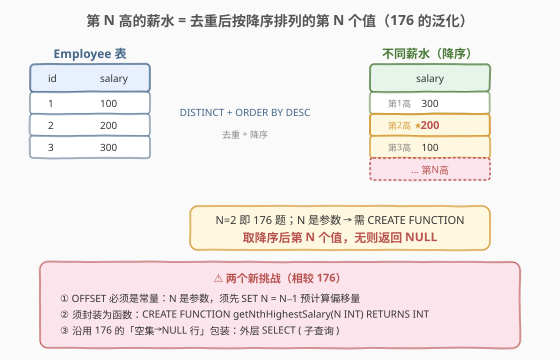
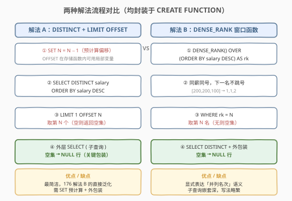
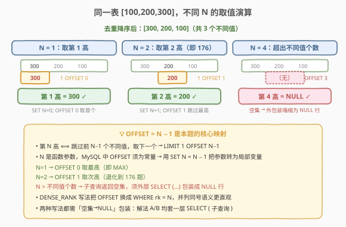

# LeetCode 第N高的薪水 题解

## 1. 题目概述

- **标题 / 题号**：第N高的薪水（#177，medium）
- **链接**：https://leetcode.cn/problems/nth-highest-salary/
- **难度**：中等
- **标签**：SQL、子查询、窗口函数、LIMIT/OFFSET、存储函数

**题意**：给定一张 `Employee` 表，编写 SQL 查询，返回**第 N 高（Nth Highest）**的薪水 `salary`。如果不存在第 N 高的薪水（即不同薪水值少于 N 个），查询应返回 `NULL`。与 [176. 第二高的薪水](./176_第二高的薪水.md) 的区别在于：N 不再固定为 2，而是**函数参数**，因此需封装为 `CREATE FUNCTION`。

**表结构**：

```text
Table: Employee
+-------------+------+
| Column Name | Type |
+-------------+------+
| id          | int  |  ← 主键
| salary      | int  |
+-------------+------+
```

> 💡 **关键约束**：`salary` 可能**有重复**（多人同薪），「第 N 高」指**去重后**降序排列的第 N 个**值**，与表的行序无关。当不同薪水值少于 N 个时，必须返回 `NULL`（一行一列、值为 NULL），而非空结果集。

**函数签名**：

```sql
CREATE FUNCTION getNthHighestSalary(N INT) RETURNS INT
```

**示例 1**：

```text
输入：Employee 表, N = 2
+----+--------+
| id | salary |
+----+--------+
| 1  | 100    |
| 2  | 200    |
| 3  | 300    |
+----+--------+
输出：
+------------------------+
| getNthHighestSalary(2) |
+------------------------+
| 200                    |
+------------------------+
```

**示例 2**：

```text
输入：Employee 表, N = 2
+----+--------+
| id | salary |
+----+--------+
| 1  | 100    |
+----+--------+
输出：
+------------------------+
| getNthHighestSalary(2) |
+------------------------+
| null                   |
+------------------------+
```

**约束**：

- `id` 是 `Employee` 表的主键
- `salary` 可重复
- N 为正整数
- 结果须返回**一行**：有第 N 高时为该值，无时为 `NULL`

> 💡 本题是 [176. 第二高的薪水](./176_第二高的薪水.md) 的直接泛化——`N = 2` 即 176 题。176 的三种解法（`MAX` 子查询 / `DISTINCT + LIMIT OFFSET` / `DENSE_RANK`）都能推广到任意 N，但**新增了两个挑战**：① N 是参数，MySQL 的 `OFFSET` 必须为常量，须先 `SET N = N − 1` 预计算；② 须把查询封装为 `CREATE FUNCTION`。下文 2.2 给出最简洁的泛化范式。

## 2. 解题思路

### 2.1 暴力思路：直接 LIMIT 1 OFFSET N-1

承接 176 的解法 B，最直觉的写法是「去重降序后跳过前 N−1 个取一个」：

```sql
SELECT DISTINCT salary
FROM Employee
ORDER BY salary DESC
LIMIT 1 OFFSET N - 1;
```

这里立刻撞上两个坑：

1. **`OFFSET` 不接受参数表达式**：MySQL 中 `LIMIT` / `OFFSET` 的值必须是**常量**（或 `PREPARE` 语句的占位符），`OFFSET N - 1` 里的 `N` 是函数参数，直接写会报语法错误。
2. **空结果集 ≠ NULL 行**：当不同薪水值少于 N 个时，`OFFSET N − 1` 跳过所有行后剩余为空，返回**空结果集**（0 行），而题目要求返回**一行 `NULL`**——这与 176 的坑完全一致。

> ⚠️ 第一个坑是 177 相对 176 的**唯一新增难点**：176 的 `OFFSET 1` 是常量，写死即可；177 的 `OFFSET N−1` 是表达式，必须借助存储函数的局部变量绕过。第二个坑则完全沿用 176 的「空集→NULL 行」包装方案。

### 2.2 核心观察：176 的泛化 + OFFSET 预计算



**关键洞察**：把「第 N 高」重新表述为——**去重降序后，跳过前 N−1 个不同值，取下一个**。即：

$$\text{NthHighest} = \operatorname{first}\{\,\text{salary} \mid \text{salary 去重降序排列，索引 } 0..\infty \text{ 中的第 } N-1 \text{ 个}\,\}$$

这个表述把 N=1（最高）、N=2（第二高，即 176）、N=k（第 k 高）统一为同一套骨架：`LIMIT 1 OFFSET N−1`。剩下的两块拼图：

- **OFFSET 预计算**：在 `CREATE FUNCTION` 体中，用 `SET N = N − 1` 把参数减 1 后赋给局部变量。MySQL 存储函数内，`LIMIT` / `OFFSET` **可以接受已 `SET` 的局部变量**（不能接受裸参数表达式，但可以接受局部变量）——这是绕过「OFFSET 须为常量」限制的标准手法。
- **空集→NULL 行包装**：沿用 176 解法 B 的外层 `SELECT ( 子查询 )`——标量子查询在无行返回时取 `NULL`，把内层的空结果集「塌缩」为一行 `NULL`。

> 💡 **为什么 `SET N = N − 1` 能绕过限制**：MySQL 存储程序中，`LIMIT` / `OFFSET` 的语法允许「整数类型的局部变量」（`DECLARE` 或函数参数/`SET` 赋值的变量），但不允许「含运算符的表达式」（如 `N − 1`）。所以先 `SET N = N − 1` 把表达式求值为变量，再用 `OFFSET N` 就合法了。本质上是用**变量赋值**替你完成「表达式求值」这一步。

### 2.3 两种解法流程对比



**解法 A（推荐）：DISTINCT + LIMIT OFFSET + SET 预计算**——176 解法 B 的直接泛化：

- `SET N = N − 1` 预计算偏移量（绕过 OFFSET 须为常量的限制）；
- `SELECT DISTINCT salary ... ORDER BY DESC LIMIT 1 OFFSET N` 取第 N 个；
- 外层 `SELECT ( 子查询 ) AS ...` 把空集塌缩为 `NULL` 行。

**解法 B：DENSE_RANK 窗口函数**——176 解法 C 的直接泛化：

- `DENSE_RANK() OVER (ORDER BY salary DESC) AS rk` 给每个薪水打「并列不跳号」的名次；
- `WHERE rk = N` 取第 N 名；
- 同样需外层 `SELECT ( 子查询 )` 处理空集。

> ⚠️ 两种解法**都需要外包装**：内层子查询在「无第 N 高」时返回空集，必须用外层 `SELECT ( 子查询 )` 塌缩为 `NULL` 行。这是 176 已经验证过的坑，177 完全继承。`IFNULL(..., NULL)` 单独使用无效（理由同 176：`IFNULL` 拿不到空集作为输入）——必须先有外层 `SELECT` 把空集变 `NULL`。

### 2.4 示例演算



以 `Employee = [100, 200, 300]`（去重降序后 `[300, 200, 100]`，共 3 个不同值）为例，验证解法 A 的「一招通吃」：

| N | `SET N=` | `OFFSET` | 取到的行 | 结果 |
|---|----------|----------|----------|------|
| 1 | 0 | 0 | `300`（首个） | **300** ✓ |
| 2 | 1 | 1 | `200`（跳过最高） | **200** ✓（即 176 题） |
| 3 | 2 | 2 | `100`（跳过前两） | **100** ✓ |
| 4 | 3 | 3 | ∅（跳过全部，空集） | **NULL** ✓（外包装塌缩） |

> 💡 **N=4 的精髓**：去重后只有 3 个值，`OFFSET 3` 跳过全部后内层返回空集；外层 `SELECT ( 子查询 )` 把空集塌缩为 `NULL` 行，正好满足题意。`N=2` 则退化到 176 题——`OFFSET 1` 取 `200`。一张表、四个 N，验证了「OFFSET = N−1」映射与「空集→NULL」包装两块拼图覆盖全部边界。

## 3. 参考代码

### SQL（解法 A：DISTINCT + LIMIT OFFSET + SET 预计算，推荐）

```sql
CREATE FUNCTION getNthHighestSalary(N INT) RETURNS INT
BEGIN
    SET N = N - 1;
    RETURN (
        SELECT (
            SELECT DISTINCT salary
            FROM Employee
            ORDER BY salary DESC
            LIMIT 1 OFFSET N
        )
    );
END
```

> 💡 **写法要点**：
> - `SET N = N − 1` 把参数减 1 赋回局部变量 `N`，之后 `OFFSET N` 即「跳过 N−1 个取下一个」，合法且语义正确。
> - 内层 `SELECT DISTINCT salary ... ORDER BY DESC LIMIT 1 OFFSET N` 取去重降序后的第 N 个值；无则返回空集。
> - 外层 `SELECT ( 子查询 )` 是标量子查询上下文：内层有行时取该值，内层为空集时取 `NULL`——把空集塌缩为 `NULL` 行，满足题意。
> - `RETURN (...)` 返回标量值；调用 `SELECT getNthHighestSalary(2)` 即得一行一列结果。

### SQL（解法 B：DENSE_RANK 窗口函数）

```sql
CREATE FUNCTION getNthHighestSalary(N INT) RETURNS INT
BEGIN
    RETURN (
        SELECT (
            SELECT DISTINCT salary
            FROM (
                SELECT salary, DENSE_RANK() OVER (ORDER BY salary DESC) AS rk
                FROM Employee
            ) t
            WHERE rk = N
        )
    );
END
```

> 💡 **写法要点**：
> - `DENSE_RANK() OVER (ORDER BY salary DESC)` 给每个薪水打「并列不跳号」的名次：`[200, 200, 100]` → rk 为 `1, 1, 2`，相同薪水同号、下一名不跳。
> - `WHERE rk = N` 取第 N 名的薪水；外层 `SELECT DISTINCT` 去掉同薪多行（同 rk 的多行只留一个值）。
> - 最外层 `SELECT ( 子查询 )` 同样把空集（N 超出名次范围）塌缩为 `NULL` 行。
> - 解法 B 无需 `SET N = N − 1`（`rk = N` 直接用参数比较，不涉及 OFFSET 限制），但子查询嵌套更深、写法更繁。

### SQL（解法 C：IFNULL 显式包装，等价于解法 A）

```sql
CREATE FUNCTION getNthHighestSalary(N INT) RETURNS INT
BEGIN
    SET N = N - 1;
    RETURN (
        SELECT IFNULL(
            (SELECT DISTINCT salary FROM Employee ORDER BY salary DESC LIMIT 1 OFFSET N),
            NULL
        )
    );
END
```

> ⚠️ `IFNULL` 的第一个参数是**标量子查询** `(SELECT ... LIMIT 1 OFFSET N)`——它本身在无行时取 `NULL`，因此 `IFNULL(..., NULL)` 实为多余（外层 `SELECT ( 子查询 )` 已经做了同样的事）。这里展示是为了说明：**必须先用标量子查询把空集变 `NULL`，`IFNULL` 才有意义的输入**——这正是 176 已经验证过的坑。生产中推荐解法 A（更简洁）。

### Python（pandas）

```python
import pandas as pd

def nth_highest_salary(employee: pd.DataFrame, n: int) -> pd.DataFrame:
    distinct = employee['salary'].drop_duplicates().sort_values(ascending=False)
    ans = distinct.iloc[n - 1] if len(distinct) >= n else None
    return pd.DataFrame({'NthHighestSalary': [ans]})
```

> 💡 **pandas 对照**：`drop_duplicates()` 等价 `DISTINCT`，`sort_values(ascending=False)` 等价 `ORDER BY DESC`，`iloc[n − 1]` 等价 `LIMIT 1 OFFSET N−1`。`len < n` 时返回 `None` 对应 SQL 的 `NULL` 行。注意必须返回 `DataFrame`（一行一列），不是裸标量。

## 4. 复杂度分析

| 维度 | 复杂度 | 说明 |
|------|--------|------|
| **时间复杂度** | $O(n \log n)$ | 解法 A 需 `DISTINCT`（去重常借哈希或排序）+ `ORDER BY`（排序 $O(n \log n)$）+ `LIMIT OFFSET`（跳过前 N−1 个，$O(N)$）。若 `salary` 有索引则可走索引有序扫描，`DISTINCT + ORDER BY` 降为 $O(\log n + k)$（$k$ = 不同值数）。解法 B 的 `DENSE_RANK` 同样需排序 $O(n \log n)$。$n$ = Employee 行数 |
| **空间复杂度** | $O(k)$ | 去重后的不同薪水值集合，$k$ = 不同薪水数（$k \le n$）。窗口函数版本需缓存分区排序的中间结果 |
| **结果行数** | $1$ | 聚合 / 标量子查询保证恰好一行 |

> ⚠️ SQL 复杂度取决于**执行计划**：`salary` 上若有索引，`ORDER BY salary DESC` 可走索引反向扫描免排序；`DISTINCT` 可走索引唯一扫描。面试中说明「需排序去重、可被索引加速，N 通常很小 OFFSET 跳过代价低」即可。

## 5. 扩展：三种排名函数与第 N 高

### 5.1 为什么必须用 DENSE_RANK

本题「第 N 高」的语义是**去重后**的第 N 个不同值——相同薪水算同一名次，且下一名**不跳号**。三种排名函数对此表现不同，对薪水 `[200, 200, 100]`：

| 函数 | 生成的名次 | 第 2 高取值 | 是否合题意 |
|------|-----------|------------|-----------|
| `ROW_NUMBER()` | 1, 2, 3 | 200（第二个 200） | ✗ 强加序号，未去重 |
| `RANK()` | 1, 1, 3 | ∅（无 rk=2） | ✗ 同值同号但下一名跳号 |
| `DENSE_RANK()` | 1, 1, 2 | 100 | ✓ 同值同号、下一名不跳 |

> 💡 只有 `DENSE_RANK` 的「同值同号、下一名不跳」恰好对应「去重后第 N 个」的语义。`ROW_NUMBER` 不去重、`RANK` 跳号，都不合题意。这正是解法 B 选用 `DENSE_RANK` 而非其他两个的根本理由。

### 5.2 176 解法 A（连续 MAX）为何不能泛化

176 的解法 A 用两层 `MAX` 取第二高——`MAX(salary) WHERE salary < MAX(salary)`。推广到第 N 高需嵌套 N 层 `MAX`：第三高 = `MAX(salary) WHERE salary < (第二高的子查询)`……N 层嵌套既不优雅也无法参数化（N 是运行时参数，SQL 语法要求嵌套层数在编译时确定）。故 176 解法 A 仅适合 N=2 的特例，177 必须改用 `LIMIT OFFSET` 或 `DENSE_RANK`。

### 5.3 PREPARE/EXECUTE 方案

若不在存储函数中（如纯 SQL 会话），`OFFSET` 不能用变量，可用 `PREPARE` + `EXECUTE` 动态拼接：

```sql
SET @off = N - 1;
SET @sql = CONCAT('SELECT DISTINCT salary FROM Employee ORDER BY salary DESC LIMIT 1 OFFSET ', @off);
PREPARE stmt FROM @sql;
EXECUTE stmt;
DEALLOCATE PREPARE stmt;
```

存储函数内不允许 `PREPARE`/`EXECUTE`（MySQL 限制），所以 177 题实际用 `SET N = N − 1` + `OFFSET N` 更简洁。`PREPARE` 方案适用于「不能改函数签名、须在纯 SQL 里参数化 OFFSET」的场景。

## 6. 面试要点

1. **177 相对 176 多了什么难点？**

   - 两个新增点：① N 是函数参数，MySQL 的 `OFFSET` 不接受含运算符的表达式（如 `N − 1`），须先 `SET N = N − 1` 把它求值为局部变量再用 `OFFSET N`；② 须封装为 `CREATE FUNCTION getNthHighestSalary(N INT) RETURNS INT`，查询写在 `RETURN (...)` 中。其余（去重、空集→NULL 行包装）完全沿用 176。

2. **为什么 `OFFSET N − 1` 直接写会报错，`SET N = N − 1` 后 `OFFSET N` 就合法？**

   - MySQL 语法规定 `LIMIT` / `OFFSET` 的位置只接受**整数字面量**或**整数类型的局部变量**，不接受含运算符的表达式。`N − 1` 是表达式（参数 `N` 减常量 `1`），语法解析阶段就被拒绝。`SET N = N − 1` 是一条赋值语句，先把表达式求值为一个具体的整数存回变量 `N`，之后 `OFFSET N` 引用的是变量（已求值），合法。本质上是用「赋值语句替你算表达式」绕过语法限制。

3. **为什么仍然需要外层 `SELECT ( 子查询 )` 包装？**

   - 内层 `SELECT DISTINCT ... LIMIT 1 OFFSET N` 在 N 超过不同值个数时返回**空结果集**（0 行），而题目要求返回**一行 `NULL`**。标量子查询 `( 子查询 )` 在无行返回时取 `NULL`，把空集「塌缩」为一行 `NULL`，正好满足题意。这与 176 的坑完全一致——空结果集与 NULL 行是两种不同的「无答案」表达。

4. **解法 A 和解法 B 各有什么优劣？**

   - 解法 A（`LIMIT OFFSET`）：写法最简洁，是 176 解法 B 的直接泛化，只需加一行 `SET N = N − 1`；但 `OFFSET` 需跳过前 N−1 行，N 很大时扫描代价略高（不过 N 通常很小，可忽略）。
   - 解法 B（`DENSE_RANK`）：用 `WHERE rk = N` 直接定位第 N 名，语义更直观、显式表达「并列名次」；但子查询嵌套更深，且 `DENSE_RANK` 仍需对全表排序 $O(n \log n)$。两者复杂度同阶，选 A 更简洁、选 B 更语义化。

5. **`N = 1` 时退化成什么？**

   - `SET N = 0`，`OFFSET 0` 即不跳过，取去重降序后的第一个值——也就是全局最高，等价于 `SELECT MAX(salary)`。这验证了「第 N 高」定义在 N=1 处与 `MAX` 的一致性。同理 `N = 2` 退化到 176 题。

> 💡 **一句话总结**：177 = 176 的泛化 + `SET N = N − 1` 绕过 OFFSET 限制 + `CREATE FUNCTION` 封装。核心映射是 **第 N 高 ⟺ `LIMIT 1 OFFSET N−1`**，外层 `SELECT ( 子查询 )` 处理空集→NULL。记住 176 的两块拼图（去重、空集包装）加上 177 的一块新拼图（OFFSET 预计算），三块拼图拼出任意第 N 高。

## 同类练习题

| # | 题目 | 与本题的关联 |
|---|------|-------------|
| 176 | [第二高的薪水](https://leetcode.cn/problems/second-highest-salary/) | 本题 N=2 的特例，176 解法 B（`DISTINCT + LIMIT OFFSET` + 外包装）即本题解法 A 的原型，承接「去重 + 空集→NULL 行」两块拼图 |
| 180 | [连续出现的数字](https://leetcode.cn/problems/consecutive-numbers/) | **自连接 + `DISTINCT`**，连续 3 次相同值，承接本题的「去重」思想与 SQL 多表关联 |
| 184 | [部门工资最高的员工](https://leetcode.cn/problems/department-highest-salary/) | **`GROUP BY` + `IN` 子查询**，按部门分组取最高，把本题的「全局第 N 高」推广到「分组内最高」 |
| 185 | [部门工资前三高的所有员工](https://leetcode.cn/problems/department-top-three-salaries/) | **`DENSE_RANK` + 分组**，把本题的「全局第 N 高」与「部门分组」结合，是解法 B 的进阶综合应用 |
| 178 | [分数排名](https://leetcode.cn/problems/rank-scores/) | **`DENSE_RANK` 排名输出**，直接练习三种排名函数的差异，巩固本题 5.1 节的选型理由 |
