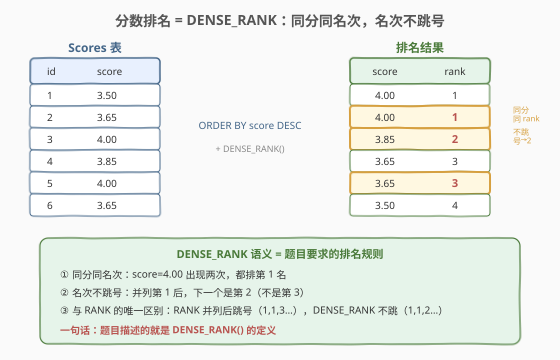
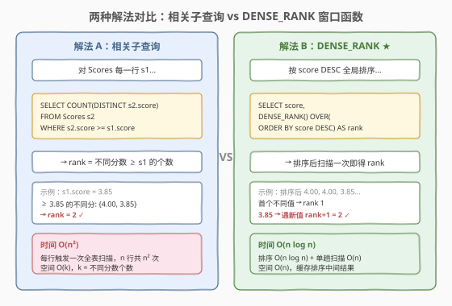
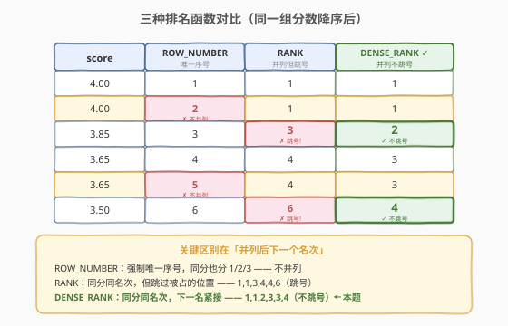

# 分数排名

- **题目名称**：分数排名
- **链接**：[178. 分数排名](https://leetcode.cn/problems/rank-scores/)
- **难度**：中等
- **标签**：SQL、窗口函数、DENSE_RANK、相关子查询、自连接

## 1. 题目概述

给定一张 `Scores` 表，编写 SQL 查询，对每个分数进行**排名**。排名规则：

1. 分数从高到低排列；
2. **同分同名次**——相同分数的行获得相同的排名；
3. **名次不跳号**——并列之后，下一个排名是紧挨着的连续整数（不留空隙）。

这正是 SQL 窗口函数 `DENSE_RANK()` 的定义。

**表结构**：

```text
Table: Scores
+-------------+------+
| Column Name | Type |
+-------------+------+
| id          | int  |  ← 主键
| score       | decimal |
+-------------+------+
```

> 💡 **关键约束**：`score` 可以**有重复**（多人同分）。排名按**值**而非按行——同分必同 rank，且 rank 序列是**无空洞的连续整数**（1, 1, 2, 3, 3, 4…，而非 1, 1, 3, 4, 4, 6…）。这与 `RANK()` 的「并列后跳号」行为形成关键区别。

**示例 1**：

```text
输入：Scores 表
+----+-------+
| id | score |
+----+-------+
| 1  | 3.50  |
| 2  | 3.65  |
| 3  | 4.00  |
| 4  | 3.85  |
| 5  | 4.00  |
| 6  | 3.65  |
+----+-------+
输出：
+-------+------+
| score | rank |
+-------+------+
| 4.00  | 1    |
| 4.00  | 1    |
| 3.85  | 2    |
| 3.65  | 3    |
| 3.65  | 3    |
| 3.50  | 4    |
+-------+------+
```

**约束条件**：

- `id` 是 `Scores` 表的主键
- `score` 为 `decimal` 类型，保留两位小数，可重复
- 结果按 `score` 降序返回，输出列为 `score` 和 `rank`

> 💡 本题是 SQL 排名函数的**教学母题**——题目描述的三条规则恰好是 `DENSE_RANK()` 的完整语义定义。掌握本题等于掌握三种排名函数（`ROW_NUMBER` / `RANK` / `DENSE_RANK`）的核心区别。下文 2.2 给出最优解法，2.4 给出三函数对比。

---

## 2. 解题思路

### 2.1 暴力思路：相关子查询 COUNT(DISTINCT)

在窗口函数出现之前（MySQL 8.0 以前），实现「DENSE_RANK」的经典做法是**相关子查询**：对每一行 `s1`，统计表中有多少个**不同的**分数 `≥ s1.score`，这个计数就是 `s1` 的排名。

```sql
SELECT score,
       (SELECT COUNT(DISTINCT s2.score)
        FROM Scores s2
        WHERE s2.score >= s1.score) AS `rank`
FROM Scores s1
ORDER BY score DESC;
```

逻辑正确，但有一个硬伤：

- **时间 $O(n^2)$**：外层对 `n` 行各执行一次子查询，每次子查询扫描全表（`COUNT(DISTINCT)` 还需去重），总共 $n \times n = n^2$ 次比较。表一大就慢到不可用。

> ⚠️ 这个子查询的语义恰好等价于 `DENSE_RANK`：「比我大的不同值有多少个 + 1（我自己）」。它不是「错解」，而是窗口函数问世前的标准写法——只是效率不够。窗口函数把 $O(n^2)$ 的嵌套扫描压缩为 $O(n \log n)$ 的一次排序。

### 2.2 核心观察：DENSE_RANK 窗口函数



**关键洞察**：题目描述的三条排名规则——①从高到低、②同分同名次、③名次不跳号——**逐字对应** `DENSE_RANK()` 窗口函数的语义：

$$\text{DENSE\_RANK}(\text{score}_i) = \bigl|\{\,\text{score} \in \text{Scores} \mid \text{score} > \text{score}_i\,\}\bigr|_{\text{distinct}} + 1$$

即「比我严格大的不同分数有多少个 + 1」。这个定义天然保证：同分 → 同 rank（因为「比我大的不同值个数」相同），且 rank 连续不跳号（因为每遇到一个新的不同值 rank 才 +1，不跳过任何整数）。

> 💡 **为什么是 DENSE_RANK 而非 RANK 或 ROW_NUMBER**：`RANK()` 在并列后**跳过被占的位置数**（两个并列第 1 后，下一个是第 3 而非第 2），违反规则 ③；`ROW_NUMBER()` 对同分行也分配**不同**序号，违反规则 ②。只有 `DENSE_RANK()` 的「同值同号、下一名紧接」恰好满足全部三条规则。详见 2.4 的三函数对比。

### 2.3 两种解法流程对比



**解法 A（推荐）：`DENSE_RANK` 窗口函数**——一行 SQL，语义即答案：

- `DENSE_RANK() OVER (ORDER BY score DESC) AS rank` 给每个分数打「并列不跳号」的名次；
- 外层 `ORDER BY score DESC` 保证结果按分数降序输出。

**解法 B：相关子查询 `COUNT(DISTINCT)`**——窗口函数问世前的经典写法：

- 对每行 `s1`，子查询统计 `≥ s1.score` 的不同分数个数；
- 语义与 `DENSE_RANK` 完全等价，但需 $O(n^2)$ 嵌套扫描。

> ⚠️ **`rank` 是 MySQL 8.0+ 的保留字**：用作列别名时建议加反引号 `` `rank` ``，避免语法冲突。LeetCode 的 MySQL 环境对此较宽容，但生产代码中务必加引号。

### 2.4 示例演算：三种排名函数对比



以示例数据降序排列后 `[4.00, 4.00, 3.85, 3.65, 3.65, 3.50]` 为例，对比三种函数的输出：

| score | ROW_NUMBER | RANK | DENSE_RANK ✓ |
|-------|-----------|------|-------------|
| 4.00  | 1         | 1    | 1           |
| 4.00  | **2** ✗   | 1    | 1           |
| 3.85  | 3         | **3** ✗ | **2**     |
| 3.65  | 4         | 4    | 3           |
| 3.65  | **5** ✗   | 4    | 3           |
| 3.50  | 6         | **6** ✗ | **4**     |

> 💡 **三处关键对比**：
> - **ROW_NUMBER**（第 2 列）：同分也给不同序号（1, 2, 3…），不并列——违反规则 ②；
> - **RANK**（第 3 列）：同分同名次，但并列后**跳号**（1, 1, **3**…），违反规则 ③；
> - **DENSE_RANK**（第 4 列）：同分同名次且**不跳号**（1, 1, **2**…），满足全部规则 ✓。
>
> 一句话：`RANK` 跳的号 = 并列占用的行数，`DENSE_RANK` 不跳号是因为它只按**不同值的个数**计数，不按行数。

---

## 3. 参考代码

### SQL（解法 A：DENSE_RANK 窗口函数，推荐）

```sql
SELECT score,
       DENSE_RANK() OVER (ORDER BY score DESC) AS `rank`
FROM Scores
ORDER BY score DESC;
```

> 💡 **写法要点**：
> - `DENSE_RANK() OVER (ORDER BY score DESC)` 是完整语法：`OVER` 子句定义「按 `score` 降序」的窗口排序规则，`DENSE_RANK()` 在该排序下计算「并列不跳号」的名次。
> - 外层 `ORDER BY score DESC` 保证输出行序与排名一致（`DENSE_RANK` 本身不改变行序，只附加 `rank` 列）。
> - `` AS `rank` `` 用反引号包裹，避免与 MySQL 8.0+ 保留字冲突。
> - 一行核心逻辑，是本题的最优解。

### SQL（解法 B：相关子查询 COUNT(DISTINCT)）

```sql
SELECT s1.score,
       (SELECT COUNT(DISTINCT s2.score)
        FROM Scores s2
        WHERE s2.score >= s1.score) AS `rank`
FROM Scores s1
ORDER BY s1.score DESC;
```

> 💡 **写法要点**：
> - 对每行 `s1`，子查询 `COUNT(DISTINCT s2.score) WHERE s2.score >= s1.score` 统计「`≥ s1.score` 的不同分数个数」——这恰好等于 `s1` 的 DENSE_RANK（比自己大或相等的**不同值**个数 = 名次）。
> - `DISTINCT` 不可省：没有它会把同分的多个行重复计数，导致 rank 偏大（变成 `RANK` 而非 `DENSE_RANK` 的行为）。
> - 此解法在 MySQL 5.7 等不支持窗口函数的旧版本中是标准写法；MySQL 8.0+ 推荐用解法 A。

### SQL（解法 C：自连接 + GROUP BY）

```sql
SELECT s1.score,
       COUNT(DISTINCT s2.score) AS `rank`
FROM Scores s1
JOIN Scores s2 ON s2.score >= s1.score
GROUP BY s1.id, s1.score
ORDER BY s1.score DESC;
```

> 💡 **写法要点**：
> - `JOIN Scores s2 ON s2.score >= s1.score` 把每行 `s1` 与所有 `score ≥ s1.score` 的行配对（包括自身）。
> - `GROUP BY s1.id, s1.score` 按每行分组，`COUNT(DISTINCT s2.score)` 统计配对中的不同分数个数——即 rank。
> - 与解法 B 语义等价（都是「`≥` 我的的不同值个数」），只是把相关子查询改写为自连接 + 聚合。复杂度同为 $O(n^2)$。
> - `GROUP BY s1.id` 是为了在同分多行时保持每行独立输出（若只 `GROUP BY s1.score` 则同分行会合并为一行）。

### Python（pandas）

```python
import pandas as pd

def order_scores(scores: pd.DataFrame) -> pd.DataFrame:
    scores['rank'] = scores['score'].rank(method='dense', ascending=False).astype(int)
    return scores.sort_values('score', ascending=False)[['score', 'rank']]
```

> 💡 **pandas 对照**：`rank(method='dense', ascending=False)` 直接对应 SQL 的 `DENSE_RANK() OVER (ORDER BY score DESC)`——`method='dense'` 即「同值同号、不跳号」，`ascending=False` 即降序。`sort_values` 对应外层 `ORDER BY score DESC`。pandas 的 `rank` 方法支持 `method` 参数：`'min'` 对应 `RANK`、`'dense'` 对应 `DENSE_RANK`、`'first'` 对应 `ROW_NUMBER`。

---

## 4. 复杂度分析

| 维度 | 复杂度 | 说明 |
|------|--------|------|
| **时间（解法 A）** | $O(n \log n)$ | `DENSE_RANK` 需对全表按 `score` 排序 $O(n \log n)$，排序后单趟扫描赋 rank $O(n)$。若 `score` 有降序索引可免排序，降为 $O(n)$。$n$ = Scores 行数 |
| **时间（解法 B/C）** | $O(n^2)$ | 每行触发一次全表扫描 + `COUNT(DISTINCT)` 去重，$n$ 行共 $n^2$ 次比较。适合小表或无窗口函数的旧版本 |
| **空间** | $O(n)$ | 窗口函数需缓存排序的中间结果（排序缓冲区）；子查询版本仅需 $O(k)$ 去重哈希（$k$ = 不同分数数） |
| **结果行数** | $n$ | 输出与输入行数相同，每行附加 `rank` 列 |

> ⚠️ SQL 复杂度取决于**执行计划**：`score` 上若有索引，`ORDER BY score DESC` 可走索引反向扫描免排序；相关子查询若 `score` 有索引可走索引范围扫描降低单次查询代价。面试中说明「窗口函数需排序 $O(n \log n)$、可被索引加速；子查询为 $O(n^2)$ 嵌套扫描」即可。

---

## 5. 扩展：三种排名函数与等价转换

### 5.1 三种函数的语义差异

对分数 `[4.00, 4.00, 3.85, 3.65, 3.65, 3.50]` 降序排列后：

| 函数 | 输出 rank | 语义 | 并列后跳号 |
|------|-----------|------|-----------|
| `ROW_NUMBER()` | 1, 2, 3, 4, 5, 6 | 强制唯一序号，同分也分不同号 | —（不并列） |
| `RANK()` | 1, 1, 3, 4, 4, 6 | 同分同号，跳过被占位置数 | ✗ 跳号 |
| `DENSE_RANK()` | 1, 1, 2, 3, 3, 4 | 同分同号，下一名紧接 | ✓ 不跳号 |

> 💡 `RANK` 跳的号数 = 并列占用的**行数**（两个并列第 1 占了 2 个位置，下一个是第 3）；`DENSE_RANK` 不跳号是因为它只按**不同值的个数**计数——遇到新值 rank+1，不关心该值有多少行。

### 5.2 用相关子查询等价表达三种函数

在不支持窗口函数的旧版 MySQL 中，三种排名函数都可用相关子查询表达：

| 函数 | 等价子查询（rank of `s1`） | 说明 |
|------|---------------------------|------|
| `ROW_NUMBER` | `COUNT(*) WHERE s2.score > s1.score` + 同分时按 id 排序 | 需额外排序规则处理同分 |
| `RANK` | `COUNT(*) WHERE s2.score > s1.score` + 1 | 「比我严格大的**行数**」+ 1 |
| `DENSE_RANK` | `COUNT(DISTINCT s2.score) WHERE s2.score >= s1.score` | 「`≥` 我的**不同值数**」 |

> 💡 **RANK vs DENSE_RANK 的子查询差异**：`RANK` 用 `COUNT(*)`（数行）+ `>`（严格大于，不含自身）+ 1；`DENSE_RANK` 用 `COUNT(DISTINCT)`（数不同值）+ `>=`（含自身）。前者数行导致跳号，后者数不同值所以不跳——这正是两种函数本质区别的体现。

### 5.3 窗口函数 OVER 子句详解

`DENSE_RANK() OVER (ORDER BY score DESC)` 中的 `OVER` 子句定义窗口：

- **`ORDER BY score DESC`**：窗口内按 `score` 降序排列，`DENSE_RANK` 在此排序下从 1 开始计数；
- **无 `PARTITION BY`**：全局排名（不分组）；若加 `PARTITION BY dept` 则按部门分组排名（见 [184. 部门工资最高的员工](https://leetcode.cn/problems/department-highest-salary/)）；
- **无 `ROWS/RANGE`**：默认范围为整个分区（`RANGE BETWEEN UNBOUNDED PRECEDING AND CURRENT ROW`），但对 `DENSE_RANK` 无影响——排名函数始终基于「分区截止当前行的排序位置」计算，不受帧子句限制。

---

## 6. 面试要点

1. **为什么选 DENSE_RANK 而非 RANK 或 ROW_NUMBER？**

   - 题目三条规则：①从高到低、②同分同名次、③名次不跳号。`ROW_NUMBER` 违反 ②（同分给不同号），`RANK` 违反 ③（并列后跳号），只有 `DENSE_RANK` 同时满足全部三条。`RANK` 跳的号 = 并列占用的行数；`DENSE_RANK` 不跳号因为只按不同值个数计数。

2. **解法 A 和解法 B 有什么区别？**

   - 解法 A（`DENSE_RANK` 窗口函数）：一行 SQL，时间 $O(n \log n)$（一次排序），是 MySQL 8.0+ 的推荐写法。解法 B（相关子查询 `COUNT(DISTINCT)`）：语义完全等价，但每行触发全表扫描，时间 $O(n^2)$，是旧版本的标准替代。生产中优先 A；面试中能说出 B 说明你理解排名函数的底层语义。

3. **相关子查询中 `DISTINCT` 为什么不能省？**

   - 省掉 `DISTINCT` 后，`COUNT(s2.score) WHERE s2.score >= s1.score` 变成数**行数**而非**不同值数**——同分的多行会被重复计数，导致 rank 偏大。此时行为退化为 `RANK`（跳号版）而非 `DENSE_RANK`（不跳号版）。`DISTINCT` 是把「数行」变为「数不同值」的关键。

4. **`rank` 作为列名有什么坑？**

   - `RANK` 是 MySQL 8.0+ 的**保留字**（窗口函数关键字），直接写 `AS rank` 在某些上下文会报语法错误。加反引号 `` AS `rank` `` 可避免冲突。LeetCode 环境通常较宽容，但生产代码中务必加引号或改用非保留字列名（如 `ranking`）。

5. **`DENSE_RANK` 的 `OVER` 子句能加 `PARTITION BY` 吗？**

   - 可以。`OVER (PARTITION BY dept ORDER BY score DESC)` 会在每个部门内独立计算 DENSE_RANK——部门内同分同名次、部门间排名独立。这正是 [185. 部门工资前三高的所有员工](https://leetcode.cn/problems/department-top-three-salaries/) 的核心：`PARTITION BY departmentId` + `DENSE_RANK` + `WHERE rank <= 3` 取部门前三。

> 💡 **一句话总结**：178 = DENSE_RANK 的定义题。题目描述的三条规则 = `DENSE_RANK() OVER (ORDER BY score DESC)` 的完整语义。记住「同分同号、不跳号」选 `DENSE_RANK`、「同分同号、跳号」选 `RANK`、「强制唯一」选 `ROW_NUMBER`，三函数选型一锤定音。

---

## 7. 同类练习题

- [177. 第N高的薪水](https://leetcode.cn/problems/nth-highest-salary/)：本题的「取第 N 名」变体，`DENSE_RANK` 解法直接 `WHERE rk = N`，承接本题的排名函数选型
- [184. 部门工资最高的员工](https://leetcode.cn/problems/department-highest-salary/)：`PARTITION BY` 分组排名，把本题的全局排名推广到部门内排名
- [185. 部门工资前三高的所有员工](https://leetcode.cn/problems/department-top-three-salaries/)：`DENSE_RANK + PARTITION BY + WHERE rank <= 3`，综合本题的排名函数与分组窗口
- [180. 连续出现的数字](https://leetcode.cn/problems/consecutive-numbers/)：SQL 自连接经典题，承接本题解法 C 的自连接思路
- [176. 第二高的薪水](https://leetcode.cn/problems/second-highest-salary/)：`DENSE_RANK` 取第 2 名的特例（177 的 N=2 版），与本题共享排名函数选型逻辑
