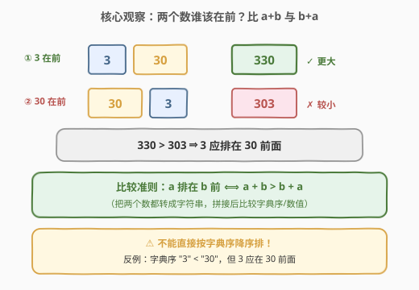

# LeetCode 最大数 题解

## 1. 题目概述

- **标题 / 题号**：最大数（#179，medium）
- **链接**：https://leetcode.cn/problems/largest-number/
- **难度**：中等
- **标签**：排序、贪心、字符串、自定义比较器

**题意**：给定一组非负整数 `nums`，将它们重新排列（每个数作为一个整体不拆分），拼成一个数，使得拼成的数**最大**。返回表示该最大数的字符串。

> ⚠️ 不能拆分单个数字的内部位（如 `34` 不能拆成 `3` 和 `4`），只能整体换位置；输出必须是字符串，因为结果可能超出 32/64 位整数范围。

**示例 1**：

```text
输入：nums = [10,2]
输出："210"
解释：2 在 10 前，拼成 "210"，比 "102" 大。
```

**示例 2**：

```text
输入：nums = [3,30,34,5,9]
输出："9534330"
```

**示例 3**：

```text
输入：nums = [0,0]
输出："0"
解释：全为 0 时不能返回 "00"，而应返回单个 "0"。
```

**约束**：

- $1 \leq \text{nums.length} \leq 100$
- $0 \leq \text{nums}[i] \leq 10^9$

> 💡 关键转化：本题不是「按数值大小排序」，也不是「按字典序排序」，而是要找一个**让拼接结果最大的全序**。两个数 `a`、`b` 谁该在前，取决于拼起来 `a+b` 大还是 `b+a` 大——这是经典的**自定义比较器**题型。

## 2. 解题思路

### 2.1 暴力思路

枚举 `nums` 的所有全排列（$n!$ 种），对每种排列拼成字符串比较大小取最大。$n=100$ 时 $100!$ 是天文数字，完全不可行。

> 💡 暴力的浪费在于：它把「两两之间的相对顺序」当作彼此独立的排列问题，而没有意识到——**只要任意相邻两数的相对顺序都最优，整体就最优**。这正是排序能解决问题的前提：存在一个一致的全序比较关系。

### 2.2 核心观察：自定义比较器 a+b vs b+a



对任意两个数 `a`、`b`（先转成字符串），它们在最终结果中只有两种相邻顺序：

- `a` 在 `b` 前 → 拼出 `a+b`
- `b` 在 `a` 前 → 拼出 `b+a`

要让整体最大，**局部**就该选更大的那种拼法。于是定义比较准则：

$$
a \text{ 排在 } b \text{ 前} \quad \Longleftrightarrow \quad a+b > b+a
$$

其中 `+` 表示字符串拼接，`>` 按字符串（数值）比较。按此准则**降序排序**后顺序拼接，即得最大数。

> ⚠️ **为什么不能直接按字典序降序？** 反例：`3` 和 `30`。字典序 `"3" < "30"`（会认为 30 更「大」），但拼起来 `"330" > "303"`，3 应该在 30 前面。字典序只比到能分出胜负的前缀就停了，而我们需要的是**拼接后的整体**大小，所以必须用 `a+b` vs `b+a` 这个「拼起来再比」的准则。

### 2.3 算法流程图


具体步骤：

1. **转字符串**：把 `nums` 中每个整数转成字符串，存入 `strs`。
2. **自定义排序**：以 `a+b > b+a` 为比较函数对 `strs` 降序排序。
3. **拼接**：按排序结果顺序拼接成 `ans`。
4. **全零特判**：若排序后**首位**是 `"0"`（说明最大元素就是 0，即所有元素都是 0），直接返回 `"0"`，避免输出 `"000…"`。

> 💡 全零特判只需检查 `strs[0] == "0"`：因为排序是降序的，首位是最大的元素；如果连最大的都是 0，那全体必为 0。

### 2.4 示例演算

以 `nums = [3,30,34,5,9]` 为例：


| 原始顺序 | 排序后 | 关键比较（决定相邻先后） | 结论 |
|----------|--------|--------------------------|------|
| 3 | 9 | 9 vs 5 → `"95" > "59"` | 9 在 5 前 |
| 30 | 5 | 34 vs 3 → `"343" > "334"` | 34 在 3 前 |
| 34 | 34 | 3 vs 30 → `"330" > "303"` | 3 在 30 前 |
| 5 | 3 | （3 vs 30 正是字典序会判反的反例） | — |
| 9 | 30 | — | — |

排序后为 `[9, 5, 34, 3, 30]`，拼接得 `"9534330"`，首位 `"9" ≠ "0"`，返回 `"9534330"` ✓。

## 3. 参考代码

### C++

```cpp
class Solution {
  public:
    string largestNumber(vector<int>& nums) {
        vector<string> strs;
        strs.reserve(nums.size());
        for (int x : nums) strs.push_back(to_string(x));

        auto cmp = [](const string& a, const string& b) {
            return a + b > b + a;   // 降序：a+b 大则 a 排在前
        };
        sort(strs.begin(), strs.end(), cmp);

        if (strs[0] == "0") return "0";   // 全 0 特判

        string ans;
        for (const string& s : strs) ans += s;
        return ans;
    }
};
```

### Python

```python
from functools import cmp_to_key
from typing import List


class Solution:
    def largestNumber(self, nums: List[int]) -> str:
        strs = list(map(str, nums))

        def cmp(a: str, b: str) -> int:
            if a + b > b + a:
                return -1   # a 排在前
            elif a + b < b + a:
                return 1
            return 0

        strs.sort(key=cmp_to_key(cmp))

        if strs[0] == "0":          # 全 0 特判
            return "0"
        return "".join(strs)
```

> ⚠️ **C++ 比较函数必须是严格弱序**：`a + b > b + a` 满足「严格小于」语义（不取等、不取 `>=`）。若写成 `>=`，当 `a+b == b+a`（如 `a=="12"`、`b=="12"`）时会同时返回 true，破坏严格弱序，导致 `std::sort` 行为未定义（甚至崩溃）。`>` 是正确的。

## 4. 复杂度分析

| 维度 | 复杂度 | 说明 |
|------|--------|------|
| 时间复杂度 | $O(n \log n \cdot L)$ | 排序做 $O(n \log n)$ 次比较，每次比较拼接两个长度至多 $L$ 的字符串，$L$ 为单个数的位数（$L \le 10$），常数级 |
| 空间复杂度 | $O(n \cdot L)$ | 存字符串数组 `strs` 及拼接结果 |

> 💡 由于 $0 \le \text{nums}[i] \le 10^9$，单个数最多 10 位，$L$ 视为常数，因此时间复杂度实际为 $O(n \log n)$，空间 $O(n)$。

## 5. 扩展：为什么「拼接比较」能用于排序？

排序要求比较关系具有**传递性**（否则 `std::sort` 的结果无意义）。这里证明 $a \succ b$（即 $a+b > b+a$）满足传递性。

**反证法**：假设 $a \succ b$ 且 $b \succ c$，但 $a \not\succ c$（即 $c \succeq a$，有 $c+a \ge a+c$）。

设 $a, b, c$ 作为数字（去前导零后）的长度分别为 $l_a, l_b, l_c$。把拼接比较转为数值不等式：

- $a \succ b$：$a \cdot 10^{l_b} + b > b \cdot 10^{l_a} + a$
- $b \succ c$：$b \cdot 10^{l_c} + c > c \cdot 10^{l_b} + b$
- $c \succeq a$：$c \cdot 10^{l_a} + a \ge a \cdot 10^{l_c} + c$

将前两式相加、移项，可推出 $a \cdot (10^{l_b}-1) > b \cdot (10^{l_a}-1)$ 及 $b \cdot (10^{l_c}-1) > c \cdot (10^{l_b}-1)$，两式相乘得 $a \cdot (10^{l_c}-1) > c \cdot (10^{l_a}-1)$，即 $a \succ c$，与假设矛盾。故传递性成立。

> 💡 **面试简化说法**：把每个字符串 $s$ 看作一个**无限循环**的周期串 $sss\cdots$，比较 $a+b$ 与 $b+a$ 等价于比较 $a$ 与 $b$ 的循环串字典序——循环串的字典序是全序，天然满足传递性。因此排序合法。记住这层直觉即可，不必背代数推导。

## 6. 面试要点

1. **为什么不能直接按字典序降序？**
   - 字典序只比前缀，而我们要的是拼接后的整体大小。反例 `3` 与 `30`：字典序 `"3" < "30"`，但 `"330" > "303"`，3 应在前。必须用 `a+b` vs `b+a` 的拼接比较。

2. **比较函数 `a+b > b+a` 是怎么想到的？**
   - 两个数在结果中相邻时只有两种排法，选拼出来更大的那种即整体更优。把这个局部最优准则作为全序比较器排序，就能保证任意相邻对都最优。

3. **怎么保证这个比较器可以用于排序？**
   - 它满足严格弱序（反自反、反对称、传递）。传递性可用「循环串字典序」直觉理解，也可用代数反证法证明（见第 5 节）。

4. **全 0 的情况怎么处理？**
   - 排序降序后，若 `strs[0] == "0"` 则全体为 0，直接返回 `"0"`，避免输出 `"000…"`。只需检查首位即可。

5. **C++ 中比较函数写成 `>=` 会有什么问题？**
   - `>=` 不是严格弱序：当 `a+b == b+a` 时 `cmp(a,b)` 与 `cmp(b,a)` 同时为真，`std::sort` 行为未定义，可能越界崩溃。必须用 `>`（或 `a+b < b+a` 配合升序）。

## 同类练习题

| # | 题目 | 与本题的关联 |
|---|------|-------------|
| 321 | [拼接最大数](https://leetcode.cn/problems/create-maximum-number/) | 同为「拼成最大数」，但要从两个数组里共选 k 个并保持相对顺序，单调栈 + 贪心，是本题的困难进阶版 |
| 406 | [根据身高重建队列](https://leetcode.cn/problems/queue-reconstruction-by-height/)（[题解](../0401-0500/406_根据身高重建队列.md)） | 自定义排序 + 贪心插入，对比「排序键设计」的另一种范式 |
| 452 | [用最少数量的箭引爆气球](https://leetcode.cn/problems/minimum-number-of-arrows-to-burst-balloons/)（[题解](../0401-0500/452_用最少数量的箭引爆气球.md)） | 按右端点排序的区间贪心，对比「排序 + 贪心」通用套路 |
| 1356 | [根据数字二进制下 1 的数目排序](https://leetcode.cn/problems/sort-integers-by-the-number-of-1-bits/) | 自定义比较函数的基础练习，巩固「比较器设计」 |
| 274 | [H 指数](https://leetcode.cn/problems/h-index/) | 排序后分析指标，同为「重新排列以优化某个全局量」的思路 |
