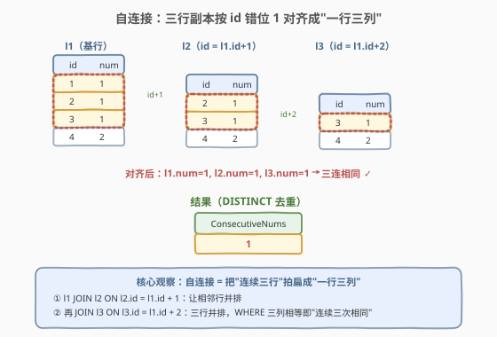
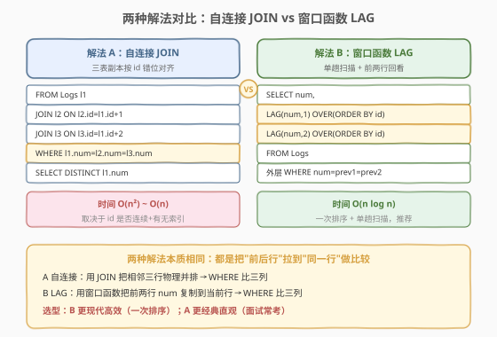
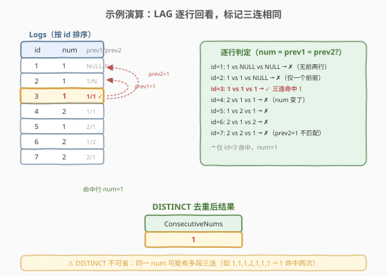

# 连续出现的数字

- **题目名称**：连续出现的数字
- **链接**：[180. 连续出现的数字](https://leetcode.cn/problems/consecutive-numbers/)
- **难度**：中等
- **标签**：SQL、自连接、窗口函数、LAG

## 1. 题目概述

给定一张 `Logs` 表，编写 SQL 查询，找出**至少连续出现三次**的所有数字。返回结果表，列名为 `ConsecutiveNums`，结果可按任意顺序返回。

**表结构**：

```text
Table: Logs
+-------------+---------+
| Column Name | Type    |
+-------------+---------+
| id          | int     |  ← 主键
| num         | int     |
+-------------+---------+
```

> 💡 **关键约束**：`id` 是主键且**自增连续**（这是判定"连续"的依据——连续指的是 `id` 相邻的行 `num` 相同，而非任意三行相同）。一个数字可能**多次**出现三连段，结果需 `DISTINCT` 去重。

**示例 1**：

```text
输入：Logs 表
+----+-----+
| id | num |
+----+-----+
| 1  | 1   |
| 2  | 1   |
| 3  | 1   |
| 4  | 2   |
| 5  | 1   |
| 6  | 2   |
| 7  | 2   |
+----+-----+
输出：
+-----------------+
| ConsecutiveNums |
+-----------------+
| 1               |
+-----------------+
解释：1 是唯一一个连续出现至少三次的数字（id=1,2,3 的 num 都是 1）。
```

**约束条件**：

- `id` 是 `Logs` 表的主键
- `num` 为 `int` 类型，可重复
- "连续"指 `id` 递增方向上相邻行的 `num` 相同

> 💡 本题是 SQL **自连接**的经典母题——核心难点不在语法，而在于把"连续三行"这个**横向时序关系**转换成"同一行的三列"以便用 `WHERE` 比较。下文给出两种解法：自连接（经典）与窗口函数 `LAG`（现代推荐）。

---

## 2. 解题思路

### 2.1 暴力思路：游标逐行扫描

最直觉的思路是按 `id` 排序后逐行扫描，维护"当前连续计数"：若 `num` 与上一行相同则计数 +1，否则重置为 1；计数达到 3 即记录该 `num`。这在过程式语言（Python/C++）中很自然，但**纯 SQL 没有循环语句**——SQL 的思维是"集合操作"，需要把"行间关系"转换为"列间关系"。

> ⚠️ SQL 处理"连续/相邻"类问题的通用套路：要么用**自连接**把相邻行物理并排（解法 A），要么用**窗口函数**把相邻行的值复制到当前行（解法 B）。两者本质相同——都是把"跨行的比较"变成"同行多列的比较"。

### 2.2 核心观察：自连接把"连续三行"拍扁成"一行三列"



**关键洞察**：要判定"连续三行 `num` 相同"，等价于把 `Logs` 复制三份 `l1`、`l2`、`l3`，让它们**按 `id` 错位对齐**——`l2.id = l1.id + 1`、`l3.id = l1.id + 2`，这样原本"第 i、i+1、i+2 行"的三个 `num` 就并排到了同一行，用 `WHERE l1.num = l2.num AND l2.num = l3.num` 一次比较即可。

$$\text{连续三同} \iff \exists\, i:\ \text{num}[i] = \text{num}[i+1] = \text{num}[i+2]$$

自连接的作用就是把上面这个**跨行条件**翻译成**同行三列相等**：

- `l1 JOIN l2 ON l2.id = l1.id + 1`：让第 i 行与第 i+1 行并排；
- `l3 JOIN l3 ON l3.id = l1.id + 2`：再让第 i+2 行并排；
- `WHERE l1.num = l2.num AND l2.num = l3.num`：三列相等即三连相同。

> 💡 **为什么用 `l1.id + 1` 而非 `l1.id = l2.id - 1`**：两者等价，但 `l2.id = l1.id + 1` 更直观——"l2 是 l1 的下一行"。连接条件依赖 `id` 连续；若 `id` 有间断（如删除过行导致跳号），此写法会漏掉跨间断的相邻行，此时应改用 `ROW_NUMBER() OVER (ORDER BY id)` 生成无间断的序号再连接。本题保证 `id` 自增连续，直接用 `id` 偏移即可。

### 2.3 两种解法流程对比



**解法 A（经典）：自连接 JOIN**——把表复制三份错位连接：

- `FROM Logs l1 JOIN Logs l2 ON l2.id = l1.id + 1 JOIN Logs l3 ON l3.id = l1.id + 2`
- `WHERE l1.num = l2.num AND l2.num = l3.num`
- `SELECT DISTINCT l1.num`

**解法 B（推荐）：窗口函数 `LAG`**——单趟扫描，把前两行的 `num` 拉到当前行：

- `LAG(num, 1) OVER (ORDER BY id)`：当前行的前 1 行 `num`；
- `LAG(num, 2) OVER (ORDER BY id)`：当前行的前 2 行 `num`；
- 外层 `WHERE num = prev1 AND num = prev2`。

> ⚠️ **`LAG` 与 `LEAD` 的方向**：`LAG(num, k)` 取"当前行**之前**第 k 行"（向后看），`LEAD(num, k)` 取"当前行**之后**第 k 行"（向前看）。本题判定"我及前两行相同"用 `LAG` 最自然；也可用 `LEAD` 改写为"我及后两行相同"，两者等价。注意 `LAG`/`LEAD` 第一行/前两行的 `prev` 为 `NULL`，`WHERE` 比较时 `NULL` 不满足 `=`，自动被过滤——无需额外处理边界。

### 2.4 示例演算



以示例数据按 `id` 排序后逐行应用 `LAG`，观察每行的 `num`、`prev1`（前 1 行）、`prev2`（前 2 行）：

| id | num | prev1 | prev2 | num=prev1=prev2? |
|----|-----|-------|-------|------------------|
| 1  | 1   | NULL  | NULL  | ✗（无前两行） |
| 2  | 1   | 1     | NULL  | ✗（仅一前驱） |
| 3  | 1   | 1     | 1     | ✓ **三连命中** |
| 4  | 2   | 1     | 1     | ✗（num 变了） |
| 5  | 1   | 2     | 1     | ✗ |
| 6  | 2   | 1     | 2     | ✗ |
| 7  | 2   | 2     | 1     | ✗（prev2=1 不匹配） |

仅 `id=3` 命中，对应 `num=1`，`DISTINCT` 去重后结果为 `{1}`。

> 💡 **`DISTINCT` 为何不可省**：若数据为 `1,1,1,2,1,1,1`，则 `id=3` 与 `id=7` 都命中，`num=1` 会被选出两次。题目要求返回"所有数字"（去重后的集合），故必须 `SELECT DISTINCT`。自连接解法中，同一 `num` 的多段三连会产生多行，同样需 `DISTINCT`。

---

## 3. 参考代码

### SQL（解法 A：自连接 JOIN，经典）

```sql
SELECT DISTINCT l1.num AS ConsecutiveNums
FROM Logs l1
JOIN Logs l2 ON l2.id = l1.id + 1
JOIN Logs l3 ON l3.id = l1.id + 2
WHERE l1.num = l2.num AND l2.num = l3.num;
```

> 💡 **写法要点**：
> - 三次 `JOIN` 把 `Logs` 自身复制三份，按 `id` 错位 1、2 对齐——`l2` 是 `l1` 的下一行，`l3` 是下下行。
> - `WHERE` 三列相等即"连续三行 `num` 相同"。注意 SQL 不能写 `l1.num = l2.num = l3.num`（链式比较非标准），须拆成两两比较。
> - `DISTINCT` 去重：同一 `num` 可能有多段三连，会产出多行。
> - 依赖 `id` 连续自增；若 `id` 有间断需改用 `ROW_NUMBER()` 生成连续序号。

### SQL（解法 B：窗口函数 LAG，推荐）

```sql
SELECT DISTINCT num AS ConsecutiveNums
FROM (
    SELECT num,
           LAG(num, 1) OVER (ORDER BY id) AS prev1,
           LAG(num, 2) OVER (ORDER BY id) AS prev2
    FROM Logs
) t
WHERE num = prev1 AND num = prev2;
```

> 💡 **写法要点**：
> - 子查询用 `LAG` 把前 1、2 行的 `num` 拉到当前行，外层 `WHERE` 比较三列相等。
> - `OVER (ORDER BY id)` 定义窗口按 `id` 排序——这是"连续"的时序依据，不可省。
> - 前两行的 `prev1`/`prev2` 为 `NULL`，`num = NULL` 恒为假（SQL 三值逻辑），自动过滤，无需 `COALESCE`。
> - 一次排序 + 单趟扫描，比自连接的多次 JOIN 更高效，是 MySQL 8.0+ 的推荐写法。

### SQL（解法 C：LEAD 向前看，等价变体）

```sql
SELECT DISTINCT num AS ConsecutiveNums
FROM (
    SELECT num,
           LEAD(num, 1) OVER (ORDER BY id) AS next1,
           LEAD(num, 2) OVER (ORDER BY id) AS next2
    FROM Logs
) t
WHERE num = next1 AND num = next2;
```

> 💡 与解法 B 对称：`LEAD` 向"后"看（id 更大的方向），判定"我及后两行相同"。语义与 `LAG` 版完全等价，选哪种看个人习惯。

### Python（pandas）

```python
import pandas as pd

def consecutive_numbers(logs: pd.DataFrame) -> pd.DataFrame:
    s = logs.sort_values('id')['num']
    mask = (s == s.shift(1)) & (s == s.shift(2))
    return pd.DataFrame({'ConsecutiveNums': s[mask].unique()})
```

> 💡 **pandas 对照**：`shift(1)` / `shift(2)` 等价于 SQL 的 `LAG(num, 1)` / `LAG(num, 2)`——把序列向后平移 k 位，前 k 行变 `NaN`。`s == s.shift(k)` 即逐行比较，`&` 合并两个条件。`unique()` 对应 SQL 的 `DISTINCT`。注意先 `sort_values('id')` 保证时序，与 SQL 的 `OVER (ORDER BY id)` 对应。

---

## 4. 复杂度分析

| 维度 | 复杂度 | 说明 |
|------|--------|------|
| **时间（解法 A 自连接）** | $O(n^2)$ ~ $O(n)$ | 最坏三表 JOIN 为 $O(n^2)$；若 `id` 有索引且连续，优化器可降为接近 $O(n)$ 的索引扫描。$n$ = Logs 行数 |
| **时间（解法 B LAG）** | $O(n \log n)$ | `LAG OVER (ORDER BY id)` 需对全表按 `id` 排序 $O(n \log n)$，排序后单趟扫描赋值 $O(n)$。若 `id` 有索引可免排序降为 $O(n)$ |
| **空间** | $O(n)$ | 窗口函数需缓存排序的中间结果；自连接需存储 JOIN 中间结果集 |
| **结果行数** | $O(k)$ | $k$ = 满足条件的不同 `num` 数，至多 $n/3$ 个（每段三连至少占 3 行） |

> ⚠️ SQL 复杂度取决于**执行计划**：自连接在最坏情况（无索引、优化器选 Nested Loop）退化为 $O(n^2)$；窗口函数只需一次排序，通常更优。面试中说明"自连接依赖 JOIN 策略、窗口函数一次排序"即可。

---

## 5. 扩展：通用化"连续 N 次"

### 5.1 自连接的局限与窗口函数的优势

本题要求"连续 3 次"，自连接写 3 个副本尚可。但若推广到"连续 N 次"，自连接需 N 个副本 + N-1 个 JOIN，写法臃肿且性能指数恶化。窗口函数的扩展性更强：

- **方法 1（分组计数法）**：用 `LAG` 找出"断点"（`num` 变化的位置），给每个连续段编号，再 `GROUP BY` 段号 `HAVING COUNT(*) >= N`。
- **方法 2（条件累积法）**：`SUM(CASE WHEN num = LAG(num) THEN 1 ELSE 0 END) OVER (...)` 累积连续计数。

### 5.2 分组计数法解"连续 N 次"

```sql
WITH marked AS (
    SELECT id, num,
           CASE WHEN num = LAG(num) OVER (ORDER BY id) THEN 0 ELSE 1 END AS is_break
    FROM Logs
),
grouped AS (
    SELECT id, num,
           SUM(is_break) OVER (ORDER BY id) AS grp
    FROM marked
)
SELECT DISTINCT num AS ConsecutiveNums
FROM grouped
GROUP BY num, grp
HAVING COUNT(*) >= 3;
```

> 💡 **思路**：每次 `num` 变化记一个"断点"（`is_break=1`，否则 0），对断点做前缀和 `SUM(is_break) OVER (ORDER BY id)` 得到 `grp`——同一段连续相同 `num` 的行 `grp` 相同。按 `(num, grp)` 分组，`HAVING COUNT(*) >= 3` 即连续段长度 ≥ 3。把 `3` 换成任意 N 即可通用化。这是 SQL 处理"岛屿问题"（Islands & Gaps）的标准套路。

### 5.3 id 不连续时的处理

若 `id` 因删除而有间断（如 1,2,4,5），`l2.id = l1.id + 1` 会漏掉跨间断的相邻行（id=2 与 id=4 视为不相邻）。此时应改用 `ROW_NUMBER()` 生成无间断的序号：

```sql
WITH ranked AS (
    SELECT num, ROW_NUMBER() OVER (ORDER BY id) AS rn FROM Logs
)
SELECT DISTINCT a.num AS ConsecutiveNums
FROM ranked a
JOIN ranked b ON b.rn = a.rn + 1
JOIN ranked c ON c.rn = a.rn + 2
WHERE a.num = b.num AND b.num = c.num;
```

> 💡 `ROW_NUMBER() OVER (ORDER BY id)` 生成 1,2,3,… 的连续序号（与 `id` 值无关），用 `rn` 替代 `id` 做错位连接即可正确处理 id 间断。本题保证 `id` 连续，无需此变换。

---

## 6. 面试要点

1. **"连续"在 SQL 中如何表达？**

   - SQL 没有循环，"连续 N 行相同"需把**跨行关系**转为**同行多列**。两种通用手段：① 自连接——表复制 N 份按 `id` 错位 JOIN，让相邻行并排；② 窗口函数 `LAG`/`LEAD`——把相邻行的值复制到当前行。两者本质都是"把前后行拉到同一行做列比较"。

2. **自连接解法为什么用 `l2.id = l1.id + 1` 而非 `l1.id = l2.id - 1`？**

   - 两者完全等价，只是书写习惯。`l2.id = l1.id + 1` 更直观地表达"l2 是 l1 的下一行"。关键是连接条件依赖 `id` 连续——若 `id` 有间断需先用 `ROW_NUMBER()` 生成无间断序号再连接。

3. **`DISTINCT` 能省吗？**

   - 不能。同一 `num` 可能有多段三连（如 `1,1,1,2,1,1,1` 中 `num=1` 命中两次），自连接会产出多行，窗口函数也会命中多行。题目要求返回"所有数字"的集合，必须 `DISTINCT` 去重。

4. **自连接和 `LAG` 哪个更好？**

   - `LAG` 更优：一次排序 + 单趟扫描，$O(n \log n)$，且扩展到"连续 N 次"更优雅（配合分组计数法）。自连接写 N 次副本性能差且写法臃肿。但自连接是 MySQL 8.0 以前（无窗口函数）的标准写法，面试中能说出两种解法并对比优劣为佳。

5. **`LAG` 的前两行 `prev` 为 `NULL`，会影响结果吗？**

   - 不会。SQL 三值逻辑中 `num = NULL` 恒为 `UNKNOWN`，`WHERE` 只保留 `TRUE` 的行，`UNKNOWN` 被过滤。故前两行自动排除，无需 `COALESCE` 或 `IS NOT NULL` 额外处理。这也是窗口函数解法比自连接更简洁的原因之一——边界由 `NULL` 语义天然覆盖。

> 💡 **一句话总结**：180 是 SQL"连续/相邻"类问题的**自连接母题**。核心套路：用自连接或 `LAG` 把"连续三行"拍扁成"一行三列"，`WHERE` 比三列相等。记住这个"跨行→同行"的转换思维，所有"连续 N 次/TopN 连续"类 SQL 题都能套用。

---

## 7. 同类练习题

- [178. 分数排名](https://leetcode.cn/problems/rank-scores/)：SQL 窗口函数 `DENSE_RANK` 母题，与本题共享 `OVER (ORDER BY ...)` 窗口语义，承接窗口函数家族
- [196. 删除重复的电子邮箱](https://leetcode.cn/problems/delete-duplicate-emails/)：SQL 自连接删除，同一张表 JOIN 自身做行间比较，承接本题的自连接思路（DELETE 场景）
- [197. 上升的温度](https://leetcode.cn/problems/rising-temperature/)：SQL `DATEDIFF` + 自连接，"相邻日期"的行间比较，是本题"相邻 id"的日期变体
- [262. 行程按用户](https://leetcode.cn/problems/trips-and-users/)：SQL 多表 JOIN + 聚合，在自连接基础上叠加业务表关联
- [1853. 所有缺失编号的最小值](https://leetcode.cn/problems/all-the-missing-numbers/)：SQL "间断/连续"检测的另一面，与本题的 id 连续性假设形成对照
