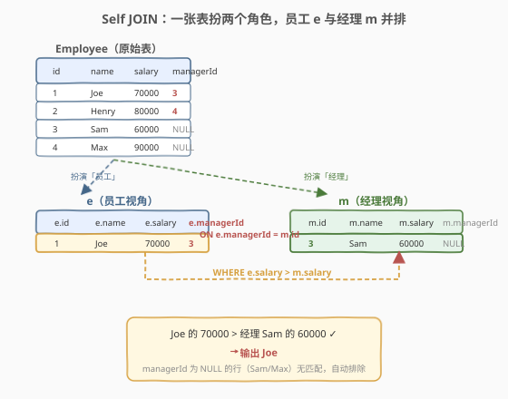
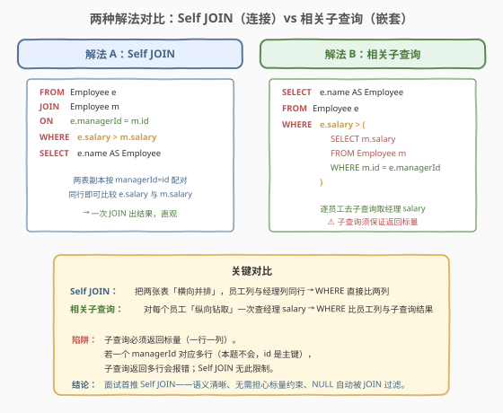
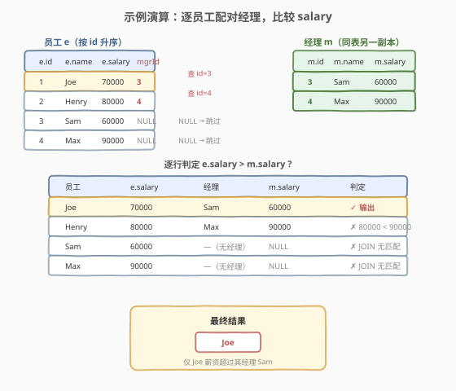

# 超过经理收入的员工

- **题目名称**：超过经理收入的员工
- **链接**：[181. 超过经理收入的员工](https://leetcode.cn/problems/employees-earning-more-than-their-managers/)
- **难度**：简单
- **标签**：SQL、Self JOIN、相关子查询

## 1. 题目概述

给定一张 `Employee` 表，表中的每一行包含员工的 `id`、`name`、`salary` 以及其经理的 `managerId`。要求编写 SQL 查询，找出**薪资严格高于其直属经理**的员工姓名。结果列名为 `Employee`，可按任意顺序返回。

**表结构**：

```text
Table: Employee
+-------------+---------+
| Column Name | Type    |
+-------------+---------+
| id          | int     |  ← 主键
| name        | varchar |
| salary      | int     |
| managerId   | int     |  ← 外键（指向 Employee.id）
+-------------+---------+
```

> 💡 **关键约束**：`managerId` 是指向 `Employee.id` 的**自引用外键**——经理也在同一张表里。`managerId` 可为 `NULL`（表示该员工是顶层管理者，没有经理），这类员工不参与比较。`id` 与 `managerId` 之间是**多对一**关系：一个经理可以带多个下属，但一个下属只有一个直属经理。

**示例 1**：

```text
输入：Employee 表
+----+-------+--------+-----------+
| id | name  | salary | managerId |
+----+-------+--------+-----------+
| 1  | Joe   | 70000  | 3         |
| 2  | Henry | 80000  | 4         |
| 3  | Sam   | 60000  | Null      |
| 4  | Max   | 90000  | Null      |
+----+-------+--------+-----------+
输出：
+----------+
| Employee |
+----------+
| Joe      |
+----------+
解释：Joe 的经理是 Sam（id=3），Joe 薪资 70000 > Sam 薪资 60000，故输出 Joe。
      Henry 的经理是 Max（id=4），Henry 薪资 80000 < Max 薪资 90000，不输出。
      Sam 和 Max 的 managerId 为 NULL（没有经理），不参与比较。
```

**约束条件**：

- `id` 是 `Employee` 表的主键
- `managerId` 是指向 `Employee.id` 的外键，可为 `NULL`
- 薪资比较为**严格大于**（`>`），等于经理不算

> 💡 本题是 SQL **自连接（Self JOIN）**的经典母题——难点不在语法，而在于**同一张表如何与自身比较**：员工和经理是同一张表的两类记录，需要把表"复制"成两份，一份扮员工、一份扮经理，再按 `managerId = id` 配对。下文给出两种解法：Self JOIN（推荐）与相关子查询。

---

## 2. 解题思路

### 2.1 暴力思路：过程式逐行查经理

最直觉的思路是用程序逐行扫描 `Employee`：对每个员工，若 `managerId` 非空，则再查一次表找到经理的 `salary`，比较二者大小。这在 Python/C++ 中很自然（两次查询 + 循环），但**纯 SQL 没有循环语句**——SQL 的思维是"集合操作"，需要把"员工行"和"经理行"放到同一行做列比较。

> ⚠️ 核心矛盾：员工的 `salary` 和经理的 `salary` **不在同一行**——它们是同一张表中的两行，靠 `e.managerId = m.id` 关联。要把这两行"拉到一起"，要么用 **Self JOIN** 把它们横向并排（解法 A），要么用**相关子查询**纵向钻取经理薪资（解法 B）。

### 2.2 核心观察：Self JOIN 把"员工行"与"经理行"并排



**关键洞察**：`Employee` 表里既有员工记录也有经理记录——经理 Sam（id=3）是 Joe 的经理，同时 Sam 自己也是表中的一行。要把"Joe 的 salary"与"Sam 的 salary"放到同一行比较，只需把 `Employee` 复制两份，分别取别名 `e`（员工视角）和 `m`（经理视角），用 `e.managerId = m.id` 连接——这样每一行就同时拥有员工的 `e.salary` 和其经理的 `m.salary`。

$$\text{员工薪资超过经理} \iff \exists\, e, m:\ e.\text{managerId} = m.\text{id}\ \wedge\ e.\text{salary} > m.\text{salary}$$

Self JOIN 的作用就是把"跨行的比较"翻译成"同行两列的比较"：

- `FROM Employee e JOIN Employee m ON e.managerId = m.id`：让员工行与经理行并排；
- `WHERE e.salary > m.salary`：同行比较两列即可。

> 💡 **`managerId = NULL` 的行去哪了？** `JOIN`（默认 `INNER JOIN`）只保留**两表都有匹配**的行。`managerId` 为 `NULL` 的员工（如 Sam、Max）找不到匹配的经理行（`NULL = m.id` 恒为 `UNKNOWN`），自动被 JOIN 丢弃——这正是我们想要的，顶层管理者无需与经理比较。无需额外写 `WHERE managerId IS NOT NULL`。对比 175 题用 `LEFT JOIN` 保留无匹配行，本题用 `INNER JOIN` 丢弃无匹配行——JOIN 类型的选择取决于"无匹配行要不要留"。

### 2.3 两种解法流程对比



**解法 A（推荐）：Self JOIN**——把表复制两份横向连接：

- `FROM Employee e JOIN Employee m ON e.managerId = m.id`
- `WHERE e.salary > m.salary`
- `SELECT e.name AS Employee`

**解法 B：相关子查询**——对每个员工纵向钻取经理薪资：

- `WHERE e.salary > (SELECT m.salary FROM Employee m WHERE m.id = e.managerId)`
- 子查询依赖外层的 `e.managerId`（相关），逐员工执行一次。

> ⚠️ **子查询的标量陷阱**：解法 B 的子查询必须返回**标量**（一行一列）。本题 `m.id` 是主键，`WHERE m.id = e.managerId` 最多匹配一行，子查询天然返回标量——安全。但若连接列非唯一（如按 `name` 关联），子查询可能返回多行而报错；Self JOIN 无此限制，多对多也能处理。此外，`managerId` 为 `NULL` 时，`m.id = NULL` 恒为 `UNKNOWN`，子查询返回空集——`e.salary > (空集)` 在 SQL 中为 `UNKNOWN`，`WHERE` 过滤掉，与 Self JOIN 行为一致。

### 2.4 示例演算



以示例数据按 `id` 升序逐员工配对经理，比较 `e.salary` 与 `m.salary`：

| 员工 | e.salary | 经理（按 managerId 查） | m.salary | 判定 |
|------|----------|------------------------|----------|------|
| Joe   | 70000 | Sam（id=3）   | 60000 | ✓ **70000 > 60000，输出 Joe** |
| Henry | 80000 | Max（id=4）   | 90000 | ✗ 80000 < 90000 |
| Sam   | 60000 | —（managerId=NULL，无匹配） | NULL | ✗ JOIN 丢弃 |
| Max   | 90000 | —（managerId=NULL，无匹配） | NULL | ✗ JOIN 丢弃 |

仅 Joe 满足条件，最终结果为 `{Joe}`。

> 💡 **JOIN 如何自动过滤 NULL 经理**：Sam 和 Max 的 `managerId` 为 `NULL`，`ON e.managerId = m.id` 即 `NULL = m.id`，在 SQL 三值逻辑中结果为 `UNKNOWN`，`INNER JOIN` 只保留 `TRUE` 的配对，`UNKNOWN` 被丢弃。这就是为什么本题用 `JOIN` 而非 `LEFT JOIN`——无经理的员工本就不该参与比较，INNER JOIN 天然过滤。

---

## 3. 参考代码

### SQL（解法 A：Self JOIN，推荐）

```sql
SELECT e.name AS Employee
FROM Employee e
JOIN Employee m ON e.managerId = m.id
WHERE e.salary > m.salary;
```

> 💡 **写法要点**：
> - 同一张 `Employee` 在 `FROM` 与 `JOIN` 中各出现一次，取别名 `e`（员工）和 `m`（经理）区分两份副本。
> - `ON e.managerId = m.id` 是连接条件：员工的 `managerId` 指向经理的 `id`。这是自引用外键的"配对钥匙"。
> - `JOIN` 默认是 `INNER JOIN`，`managerId` 为 `NULL` 的行无匹配自动被丢弃，无需 `WHERE managerId IS NOT NULL`。
> - `WHERE e.salary > m.salary` 在配对后的同行上比较两列，严格大于。
> - `SELECT e.name AS Employee` 只取员工姓名，列别名 `Employee` 满足题目输出要求。

### SQL（解法 B：相关子查询）

```sql
SELECT e.name AS Employee
FROM Employee e
WHERE e.salary > (
    SELECT m.salary
    FROM Employee m
    WHERE m.id = e.managerId
);
```

> 💡 **写法要点**：
> - 子查询 `SELECT m.salary ... WHERE m.id = e.managerId` 引用了外层查询的 `e.managerId`，是**相关子查询**——对外层每一行 `e` 执行一次。
> - `m.id` 是主键，子查询至多返回一行，满足标量上下文要求。
> - `managerId` 为 `NULL` 时，`m.id = NULL` 为 `UNKNOWN`，子查询返回空结果，`e.salary > (空)` 为 `UNKNOWN`，`WHERE` 过滤——与 Self JOIN 行为一致。
> - 语义上等价于解法 A，但写法更"过程式"，可读性略逊；面试中能说出两种解法并指出 Self JOIN 更优为佳。

### SQL（解法 C：LEFT JOIN + IS NULL 变体，思路延伸）

```sql
SELECT e.name AS Employee
FROM Employee e
LEFT JOIN Employee m ON e.managerId = m.id
WHERE e.salary > m.salary;
```

> 💡 与解法 A 几乎相同，把 `JOIN` 换成 `LEFT JOIN`。本题中两者**结果等价**：`WHERE e.salary > m.salary` 中 `m.salary` 为 `NULL` 的行（无经理的员工）因 `NULL` 比较为 `UNKNOWN` 被过滤，抵消了 LEFT JOIN 的"保留"效果。但语义上 `INNER JOIN` 更贴合题意（无经理的员工本就不该出现），推荐解法 A。

### Python（pandas）

```python
import pandas as pd

def find_employees(employee: pd.DataFrame) -> pd.DataFrame:
    merged = employee.merge(
        employee, left_on='managerId', right_on='id', suffixes=('', '_mgr')
    )
    result = merged[merged['salary'] > merged['salary_mgr']]
    return result[['name']].rename(columns={'name': 'Employee'})
```

> 💡 **pandas 对照**：`employee.merge(employee, left_on='managerId', right_on='id')` 等价于 SQL 的 `Employee e JOIN Employee m ON e.managerId = m.id`——同一 DataFrame 自连接，`left_on`/`right_on` 指定连接键。`suffixes=('', '_mgr')` 给重复列加后缀区分（`salary` 与 `salary_mgr`）。`merge` 默认 `how='inner'`，对应 INNER JOIN，`managerId` 为 `NaN` 的行无匹配自动丢弃（pandas 中 `NaN` 不参与连接键匹配）。布尔索引 `merged['salary'] > merged['salary_mgr']` 对应 `WHERE e.salary > m.salary`。

---

## 4. 复杂度分析

| 维度 | 复杂度 | 说明 |
|------|--------|------|
| **时间（解法 A Self JOIN）** | $O(n)$ ~ $O(n \log n)$ | 取决于执行计划：若 `id` 有索引（主键天然有），按 `e.managerId` 查 `m.id` 为 $O(\log n)$，总计 $O(n \log n)$；若用 Hash Join 则 $O(n)$。$n$ = Employee 行数 |
| **时间（解法 B 子查询）** | $O(n \log n)$ | 相关子查询对外层每行执行一次，每次按主键 `m.id` 索引查找 $O(\log n)$，总计 $O(n \log n)$。多数优化器会将相关子查询"解相关"改写为 JOIN，复杂度与解法 A 趋同 |
| **空间** | $O(n)$ | JOIN 中间结果集最坏 $O(n)$（每个员工恰好配对一个经理） |
| **结果行数** | $O(k)$ | $k$ = 薪资超过经理的员工数，至多 $n-1$（至少一个顶层管理者无经理不参与比较） |

> ⚠️ SQL 复杂度取决于**执行计划**：Self JOIN 在主键有索引时为 $O(n \log n)$；相关子查询虽写法上"逐行执行"，但现代优化器会自动**解相关**（decorrelation）改写为 JOIN，复杂度与 Self JOIN 趋同。面试中说明"Self JOIN 借主键索引为 $O(n \log n)$，子查询可被优化器解相关"即可。

---

## 5. 扩展：自引用关系的递归查询

### 5.1 自连接只处理"一层"关系

本题的员工-经理关系只有**一层**：员工 → 直属经理。Self JOIN 用一次连接即可配对。但若组织结构是多层树（员工 → 组长 → 总监 → VP），要查"薪资高于所有上级的员工"或"某员工的所有下属（含间接下属）"，一次 Self JOIN 不够——需要**递归查询**。

### 5.2 递归 CTE 查"全链路上级"

```sql
WITH RECURSIVE chain AS (
    SELECT id, name, salary, managerId, CAST(id AS CHAR(200)) AS path
    FROM Employee
    WHERE id = 1  -- 从某个员工出发
    UNION ALL
    SELECT e.id, e.name, e.salary, e.managerId, CONCAT(c.path, '->', e.id)
    FROM Employee e
    JOIN chain c ON e.id = c.managerId
)
SELECT * FROM chain;
```

> 💡 **递归 CTE** 由"锚点"（`WHERE id = 1` 的起始行）+ "递归体"（`JOIN chain c ON e.id = c.managerId` 沿 `managerId` 向上爬）组成，每次迭代把当前员工的经理加入结果，直到 `managerId` 为 `NULL` 终止。MySQL 8.0+、PostgreSQL、SQL Server 均支持 `WITH RECURSIVE`。这是处理组织架构树、物料 BOM、评论楼层等**自引用层级结构**的标准手段。

### 5.3 Self JOIN 的通用思维

Self JOIN 不只用于"员工-经理"——任何**同表内两行需要比较**的场景都适用：

- **树/图的邻接表**：求每个节点的父节点属性（本题就是求员工的父节点即经理的 salary）。
- **连续行比较**：180 题用 `l1.id = l2.id + 1` 自连接比较相邻行；本题用 `e.managerId = m.id` 自连接比较关联行。
- **去重/找重复**：196 题用 `p1.email = p2.email AND p1.id > p2.id` 自连接找重复邮箱。

> 💡 共同模式：给同一张表取两个别名 `a`、`b`，用 `ON` 条件表达"两行之间的关系"（相邻、同值、父子），把"行间比较"变成"列间比较"。

---

## 6. 面试要点

1. **为什么用 Self JOIN 而不是两张不同的表 JOIN？**

   - 因为员工和经理在**同一张表**里——`managerId` 是指向同表 `id` 的自引用外键。没有单独的"经理表"，只能把 `Employee` 复制两份，一份当员工（`e`）、一份当经理（`m`），用 `e.managerId = m.id` 连接。Self JOIN 的本质就是"同一张表与自身 JOIN"，别名区分两份副本的角色。

2. **`managerId` 为 `NULL` 的员工会怎样？**

   - 会被 INNER JOIN 自动丢弃。`ON e.managerId = m.id` 即 `NULL = m.id`，SQL 三值逻辑下结果为 `UNKNOWN`，INNER JOIN 只保留 `TRUE` 的配对。所以顶层管理者（无经理）不参与比较，无需手写 `WHERE managerId IS NOT NULL`。若误用 `LEFT JOIN` 则会保留这些行，但 `WHERE e.salary > m.salary` 中 `m.salary` 为 `NULL` 使比较为 `UNKNOWN` 同样被过滤——结果巧合一致，但语义上 INNER JOIN 更贴合题意。

3. **Self JOIN 和相关子查询哪个更好？**

   - Self JOIN 更优：语义清晰（"员工行与经理行并排"）、无标量约束（子查询返回多行会报错，Self JOIN 不会）、优化器友好（JOIN 是关系代数基本操作，优化器有成熟策略；相关子查询需先"解相关"才能优化）。本题因 `id` 是主键，子查询天然返回标量，两种写法结果一致；但面试中首推 Self JOIN，能说出"子查询有标量约束、可被解相关改写"为佳。

4. **为什么 `SELECT e.name` 而不是 `m.name`？**

   - 题目要的是"薪资超过经理的**员工**姓名"——员工是 `e`（被比较的一方），经理是 `m`（参照的一方）。`e.name` 是员工名，`m.name` 是经理名。若误选 `m.name` 会输出经理的名字，完全错误。区分别名的角色：`e` 是"主动方"（要输出的），`m` 是"参照方"（提供对比值的）。

5. **自连接时 `e` 和 `m` 的连接方向重要吗？**

   - `ON e.managerId = m.id` 与 `ON m.id = e.managerId` 完全等价——JOIN 条件是布尔表达式，左右对称。但 `FROM Employee e JOIN Employee m` 中 `e` 在左、`m` 在右，对于 INNER JOIN 顺序不影响结果；对于 LEFT JOIN 则决定谁是"基准表"。本题用 INNER JOIN，顺序无关。习惯上把"要输出的主体"放左（`e`）、"参照对象"放右（`m`），可读性更好。

> 💡 **一句话总结**：181 是 SQL **自连接（Self JOIN）**的入门母题。核心套路：给同一张表取两个别名，用自引用外键 `e.managerId = m.id` 把"员工行"与"经理行"并排，`WHERE e.salary > m.salary` 同行比较两列。记住这个"同表两副本配对"的思维，所有自引用关系（组织架构、邻接表、连续行）的 SQL 题都能套用。

---

## 7. 同类练习题

- [175. 组合两个表](https://leetcode.cn/problems/combine-two-tables/)：SQL JOIN 入门，两**不同**表 LEFT JOIN，对照本题的**同表** INNER JOIN，理解 JOIN 在"跨表"与"自连接"两种场景的用法
- [180. 连续出现的数字](https://leetcode.cn/problems/consecutive-numbers/)：Self JOIN 的另一形态——用 `l1.id = l2.id + 1` 把相邻行并排，与本题 `e.managerId = m.id` 用外键配对异曲同工
- [183. 从不订购的客户](https://leetcode.cn/problems/customers-who-never-order/)：跨表 LEFT JOIN + IS NULL 找"无匹配"行，对照本题 INNER JOIN 丢弃"无匹配"行，理解 JOIN 类型对无匹配行的处理差异
- [196. 删除重复的电子邮箱](https://leetcode.cn/problems/delete-duplicate-emails/)：Self JOIN + DELETE，用 `p1.email = p2.email AND p1.id > p2.id` 自连接找重复行，是本题自连接思路在 DELETE 场景的应用
- [570. 至少有5名直接下属的经理](https://leetcode.cn/problems/managers-with-at-least-5-direct-reports/)：Self JOIN + `GROUP BY` + `HAVING`，在本题自连接基础上加聚合统计，进阶自引用关系题
