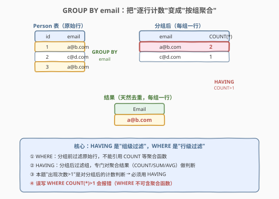
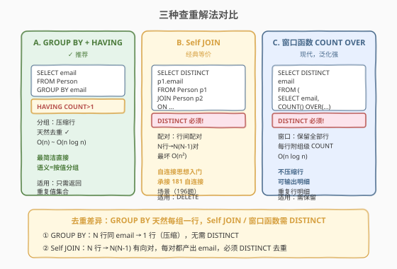
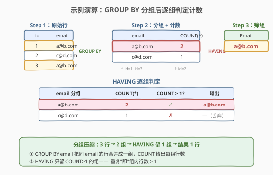

# LeetCode 查找重复的电子邮箱 题解

## 1. 题目概述

- **标题 / 题号**：查找重复的电子邮箱（#182，easy）
- **链接**：https://leetcode.cn/problems/duplicate-emails/
- **难度**：简单
- **标签**：SQL、GROUP BY、HAVING、Self JOIN、窗口函数

**题意**：给定一张 `Person` 表，编写 SQL 查询，找出**所有重复的电子邮箱**（即在表中出现**多于一次**的 email）。结果以列名 `Email` 返回，可按任意顺序。

**表结构**：

```text
Table: Person
+-------------+---------+
| Column Name | Type    |
+-------------+---------+
| id          | int     |  ← 主键
| email       | varchar |
+-------------+---------+
```

> 💡 **关键约束**：`id` 是主键（每行唯一），`email` 可重复——重复正是我们要找的目标。题目保证 `email` 全为小写字母，无需考虑大小写归一化。注意「重复」指出现**两次及以上**，仅出现一次的不算。

**示例 1**：

```text
输入：Person 表
+----+---------+
| id | email   |
+----+---------+
| 1  | a@b.com |
| 2  | c@d.com |
| 3  | a@b.com |
+----+---------+
输出：
+---------+
| Email   |
+---------+
| a@b.com |
+---------+
解释：a@b.com 出现了两次（id=1 与 id=3），是重复邮箱；c@d.com 只出现一次，不算重复。
```

**约束**：

- `id` 是 `Person` 表的主键，`email` 为 `varchar`
- `email` 全为小写字母，无大小写混用
- 「重复」定义为出现次数 $> 1$

> 💡 本题是 SQL **「查重」母题**——所有"找重复值"的 SQL 题都从这一题衍生。核心难点不在语法，而在于理解 SQL 的**分组思维**：把"逐行扫描计数"的过程式思路，转换为"按 email 分组 + 对组过滤"的集合式思路。下文给出三种解法：GROUP BY + HAVING（推荐）、Self JOIN、窗口函数。

## 2. 解题思路

### 2.1 暴力思路：逐行计数

最直觉的过程式思路是：遍历每一行，对当前行的 `email` 在全表中数出现次数，若 $>1$ 则输出。这在 Python/C++ 里是一个双重循环或哈希计数，但**纯 SQL 没有逐行循环语句**——SQL 的思维是"集合操作"，需要换一个角度：不再"对每个 email 去查全表"，而是"一次性把所有 email 按值分组，统计每组的行数"。

> ⚠️ 过程式思维（"对每个 x 数 y"）在 SQL 中的等价物几乎总是 `GROUP BY x` + 聚合函数。这是 SQL 思维方式与命令式语言最大的分水岭。

### 2.2 核心观察：GROUP BY 把"逐行计数"变成"按组聚合"



**关键洞察**：判定"某 email 重复"等价于"该 email 对应的行数 $>1$"。`GROUP BY email` 把所有相同 `email` 的行**合并成一组**，`COUNT(*)` 给出每组的行数，`HAVING COUNT(*) > 1` 留下重复组——三步一条龙，从"原始行"到"重复 email 集合"。

$$\text{email 重复} \iff \text{COUNT}(\text{email 组}) > 1$$

- `GROUP BY email`：按 `email` 值分组，相同 email 的行归入同一组；
- `COUNT(*)`：对每组计数（`*` 计所有行，含 NULL；此处 `id` 是 PK 非 NULL，用 `COUNT(id)` 等价）；
- `HAVING COUNT(*) > 1`：**分组后**过滤，留下行数 $>1$ 的组。

> 💡 **HAVING vs WHERE**：`WHERE` 在分组**前**过滤原始行（行级过滤），`HAVING` 在分组**后**过滤聚合结果（组级过滤）。本题条件是"出现次数 $>1$"——这是对**聚合后的计数**做判断，必须用 `HAVING`；若误用 `WHERE COUNT(*) > 1` 会报错（`WHERE` 不能引用聚合函数）。

### 2.3 三种解法对比



| 维度 | 解法 A：GROUP BY + HAVING | 解法 B：Self JOIN | 解法 C：窗口函数 |
|------|--------------------------|-------------------|------------------|
| **思路** | 按 email 分组，计数后筛组 | 表自连接，找同 email 不同 id 的行对 | 按 email 分窗，COUNT 拉到每行再筛 |
| **写法** | `GROUP BY email HAVING COUNT(*)>1` | `JOIN ON email 相同 AND id 不同` | `COUNT(*) OVER (PARTITION BY email)` |
| **去重** | 天然去重（每组一行） | 需 `DISTINCT`（一对会产出两行） | 需 `DISTINCT`（每行都带计数） |
| **推荐度** | ✓ **首选**，语义最直接 | 经典等价，自连接思想入门 | 现代，泛化能力强 |

> ⚠️ **解法 B 为何需 `DISTINCT`**：Self JOIN 中 `p1.email = p2.email AND p1.id <> p2.id`，对于 `a@b.com` 出现在 id=1、id=3 两行，会产生 `(1,3)` 与 `(3,1)` **两对**，结果里 `a@b.com` 出现两次，故必须 `SELECT DISTINCT` 去重。对比 GROUP BY 天然每组只输出一行，无需去重——这也是 GROUP BY 写法更简洁的原因。

### 2.4 示例演算



以示例数据 `[(1,a@b.com), (2,c@d.com), (3,a@b.com)]` 为例，观察 `GROUP BY email` 的执行过程：

| 步骤 | email 分组 | 组内行 | COUNT(*) | COUNT>1? | 输出 |
|------|-----------|--------|----------|----------|------|
| 1 | a@b.com | id=1, id=3 | 2 | ✓ | a@b.com |
| 2 | c@d.com | id=2 | 1 | ✗ | —（丢弃） |

`GROUP BY` 把 3 行按 `email` 压成 2 组，`HAVING` 留下计数为 2 的组，最终结果仅 `a@b.com` 一行。

> 💡 **分组压缩的行数规律**：`GROUP BY email` 后的行数 = 不同 `email` 值的数量（去重后的集合大小）。再经 `HAVING` 过滤，只保留重复值的集合。这与 `SELECT DISTINCT email`（也按 email 去重）的区别在于：`DISTINCT` 保留全部不同值，`GROUP BY + HAVING COUNT>1` 只保留"出现过 $>1$ 次"的子集——可以理解为 `DISTINCT` 是 `GROUP BY` 的特例（不过滤组）。

## 3. 参考代码

### SQL（解法 A：GROUP BY + HAVING，推荐）

```sql
SELECT email AS Email
FROM Person
GROUP BY email
HAVING COUNT(id) > 1;
```

> 💡 **写法要点**：
> - `GROUP BY email` 按 email 分组，相同 email 的行合并为一组。
> - `COUNT(id)` 计每组的行数（`id` 是 PK 非 NULL，等价于 `COUNT(*)`）。面试中两者皆可，但 `COUNT(id)` 更明确表达"数行数"的语义。
> - `HAVING COUNT(id) > 1` 留下重复组——`HAVING` 是**组级过滤**，必须用聚合函数做条件。
> - 结果天然每组一行，无需 `DISTINCT`。
> - 列别名 `AS Email` 满足题目要求的输出列名。

### SQL（解法 B：Self JOIN，经典等价）

```sql
SELECT DISTINCT p1.email AS Email
FROM Person p1
JOIN Person p2
  ON p1.email = p2.email
 AND p1.id <> p2.id;
```

> 💡 **写法要点**：
> - `Person` 自身 JOIN 自身，`p1`/`p2` 是同一张表的两个别名（"两个副本"）。
> - `ON p1.email = p2.email`：email 相同才算配对候选。
> - `AND p1.id <> p2.id`：排除"行和自己配对"（id 相同）的情况，只留**不同的两行同 email**。
> - `DISTINCT` 必须加：`(1,3)` 与 `(3,1)` 两对都会产出 `a@b.com`，不去重会重复输出。
> - 用 `<>` 而非 `<`：`<` 只保留一半配对可免 `DISTINCT`，但可读性差，面试写 `<>` + `DISTINCT` 更直观。

### SQL（解法 C：窗口函数 COUNT OVER，现代）

```sql
SELECT DISTINCT email AS Email
FROM (
    SELECT email,
           COUNT(id) OVER (PARTITION BY email) AS cnt
    FROM Person
) t
WHERE cnt > 1;
```

> 💡 **写法要点**：
> - 子查询用 `COUNT(id) OVER (PARTITION BY email)` 把"同 email 组的行数"拉到**每一行**上——窗口函数不在行级压缩（不像 GROUP BY），而是给每行附一个组级聚合值。
> - 外层 `WHERE cnt > 1` 筛出重复行，再 `DISTINCT` 去重（同 email 的多行都带相同 `cnt>1`，会重复）。
> - 优势在于**保留原始行**：若还需输出重复行的 `id`、其他列，窗口函数能在不丢行的前提下标记重复，GROUP BY 则会丢失明细行。

### Python（pandas）

```python
import pandas as pd

def duplicate_emails(person: pd.DataFrame) -> pd.DataFrame:
    cnt = person.groupby('email').size()
    return pd.DataFrame({'Email': cnt[cnt > 1].index})
```

> 💡 **pandas 对照**：`groupby('email').size()` 等价于 SQL 的 `GROUP BY email` + `COUNT(*)`——`size()` 计每组行数（含 NaN），`count()` 只计非空值。`cnt[cnt > 1]` 对应 `HAVING COUNT > 1`，`.index` 取出重复 email 的值。也可用 `person.duplicated('email', keep=False)` 布尔掩码，但 `groupby` 版与 SQL 语义更对齐。

## 4. 复杂度分析

| 维度 | 复杂度 | 说明 |
|------|--------|------|
| **时间（解法 A）** | $O(n)$ ~ $O(n \log n)$ | `GROUP BY` 通常用排序或哈希聚簇：排序为 $O(n \log n)$，哈希聚合为 $O(n)$（平均）。$n$ = Person 行数 |
| **时间（解法 B）** | $O(n^2)$ ~ $O(n)$ | 最坏 Self JOIN 为 $O(n^2)$；若 `email` 有索引可降为 $O(n \log k)$（$k$ = 同 email 行数）。无索引时不推荐 |
| **时间（解法 C）** | $O(n \log n)$ | `COUNT OVER (PARTITION BY email)` 需按 `email` 排序 $O(n \log n)$，排序后单趟赋值 $O(n)$ |
| **空间** | $O(n)$ | 聚合/排序的中间结果 |
| **结果行数** | $O(k)$ | $k$ = 重复 email 的不同值数，$0 \le k \le n/2$ |

> ⚠️ SQL 复杂度取决于**执行计划**：GROUP BY 在有索引时可走索引扫描免排序，Self JOIN 在无索引时退化为 $O(n^2)$。面试中说明"GROUP BY 通常 $O(n)$，Self JOIN 最坏 $O(n^2)$，故 GROUP BY + HAVING 为首选"即可。

## 5. 扩展：查重的通用范式

### 5.1 三种解法的适用边界

| 场景 | 推荐解法 | 原因 |
|------|---------|------|
| **只需返回重复值** | GROUP BY + HAVING | 语义最直接，天然去重，性能最优 |
| **需返回重复行的明细** | 窗口函数 | 保留原始行，附加计数列，不丢信息 |
| **需对重复行做删除** | Self JOIN（DELETE） | DELETE 语义需要定位具体行，承接 196 题 |
| **MySQL 5.7 及以下（无窗口函数）** | GROUP BY 或 Self JOIN | 窗口函数需 MySQL 8.0+ |

### 5.2 "至少出现 N 次"的泛化

把 `HAVING COUNT(*) > 1` 改为 `HAVING COUNT(*) >= N` 即可泛化为"至少出现 N 次"：

```sql
SELECT email AS Email
FROM Person
GROUP BY email
HAVING COUNT(id) >= 3;   -- 至少出现 3 次
```

> 💡 这是 `GROUP BY + HAVING` 范式的威力——只需改一个比较符即可适配不同阈值，而 Self JOIN 泛化到 N 次需 N 个副本 JOIN，写法臃肿。

### 5.3 多列联合查重

若重复判定基于多列组合（如同 `email` 且同 `name` 才算重复），只需在 `GROUP BY` 中列出多列：

```sql
SELECT email, name
FROM Person
GROUP BY email, name
HAVING COUNT(*) > 1;
```

> 💡 `GROUP BY` 的列数即"重复判定维度"——单列查重用 `GROUP BY email`，多列联合查重用 `GROUP BY col1, col2`，这是 SQL 查重的统一模板。

## 6. 面试要点

1. **为什么用 HAVING 而不是 WHERE？**

   - `WHERE` 在分组**前**对原始行过滤，不能引用聚合函数（如 `COUNT`）。本题条件"出现次数 $>1$"是对**分组后的计数**做判断，必须用 `HAVING`——它专门用于对 `GROUP BY` 产生的组做过滤。口诀：行级条件用 `WHERE`，组级条件用 `HAVING`。

2. **`COUNT(*)`、`COUNT(id)`、`COUNT(email)` 有区别吗？**

   - `COUNT(*)` 计所有行（含 NULL）。`COUNT(列)` 计该列非 NULL 的行数。本题 `id` 是 PK 非 NULL，三者等价。但若查重的列可能为 NULL，`COUNT(email)` 会漏掉 NULL 行（NULL 不计入），而 `COUNT(*)` 会把 NULL 行也算进组——需根据语义选择。一般查重用 `COUNT(*)` 或 `COUNT(PK)` 最稳妥。

3. **Self JOIN 解法为什么必须加 `DISTINCT`？**

   - `p1 JOIN p2 ON email 相同 AND id 不同`，对于同 email 的 N 行，每两两配对产生 $N(N-1)$ 行（有向对）。如 `a@b.com` 有 id=1、id=3 两行，产生 `(1,3)` 与 `(3,1)` 两对，`a@b.com` 出现两次。`DISTINCT` 把重复值压回一次。对比 GROUP BY 天然每组一行，无需去重——这是 GROUP BY 写法更简洁的原因。

4. **GROUP BY 和窗口函数查重的本质区别？**

   - `GROUP BY` 会**压缩行**——N 行同 email 合并为 1 行（带 COUNT），丢失明细。窗口函数 `COUNT OVER (PARTITION BY email)` **保留全部行**——每行附一个组级 COUNT，不丢信息。若只需返回重复值集合，GROUP BY 更直接；若需进一步处理重复行的明细（输出 id、关联其他表），窗口函数更灵活。

5. **如何泛化为"至少出现 N 次"或"多列联合查重"？**

   - `HAVING COUNT(*) >= N` 改一个比较符即可。多列联合查重把 `GROUP BY email` 扩为 `GROUP BY col1, col2`。这是 `GROUP BY + HAVING` 范式的统一性——所有"按值分组 + 对组过滤"的 SQL 题都套这个模板，本题是它的最简形式。

> 💡 **一句话总结**：182 是 SQL 查重的**母题**——核心就一句 `GROUP BY email HAVING COUNT(*) > 1`。考点不在写法难度，而在**理解 HAVING 与 WHERE 的边界**（组级 vs 行级过滤）以及**三种解法的去重差异**（GROUP BY 天然去重、Self JOIN/窗口函数需 DISTINCT）。记住"找重复 = 按值分组 + HAVING 计数"这条公式，所有查重 SQL 题都能套用。

## 同类练习题

| # | 题目 | 与本题的关联 |
|---|------|-------------|
| 196 | [删除重复的电子邮箱](https://leetcode.cn/problems/delete-duplicate-emails/) | 本题的 **DELETE 版**——保留每组最小 id 删除其余，Self JOIN 思想从 SELECT 进阶到 DELETE，承接 182 的查重场景 |
| 181 | [超过经理收入的员工](https://leetcode.cn/problems/employees-earning-more-than-their-managers/) | Self JOIN 入门母题，同一张表 JOIN 自身做行间比较，与 182 的 Self JOIN 解法共享"表副本配对"思想 |
| 180 | [连续出现的数字](https://leetcode.cn/problems/consecutive-numbers/) | Self JOIN + 窗口函数 `LAG`，承接 182 的"分组/窗口"两条 SQL 主线，从查重延伸到连续判定 |
| 1050 | [合作过至少三次的演员和导演](https://leetcode.cn/problems/actors-and-directors-who-cooperated-at-least-three-times/) | `GROUP BY 多列 + HAVING COUNT >= 3`，直接套用 182 的查重范式泛化到"多列联合 + 阈值 N" |
| 1084 | [销售分析 III](https://leetcode.cn/problems/sales-analysis-iii/) | `GROUP BY + HAVING + 聚合条件`，在查重范式上叠加业务条件过滤，展示 HAVING 的组级判定扩展性 |
