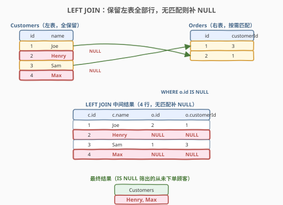
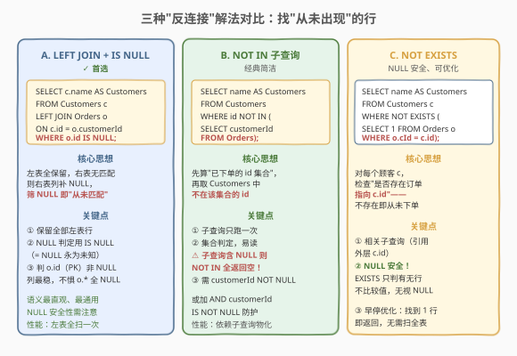
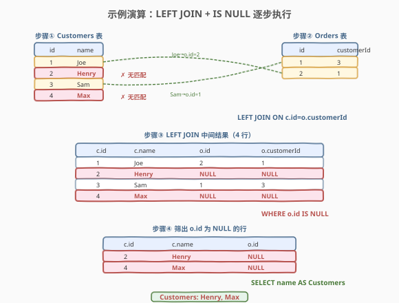

# LeetCode 从不订购的客户 题解

## 1. 题目概述

- **标题 / 题号**：从不订购的客户（#183，easy）
- **链接**：https://leetcode.cn/problems/customers-who-never-order/
- **难度**：简单
- **标签**：SQL、LEFT JOIN、NOT IN、NOT EXISTS、反连接、NULL 处理

**题意**：给定 `Customers` 表（顾客）与 `Orders` 表（订单），编写 SQL 查询找出**从未下过任何订单的顾客**。结果以列名 `Customers` 返回（顾客姓名），可按任意顺序。

**表结构**：

```text
Table: Customers
+-------------+---------+
| Column Name | Type    |
+-------------+---------+
| id          | int     |  ← 主键
| name        | varchar |
+-------------+---------+

Table: Orders
+-------------+------+
| Column Name | Type |
+-------------+------+
| id          | int  |  ← 主键
| customerId  | int  |  ← 外键 → Customers.id
+-------------+------+
```

> 💡 **关键约束**：`Customers.id` 是主键，`Orders.id` 也是主键，`Orders.customerId` 是指向 `Customers.id` 的外键——一个顾客**可以**有多笔订单（一对多），也**可以**没有订单。"从未下单"等价于"在 `Orders.customerId` 中找不到自己的 `id`"。

**示例 1**：

```text
输入：
Customers 表
+----+-------+
| id | name  |
+----+-------+
| 1  | Joe   |
| 2  | Henry |
| 3  | Sam   |
| 4  | Max   |
+----+-------+
Orders 表
+----+------------+
| id | customerId |
+----+------------+
| 1  | 3          |
| 2  | 1          |
+----+------------+
输出：
+-----------+
| Customers |
+-----------+
| Henry     |
| Max       |
+-----------+
解释：Sam(id=3) 有一笔订单、Joe(id=1) 有一笔订单；Henry(id=2) 与 Max(id=4) 在 Orders.customerId 中均未出现，故为从未下单的顾客。
```

**约束**：

- `Customers.id` 与 `Orders.id` 均为主键（非 NULL、唯一）
- `Orders.customerId` 为外键，指向 `Customers.id`
- 结果列名必须为 `Customers`

> 💡 本题是 SQL **"反连接"母题**——所有"找 A 表中在 B 表从未出现的行"都从这一题衍生。难点不在语法，而在于理解三种"反连接"写法的本质差异：`LEFT JOIN + IS NULL`（外连接补 NULL 再筛）、`NOT IN`（集合差集）、`NOT EXISTS`（相关子查询逐行判定）。三者语义等价但 **NULL 安全性**与**执行计划**不同，下文逐一拆解。

## 2. 解题思路

### 2.1 暴力思路：逐行扫描 Orders

最直觉的过程式思路是：对 `Customers` 的每一行 `c`，去 `Orders` 里扫一遍看有没有 `customerId = c.id`，没有就输出 `c.name`。这在 Python/C++ 里是一个嵌套循环，但**纯 SQL 没有逐行循环语句**——需要换三种"集合式"表达：外连接补 NULL、子查询集合差、相关子查询存在性判定。

> ⚠️ 过程式思维（"对每个顾客查订单表"）在 SQL 中有三种等价的集合式表达，选哪种取决于**可读性**与**NULL 安全性**考量。

### 2.2 核心观察：LEFT JOIN 把"无匹配"显式化为 NULL



**关键洞察**：判定"顾客从未下单"等价于"该顾客在 `Orders.customerId` 中无匹配"。`LEFT JOIN`（左外连接）会**保留左表（Customers）的全部行**，对右表（Orders）无匹配的行，右表的列一律填 `NULL`。于是"从未下单"被显式化为"`o.id IS NULL`"——原本"找不到"变成了"NULL 标记"。

$$\text{顾客从未下单} \iff \text{LEFT JOIN 后 } o.\text{id IS NULL}$$

- `FROM Customers c LEFT JOIN Orders o ON c.id = o.customerId`：左表全保留，按 `id = customerId` 配对，无匹配则 `o.*` 全 NULL；
- `WHERE o.id IS NULL`：筛出无匹配的行（即从未下单的顾客）；
- `SELECT c.name AS Customers`：取顾客姓名并起别名。

> 💡 **为何判 `o.id` 而非 `o.customerId`**：`o.id` 是 `Orders` 的主键，**非 NULL**——有匹配时一定有值、无匹配时一定为 NULL，判定最稳。`o.customerId` 虽也是外键非 NULL，但若表结构变化（如允许 NULL 的可空外键），判 `o.customerId IS NULL` 可能误把"有匹配但 customerId 恰为 NULL"的行也筛进来。**口诀：判连接是否成功，用右表的主键列（一定非 NULL）最稳。**

> ⚠️ **`IS NULL` vs `= NULL`**：SQL 中 `NULL = NULL` 的结果是 `UNKNOWN`（非 TRUE），`WHERE NULL = NULL` 会被当作假而筛掉所有行。**判 NULL 只能用 `IS NULL` / `IS NOT NULL`**，这是 SQL 三值逻辑最易踩的坑。

### 2.3 三种解法对比



| 维度 | 解法 A：LEFT JOIN + IS NULL | 解法 B：NOT IN | 解法 C：NOT EXISTS |
|------|---------------------------|----------------|---------------------|
| **思路** | 外连接补 NULL，再筛 NULL | 先算"已下单 id 集合"，取不在其中的 | 对每行检查"不存在指向它的订单" |
| **写法** | `LEFT JOIN ... WHERE o.id IS NULL` | `WHERE id NOT IN (SELECT customerId ...)` | `WHERE NOT EXISTS (SELECT 1 ... WHERE o.cId = c.id)` |
| **NULL 安全** | ✓ 安全（外连接不比较值） | ⚠ 子查询含 NULL 则全返回空 | ✓ 安全（EXISTS 只判有无行） |
| **推荐度** | ✓ **首选**，语义最直观 | 简洁但需防 NULL 陷阱 | NULL 安全，现代优化器常优化为反连接 |

> ⚠️ **解法 B 的 NULL 陷阱**：`NOT IN (SELECT customerId FROM Orders)` 若子查询结果中**含 NULL**，则 `x NOT IN (1, 3, NULL)` 对任意 `x` 都返回 `UNKNOWN`（因为 `x <> NULL` 永为 UNKNOWN），导致**整个查询返回空集**！本题 `customerId` 是外键非 NULL，不会触发；但若列可空，必须加 `AND customerId IS NOT NULL` 防护，或改用 `NOT EXISTS`。这是 `NOT IN` 与 `NOT EXISTS` 最隐蔽的差异。

### 2.4 示例演算



以示例数据 `Customers=[(1,Joe),(2,Henry),(3,Sam),(4,Max)]`、`Orders=[(id=1,cId=3),(id=2,cId=1)]` 为例，观察 `LEFT JOIN` 的执行过程：

| 步骤 | 顾客 | 匹配的订单 | o.id | o.id IS NULL? | 输出 |
|------|------|-----------|------|---------------|------|
| 1 | Joe(1) | Orders(id=2, cId=1) | 2 | ✗ | —（有订单） |
| 2 | Henry(2) | 无 | NULL | ✓ | Henry |
| 3 | Sam(3) | Orders(id=1, cId=3) | 1 | ✗ | —（有订单） |
| 4 | Max(4) | 无 | NULL | ✓ | Max |

`LEFT JOIN` 把 4 个顾客全部保留，Henry 与 Max 无匹配补 NULL，`WHERE o.id IS NULL` 筛出这两行，最终输出 `Henry`、`Max`。

> 💡 **LEFT JOIN 的行数规律**：`LEFT JOIN` 后的行数 ≥ 左表行数——左表每行至少出现一次，有匹配的可能出现多次（一对多），无匹配的补 NULL 出现一次。`WHERE o.id IS NULL` 把"有匹配"的行全过滤掉，只留补 NULL 的行，行数 = 从未下单的顾客数。对比 `INNER JOIN` 只保留有匹配的行——若用 INNER JOIN 会丢失"从未下单"的顾客，这正是必须用 LEFT JOIN 的原因。

## 3. 参考代码

### SQL（解法 A：LEFT JOIN + IS NULL，推荐）

```sql
SELECT c.name AS Customers
FROM Customers c
LEFT JOIN Orders o
    ON c.id = o.customerId
WHERE o.id IS NULL;
```

> 💡 **写法要点**：
> - `LEFT JOIN` 保留 `Customers` 全部行，`ON c.id = o.customerId` 指定匹配条件（外键关联）。
> - 无匹配的行 `o.*` 全为 NULL，`WHERE o.id IS NULL` 精准筛出这些行。
> - 判 `o.id`（Orders 主键，一定非 NULL）最稳——有匹配时一定非 NULL、无匹配时一定 NULL，判定无歧义。
> - 列别名 `AS Customers` 满足题目要求的输出列名。

### SQL（解法 B：NOT IN 子查询）

```sql
SELECT name AS Customers
FROM Customers
WHERE id NOT IN (
    SELECT customerId
    FROM Orders
);
```

> 💡 **写法要点**：
> - 子查询 `SELECT customerId FROM Orders` 先算出"已下单顾客的 id 集合"，外层 `NOT IN` 取不在该集合的 `Customers.id`。
> - 语义最接近自然语言："找出 id 不在已下单集合里的顾客"。
> - ⚠️ **NULL 陷阱**：若 `Orders.customerId` 可能为 NULL，`NOT IN` 会因 NULL 导致全返回空。本题 `customerId` 是外键非 NULL，安全；但面试中若列可空，须加 `AND customerId IS NOT NULL` 或改用 `NOT EXISTS`。

### SQL（解法 C：NOT EXISTS 相关子查询）

```sql
SELECT name AS Customers
FROM Customers c
WHERE NOT EXISTS (
    SELECT 1
    FROM Orders o
    WHERE o.customerId = c.id
);
```

> 💡 **写法要点**：
> - `NOT EXISTS` 是"相关子查询"——内层 `WHERE o.customerId = c.id` 引用了外层的 `c.id`，对每个顾客 `c` 执行一次。
> - `SELECT 1` 只判"有无行返回"，不关心列值——`EXISTS` 只看行数是否 > 0，故用 `1` 最省（也常见 `SELECT *`，语义等价）。
> - ✓ **NULL 安全**：`EXISTS` 只判定"有无匹配行"，不比较值，即使 `customerId` 含 NULL 也不影响（NULL 不等于任何 `c.id`，不会被误判为匹配）。
> - 现代优化器常把 `NOT EXISTS` 优化为与 `LEFT JOIN + IS NULL` 相同的**反连接（Anti-Join）**执行计划，性能等价。

### Python（pandas）

```python
import pandas as pd

def find_customers(customers: pd.DataFrame, orders: pd.DataFrame) -> pd.DataFrame:
    ordered_ids = set(orders['customerId'])
    mask = ~customers['id'].isin(ordered_ids)
    return customers.loc[mask, ['name']].rename(columns={'name': 'Customers'})
```

> 💡 **pandas 对照**：`~customers['id'].isin(ordered_ids)` 对应 SQL 的 `NOT IN`——先算已下单 id 集合，再取反掩码。也可用 `customers.merge(orders, left_on='id', right_on='customerId', how='left', indicator=True)` 后筛 `merge == 'left_only'`，语义对应 `LEFT JOIN + IS NULL`。`isin` 版更简洁、更接近 `NOT IN` 的集合思维。

## 4. 复杂度分析

| 维度 | 复杂度 | 说明 |
|------|--------|------|
| **时间（解法 A）** | $O(m + n)$ ~ $O(m \log m + n)$ | `LEFT JOIN` 若 `customerId` 有索引为 $O(m + n)$（索引嵌套循环）；无索引需排序或哈希，$O(m \log m + n)$。$m$ = Customers 行数，$n$ = Orders 行数 |
| **时间（解法 B）** | $O(m + n)$ | 子查询扫描 Orders 物化集合 $O(n)$，外层对每个 Customer 做集合查找 $O(m)$（哈希集合）或 $O(m \cdot n)$（无索引） |
| **时间（解法 C）** | $O(m + n)$ ~ $O(m \cdot n)$ | 相关子查询对每个顾客执行一次；`customerId` 有索引时每次 $O(1)$ 共 $O(m)$，无索引时每次全扫 $O(n)$ 共 $O(m \cdot n)$。现代优化器常改写为 Anti-Join 降到 $O(m + n)$ |
| **空间** | $O(n)$ | 子查询物化集合 / 哈希连接的中间结果 |
| **结果行数** | $O(k)$ | $k$ = 从未下单的顾客数，$0 \le k \le m$ |

> ⚠️ SQL 复杂度取决于**执行计划与索引**：三种解法在 `customerId` 有索引时性能接近（均可走索引）；无索引时 `NOT EXISTS` 的相关子查询最易退化为 $O(m \cdot n)$，而 `LEFT JOIN` 与 `NOT IN`（物化集合后哈希查找）更稳。现代优化器常把三者统一优化为 **Anti-Join**，实际执行计划可能完全相同——面试中说明"三者语义等价，优化器常统一为反连接，首选 LEFT JOIN + IS NULL 因语义最直观"即可。

## 5. 扩展：反连接的通用范式与 NULL 陷阱

### 5.1 三种"反连接"的适用边界

| 场景 | 推荐解法 | 原因 |
|------|---------|------|
| **一般"从未出现"** | LEFT JOIN + IS NULL | 语义最直观，外连接补 NULL 的思想通用 |
| **子查询列可能含 NULL** | NOT EXISTS | NULL 安全，`NOT IN` 遇 NULL 全返回空 |
| **子查询列确定非 NULL** | NOT IN 亦可 | 写法最简洁，接近自然语言 |
| **需保留左表全部列做进一步处理** | LEFT JOIN + IS NULL | 外连接结果含两表所有列，便于后续筛选 |
| **只需判定存在性、不要额外列** | NOT EXISTS | 子查询 `SELECT 1` 最轻量，早停优化 |

### 5.2 `NOT IN` 的 NULL 陷阱详解

`x NOT IN (a, b, NULL)` 等价于 `x <> a AND x <> b AND x <> NULL`。由于 `x <> NULL` 永为 `UNKNOWN`，整个表达式为 `UNKNOWN`（非 TRUE），故 `WHERE` 条件不成立——**对所有 `x` 都返回假**，结果为空集：

```sql
-- 若 Orders.customerId 含 NULL：
SELECT name FROM Customers
WHERE id NOT IN (SELECT customerId FROM Orders);
-- 结果：空集（哪怕有从未下单的顾客也查不出！）

-- 防护写法：排除 NULL
SELECT name FROM Customers
WHERE id NOT IN (
    SELECT customerId FROM Orders
    WHERE customerId IS NOT NULL
);
```

> 💡 **三值逻辑速查**：SQL 的逻辑值有 `TRUE`/`FALSE`/`UNKNOWN` 三种。`NULL` 与任何值的比较（`=`/`<>`/`<` 等）都返回 `UNKNOWN`。`WHERE` 只接受 `TRUE`（`UNKNOWN` 与 `FALSE` 同被过滤）。`NOT IN` 用 `AND` 连接多个 `<>`，遇一个 `UNKNOWN` 全军覆没；`NOT EXISTS` 只看子查询有无行返回，不比较值，故 NULL 安全——这是两者最根本的差异。

### 5.3 "找从未出现"的泛化模板

本题的"反连接"模板可泛化到所有"找 A 表中在 B 表关联列从未出现的行"场景：

```sql
-- 模板：LEFT JOIN + IS NULL
SELECT a.*
FROM A
LEFT JOIN B ON a.key = b.fk
WHERE b.pk IS NULL;

-- 模板：NOT EXISTS
SELECT a.*
FROM A a
WHERE NOT EXISTS (
    SELECT 1 FROM B b WHERE b.fk = a.key
);
```

> 💡 只需替换表名与关联键即可套用——所有"从未下单""从未评论""从未登录""从未参与"类 SQL 题都是这个模板的实例。

## 6. 面试要点

1. **为什么用 LEFT JOIN 而不是 INNER JOIN？**

   - `INNER JOIN` 只保留**两表都有匹配**的行——从未下单的顾客在 `Orders` 无匹配会被丢弃，正好是我们要找的行被过滤掉了。`LEFT JOIN` 保留左表全部行，无匹配补 NULL，才能用 `IS NULL` 把"从未下单"显式化。**口诀：找"从未出现"用外连接，找"共同出现"用内连接。**

2. **`NOT IN` 的 NULL 陷阱是什么？如何避免？**

   - `x NOT IN (子查询)` 若子查询结果含 `NULL`，因 `x <> NULL` 永为 `UNKNOWN`，`AND` 链中一个 `UNKNOWN` 使整体非 `TRUE`，导致**对所有 `x` 都返回假、结果为空集**。避免方式：① 子查询加 `WHERE col IS NOT NULL` 排除 NULL；② 改用 `NOT EXISTS`（NULL 安全，只判有无行不比较值）；③ 改用 `LEFT JOIN + IS NULL`。本题 `customerId` 是外键非 NULL，不触发，但面试须主动提及。

3. **`NOT IN`、`NOT EXISTS`、`LEFT JOIN + IS NULL` 三者性能差异？**

   - 语义等价，执行计划在现代优化器下常**统一为 Anti-Join**（反连接），性能接近。差异在无索引时：`NOT EXISTS` 的相关子查询最易退化为 $O(m \cdot n)$（每行全扫子查询）；`NOT IN` 与 `LEFT JOIN` 倾向物化/哈希，更稳。有索引时三者均可走索引，$O(m + n)$。面试答"首选 LEFT JOIN + IS NULL 因语义直观且优化器友好，NOT EXISTS 作为 NULL 安全替代，NOT IN 在确定无 NULL 时可用"。

4. **为什么判 `o.id IS NULL` 而不是 `o.customerId IS NULL`？**

   - `o.id` 是 `Orders` 主键，**一定非 NULL**——有匹配时一定有值、无匹配时一定 NULL，判定无歧义。`o.customerId` 虽也是外键非 NULL，但若表结构变化（可空外键），判它可能误把"有匹配但该列恰为 NULL"的行也筛进来。**口诀：判外连接是否成功，用右表主键列最稳。** 也常见判 `o.*` 全列但啰嗦，主键一列足矣。

5. **SQL 的三值逻辑是什么？`NULL = NULL` 结果是什么？**

   - SQL 逻辑值有 `TRUE`/`FALSE`/`UNKNOWN` 三种。`NULL` 与任何值（含另一个 `NULL`）用 `=`/`<>`/`<` 比较都返回 `UNKNOWN`，故 `NULL = NULL` 是 `UNKNOWN`（非 `TRUE`）。`WHERE` 只接受 `TRUE`，`UNKNOWN` 被过滤。判 NULL 只能用 `IS NULL`/`IS NOT NULL`——它们直接返回 `TRUE`/`FALSE`，绕过三值逻辑。这是 `NOT IN` 遇 NULL 失效、`= NULL` 永不命中的根源。

> 💡 **一句话总结**：183 是 SQL **反连接母题**——核心就一句 `LEFT JOIN ... WHERE o.id IS NULL`。考点不在写法难度，而在理解三种"反连接"写法的本质（外连接补 NULL / 集合差 / 相关子查询存在性）与 **`NOT IN` 的 NULL 陷阱**（子查询含 NULL 全返回空）。记住"找从未出现 = 外连接 + IS NULL"这条公式，所有反连接 SQL 题都能套用。

## 同类练习题

| # | 题目 | 与本题的关联 |
|---|------|-------------|
| 182 | [查找重复的电子邮箱](https://leetcode.cn/problems/duplicate-emails/) | SQL 查重母题，`GROUP BY + HAVING` 找"出现 ≥2 次"——与 183 互补：182 找"出现多次"，183 找"出现零次"，两者合起来覆盖"按出现次数筛行"的完整光谱 |
| 181 | [超过经理收入的员工](https://leetcode.cn/problems/employees-earning-more-than-their-managers/) | Self JOIN 入门母题，同一张表 JOIN 自身做行间比较，与 183 的 LEFT JOIN 共享"表关联"基础思想 |
| 175 | [组合两个表](https://leetcode.cn/problems/combine-two-tables/) | `LEFT JOIN` 入门母题，保留左表全部行——175 用 LEFT JOIN"保留全部"展示信息，183 用 LEFT JOIN + `IS NULL` 反向筛"无匹配"，同一连接的正反两面 |
| 196 | [删除重复的电子邮箱](https://leetcode.cn/problems/delete-duplicate-emails/) | DELETE 版反连接——保留每组最小 id 删除其余，Self JOIN 思想从 SELECT 延伸到 DELETE，与 183 的"筛从未出现"共享"反连接定位目标行"思想 |
| 596 | [超过 5 名学生的课](https://leetcode.cn/problems/classes-more-than-5-students/) | `GROUP BY + HAVING COUNT >= 5`，与 183 互补——596 找"出现多次"，183 找"出现零次"，均为"按出现次数筛行"范式 |
