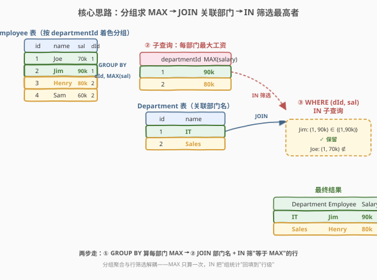
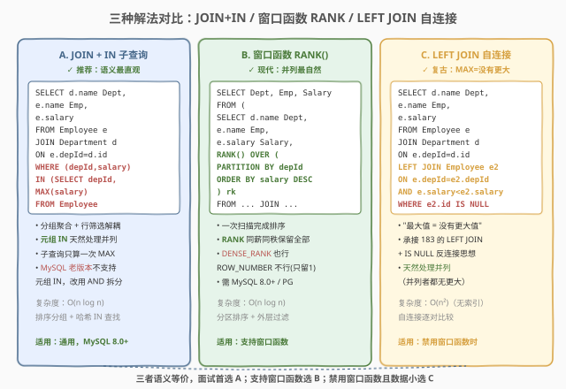
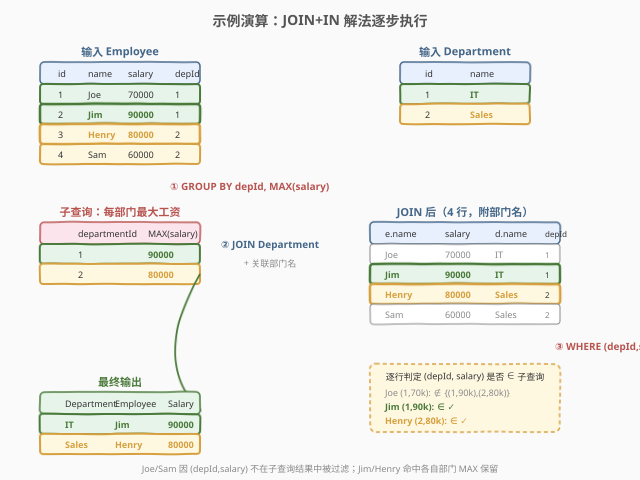

# 部门工资最高的员工

- **题目名称**：部门工资最高的员工
- **链接**：[184. 部门工资最高的员工](https://leetcode.cn/problems/department-highest-salary/)
- **难度**：中等
- **标签**：SQL、JOIN、GROUP BY、子查询、窗口函数、自连接、分组求最值

## 1. 题目概述

给定 `Employee` 表（员工，含工资与所属部门）与 `Department` 表（部门），编写 SQL 查询找出**每个部门工资最高的员工**。结果以 `Department`、`Employee`、`Salary` 三列返回，可按任意顺序。⚠️ 同一部门可能出现**并列最高**（多人工资相同且均为最大值），此时这些员工都要返回。

**表结构**：

```text
Table: Employee
+-------------+---------+
| Column Name | Type    |
+-------------+---------+
| id          | int     |  ← 主键
| name        | varchar |
| salary      | int     |
| departmentId| int     |  ← 外键 → Department.id
+-------------+---------+

Table: Department
+-------------+---------+
| Column Name | Type    |
+-------------+---------+
| id          | int     |  ← 主键
| name        | varchar |
+-------------+---------+
```

> 💡 **关键约束**：`Employee.id` 与 `Department.id` 均为主键；`Employee.departmentId` 是指向 `Department.id` 的外键——一个部门**有多名**员工（一对多）。本题目标是"按部门分组，取每组 salary 最大的那一（几）行"，是 SQL **"分组求最值"母题**。

**示例 1**：

```text
输入：
Employee 表
+----+-------+--------+--------------+
| id | name  | salary | departmentId |
+----+-------+--------+--------------+
| 1  | Joe   | 70000  | 1            |
| 2  | Jim   | 90000  | 1            |
| 3  | Henry | 80000  | 2            |
| 4  | Sam   | 60000  | 2            |
+----+-------+--------+--------------+
Department 表
+----+-------+
| id | name  |
+----+-------+
| 1  | IT    |
| 2  | Sales |
+----+-------+
输出：
+------------+----------+--------+
| Department | Employee | Salary |
+------------+----------+--------+
| IT         | Jim      | 90000  |
| Sales      | Henry    | 80000  |
+------------+----------+--------+
解释：IT 部门有 Joe(70k)、Jim(90k)，最高 Jim；Sales 部门有 Henry(80k)、Sam(60k)，最高 Henry。
```

**示例 2**（并列情况）：

```text
输入：
Employee 表
+----+-------+--------+--------------+
| id | name  | salary | departmentId |
+----+-------+--------+--------------+
| 1  | Joe   | 70000  | 1            |
| 2  | Jim   | 90000  | 1            |
| 3  | Henry | 90000  | 1            |   ← 与 Jim 并列最高
| 4  | Sam   | 60000  | 2            |
| 5  | Max   | 60000  | 2            |   ← 与 Sam 并列最高
+----+-------+--------+--------------+
输出：
+------------+----------+--------+
| Department | Employee | Salary |
+------------+----------+--------+
| IT         | Jim      | 90000  |
| IT         | Henry    | 90000  |
| Sales      | Sam      | 60000  |
| Sales      | Max      | 60000  |
+------------+----------+--------+
```

**约束条件**：

- `Employee.id`、`Department.id` 均为主键（非 NULL、唯一）
- `Employee.departmentId` 为外键，指向 `Department.id`
- 结果列名必须为 `Department`、`Employee`、`Salary`
- 并列最高者全部返回

> 💡 本题是 SQL **"分组求最值"母题**——所有"每组取最大/最小的那行"都从这一题衍生。难点不在 JOIN，而在于：① 如何把"组级聚合"（`MAX`）回填到"行级"（具体员工）；② 如何正确处理**并列**。下文给出三种解法：`JOIN + IN` 子查询（推荐）、窗口函数 `RANK()`（现代）、`LEFT JOIN` 自连接（复古，承接 183）。

---

## 2. 解题思路

### 2.1 暴力思路：逐员工扫描同部门其他人

最直觉的过程式思路是：对 `Employee` 的每一行 `e`，去同部门其他员工里扫一遍看有没有工资比 `e.salary` 更高的——没有就说明 `e` 是本部门最高。这在 Python/C++ 里是嵌套循环，但**纯 SQL 没有逐行循环语句**——需要换成三种"集合式"表达：① 先算每部门 MAX 再 IN 筛行；② 窗口函数给每行打组内排名；③ 自连接把"有没有更大"显式化为 NULL。三者殊途同归。

> ⚠️ 过程式思维（"对每个员工查同部门"）在 SQL 中有三种等价的集合式表达，选哪种取决于**可读性**与**数据库特性**（是否支持窗口函数）。

### 2.2 核心观察：分组聚合 + 行筛选解耦



**关键洞察**："每部门最高工资"是一个**组级聚合值**（一个部门一个 MAX），而要返回的是**行级信息**（具体员工姓名）。SQL 的难点正在于"组级"与"行级"不在同一层——`GROUP BY` 后只能 SELECT 聚合列或分组键，拿不到同组的员工姓名。解法是**两步解耦**：

1. **先算组级**：子查询 `SELECT departmentId, MAX(salary) FROM Employee GROUP BY departmentId` 得到每部门最大工资（一个二维表）；
2. **再筛行级**：外层 `Employee JOIN Department` 关联部门名后，用 `WHERE (departmentId, salary) IN (子查询)` 把"等于本部门 MAX"的行筛出来。

$$\text{员工为本部门最高} \iff (\text{depId}, \text{salary}) \in \{(\text{depId}, \max(\text{salary})) : \text{depId} \in \text{部门集合}\}$$

- `FROM Employee e JOIN Department d ON e.departmentId = d.id`：关联部门名（INNER JOIN 即可，员工必有部门）；
- `WHERE (e.departmentId, e.salary) IN (SELECT departmentId, MAX(salary) ... GROUP BY departmentId)`：**元组 IN** 同时匹配部门与工资两个键，精准锁定"本部门最高"。

> 💡 **为何用元组 IN 而非两个标量 IN**：`WHERE e.departmentId IN (...) AND e.salary IN (...)` 会误判——"A 部门的最高工资"与"B 部门的最高工资"凑在一起，可能把"A 部门中工资恰等于 B 部门最高"的员工也选上。**元组 IN `(depId, salary) IN (...)` 把"部门-工资"作为一个整体匹配**，严格保证"该员工在本部门内最高"，这是本题最易踩的坑。MySQL 8.0+ / PostgreSQL / SQL Server 均支持元组 IN；老旧 MySQL（5.x）若不支持，需改写为 `JOIN 子查询`（见 3.2）。

### 2.3 三种解法对比



| 维度 | 解法 A：JOIN + IN 子查询 | 解法 B：窗口函数 RANK() | 解法 C：LEFT JOIN 自连接 |
|------|------------------------|----------------------|------------------------|
| **思路** | 先算每部门 MAX，再 IN 筛"等于 MAX"的行 | 给每行打组内工资降序排名，取 `rk=1` | 找"同部门没有工资比自己高的"——最大值即无更大值 |
| **写法** | `WHERE (depId,salary) IN (SELECT depId, MAX(salary) ...)` | `RANK() OVER (PARTITION BY depId ORDER BY salary DESC)` | `LEFT JOIN Employee e2 ON 同部门 AND e.salary < e2.salary WHERE e2.id IS NULL` |
| **并列处理** | ✓ 天然保留（并列者都等于 MAX） | ✓ `RANK` 同薪同秩并列第一 | ✓ 天然保留（并列者都"无更大"） |
| **推荐度** | ✓ **首选**，语义最直观 | ✓ 现代写法，扩展到 Top-K 最优雅 | 禁用窗口函数时的备用方案 |
| **复杂度** | $O(n \log n)$（分组排序 + 哈希 IN） | $O(n \log n)$（分区排序） | $O(n^2)$（无索引自连接，最差） |

> ⚠️ **窗口函数三个孪生兄弟**：`RANK()`（同薪同秩，跳号：1,1,3）、`DENSE_RANK()`（同薪同秩，不跳号：1,1,2）、`ROW_NUMBER()`（强制唯一：1,2,3）。本题求"最高"用 `RANK` 或 `DENSE_RANK` 均可（都把并列最高者标为 1）；**绝不能用 `ROW_NUMBER`**——它给并列者也分不同号，会丢掉其中一个，破坏"并列全返回"的要求。这点在进阶题 185（前三高）中尤为关键。

> ⚠️ **解法 C 承接 183 的反连接思想**：`LEFT JOIN Employee e2 ON 同部门 AND e.salary < e2.salary` 找"比自己工资高的同部门员工"，若找不到则 `e2.id IS NULL`——这正是 183 "从未下单 = LEFT JOIN 后 IS NULL"的翻版：**"最大值 = 不存在更大的"**。两者共享"外连接补 NULL + IS NULL 筛"的骨架，只是 183 反连接两表，本题反连接自身。

### 2.4 示例演算



以示例 1 数据 `Employee=[(1,Joe,70k,1),(2,Jim,90k,1),(3,Henry,80k,2),(4,Sam,60k,2)]`、`Department=[(1,IT),(2,Sales)]` 为例，观察三步执行过程：

| 步骤 | 操作 | 结果 |
|------|------|------|
| ① | `GROUP BY departmentId, MAX(salary)` | `{(1, 90000), (2, 80000)}`（每部门最大工资） |
| ② | `Employee JOIN Department ON depId=d.id` | 4 行，每行附部门名：Joe/IT、Jim/IT、Henry/Sales、Sam/Sales |
| ③ | `WHERE (depId, salary) IN 子查询` | Jim(1,90k)∈✓、Henry(2,80k)∈✓；Joe(1,70k)∉、Sam(2,60k)∉ |

最终筛出 Jim(IT,90k) 与 Henry(Sales,80k)，正是每部门最高。

> 💡 **元组 IN 的匹配过程**：外层逐行判定 `(e.departmentId, e.salary)` 是否出现在子查询结果集 `{(1,90000),(2,80000)}` 中。Joe 的 `(1,70000)` 与 `(1,90000)` 部门相同但工资不符 → 不匹配；Jim 的 `(1,90000)` 完全等于 `(1,90000)` → 匹配。这种"双键整体匹配"严格保证"该员工在本部门内最高"，杜绝跨部门串值。若是并列（示例 2 的 Jim(1,90k) 与 Henry(1,90k)），两人元组都是 `(1,90000)`，都命中，故并列全保留。

---

## 3. 参考代码

### SQL（解法 A：JOIN + IN 子查询，推荐）

```sql
SELECT d.name AS Department,
       e.name AS Employee,
       e.salary AS Salary
FROM Employee e
JOIN Department d
    ON e.departmentId = d.id
WHERE (e.departmentId, e.salary) IN (
    SELECT departmentId, MAX(salary)
    FROM Employee
    GROUP BY departmentId
);
```

> 💡 **写法要点**：
> - 子查询 `SELECT departmentId, MAX(salary) ... GROUP BY departmentId` 先算每部门最大工资，得到一张 `(departmentId, maxSalary)` 二维表。
> - 外层 `JOIN Department` 关联部门名（INNER JOIN 即可，员工必有部门）。
> - `WHERE (e.departmentId, e.salary) IN (...)` 用**元组 IN** 同时匹配部门与工资两键——严格保证"该员工在本部门内最高"，杜绝跨部门串值。
> - 列别名 `AS Department`/`AS Employee`/`AS Salary` 满足题目要求的输出列名。
> - ⚠️ 若数据库不支持元组 IN（如老旧 MySQL 5.x），见下方解法 A'。

### SQL（解法 A'：JOIN 子查询，兼容老版本）

```sql
SELECT d.name AS Department,
       e.name AS Employee,
       e.salary AS Salary
FROM Employee e
JOIN Department d
    ON e.departmentId = d.id
JOIN (
    SELECT departmentId, MAX(salary) AS maxSalary
    FROM Employee
    GROUP BY departmentId
) m
    ON e.departmentId = m.departmentId
   AND e.salary = m.maxSalary;
```

> 💡 **写法要点**：把子查询从 `WHERE IN` 改为 `JOIN`——`JOIN 子查询 m ON e.departmentId = m.departmentId AND e.salary = m.maxSalary`。语义与元组 IN 完全等价（都是"部门+工资双键匹配"），但用 JOIN 表达，所有数据库通用，且优化器更易走哈希连接。**面试中若被追问"元组 IN 不通用怎么办"，答此 JOIN 版本**。

### SQL（解法 B：窗口函数 RANK()）

```sql
SELECT Department, Employee, Salary
FROM (
    SELECT d.name AS Department,
           e.name AS Employee,
           e.salary AS Salary,
           RANK() OVER (
               PARTITION BY e.departmentId
               ORDER BY e.salary DESC
           ) AS rk
    FROM Employee e
    JOIN Department d
        ON e.departmentId = d.id
) t
WHERE rk = 1;
```

> 💡 **写法要点**：
> - `RANK() OVER (PARTITION BY departmentId ORDER BY salary DESC)` 给每行打组内工资降序排名——同部门按工资从高到低标 1,2,3...，**同薪同秩**（并列者都是 1）。
> - `PARTITION BY departmentId` 是"分组键"，对应 `GROUP BY departmentId`；`ORDER BY salary DESC` 决定排名方向。
> - 外层 `WHERE rk = 1` 取每组第一名——并列者 rk 都是 1，全保留。
> - ✓ **扩展性最强**：求"前三高"只需把 `rk = 1` 改为 `rk <= 3`，正是进阶题 185 的标准解法（185 还需 `DENSE_RANK` 处理跨名次并列，见第 5 节）。
> - 需 MySQL 8.0+ / PostgreSQL / SQL Server 等支持窗口函数的版本。

### SQL（解法 C：LEFT JOIN 自连接）

```sql
SELECT d.name AS Department,
       e.name AS Employee,
       e.salary AS Salary
FROM Employee e
JOIN Department d
    ON e.departmentId = d.id
LEFT JOIN Employee e2
    ON e.departmentId = e2.departmentId
   AND e.salary < e2.salary
WHERE e2.id IS NULL;
```

> 💡 **写法要点**：
> - `LEFT JOIN Employee e2 ON 同部门 AND e.salary < e2.salary`：找"同部门里工资比自己高的"员工 `e2`。
> - 若**找不到**（即没有同部门的人工资比自己高），`e2.*` 全 NULL，`WHERE e2.id IS NULL` 筛出这些行——正是本部门最高者。
> - ✓ **天然处理并列**：并列最高者（如 Jim 90k 与 Henry 90k 同在 IT）互相之间 `e.salary < e2.salary` 不成立（90k < 90k 为假），LEFT JOIN 都补 NULL，两人都保留。
> - ⚠️ `ON` 条件里 `e.salary < e2.salary` 必须用**严格小于**——若用 `<=`，并列最高者会找到对方（90k ≤ 90k 为真），被误判为"有更高者"而过滤掉。
> - 复杂度 $O(n^2)$（无索引时自连接逐对比较），数据量大时性能差，仅作禁用窗口函数时的备用。

### Python（pandas）

```python
import pandas as pd

def department_highest_salary(employee: pd.DataFrame, department: pd.DataFrame) -> pd.DataFrame:
    merged = employee.merge(
        department, left_on='departmentId', right_on='id',
        suffixes=('_employee', '_department')
    )
    max_salary = merged.groupby('departmentId')['salary'].transform('max')
    result = merged[merged['salary'] == max_salary]
    return result[['name_department', 'name_employee', 'salary']].rename(columns={
        'name_department': 'Department',
        'name_employee': 'Employee',
        'salary': 'Salary'
    })
```

> 💡 **pandas 对照**：`groupby('departmentId')['salary'].transform('max')` 是 pandas 版的"窗口函数"——`transform` 把组级 MAX 广播回每行（长度与原表相同），对应 SQL 的 `RANK() OVER (PARTITION BY ...)`。`merged['salary'] == max_salary` 逐行判定，并列者都为 True 全保留，对应解法 A 的"等于 MAX 即最高"。⚠️ **不能用 `idxmax`**——它只返回第一个最大值的下标，会丢掉并列者；`transform` + 布尔掩码才能正确处理并列。

---

## 4. 复杂度分析

| 维度 | 复杂度 | 说明 |
|------|--------|------|
| **时间（解法 A）** | $O(n \log n)$ | 子查询 `GROUP BY` 排序 $O(n \log n)$（或哈希聚合 $O(n)$），外层 `JOIN` + `IN` 哈希查找 $O(n)$。$n$ = Employee 行数 |
| **时间（解法 A'）** | $O(n \log n)$ | 同 A，`JOIN 子查询` 走哈希连接，复杂度等价 |
| **时间（解法 B）** | $O(n \log n)$ | `RANK() OVER (PARTITION BY ... ORDER BY ...)` 需分区排序 $O(n \log n)$，外层过滤 $O(n)$ |
| **时间（解法 C）** | $O(n^2)$ ~ $O(n \log n)$ | 自连接逐对比较；无索引时 $O(n^2)$（每行扫全表）；`(departmentId, salary)` 有复合索引时可降到 $O(n \log n)$ |
| **空间** | $O(n)$ | 子查询物化 / 窗口函数排序缓冲 / 自连接中间结果 |
| **结果行数** | $O(k)$ | $k$ = 各部门最高员工总数（含并列），$m \le k \le n$（$m$ = 部门数） |

> ⚠️ SQL 复杂度取决于**执行计划与索引**：解法 A/B 在 `(departmentId, salary)` 有复合索引时性能最佳，可走索引嵌套循环；解法 C 的自连接最依赖索引，无索引时退化为 $O(n^2)$。现代优化器常把解法 A 的 `IN 子查询` 改写为 `SEMI-JOIN`（半连接），性能与解法 A' 的 `JOIN 子查询` 等价。面试中说明"首选 A/A'，B 在支持窗口函数时扩展性最好，C 仅作备用"即可。

---

## 5. 扩展：Top-K 求解与 RANK/DENSE_RANK/ROW_NUMBER 取舍

### 5.1 从"最高"到"前三高"：解法 B 的扩展优势

本题（184）求 Top-1，进阶题 185（部门工资前三高的所有员工）求 Top-3。三种解法在 Top-K 场景下的扩展性差异显著：

| 解法 | Top-1（184） | Top-K（185） | 扩展难度 |
|------|-------------|-------------|----------|
| **A：JOIN + IN** | `IN (SELECT MAX(salary) ...)` | 需写 K 个子查询或 `DENSE_RANK` 套娃 | ❌ 难扩展 |
| **B：窗口函数** | `WHERE rk = 1` | `WHERE rk <= 3`（改一个数字） | ✓ **最优** |
| **C：LEFT JOIN 自连接** | `COUNT(更高者) = 0` | `COUNT(更高者) < 3`（需改为子查询计数） | △ 可扩展但啰嗦 |

```sql
-- 185 标准解法：DENSE_RANK 取前三高（含跨名次并列）
SELECT Department, Employee, Salary
FROM (
    SELECT d.name AS Department, e.name AS Employee, e.salary AS Salary,
           DENSE_RANK() OVER (
               PARTITION BY e.departmentId
               ORDER BY e.salary DESC
           ) AS rk
    FROM Employee e JOIN Department d ON e.departmentId = d.id
) t
WHERE rk <= 3;
```

### 5.2 RANK vs DENSE_RANK vs ROW_NUMBER

| 函数 | 同薪排名 | 示例（工资 90,90,80,70） | 用途 |
|------|---------|------------------------|------|
| `ROW_NUMBER()` | 强制唯一 1,2,3,4 | 1,2,3,4 | 取"前 N 行"（不关心并列） |
| `RANK()` | 同薪同秩，**跳号** | 1,1,3,4 | 取"前 N 名"（跳过占用名次） |
| `DENSE_RANK()` | 同薪同秩，**不跳号** | 1,1,2,3 | 取"前 N 档"（不跳过名次） |

> 💡 **本题（184，Top-1）**：`RANK` 与 `DENSE_RANK` 结果相同（并列者都标 1），`rk = 1` 都能正确返回所有并列最高者。**进阶题 185（Top-3）**：必须用 `DENSE_RANK`——若用 `RANK`，并列第一后第三名会跳到 3，`rk <= 3` 可能漏掉本该入选的第四档；`DENSE_RANK` 不跳号，`rk <= 3` 严格取前三档工资。**绝不能用 `ROW_NUMBER`**——它给并列者分不同号，会丢人。口诀：**求"前 K 行"用 ROW_NUMBER，求"前 K 名/档"用 RANK/DENSE_RANK，区分只在跳号**。

### 5.3 "分组求最值"的泛化模板

本题的"分组取最大行"模板可泛化到所有"每组取最值对应行"场景：

```sql
-- 模板 A：JOIN + IN 子查询（Top-1）
SELECT a.*, b.name
FROM A a JOIN B b ON a.bid = b.id
WHERE (a.bid, a.val) IN (
    SELECT bid, MAX(val) FROM A GROUP BY bid
);

-- 模板 B：窗口函数（Top-K，改 N 即可）
SELECT * FROM (
    SELECT a.*, b.name,
           RANK() OVER (PARTITION BY a.bid ORDER BY a.val DESC) AS rk
    FROM A a JOIN B b ON a.bid = b.id
) t WHERE rk <= N;
```

> 💡 只需替换表名、分组键、排序值即可套用——所有"每班成绩最高""每类商品最贵""每用户最新订单"类 SQL 题都是这个模板的实例。

---

## 6. 面试要点

1. **为什么不能用 `WHERE e.salary IN (SELECT MAX(salary) ...)` 单标量 IN？**

   - `WHERE e.salary IN (SELECT MAX(salary) FROM Employee GROUP BY departmentId)` 只匹配工资数值，**丢了部门维度**——若 A 部门最高 90k、B 部门最高 80k，A 部门中工资恰为 80k 的员工（非 A 部门最高）也会被误选（80k ∈ {90k, 80k}）。必须用**元组 IN `(departmentId, salary)`** 同时匹配部门与工资两键，或改用 `JOIN 子查询 ON depId=depId AND salary=maxSalary` 双键连接，严格保证"该员工在本部门内最高"。这是本题最易踩的坑。

2. **如何处理并列最高？三种解法各自如何保证并列全返回？**

   - 解法 A：并列者的 `(depId, salary)` 元组都等于子查询中的 `(depId, MAX)`，都命中 IN，全保留。
   - 解法 B：`RANK`/`DENSE_RANK` 给同薪者相同排名（都是 1），`WHERE rk = 1` 全取。
   - 解法 C：并列最高者（如 Jim 90k、Henry 90k 同部门）互相之间 `e.salary < e2.salary` 不成立（90k < 90k 为假），LEFT JOIN 都补 NULL，都保留。
   - ⚠️ 唯一会出错的是误用 `ROW_NUMBER()`——它给并列者分不同号，会丢人。

3. **窗口函数 RANK、DENSE_RANK、ROW_NUMBER 的区别？185 该用哪个？**

   - `RANK`：同薪同秩，跳号（1,1,3）；`DENSE_RANK`：同薪同秩，不跳号（1,1,2）；`ROW_NUMBER`：强制唯一（1,2,3）。本题（Top-1）三者中 `RANK`/`DENSE_RANK` 都行（并列者都标 1）。进阶题 185（Top-3）**必须用 `DENSE_RANK`**——`RANK` 会因跳号漏掉本该入选的档位，`ROW_NUMBER` 会丢并列者。口诀："前 K 行用 ROW_NUMBER，前 K 名/档用 RANK 或 DENSE_RANK，区分只在跳号"。

4. **解法 C 的 LEFT JOIN 自连接，为什么 `ON` 条件用 `<` 而非 `<=`？**

   - `LEFT JOIN e2 ON 同部门 AND e.salary < e2.salary` 找"比自己工资**严格更高**的"——若没有，自己就是最高。若误用 `<=`（找"大于等于自己的"），并列最高者（90k 与 90k）会互相找到对方（90k ≤ 90k 为真），LEFT JOIN 不补 NULL，被判"有更高者"而过滤掉，丢掉所有并列者。**严格小于 `<` 是保证并列全保留的关键**。这一思想承接 183 的 LEFT JOIN + IS NULL 反连接：183 找"从未匹配"，本题找"从无更大"——都是"外连接补 NULL + IS NULL 筛"。

5. **三种解法性能差异？面试首选哪个？**

   - 解法 A/A'（JOIN + 子查询）：$O(n \log n)$，优化器常改写为半连接或哈希连接，性能稳定，**通用首选**。
   - 解法 B（窗口函数）：$O(n \log n)$，分区排序一次完成，扩展到 Top-K 最优雅，**支持窗口函数时优选**。
   - 解法 C（LEFT JOIN 自连接）：$O(n^2)$（无索引），最差，**仅作禁用窗口函数时的备用**。
   - 面试答："首选 A——语义直观、通用、优化器友好；若支持窗口函数选 B，扩展 Top-K 最自然；C 仅在禁用窗口函数且数据量小时用。三者语义等价，核心都是'把组级 MAX 回填到行级'。"

> 💡 **一句话总结**：184 是 SQL **"分组求最值"母题**——核心就一句 `WHERE (depId, salary) IN (SELECT depId, MAX(salary) ... GROUP BY depId)`。考点不在 JOIN 难度，而在三处：① **元组 IN 防跨部门串值**（双键整体匹配）；② **并列处理**（元组 IN / RANK / 严格小于 三种解法各自保证）；③ **Top-K 扩展**（窗口函数 `WHERE rk <= N` 最优雅，承接 185）。记住"分组聚合 + 行筛选解耦"这条公式，所有"每组取最值行"SQL 题都能套用。

---

## 7. 同类练习题

- [185. 部门工资前三高的所有员工](https://leetcode.cn/problems/department-top-three-salaries/)：184 的 Top-K 进阶版，把"最高"扩到"前三高"——标准解法把 `RANK() = 1` 改为 `DENSE_RANK() <= 3`，是窗口函数扩展性的最佳示范，必须用 `DENSE_RANK` 处理跨名次并列
- [183. 从不订购的客户](https://leetcode.cn/problems/customers-who-never-order/)：解法 C 的思想源头——`LEFT JOIN + IS NULL` 反连接，183 找"从未匹配"，184 找"从无更大"，共享"外连接补 NULL + IS NULL 筛"骨架
- [176. 第二高的薪水](https://leetcode.cn/problems/second-highest-salary/)：最大值的变种——求"第二高"，与 184 互补：176 求全局第 K 高标量值，184 求每组第 1 高对应行，两者合起来覆盖"按值排序取第 K"的完整光谱
- [177. 第N高的薪水](https://leetcode.cn/problems/nth-highest-salary/)：176 的泛化版——`LIMIT N-1, 1` 或窗口函数 `WHERE rk = N`，与 184 的 `WHERE rk = 1` 共享"窗口函数 + 排名过滤"思想，177 求全局第 N，184 求每组第 1
- [596. 超过 5 名学生的课](https://leetcode.cn/problems/classes-more-than-5-students/)：`GROUP BY + HAVING COUNT >= 5`——同属"分组聚合"家族，596 对组做计数筛选（HAVING），184 对组取最值回填行级（IN / 窗口），对比理解 `GROUP BY` 后能做什么、不能做什么
