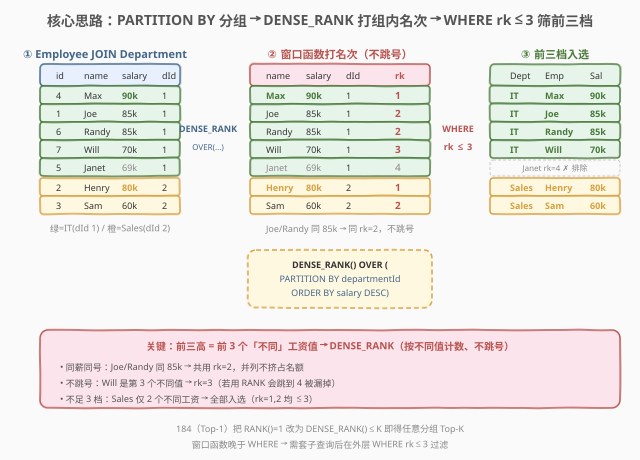
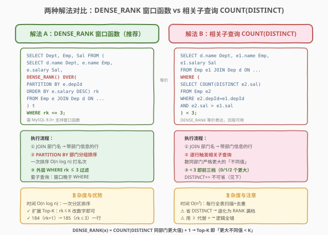
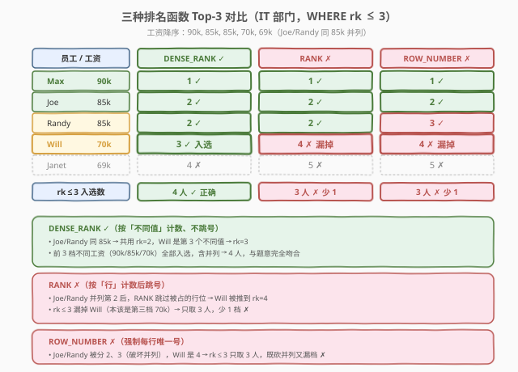

# LeetCode 部门工资前三高的所有员工 题解

## 1. 题目概述

- **标题 / 题号**：部门工资前三高的所有员工（#185，hard）
- **链接**：https://leetcode.cn/problems/department-top-three-salaries/
- **难度**：困难
- **标签**：SQL、窗口函数、DENSE_RANK、PARTITION BY、相关子查询、分组 Top-K

**题意**：给定 `Employee` 表（员工，含工资与所属部门）与 `Department` 表（部门），编写 SQL 查询找出**每个部门中工资排在「前三高」的所有员工**。一个部门的「高收入者」是指其工资在该部门的**不同**工资中**排名前三**。结果以 `Department`、`Employee`、`Salary` 三列返回，可按任意顺序。⚠️ 这里的「前三」是按**不同工资值**计数——同薪并列者共用一个名次，不占用后续名次的额度。

**表结构**：

```text
Table: Employee
+-------------+---------+
| Column Name | Type    |
+-------------+---------+
| id          | int     |  ← 主键
| name        | varchar |
| salary      | int     |
| departmentId| int     |  ← 外键 → Department.id
+-------------+---------+

Table: Department
+-------------+---------+
| Column Name | Type    |
+-------------+---------+
| id          | int     |  ← 主键
| name        | varchar |
+-------------+---------+
```

> 💡 **关键约束**：`Employee.id` 与 `Department.id` 均为主键；`Employee.departmentId` 指向 `Department.id` 的外键（一对多）。本题是 [184. 部门工资最高的员工](https://leetcode.cn/problems/department-highest-salary/) 的 **Top-K 推广**——把"每组取第 1 高"扩到"每组取前 3 高"。难点从"求一个 MAX 回填行级"升级为"求前 3 个**不同**工资值回填行级"，而这正是窗口函数 `DENSE_RANK` 的主场。

**示例 1**：

```text
输入：
Employee 表
+----+-------+--------+--------------+
| id | name  | salary | departmentId |
+----+-------+--------+--------------+
| 1  | Joe   | 85000  | 1            |
| 2  | Henry | 80000  | 2            |
| 3  | Sam   | 60000  | 2            |
| 4  | Max   | 90000  | 1            |
| 5  | Janet | 69000  | 1            |
| 6  | Randy | 85000  | 1            |
| 7  | Will  | 70000  | 1            |
+----+-------+--------+--------------+
Department 表
+----+-------+
| id | name  |
+----+-------+
| 1  | IT    |
| 2  | Sales |
+----+-------+
输出：
+------------+----------+--------+
| Department | Employee | Salary |
+------------+----------+--------+
| IT         | Max      | 90000  |
| IT         | Joe      | 85000  |
| IT         | Randy    | 85000  |
| IT         | Will     | 70000  |
| Sales      | Henry    | 80000  |
| Sales      | Sam      | 60000  |
+------------+----------+--------+
解释：
在 IT 部门：
- Max 工资最高（90000）
- Joe 与 Randy 同为 85000，并列第二高
- Will 工资是第三高（70000）
- Janet（69000）是第四高，排除
在 Sales 部门：
- Henry 工资最高（80000）
- Sam 第二高（60000）
- 只有 2 名员工（仅 2 个不同工资），全部入选
```

**约束**：

- `Employee.id`、`Department.id` 均为主键（非 NULL、唯一）
- `Employee.departmentId` 为外键，指向 `Department.id`
- 结果列名必须为 `Department`、`Employee`、`Salary`
- 没有姓名、薪资和部门**完全**相同的员工
- 并列同薪者全部返回

> 💡 本题是 SQL **"分组 Top-K"母题**——所有"每组取前 K 名"都从这一题衍生。核心矛盾在于「前三高」按**不同工资值**计数，而非按行计数：同薪并列者共用一个名次、不挤占后续名额。这把 184 的三选一（`RANK`/`DENSE_RANK` 都行，因为只取 `rk=1`）收紧为**唯一选择** `DENSE_RANK`——下文 2.4 用示例数据证明 `RANK` 与 `ROW_NUMBER` 在 Top-K 场景下都会出错。

## 2. 解题思路

### 2.1 暴力思路：套用 184 的 IN 子查询？

184 求"每部门最高"时，子查询 `SELECT departmentId, MAX(salary) ... GROUP BY departmentId` 一行搞定。直觉上把 185 当作"做三遍 184"——子查询分别取第 1、2、3 高再 `UNION` 起来。但这立刻撞墙：

- **取第 K 高没有简单的聚合函数**：`MAX` 只给第 1 高，没有 `SECOND_MAX`/`THIRD_MAX`；
- **并列同薪难处理**：第 2 高若两人并列（如 Joe/Randy 同为 85000），手写子查询极易漏人或重复；
- **不同工资值的计数逻辑**："前三高"指的是前 3 个**不同**工资值，而非前 3 行——`LIMIT 3` 会按行截断，把并列者砍掉。

> ⚠️ 本题最大的认知陷阱是混淆"前三**行**"与"前三**档（不同值）**"。题目明确"在**不同**工资中排名前三"——这是 `DENSE_RANK`（按不同值计数、不跳号）的语义，而非 `ROW_NUMBER`（按行计数）或 `RANK`（按行计数后跳号）。下文 2.4 用同一组数据对比三种函数，一眼看清差异。

过程式思维（"逐员工数比自己工资高的有几个"）在 SQL 中有两种等价的集合式表达：① 窗口函数 `DENSE_RANK()` 一次排序打号；② 相关子查询 `COUNT(DISTINCT salary > mine)` 逐行计数。前者 $O(n\log n)$，后者 $O(n^2)$，语义完全等价。

### 2.2 核心观察：DENSE_RANK + PARTITION BY + WHERE rk <= 3



**关键洞察**：题目"前三高 = 前 3 个不同工资值"逐字对应 `DENSE_RANK() OVER (PARTITION BY departmentId ORDER BY salary DESC)` 的语义——

$$\text{DENSE\_RANK}(\text{salary}_i) = \bigl|\{\,\text{salary} \in \text{同部门} \mid \text{salary} > \text{salary}_i\,\}\bigr|_{\text{distinct}} + 1$$

即"同部门里比我严格大的**不同**工资值有多少个 + 1"。这个定义天然保证：同薪 → 同名次（并列不挤占名额），且名次序列无空洞（每遇一个新值才 +1）。于是"前三高" = `WHERE rk <= 3`，一行过滤即可。

三步拆解：

1. **`PARTITION BY departmentId`**：按部门分组，每个部门内独立排名——对应"每个部门的前三高"，而非全局前三；
2. **`ORDER BY salary DESC`**：组内按工资降序，工资越高名次越小（第 1 = 最高）；
3. **`WHERE rk <= 3`**：外层过滤取前三档——并列者 rk 相同全保留，且因 `DENSE_RANK` 不跳号，第 4 档一定标 4，不会误入。

$$\text{员工为部门前三高} \iff \bigl|\{\text{同部门严格更大的不同工资}\}\bigr| < 3$$

> 💡 **为何是 `DENSE_RANK` 而非 `RANK` 或 `ROW_NUMBER`**：`RANK()` 在并列后**跳号**（两个并列第 2 后，下一个是第 4 而非第 3）——`WHERE rk <= 3` 会漏掉本该是"第三档"的员工；`ROW_NUMBER()` 给同薪者也分**不同**号，并列者会被砍掉一人。只有 `DENSE_RANK` 的"同值同号、下一名紧接"恰好满足"前三档不同值"的要求。这是 184（Top-1，三者皆可）到 185（Top-K，唯一选择）的关键升级，下文 2.4 用示例数据严格证明。

### 2.3 两种解法流程对比



**解法 A（推荐）：`DENSE_RANK` 窗口函数**——把 184 解法 B 的 `RANK() = 1` 升级为 `DENSE_RANK() <= 3`，改一个函数名 + 一个数字即得：

- 子查询里 `DENSE_RANK() OVER (PARTITION BY departmentId ORDER BY salary DESC) AS rk` 给每行打组内"不跳号"名次；
- 外层 `WHERE rk <= 3` 取前三档，并列者全保留；
- 需 MySQL 8.0+ / PostgreSQL / SQL Server 等支持窗口函数的版本。

**解法 B：相关子查询 `COUNT(DISTINCT) < 3`**——窗口函数问世前（MySQL 5.x）的标准写法，语义与 `DENSE_RANK` 完全等价：

- 对每行 `e1`，子查询统计"同部门里工资**严格更大**的**不同**值个数"；
- 该计数 `< 3` 即"我是前三档之一"——0 个更大=第 1 档，1 个=第 2 档，2 个=第 3 档，3 个及以上=第 4 档起被排除；
- `DISTINCT` 不可省：少了它会把同薪并列者重复计数，名次被拉低，退化为 `RANK` 的跳号行为。

> ⚠️ **解法 B 是 184 解法 C 的"计数版"推广**：184 求 Top-1 时，`LEFT JOIN ... IS NULL` 等价于"没有比我大的"（计数 = 0）；185 求 Top-3 时，改为"比我大的不同值 < 3"。两者共享"用相关子查询数严格更大的值"这一骨架，只是阈值从 0 放宽到 2。口诀：**`DENSE_RANK(x)` = `COUNT(DISTINCT bigger)` + 1**，Top-K 即 `COUNT(DISTINCT bigger) < K`。

### 2.4 示例演算：三种排名函数对比（本题最关键的图）



以示例 1 的 **IT 部门**数据（按工资降序）`[Max 90000, Joe 85000, Randy 85000, Will 70000, Janet 69000]` 为例，对比三种函数在 `WHERE rk <= 3` 下的输出：

| 员工 | 工资 | DENSE_RANK ✓ | RANK ✗ | ROW_NUMBER ✗ |
|------|------|-------------|--------|-------------|
| Max   | 90000 | 1            | 1      | 1           |
| Joe   | 85000 | 2            | 2      | 2           |
| Randy | 85000 | **2**        | **2**  | **3**       |
| Will  | 70000 | **3** ✓ 入选 | **4** ✗ 漏 | **4** ✗ 漏  |
| Janet | 69000 | 4 ✗ 排除     | 5 ✗    | 5 ✗         |

> 💡 **三处关键对比**：
> - **DENSE_RANK**（第 3 列）：Joe/Randy 同为 85000 都标 2，Will 是第 3 个不同值标 3，`rk <= 3` 取到 Max、Joe、Randy、Will 共 **4 人**（3 个不同工资档，含 1 个并列）——正是题目要的 ✓。
> - **RANK**（第 4 列）：Joe/Randy 并列第 2 后，Will 被**跳到第 4**（`RANK` 跳的号 = 并列占用的行数 2，所以下一个是 2+2=4），`rk <= 3` **漏掉 Will**——明明是第三档工资却被排除 ✗。
> - **ROW_NUMBER**（第 5 列）：Joe/Randy 被强制分 2、3，Will 是 4——既**破坏并列**（两人该同档却不同号），又**漏掉 Will** ✗。
>
> 一句话：Top-K 场景下，`RANK` 因跳号会"少取档"，`ROW_NUMBER` 因强制唯一会"砍并列"，只有 `DENSE_RANK` "按不同值计数、不跳号"才能正确表达"前 K 档不同值"。184 取 Top-1 时三者结果相同（都取 rk=1），所以差异被掩盖；185 一上 Top-K，差异立刻显形——这正是 185 为困难题、184 为中等题的根因。

## 3. 参考代码

### SQL（解法 A：DENSE_RANK 窗口函数，推荐）

```sql
SELECT Department, Employee, Salary
FROM (
    SELECT d.name AS Department,
           e.name AS Employee,
           e.salary AS Salary,
           DENSE_RANK() OVER (
               PARTITION BY e.departmentId
               ORDER BY e.salary DESC
           ) AS rk
    FROM Employee e
    JOIN Department d
        ON e.departmentId = d.id
) t
WHERE rk <= 3;
```

> 💡 **写法要点**：
> - `DENSE_RANK() OVER (PARTITION BY e.departmentId ORDER BY e.salary DESC)` 是完整语法：`PARTITION BY departmentId` 按部门分组（对应"每个部门"独立排名），`ORDER BY salary DESC` 组内按工资降序（高薪 = 小名次）。
> - `DENSE_RANK` 保证同薪同号、不跳号——前 3 档不同工资值的员工 rk 恰为 1/2/3，`WHERE rk <= 3` 精准锁定。
> - 外层包一层子查询是因为 `WHERE` 不能直接引用窗口函数（窗口函数在 `WHERE` 之后才计算）——这是 SQL 的逻辑执行顺序决定的：`FROM → JOIN → WHERE → GROUP BY → HAVING → SELECT(窗口) → ORDER BY`，窗口函数出现在 `SELECT` 阶段，晚于 `WHERE`，故需套子查询后在外层 `WHERE` 过滤。
> - ✓ **扩展性最强**：求"前 K 高"只需把 `rk <= 3` 改为 `rk <= K`，184（Top-1）即 `rk <= 1`，改一个数字即可泛化。
> - ⚠️ **绝不能用 `ROW_NUMBER`**（会砍并列），**不能用 `RANK`**（跳号会漏档），下文 5.2 详解三者区别。

### SQL（解法 B：相关子查询 COUNT(DISTINCT) < 3）

```sql
SELECT d.name AS Department,
       e1.name AS Employee,
       e1.salary AS Salary
FROM Employee e1
JOIN Department d
    ON e1.departmentId = d.id
WHERE (
    SELECT COUNT(DISTINCT e2.salary)
    FROM Employee e2
    WHERE e2.departmentId = e1.departmentId
      AND e2.salary > e1.salary
) < 3;
```

> 💡 **写法要点**：
> - 对每行 `e1`，子查询 `COUNT(DISTINCT e2.salary) WHERE 同部门 AND e2.salary > e1.salary` 统计"同部门里工资**严格更大**的**不同**值个数"——这恰好等于 `DENSE_RANK(e1.salary) - 1`。
> - `< 3` 即"比我大的不同值少于 3 个"= 我是前 3 档之一（0 个=第 1 档，1 个=第 2 档，2 个=第 3 档）。
> - `DISTINCT` 不可省：省掉后 `COUNT(*)` 数的是行数而非不同值数——同薪并列者会被重复计数，导致名次被拉低，退化为 `RANK` 的跳号行为（漏档）。
> - `e2.salary > e1.salary` 用**严格大于**：用 `>=` 会把自己和同薪者都算进去，每个人都"很大"，逻辑全错。
> - 此解法在 MySQL 5.7 等不支持窗口函数的旧版本中是标准写法；MySQL 8.0+ 推荐用解法 A。
> - ✓ **承接 184 解法 C 的思想**：184 求 Top-1 时"没有比我大的"（计数 = 0 → `LEFT JOIN IS NULL`）；185 求 Top-3 时"比我大的不同值 < 3"。阈值从 0 放宽到 K-1，是同一条"数严格更大者"思路的 Top-K 推广。

### Python（pandas）

```python
import pandas as pd

def top_three_salaries(employee: pd.DataFrame, department: pd.DataFrame) -> pd.DataFrame:
    merged = employee.merge(
        department, left_on='departmentId', right_on='id',
        suffixes=('_employee', '_department')
    )
    merged['rk'] = (
        merged.groupby('departmentId')['salary']
              .rank(method='dense', ascending=False)
              .astype(int)
    )
    result = merged[merged['rk'] <= 3]
    return result[['name_department', 'name_employee', 'salary']].rename(columns={
        'name_department': 'Department',
        'name_employee': 'Employee',
        'salary': 'Salary'
    })
```

> 💡 **pandas 对照**：`groupby('departmentId')['salary'].rank(method='dense', ascending=False)` 直接对应 SQL 的 `DENSE_RANK() OVER (PARTITION BY departmentId ORDER BY salary DESC)`——`groupby` = `PARTITION BY`，`method='dense'` = `DENSE_RANK`（同值同号、不跳号），`ascending=False` = 降序。`merged['rk'] <= 3` 对应外层 `WHERE rk <= 3`。
> - ⚠️ pandas `rank` 的 `method` 参数对应三种 SQL 函数：`'dense'`→`DENSE_RANK`、`'min'`→`RANK`、`'first'`→`ROW_NUMBER`。本题必须用 `'dense'`，与 SQL 选型一致。
> - ⚠️ **不能用 `nlargest(3)`**——它按行截断返回 3 行，会把并列者砍掉，对应 `ROW_NUMBER` 的错误行为；`rank(method='dense')` + 布尔掩码才能正确表达"前 3 档不同值"。

## 4. 复杂度分析

| 维度 | 复杂度 | 说明 |
|------|--------|------|
| **时间（解法 A）** | $O(n \log n)$ | `DENSE_RANK` 需对每个部门内按 `salary` 排序，整体 $O(n \log n)$（部门内排序之和），外层过滤 $O(n)$。若 `(departmentId, salary)` 有降序复合索引可免排序，降为 $O(n)$。$n$ = Employee 行数 |
| **时间（解法 B）** | $O(n^2)$ | 每行触发一次同部门范围扫描 + `COUNT(DISTINCT)` 去重，$n$ 行共 $O(n^2)$ 次比较。`(departmentId, salary)` 有复合索引时单次查询降为 $O(\log n)$，总体 $O(n \log n)$ |
| **空间** | $O(n)$ | 窗口函数需缓存分区排序的中间结果；子查询版本需 $O(k)$ 去重哈希（$k$ = 同部门不同工资数） |
| **结果行数** | $O(\min(3m_i, n_i))$ | 每部门至多 3 个不同工资档的全部员工，$m_i$ = 部门 $i$ 不同工资数，$n_i$ = 部门 $i$ 员工数。整体 $\le 3 \times$ 部门数（无并列时），有并列时更多 |

> ⚠️ SQL 复杂度取决于**执行计划与索引**：解法 A 在 `(departmentId, salary)` 有复合索引时性能最佳，可走索引有序扫描免排序；解法 B 的相关子查询最依赖索引，无索引时退化为 $O(n^2)$。现代优化器对窗口函数的分区排序有专门优化。面试中说明"首选 A（窗口函数一次排序 $O(n\log n)$、扩展 Top-K 最自然），B 仅在禁用窗口函数时用"即可。

## 5. 扩展：Top-K 泛化与三种排名函数的 Top-K 取舍

### 5.1 从 184（Top-1）到 185（Top-3）：一行之差

本题（185）与 184 共用同一套窗口函数骨架，差异仅在两处——函数名与阈值：

| 题目 | 范围 | 窗口函数 | 过滤条件 | 说明 |
|------|------|---------|---------|------|
| 184（最高） | Top-1 | `RANK`/`DENSE_RANK` 均可 | `WHERE rk = 1` | 取第 1 名，并列者都标 1，两函数结果相同 |
| 185（前三高） | Top-3 | **必须** `DENSE_RANK` | `WHERE rk <= 3` | 取前 3 档不同值，`RANK` 跳号会漏档 |

```sql
-- 184 骨架（Top-1）
SELECT ... FROM (
    SELECT ..., RANK() OVER (PARTITION BY depId ORDER BY salary DESC) AS rk
    FROM Employee e JOIN Department d ON ...
) t WHERE rk = 1;

-- 185 骨架（Top-K，改两处：RANK→DENSE_RANK，=1→<=K）
SELECT ... FROM (
    SELECT ..., DENSE_RANK() OVER (PARTITION BY depId ORDER BY salary DESC) AS rk
    FROM Employee e JOIN Department d ON ...
) t WHERE rk <= 3;
```

> 💡 184 取 Top-1 时，`RANK` 与 `DENSE_RANK` 的输出完全一致（并列者都标 1，`rk=1` 都能取到），所以 184 的题解里两者皆可、差异被掩盖。185 一上 Top-3，`RANK` 的跳号立刻导致漏档——这就是"184 中等、185 困难"的根因：**Top-K 把三函数的差异从"无所谓"放大到"会出错"**。

### 5.2 RANK vs DENSE_RANK vs ROW_NUMBER 的 Top-K 行为

对 IT 部门工资 `[90000, 85000, 85000, 70000, 69000]`（降序，含一对并列），三种函数的 Top-3（`rk <= 3`）结果：

| 函数 | 排名序列 | `rk <= 3` 取到 | Top-3 行为 | 问题 |
|------|---------|---------------|-----------|------|
| `ROW_NUMBER()` | 1, 2, 3, 4, 5 | Max, Joe, Randy（3 行） | 按**行**截断，并列者分不同号 | ✗ 砍掉并列、漏第 3 档 |
| `RANK()` | 1, 2, 2, 4, 5 | Max, Joe, Randy（3 行） | 并列同号但**跳号**，第 3 档被推到 4 | ✗ 漏掉 Will（第 3 档） |
| `DENSE_RANK()` | 1, 2, 2, 3, 4 | Max, Joe, Randy, Will（4 行） | 按**不同值**计数、不跳号 | ✓ 正确取前 3 档 |

> 💡 **本质区别**：`ROW_NUMBER` 按**行**编号（每行一号），`RANK` 按**行**计数后跳号（并列占多行位），`DENSE_RANK` 按**不同值**计数不跳号（并列共一位）。Top-K 的语义是"前 K 个**不同值**"，只有 `DENSE_RANK` 的计数单位是"不同值"。口诀：**求"前 K 行"用 `ROW_NUMBER`，求"前 K 名"用 `RANK`，求"前 K 档（不同值）"用 `DENSE_RANK`**。本题求"前 3 档不同工资"，故选 `DENSE_RANK`。

### 5.3 "分组 Top-K"泛化模板

本题的"每组取前 K 档"模板可泛化到所有"每组取 Top-K 对应行"场景：

```sql
-- 模板：分组 Top-K（按不同值取前 K 档，并列全保留）
SELECT * FROM (
    SELECT a.*, b.name,
           DENSE_RANK() OVER (PARTITION BY a.gid ORDER BY a.val DESC) AS rk
    FROM A a JOIN B b ON a.bid = b.id
) t WHERE rk <= K;
```

> 💡 只需替换表名、分组键（`gid`）、排序值（`val`）、阈值（`K`）即可套用——所有"每班前 3 名""每类商品最贵 3 款""每用户最近 3 笔订单"类 SQL 题都是这个模板的实例。若题目改为"前 K 行（不关心并列）"，把 `DENSE_RANK` 换成 `ROW_NUMBER` 即可。

## 6. 面试要点

1. **为什么必须用 `DENSE_RANK` 而不能用 `RANK` 或 `ROW_NUMBER`？**

   - 题目要求"前三高"指前 3 个**不同**工资值，并列同薪者共用一个名次、不挤占后续名额。`RANK()` 并列后**跳号**（两个并列第 2 后下一个是第 4），`WHERE rk <= 3` 会漏掉本该是"第三档"的员工；`ROW_NUMBER()` 给同薪者分**不同**号，并列者被砍掉。只有 `DENSE_RANK()`"按不同值计数、不跳号"才能正确表达"前 3 档"。184 取 Top-1 时三函数结果相同（都取 rk=1），差异被掩盖；185 一上 Top-K 差异立刻显形——这是 184 中等、185 困难的根因。

2. **为什么窗口函数要套一层子查询，不能直接 `WHERE DENSE_RANK() <= 3`？**

   - SQL 的逻辑执行顺序是 `FROM → JOIN → WHERE → GROUP BY → HAVING → SELECT(窗口函数) → ORDER BY`。窗口函数在 `SELECT` 阶段计算，**晚于 `WHERE`**，所以 `WHERE` 子句里引用不到窗口函数的别名 `rk`。必须把带窗口函数的查询包成子查询，再在外层 `WHERE rk <= 3` 过滤。这是所有"窗口函数 + 过滤"题型的通用套路，不是本题特例。

3. **解法 B 的相关子查询里 `DISTINCT` 和 `>` 为什么都不能省？**

   - `COUNT(DISTINCT e2.salary) WHERE e2.salary > e1.salary` 统计"同部门严格更大的**不同**值个数"。省 `DISTINCT` 会把同薪并列者重复计数（85000 有两人就数 2 而非 1），名次被拉低，退化为 `RANK` 的跳号行为（漏档）；用 `>=` 代替 `>` 会把自身和同薪者都算进去，每个人都"名次很高"，逻辑全错。两者分别是"数不同值"和"严格更大"的命门，缺一不可。这套写法是 `DENSE_RANK` 在无窗口函数环境下的等价表达，承接 184 解法 C 的"数严格更大者"思路（184 阈值 = 0，185 阈值 = K-1）。

4. **185 与 184 的核心差异是什么？**

   - 184 是 Top-1（每组取第 1 高），185 是 Top-3（每组取前 3 档不同值）。骨架完全相同——`PARTITION BY departmentId ORDER BY salary DESC` + 外层过滤，差异仅两处：①函数从"`RANK`/`DENSE_RANK` 皆可"收紧为"必须 `DENSE_RANK`"（Top-K 下 `RANK` 跳号会漏档）；②阈值从 `rk = 1` 放宽为 `rk <= 3`。一句话：**185 = 184 把 K 从 1 放大到 3，迫使排名函数选型从"无所谓"变为"唯一解"**。

5. **如果部门不足 3 个不同工资值怎么办？**

   - 不影响。`DENSE_RANK` 按实际不同值编号——若 Sales 部门只有 2 个不同工资（80000、60000），rk 分别为 1、2，都 `<= 3`，全部入选。`WHERE rk <= 3` 是"前 3 档**以内**"而非"恰好 3 档"，不足 3 档时取实际档数。这与 184 求最高时"即使部门只有 1 人也返回该人"一致——Top-K 在数据不足时退化为 Top-实际数。

> 💡 **一句话总结**：185 = SQL **"分组 Top-K"母题**——核心就一句 `DENSE_RANK() OVER (PARTITION BY departmentId ORDER BY salary DESC)` + 外层 `WHERE rk <= 3`。考点不在 JOIN，而在三处：① **必须 `DENSE_RANK`**（Top-K 下 `RANK` 跳号漏档、`ROW_NUMBER` 砍并列，184 的"三者皆可"在 Top-K 失效）；② **子查询套壳**（窗口函数晚于 `WHERE`，需外包一层过滤）；③ **Top-K 泛化**（184 的 `rk=1` 改 `rk<=K` 即得任意 Top-K，是窗口函数扩展性的最佳示范）。记住"分组 Top-K = `PARTITION BY` + `DENSE_RANK` + `WHERE rk <= K`"这条公式，所有"每组取前 K 名"SQL 题都能套用。

## 同类练习题

| # | 题目 | 与本题的关联 |
|---|------|-------------|
| 184 | [部门工资最高的员工](https://leetcode.cn/problems/department-highest-salary/) | 185 的 Top-1 退化版——把 `DENSE_RANK() <= 3` 收紧为 `RANK() = 1`（Top-1 下三函数皆可），是理解 185 为何"必须 DENSE_RANK"的对照基线，先做 184 再做 185 体感"Top-K 把函数选型从无所谓变为唯一解" |
| 178 | [分数排名](https://leetcode.cn/problems/rank-scores/) | `DENSE_RANK` 的语义定义题——三条规则（同分同号、不跳号）逐字对应 `DENSE_RANK() OVER (ORDER BY score DESC)`，是 185 选型的理论根基，178 教你"为什么是 DENSE_RANK"，185 教你"Top-K 下不是 DENSE_RANK 会怎样出错" |
| 177 | [第N高的薪水](https://leetcode.cn/problems/nth-highest-salary/) | 全局第 N 高标量值——`DENSE_RANK() WHERE rk = N`，与 185 的 `WHERE rk <= 3` 共享"窗口函数 + 排名过滤"骨架，177 是全局 Top-N（无 `PARTITION BY`），185 是分组 Top-K（有 `PARTITION BY`），对比理解分组维度的作用 |
| 176 | [第二高的薪水](https://leetcode.cn/problems/second-highest-salary/) | 177 的 N=2 特例——求全局第 2 高，与 185 互补：176/177 求"全局第 K 名"单个标量值，185 求"每组前 K 档"全部行，两者合起来覆盖"按值排序取第 K"的完整光谱 |
| 180 | [连续出现的数字](https://leetcode.cn/problems/consecutive-numbers/) | SQL 自连接经典题——`JOIN` 自身错位 3 行判连续，与 185 的相关子查询解法 B 同属"无窗口函数时的自连接/子查询套路"，对比"窗口函数"与"自连接"两类 SQL 思维 |
