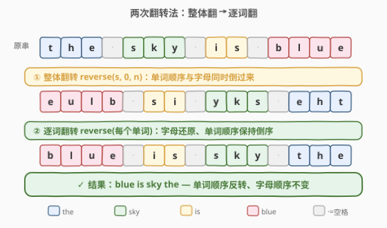
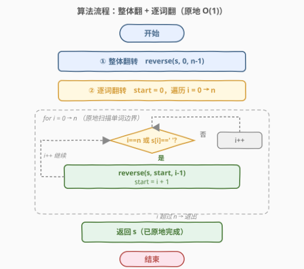
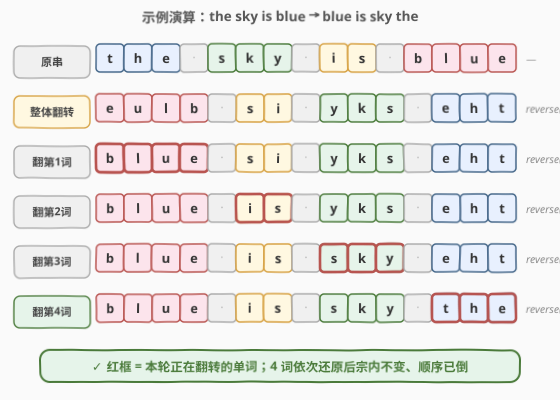

# 反转字符串中的单词 II

- **题目名称**：反转字符串中的单词 II
- **链接**：[186. 反转字符串中的单词 II](https://leetcode.cn/problems/reverse-words-in-a-string-ii/)
- **难度**：中等
- **标签**：字符串、双指针、原地算法

## 1. 题目概述

给你一个**字符数组** `s`，反转其中**单词**的顺序。

- **单词**的定义为：由非空格字符组成的连续序列。`s` 中的单词将会由**单个空格**分隔。
- 必须设计并实现**原地**解法来解决此问题，即**不分配额外的空间**（$O(1)$ 额外空间）。

> ⚠️ 与 [151. 反转字符串中的单词](../0101-0200/151_反转字符串中的单词.md) 的区别：151 的输入是字符串、可能含前导/后随/多余空格；**186 的输入是可变字符数组**，且**保证无多余空格**（单词间恰好单个空格、无首尾空格）。因此 186 不需要 151 里的「压缩空格」步骤，直接考察两次翻转的**原地核心**。

**示例 1**：

```text
输入：s = ["t","h","e"," ","s","k","y"," ","i","s"," ","b","l","u","e"]
输出：["b","l","u","e"," ","i","s"," ","s","k","y"," ","t","h","e"]
解释：单词顺序由 "the sky is blue" 反转为 "blue is sky the"，每个单词内部字母顺序不变。
```

**示例 2**：

```text
输入：s = ["a"]
输出：["a"]
解释：只有一个单词，反转后仍是自身。
```

**约束条件**：

- $1 \le \text{s.length} \le 10^5$
- `s[i]` 可以是一个英文字母（大写或小写）、数字、或是空格 `' '`
- `s` 中**至少存在一个单词**
- `s` **不含前导或尾随空格**
- 题目数据保证：`s` 中的每个单词都由**单个空格**分隔

> 💡 **关键约束**：无多余空格 + 原地 $O(1)$ 空间。前者省去了 151 的压缩步骤，后者排除了「`split` + 反转 + `join`」的偷懒做法，必须真正在字符数组上操作。

---

## 2. 解题思路

### 2.1 暴力思路：开新数组

用 $O(n)$ 额外空间存放结果：从右向左扫描 `s`，遇到单词就拷到新数组。时间 $O(n)$、空间 $O(n)$。

简单正确，但**违反原题「原地、不分配额外空间」的要求**，面试会被追问「能否 $O(1)$ 空间」。

### 2.2 核心观察：两次翻转法（整体翻 + 逐词翻）



关键洞察是：**「反转单词顺序」可以分解为两次字符级翻转**，且两步都能用首尾双指针 $O(1)$ 空间原地完成。

设字符数组为 `W1 W2 ... Wk`（每个 `Wi` 是一个单词，用单个空格分隔）。则：

1. **整体翻转** `reverse(0, n)` 后变成 `Wkᴿ ... W2ᴿ W1ᴿ`（单词顺序倒了过来，每个单词的字母也被翻了过来）。
2. **逐词翻转**每个单词的字母，把 `Wiᴿ` 还原成 `Wi`，得到 `Wk ... W2 W1`。

这正是我们想要的「单词顺序反转、单词内部不变」。

> 💡 **为什么成立**：整体翻转同时做了两件事——把单词顺序倒了过来，也把每个单词的字母顺序倒了过来。再对每个单词单独翻转一次，字母顺序恢复原状，而单词之间的相对顺序仍是整体翻转后的「倒序」。两次翻转恰好**抵消字母级别的翻转、保留单词级别的翻转**。

> ⚠️ **顺序无关性**：其实「先逐词翻、再整体翻」也得到同样结果（两种操作在「单词顺序」这一维度上可交换）。本文采用「整体翻 → 逐词翻」的顺序，与 [151](../0101-0200/151_反转字符串中的单词.md) 保持一致，便于对照阅读——186 正是 151 去掉「压缩空格」步骤后的原地核心。

### 2.3 算法流程图



两步均用**首尾双指针**实现翻转：

- `reverse(l, r)`：`l` 从左、`r` 从右向中间走，每次交换 `s[l]` 与 `s[r]`，直到 `l >= r`。
- **逐词翻转**用 `i` 扫描整个数组，`start` 记录当前单词起点；当 `i == n` 或 `s[i] == ' '` 时，`[start, i)` 即一个单词的闭区间边界，对它翻转并把 `start` 推到 `i+1`。`i` 取到 `n` 是为了处理末尾单词（以数组末尾而非空格为边界）。

### 2.4 示例演算

以 `s = "the sky is blue"`（15 个字符）为例，红框标出本轮正在翻转的单词：



| 阶段 | 字符数组 | 操作 |
|------|----------|------|
| 原串 | `the sky is blue` | — |
| 整体翻转 | `eulb si yks eht` | `reverse(0, 14)` |
| 翻转第 1 词 | `blue si yks eht` | `reverse(0, 3)` |
| 翻转第 2 词 | `blue is yks eht` | `reverse(5, 6)` |
| 翻转第 3 词 | `blue is sky eht` | `reverse(8, 10)` |
| 翻转第 4 词 | `blue is sky the` | `reverse(12, 14)` |

> 💡 观察颜色对应：整体翻转后 `blue` 变成了 `eulb`，逐词翻转又把 `eulb` 还原成 `blue`——但它的**位置**已从最右跑到了最左。这正是「两次翻转抵消字母级翻转、保留单词级翻转」的直观体现。逐词翻转按从左到右依次还原每个单词，4 词全部还原后即得结果。

---

## 3. 参考代码

### C++

```cpp
class Solution {
  public:
    void reverseWords(vector<char>& s) {
        int n = s.size();
        // 1. 整体翻转
        reverse(s.begin(), s.end());
        // 2. 逐词翻转：[start, i) 为一个单词
        int start = 0;
        for (int i = 0; i <= n; ++i) {
            if (i == n || s[i] == ' ') {
                reverse(s.begin() + start, s.begin() + i);
                start = i + 1;
            }
        }
    }
};
```

### Python

```python
class Solution:
    def reverseWords(self, s: List[str]) -> None:
        def rev(l: int, r: int) -> None:   # 翻转闭区间 [l, r]
            while l < r:
                s[l], s[r] = s[r], s[l]
                l, r = l + 1, r - 1

        n = len(s)
        # 1. 整体翻转
        rev(0, n - 1)
        # 2. 逐词翻转
        start = 0
        for i in range(n + 1):
            if i == n or s[i] == ' ':
                rev(start, i - 1)
                start = i + 1
```

> ⚠️ 循环 `i` 必须取到 `n`（即 `i <= n` / `range(n + 1)`），用于处理**末尾单词**——它以数组末尾为边界而非空格。若只扫到 `n - 1`，最后一个单词不会被翻转。这与 [151](../0101-0200/151_反转字符串中的单词.md) C++ 版的 `i <= (int)s.size()` 是同一个高频陷阱。

> 💡 C++ 直接用 `std::reverse` 的半开区间 `[first, last)`；Python 无内置区间翻转，手写 `rev(l, r)` 用闭区间 `[l, r]`，调用时传 `i - 1` 作右端。两种语言的边界约定不同，注意对应。

---

## 4. 复杂度分析

| 维度 | 复杂度 | 说明 |
|------|--------|------|
| 时间复杂度 | $O(n)$ | 整体翻转扫一遍、逐词翻转累计扫一遍，共至多 $2n$ 次交换操作 |
| 空间复杂度 | $O(1)$ | 原地修改字符数组，仅用 `start`/`i`/`l`/`r` 等常数指针；无压缩空格步骤，比 151 更精简 |

---

## 5. 扩展：与 151 的对比及翻转顺序的可交换性

### 5.1 186 vs 151

| 维度 | 151 反转字符串中的单词 | 186 反转字符串中的单词 II |
|------|------------------------|---------------------------|
| 输入类型 | `string`（不可变语义，C++ 可变） | `vector<char>` / `List[str]`（可变数组） |
| 多余空格 | 可能有前导/后随/单词间多空格 | 保证无多余空格（单词间单空格、无首尾空格） |
| 空间要求 | 进阶要求 $O(1)$ | **强制** $O(1)$ 原地 |
| 算法步骤 | ① 压缩空格 → ② 整体翻 → ③ 逐词翻 | ① 整体翻 → ② 逐词翻（**无压缩步骤**） |
| 难点 | 读写双指针压缩空格易写错 | 纯粹考察两次翻转的原地实现 |

> 💡 186 是 151 的「原地核心子集」：把 151 三步里的第一步（压缩空格）拿掉，剩下的两步翻转就是 186 的全部。因此 151 的 C++ 代码删掉压缩段即得 186 的解。

### 5.2 两次翻转顺序可交换

设单词序列为 `W1 W2 ... Wk`，记「整体翻」为 $R$、「逐词翻」为 $P$：

- $R \circ P$（先逐词后整体）：`W1..Wk` $\xrightarrow{P}$ `W1ᴿ..Wkᴿ` $\xrightarrow{R}$ `Wk..W1` ✓
- $P \circ R$（先整体后逐词）：`W1..Wk` $\xrightarrow{R}$ `Wkᴿ..W1ᴿ` $\xrightarrow{P}$ `Wk..W1` ✓

两者结果相同——因为 $R$ 反转「单词顺序 + 字母」、$P$ 只反转「字母」，在「字母」维度上两者都翻转一次恰好抵消，在「单词顺序」维度上只有 $R$ 翻转一次被保留。故 $R$ 与 $P$ 在字母维度上的作用相互抵消、可交换。本文采用 $P \circ R$（先整体后逐词）以与 151 叙事一致，社区题解中常见的「先逐词后整体」同样正确。

---

## 6. 面试要点

1. **为什么两次翻转能得到正确结果？**
   - 整体翻转同时反转了「单词顺序」和「每个单词内的字母顺序」；逐词翻转只反转字母、不动单词顺序。两次操作在「字母」维度上各翻转一次相互抵消，在「单词顺序」维度上只翻转一次被保留——最终单词顺序倒过来、字母顺序不变。

2. **循环里 `i` 为什么取到 `n` 而不是 `n-1`？**
   - 末尾单词以**数组末尾**为右边界，而非空格。`i == n` 时表示扫到数组尾，此时 `[start, n)` 是最后一个单词，必须翻转。若循环只到 `n - 1`，最后一个单词永远不会被翻转，结果错误。

3. **186 与 151 的核心区别是什么？能否复用代码？**
   - 151 输入可能含多余空格，需先「压缩空格」；186 保证无多余空格，省去该步。151 的 C++ 代码删掉压缩段、把 `string` 换成 `vector<char>` 即得 186 的解——两者共享「整体翻 + 逐词翻」的同一套骨架。

4. **能否先逐词翻、再整体翻？**
   - 可以，结果完全相同。两种操作在「字母」维度上可交换（详见 5.2）。先整体后逐词与 151 叙事一致；先逐词后整体在某些实现里省去 `start` 边界判定（边扫描边翻每个单词、最后整体一翻），但本质等价。

5. **如何用 $O(1)$ 空间实现 `reverse`？**
   - 首尾双指针 `l`、`r` 从两端向中间走，每次交换 `s[l]`、`s[r]` 后 `l++`、`r--`，直到 `l >= r`。只用了两个指针变量，空间 $O(1)$，时间 $O(\text{区间长度})$。

---

## 7. 同类练习题

- [151. 反转字符串中的单词](https://leetcode.cn/problems/reverse-words-in-a-string/)：本题的「含多余空格」母题，多一步压缩空格，186 是其原地核心子集
- [344. 反转字符串](https://leetcode.cn/problems/reverse-string/)：本题翻转操作的基本积木——首尾双指针交换
- [557. 反转字符串中的单词 III](https://leetcode.cn/problems/reverse-words-in-a-string-iii/)：只翻转每个单词的字母、不反转单词顺序——本题的「半步」
- [189. 轮转数组](https://leetcode.cn/problems/rotate-array/)：同样用「三次翻转」完成原地轮转，是两次翻转法的姊妹套路
- [541. 反转字符串 II](https://leetcode.cn/problems/reverse-string-ii/)：分段翻转的变体，固定步长每 $2k$ 翻前 $k$ 个
