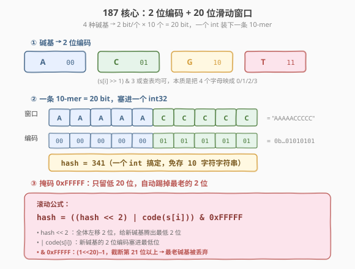
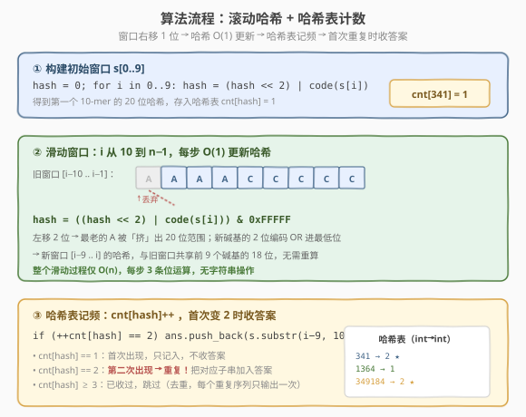
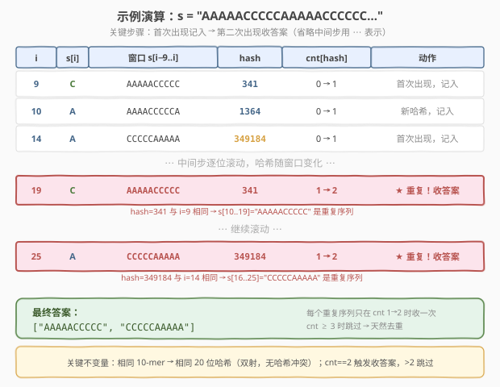

# 重复的DNA序列

- **题目名称**：重复的DNA序列
- **链接**：[187. 重复的DNA序列](https://leetcode.cn/problems/repeated-dna-sequences/)
- **难度**：中等
- **标签**：位运算、哈希表、字符串、滑动窗口、滚动哈希

## 1. 题目概述

DNA 序列由四种碱基缩写组成：`'A'`、`'C'`、`'G'`、`'T'`。给定一个表示 DNA 序列的字符串 `s`，找出其中所有**长度为 10** 且**出现不止一次**的子串（10-mer）。返回结果可以按任意顺序排列。

**示例 1**：

```text
输入：s = "AAAAACCCCCAAAAACCCCCCAAAAAGGGTTT"
输出：["AAAAACCCCC","CCCCCAAAAA"]
解释："AAAAACCCCC" 在位置 0 和 10 各出现一次；"CCCCCAAAAA" 在位置 5 和 16 各出现一次。
```

**示例 2**：

```text
输入：s = "AAAAAAAAAAAAA"
输出：["AAAAAAAAAA"]
解释：长度为 10 的子串 "AAAAAAAAAA" 在位置 0、1、2、3 各出现一次（共 4 次），是唯一的重复序列。
```

**约束条件**：

- `1 <= s.length <= 10^5`
- `s[i]` 是 `'A'`、`'C'`、`'G'` 或 `'T'`

> 💡 本题的精髓不在「找重复」（哈希表计数即可），而在**如何用最小代价表示一个 10-mer**。四种碱基天然只需 2 bit 编码，10 个碱基恰好塞进 20 bit（一个 `int`），配合滚动哈希实现 $O(1)$ 的窗口推进——这是「位运算压缩 + 滚动哈希」的经典招牌题。

---

## 2. 解题思路

### 2.1 暴力思路：字符串哈希表计数

最直观的做法：枚举每个长度为 10 的子串 `s[i..i+9]`，用哈希表 `unordered_map<string, int>` 统计出现次数，最后收集所有计数 $\ge 2$ 的子串。

```cpp
vector<string> findRepeatedDnaSequences(string s) {
    unordered_map<string, int> cnt;
    for (int i = 0; i + 10 <= s.size(); i++)
        cnt[s.substr(i, 10)]++;
    vector<string> ans;
    for (auto& [seq, c] : cnt)
        if (c > 1) ans.push_back(seq);
    return ans;
}
```

时间复杂度 $O(10n)$：共 $n - 9$ 个子串，每个 `substr` 拷贝 10 字符、哈希也需比较 10 字符。空间 $O(10n)$：哈希表存 $O(n)$ 个 10 字符字符串。对于 $n = 10^5$ 约需 $10^6$ 次字符操作，能过但常数偏大——每次窗口右移都要**重新提取并哈希整条 10 字符串**，而相邻两个窗口其实只差首尾两个字符。

> ⚠️ 本质浪费：窗口从 `s[i..i+9]` 滑到 `s[i+1..i+10]` 时，中间 8 个字符完全相同，却要整条重新哈希。能否像前缀和那样**只增量更新**？

### 2.2 核心观察：2 位编码 + 滚动哈希



关键洞察分两步：

**第一步：4 种碱基 → 2 bit 编码。** 字符集大小恰为 4 $= 2^2$，每个碱基只需 2 bit 即可唯一表示：

| 碱基 | 编码（二进制） | 十进制 |
|------|---------------|--------|
| A | `00` | 0 |
| C | `01` | 1 |
| G | `10` | 2 |
| T | `11` | 3 |

一条 10-mer 共 $10 \times 2 = 20$ bit，恰装入一个 32 位 `int`（只需 20 位，远未溢出）。这样**一条 10-mer ↔ 一个 `int`**，构成完美哈希（双射，无冲突）——比存 10 字符字符串省 5 倍内存，哈希比较也从 10 字符降到 1 个 `int`。

**第二步：滚动哈希，窗口推进 $O(1)$。** 窗口右移一位时，新窗口 = 旧窗口去掉最左碱基 + 加入最右新碱基。在 20 位编码下，这对应：

$$\text{hash}_{\text{new}} = \big((\text{hash}_{\text{old}} \ll 2) \;\big|\; \text{code}(s[i])\big) \;\&\; \texttt{0xFFFFF}$$

- `hash << 2`：全体左移 2 位，给新碱基腾出最低 2 位；
- `| code(s[i])`：新碱基编码塞进最低 2 位；
- `& 0xFFFFF`：`0xFFFFF` $= (1 \ll 20) - 1$ 是 20 个 1，截断第 21 位以上——最老碱基的 2 位被自然「挤」出窗口。

> 💡 **为什么是完美哈希（无冲突）？** 20 位编码空间 $= 2^{20} = 1048576$，而 10-mer 的总数 $= 4^{10} = 1048576$，两者恰好相等。每种 10-mer 对应唯一的 20 位编码，是一一对应的双射，不需要处理冲突——这是本题用位编码而非通用滚动哈希的最大优势。

### 2.3 算法流程图



整体三步：

1. **构建初始窗口**：对 `s[0..9]` 逐字符左移 + OR，得到第一个 20 位哈希，存入哈希表 `cnt[hash] = 1`。
2. **滑动窗口**：`i` 从 10 到 $n-1$，每步用滚动公式 $O(1)$ 更新哈希。新哈希与旧窗口共享前 9 个碱基的 18 位，仅首尾 2 位不同。
3. **哈希表计数 + 收答案**：`cnt[hash]++`，**首次变为 2** 时把对应子串 `s[i-9..i]` 加入答案；$\ge 3$ 时跳过（天然去重，每个重复序列只输出一次）。

> ⚠️ **去重关键**：用 `cnt[hash] == 2` 而非 `cnt[hash] >= 2` 作为收答案条件。示例 2 中 `"AAAAAAAAAA"` 出现 4 次，若用 `>= 2` 会在第 2、3、4 次都加入答案导致重复。`== 2` 保证每个序列只在「第二次出现」时收一次。

### 2.4 示例演算



以 $s =$ `"AAAAACCCCCAAAAACCCCCC…"` 为例，追踪关键步骤：

| $i$ | $s[i]$ | 窗口 $s[i{-}9..i]$ | hash | cnt[hash] | 动作 |
|-----|--------|---------------------|------|-----------|------|
| 9 | C | `AAAAACCCCC` | 341 | 0→1 | 首次出现，记入 |
| 10 | A | `AAAACCCCCA` | 1364 | 0→1 | 新哈希，记入 |
| 14 | A | `CCCCCAAAAA` | 349184 | 0→1 | 首次出现，记入 |
| ⋯ | ⋯ | ⋯（逐位滚动）⋯ | ⋯ | ⋯ | ⋯ |
| **19** | C | `AAAAACCCCC` | **341** | **1→2** | ★ 重复！收答案 |
| ⋯ | ⋯ | ⋯（继续滚动）⋯ | ⋯ | ⋯ | ⋯ |
| **25** | A | `CCCCCAAAAA` | **349184** | **1→2** | ★ 重复！收答案 |

- **$i = 9$**：首个完整窗口 `s[0..9]` = `"AAAAACCCCC"`，哈希 341，记入 `cnt[341] = 1`。
- **$i = 19$**：窗口滑到 `s[10..19]` = `"AAAAACCCCC"`，滚动后哈希回到 341（与 $i=9$ 相同），`cnt[341]` 从 1 变 2 → 收答案 `"AAAAACCCCC"`。
- **$i = 25$**：窗口 `s[16..25]` = `"CCCCCAAAAA"`，哈希 349184（与 $i=14$ 相同），`cnt[349184]` 从 1 变 2 → 收答案 `"CCCCCAAAAA"`。

> 💡 **观察哈希「回环」**：$i=19$ 时哈希从 262229 滚动回 341，看似跳跃，实则因为窗口 `s[10..19]` 与 `s[0..9]` 内容完全相同——这正是「相同序列 → 相同哈希」的体现。20 位编码是双射，哈希相等当且仅当序列相等。

---

## 3. 参考代码

### C++

```cpp
class Solution {
  public:
    vector<string> findRepeatedDnaSequences(string s) {
        unordered_map<int, int> cnt;   // 哈希值 -> 出现次数
        vector<string> ans;
        int hash = 0;
        for (int i = 0; i < s.size(); i++) {
            hash = ((hash << 2) | code(s[i])) & 0xFFFFF;  // 滚动哈希
            if (i >= 9 && ++cnt[hash] == 2) {              // 首次重复时收答案
                ans.push_back(s.substr(i - 9, 10));
            }
        }
        return ans;
    }
  private:
    int code(char c) {  // 碱基 -> 2 位编码
        switch (c) {
            case 'A': return 0;
            case 'C': return 1;
            case 'G': return 2;
            case 'T': return 3;
        }
        return -1;
    }
};
```

### Python

```python
class Solution:
    def findRepeatedDnaSequences(self, s: str) -> List[str]:
        code = {'A': 0, 'C': 1, 'G': 2, 'T': 3}  # 碱基 -> 2 位编码
        cnt = {}                                   # 哈希值 -> 出现次数
        ans = []
        hash_val = 0
        for i, ch in enumerate(s):
            hash_val = ((hash_val << 2) | code[ch]) & 0xFFFFF  # 滚动哈希
            if i >= 9:
                cnt[hash_val] = cnt.get(hash_val, 0) + 1
                if cnt[hash_val] == 2:                         # 首次重复时收答案
                    ans.append(s[i - 9: i + 1])
        return ans
```

> 💡 两版骨架一致：单趟遍历，每步做 3 条位运算（左移、OR、AND）+ 一次哈希表查改。`i >= 9` 保证第一个完整 10-mer 出现后才开始计数。`++cnt[hash] == 2`（C++）/ `cnt.get(...) + 1 == 2`（Python）在自增的同时判断是否恰好为 2，一行完成「计数 + 去重收答案」。

> ⚠️ **Python 注意**：`hash` 是 Python 内置函数名，故用 `hash_val` 避免遮蔽。`s[i-9:i+1]` 切片右端 exclusive，故写 `i+1` 而非 `i`。

---

## 4. 复杂度分析

| 维度 | 复杂度 | 说明 |
|------|--------|------|
| 时间复杂度 | $O(n)$ | 单趟遍历，每步 $O(1)$ 位运算 + $O(1)$ 哈希表操作（int 键） |
| 空间复杂度 | $O(n)$ | 哈希表最多存 $n - 9$ 个 int 键值对；最坏 $4^{10}$ 种但受 $n$ 上限约束 |
| 哈希冲突 | 无 | 20 位编码与 10-mer 一一对应（双射），$2^{20} = 4^{10}$ |
| 常数因子 | 极小 | 每步 3 条位运算 + 1 次 int 比较，远优于字符串哈希的 10 字符比较 |

> ⚠️ 严格地说空间复杂度是 $O(\min(n, 4^{10}))$。但 $4^{10} = 1048576$，而 $n \le 10^5$，故哈希表大小受 $n$ 约束，实际为 $O(n)$。

---

## 5. 扩展：编码技巧、字符串哈希对照与通用滚动哈希

### 5.1 用 ASCII 位运算代替查表编码

`code(char)` 函数可用一行位运算替代，省去 `switch` / 字典：

```cpp
int code(char c) {
    return (c >> 1) & 3;   // A→0, C→1, G→3, T→2（仍为双射，不影响正确性）
}
```

原理：`A=0x41, C=0x43, G=0x47, T=0x54`，右移 1 位再取低 2 位，恰好得到 4 个不同的 2 位值。注意映射顺序变为 A=0, C=1, **G=3, T=2**（与标准编码不同），但只要是一一对应的双射就不影响正确性——哈希的唯一性只依赖双射，不依赖具体编码值。

### 5.2 字符串哈希表 vs 位编码滚动哈希

| 维度 | 字符串哈希表（2.1） | 位编码滚动哈希（2.2） |
|------|---------------------|----------------------|
| 窗口推进 | `substr(i,10)` 整条提取 | 3 条位运算 |
| 哈希键 | `string`（10 字符） | `int`（4 字节） |
| 单步常数 | $O(10)$ 字符拷贝 + 哈希 | $O(1)$ 位运算 |
| 哈希冲突 | 无（精确字符串匹配） | 无（20 位双射） |
| 空间 | $O(10n)$ | $O(n)$ |
| 代码量 | 极简（3 行核心） | 中等（需编码函数） |
| 适用场景 | $L$ 小且不要求极致性能 | $L$ 固定、字符集为 2 的幂 |

> 💡 当子串长度 $L$ 很大或字符集不是 2 的幂时，位编码不再适用，需改用 Rabin-Karp 通用滚动哈希（见 5.3）。本题 $L = 10$、$|\Sigma| = 4$ 恰好是位编码的甜区。

### 5.3 通用滚动哈希（Rabin-Karp）

当字符集大小不是 2 的幂（如小写字母 26 个），或子串长度超过 64 bit 容量时，改用带模数的 Rabin-Karp 滚动哈希：

$$\text{hash}_{\text{new}} = \big(\text{hash}_{\text{old}} \cdot b - \text{code}(s[i{-}L]) \cdot b^{L}\big) + \text{code}(s[i]) \;\bmod\; M$$

其中 $b$ 是基数（通常取 $|\Sigma|$ 或更大的质数），$M$ 是大质数模数。与本题的位编码相比：

- 位编码：$b = 4$，$M = 2^{20}$（天然截断），$b^L = 4^{10} = 2^{20}$ 恰好等于模数 → 完美哈希无冲突。
- Rabin-Karp：$b^L \bmod M$ 一般不等于 $M$，存在哈希冲突，需双哈希或哈希冲突后再做字符串精确比对。

> 💡 本题是 Rabin-Karp 的「理想特例」：基数 $b = 4$ 是 2 的幂，模数 $M = 2^{20}$ 是 2 的幂，且 $b^L = M$ 使得丢弃最高位等价于取模——所有运算退化为位运算，无冲突无取模，是最优雅的滚动哈希形态。

---

## 6. 面试要点

1. **为什么 2 bit 就够编码一个碱基？**

   > DNA 字符集大小恰为 4 $= 2^2$，2 bit 可表示 4 种状态（`00`/`01`/`10`/`11`），与 4 种碱基一一对应。这是信息论的下界——用 1 bit 不够（只能表示 2 种），用 3 bit 浪费（能表示 8 种但只用 4 种）。

2. **为什么说这是「完美哈希」，没有冲突？**

   > 10-mer 的总数 $= 4^{10} = 2^{20} = 1048576$，而 20 位编码空间也是 $2^{20}$。每种 10-mer 唯一对应一个 20 位整数，是一一对应的双射。相比之下，通用 Rabin-Karp 用模数压缩哈希值空间，可能碰撞；本题的 20 位编码不取模、不压缩，天然无冲突。

3. **`& 0xFFFFF` 的作用是什么？能不能省掉？**

   > `0xFFFFF` $= (1 \ll 20) - 1$，即 20 个 1，作用是截断第 21 位以上的比特。左移 2 位后，最老碱基的 2 位会移到第 21-22 位，必须用掩码清零才能保持窗口恰好 10 个碱基（20 bit）。若省掉掩码，`int` 会不断累积所有已见碱基，哈希不再是 10-mer 的编码而是「前缀编码」，失去窗口语义。

4. **为什么用 `cnt[hash] == 2` 而不是 `>= 2` 收答案？**

   > 去重。同一序列可能出现 3 次以上（如示例 2 的 `"AAAAAAAAAA"` 出现 4 次）。用 `== 2` 只在「第二次出现」时收一次答案；用 `>= 2` 会在第 2、3、4 次都加入，导致答案列表中有重复。也可以先全部计数，最后统一收集 `cnt > 1` 的项，但 `== 2` 的写法更紧凑且避免二次遍历。

5. **如果子串长度 $L$ 不是 10 而是任意值，或字符集扩大，怎么泛化？**

   > $L$ 可变且字符集为 4 时，掩码改为 `(1 << (2*L)) - 1` 即可（但 $L > 16$ 时 32 位 int 装不下，需 64 位）。字符集不是 2 的幂时（如 26 个小写字母），改用 Rabin-Karp 通用滚动哈希（乘法 + 取模），并处理可能的哈希冲突。第 1044 题「最长重复子串」就是 $L$ 可变 + 二分搜索 + Rabin-Karp 的综合应用。

> 💡 **一句话总结**：本题的灵魂是「**4 种碱基 = 2 bit，10 个碱基 = 20 bit = 一个 int**」——利用字符集大小恰好是 2 的幂这一巧合，把 10-mer 压缩成完美哈希（双射无冲突），再用 `<< 2 | code & MASK` 的滚动公式实现 $O(1)$ 窗口推进。这是 Rabin-Karp 滚动哈希在「基数 2 的幂 + 模数 2 的幂」特例下的最优雅形态。

---

## 7. 同类练习题

- [1044. 最长重复子串](https://leetcode.cn/problems/longest-duplicate-substring/)：本题的泛化版——子串长度不固定，用二分答案 + Rabin-Karp 滚动哈希判定「是否存在长度 $\ge L$ 的重复子串」，需处理哈希冲突
- [718. 最长重复子数组](https://leetcode.cn/problems/maximum-length-of-repeated-subarray/)（[题解](../0601-0700/718_最长重复子数组.md)）：DP 求两数组最长公共子串，也可用滚动哈希 + 二分，对照本题的「哈希计数找重复」
- [28. 找出字符串中第一个匹配项的下标](https://leetcode.cn/problems/find-the-index-of-the-first-occurrence-in-a-string/)：KMP / Rabin-Karp 字符串匹配，滚动哈希的单次查找版（找特定模式），对照本题的「全量计数找重复」
- [166. 分数到小数](https://leetcode.cn/problems/fraction-to-recurring-decimal/)（[题解](../0101-0200/166_分数到小数.md)）：用哈希表检测余数是否重复出现来定位循环节，与本题「哈希计数找重复」同属「哈希表检测重复」家族
- [3. 无重复字符的最长子串](https://leetcode.cn/problems/longest-substring-without-repeating-characters/)（[题解](../0001-0100/3_无重复字符的最长子串.md)）：滑动窗口 + 哈希表的经典题，对照本题「固定长度窗口 + 哈希计数」的变体
