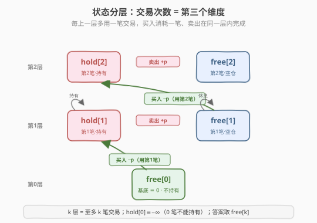
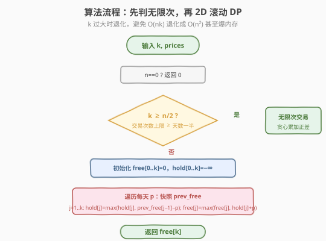

# 买卖股票的最佳时机IV

- **题目名称**：买卖股票的最佳时机IV
- **链接**：[188. 买卖股票的最佳时机 IV](https://leetcode.cn/problems/best-time-to-buy-and-sell-stock-iv/)
- **难度**：困难
- **标签**：动态规划、状态机

## 1. 题目概述

给定一个整数数组 `prices`，`prices[i]` 表示第 `i` 天的股票价格。你最多可以完成 **`k` 笔交易**（一笔交易 = 一次买入 + 一次卖出，且同一时刻最多持有一股）。求能获得的最大利润。

**示例 1**：

```text
输入：k = 2, prices = [2,4,1]
输出：2
解释：k=2 ≥ n/2=1，等价于无限次交易。第 0 天买入（2），第 1 天卖出（4）→ 收益 2。
```

**示例 2**：

```text
输入：k = 2, prices = [3,2,6,5,0,3]
输出：7
解释：第 1 天买入（2），第 2 天卖出（6）→ 收益 4；
     第 4 天买入（0），第 5 天卖出（3）→ 收益 3。总收益 = 4 + 3 = 7。
```

**约束条件**：

- `0 <= k <= 100`
- `0 <= prices.length <= 1000`
- `0 <= prices[i] <= 1000`

> 💡 这是「股票系列」的**通用版**——把 [309. 含冷冻期](../0301-0400/309_买卖股票的最佳时机含冷冻期.md) 的「持有/可买/冷冻」三状态，再叠上一个「**已用交易次数**」维度。掌握本题，你就能一行公式写出 121（k=1）、122（k=∞）、123（k=2）乃至 714（加手续费）。**一道题统一整个股票系列**，正是它的价值。

---

## 2. 解题思路

### 2.1 暴力思路：DFS 枚举每天操作

每天三选一：买入、卖出、休息，同时维护「剩余可用次数」和「是否持有」。DFS 枚举所有合法序列取最大收益：

```text
dfs(i, holding, left):
    if i == n: return 0
    best = dfs(i+1, holding, left)              # 休息
    if holding:
        best = max(best, prices[i] + dfs(i+1, false, left))      # 卖出（次数不变，因为买入时已扣）
    elif left > 0:
        best = max(best, -prices[i] + dfs(i+1, true, left-1))    # 买入（消耗一次）
    return best
```

状态空间 `O(n × 2 × k)`，记忆化后时间 `O(nk)`。但暴力写法把「持有」和「次数」当成两个独立标记拼凑，转移松散、易写错；更糟的是**没有处理 `k` 极大的退化**——当 `k >= n/2` 时实际可交易次数受天数限制，状态空间被白白撑大。

> ⚠️ 暴力法的真正坑在 `k` 很大时（如 `k=10^9`，虽本题上限 100 但思想重要）：开 `O(nk)` 数组会爆内存，且大量 `left` 维度其实用不到。必须先做「**退化判断**」：一笔交易至少要两天，所以最多 `n/2` 笔，`k >= n/2` 即等价于无限次。

### 2.2 核心观察：状态分层——交易次数是第三个维度

把 [309](../0301-0400/309_买卖股票的最佳时机含冷冻期.md) 的两状态「持有/不持有」按**已用交易次数** `j` 复制成 `k+1` 层，每层一对状态：

| 状态 | 含义 |
|------|------|
| **`free[j]`** | 至多用过 `j` 笔交易、当前**不持有**的最大收益 |
| **`hold[j]`** | 至多用过 `j` 笔交易、当前**持有**的最大收益（第 `j` 笔已买入未卖） |

> 关键洞察：**买入消耗一笔交易、卖出不消耗**。因此「买入」是从**下一层** `free[j-1]` 跳到 `hold[j]`（跨层、用掉第 `j` 笔）；「卖出」在同一层内 `hold[j] → free[j]`（不跨层、完成第 `j` 笔）。这样定义后，`j` 严格单调不降，**不会重复计数**，也不会把「同一笔的买和卖」算成两次。

状态之间的合法转移（带收益变化）：



- `free[j-1] → hold[j]`：买入，收益 `-prices[i]`，**跨上一层**（消耗第 `j` 笔）
- `hold[j] → free[j]`：卖出，收益 `+prices[i]`，同层完成
- `free[j] → free[j]`、`hold[j] → hold[j]`：原地休息

注意：**没有 `hold[j] → free[j-1]` 的边**（卖出不会让交易次数倒退）；**没有 `free[j] → hold[j]` 的同层买入边**（买入必跨层，因为要扣次数）。`free[0] ≡ 0`（0 笔交易只能一直空仓），`hold[0] ≡ -∞`（0 笔交易不可能持有）。

### 2.3 算法流程图



**四步法**（在 309 的三状态机骨架上，加一层 `j` 循环）：

1. **退化判断**：若 `k >= n/2`，可交易笔数不再受限，等价于 [122. 无限次交易](https://leetcode.cn/problems/best-time-to-buy-and-sell-stock-ii/)——贪心累加所有正差 `max(prices[i]-prices[i-1], 0)` 即可，`O(n)`。这避免了 `k` 极大时退化。
2. **状态定义**：`free[j] / hold[j]`，`j = 0..k`，含义如上。
3. **转移方程**（每个状态取「保持」与「跳入」两者较大值，`j` 从 1 开始）：

   $$\text{hold}[j] = \max(\text{hold}[j],\ \text{free}[j-1] - \text{prices}[i])$$

   $$\text{free}[j] = \max(\text{free}[j],\ \text{hold}[j] + \text{prices}[i])$$

   > ⚠️ 买入方程里的 `free[j-1]` 必须用**上一轮（前一天）**的值。若就地滚动且 `j` 升序更新，`free[j-1]` 已被今天覆盖，会把「今天先卖第 `j-1` 笔、再买第 `j` 笔」算成合法（同一天又卖又买，虽不改变收益但语义错乱）。解法：每天开头**快照** `prev_free = free[:]`，买入用 `prev_free[j-1]`。
4. **初始条件与答案**：`free[0..k] = 0`、`hold[0..k] = -∞`（持有是非法起点）；答案为 `free[k]`（末日必不持有，且最多用 `k` 笔）。

> 💡 **为什么 `hold` 初值是 $-\infty$ 而非 0**：`hold[j]` 表示「持有」状态，开仓前不可能持有。用 $-\infty$ 让 `max` 永远取不到非法值，保证第一次买入只能由 `free[j-1] - prices[i]` 触发。这与 309 里 `sold[0]` 用 0 兜底不同——本题没有「兜底状态」，非法即 $-\infty$。

### 2.4 示例演算

以 `k=2, prices=[3,2,6,5,0,3]` 为例：

![示例演算：k=2 时四个状态数组递推到 free[2]=7](../images/stock_iv_walkthrough.svg)

| i | prices[i] | 操作 | free[1] | free[2] | hold[1] | hold[2] | 说明 |
|---|-----------|------|---------|---------|---------|---------|------|
| 0 | 3 | 休息 | 0 | 0 | −3 | −3 | hold[1]=0−3=−3（若买@3）；非最优 |
| 1 | 2 | 买① | 0 | 0 | **−2** | −2 | hold[1]=max(−3, 0−2)=−2（买@2） |
| 2 | 6 | 卖① | **4** | 4 | −2 | −2 | free[1]=max(0, −2+6)=4（卖@6，第1笔完成） |
| 3 | 5 | 休息 | 4 | 4 | −2 | −1 | hold[2]=max(−2, 4−5)=−1（若买@5） |
| 4 | 0 | 买② | 4 | 4 | 0 | **4** | hold[2]=max(−1, 4−0)=4（用第1笔利润买@0） |
| 5 | 3 | 卖② | 4 | **7** | 0 | 4 | free[2]=max(4, 4+3)=7（卖@3，第2笔完成） |

最终 `free[2] = 7`，对应操作序列：**买@2 → 卖@6（赚4）→ 买@0 → 卖@3（赚3）**，收益 `4 + 3 = 7`。

> 💡 看第 4 天：`hold[2]` 从 `−1` 跳到 `4`，是因为 `free[1]=4`（第一笔赚的 4 块）减去 `prices[4]=0`——**用第一笔的利润在低点为第二笔建仓**。这正是多笔交易复利的关键，状态分层把「利润再投入」自然编码进 `free[j-1] - prices[i]`。

---

## 3. 参考代码

### C++

```cpp
// 买卖股票的最佳时机IV.cpp —— 状态机 DP + 交易次数维度 + 滚动数组
// 编译: g++ -O2 -std=c++17 买卖股票的最佳时机IV.cpp -o stock4
#include <vector>
#include <algorithm>
#include <climits>
using namespace std;

class Solution {
  public:
    int maxProfit(int k, vector<int>& prices) {
        int n = prices.size();
        if (n == 0) return 0;

        // 退化：k >= n/2 等价于无限次交易（122 题），贪心累加正差
        if (k >= n / 2) {
            int profit = 0;
            for (int i = 1; i < n; ++i)
                if (prices[i] > prices[i - 1])
                    profit += prices[i] - prices[i - 1];
            return profit;
        }

        // 否则 2D 滚动 DP：free[j]/hold[j]，j=0..k
        vector<int> free(k + 1, 0);          // 不持有
        vector<int> hold(k + 1, INT_MIN / 2); // 持有（非法起点用极小值，避免溢出）
        for (int p : prices) {
            vector<int> prev_free = free;    // 快照上一轮的 free
            for (int j = 1; j <= k; ++j) {
                hold[j] = max(hold[j], prev_free[j - 1] - p); // 买入：跨层，消耗第 j 笔
                free[j] = max(free[j], hold[j] + p);          // 卖出：同层，完成第 j 笔
            }
        }
        return free[k];
    }
};
```

### Python

```python
class Solution:
    def maxProfit(self, k: int, prices: list[int]) -> int:
        n = len(prices)
        if n == 0:
            return 0

        # 退化：k >= n//2 等价于无限次交易，贪心累加正差
        if k >= n // 2:
            return sum(max(prices[i] - prices[i - 1], 0) for i in range(1, n))

        # 2D 滚动 DP
        free = [0] * (k + 1)               # 不持有
        hold = [float('-inf')] * (k + 1)   # 持有（非法起点）
        for p in prices:
            prev_free = free[:]            # 快照上一轮的 free
            for j in range(1, k + 1):
                hold[j] = max(hold[j], prev_free[j - 1] - p)  # 买入：跨层
                free[j] = max(free[j], hold[j] + p)           # 卖出：同层
        return free[k]
```

> ⚠️ 两个高频踩坑点：
> （1）**必须快照 `prev_free`**。若就地升序更新，买入用的 `free[j-1]` 已是今天值，会把「同一天卖出第 `j-1` 笔再买入第 `j` 笔」混入（收益不变但状态语义错）。快照后买入严格依赖前一天，无后效性才成立。
> （2）C++ 用 `INT_MIN / 2` 而非 `INT_MIN`：`hold[j] + p` 可能下溢。Python 的 `float('-inf')` 无此问题。

---

## 4. 复杂度分析

| 维度 | 复杂度 | 说明 |
|------|--------|------|
| **时间复杂度** | `O(nk)` | 外层遍历 `n` 天，内层 `k` 次状态转移；退化分支为 `O(n)` |
| **空间复杂度（滚动版）** | `O(k)` | 两个长度 `k+1` 的数组 + 一个快照 |
| **空间复杂度（朴素版）** | `O(nk)` | `dp[n][k+1][2]` 三维表 |

> 💡 退化分支不仅是优化，更是**正确性兜底**：当 `k` 极大（如 `k=10^9`）时 `O(nk)` 不可接受，而 `k >= n/2` 后多出的次数维度全是冗余（用不满），退化成 122 题的 `O(n)` 才是正解。

---

## 5. 扩展：股票系列的状态机统一框架

股票系列（121/122/123/188/309/714）本质都是**同一台状态机加不同约束**。本题是「加交易次数维度」的通用版，掌握后可一行迁移：

| 题目 | 约束 | 状态机差异 |
|------|------|-----------|
| 121 至多 1 次 | `k=1` | 本题 `k=1` 特例，2 状态 |
| 122 无限次 | 无限次、无冷冻 | 退化分支：贪心 / 2 状态 |
| 123 至多 2 次 | `k=2` | 本题 `k=2` 特例，6 状态 |
| **188 至多 k 次** | **至多 k 次** | **本题：`{持有/不持有} × {0..k}`，`2(k+1)` 状态** |
| 309 冷冻期 | 无限次 + 冷冻 | 不限次数，但加「冷冻」状态（[题解](../0301-0400/309_买卖股票的最佳时机含冷冻期.md)） |
| 714 手续费 | 无限次 + 每笔 fee | 退化分支 + 卖出边减 `fee`：`free = hold + p − fee` |

> 💡 **统一视角**：状态机的节点 =「与未来决策相关的全部历史信息」的压缩。交易次数限制之所以要新维度，是因为「还能交易几次」会影响「现在能不能买」；冷冻期、手续费同理——每个影响未来决策的约束，都对应一个状态维度。**先列约束 → 再定状态维度**，是解所有股票题的标准起手式。本题的「按 `j` 分层」就是这一原则的最直接体现。

---

## 6. 面试要点

1. **为什么买入用 `free[j-1]` 而不是 `free[j]`？为什么卖出不跨层？**

   - 一笔交易 = 买 + 卖。把「消耗次数」记在**买入**这一刻，则买入必然从 `j-1` 层跳到 `j` 层（`free[j-1] - p → hold[j]`），表示「用掉第 `j` 笔」。卖出只是兑现这笔已记过数的交易，不改变次数，故同层 `hold[j] + p → free[j]`。
   - 若改成卖出计数也行（等价），但**必须固定一边**，否则同一笔买卖会被算两次或零次。面试时说清「我选择买入计数」并保持一致即可。

2. **为什么必须快照 `prev_free`？就地更新会怎样？**

   - 买入依赖 `free[j-1]`。若 `j` 升序就地更新，算 `hold[j]` 时 `free[j-1]` 已是**今天**的值，相当于允许「今天先完成第 `j-1` 笔卖出，紧接着用这笔钱买入第 `j` 笔」。虽然收益层面是恒等（`free[j-1] - p + p` 抵消），但破坏了「一天最多一次操作」的语义，且在某些变体（如加冷冻期/手续费）里会产生真实错误。
   - 快照后，买入严格基于前一天状态，满足无后效性。也可改用 `j` **降序**更新免去快照（`free[j-1]` 尚未被今天覆盖），但快照写法更直观、不易错。

3. **`k >= n/2` 的退化判断为什么是 `n/2`，不是 `n`？**

   - 一笔交易至少需要一个买入日和一个卖出日（两天），所以 `n` 天里最多完成 `⌊n/2⌋` 笔。当 `k >= n/2`，给定的次数上限已超过物理上限，约束失效，等价于无限次（122 题）。
   - 不做这个判断，当 `k` 很大（如本题约束外的大 `k` 测试）时 `O(nk)` 会 TLE/MLE；做了之后退化分支 `O(n)`，稳。

4. **`hold` 初值为什么是 $-\infty$，而 309 的 `sold[0]` 可以用 0？**

   - 本题 `hold[j]` 是「持有」状态，开仓前不可能持有，是**非法状态**，用 $-\infty$ 让 `max` 永远取不到它，强制第一次持有只能来自真实买入。
   - 309 的 `sold[0]` 虽然也「不应该是冷冻」，但它只在 `free[1] = max(free[0], sold[0])` 中被引用，而 `free[0]=0` 已能兜底，故用 0 等价。本题 `hold` 参与 `hold + p` 计算，必须用 $-\infty$ 严格排除，否则初值 0 会让 `free[j] = max(free[j], 0 + p)` 白捡一个 `p` 的非法利润。

5. **这题和股票系列其它题怎么联系？**

   - 都是状态机 DP：先列约束（次数/冷冻/手续费），再定状态维度。本题是「加交易次数维度」的通用版：`k=1` 即 121，`k=2` 即 123，`k=∞`（退化分支）即 122，卖出边减 `fee` 即 714。**面试遇到股票题，先问清约束，再套本题的分层框架**，比每题背一个转移方程稳得多。

> 💡 **一句话总结**：买卖股票 IV 是股票系列的「万能模板」——在「持有/不持有」两状态上叠加「已用交易次数」维度，买入跨层消耗一笔、卖出同层完成，再辅以 `k>=n/2` 退化判断。掌握它，你就拿到了 121/122/123/714 全家桶的钥匙：**每多一个影响未来决策的约束，就多一个状态维度**。

---

## 7. 同类练习题

- [309. 买卖股票的最佳时机含冷冻期](https://leetcode.cn/problems/best-time-to-buy-and-sell-stock-with-cooldown/)（[题解](../0301-0400/309_买卖股票的最佳时机含冷冻期.md)）：无限次 + 冷冻期，三状态机 DP，本题去掉次数维度加冷冻维度
- [121. 买卖股票的最佳时机](https://leetcode.cn/problems/best-time-to-buy-and-sell-stock/)（[题解](121_买卖股票的最佳时机.md)）：本题 `k=1` 特例，一次遍历求最小值前缀
- [123. 买卖股票的最佳时机 III](https://leetcode.cn/problems/best-time-to-buy-and-sell-stock-iii/)（[题解](123_买卖股票的最佳时机III.md)）：本题 `k=2` 特例，手写 4 个滚动变量
- [714. 买卖股票的最佳时机含手续费](https://leetcode.cn/problems/best-time-to-buy-and-sell-stock-with-transaction-fee/)：无限次 + 卖出减手续费，退化分支 + 修改卖出边
- [122. 买卖股票的最佳时机 II](https://leetcode.cn/problems/best-time-to-buy-and-sell-stock-ii/)：本题退化分支的完整版，贪心累加正差
