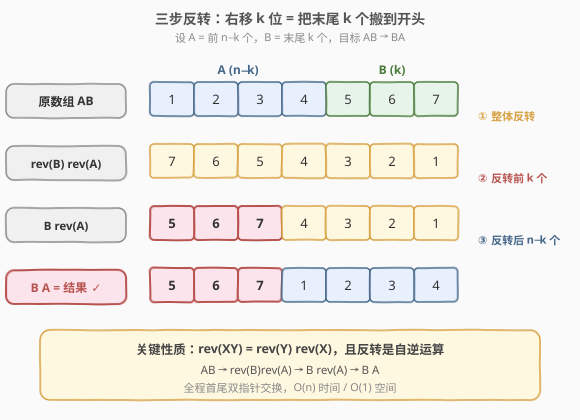
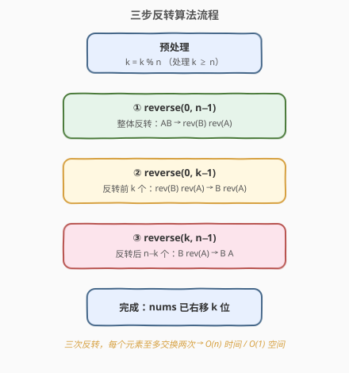
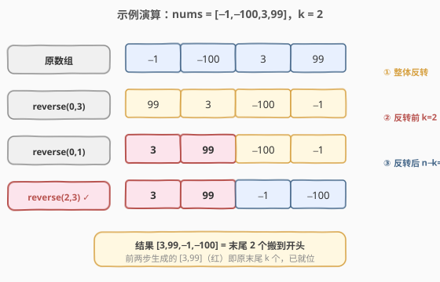
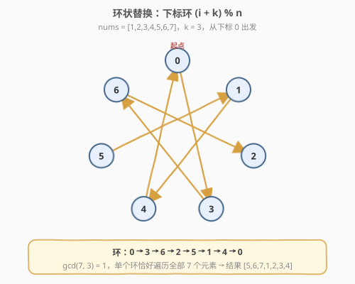

# 轮转数组

- **题目名称**：轮转数组
- **链接**：[189. 轮转数组](https://leetcode.cn/problems/rotate-array/)
- **难度**：中等
- **标签**：数组、数学、双指针

## 1. 题目概述

给定一个整数数组 `nums`，将数组中的元素向**右**轮转 `k` 个位置，其中 `k` 是非负数。要求**原地**修改数组。

**示例 1**：

```text
输入：nums = [1,2,3,4,5,6,7], k = 3
输出：[5,6,7,1,2,3,4]
解释：向右轮转 1 步: [7,1,2,3,4,5,6]
     向右轮转 2 步: [6,7,1,2,3,4,5]
     向右轮转 3 步: [5,6,7,1,2,3,4]
```

**示例 2**：

```text
输入：nums = [-1,-100,3,99], k = 2
输出：[3,99,-1,-100]
```

**约束条件**：

- `1 <= nums.length <= 10^5`
- `-2^31 <= nums[i] <= 2^31 - 1`
- `0 <= k <= 10^5`

> ⚠️ **进阶要求**：用 `O(1)` 额外空间原地解决。

---

## 2. 解题思路

### 2.1 暴力思路

每次把数组整体右移 1 位（最后一个元素挪到最前），重复 `k` 次。时间复杂度 `O(n·k)`，`k` 与 `n` 同阶时会到 `O(n^2)`，必然超时。

### 2.2 额外数组法：铺垫

> 💡 先看一个不满足空间要求、但能帮我们抓住规律的解法。

开一个新数组 `tmp`，令 `tmp[(i + k) % n] = nums[i]`，再把 `tmp` 拷回 `nums`。时间 `O(n)`、空间 `O(n)`。

这条**下标映射规律** `(i + k) % n` 是后续「环状替换」的基石。

### 2.3 核心观察：三步反转法



把数组看成两块：`A = nums[0..n-k-1]`（前 `n-k` 个），`B = nums[n-k..n-1]`（末尾 `k` 个），则原数组为 `AB`。右移 `k` 位本质就是把 `B` 整体搬到 `A` 前面，即目标 `BA`。

如何**原地**完成 `AB → BA`？利用一个经典性质：**反转是自逆运算**，且 `rev(XY) = rev(Y) rev(X)`。于是：

```text
AB --全反转--> rev(B) rev(A) --反转前k--> B rev(A) --反转后n-k--> B A
```

三步即可，全程只用首尾双指针交换，**额外空间 O(1)**。

> 💡 **一句话记忆**：整体翻一次，前 k 个翻一次，后 n−k 个翻一次。

### 2.4 算法流程图



### 2.5 示例演算

以 `nums = [-1,-100,3,99], k = 2` 为例（`n = 4, k % n = 2`）：



三步反转后得到 `[3,99,-1,-100]`，与预期一致。

---

## 3. 参考代码

### C++

```cpp
class Solution {
  public:
    void rotate(vector<int>& nums, int k) {
        int n = nums.size();
        k %= n;                                  // 处理 k >= n
        auto rev = [&](int l, int r) {
            while (l < r) swap(nums[l++], nums[r--]);
        };
        rev(0, n - 1);                           // ① 反转整体
        rev(0, k - 1);                           // ② 反转前 k 个
        rev(k, n - 1);                           // ③ 反转后 n-k 个
    }
};
```

> 也可直接用标准库：`std::reverse(nums.begin(), nums.end());` 等三行替代。

### Python

```python
class Solution:
    def rotate(self, nums: List[int], k: int) -> None:
        n = len(nums)
        k %= n

        def rev(l: int, r: int) -> None:
            while l < r:
                nums[l], nums[r] = nums[r], nums[l]
                l += 1
                r -= 1

        rev(0, n - 1)        # ① 反转整体
        rev(0, k - 1)        # ② 反转前 k 个
        rev(k, n - 1)        # ③ 反转后 n-k 个
```

> ⚠️ Python 的 `nums[:] = nums[::-1]` 切片写法更短，但底层会创建临时列表，严格意义上并非 `O(1)` 空间；手写 `rev` 更贴合面试对「原地」的考察。

---

## 4. 复杂度分析

| 维度 | 复杂度 | 说明 |
|------|--------|------|
| 时间复杂度 | O(n) | 三次反转，每个元素至多被交换两次 |
| 空间复杂度 | O(1) | 仅用首尾双指针，原地交换 |

---

## 5. 扩展：环状替换

环状替换直接套用 2.2 节的下标映射 `(i + k) % n`：从某个下标 `start` 出发，把当前元素送到目标位置，再处理被挤出来的元素，如此沿着环走，直到回到 `start`。若一圈没放满 `n` 个，就从 `start + 1` 再开一圈。



数组被分成 $\gcd(n, k)$ 个独立环，每个环只需一个临时变量即可原地完成。

### 环状替换 C++ 代码

```cpp
class Solution {
  public:
    void rotate(vector<int>& nums, int k) {
        int n = nums.size();
        k %= n;
        int count = 0;                            // 已放置元素数
        for (int start = 0; count < n; start++) {
            int cur = start;
            int prev = nums[start];
            do {
                int nxt = (cur + k) % n;          // 目标位置
                swap(prev, nums[nxt]);             // prev 落位，接管被挤出的值
                cur = nxt;
                count++;
            } while (cur != start);               // 回到起点，这一环结束
        }
    }
};
```

> 💡 同样是 `O(n)` 时间 / `O(1)` 空间。三步反转实现更短、更不易写错，是面试首选；环状替换考察对下标环的理解，常作为追问。

---

## 6. 面试要点

1. **为什么要先 `k %= n`？**
   - 右移 `n` 位等于没动。`k` 可能远大于 `n`（如 `k = 10, n = 7`），取模后才是有效位移，避免越界和无谓计算。

2. **三步反转为什么正确？**
   - 利用 `rev(XY) = rev(Y)rev(X)`。设 `A` 为前 `n-k`、`B` 为末尾 `k`，则 `AB → rev(AB)=rev(B)rev(A) → rev(rev(B))rev(A)=B rev(A) → B rev(rev(A))=B A`，即目标。

3. **左移 k 位怎么做？**
   - 左移 `k` 等价于右移 `n - k`；或对称地三步反转：先反转前 `k`、再反转后 `n-k`、最后整体反转。

4. **环状替换为什么要 `gcd(n, k)` 个环？**
   - 从 `start` 出发每步走 `k`，回到起点需走 $\frac{n}{\gcd(n,k)}$ 步，故共有 $\gcd(n,k)$ 个互不相交的环。`count` 计数保证所有元素都被处理一次。

5. **Python 切片 `nums[:] = nums[-k:] + nums[:-k]` 行不行？**
   - 结果正确且简洁，但拼接产生临时列表，空间为 `O(n)`，不满足「`O(1)` 原地」的进阶要求；可作为引子，再过渡到三步反转。

---

## 7. 同类练习题

- [151. 反转字符串中的单词](https://leetcode.cn/problems/reverse-words-in-a-string/)：同样是「整体反转 + 段内反转」的三步反转套路
- [61. 旋转链表](https://leetcode.cn/problems/rotate-list/)：链表版的右移 k 位，先成环再断开，思路同源
- [922. 按奇偶排序数组 II](https://leetcode.cn/problems/sort-array-by-parity-ii/)：下标映射 + 原地交换，呼应环状替换的下标环思想
- [344. 反转字符串](https://leetcode.cn/problems/reverse-string/)：首尾双指针反转的基础模板
