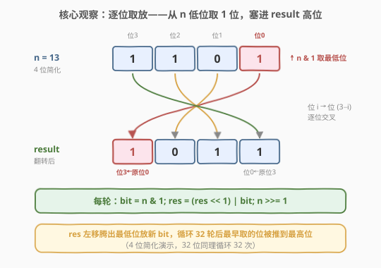
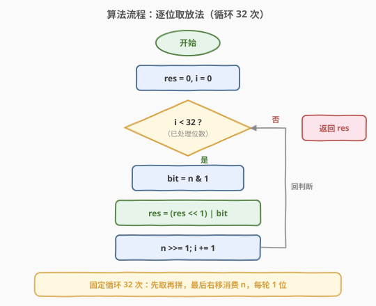
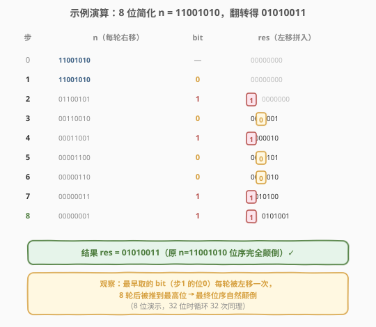
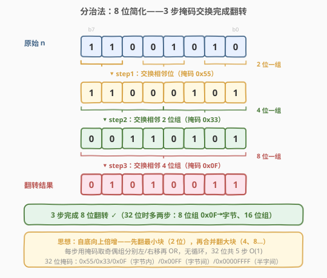

# LeetCode 颠倒二进制位 题解

## 1. 题目概述

- **标题 / 题号**：颠倒二进制位（#190，easy）
- **链接**：https://leetcode.cn/problems/reverse-bits/
- **难度**：简单
- **标签**：位运算、分治

**题意**：给定一个 32 位**无符号整数** `n`，将其二进制位**颠倒**（高位变低位、低位变高位），返回颠倒后的无符号整数值。

> ⚠️ **输入解释**：题目以 32 位二进制串形式展示输入。在 Java 等没有无符号类型的语言中，输入会以**有符号整数**给出——示例 2 中 `11111111111111111111111111111101` 是 32 位补码表示的 `-3`。但无论按有符号还是无符号解读，**其二进制各位完全相同**，颠倒后的位串也相同，故实现不受影响。

**示例 1**：

```text
输入：n = 00000010100101000001111010011100
输出：964176192 (00111001011110000010100101000000)
解释：输入的二进制串表示无符号整数 43261596，返回 964176192，其二进制为 00111001011110000010100101000000。
```

**示例 2**：

```text
输入：n = 11111111111111111111111111111101
输出：3221225471 (10111111111111111111111111111111)
解释：输入表示无符号整数 4294967293，返回 3221225471，其二进制为 10111111111111111111111111111111。
```

**约束**：

- 输入是一个长度为 32 的二进制串。

> 💡 **进阶提示**：如果多次调用该函数，如何优化？答案是「字节查表法」预计算 256 项翻转表，4 次查表拼接（见第 5 节）。

## 2. 解题思路

### 2.1 暴力思路：转字符串翻转

最直观的做法是把 `n` 转成 32 位二进制字符串，调用库函数反转字符串，再转回整数：

```python
s = bin(n)[2:].zfill(32)   # 补齐到 32 位
s = s[::-1]                 # 字符串反转
return int(s, 2)
```

时间 $O(32) = O(1)$，空间 $O(32)$（字符串）。能 AC，但**完全没用到位运算**——面试官出这道题想看的是你**直接在比特层面操作**的能力，而不是借助字符串中转。字符串翻转还引入了不必要的 $O(32)$ 额外空间。

> 💡 转机在于：能否**不借助字符串**，直接用一个整数 `res` 当作「翻转结果的容器」，逐位把 `n` 的比特搬过去？

### 2.2 核心观察：逐位取放法



关键观察是两个位运算原语的配合：

- **取**：`n & 1` 取出 `n` 的**最低位**（bit 0），其余位被掩码清零。
- **放**：`res = (res << 1) | bit`——先把 `res` **左移腾出最低位**，再用按位或把新 `bit` 塞进空出来的最低位。

把这两步循环 32 次，每轮还执行 `n >>= 1` 消费掉 `n` 的最低位（让下一轮的 bit 1 变成 bit 0），就完成了翻转。原理是**位移的对称性**：

> 💡 **关键转化**：`res` 每轮左移 1 位，意味着**最早取到的 bit 会被多移一次**。循环 32 轮后，第 1 轮取的 bit（原 `n` 的 bit 0）被左移了 31 次，落到了 `res` 的 bit 31（最高位）；最后 1 轮取的 bit（原 `n` 的 bit 31）只被移了 0 次，留在 `res` 的 bit 0。**位序恰好颠倒**——这就是「逐位取放」自动完成翻转的数学本质。

换言之，`res` 的左移与 `n` 的右移是镜像操作：`n` 从低位向高位依次吐出 bit，`res` 从低位向高位依次接收并把先到的推到更高位，最终位序自然反转。

> ⚠️ **为什么必须固定循环 32 次而非 `while n`？** 因为 `n` 的高位若全为 0，`while n` 会在 `n` 变 0 时提前结束，导致 `res` 没有被充分左移——高位 0 没有被「搬」过去。翻转必须处理**全部 32 位**（包括那些 0），所以循环次数固定为 32。这一点与 [191. 位 1 的个数](../0001-0100/191_位1的个数.md) 中「`while n` 跳过 0 位」恰恰相反：那题数 1 可以跳 0，本题翻转必须逐位处理。

### 2.3 算法流程图



算法只需一个计数器、一个结果变量和一个循环：

1. `res = 0, i = 0`。
2. 只要 `i < 32`：取 `bit = n & 1`，拼入 `res = (res << 1) | bit`，消费 `n >>= 1`，`i += 1`。
3. 循环结束（`i == 32`）时 `res` 即为颠倒后的值。

> ⚠️ **正确性**：经过 32 轮，`n` 的每一位都恰好被取一次、放一次。由位移对称性，原 bit `k` 落到 `res` 的 bit `31-k`，即位序完全颠倒。

### 2.4 示例演算

以一个 8 位简化示例 `n = 11001010`（翻转得 `01010011`）演示「逐位取放」的 8 轮迭代：



| 轮次 | n（右移前） | bit = n & 1 | res = (res&lt;&lt;1) \| bit | 说明 |
|------|------------|------------|----------------------------|------|
| 初始 | 11001010 | — | 00000000 | res 清零 |
| 1 | 11001010 | 0 | 00000000 | 取原 bit0=0，res 左移仍为 0 |
| 2 | 01100101 | 1 | 00000001 | 取原 bit1=1 |
| 3 | 00110010 | 0 | 00000010 | 取原 bit2=0，上一轮的 1 升到 bit1 |
| 4 | 00011001 | 1 | 00000101 | 取原 bit3=1 |
| 5 | 00001100 | 0 | 00001010 | 取原 bit4=0 |
| 6 | 00000110 | 0 | 00010100 | 取原 bit5=0 |
| 7 | 00000011 | 1 | 00101001 | 取原 bit6=1 |
| 8 | 00000001 | 1 | 01010011 | 取原 bit7=1，完成翻转 ✓ |

观察最后一行：`res = 01010011`，正是原 `n = 11001010` 的位序颠倒。注意第 1 轮取的 `0`（原 bit0）每轮被左移一次，8 轮后被推到最高位——这就是「最早取的被推到最高位」的直观体现。32 位时同理循环 32 次。

## 3. 参考代码

### C++

```cpp
class Solution {
  public:
    uint32_t reverseBits(uint32_t n) {
        uint32_t res = 0;
        for (int i = 0; i < 32; i++) {
            res = (res << 1) | (n & 1);   // 左移腾位 + 塞入最低位
            n >>= 1;                       // 消费 n 的最低位
        }
        return res;
    }
};
```

> 💡 `uint32_t` 自然截断到 32 位，无需额外掩码。也可写成不修改 `n` 的版本：`res |= (n >> i) & 1) << (31 - i)`，把原 bit `i` 直接送到 `res` 的 bit `31-i`——逻辑等价，但上面的「左移+右移」版本更简洁、无需计算 `31-i`。

### Python

```python
class Solution:
    def reverseBits(self, n: int) -> int:
        res = 0
        for _ in range(32):
            res = (res << 1) | (n & 1)    # 左移腾位 + 塞入最低位
            n >>= 1                        # 消费 n 的最低位
        return res
```

> ⚠️ **Python 的整数精度陷阱**：Python 整数是**无限精度**的，左移不会自动截断到 32 位。本题中 `res` 经 32 次左移最多到 32 位、`n` 是力扣传入的无符号正值（右移不扩展符号），故上述代码可直接 AC。但若要严格保证返回 32 位无符号值（例如面试中传入负数或需要与 C 行为对齐），应在返回前掩码：`return res & 0xFFFFFFFF`。这在第 5 节的分治法中**必不可少**——分治法的 `n << 16` 会产生超过 32 位的值，必须靠掩码截断。

也可一行调用内置函数（语义等价，底层走 C 实现）：

```python
class Solution:
    def reverseBits(self, n: int) -> int:
        return int(f'{n:032b}'[::-1], 2)   # 格式化 32 位串 + 反转 + 转回整数
```

## 4. 复杂度分析

| 维度 | 复杂度 | 说明 |
|------|--------|------|
| 时间复杂度 | $O(32) = O(1)$ | 固定循环 32 次，每次常数级位运算 |
| 空间复杂度 | $O(1)$ | 仅用 `res`、`i` 两个变量，无额外数据结构 |

> 💡 32 位整数翻转的复杂度天然是常数级。逐位取放法是本题的**标准基础解法**：清晰、易写、面试中作为第一反应完全合格。若面试官追问「能否不用循环」，则引出第 5 节的分治法。

## 5. 扩展：分治法与字节查表法

### 5.1 位运算分治法：5 步掩码交换，无循环 O(1)



「逐位取放」是自顶向下逐位处理，而**分治法**采用自底向上的倍增思想：先翻转最小的 2 位块，再把翻转后的 2 位块组成 4 位块翻转，以此类推，直到整个 32 位翻转完毕。每一步用**位掩码**把数分成奇偶两组，分别左/右移半个块宽，再按位或合并。

以 8 位为例（3 步），扩展到 32 位即 5 步：

| 步骤 | 交换粒度 | 掩码（32 位） | 操作 |
|------|----------|---------------|------|
| 1 | 相邻 1 位 | `0x55555555` / `0xAAAAAAAA` | 奇偶位互换 |
| 2 | 相邻 2 位组 | `0x33333333` / `0xCCCCCCCC` | 2 位一组高低半互换 |
| 3 | 相邻 4 位组 | `0x0F0F0F0F` / `0xF0F0F0F0` | 4 位一组高低半互换（字节内） |
| 4 | 相邻 8 位组 | `0x00FF00FF` / `0xFF00FF00` | 字节间高低半互换 |
| 5 | 相邻 16 位组 | `0x0000FFFF` / `0xFFFF0000` | 半字间互换 |

```cpp
class Solution {
  public:
    uint32_t reverseBits(uint32_t n) {
        n = ((n & 0xAAAAAAAA) >> 1)  | ((n & 0x55555555) << 1);   // 1 位
        n = ((n & 0xCCCCCCCC) >> 2)  | ((n & 0x33333333) << 2);   // 2 位
        n = ((n & 0xF0F0F0F0) >> 4)  | ((n & 0x0F0F0F0F) << 4);   // 4 位
        n = ((n & 0xFF00FF00) >> 8)  | ((n & 0x00FF00FF) << 8);   // 8 位
        n = (n >> 16) | (n << 16);                                // 16 位
        return n;
    }
};
```

```python
class Solution:
    def reverseBits(self, n: int) -> int:
        n = ((n & 0xAAAAAAAA) >> 1)  | ((n & 0x55555555) << 1)
        n = ((n & 0xCCCCCCCC) >> 2)  | ((n & 0x33333333) << 2)
        n = ((n & 0xF0F0F0F0) >> 4)  | ((n & 0x0F0F0F0F) << 4)
        n = ((n & 0xFF00FF00) >> 8)  | ((n & 0x00FF00FF) << 8)
        n = (n >> 16) | (n << 16)
        return n & 0xFFFFFFFF   # ⚠️ Python 必须：左移超过 32 位需掩码截断
```

> ⚠️ **Python 掩码为何必不可少？** `n << 16` 在 Python 中不会截断，会产生高达 48 位的值；最后一行 `(n >> 16) | (n << 16)` 的结果高位超出 32 位。必须 `& 0xFFFFFFFF` 把它压回 32 位无符号语义。C++ 的 `uint32_t` 由类型自动截断，无需手动掩码。

> 💡 **分治法的本质**：把「翻转长度为 N 的位串」分解为「翻转两个长度为 N/2 的子串再交换它们的顺序」。这与 [148. 排序链表](148_排序链表.md) 的归并、[95. 不同的二叉搜索树 II] 的分治同源——都是「分-治-合」的倍增/对数思想。掩码技巧在 [190. 本题]、[191. 位 1 的个数](../0001-0100/191_位1的个数.md) 的 popcount 分治版、以及 `std::byteswap` 的底层实现中反复出现。

### 5.2 字节查表法：多次调用的进阶优化

针对进阶提示「多次调用如何优化」，可预计算 256 项「8 位翻转表」，把 32 位整数拆成 4 个字节分别查表，再按翻转后的字节顺序拼接（字节 0 的翻转结果放到最高 8 位）：

```cpp
class Solution {
    array<uint32_t, 256> table;
  public:
    Solution() {
        for (uint32_t i = 0; i < 256; i++) {
            uint32_t v = i, r = 0;
            for (int k = 0; k < 8; k++) {   // 翻转 8 位
                r = (r << 1) | (v & 1);
                v >>= 1;
            }
            table[i] = r;
        }
    }
    uint32_t reverseBits(uint32_t n) {
        return (table[n & 0xff] << 24)
             | (table[(n >> 8)  & 0xff] << 16)
             | (table[(n >> 16) & 0xff] << 8)
             | (table[(n >> 24) & 0xff]);
    }
};
```

循环次数从 32 降到 4（外加一次性 $O(256)$ 预处理），适合高频调用场景。这与 [191. 位 1 的个数](../0001-0100/191_位1的个数.md) 第 5 节的 popcount 查表法是同一思路——「空间换时间」的查表加速在位运算题中是通用套路。

| 解法 | 循环次数 | 空间 | 适用场景 |
|------|----------|------|----------|
| 逐位取放 | 32 | $O(1)$ | 基础解法，面试第一反应 |
| 分治掩码 | 0（5 步直线） | $O(1)$ | 无循环最优，展示位运算功底 |
| 字节查表 | 4 | $O(256)$ | 多次调用，空间换时间 |
| `std::byteswap` / `__builtin_bitreverse32` | 1（CPU 指令） | $O(1)$ | 工程实际，编译器/硬件加速 |

## 6. 面试要点

1. **为什么循环必须固定 32 次而不是 `while n`？**

   - 翻转要处理**全部 32 位**，包括高位连续的 0。若用 `while n`，当 `n` 的高位全 0 时会提前结束，那些 0 没有被「搬」到 `res` 的低位，`res` 也未被充分左移，结果错误。对比 [191. 位 1 的个数](../0001-0100/191_位1的个数.md) 用 `while n` 是因为数 1 可以跳过 0——本题翻转必须逐位处理，0 也要搬。

2. **`res = (res << 1) | bit` 中「左移」和「或」各起什么作用？**

   - 左移把 `res` 已有内容整体推高一位，**腾出最低位**；按位或把新 `bit` 塞进这个空出来的最低位（因为 `0 | bit = bit`）。两者配合实现「先腾位再填入」。等价写法 `res = res << 1; res |= bit` 也可，但合成一行更简洁。

3. **为什么「最早取的 bit 会被推到最高位」？**

   - 第 1 轮取的 bit 进入 `res` 后，还要经历后续 31 轮的左移，每次左移把它推高 1 位，累计推高 31 位 → 落到 bit 31。最后 1 轮取的 bit 进入后没有后续左移，留在 bit 0。位序因此自然颠倒——这是位移对称性的数学结果，无需显式计算 `31-i`。

4. **Python 中分治法为什么必须 `& 0xFFFFFFFF`，而逐位取放法可以不加？**

   - 逐位取放法中 `res` 经 32 次左移最多到 32 位、每次只或入 0/1，结果天然在 32 位内；`n` 是无符号正值，右移不扩展符号。分治法的 `n << 16` 会产生超过 32 位的值，`(n >> 16) | (n << 16)` 结果高位溢出 32 位，必须掩码截断。C++ 的 `uint32_t` 由类型自动截断，两种写法都无需手动掩码。

5. **分治法（5 步掩码交换）相比逐位取放有什么优势？**

   - 无循环、5 步直线位运算完成，理论最快；展示对位运算掩码的深刻理解。但代码可读性较低、易写错掩码。面试策略：先写逐位取放（清晰正确），再口头/代码补充分治法作为优化——既稳又出彩。这与 [191](../0001-0100/191_位1的个数.md) 先写 `n & (n-1)` 再提 `POPCNT` 指令是同样的「基础解 + 进阶优化」分层。

## 同类练习题

| # | 题目 | 与本题的关联 |
|---|------|-------------|
| 191 | [位 1 的个数](https://leetcode.cn/problems/number-of-1-bits/)（[题解](../0001-0100/191_位1的个数.md)） | 同为 32 位无符号逐位处理基础题，`n & (n-1)` 技巧与本题掩码交换并称位运算入门双璧 |
| 7 | [整数反转](https://leetcode.cn/problems/reverse-integer/) | 十进制逐位翻转，思路与本题二进制逐位取放同构，但需处理溢出与符号 |
| 9 | [回文数](https://leetcode.cn/problems/palindrome-number/) | 反转一半数字判等，承接 7 的反转思想，本题的「逐位取放」是其位运算版本 |
| 338 | [比特位计数](https://leetcode.cn/problems/counting-bits/) | 对 `0..n` 每个数求 popcount，DP 复用 `i & (i-1)`，位运算批量题 |
| 476 | [数字的补数](https://leetcode.cn/problems/number-complement/) | 按位取反再掩码到有效位宽，与本题的 32 位掩码 `0xFFFFFFFF` 异曲同工 |
