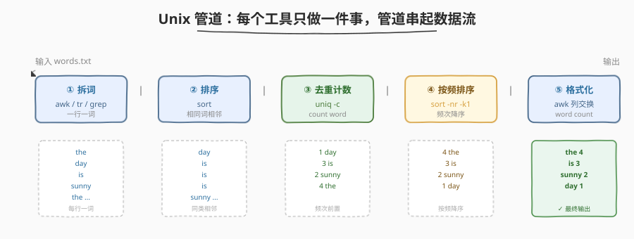
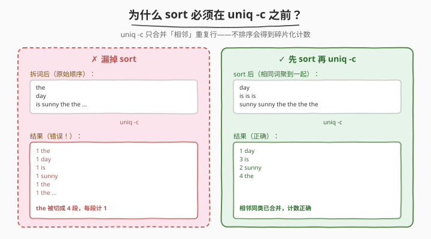
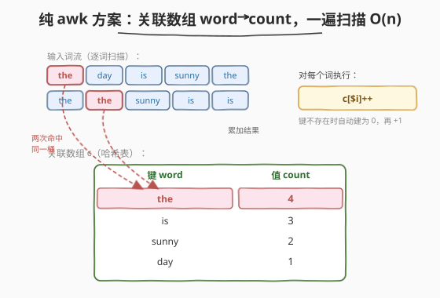

# LeetCode 统计词频 题解

## 1. 题目概述

- **标题 / 题号**：统计词频（#192，medium）
- **链接**：https://leetcode.cn/problems/word-frequency/
- **难度**：中等
- **标签**：Shell、Unix 管道、awk、sort、uniq、哈希表

**题意**：写一个 **bash 脚本**，统计文本文件 `words.txt` 中每个单词的出现频率，输出格式为「`单词 频次`」（单词与频次之间一个空格），并按**频次降序**排列。

为简化，题目保证：

- `words.txt` 只包含**小写字母和空格**；
- 每个单词只由小写字母组成；
- 单词之间由**一个或多个空格**分隔。

**示例**：

假设 `words.txt` 内容如下：

```text
the day is sunny the the the sunny is is
```

你的脚本应当输出（按词频降序排列）：

```text
the 4
is 3
sunny 2
day 1
```

**约束**：

- `words.txt` 不超过 5000 个单词，每个单词长度 $\le 10$；
- 每个单词的出现频次**唯一**（无需处理同频排序）；
- **进阶**：能否用**一行 Unix 管道**实现？

> 💡 这是一道 Shell 题而非算法题——考察的不是手写哈希表，而是能否把「拆词 → 分组 → 计数 → 排序 → 格式化」拆成若干个「各做一件事」的标准 Unix 工具，再用管道 `|` 串起来。题目末尾的「进阶」提示正是本题的灵魂。

## 2. 解题思路

### 2.1 暴力思路：手写循环逐词比较

最笨的做法：用 bash 把文件读进数组，两层循环——外层取一个词，内层扫全文统计出现次数，再把结果去重排序输出。问题显而易见：

- bash 数组操作笨重，两层循环 $O(n^2)$；
- 去重、排序、格式化全都自己造轮子，代码冗长易错；
- 完全没用上 Unix 既有的「专用小工具」。

> 💡 转机在于：把问题分解成五个**正交**的子任务——拆词、排序、去重计数、按频排序、格式化——每个子任务都恰好对应一个标准 Unix 命令。让每个命令只做一件事，再用管道把上一步的输出喂给下一步，整道题就压缩成一行。

### 2.2 核心观察：Unix 管道——五工具各司其职



把「统计词频」拆成一条流水线，每一步只做一个原子操作：

| 阶段 | 工具 | 作用 | 输入→输出形态 |
|------|------|------|---------------|
| ① 拆词 | `awk` / `grep` / `tr` | 把一行多词文本切成「每行一词」 | 多词行 → 单词行 |
| ② 排序 | `sort` | 让相同词**相邻** | 任意序 → 字典序 |
| ③ 去重计数 | `uniq -c` | 合并**相邻**重复行并计数 | 重复行 → `count word` |
| ④ 按频排序 | `sort -nr -k1` | 按第一列（频次）数值降序 | `count word`（任意序）→ 频次降序 |
| ⑤ 格式化 | `awk '{print $2,$1}'` | 交换两列，输出 `word count` | `count word` → `word count` |

> ⚠️ **最关键的认知**：`uniq -c` **只合并相邻的重复行**——它不全局去重。因此 ② 的 `sort` **绝不能省**：若相同词在原文里不相邻，`uniq -c` 会把它们当成多个不同的词各自计 1。这是本题最大的坑（见 2.3）。

> 💡 **为什么是先 `sort` 再 `uniq -c`，而不是反过来？** 因为 `uniq -c` 的前提是「重复行已相邻」，而 `sort` 恰好能制造这个前提。顺序由工具的语义依赖决定，不可颠倒。

### 2.3 算法流程图 / 易错点：sort 必须在 uniq -c 之前



上图对比了「漏掉 sort」与「先 sort 再 uniq -c」两种流程：

- **左（✗）**：拆词后保持原始顺序（`the day is sunny the the ...`），相同词 `the` 散落在不同位置。直接 `uniq -c` 只合并相邻重复，于是 `the` 被切成多段，每段都计 1——得到 `1 the` × 多次，频次完全错误。
- **右（✓）**：先 `sort` 把所有 `the` 聚到一起（`... the the the the`），再 `uniq -c` 即正确合并为 `4 the`。

> 💡 **记忆口诀**：`uniq` 是「近视眼」——只看得见**紧挨着自己**的重复。`sort` 是「组织者」——把同类拉到一起。所以 `sort | uniq -c` 是固定搭档，永远成对出现（且 `sort` 在前）。

### 2.4 示例演算

用题目示例 `the day is sunny the the the sunny is is` 走一遍完整管道，观察每一步的数据形态：

| 阶段 | 命令 | 数据形态（节选） | 说明 |
|------|------|------------------|------|
| 输入 | `words.txt` | `the day is sunny the the the sunny is is` | 单行多词，空格分隔 |
| ① 拆词 | `awk '{for(i=1;i<=NF;i++) print $i}'` | `the` / `day` / `is` / `sunny` / `the` / ... | 一行一词，`NF` 自动处理多空格 |
| ② 排序 | `sort` | `day` / `is` / `is` / `is` / `sunny` / `sunny` / `the` / `the` / `the` / `the` | 字典序，相同词相邻 |
| ③ 计数 | `uniq -c` | `1 day` / `3 is` / `2 sunny` / `4 the` | 合并相邻重复，前置频次（带前导空格填充） |
| ④ 按频排序 | `sort -nr -k1` | `4 the` / `3 is` / `2 sunny` / `1 day` | 按第 1 列数值降序 |
| ⑤ 格式化 | `awk '{print $2,$1}'` | `the 4` / `is 3` / `sunny 2` / `day 1` | 交换两列，得 `word count` |

> ⚠️ **`uniq -c` 的输出格式坑**：它把计数放在最前，并用**前导空格右对齐填充**到固定宽度（如 `   4 the` 而非 `4 the`）。`sort -nr -k1` 之所以能正确工作，是因为 `sort` 的默认字段分隔符是「空白」（含前导空格），`-k1` 自动跳过前导空格取到数字 `4`；`-n` 按数值比较，`-r` 降序。若误用 `sort -r`（不带 `-n`）则会按**字符串**比较，出现 `"10" < "2"` 的错位（字典序 `'1' < '2'`）。**数值排序永远要带 `-n`**。

> 💡 **最终格式化为何需要 `awk '{print $2,$1}'`？** 因为 `uniq -c` 的输出是 `count word`（频次在前），而题目要求 `word count`（单词在前）。`$1` 是第 1 字段（count），`$2` 是第 2 字段（word），`print $2, $1` 用逗号分隔（awk 以 `OFS` 默认空格连接）即输出 `word count`。这一步不可省——题目明确要求「`单词 频次`」的顺序。

## 3. 参考代码

### Bash（解法 A：一行管道，推荐）

```bash
# Read from the file words.txt and output the word frequency list, sorted by frequency descending.
awk '{for(i=1;i<=NF;i++) print $i}' words.txt | sort | uniq -c | sort -nr -k1 | awk '{print $2, $1}'
```

**逐段拆解**：

- `awk '{for(i=1;i<=NF;i++) print $i}' words.txt`：遍历每行的每个字段（`NF` = 字段数），逐个 `print`。awk 默认以**任意空白**为字段分隔符，自动忽略行首行尾空格与连续多空格——比 `tr -s ' ' '\n'` 更健壮（后者遇行首空格会产生空行，需额外 `grep -v '^$'` 过滤）。
- `sort`：字典序排序，让相同词相邻（`uniq -c` 的前提）。
- `uniq -c`：合并相邻重复行，输出 `count word`（频次前置，带前导空格填充）。
- `sort -nr -k1`：按第 1 列**数值**降序（`-n` 数值比较、`-r` 降序、`-k1` 取第 1 字段即频次）。
- `awk '{print $2, $1}'`：交换两列，输出 `word count`。

### Bash（解法 B：纯 awk 哈希计数）



```bash
awk '{for(i=1;i<=NF;i++) c[$i]++} END{for(w in c) print c[w], w}' words.txt | sort -nr -k1 | awk '{print $2, $1}'
```

**思路**：用 awk 的**关联数组**（本质哈希表）`c[$i]++` 一遍扫描累加，`END` 块遍历输出 `count word`。省去了 `sort | uniq -c` 两步，但 `for(w in c)` 的遍历顺序**未定义**，仍需后续 `sort -nr -k1` 按频次排序。

> 💡 **解法 A vs B 的本质区别**：A 是「先排序再线性扫描计数」（`sort + uniq -c`），B 是「哈希表一遍累加」。前者是 Unix 管道哲学（组合专用工具），后者是命令式编程（一个工具内完成）。时间复杂度同为 $O(n \log n)$（瓶颈在 `sort` 的比较排序），但 A 的每个工具职责单一、可独立调试，更契合 Shell 题的考察意图。**面试推荐解法 A**。

### Python（等价实现）

```python
from collections import Counter

with open("words.txt") as f:
    freq = Counter(f.read().split())  # 无参 split() 以任意空白分隔，自动忽略行首/行尾/连续多空格
# most_common() 按频次降序返回；题目保证频次唯一，无需处理同频
for word, cnt in freq.most_common():
    print(f"{word} {cnt}")
```

**说明**：

- `f.read().split()` 无参 `split()` 以任意空白为分隔符，自动忽略行首行尾与连续多空格——语义等价于 awk 的 `NF` 字段切分。
- `Counter.most_common()` 返回按频次降序的 `(word, cnt)` 列表，等价于 `sort -nr -k1`；题目保证频次唯一，故无需同频字典序兜底。
- 时间 $O(n \log n)$（`most_common` 内部堆排序），空间 $O(n)$（哈希表存所有词）。

> 💡 Python 版恰好是「解法 B（纯 awk 哈希）」的等价物——`Counter` 就是那个关联数组 `c[$i]++`，`most_common()` 就是 `END` 块的遍历 + `sort -nr`。三者（Bash 管道、Bash 纯 awk、Python Counter）只是同一思路的不同语言表达。

## 4. 复杂度分析

| 维度 | 复杂度 | 说明 |
|------|--------|------|
| 时间（解法 A 管道） | $O(n \log n)$ | 瓶颈在两处 `sort`（各 $O(n \log n)$）；`uniq -c`、`awk` 拆词/格式化均为 $O(n)$ |
| 时间（解法 B 纯 awk） | $O(n \log n)$ | 哈希累加 $O(n)$，瓶颈在最后的 `sort -nr` $O(n \log n)$ |
| 时间（Python Counter） | $O(n \log n)$ | `Counter` 构建 $O(n)$，`most_common` 堆排序 $O(n \log n)$ |
| 空间（解法 A） | $O(n)$ | 管道各阶段中间结果（最坏全量词列表 $n$ 行同时存于某工具内存） |
| 空间（解法 B / Python） | $O(k)$，$k$ 为不同词数 | 关联数组 / 哈希表只存不同词及其计数，$k \le n$ |

> ⚠️ **为何时间不是 $O(n)$？** 虽然「哈希计数」本身是 $O(n)$，但题目要求**按频次降序输出**，排序这一步不可避免地带来 $O(n \log n)$（除非用桶排，但频次无上界约束时桶排不适用）。所以三种解法的时间上界都是 $O(n \log n)$，差异只在常数与工程可读性。

## 5. 扩展：拆词方式对比与同频处理

### 5.1 三种「拆词」方式对比

| 命令 | 写法 | 健壮性 | 说明 |
|------|------|--------|------|
| `awk` 字段循环 | `awk '{for(i=1;i<=NF;i++) print $i}'` | ★★★ | 默认以任意空白分隔，自动忽略行首/行尾/连续多空格，最健壮 |
| `grep -oE` | `grep -oE '[a-z]+'` | ★★★ | 正则提取所有小写字母串；本题保证只有小写字母，故等价且简洁 |
| `tr` 挤压 | `tr -s ' ' '\n'` | ★★ | 把空格转成换行并挤压连续空格；**行首空格会产生空行**，需 `grep -v '^$'` 过滤 |
| `xargs -n1` | `xargs -n1 < words.txt` | ★★ | 按空白拆分逐词输出；会处理引号/反斜杠转义，仅在输入纯字母时安全 |

推荐 `awk` 字段循环或 `grep -oE '[a-z]+'`（本题条件下两者等价）。`grep -oE` 版完整一行：

```bash
grep -oE '[a-z]+' words.txt | sort | uniq -c | sort -nr -k1 | awk '{print $2, $1}'
```

### 5.2 同频频次的处理

题目保证「每个单词的频次唯一」，故无需考虑同频排序。但若**去掉该保证**（频次可相同），需要补一个**次级排序键**——通常按单词字典序升序。`sort` 支持多键，且方向修饰符可写在每个键后：

```bash
# 先按频次降序，同频再按单词字典序升序
... | uniq -c | sort -k1,1nr -k2,2 | awk '{print $2, $1}'
```

> ⚠️ 注意 `-r` 作为**全局开关**会让所有键都降序；若要「频次降序、单词升序」混合方向，必须把方向修饰符写在每个键后：`-k1,1nr`（第 1 键数值降序）+ `-k2,2`（第 2 键默认字典序升序）。这正是 [692. 前 K 个高频单词](https://leetcode.cn/problems/top-k-frequent-words/) 的核心难点。

## 6. 面试要点

1. **为什么 `sort` 必须在 `uniq -c` 之前？能否省掉 `sort`？**

   > 不能。`uniq -c` **只合并相邻的重复行**，不具备全局去重能力。若相同词在原文中不相邻，`uniq -c` 会把它们当作多个不同的词各自计 1，频次严重错误。`sort` 的作用是「把相同词聚到一起」以满足 `uniq -c` 的相邻前提。两者是固定搭档，且 `sort` 必须在前。

2. **`uniq -c` 的输出格式有什么坑？为什么后面要用 `sort -nr -k1` 而不是 `sort -r`？**

   > `uniq -c` 把计数前置，并用**前导空格右对齐填充**到固定宽度（如 `   4 the`）。`sort -nr -k1` 中：`-k1` 取第 1 字段（`sort` 默认以空白分隔，自动跳过前导空格取到数字 `4`），`-n` 按数值比较，`-r` 降序。若误用 `sort -r`（不带 `-n`）会按字符串比较，导致 `"10" < "2"`（字典序 `'1' < '2'`）的错位。**数值排序永远带 `-n`**。

3. **题目要求输出 `word count`，但 `uniq -c` 输出 `count word`，怎么处理？**

   > 最后再加一个 `awk '{print $2, $1}'` 交换两列。`$1` 是第 1 字段（count），`$2` 是第 2 字段（word），逗号分隔让 awk 以 `OFS`（默认空格）连接，输出 `word count`。这一步不可省——题目明确要求「`单词 频次`」的顺序。

4. **如何用「纯 awk」一行实现？与管道法有何区别？**

   > `awk '{for(i=1;i<=NF;i++) c[$i]++} END{for(w in c) print c[w], w}' words.txt | sort -nr -k1 | awk '{print $2, $1}'`。用关联数组 `c[$i]++` 一遍扫描累加，`END` 块遍历输出。省去了 `sort | uniq -c`，但 `for(w in c)` 遍历顺序未定义，仍需 `sort -nr` 兜底。本质与 Python `Counter.most_common` 相同。管道法的优势是每个工具职责单一、可独立调试，更契合 Shell 题考察意图。

5. **若去掉「频次唯一」保证，如何处理同频排序？**

   > 补次级排序键：`sort -k1,1nr -k2,2`（频次数值降序为主键，单词字典序升序为次键）。注意方向修饰符 `nr` 写在键 `-k1,1` 之后而非全局 `-r`，否则会让两个键都降序。这正是 692 题的核心难点。

> 💡 **一句话总结**：本题的灵魂是「**把统计词频拆成五个正交子任务，用 Unix 管道串成一行**」——`awk` 拆词 → `sort` 聚类 → `uniq -c` 计数 → `sort -nr -k1` 按频排序 → `awk` 格式化。最大坑点有二：① `sort` 必须在 `uniq -c` 之前（后者只合并相邻重复）；② 数值排序必带 `-n`（否则 `10 < 2`）。记牢 `sort | uniq -c` 这对固定搭档，就掌握了 Unix 文本处理的命脉。

## 同类练习题

| # | 题目 | 与本题的关联 |
|---|------|-------------|
| 692 | [前 K 个高频单词](https://leetcode.cn/problems/top-k-frequent-words/) | 本题的「Top-K + 同频字典序」进阶版，考察 `sort` 多键排序的方向修饰符写法（`-k1,1nr -k2,2`），是 192 去掉「频次唯一」保证后的自然延伸 |
| 347 | [前 K 个高频元素](https://leetcode.cn/problems/top-k-frequent-elements/) | 算法题版的「词频统计 + Top-K」，用哈希表 + 最小堆 / 桶排，对照本题的 `uniq -c + sort` 管道思路 |
| 193 | [有效电话号码](https://leetcode.cn/problems/valid-phone-numbers/) | 同属 Shell 系列，考察 `grep -E` 正则匹配，与本题 `grep -oE '[a-z]+'` 拆词形成「grep 提取」的两类用法对照 |
| 195 | [第十行](https://leetcode.cn/problems/tenth-line/) | Shell 系列基础题，考察 `sed -n '10p'` / `awk 'NR==10'` 按行号定位，与本题「逐字段处理」形成行 / 列两个维度对照 |
| 349 | [两个数组的交集](https://leetcode.cn/problems/intersection-of-two-arrays/) | 算法题版的「去重 + 求交」，对照本题 `sort \| uniq` 的去重范式——`uniq`（不带 `-c`）即纯去重，是 `uniq -c` 的退化形态 |
