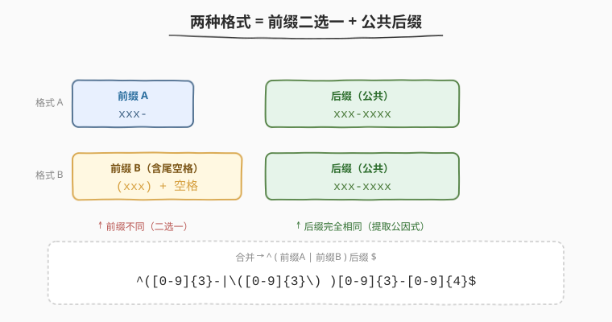
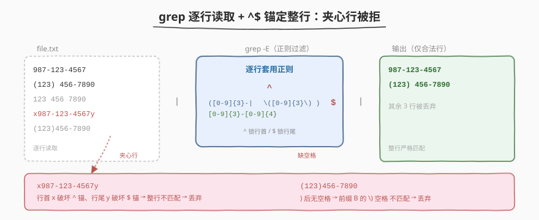
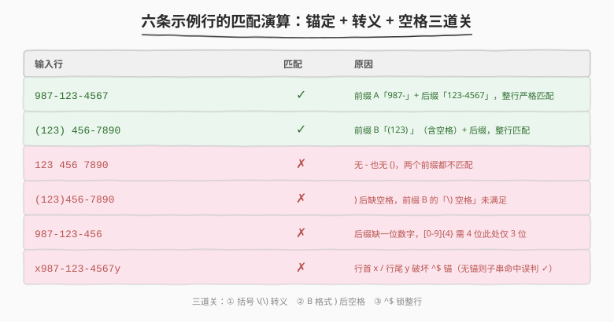

# 有效电话号码

- **题目名称**：有效电话号码
- **链接**：[193. 有效电话号码](https://leetcode.cn/problems/valid-phone-numbers/)
- **难度**：简单
- **标签**：Shell、正则表达式、grep、ERE、行锚定

## 1. 题目概述

写一个 **bash 脚本**，读取文件 `file.txt`，打印其中所有**合法的电话号码**，每行一个。

合法电话号码只接受以下两种格式之一（`x` 表示一个数字 `0-9`）：

| 格式 | 模板 | 示例 |
|------|------|------|
| A | `xxx-xxx-xxxx` | `987-123-4567` |
| B | `(xxx) xxx-xxxx` | `(123) 456-7890` |

> ⚠️ 格式 B 中 `)` 与后面的三位区号之间有**一个空格**，`(123)456-7890`（无空格）**不合法**。

**示例**：

假设 `file.txt` 内容如下：

```text
987-123-4567
123 456 7890
(123) 456-7890
```

你的脚本应当输出：

```text
987-123-4567
(123) 456-7890
```

`123 456 7890` 既不含 `-` 也不含 `()`，不匹配任一格式，故被过滤。

**约束条件**：

- `file.txt` 每行一个待校验字符串，行数不限；
- 每行可能完全不符合、部分符合或完全符合某格式——只需输出**整行严格匹配**者；
- **进阶**：能否用**一行命令**实现？

> 💡 这是一道 Shell 题而非算法题——考察的不是手写字符串校验状态机，而是能否用**一行正则**精确描述两种格式，并用 `grep` 逐行过滤。核心难点不在「写正则」，而在「写对正则」：括号转义、行锚定 `^$`、B 区段的隐藏空格，三处坑任踩一处即全错。

---

## 2. 解题思路

### 2.1 暴力思路：逐字符状态机校验

最笨的做法：用 bash `read` 逐行读入，对每行按下标逐个字符判断——

- 第 1 个字符是不是数字 / `(`；
- 若是 `(`，则第 2-4 位须为数字、第 5 位须为 `)`、第 6 位须为空格、第 7-9 位数字、第 10 位 `-`、第 11-14 位数字；
- 若是数字，则第 1-3 位数字、第 4 位 `-`、第 5-7 位数字、第 8 位 `-`、第 9-12 位数字……

问题显而易见：

- bash 下标与字符串操作笨重，分支嵌套深，极易写错下标；
- 两种格式的分支逻辑各写一遍，重复且不可复用；
- 完全没用上 Shell 既有的「正则匹配」能力。

> 💡 转机在于：两种格式本质是**结构化的字符串模式**，而正则表达式正是描述这类模式的语言。把「逐字符判断」抽象成「一行模式描述 + 逐行匹配」，整道题就压缩成一行 `grep`。

### 2.2 核心观察：两种格式 = 前缀二选一 + 公共后缀



把两种格式按「前缀 + 后缀」拆开，会发现一个关键事实——**后缀完全相同**：

| 部分 | 格式 A | 格式 B | 是否相同 |
|------|--------|--------|----------|
| 前缀 | `xxx-` | `(xxx) `（含尾空格） | ✗ 不同 |
| 后缀 | `xxx-xxxx` | `xxx-xxxx` | ✓ 相同 |

于是正则可以**提取公因式**：

$$
\text{pattern} = \underbrace{(\text{前缀A} \mid \text{前缀B})}_{\text{二选一}} \cdot \underbrace{\text{后缀}}_{\text{公共}}
$$

把各部分翻译成正则元语言：

| 片段 | 含义 | 正则 |
|------|------|------|
| `xxx`（三位数字） | 3 个数字 | `[0-9]{3}` |
| `-`（字面连字符） | 普通字符，无特殊含义 | `-` |
| `(` `)`（字面括号） | **正则元字符**，需转义 | `\(` `\)` |
| 空格 | 字面空格 | ` `（直接写一个空格） |
| 前缀二选一 | 分组 + 或 | `(A\|B)` |

拼起来得到**最终正则**（ERE 语法）：

```text
^([0-9]{3}-|\([0-9]{3}\) )[0-9]{3}-[0-9]{4}$
```

逐段拆解：

- `^` —— 行首锚，保证从行首开始匹配（拒绝 `abc987-123-4567` 这类前缀有杂质的行）；
- `(` ... `)` —— **正则分组**，把两个前缀选项包起来供 `|` 选择；
- `[0-9]{3}-` —— 前缀 A：三位数字 + 一个 `-`；
- `|` —— 或，二选一；
- `\([0-9]{3}\) ` —— 前缀 B：`(` + 三位数字 + `)` + **一个空格**（⚠️ 这个空格最易漏写）；
- `[0-9]{3}-[0-9]{4}` —— 公共后缀：三位数字 + `-` + 四位数字；
- `$` —— 行尾锚，保证匹配到行尾（拒绝 `987-123-4567xyz` 这类后缀有杂质的行）。

> ⚠️ **三处必踩坑**：① 括号是正则元字符，必须 `\(` `\)` 转义才能匹配字面括号（否则被当成分组）；② 格式 B 的 `)` 后有一个**隐藏空格**，正则里必须显式写一个空格字符，`(123)456-7890` 不合法；③ `^` 与 `$` 缺一不可——`grep` 默认做**子串匹配**，不锚定整行就会让 `prefix987-123-4567suffix` 这类夹心行蒙混过关。

### 2.3 算法流程图：grep 逐行 + 锚定整行



`grep` 的工作模型天然契合本题——它**逐行**读取文件，对每行用正则做一次匹配，匹配成功的行原样输出：

| 阶段 | 行为 | 说明 |
|------|------|------|
| ① 逐行读取 | `grep` 自动按 `\n` 切分 `file.txt` | 无需自己写 `while read` 循环 |
| ② 正则匹配 | 对当前行套用 `^...$` | `^$` 锁定整行，拒绝夹心 |
| ③ 输出 / 丢弃 | 匹配则 `print`，不匹配则跳过 | 默认动作即「打印匹配行」 |

> 💡 **为什么用 `grep -E` 而非 `grep`？** POSIX 定义两套正则：**BRE**（基本正则，`grep` 默认）与 **ERE**（扩展正则，`grep -E`）。两者关键差异在于 `{n}` 量词与 `|` 或运算的写法：

| 特性 | BRE（`grep`） | ERE（`grep -E`） |
|------|---------------|-------------------|
| 量词 `{3}` | 需 `\{3\}`（反斜杠转义） | 直接 `{3}` |
| 或 `\|` | 需 `\|`（且非标准，部分实现不支持） | 直接 `\|` |
| 分组 `\(...\)` | 需反斜杠 | 直接 `(...)` |

本题同时用到 `{3}`、`|`、`(...)`，用 BRE 写出来满屏反斜杠、可读性极差，故**首选 `grep -E`**。

### 2.4 示例演算

用 6 条覆盖典型情况的输入行，逐行判定匹配结果与原因：



| 输入行 | 匹配 | 原因 |
|--------|------|------|
| `987-123-4567` | ✓ | 前缀 A `987-` + 后缀 `123-4567`，整行严格匹配 |
| `(123) 456-7890` | ✓ | 前缀 B `(123) `（含空格）+ 后缀 `456-7890`，整行严格匹配 |
| `123 456 7890` | ✗ | 无 `-`、无 `()`，两个前缀都不匹配 |
| `(123)456-7890` | ✗ | `)` 后缺空格，前缀 B 的 `\) ` 要求一个空格 |
| `987-123-456` | ✗ | 后缀缺一位数字，`[0-9]{4}` 需 4 位而此处只有 3 位 |
| `x987-123-4567y` | ✗ | 行首 `x` / 行尾 `y` 使 `^$` 锚定失败（无锚则子串匹配会误判 ✓） |

> ⚠️ **最后一行是 `^$` 锚定的核心价值**：若无 `^$`，`grep` 对 `x987-123-4567y` 做**子串匹配**会找到 `987-123-4567` 这段子串从而误判合法——但题目要求整行严格符合格式。`^` 锁头、`$` 锁尾，二者合力把「子串命中」升级为「整行命中」，这正是校验类正则与提取类正则的根本分野。

---

## 3. 参考代码

### Bash（解法 A：grep -E，推荐）

```bash
# Read from the file file.txt and print all valid phone numbers.
grep -E '^([0-9]{3}-|\([0-9]{3}\) )[0-9]{3}-[0-9]{4}$' file.txt
```

**逐段拆解**：

- `grep -E`：启用 ERE（扩展正则），让 `{3}`、`|`、`(...)` 直接可用，无需反斜杠转义这些元字符本身。
- `'^...$'`：单引号包裹整条正则，防止 shell 对 `(`、`)`、`|` 等字符做通配/命令替换展开；`^` 与 `$` 锁定整行。
- `([0-9]{3}-|\([0-9]{3}\) )`：分组内二选一——前缀 A（`xxx-`）或前缀 B（`(xxx) `，含尾空格）。
- `[0-9]{3}-[0-9]{4}`：公共后缀 `xxx-xxxx`。
- `file.txt`：输入文件，`grep` 自动逐行读取。

> 💡 **为何用单引号而非双引号？** 双引号内 shell 仍会对 `$`、`` ` ``、`\` 做特殊处理——本题正则里的 `$`（行尾锚）和 `\(`（转义括号）都会被 shell 误解析。单引号内**一切字面**，是包裹正则的最安全选择。

### Bash（解法 B：awk 正则匹配）

```bash
awk '/^([0-9]{3}-|\([0-9]{3}\) )[0-9]{3}-[0-9]{4}$/' file.txt
```

**思路**：`awk` 的「模式」位置写一条 ERE，对每行 `$0` 做匹配，匹配成功的行触发默认动作 `{print $0}`。语义与 `grep -E` 等价，区别仅在于 `awk` 把「正则匹配」与「行处理」合并在一个工具内，适合在匹配后还要做进一步字段加工的场景。

### Bash（解法 C：sed -nE）

```bash
sed -nE '/^([0-9]{3}-|\([0-9]{3}\) )[0-9]{3}-[0-9]{4}$/p' file.txt
```

**思路**：`sed -n` 关闭默认输出，`-E` 启用 ERE，`/pattern/p` 只打印匹配行。与 `grep -E` 等价但更显式——`grep` 的默认动作就是「打印匹配行」，`sed` 需要手动 `p` 命令。三者（`grep -E` / `awk` / `sed -nE`）只是同一正则的不同宿主工具。

> 💡 **三种解法如何选？** 纯过滤场景首选 `grep -E`——最短最直观，且 `grep` 的语义就是「按正则选行」。若匹配后还需字段加工（如「合法号码再拆区号」），用 `awk` 把匹配与加工合一。`sed` 适合同时要做替换/删除的场景。本题无后续加工，**面试推荐解法 A**。

### Python（等价实现）

```python
import re

pat = re.compile(r'(\d{3}-|\(\d{3}\) )\d{3}-\d{4}')
with open("file.txt") as f:
    for line in f:
        line = line.rstrip("\n")
        if pat.fullmatch(line):   # fullmatch = 自动加 ^...$，整行严格匹配
            print(line)
```

**说明**：

- `re.fullmatch` 等价于自动加 `^...$` 的 `re.match`——它要求模式覆盖**整个**字符串，天然实现了行锚定，无需手写 `^$`（但写了也不报错）。
- `\d` 在 Python（PCRE 系）中匹配 `[0-9]`，比 `[0-9]` 更简洁；但注意部分引擎下 `\d` 会匹配 Unicode 数字（如全角数字），若需严格 ASCII 数字仍用 `[0-9]`。
- `rstrip("\n")` 去掉行尾换行符再匹配，否则 `$` 在某些引擎下行为微妙（`$` 可匹配 `\n` 前的位置）。

> 💡 Python 版揭示了 `grep -E` 与通用正则引擎的一个差异：`grep` 默认**逐行**处理（自带「按 `\n` 分行」），而 Python 需要自己 `for line in f` 读行 + `rstrip`。`re.fullmatch` 则对应 `grep` 的 `^...$`——前者是 API 层面的「整串匹配」，后者是模式层面的「行首行尾锚」，二者殊途同归。

---

## 4. 复杂度分析

| 维度 | 复杂度 | 说明 |
|------|--------|------|
| 时间 | $O(n \cdot m)$ | $n$ 为行数，$m$ 为最长行长度；每行做一次正则匹配，单行匹配对模式长度近似线性 |
| 空间 | $O(m)$ | `grep` 逐行处理，同一时刻只缓存当前行（$m$ 字符），无需载入全文件 |
| 正则编译 | $O(1)$ 摊还 | 模式长度固定，编译一次；`grep` 内部对每行复用同一条已编译的 NFA/DFA |

> ⚠️ **为何是 $O(n \cdot m)$ 而非 $O(n)$？** 正则匹配单行的时间与「行长度 × 模式复杂度」相关。本题模式含 `{3}`/`{4}` 量词与一次 `|` 回溯，单行匹配近似 $O(m)$。若模式含嵌套量词（如 `(a+)+`）可能触发**灾难性回溯**使单行退化为指数级，但本题模式简单无此风险。

---

## 5. 扩展：grep -E vs grep -P vs BRE 与「校验 vs 提取」

### 5.1 三种正则引擎对比

| 引擎 | 启用方式 | 量词 `{3}` | 或 `|` | `\d` | 可移植性 |
|------|----------|-----------|--------|------|----------|
| BRE | `grep`（默认） | `\{3\}` | `\|`（非标准） | ✗ | ★★★★★（全 POSIX） |
| ERE | `grep -E` | `{3}` | `|` | ✗ | ★★★★★（全 POSIX） |
| PCRE | `grep -P` | `{3}` | `|` | ✓ | ★★（GNU grep 可选编译，macOS 默认无） |

`grep -P` 版用 `\d` 更简洁：

```bash
grep -P '^(\d{3}-|\(\d{3}\) )\d{3}-\d{4}$' file.txt
```

> ⚠️ **生产环境慎用 `grep -P`**：PCRE 非 POSIX 标准，macOS 自带的 BSD grep 默认不支持 `-P`（需装 `grep` via Homebrew）。面试与脚本可移植性优先时用 `grep -E` + `[0-9]`，最稳妥。

### 5.2 校验（full match）vs 提取（substring match）

本题是**校验**型任务——要求整行严格符合格式。若误用**提取**型写法会出错：

```bash
# ✗ 错误：grep -o 提取子串，会把夹心行里的合法子串抠出来误报
grep -oE '([0-9]{3}-|\([0-9]{3}\) )[0-9]{3}-[0-9]{4}' file.txt
```

`grep -o` 只输出匹配到的**子串**而非整行：对 `abc987-123-4567xyz`，它会抠出 `987-123-4567` 并输出——但原行并不合法。校验型任务必须用 `^...$` 锁整行，`-o` 适用于「从大段文本里捞出号码」的提取场景（如日志分析），二者不可混用。

> 💡 **校验 vs 提取的判断标准**：问自己「一行里除了号码还有别的内容吗」。若整行就是号码 → 校验 → 用 `^...$`；若号码只是行中一段 → 提取 → 用 `grep -o` 无需锚。本题明确「每行一个待校验字符串」，属校验型。

---

## 6. 面试要点

1. **正则里为什么要转义括号 `\(` `\)`？不转义会怎样？**

   > `(` `)` 在正则中是**分组元字符**，用于把子模式打包供 `|` 选择或供反向引用捕获。若想匹配**字面**的括号字符，必须用反斜杠转义 `\(` `\)`。不转义的话，`([0-9]{3})` 会被解释为「一个捕获分组，内容是三位数字」，分组外的 `)` 因找不到匹配的 `(` 而报语法错（或在某些引擎下静默吞掉）。

2. **`^` 和 `$` 锚定为什么不能省？**

   > `grep` 默认做**子串匹配**——只要模式在某行的任意位置出现就算命中。本题要求「整行严格符合格式」，`abc987-123-4567xyz` 这种夹心行里有合法子串但整行不合法。`^` 锁行首、`$` 锁行尾，把子串命中升级为整行命中，是校验型正则的标配。Python 中等价物是 `re.fullmatch`（自动整串匹配）。

3. **格式 B 的 `)` 后为什么有一个空格？正则里怎么体现？**

   > 题目定义格式 B 为 `(xxx) xxx-xxxx`，`)` 与后面三位数字之间有**一个空格**——`(123)456-7890`（无空格）不合法。正则里在前缀 B 的 `\)` 之后**显式写一个空格字符** `\([0-9]{3}\) `，这个空格最易漏写导致 `(123)456-7890` 误判合法。正则中的空格就是普通字面字符，直接敲一个空格即可，无需转义。

4. **`grep -E` 与 `grep`（默认 BRE）有何区别？本题为何选 `-E`？**

   > BRE 下量词需写成 `\{3\}`、或需 `\|`（且非 POSIX 标准可能不支持）、分组需 `\(...\)`，满屏反斜杠可读性差。ERE 下 `{3}`、`|`、`(...)` 直接可用。本题同时用到这三者，用 BRE 写极丑陋，故选 `grep -E`。ERE 是 POSIX 标准，全平台可移植，是写正则的首选基底。

5. **能否用 `grep -o` 实现？为什么不行？**

   > 不能。`grep -o` 输出匹配到的**子串**而非整行，属「提取」型操作。对夹心行 `abc987-123-4567xyz`，`-o` 会抠出合法子串 `987-123-4567` 误报为合法号码。本题是「校验」型任务，要求整行严格符合，必须用 `^...$` 锁整行 + 默认整行输出（不加 `-o`）。校验与提取的根本区别在于「是否要求模式覆盖整行」。

> 💡 **一句话总结**：本题的灵魂是「**用一行 ERE 正则精确描述两种电话号码格式，用 `^$` 锁整行做校验**」——`^([0-9]{3}-|\([0-9]{3}\) )[0-9]{3}-[0-9]{4}$` 把「前缀二选一 + 公共后缀」提取公因式。三处必踩坑：① 括号转义 `\(` `\)`；② B 格式 `)` 后的隐藏空格；③ `^$` 锚定整行（否则 `grep` 的子串匹配让夹心行漏过）。记牢「校验型正则必带 `^$`」，就掌握了 `grep` 过滤的命脉。

---

## 7. 同类练习题

- [192. 统计词频](https://leetcode.cn/problems/word-frequency/)：同属 Shell 系列，考察 `awk`/`sort`/`uniq` 管道组合，与本题 `grep -E` 正则过滤形成「Unix 文本处理两件套」对照——前者做聚合统计，后者做模式过滤
- [195. 第十行](https://leetcode.cn/problems/tenth-line/)：Shell 系列基础题，考察 `sed -n '10p'` / `awk 'NR==10'` 按行号定位，与本题「按正则过滤行」形成「行号选行 / 模式选行」两个维度对照
- [8. 字符串转换整数 (atoi)](https://leetcode.cn/problems/string-to-integer-atoi/)：算法题版的「逐字符状态机校验」，用 DFA 处理前导空格/符号/数字/溢出——对照本题用正则一行搞定格式校验，体会「状态机 vs 正则」两类描述手段的取舍
- [65. 有效数字](https://leetcode.cn/problems/valid-number/)：另一道格式校验题，规则复杂到正则难以维护，改用 9 状态 DFA 表驱动——对照本题规则简单正则即可，体会「正则适合简单结构化模式、DFA 适合复杂多状态规则」的分界
- [10. 正则表达式匹配](https://leetcode.cn/problems/regular-expression-matching/)：从「使用正则」升级到「实现正则引擎」，用二维 DP 模拟 `.` 与 `*` 的匹配——对照本题「调正则 API」的视角，理解正则引擎内部的工作原理
