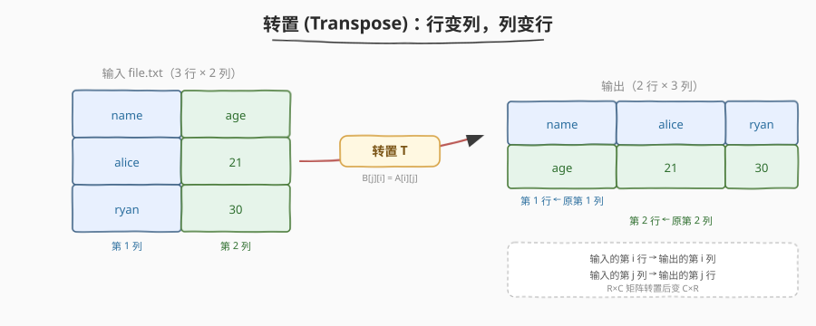

# 转置文件

- **题目名称**：转置文件
- **链接**：[194. 转置文件](https://leetcode.cn/problems/transpose-file/)
- **难度**：中等
- **标签**：Shell、awk、cut、paste、矩阵转置、关联数组

## 1. 题目概述

写一个 **bash 脚本**，读取文件 `file.txt`，将其内容**转置**——**行变列、列变行**，输出转置后的文本。

为简化，题目保证：

- 每行的**字段数相同**（即文本是一个规整的「行 × 列」矩阵）；
- 字段之间用**单个空格**分隔。

**示例**：

假设 `file.txt` 内容如下（3 行 × 2 列）：

```text
name age
alice 21
ryan 30
```

你的脚本应当输出（2 行 × 3 列）：

```text
name alice ryan
age 21 30
```

> ⚠️ 转置后**行数与列数互换**：输入 $R \times C$，输出 $C \times R$。输出的第 $j$ 行由输入的第 $j$ 列所有字段按行序拼接而成，即 $B[j][i] = A[i][j]$。

**约束条件**：

- `file.txt` 行数与每行字段数不限（但所有行字段数相同）；
- 字段为不含空格的连续非空白串，字段间单个空格分隔；
- **进阶**：能否不一次性载入全文件、用**流式**方式实现？

> 💡 这是一道 Shell 题而非算法题——考察的不是手写矩阵转置，而是能否用 **awk 的字段访问** `$i` 与**列累加数组** `s[i]` 把「列收集」这件事压缩进一段十几行的脚本。核心难点在于：bash 没有二维数组，如何用「一维字符串数组 + 空格拼接」模拟出「按列收集」的效果。

---

## 2. 解题思路

### 2.1 暴力思路：bash 二维数组嵌套循环

最笨的做法：用 bash 把文件读进一个二维数组 `mat[row][col]`，先扫第一行拿到列数 $C$，再双层循环——外层遍历列号 $j$，内层遍历行号 $i$，把 `mat[i][j]` 拼成一行输出。

问题显而易见：

- bash **没有真正的二维数组**，只能用 `mat[i*C+j]` 一维偏移模拟，下标计算易错；
- bash 数组赋值需 `read -a` 逐行拆分，多空格、空行边界处理繁琐；
- 全程手写循环，代码冗长且可读性差，完全没用上 awk 的「自动字段切分」能力。

> 💡 转机在于：awk 天然把**每行切成字段** `$1 $2 ... $NF`，且内置**关联数组**（本质哈希表）。把「第 $i$ 列的所有字段」累积到一个字符串 `s[i]` 里——每读一行就往 `s[i]` 末尾拼一个 `$i`——读完全文后 `s[i]` 恰好就是「输出第 $i$ 行」。于是「二维矩阵转置」被降维成「一维数组按列累加」。

### 2.2 核心观察：awk 字段访问 + 列累加数组



转置的数学定义是 $B[j][i] = A[i][j]$：输出的第 $j$ 行由输入的第 $j$ 列构成。把「收集第 $j$ 列」这件事用 awk 表达：

| 概念 | awk 对应 | 说明 |
|------|----------|------|
| 输入第 $i$ 行的字段 | `$1 $2 ... $NF` | awk 自动按空白切分，`NF` = 当前行字段数 = 列数 $C$ |
| 第 $j$ 列的累加器 | `s[j]`（关联数组） | 一个字符串变量，逐行追加上一行的第 $j$ 个字段 |
| 当前行号 | `NR` | 用来判定首行（首行直接赋值，后续行先拼一个空格） |
| 输出第 $j$ 行 | `print s[j]` | `END` 块中遍历 $j = 1..C$ 逐行打印 |

关键递推：

$$
\underbrace{s[j]_{\text{后}}}_{\text{读完第 }i\text{ 行}} = \begin{cases} \$j & \text{if } i = 1 \\\\ s[j]_{\text{前}} + \text{`` ''} + \$j & \text{if } i > 1 \end{cases}
$$

> ⚠️ **首行特殊处理的原因**：若所有行都套用 `s[j] = s[j] " " $j`，首行时 `s[j]` 未初始化（awk 中为空串 `""`），结果是 `" name"`——**行首多出一个前导空格**。因此首行用 `s[j] = $j` 直接赋值，后续行才拼空格，保证输出无前导空格。这是本题最易踩的格式坑。

> 💡 **为何 `s[j]` 恰好等于「输出第 $j$ 行」？** 因为转置后输出的第 $j$ 行就是输入第 $j$ 列的所有字段按行序排列。而 `s[j]` 正是「逐行把每行的第 $j$ 个字段追加上去」——读完所有 $R$ 行后，`s[j]` 串里依次排着 $A[1][j], A[2][j], \dots, A[R][j]$，用空格分隔，正是输出第 $j$ 行。**「按列收集」与「按行累加」在转置下等价**——这是本题的灵魂观察。

### 2.3 算法流程图：awk 列累加

![awk 列累加流程：逐行读 → 按字段号累加到 s[i] → END 输出](../images/transpose_awk_flow.svg)

awk 脚本由三部分构成——主块（每行执行一次）+ `END` 块（全文读完后执行一次）：

| 阶段 | 代码位置 | 行为 | 说明 |
|------|----------|------|------|
| ① 读取行 | 主块入口 | awk 自动读入一行，切分为 `$1..$NF` | `NF` = 列数 $C$，`NR` = 当前行号 |
| ② 遍历字段 | `for (i=1; i<=NF; i++)` | 对当前行的每个字段 $i$ | $i$ 既是字段号也是列号 |
| ③ 累加 | `if (NR==1) s[i]=$i; else s[i]=s[i]" "$i` | 首行赋值 / 后续行空格拼接 | `s[i]` 累积「原第 $i$ 列」 |
| ④ 输出 | `END { for (i=1; i<=NF; i++) print s[i] }` | 逐列打印 `s[i]` | `print` 自动补换行 |

> ⚠️ **`END` 块里的 `NF` 从哪来？** awk 中 `NF` 是「当前记录的字段数」，进入 `END` 块时它**保留最后一行的值**。因为题目保证所有行字段数相同，故末行的 `NF` = 列数 $C$，`for (i=1; i<=NF; i++)` 恰好遍历 $C$ 列。若担心末行异常，可在首行用 `cols=NF` 显式保存列数，`END` 中改用 `for (i=1; i<=cols; i++)`（见 3 节解法 B）。

### 2.4 示例演算

用题目示例 `name age / alice 21 / ryan 30` 走一遍，观察 `s[]` 的逐行演化与最终输出：

![3 行输入 → s[] 逐行演化 → 2 行输出](../images/transpose_example_walkthrough.svg)

| 阶段 | 当前输入行 | `s[1]` | `s[2]` | 说明 |
|------|-----------|--------|--------|------|
| NR==1 | `name age` | `name` | `age` | 首行直接赋值，无前导空格 |
| NR==2 | `alice 21` | `name alice` | `age 21` | 空格拼接第 2 行的第 $i$ 字段 |
| NR==3 | `ryan 30` | `name alice ryan` | `age 21 30` | 累加完成，`s[i]` = 输出第 $i$ 行 |
| END | — | print → `name alice ryan` | print → `age 21 30` | 遍历 `s[1..2]` 逐行输出 |

> 💡 **观察 `s[1]` 的演化轨迹**：`name` → `name alice` → `name alice ryan`——这正是输入**第 1 列**（`name / alice / ryan`）自上而下的字段序列。`s[2]` 同理对应第 2 列。**累加方向（行）与收集目标（列）正交**，这是「用一维数组模拟转置」能成立的根本原因。

---

## 3. 参考代码

### Bash（解法 A：awk 列累加，推荐）

```bash
# Read from the file file.txt and print its transposed content.
awk '
{
    for (i = 1; i <= NF; i++) {
        if (NR == 1) {
            s[i] = $i
        } else {
            s[i] = s[i] " " $i
        }
    }
}
END {
    for (i = 1; i <= NF; i++) {
        print s[i]
    }
}
' file.txt
```

**逐段拆解**：

- `for (i = 1; i <= NF; i++)`：遍历当前行的每个字段。`$i` 是第 $i$ 个字段的值，`i` 同时也是**列号**——这是能用单个下标 `s[i]` 收集整列的关键。
- `if (NR == 1) s[i] = $i`：首行直接赋值，避免后续拼接产生前导空格。
- `else s[i] = s[i] " " $i`：后续行用 `" "`（一个空格字面量）把新字段拼到 `s[i]` 末尾。awk 中字符串拼接直接并排书写：`s[i] " " $i` 即「原 `s[i]` + 空格 + 当前字段」。
- `END { for (i = 1; i <= NF; i++) print s[i] }`：全文读完后，`s[1..C]` 已是输出的各行，逐个 `print`（自动补换行）。`NF` 在 `END` 中保留末行值 = 列数 $C$。

> 💡 **为何把 awk 脚本写在单引号内？** 单引号内一切字面，shell 不会对 `$i`、`$1`、`NF` 等做变量展开——这些是 **awk 的变量**而非 shell 变量。若误用双引号，shell 会先尝试把 `$i` 当 shell 变量展开成空串，awk 拿到的就是残缺脚本。包裹 awk 脚本永远用单引号。

### Bash（解法 B：awk 显式保存列数，更健壮）

```bash
awk '
{
    if (NR == 1) cols = NF
    for (i = 1; i <= NF; i++) {
        if (NR == 1) {
            s[i] = $i
        } else {
            s[i] = s[i] " " $i
        }
    }
}
END {
    for (i = 1; i <= cols; i++) {
        print s[i]
    }
}
' file.txt
```

**思路**：首行时用 `cols = NF` 显式保存列数，`END` 中改用 `for (i=1; i<=cols; i++)`。不再依赖「`NF` 在 `END` 中保留末行值」这一隐式行为，即使末行因格式异常（如多空格导致 `NF` 偏移）也不影响输出列数。代价是多一个变量与一次赋值，可读性与健壮性更佳。

> 💡 **解法 A vs B**：A 依赖「所有行字段数相同 ⇒ 末行 `NF` = 列数」这一题目保证；B 把列数在首行**显式固化**，与末行无关。在题目保证下两者等价，但 B 的思路（「关键量尽早保存，不依赖隐式残留状态」）是更通用的工程习惯。**面试推荐解法 A**（最简短），并能在被追问时给出 B 作为健壮性改进。

### Bash（解法 C：cut + paste 按列抽取）

```bash
cols=$(head -n 1 file.txt | wc -w)
for i in $(seq 1 "$cols"); do
    cut -d' ' -f"$i" file.txt | paste -sd' '
done
```

**逐段拆解**：

- `cols=$(head -n 1 file.txt | wc -w)`：取第一行，用 `wc -w` 数字段数得到列数 $C$。
- `for i in $(seq 1 "$cols")`：对每个列号 $i$ 单独抽一列。
- `cut -d' ' -f"$i" file.txt`：以空格为分隔符，抽取每行的第 $i$ 个字段——输出是「第 $i$ 列」的所有字段，每行一个。
- `paste -sd' '`：`-s`（serialize）把多行合并成一行，`-d' '` 指定空格为分隔符——即把「每行一个字段」转成「一行用空格连接」，恰为输出第 $i$ 行。

> ⚠️ **解法 C 的局限**：`cut -d' '` 以**单个空格**为分隔符，若字段间有**多个连续空格**，`cut` 会把空隙当成空字段导致错位（awk 则以「任意连续空白」为分隔符，更健壮）。本题保证「单个空格分隔」故可用，但生产环境优先选 awk。另外解法 C 对每列都**完整扫描一次文件**（共 $C$ 遍），而 awk 一遍扫描即可，故 C 的时间常数为 A 的 $C$ 倍。

### Python（等价实现）

```python
with open("file.txt") as f:
    rows = [line.split() for line in f]    # 每行切成字段列表，得 R×C 二维表

# zip(*rows) 把「行列表」转置成「列列表」：rows 的第 j 列 → 结果的第 j 行
for col in zip(*rows):
    print(" ".join(col))
```

**说明**：

- `line.split()` 无参 `split()` 以任意空白为分隔符，自动忽略行首行尾与连续多空格——语义等价于 awk 的字段切分。
- `zip(*rows)` 是 Python 的**原生转置**：`*rows` 把行列表解包成 `zip(row1, row2, ...)`，`zip` 按位置配对，第 $i$ 次产出元组 `(row1[i], row2[i], ...)`——即原第 $i$ 列的所有字段，正是输出第 $i$ 行。
- `" ".join(col)` 用空格连接元组得输出行。时间 $O(R \times C)$，空间 $O(R \times C)$（一次性载入全表）。

> 💡 Python 版揭示了「转置」的本质——`zip(*rows)` 就是 $B[j][i] = A[i][j]$ 的直接表达。awk 版的 `s[i]` 累加是「流式版 `zip`」：不一次性载入全表，而是一行一行地往列累加器里喂字段。二者数学等价，差异只在「在线 vs 离线」。

---

## 4. 复杂度分析

| 维度 | 复杂度 | 说明 |
|------|--------|------|
| 时间（解法 A / B） | $O(R \cdot C)$ | 每个字段访问一次（累加拼接），共 $R \cdot C$ 个字段；`END` 输出 $C$ 行各 $R$ 字段 |
| 时间（解法 C） | $O(R \cdot C)$ | 表达式相同，但常数大 $C$ 倍：每列都完整扫描一次文件，共 $C$ 遍 $\times$ 每遍 $R$ 行 |
| 时间（Python） | $O(R \cdot C)$ | `zip(*rows)` 遍历 $R \cdot C$ 个元素 |
| 空间（解法 A / B） | $O(R \cdot C)$ | `s[1..C]` 共存 $R \cdot C$ 个字段字符（全文规模的字符串） |
| 空间（解法 C） | $O(R)$ | 每次循环只缓存「一列」的 $R$ 个字段，处理完即丢弃 |
| 空间（Python） | $O(R \cdot C)$ | `rows` 二维表一次性载入全文 |

> ⚠️ **为何解法 A 空间是 $O(R \cdot C)$ 而非 $O(C)$？** 虽然 `s[]` 数组只有 $C$ 个槽位，但每个 `s[i]` 是一个长度随行数线性增长的字符串——读完 $R$ 行后 `s[i]` 长 $R$ 个字段。故 $C$ 个字符串总字符数 = $R \cdot C$，空间上界为 $O(R \cdot C)$。这是「流式累加但需保存全列」的固有代价：转置要求**读完所有行**才能输出任一列，无法做到 $O(C)$ 在线输出。

> 💡 **解法 C 的空间优势**：cut 每次只抽一列、处理完即释放，峰值空间 $O(R)$（一列的字段数）。当 $C \ll R$ 且文件巨大时，解法 C 的内存占用远低于 A——但代价是 $C$ 倍的时间常数。这是「时间-空间权衡」的典型体现。

---

## 5. 扩展：cut vs awk 的字段切分差异与 `paste -s`

### 5.1 cut 与 awk 的分隔符语义对比

| 工具 | 分隔符 | 连续空白处理 | 空字段 |
|------|--------|--------------|--------|
| `cut -d' '` | **单个**空格字符 | 每个空格都是一个分隔符，连续空格产生**空字段** | 会产生，导致字段号错位 |
| `awk`（默认） | **连续空白**（FS = `[ \t]+`） | 连续空白当一个分隔符，自动忽略行首行尾空白 | 不产生 |

示例对比，对输入 `a  b`（`a` 与 `b` 间两个空格）：

```text
cut -d' ' -f1  → a
cut -d' ' -f2  → （空，因第 2 字段是两个空格间的空串）
cut -d' ' -f3  → b

awk '{print $2}' → b   （连续空白当一个分隔符，$2 直接是 b）
```

> ⚠️ 本题保证「字段间单个空格」，故 `cut` 与 `awk` 等价。但若输入可能含多空格（生产环境常见），`cut -d' '` 会因空字段错位而崩坏，必须改用 `awk` 或先把多空格挤压成单空格（`tr -s ' '`）。

### 5.2 `paste -s` 的序列化语义

`paste -sd' '` 的两个开关：

| 开关 | 含义 |
|------|------|
| `-s` | **serialize**（序列化）：把多行输入合并成**一行**，而非默认的「逐行并排」 |
| `-d' '` | 指定合并时的**分隔符**为空格（默认是 `Tab`）；`-d` 后跟分隔符列表，逐个轮换 |

```text
输入:          paste -sd' ' 输出:
name           name alice ryan
alice
ryan
```

> 💡 **`paste -s` vs `tr '\n' ' '`**：`tr '\n' ' '` 把所有换行替换成空格，但**末尾会多一个空格且无结尾换行**；`paste -sd' '` 只在行间插空格、保留结尾一个换行，格式更干净。故「多行合一行」优先用 `paste -sd' '`。

### 5.3 一行 awk 极简版

把主块与 `END` 压缩成一行（面试白板常用）：

```bash
awk '{for(i=1;i<=NF;i++)s[i]=(NR==1?$i:s[i]" "$i)}END{for(i=1;i<=NF;i++)print s[i]}' file.txt
```

用三元运算符 `(NR==1 ? $i : s[i]" "$i)` 把首行赋值与后续拼接合一。语义与解法 A 完全一致，仅是写法紧凑——代价是可读性下降，调试时不推荐。

---

## 6. 面试要点

1. **为什么首行要特殊处理 `s[i] = $i`，不能统一用 `s[i] = s[i] " " $i`？**

   > 首行时 `s[i]` 未初始化（awk 中为空串 `""`）。若统一套用 `s[i] = s[i] " " $i`，首行结果是 `" name"`——**行首多一个前导空格**，输出格式错误。首行用直接赋值 `s[i] = $i` 避免 leading space，后续行才用空格拼接。这是本题最易踩的格式坑，等价于「字符串拼接时要判断是不是第一个元素」。

2. **`END` 块里的 `NF` 为什么能当列数用？是否可靠？**

   > awk 中 `NF` 是「当前记录的字段数」，进入 `END` 块时它**保留最后一行的值**。题目保证「所有行字段数相同」，故末行 `NF` = 列数 $C$，`for (i=1; i<=NF; i++)` 恰好遍历 $C$ 列。这在题目保证下可靠；若担心末行异常（如多空格导致 `NF` 偏移），可在首行 `cols=NF` 显式保存，`END` 中用 `cols` 替代 `NF`（解法 B）——「关键量尽早保存，不依赖隐式残留状态」是更通用的工程习惯。

3. **解法 C（cut + paste）为什么不如 awk 推荐？两个原因。**

   > ① **健壮性**：`cut -d' '` 以单个空格为分隔符，连续多空格会产生空字段导致字段号错位；awk 默认以「连续空白」为分隔符，自动忽略行首行尾与多空格，更健壮。② **效率**：cut 对每列都完整扫描一次文件，共 $C$ 遍，时间常数为 awk 的 $C$ 倍；awk 一遍扫描即可收集所有列。本题保证单空格故 cut 可用，但生产环境优先 awk。

4. **awk 的 `$i` 与 `s[i]` 中的 `i` 有什么关系？为何能共用一个下标？**

   > `$i` 是当前行第 $i$ 个字段的值，`i` 同时也是**列号**——因为每行的字段按位置对应列。`s[i]` 是「第 $i$ 列的累加器」。二者共用下标 `i` 是因为「字段位置 = 列号」这一对应关系：遍历当前行的第 $i$ 个字段，就是在往第 $i$ 列的累加器里喂数据。这是能用单个循环同时处理「行内字段遍历」与「列累加」的关键。

5. **能否做到 $O(C)$ 在线输出（读完一行就输出一列）？为什么不行？**

   > 不能。转置要求输出的第 $j$ 行 = 输入的第 $j$ 列，而第 $j$ 列的最后一个字段在**最后一行**才到达——必须读完所有 $R$ 行才能凑齐任一列。故 `s[i]` 必须累积全文的 $R$ 个字段，空间下界 $O(R \cdot C)$，无法在线输出。这是「转置」这一操作的固有 IO 特性：它打破了「行序」——输出顺序（按列）与输入顺序（按行）正交，无法流式产生。对照 [192. 统计词频](https://leetcode.cn/problems/word-frequency/) 的哈希累加虽也需全文扫一遍，但输出顺序与哈希表遍历序无关，无此约束。

> 💡 **一句话总结**：本题的灵魂是「**用 awk 的字段访问 `$i` + 关联数组 `s[i]` 把「按列收集」压缩成一段十几行脚本**」——遍历每行字段时往 `s[i]` 末尾拼一个 `$i`，读完所有行后 `s[i]` 恰为输出第 $i$ 行。三大要点：① 首行 `s[i]=$i` 避免 leading space；② `END` 中 `NF` 保留末行值 = 列数（或首行显式存 `cols`）；③ 「字段位置 = 列号」让单循环同时完成行内遍历与列累加。记牢 `s[i] = s[i] " " $i` 这一累加范式，就掌握了 awk 按列处理的命脉。

---

## 7. 同类练习题

- [192. 统计词频](https://leetcode.cn/problems/word-frequency/)：同属 Shell 系列，考察 `awk`/`sort`/`uniq` 管道组合与关联数组 `c[$i]++` 计数——对照本题 `s[i]` 字符串累加，体会「awk 关联数组的两类用法：数值累加 vs 字符串拼接」
- [193. 有效电话号码](https://leetcode.cn/problems/valid-phone-numbers/)：同属 Shell 系列，考察 `grep -E` 正则逐行过滤——与本题「awk 逐行字段累加」形成「行级过滤 / 字段级重组」两个维度的 Shell 文本处理对照
- [195. 第十行](https://leetcode.cn/problems/tenth-line/)：Shell 系列基础题，考察 `sed -n '10p'` / `awk 'NR==10'` 按行号定位——与本题「`NR` 判首行」形成 `NR` 行号判定的不同用法对照
- [8. 字符串转换整数 (atoi)](https://leetcode.cn/problems/string-to-integer-atoi/)：算法题版的「逐字符状态机」，用 DFA 处理字段——对照本题用 awk 自动字段切分，体会「手写状态机 vs 工具内置字段切分」的取舍
- [54. 螺旋矩阵](https://leetcode.cn/problems/spiral-matrix/)：算法题版的「按不同顺序遍历二维矩阵」，按螺旋序读取矩阵元素——对照本题按列序读取（转置），体会「矩阵的多种遍历序（行序 / 列序 / 螺旋序）」与各自实现方式
