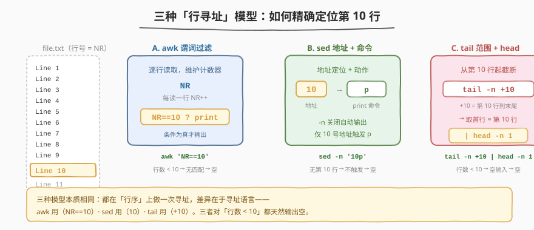
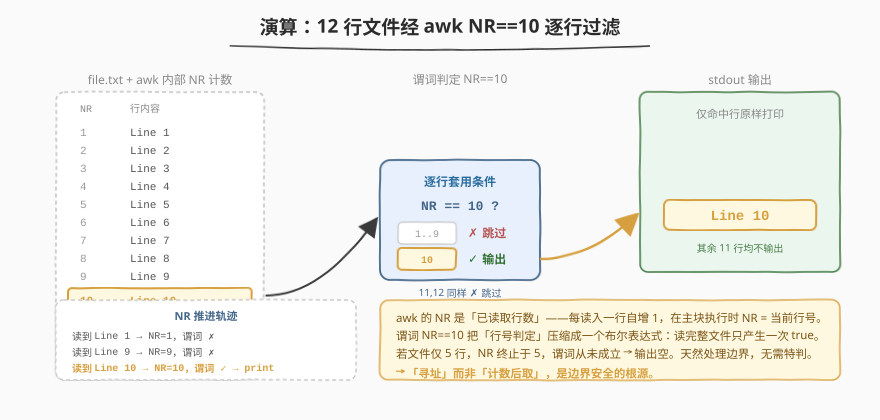
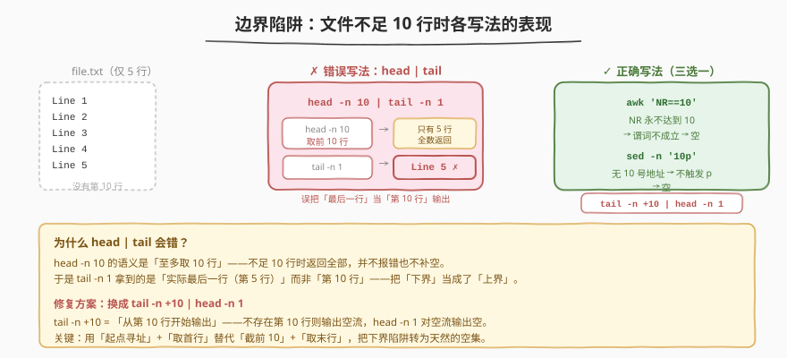

# LeetCode 第十行 题解

## 1. 题目概述

- **标题 / 题号**：第十行（#195，easy）
- **链接**：https://leetcode.cn/problems/tenth-line/
- **难度**：简单
- **标签**：Shell、awk、sed、tail/head、行寻址、边界处理

**题意**：写一个 **bash 脚本**，读取文件 `file.txt`，输出其中的**第 10 行**。

**示例**：

假设 `file.txt` 内容如下（共 12 行）：

```text
Line 1
Line 2
Line 3
Line 4
Line 5
Line 6
Line 7
Line 8
Line 9
Line 10
Line 11
Line 12
```

你的脚本应当输出第 10 行：

```text
Line 10
```

**约束**：

- `file.txt` 行数不限；
- **若文件不足 10 行，应输出空（什么都不打印）**；
- **进阶**：至少有三种解法，请尽量都尝试。

> 💡 这是一道 Shell 题而非算法题——考察的不是手写循环计数，而是能否用 **Unix 文本工具的「行寻址」能力**把「取第 N 行」压缩成一行命令。核心难点不在「写出来」，而在「写对边界」：文件不足 10 行时最容易踩坑的，恰恰是最直觉的 `head | tail` 组合。

## 2. 解题思路

### 2.1 暴力思路：bash 逐行计数循环

最笨的做法：用 bash `while read` 逐行读入，维护一个计数器 `i`，每读一行 `i++`，当 `i==10` 时 `echo` 当前行后 `break`——

```bash
i=0
while read -r line; do
    i=$((i+1))
    if [ "$i" -eq 10 ]; then
        echo "$line"
        break
    fi
done < file.txt
```

问题显而易见：

- bash 循环冗长，计数、比较、分支全要手写，可读性差；
- `break` 提前退出看似「优化」，实则多此一举——Unix 工具天生就支持「按行号寻址」；
- 完全没用上 awk / sed / tail 的内置行号机制，把「一行能搞定的事」写成了十几行。

> 💡 转机在于：「取第 N 行」是一个**结构化的行寻址**操作，而 awk 的 `NR`、sed 的地址、tail 的 `+N` 范围都是为此而生。把「手写循环计数」抽象成「一行寻址表达式」，整道题就压缩成一行命令。

### 2.2 核心观察：三种「行寻址」模型



「取第 10 行」的本质是在**行序**上做一次寻址。Unix 文本三件套（awk / sed / tail）各有一套寻址语言，殊途同归：

| 模型 | 工具 | 寻址语言 | 一行写法 | 语义 |
|------|------|----------|----------|------|
| A. 谓词过滤 | awk | `NR==10`（行号变量 + 布尔条件） | `awk 'NR==10' file.txt` | 逐行读取，NR 自增，条件为真才输出 |
| B. 地址定位 | sed | `10`（行号地址）+ `p`（print 命令） | `sed -n '10p' file.txt` | 定位第 10 行地址，执行 print |
| C. 范围截取 | tail + head | `+10`（从第 10 行起的范围起点） | `tail -n +10 file.txt \| head -n 1` | 从第 10 行起截断，取首行 |

三者对应三种思维范式：

- **awk 是「过滤器」**——它逐行流式处理，`NR==10` 是一个**谓词**（predicate），只让满足条件的行通过。本质是 `if (NR==10) print`。
- **sed 是「编辑器」**——`10` 是一个**地址**（address），`p` 是作用于该地址的命令。`-n` 关闭默认输出，只有 `p` 命令显式打印的行才输出。
- **tail 是「切片器」**——`-n +10` 是一个**范围**（range），表示「从第 10 行开始到文件末尾」。再接 `head -n 1` 取这个范围的首行，即第 10 行。

> ⚠️ **`sed -n` 的 `-n` 不能漏**：sed 默认会**输出每一行**（模式空间处理完后自动 print）。不加 `-n`，则 `10p` 会让第 10 行被输出**两次**（一次默认输出 + 一次 `p` 命令），其余行各输出一次。`-n` 关闭默认输出，只保留 `p` 显式打印的行——这是「sed 按地址抽取行」的标准范式。

> 💡 **为何三种工具的边界行为天然安全？** 它们都以「第 10 行」为**寻址目标**，而非「前 10 行的末行」。当文件不足 10 行时，第 10 行**不存在**——awk 的谓词从未成立、sed 的地址无匹配、tail 的 `+10` 范围为空集，三者都自然输出空。这与下文 5.1 节那个踩坑写法形成鲜明对照。

### 2.3 算法流程图：awk 逐行 + NR 谓词



以推荐解法 A（awk）为例，它的工作模型是典型的「逐行流式过滤」：

| 阶段 | 行为 | 说明 |
|------|------|------|
| ① 逐行读取 | awk 自动按 `\n` 切分 `file.txt` | 每读一行 `NR` 自增 1，无需手写循环 |
| ② 谓词判定 | 对当前行套用 `NR==10` | 布尔表达式：行号为 10 则 true |
| ③ 输出 / 跳过 | true 则触发默认动作 `print $0`，false 则跳过 | 读完整文件只产生一次 true |

关键递推：

$$
\text{NR}_{\text{当前}} = \text{NR}_{\text{上一行}} + 1, \quad \text{输出} = \begin{cases} \text{当前行} & \text{if } \text{NR} = 10 \\\\ \text{（无）} & \text{otherwise} \end{cases}
$$

> 💡 **NR 的含义**：`NR`（Number of Records）是 awk 内置变量，记录「已读取的记录数」——在默认按行切分下就是「当前行号」。它在主块执行前自增，故主块内 `NR` 恰为当前行号。`NR` 与 `NF`（字段数）是 awk 最常用的两个内置变量，记牢这「双 N」就掌握了 awk 的核心。

### 2.4 示例演算：边界陷阱



用一个**只有 5 行**的文件检验边界行为——这是本题最易踩坑的场景：

| 写法 | 5 行文件输出 | 是否正确 | 原因 |
|------|------------|----------|------|
| `awk 'NR==10'` | 空 | ✓ | NR 终止于 5，谓词从未成立 |
| `sed -n '10p'` | 空 | ✓ | 无 10 号地址，`p` 不触发 |
| `tail -n +10 \| head -n 1` | 空 | ✓ | `+10` 范围为空集，head 对空流输出空 |
| `head -n 10 \| tail -n 1` | `Line 5` | ✗ | head 不足 10 行返回全部，tail 取末行 = 第 5 行 |

> ⚠️ **最后一行是本题最大的陷阱**：`head -n 10 | tail -n 1` 看似「取前 10 行的末行 = 第 10 行」天衣无缝，但 `head -n 10` 的语义是「**至多**取 10 行」——不足 10 行时返回全部而**不报错**，于是 `tail -n 1` 拿到的是「实际最后一行（第 5 行）」而非「第 10 行」。它把「下界（最多 10）」误当成了「上界（恰好第 10）」。修复方法是改成 `tail -n +10 | head -n 1`——用「起点寻址」+「取首行」替代「截前 10」+「取末行」，把下界陷阱转为天然的空集。

> 💡 **边界思维的黄金法则**：凡是「取第 N 行」类操作，问自己一句「**不足 N 行时怎么办**」。以「第 N 行」为寻址目标（awk NR / sed 地址 / tail +N）的工具天然输出空；以「前 N 行」为切片（head -n N）的工具会把不足部分用末行填充——前者是「寻址」，后者是「截断」，二者在边界处行为分叉。

## 3. 参考代码

### Bash（解法 A：awk 谓词过滤，推荐）

```bash
awk 'NR==10' file.txt
```

**逐段拆解**：

- `awk`：流式文本处理工具，逐行读取输入。
- `NR==10`：awk 的「模式」位置写一个布尔表达式——`NR` 是内置行号变量，`==10` 是判定条件。条件为真的行触发默认动作 `{print $0}`（打印整行）。
- `file.txt`：输入文件。

> 💡 **awk 的「模式-动作」结构**：awk 脚本形如 `pattern { action }`。`pattern` 为真时执行 `action`；省略 `action` 则执行默认动作 `print`；省略 `pattern` 则对每一行执行。本题 `NR==10` 是 pattern、无 action，等价于 `NR==10 { print $0 }`——「行号为 10 时打印该行」。

### Bash（解法 B：sed 地址 + print 命令）

```bash
sed -n '10p' file.txt
```

**逐段拆解**：

- `sed`：流编辑器，按行应用编辑命令。
- `-n`：**关闭默认输出**——sed 默认每处理完一行就输出模式空间，`-n` 抑制此行为，只输出显式 `p` 的行。
- `10p`：`10` 是**行号地址**，`p` 是 **print 命令**——「对第 10 行执行 print」。地址与命令紧挨书写，是 sed 的标准语法。
- `file.txt`：输入文件。

> ⚠️ **漏写 `-n` 的后果**：不加 `-n`，sed 对每行都默认输出，第 10 行额外被 `p` 输出一次——结果是 13 行输出（12 行原文 + 第 10 行重复一次）。`-n` + `p` 是「按地址抽取行」的固定搭配，记牢这对组合。

### Bash（解法 C：tail 范围 + head 取首行）

```bash
tail -n +10 file.txt | head -n 1
```

**逐段拆解**：

- `tail -n +10`：`-n` 接 `+N` 表示「**从第 N 行开始**输出到末尾」——注意 `+` 号表示「起点」，与 `tail -n 10`（输出最后 10 行）语义截然不同。`tail -n +10 file.txt` 输出第 10、11、12… 行。
- `| head -n 1`：管道接 `head -n 1` 取首行——即第 10 行。
- 不足 10 行时：`tail -n +10` 输出空流，`head -n 1` 对空输入输出空，天然处理边界。

> 💡 **`tail -n` 的两种语义**：`tail -n 10`（无 `+`）= 输出**最后** 10 行；`tail -n +10`（有 `+`）= 从**第 10 行起**输出到末尾。一个 `+` 号决定了是「从末尾数」还是「从开头数」。本题需要「从第 10 行起」的起点语义，必须带 `+`。

### Bash（解法 D：head + tail + 行数预检，修复踩坑写法）

```bash
lines=$(wc -l < file.txt)
if [ "$lines" -ge 10 ]; then
    head -n 10 file.txt | tail -n 1
fi
```

**思路**：先用 `wc -l < file.txt` 取行数（`<` 重定向让 `wc` 只读不打印文件名），若 ≥10 才执行 `head | tail`。这是给「踩坑写法」打的补丁——但显然比解法 C 的 `tail -n +10 | head -n 1` 啰嗦，**仅用于说明如何修复**，不推荐实战。

### Python（等价实现）

```python
with open("file.txt") as f:
    for i, line in enumerate(f, start=1):
        if i == 10:
            print(line.rstrip("\n"))
            break
```

**说明**：

- `enumerate(f, start=1)`：给每行编号，从 1 开始——等价于 awk 的 `NR`。
- `i == 10`：行号判定，等价于 `NR==10` 谓词。
- `break`：找到即退出，避免读完后续行（awk 无 break 但读完整文件，对 12 行无妨，对超大文件多读几行有微小开销）。
- `rstrip("\n")`：去掉行尾换行符，`print` 自己补一个——避免输出双换行。
- 不足 10 行时循环自然结束，不进入 `if`，输出空——与 awk 边界行为一致。

> 💡 Python 版揭示了 awk 的「流式过滤」本质——`for + enumerate + if` 就是手写的 `awk 'NR==10'`：循环读行、维护行号、谓词判定。awk 把这三步压缩进 `NR==10` 一个表达式，是「工具内置行号机制」对「手写计数循环」的降维。

## 4. 复杂度分析

| 维度 | 复杂度 | 说明 |
|------|--------|------|
| 时间（解法 A / B / C） | $O(n)$ | 均需读到第 10 行（至多读 10 行即可定位）；`tail -n +10` 需跳过前 9 行 |
| 时间（Python） | $O(1)$ 摊还 | 找到第 10 行即 `break`，至多读 10 行 |
| 空间（全部解法） | $O(1)$ | 流式处理，同一时刻只缓存当前行，无需载入全文件 |

> ⚠️ **为何时间是 $O(n)$ 而非 $O(1)$？** 严格说「取第 10 行」只需读前 10 行，与文件总行数 $n$ 无关，应为 $O(1)$（相对于 $n$）。但 awk / sed 默认会**读完整文件**（除非提前退出），故最坏 $O(n)$。对 `tail -n +10 | head -n 1`，`head -n 1` 取到首行后会触发 `SIGPIPE` 关闭 `tail` 的写端，提前终止——这是 Unix 管道的「提前退出」优化，使实际读取行数接近 10。Python 的 `break` 显式提前退出，是 $O(1)$。

> 💡 **管道的 SIGPIPE 优化**：`tail -n +10 file.txt | head -n 1` 中，`head` 读到第 1 行（即原文件第 10 行）后退出，关闭管道读端；`tail` 继续写时收到 `SIGPIPE` 信号而终止，不再读取后续行。这是 Unix 管道天然的「短路」机制——`cmd1 | head -n N` 会让 `cmd1` 在产出 $N$ 行后停止。故解法 C 的实际开销接近 $O(10)$，与文件大小无关。

## 5. 扩展：head|tail 陷阱与 sed/awk/tail 的寻址语义对比

### 5.1 `head -n N | tail -n 1` 为何是错的

「取第 N 行」最直觉的写法是 `head -n N file | tail -n 1`——「取前 N 行，再取最后一行」。在文件**恰好 ≥ N 行**时它正确，但**不足 N 行**时崩坏：

| 文件行数 | `head -n 10` 输出 | `tail -n 1` 输出 | 期望 | 正确？ |
|----------|-------------------|------------------|------|--------|
| ≥ 10 | 前 10 行 | 第 10 行 | 第 10 行 | ✓ |
| 5 | 全部 5 行 | 第 5 行 | 空 | ✗ |
| 0 | 空 | 空 | 空 | ✓ |

根因：`head -n 10` 的语义是「**至多** 10 行」而非「**恰好** 10 行」——不足时返回全部，把「下界」当成了「上界」。

**三种修复思路**：

| 修复 | 写法 | 思路 |
|------|------|------|
| ① 换起点寻址 | `tail -n +10 \| head -n 1` | 用「从第 10 行起」的起点语义，不足则空集 |
| ② 预检行数 | `lines=$(wc -l <f); [ $lines -ge 10 ] && head -n 10 f \| tail -n 1` | 显式判断，啰嗦但直观 |
| ③ 直接换工具 | `awk 'NR==10'` / `sed -n '10p'` | 用天然安全的寻址工具，根本规避 |

> 💡 **「下界 vs 上界」思维**：`head -n N` 是「**至多** N」（下界，不足则少给）；`tail -n +N` 是「**从 N 起**」（起点，不足则空）。取第 N 行要的是「恰好第 N 行」——用「起点寻址」天然匹配，用「截前 N」则会把不足部分用末行填充。这区分是本题的灵魂。

### 5.2 sed / awk / tail 三种寻址语义对比

| 工具 | 寻址类型 | 语法 | 不足 N 行 | 典型用途 |
|------|----------|------|-----------|----------|
| awk | 谓词（行号变量） | `NR==N` | 谓词不成立 → 空 | 行号判定 + 后续字段加工 |
| sed | 地址 + 命令 | `-n 'Np'` | 地址无匹配 → 空 | 按行号抽取 / 替换 / 删除 |
| tail | 范围起点 | `-n +N` | 范围为空集 → 空 | 从某行起截取后缀 |
| head | 截前 N | `-n N` | 返回全部（不足则少） | 取文件前缀 |

> ⚠️ **前三者以「第 N 行」为寻址目标**，不足则空；**head 以「前 N 行」为切片**，不足则少给。取第 N 行用前三者，取前 N 行用 head——工具选错则边界崩坏。

### 5.3 一行 sed 进阶：地址范围

sed 的地址不只是单行号，还支持**范围地址** `N,Mp`（打印第 N 到 M 行）与 `N,$p`（从第 N 行到末尾）：

```bash
sed -n '10,20p' file.txt     # 打印第 10-20 行
sed -n '10,$p' file.txt      # 打印第 10 行到末尾（等价于 tail -n +10）
sed -n '$p' file.txt         # 打印最后一行（$ = 末行地址）
```

`$` 是 sed 的特殊地址，表示「最后一行」——`sed -n '$p'` 取末行，是「取第 N 行」的泛化（N = 末行）。注意 `$` 在 sed 地址里是「末行」而非 shell 的变量展开——单引号包裹下 shell 不会干扰。

## 6. 面试要点

1. **`awk 'NR==10'` 中 `NR` 是什么？为何能当行号用？**

   > `NR`（Number of Records）是 awk 内置变量，记录「已读取的记录数」。awk 默认按行切分输入（记录 = 行），每读入一行 `NR` 自增 1，在主块执行时 `NR` 恰为当前行号。`NR==10` 是一个谓词（布尔条件），条件为真时触发默认动作 `print $0`——等价于「行号为 10 时打印该行」。awk 还有 `NF`（Number of Fields，当前行字段数），二者合称 awk 的「双 N」。

2. **`sed -n '10p'` 中 `-n` 和 `p` 各有什么作用？漏掉 `-n` 会怎样？**

   > `-n` 关闭 sed 的默认输出（默认每处理完一行就输出模式空间），`p` 是 print 命令，显式输出匹配地址的行。`10` 是行号地址，`10p` 即「对第 10 行执行 print」。漏掉 `-n` 则 sed 对每行都默认输出，第 10 行额外被 `p` 输出一次——结果是「原文 + 第 10 行重复」。`-n` + `p` 是「按地址抽取行」的固定搭配，缺一不可。

3. **`head -n 10 | tail -n 1` 为什么在文件不足 10 行时会出错？**

   > `head -n 10` 的语义是「**至多**取 10 行」——不足 10 行时返回全部而**不报错**。于是 `tail -n 1` 拿到的是「实际最后一行」而非「第 10 行」。例如 5 行文件会输出第 5 行。根因是把「下界（最多 10）」误当成了「上界（恰好第 10）」。修复方法是改成 `tail -n +10 | head -n 1`——用「从第 10 行起」的起点寻址，不足则空集。

4. **`tail -n 10` 和 `tail -n +10` 有什么区别？**

   > `tail -n 10`（无 `+`）= 输出**最后** 10 行，是从末尾倒数；`tail -n +10`（有 `+`）= **从第 10 行起**输出到末尾，是从开头数。一个 `+` 号决定了「从末尾数」还是「从开头数」。本题需要「从第 10 行起」的起点语义，必须带 `+`；不带 `+` 的 `tail -n 10` 取的是末尾 10 行，与「第 10 行」完全无关。

5. **三种解法（awk / sed / tail+head）在文件不足 10 行时为何都天然输出空？**

   > 三者都以「第 10 行」为**寻址目标**而非「前 10 行的末行」：awk 的谓词 `NR==10` 在 NR 终止于 5 时从未成立；sed 的地址 `10` 无匹配行故 `p` 不触发；tail 的 `+10` 范围在不足 10 行时为空集，head 对空流输出空。它们都在「第 10 行不存在」时自然返回空，无需特判——这是「寻址」语义相对「截断」语义的边界优势。

> 💡 **一句话总结**：本题的灵魂是「**用 Unix 工具的行寻址能力把『取第 N 行』压缩成一行命令**」——`awk 'NR==10'`（谓词）、`sed -n '10p'`（地址+命令）、`tail -n +10 | head -n 1`（范围+取首）三殊途同归。最大陷阱是 `head -n 10 | tail -n 1`：在不足 10 行时把「下界」当「上界」误输出末行——记牢「取第 N 行用寻址（NR/地址/+N），取前 N 行用 head」，就掌握了行抽取的命脉。

## 同类练习题

| # | 题目 | 与本题的关联 |
|---|------|-------------|
| 193 | [有效电话号码](https://leetcode.cn/problems/valid-phone-numbers/) | 同属 Shell 系列，考察 `grep -E` 正则逐行**过滤**——与本题 `awk NR==10` 按行号**寻址**形成「模式选行 / 行号选行」两个维度对照，体会 awk 既能按谓词（`NR==10`）也能按模式（`/regex/`）选行 |
| 194 | [转置文件](https://leetcode.cn/problems/transpose-file/) | 同属 Shell 系列，考察 `awk` 字段访问 `$i` 与关联数组 `s[i]` 列累加——与本题 `NR` 行号变量形成 awk 内置变量「`NR`（行号） / `NF`（字段数）」双 N 的不同用法对照 |
| 192 | [统计词频](https://leetcode.cn/problems/word-frequency/) | 同属 Shell 系列，考察 `awk`/`sort`/`uniq` 管道组合——与本题单工具一行解法形成「管道编排 / 单工具寻址」的复杂度梯度对照 |
| 8 | [字符串转换整数 (atoi)](https://leetcode.cn/problems/string-to-integer-atoi/) | 算法题版的「逐字符状态机」，用 DFA 处理前导空格/符号/数字——对照本题用工具内置行号机制，体会「手写状态机 vs 工具内置能力」的取舍 |
| 54 | [螺旋矩阵](https://leetcode.cn/problems/spiral-matrix/) | 算法题版的「按特殊顺序遍历矩阵」，按螺旋序读取元素——对照本题按行号序读取（第 10 行），体会「矩阵/文件的不同遍历序（行序 / 螺旋序 / 行号寻址）」与各自实现方式 |
