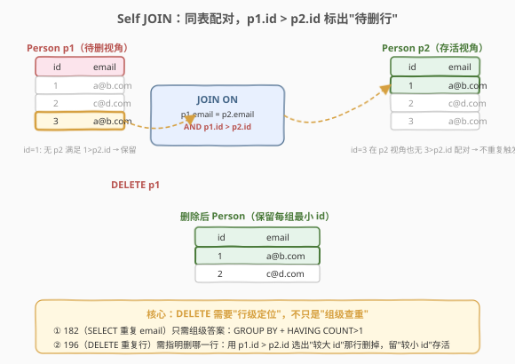
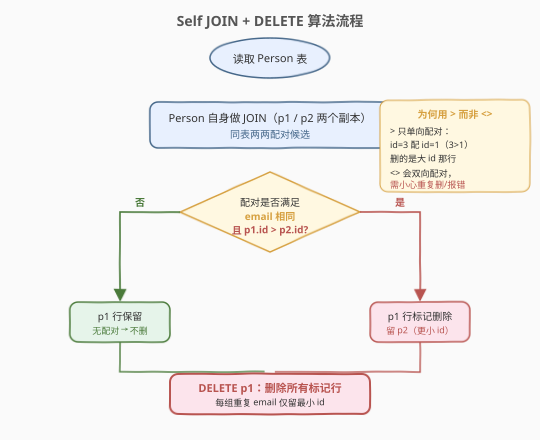
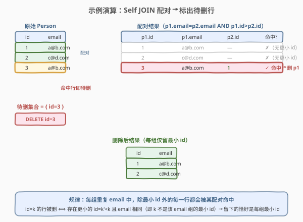

# LeetCode 删除重复的电子邮箱 题解

## 1. 题目概述

- **标题 / 题号**：删除重复的电子邮箱（#196，easy）
- **链接**：https://leetcode.cn/problems/delete-duplicate-emails/
- **难度**：简单
- **标签**：SQL、DELETE、Self JOIN、GROUP BY、子查询、窗口函数

**题意**：给定一张 `Person` 表，编写 SQL **删除**所有重复的电子邮箱——重复指同一 `email` 出现**多于一次**。删除时**只保留每组重复邮箱中 `id` 最小**的那一行，其余重复行删掉。最终 `Person` 表自身被修改，无需返回结果。

**表结构**：

```text
Table: Person
+-------------+---------+
| Column Name | Type    |
+-------------+---------+
| id          | int     |  ← 主键
| email       | varchar |
+-------------+---------+
```

> 💡 **关键约束**：`id` 是主键（每行唯一），`email` 可重复。本题要做的是**原地删除**多余行，而非像 182 题那样只把重复 email **查**出来。"保留最小 id"是核心要求——同样 email 的多行里，id 数值最小的存活，其余全部删除。

**示例 1**：

```text
输入：Person 表
+----+---------+
| id | email   |
+----+---------+
| 1  | a@b.com |
| 2  | c@d.com |
| 3  | a@b.com |
+----+---------+
输出（执行删除后 Person 表变为）：
+----+---------+
| id | email   |
+----+---------+
| 1  | a@b.com |
| 2  | c@d.com |
+----+---------+
解释：a@b.com 出现两次（id=1 与 id=3），保留 id=1（更小），删除 id=3；c@d.com 只出现一次，不动。
```

**约束**：

- `id` 是 `Person` 表的主键，`email` 为 `varchar`
- `email` 全为小写字母，无大小写混用
- 「重复」定义为出现次数 $> 1$；每组重复只留 `id` 最小的一行

> 💡 本题是 182「查找重复的电子邮箱」的 **DELETE 版进阶**。182 只需回答"哪些 email 重复了"（组级答案），而 196 要回答"删掉具体哪几行、保留哪一行"（行级答案 + 存活者选择）。难点从"查重语法"升级为"用 `id` 大小关系定位待删行"，以及绕开 MySQL「不能在子查询中引用 DELETE 目标表」的限制。下文给出三种解法：Self JOIN + DELETE（推荐）、DELETE + GROUP BY 子查询、窗口函数 + DELETE。

## 2. 解题思路

### 2.1 暴力思路：逐行判定删除

最直觉的过程式思路是：遍历每一行，对当前行的 `email` 查全表看有没有更小 `id` 的同 email 行，若有就删掉当前行。这在 Python/C++ 里是"对每行扫一遍找最小 id"的双重循环，但纯 SQL 没有"逐行删除循环"语句。需要转换思路：与其"对每行去查是否有更小 id"，不如**一次性把所有"(待删行, 存活行)"的配对找出来**——这正是 Self JOIN 的用武之地。

> ⚠️ 关键跃迁：182 的答案是"重复 email 的集合"（一个值出现一次即可），196 的答案是"被删行的集合"（要落到具体 `id`）。`GROUP BY email` 能压缩出每组的最小 id，但 DELETE 语义需要"行级定位"——Self JOIN 用 `p1.id > p2.id` 把"哪行该删"直接配对出来，无需二次查找。

### 2.2 核心观察：Self JOIN 用 `p1.id > p2.id` 标出待删行



**关键洞察**：判定"某行应被删"等价于"存在另一行 email 相同且 id 更小"。把表自身 JOIN 自身（`Person p1` JOIN `Person p2`），条件设为 `p1.email = p2.email AND p1.id > p2.id`——凡是被配中的 `p1` 行，都"有更小 id 的同 email 兄弟"，正是该删的行；而 `p2` 行（更小 id）自然存活。`DELETE p1` 一句把所有配中的 `p1` 行删掉，留下的恰好是每组最小 id。

$$\text{p1 行该删} \iff \exists\, \text{p2}: \text{p2.email} = \text{p1.email} \,\land\, \text{p2.id} < \text{p1.id}$$

- `Person p1 JOIN Person p2`：同一张表取两个别名做笛卡尔积候选；
- `ON p1.email = p2.email`：email 相同才算配对候选；
- `AND p1.id > p2.id`：**单向**配对——只让"大 id 行（p1）"配"小 id 行（p2）"，删大留小；
- `DELETE p1`：删的是配中条件里处于 `p1` 位置（较大 id）的那些行。

> ⚠️ **为何用 `>` 而非 `<>`**：`<>`（不等）是双向配对——对 `a@b.com` 的 id=1、id=3 两行，`p1.id <> p2.id` 会同时产出 `(p1=3, p2=1)` 与 `(p1=1, p2=3)` 两对，于是 id=1 与 id=3 都被 `DELETE p1` 命中，整组 email 的行全删光，违反"留最小 id"。用 `>` 单向配对，只让大 id 行当 `p1`，小 id 行当 `p2`，删的永远是大 id 那一侧，小 id 存活。这一处符号差异是本题最易踩的坑。

### 2.3 算法流程图



流程三步走：① 同表 JOIN 取两两配对候选 → ② 用 `email 相同 AND p1.id > p2.id` 筛出"大 id 配小 id"的命中对 → ③ 对所有命中的 `p1` 行执行 `DELETE`。未命中的行（无更小 id 兄弟）即每组最小 id，原样保留。

### 2.4 示例演算



以示例数据 `[(1,a@b.com), (2,c@d.com), (3,a@b.com)]` 为例，遍历 `Person p1` 的每一行，看能否在 `p2` 中找到 `email 相同 AND id 更小` 的行：

| p1.id | p1.email | 找到的 p2.id | 命中? | 处理 |
|-------|----------|-------------|-------|------|
| 1 | a@b.com | —（无 id<1 的同 email 行） | ✗ | 保留 |
| 2 | c@d.com | —（无 id<2 的同 email 行） | ✗ | 保留 |
| 3 | a@b.com | 1（id=1 同 email 且 1<3） | ✓ | **删 p1（id=3）** |

待删集合 = `{ id=3 }`，删除后 `Person` 只剩 id=1、id=2，恰好每组 email 留下最小 id。

> 💡 **规律的对称性**：id=k 的行被删 ⟺ 存在更小 id=k'（k'<k）且 email 相同 ⟺ k 不是该 email 组的最小 id。所以"被删的 = 非最小 id 行"，"留下的 = 每组最小 id 行"，两个集合互补。Self JOIN 的 `>` 配对恰好把前者全部覆盖，无一遗漏、无一误伤。

## 3. 参考代码

### SQL（解法 A：Self JOIN + DELETE，推荐）

```sql
DELETE p1
FROM Person p1
JOIN Person p2
  ON p1.email = p2.email
 AND p1.id > p2.id;
```

> 💡 **写法要点**：
> - `DELETE p1` 指明删除的是 JOIN 结果中处于 `p1` 位置的行（即较大 id 那侧），这是多表 DELETE 语法——`DELETE 别名 FROM ... JOIN ...` 只删指定别名对应的行，`p2` 行不删。
> - `ON p1.email = p2.email AND p1.id > p2.id` 单向配对：大 id 当 `p1`（待删），小 id 当 `p2`（存活）。用 `>` 而非 `<>`，避免双向配对把存活者也删掉。
> - 无需 `DISTINCT`、无需子查询，一条语句搞定，是三种解法中最简洁、执行计划也最稳定的写法。
> - MySQL / PostgreSQL 均支持此多表 DELETE 语法；部分方言（如 SQL Server）需改用 `DELETE FROM Person WHERE EXISTS (...)` 等价写法。

### SQL（解法 B：DELETE + GROUP BY 子查询）

```sql
DELETE FROM Person
WHERE id NOT IN (
    SELECT min_id
    FROM (
        SELECT MIN(id) AS min_id
        FROM Person
        GROUP BY email
    ) AS t
);
```

> 💡 **写法要点**：
> - 思路反过来：先算出"每组 email 的最小 id 集合"（保留名单），再删掉 id **不在**该集合里的行。
> - 最内层 `SELECT MIN(id) FROM Person GROUP BY email` 得到每个 email 组的最小 id；外层包一层 `SELECT min_id FROM (...) AS t` 是为了绕开 MySQL 的限制——「不能在 DELETE 的子查询中直接引用目标表」（`You can't specify target table 'Person' for update in FROM clause`），套一层派生表（derived table）即破。
> - `NOT IN` 在此处安全：`id` 是主键非 NULL，`MIN(id)` 也非 NULL，不存在 NULL 污染导致 `NOT IN` 全为 NULL 的陷阱。
> - 语义直观但多一层嵌套，且 `NOT IN` 在大表上可能不如解法 A 的 JOIN 高效。

### SQL（解法 C：窗口函数 + DELETE，MySQL 8.0+）

```sql
DELETE FROM Person
WHERE id IN (
    SELECT id
    FROM (
        SELECT id,
               ROW_NUMBER() OVER (PARTITION BY email ORDER BY id) AS rn
        FROM Person
    ) AS t
    WHERE rn > 1
);
```

> 💡 **写法要点**：
> - `ROW_NUMBER() OVER (PARTITION BY email ORDER BY id)` 把每组 email 的行按 id 升序编号，最小 id 的 `rn = 1`，其余 `rn > 1`。
> - 删掉 `rn > 1` 的行，留下的就是每组的 `rn = 1`（最小 id）。同样需要套派生表 `AS t` 绕开 MySQL 目标表引用限制。
> - 优势在**可泛化**：若题目改为"每组保留前 2 小 id"，把 `rn > 1` 改成 `rn > 2` 即可；解法 A 的 `>` 配对泛化到"留前 N 个"需更复杂条件。
> - 需 MySQL 8.0+（5.7 及以下无窗口函数）。

### Python（pandas）

```python
import pandas as pd

def delete_duplicate_emails(person: pd.DataFrame) -> None:
    person.sort_values('id', inplace=True)
    person.drop_duplicates('email', keep='first', inplace=True)
```

> 💡 **pandas 对照**：先 `sort_values('id')` 保证 id 升序，再 `drop_duplicates('email', keep='first')` 保留每个 email 的首条（即最小 id）。`keep='first'` 对应 SQL 的"留最小 id"，`keep=False` 则会删掉所有重复行（对应 182 的"找出全部重复"）。注意 `inplace=True` 模拟 SQL 的原地 DELETE 语义；LeetCode 的 pandas 题型要求直接修改传入的 `person`。

## 4. 复杂度分析

| 维度 | 复杂度 | 说明 |
|------|--------|------|
| **时间（解法 A）** | $O(n \log n)$ ~ $O(n)$ | Self JOIN 的代价取决于 `email` 是否有索引：有索引时近似 $O(n \log k)$（$k$ = 同 email 行数），无索引最坏 $O(n^2)$ 但实际数据库优化器常走哈希/归并连接降至 $O(n \log n)$ |
| **时间（解法 B）** | $O(n \log n)$ ~ $O(n)$ | 内层 `GROUP BY + MIN` 为 $O(n \log n)$（排序）或 $O(n)$（哈希聚合），外层 `NOT IN` 半连接为 $O(n)$ |
| **时间（解法 C）** | $O(n \log n)$ | `ROW_NUMBER() OVER (PARTITION BY email ORDER BY id)` 需按 `email` 分组、组内按 `id` 排序，$O(n \log n)$ |
| **空间** | $O(n)$ | JOIN 中间结果 / 子查询派生表 / 窗口排序缓冲 |
| **删除行数** | $O(n - k)$ | $k$ = 不同 email 值数；删除 $n - k$ 行（每组重复 email 删掉"非最小 id"的行） |

> ⚠️ SQL 复杂度取决于**执行计划与索引**：若 `email` 上有索引，Self JOIN 与 GROUP BY 都能走索引免全表排序，降至接近 $O(n)$；无索引时需排序或哈希。面试中说明"Self JOIN + DELETE 通常 $O(n \log n)$，是三种解法中写法最简且执行计划最稳定的"即可。

## 5. 扩展：DELETE 场景的通用范式

### 5.1 三种解法的适用边界

| 场景 | 推荐解法 | 原因 |
|------|---------|------|
| **删重复行、留最小 id** | Self JOIN + DELETE | 一条语句搞定，行级定位最直接，无需绕子查询 |
| **需先计算保留名单再删** | DELETE + GROUP BY 子查询 | 语义直观（"留名单内的、删名单外的"），适合复杂保留规则 |
| **保留每组前 N 行** | 窗口函数 + DELETE | `rn > N` 一改即泛化，Self JOIN 泛化到前 N 需复杂条件 |
| **跨表删数据** | DELETE + JOIN / `USING` | 多表 DELETE 语法天然支持跨表条件删除 |

### 5.2 MySQL「目标表引用」限制的绕法

MySQL 不允许在 `DELETE`/`UPDATE` 的子查询中**直接**引用目标表（防止边读边删的不一致）。绕法是把子查询再包一层派生表：

```sql
-- 报错：DELETE FROM Person WHERE id NOT IN (SELECT MIN(id) FROM Person GROUP BY email);
-- 正确：套一层派生表
DELETE FROM Person
WHERE id NOT IN (SELECT min_id FROM (SELECT MIN(id) AS min_id FROM Person GROUP BY email) AS t);
```

> 💡 派生表会被物化为临时表，与外层 DELETE 解耦——读临时表删 `Person`，不再"边读边删"。这是 MySQL 独有坑点，PostgreSQL / SQLite 无此限制。面试中若被问"为什么套两层 SELECT"，答"绕开 MySQL 目标表引用限制"即可。

### 5.3 泛化：保留每组前 N 小 id

把"留最小 id"改为"留前 2 小 id"，解法 C 改一个阈值即可，解法 A 则需更复杂的"配对存在至少 2 个更小 id"条件：

```sql
-- 解法 C 改一行：留前 2 小 id
DELETE FROM Person
WHERE id IN (
    SELECT id FROM (
        SELECT id, ROW_NUMBER() OVER (PARTITION BY email ORDER BY id) AS rn
        FROM Person
    ) t
    WHERE rn > 2      -- 仅改此处
);
```

> 💡 这是窗口函数在 DELETE 场景的威力——`ORDER BY id` 定序、`rn` 定位、阈值一行可调。解法 A 泛化到"留前 N"需 `COUNT(*) ... HAVING >= N` 子查询，写法臃肿。

## 6. 面试要点

1. **本题与 182 题的本质区别是什么？**

   - 182 是 **SELECT**——只回答"哪些 email 重复了"，答案是**组级**的（每个重复 email 出现一次），用 `GROUP BY email HAVING COUNT(*) > 1` 即可。196 是 **DELETE**——要回答"删掉具体哪几行、保留哪一行"，答案是**行级**的，且需指定存活者（最小 id）。从"组级查重"到"行级定位 + 存活者选择"，是本题的核心跃迁。口诀：182 查重复 email，196 删重复行留最小 id。

2. **Self JOIN 解法为什么用 `p1.id > p2.id` 而不是 `<>`？**

   - `>` 是**单向**配对——只让大 id 行当 `p1`（待删侧），小 id 行当 `p2`（存活侧），删的永远是大 id 那侧，小 id 存活。`<>` 是**双向**配对，对同 email 的两行会同时产出 `(大, 小)` 与 `(小, 大)` 两对，于是大 id 和小 id 都被 `DELETE p1` 命中，整组全删光，违反"留最小 id"。这一处符号差异是本题最易踩的坑：少一个 `>` 就会把存活者也删掉。

3. **MySQL 子查询解法为什么要套两层 `SELECT`？**

   - MySQL 限制：`DELETE`/`UPDATE` 的子查询不能**直接**引用目标表（`You can't specify target table 'Person' for update in FROM clause`），防止边读边删导致的不一致。把子查询包一层派生表（`SELECT ... FROM (原子查询) AS t`）会被物化为临时表，与外层 DELETE 解耦，即可绕开。PostgreSQL / SQLite 无此限制。这是 MySQL 独有的坑点，面试常考。

4. **`NOT IN` 子查询的 NULL 陷阱在本题会触发吗？**

   - 不会。`id` 是主键、非 NULL，`MIN(id)` 也非 NULL，故"保留名单"集合不含 NULL，`id NOT IN (...)` 不会被 NULL 污染（NULL 进 `NOT IN` 会令结果全为 NULL，导致一行都不删）。但若查重列本身可能为 NULL，需改用 `NOT EXISTS` 或过滤 NULL。本题 `id` 是 PK，`NOT IN` 安全。

5. **三种解法各自的优势与适用场景？**

   - **Self JOIN + DELETE（解法 A）**：一条语句、无需子查询、写法最简，是"删重复留最小 id"的首选；执行计划稳定，多数数据库优化器能走哈希/归并连接。
   - **GROUP BY 子查询（解法 B）**：语义直观（"删不在保留名单里的"），适合保留规则复杂（如"留每组出现最早的那条"）时改写内层查询；缺点是多一层嵌套、`NOT IN` 在大表上可能较慢。
   - **窗口函数（解法 C）**：可泛化到"留每组前 N 行"——改 `rn > N` 即可；需 MySQL 8.0+，且同样要套派生表绕目标表限制。

> 💡 **一句话总结**：196 是 SQL **删除类母题**——核心就一句 `DELETE p1 FROM Person p1 JOIN Person p2 ON p1.email=p2.email AND p1.id > p2.id`。考点不在写法难度，而在**理解 SELECT 查重（182）与 DELETE 删行（196）的行级 vs 组级差异**，以及**`>` 单向配对保住存活者**、**MySQL 目标表引用限制的派生表绕法**两条坑点。记住"删重复留最小 id = Self JOIN + `p1.id > p2.id` + DELETE p1"，所有"删重复行"SQL 题都能套用。

## 同类练习题

| # | 题目 | 与本题的关联 |
|---|------|-------------|
| 182 | [查找重复的电子邮箱](https://leetcode.cn/problems/duplicate-emails/) | 本题的 **SELECT 版**母题——`GROUP BY email HAVING COUNT(*) > 1` 只查重复 email 集合（组级），对照 196 的 DELETE 需行级定位 + 存活者选择，体会 SELECT 与 DELETE 的思维跨度 |
| 181 | [超过经理收入的员工](https://leetcode.cn/problems/employees-earning-more-than-their-managers/) | Self JOIN 入门母题，同一张表 JOIN 自身做行间比较（`e1.salary > e2.salary`），与 196 的 `p1.id > p2.id` 共享"同表两行比大小"思想，从 SELECT 延伸到 DELETE |
| 180 | [连续出现的数字](https://leetcode.cn/problems/consecutive-numbers/) | Self JOIN 三表自连接（`l1.num=l2.num=l3.num` 且 id 递增），承接 196 的自连接思路——从"两行比大小"扩展到"三行判连续"，自连接是 SQL 行间关系的通用工具 |
| 183 | [从不订购的客户](https://leetcode.cn/problems/customers-who-never-order-products/) | `NOT IN` / `NOT EXISTS` 反连接定位"从未出现"的行，与 196 解法 B 的"删不在保留名单里的行"共享"反连接定位目标行"思想，对照 `NOT IN` 的 NULL 陷阱讨论 |
| 1174 | [即时食物配送 II](https://leetcode.cn/problems/immediate-food-delivery-ii/) | `GROUP BY + MIN` 算每组首条订单的占比，承接 196 解法 B 的"每组最小 id"思路——从"删掉非最小"延伸到"用最小做分母算占比"，`GROUP BY + MIN` 范式的 SELECT 应用 |
