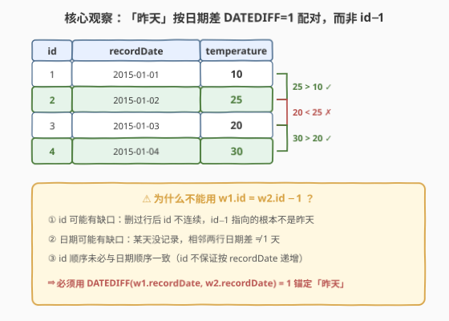
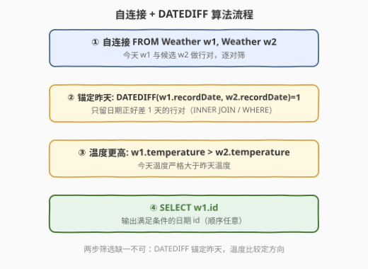
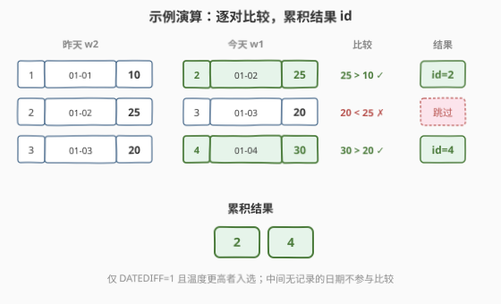

# LeetCode 上升的温度 题解

## 1. 题目概述

- **标题 / 题号**：上升的温度（#197，easy）
- **链接**：https://leetcode.cn/problems/rising-temperature/
- **难度**：简单
- **标签**：SQL、自连接、日期函数、窗口函数

**题意**：给定一张 `Weather` 表，记录每日的温度：

```text
+---------------+---------+
| Column Name   | Type    |
+---------------+---------+
| id            | int     |
| recordDate    | date    |
| temperature   | int     |
+---------------+---------+
```

- `id` 是该表具有唯一值的列（主键）；
- **没有具有相同 `recordDate` 的不同行**（`recordDate` 也唯一）；
- 该表包含特定日期的温度信息。

**任务**：编写解决方案，找出与**之前（昨天的）日期**相比温度更高的所有日期的 `id`。返回结果无顺序要求。

**示例 1**：

```text
输入：
Weather 表：
+----+------------+-------------+
| id | recordDate | temperature |
+----+------------+-------------+
| 1  | 2015-01-01 | 10          |
| 2  | 2015-01-02 | 25          |
| 3  | 2015-01-03 | 20          |
| 4  | 2015-01-04 | 30          |
+----+------------+-------------+

输出：
+----+
| id |
+----+
| 2  |
| 4  |
+----+

解释：
2015-01-02 的温度比前一天高（10 -> 25）
2015-01-04 的温度比前一天高（20 -> 30）
```

> ⚠️ 注意「昨天」的语义：是**日历意义上的前一日**（`recordDate` 差 1 天），而**不是**「表中上一行」或「`id − 1`」。这一字之差是本题最经典的陷阱——示例里 `id` 恰好连续、日期恰好无缺，让人误以为「上一行」就是「昨天」，一旦数据有缺口立即翻车。

## 2. 解题思路

### 2.1 朴素思路：用 `id − 1` 找「上一行」（陷阱）

最直觉的错误写法：把表自连接，用 `w2.id = w1.id − 1` 配对「今天 w1」与「昨天 w2」：

```sql
-- ❌ 错误示范：在示例上能过，但语义错了
SELECT w1.id
FROM Weather w1
JOIN Weather w2 ON w2.id = w1.id - 1
WHERE w1.temperature > w2.temperature;
```

在示例上它恰好返回 `{2, 4}`——因为示例的 `id` 连续（1,2,3,4）且日期也连续。但题目要求的是「**昨天**」，即 `recordDate` 差 1 天，而非 `id` 差 1。一旦遇到下面任一情况，`id − 1` 就会出错：

1. **`id` 有缺口**：删过行后 `id` 不连续（如 1,2,4,5），`id=4` 的「`id−1=3`」根本不存在，但它的昨天（`recordDate` 前一天）可能仍在表里；
2. **日期有缺口**：某天没记录（如 01-01、01-03，中间 01-02 缺），相邻两行日期差是 2 天而非 1 天，`id − 1` 配出的根本不是「昨天」而是「上一个有记录的日子」；
3. **`id` 顺序与日期顺序不一致**：题目不保证 `id` 按 `recordDate` 递增，`id − 1` 可能配到日期更晚的行。

> 💡 **根因**：`id` 是业务无关的物理主键，与「日期的前后」没有任何语义联系。要表达「昨天」，只能用**日期函数**对 `recordDate` 做运算，而非对 `id` 做算术。

### 2.2 核心观察：自连接 + `DATEDIFF` 锚定「昨天」



**关键洞察**：把表与自身做连接，配对的判据不是 `id` 相邻，而是 **`recordDate` 相差正好 1 天**。MySQL 提供的 `DATEDIFF(date1, date2)` 返回 `date1 − date2` 的天数，故「今天 w1 的日期比昨天 w2 的日期晚 1 天」即：

```text
DATEDIFF(w1.recordDate, w2.recordDate) = 1
```

再叠加温度条件 `w1.temperature > w2.temperature`，就能筛出「比昨天热」的今天。由于 `recordDate` 唯一，每个「今天」至多匹配一个「昨天」——若某天的前一天不在表里（日期缺口），该行自然无配对、不进结果，恰符合「无法与昨天比较」的语义。

> 💡 **等价写法**：用 `DATE_SUB(w1.recordDate, INTERVAL 1 DAY) = w2.recordDate` 表达「w2 的日期 = w1 的日期往前一天」，语义同样清晰，且在部分方言里可移植性更好（见第 5 节）。`DATEDIFF` 与 `DATE_SUB` 二选一即可，本质都是「把昨天这个概念锚定到日期列上」。

### 2.3 算法流程图



**完整步骤**：

1. **自连接** `FROM Weather w1, Weather w2`（或 `JOIN ... ON`）：让每一行 w1（今天候选）与每一行 w2（昨天候选）配成行对；
2. **锚定昨天**：`DATEDIFF(w1.recordDate, w2.recordDate) = 1`——只留日期正好差 1 天的行对，把「昨天」这个语义条件钉死在日期列上；
3. **温度更高**：`w1.temperature > w2.temperature`——今天温度严格大于昨天；
4. **输出**：`SELECT w1.id`——返回满足条件的今天 `id`，顺序任意。

> ⚠️ 两步筛选**缺一不可**：只写 `DATEDIFF=1` 会返回所有「有昨天记录」的行（不论冷热）；只写 `temperature >` 而不锚定日期，会跨任意两天乱比一气。`DATEDIFF` 负责「对的人」（昨天），`temperature >` 负责「对的方向」（更热），合起来才是「比昨天热」。

### 2.4 示例演算

用示例的 4 行数据演示「逐对比较、累积结果」的过程：



| 行对 | 昨天 w2 (id, 日期, 温度) | 今天 w1 (id, 日期, 温度) | DATEDIFF | 温度比较 | 入选？ |
|------|--------------------------|--------------------------|----------|----------|--------|
| A | (1, 01-01, 10) | (2, 01-02, 25) | 1 | 25 > 10 ✓ | 是 → id=2 |
| B | (2, 01-02, 25) | (3, 01-03, 20) | 1 | 20 < 25 ✗ | 否 |
| C | (3, 01-03, 20) | (4, 01-04, 30) | 1 | 30 > 20 ✓ | 是 → id=4 |

- **行对 A**：今天 `01-02` 的昨天是 `01-01`（`DATEDIFF=1`），25 > 10，入选，输出 `id=2`；
- **行对 B**：今天 `01-03` 的昨天是 `01-02`，但 20 < 25（今天更冷），不入选；
- **行对 C**：今天 `01-04` 的昨天是 `01-03`，30 > 20，入选，输出 `id=4`；
- **累积结果**：`{2, 4}`，与期望输出一致。

> 💡 注意第一行 `01-01` 没有昨天候选（前一天不在表里），自连接时它作为「今天 w1」找不到 `DATEDIFF=1` 的 w2，自然被排除——这正是「无法与昨天比较就不入选」的正确语义，无需特判。

## 3. 参考代码

> 本题为 SQL 题，LeetCode 支持 MySQL / MS SQL / Pandas 三种语言。这里给出 MySQL 主解与 Pandas（Python）解。

### MySQL（自连接 + DATEDIFF）

```sql
SELECT w1.id AS id
FROM Weather w1
JOIN Weather w2
  ON DATEDIFF(w1.recordDate, w2.recordDate) = 1
 AND w1.temperature > w2.temperature;
```

等价的 `WHERE` 写法（逗号连接 + WHERE 筛选，语义与 `JOIN ... ON` 完全相同）：

```sql
SELECT w1.id AS id
FROM Weather w1, Weather w2
WHERE DATEDIFF(w1.recordDate, w2.recordDate) = 1
  AND w1.temperature > w2.temperature;
```

以及用 `DATE_SUB` 锚定昨天的写法（语义更直白：「w2 的日期 = w1 的日期减一天」）：

```sql
SELECT w1.id AS id
FROM Weather w1
JOIN Weather w2
  ON w2.recordDate = DATE_SUB(w1.recordDate, INTERVAL 1 DAY)
 AND w1.temperature > w2.temperature;
```

> 💡 三种写法等价，任选其一。`DATEDIFF` 简洁；`DATE_SUB` 把「昨天」写成一个具体日期去等值匹配，可读性更好且不依赖 `DATEDIFF` 这一 MySQL 专属函数（跨方言更友好，见第 5 节）。

### Pandas（Python）

```python
import pandas as pd

def rising_temperature(weather: pd.DataFrame) -> pd.DataFrame:
    # 按 recordDate 排序，确保 shift(1) 取到的是「日期意义上的上一行」
    weather = weather.sort_values("recordDate").reset_index(drop=True)
    # 取上一行的温度与日期作为「昨天」候选
    weather["prev_temp"] = weather["temperature"].shift(1)
    weather["prev_date"] = weather["recordDate"].shift(1)
    # 两道筛：日期差正好 1 天 且 今天温度 > 昨天
    mask = (weather["recordDate"] - weather["prev_date"]).dt.days == 1
    mask &= weather["temperature"] > weather["prev_temp"]
    return weather.loc[mask, ["id"]]
```

> ⚠️ **Pandas 版同样必须判日期差**：`shift(1)` 取的是「排序后的上一行」，若日期有缺口（如 01-01、01-03），它的「上一行」是 01-03 对应 01-01，差 2 天，并非「昨天」。所以 `mask` 里 `(recordDate - prev_date).dt.days == 1` 这一步**不可省略**——这与 SQL 版的 `DATEDIFF=1` 是同一个语义钉子，只是换了个表达。少了它就退化成「比上一行热」的错误版本。

## 4. 复杂度分析

设表中共 $n$ 行。

| 维度 | 复杂度 | 说明 |
|------|--------|------|
| 时间（自连接，朴素） | $O(n^2)$ | 逗号连接产生 $n \times n$ 个行对，逐对算 `DATEDIFF` 与比较；LeetCode 数据量小（数十行）可过 |
| 时间（自连接，带索引/哈希连接） | $O(n)$ | 若 `recordDate` 有索引或引擎用哈希连接做等值 `DATE_SUB` 匹配，每个今天至多配一个昨天，扫 $O(n)$ |
| 时间（LAG 窗口函数，见第 5 节） | $O(n \log n)$ | `ORDER BY recordDate` 排序主导，扫描 $O(n)$；若 `recordDate` 已有序则 $O(n)$ |
| 空间 | $O(n)$ | 自连接中间结果至多 $n$ 个有效行对（输出）；LAG 需排序缓冲 $O(n)$ |
| 输出大小 | $O(k)$ | $k$ 为「比昨天热」的日期数，$k \le n-1$（第一天无昨天） |

> 💡 LeetCode 的 SQL 用例规模很小（通常 $\le 20$ 行），三种植法的差异不可感知。但在生产环境的大表上，**务必给 `recordDate` 建索引**并优先用等值匹配（`w2.recordDate = DATE_SUB(w1.recordDate, INTERVAL 1 DAY)`），让优化器走索引嵌套循环或哈希连接，避免 $O(n^2)$ 笛卡尔积。

## 5. 扩展：LAG 窗口函数版本与跨方言可移植性

### 5.1 LAG 窗口函数解法

现代 SQL（MySQL 8+、PostgreSQL、SQL Server 等）支持窗口函数，可用 `LAG` 「偷看」按日期排序后的上一行，避免显式自连接：

```sql
SELECT id
FROM (
    SELECT id,
           temperature,
           recordDate,
           LAG(temperature) OVER (ORDER BY recordDate) AS prev_temp,
           LAG(recordDate)  OVER (ORDER BY recordDate) AS prev_date
    FROM Weather
) t
WHERE DATEDIFF(recordDate, prev_date) = 1
  AND temperature > prev_temp;
```

> ⚠️ **LAG 版本也必须判 `DATEDIFF = 1`！** 这是 LAG 解法最隐蔽的坑：`LAG(...) OVER (ORDER BY recordDate)` 取的是「按日期排序的上一行」，而非「日历意义上的昨天」。若日期有缺口（如 01-01、01-03），01-03 的上一行是 01-01，差 2 天——此时 01-03 的「昨天」(01-02) 根本不在表里，不应参与比较。若省掉 `DATEDIFF = 1`，就会拿 01-01 的温度去比，得出错误结果。这与 Pandas 版的 `(recordDate - prev_date).dt.days == 1` 是同一颗语义钉子。

### 5.2 自连接 vs LAG 对比

| 维度 | 自连接 + DATEDIFF | LAG 窗口函数 |
|------|-------------------|--------------|
| 思路 | 行对配对，显式表达「今天 × 昨天」 | 排序后偷看上一行，隐式配对 |
| 日期缺口处理 | 天然正确（无昨天配对即排除） | **必须显式判 `DATEDIFF=1`**（否则错配） |
| 可读性 | 直观，语义自解释 | 稍绕，需理解窗口函数 |
| 性能 | 朴素 $O(n^2)$，带索引 $O(n)$ | $O(n \log n)$（排序主导） |
| 兼容性 | 老版本 MySQL 也支持 | 需 MySQL 8+ / 现代方言 |
| 推荐度 | ⭐ 面试首选（语义清晰） | ⭐ 进阶展示（体现窗口函数功底） |

### 5.3 跨方言可移植性

`DATEDIFF` 是 **MySQL 专属**函数，且参数顺序是 `(date1, date2)` 返回 `date1 − date2`；其他方言里同名函数语义可能不同（SQL Server 的 `DATEDIFF(part, d1, d2)` 需指定时间单位且参数顺序不同）。要在多方言间可移植，优先用**日期算术 + 等值匹配**：

| 方言 | 「昨天」写法 |
|------|-------------|
| MySQL | `w2.recordDate = DATE_SUB(w1.recordDate, INTERVAL 1 DAY)` 或 `w1.recordDate - INTERVAL 1 DAY = w2.recordDate` |
| PostgreSQL | `w2.recordDate = w1.recordDate - INTERVAL '1 day'` |
| SQL Server | `w2.recordDate = DATEADD(DAY, -1, w1.recordDate)` |
| SQLite | `w2.recordDate = DATE(w1.recordDate, '-1 day')` |

> 💡 **通用模式**：「把今天的日期减一天，得到一个具体的昨天日期，再与另一行的日期等值匹配」。这种写法跨方言只换日期函数名，逻辑骨架不变，比依赖 `DATEDIFF` 的「算差值」更稳健。面试若被追问「换到 PostgreSQL/SQL Server 怎么写」，答出这个模式即可。

## 6. 面试要点

1. **为什么用 `DATEDIFF` 而不是 `id − 1`？**

   > 因为题目要的是「**昨天**」（日历意义上的前一日），不是「`id` 相邻的行」。`id` 是业务无关的物理主键，与日期前后无语义联系：`id` 可能有缺口、日期可能有缺口、`id` 顺序未必与日期顺序一致。只有用日期函数（`DATEDIFF=1` 或 `DATE_SUB`）对 `recordDate` 运算，才能把「昨天」这个概念正确锚定到数据上。

2. **`DATEDIFF(w1.recordDate, w2.recordDate) = 1` 里 w1、w2 谁是今天谁是昨天？**

   > MySQL 的 `DATEDIFF(date1, date2)` 返回 `date1 − date2`（单位：天）。结果为 1 表示 `date1` 比 `date2` 晚 1 天，故 `w1` 是今天、`w2` 是昨天。若写反成 `DATEDIFF(w2.recordDate, w1.recordDate) = 1`，就变成「w2 比 w1 晚一天」，温度方向也要相应调换。记不住参数顺序时，用 `w2.recordDate = DATE_SUB(w1.recordDate, INTERVAL 1 DAY)` 更不易错——「w2 = w1 减一天」直白如自然语言。

3. **日期有缺口时（如某天没记录），自连接解法会发生什么？**

   > 天然正确。自连接靠 `DATEDIFF=1` 配对：若今天 `01-03` 的昨天 `01-02` 不在表里，w1=`01-03` 找不到任何满足 `DATEDIFF=1` 的 w2，该行无配对、被 `JOIN` 排除，不进结果——恰好符合「无法与昨天比较就不入选」的语义，无需特判。这也是自连接解法相对 LAG 解法的优势：LAG 取的是「排序后上一行」，缺口时会错配到更早的日期，必须额外判 `DATEDIFF=1` 兜底。

4. **LAG 窗口函数解法里，为什么不能只比较 `temperature > prev_temp`？**

   > `LAG(...) OVER (ORDER BY recordDate)` 取的是按日期排序后的「上一行」，而非「昨天」。日期有缺口时（如 01-01、01-03），`01-03` 的上一行是 `01-01`，差 2 天——它的「昨天」(01-02) 不在表里，本不该参与比较，但 `LAG` 照样把 `01-01` 的温度塞给 `prev_temp`。若只写 `temperature > prev_temp`，就会拿 `01-01` 的温度去比，错把「比前一个有记录的日子热」当成「比昨天热」。所以必须加 `DATEDIFF(recordDate, prev_date) = 1` 把非昨天的上一行剔除。

5. **如何在生产环境的大表上优化这个查询？**

   > 三点：① 给 `recordDate` 建索引，让 `w2.recordDate = DATE_SUB(w1.recordDate, INTERVAL 1 DAY)` 这类等值匹配走索引查找而非全表扫描；② 优先用等值匹配（`DATE_SUB`）而非函数差值（`DATEDIFF`），等值条件更易被优化器识别为索引/哈希连接；③ 若数据量极大且只关心近期，可先用 `WHERE` 限定 w1 的日期范围再连接，缩小驱动表规模。核心是避免 $O(n^2)$ 笛卡尔积，让连接退化为 $O(n)$ 的索引嵌套循环或哈希连接。

> 💡 **一句话总结**：本题的灵魂是「**用日期函数把『昨天』锚定到 `recordDate` 上，而非用 `id` 算术配相邻行**」——自连接 + `DATEDIFF(w1.recordDate, w2.recordDate) = 1` + `temperature >` 三件套即可。无论 SQL 自连接还是 LAG 窗口函数、还是 Pandas 的 `shift`，「日期差正好 1 天」这颗语义钉子都不可省——它是「昨天」与「上一行」的分界线。

## 同类练习题

| # | 题目 | 与本题的关联 |
|---|------|-------------|
| 180 | [连续出现的数字](https://leetcode.cn/problems/consecutive-numbers/) | 三表自连接找连续三行相同的 `Num`，与本题「自连接 + 行间比较」同套路，只是「连续」的判据从「日期差 1 天」换成「id 差 1 且值相等」 |
| 196 | [删除重复的电子邮箱](https://leetcode.cn/problems/delete-duplicate-emails/) | 自连接 + 比较，SQL 自连接基础题；本题掌握后做 196 巩固「自连接配对 + 条件筛选/删除」范式 |
| 550 | [游戏玩法分析 IV](https://leetcode.cn/problems/game-play-analysis-iv/) | 日期差 + 连续登录判定，`DATE_SUB` / `DATEDIFF` 的进阶应用——统计首次登录后第二天还登录的玩家比例，是本题「日期差 1 天」的延伸 |
| 184 | [部门工资最高的员工](https://leetcode.cn/problems/department-highest-salary/) | `JOIN` + 分组最值，SQL `JOIN` 基础题，对照本题巩固「自/内连接 + WHERE 筛选」的连接思维 |
| 1174 | [即时食物配送 II](https://leetcode.cn/problems/immediate-food-delivery-ii/) | `JOIN` + 子查询求「首单即即时」的占比，SQL 综合题，承接本题的连接与日期比较能力 |
