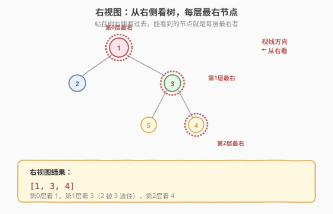
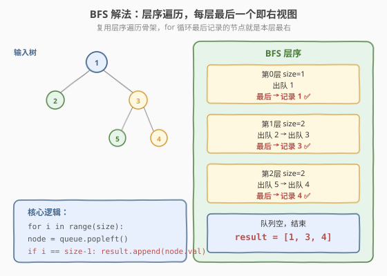
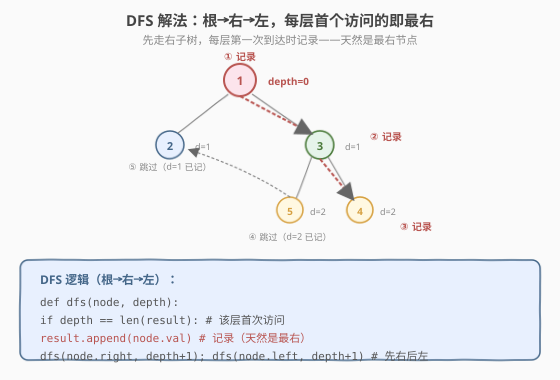

# 二叉树的右视图

- **题目名称**：二叉树的右视图
- **链接**：[199. 二叉树的右视图](https://leetcode.cn/problems/binary-tree-right-side-view/)
- **难度**：中等
- **标签**：树、BFS、DFS

## 1. 题目概述

给定一棵二叉树的根节点 `root`，想象自己站在树的**右侧**，按**从顶到底**的顺序，返回能看到的节点值组成的列表。

> 站在右侧看，每层只能看到该层**最右**的节点——左边的节点被右边的挡住了。

**示例 1**：

```text
输入：root = [1,2,3,null,5,null,4]
        1       ← 看到第0层：1
       / \
      2   3     ← 看到第1层：3（2 被 3 挡住）
       \   \
        5   4   ← 看到第2层：4（5 被 4 挡住）
输出：[1,3,4]
```

**示例 2**：

```text
输入：root = [1,null,3]
    1
     \
      3
输出：[1,3]
```

**示例 3**：

```text
输入：root = []
输出：[]
```

**约束条件**：

- 树中节点数目范围 `[0, 100]`
- `-100 <= Node.val <= 100`

> 💡 这是 [102. 层序遍历](../../week2/day5/二叉树的层序遍历.md) 的直接应用——每层只取最右节点。它同时可用 BFS（层序取最后）和 DFS（根右左首达即记录）两种解法，是「同一问题两种遍历视角」的典型题。掌握它，你就理解了「层序遍历的变种」与「DFS 按层记录」的等价性。

---

## 2. 解题思路

### 2.1 基础思路：层序遍历取每层末尾

「右视图」= 每层最右节点。最直观的做法：BFS 层序遍历，每层处理完后记录**最后一个**节点。

### 2.2 核心观察：BFS 取末尾 / DFS 根右左首达



两种解法都能得到右视图：

**解法 A（BFS）**：层序遍历，每层 for 循环中**最后一个**出队的节点就是该层最右。



**解法 B（DFS）**：按「**根 → 右 → 左**」顺序递归，每层**第一次访问**的节点一定是该层最右——因为先走右子树，最先到达某一层的必然是最右侧的节点。



> 💡 DFS 解法的巧妙之处：按「根右左」遍历，访问某一层的第一个节点一定是最右节点（右子树在左子树之前被访问）。用 `depth == len(result)` 判断「是否首次到达该层」——首次则记录，后续同层节点跳过。这和前序遍历的「根左右」只差左右顺序。

### 2.3 算法流程图

**BFS 完整步骤**：

1. **特判**：`root == null` 返回空列表
2. **初始化**：队列 `queue = [root]`，结果 `result = []`
3. **while 队列非空**：
   - `size = len(queue)`
   - `for i in range(size)`：
     - `node = queue.popleft()`
     - `if i == size - 1: result.append(node.val)`（**本层最后一个**）
     - 子节点入队：左、右
4. 返回 `result`

**DFS 完整步骤**：

1. **特判**：`root == null` 返回空列表
2. **递归** `dfs(node, depth)`：
   - `if depth == len(result): result.append(node.val)`（**首次到达该层**）
   - `dfs(node.right, depth + 1)`（先右）
   - `dfs(node.left, depth + 1)`（后左）
3. 返回 `result`

> ⚠️ DFS 必须先递归**右**子树再递归**左**子树——这样每一层最先访问的是最右节点。若先左后右，记录的就是「左视图」了。

### 2.4 示例演算

以示例 1 `root = [1,2,3,null,5,null,4]` 为例：

**BFS 方式**：

| 层 | 队列 | size | 出队顺序 | 最后一个 | result |
|----|------|------|---------|---------|--------|
| 0 | [1] | 1 | 1 | 1 | [1] |
| 1 | [2, 3] | 2 | 2 → 3 | 3 | [1, 3] |
| 2 | [5, 4] | 2 | 5 → 4 | 4 | [1, 3, 4] |

**DFS 方式**（根右左）：

| 步骤 | 访问节点 | depth | len(result) | 是否记录 | result |
|------|---------|-------|-------------|---------|--------|
| ① | 1 | 0 | 0 | 是（首次到 d=0） | [1] |
| ② | 3 | 1 | 1 | 是（首次到 d=1） | [1, 3] |
| ③ | 4 | 2 | 2 | 是（首次到 d=2） | [1, 3, 4] |
| ④ | 5 | 2 | 3 | 否（d=2 已记） | [1, 3, 4] |
| ⑤ | 2 | 1 | 3 | 否（d=1 已记） | [1, 3, 4] |

最终 `result = [1, 3, 4]`，两种解法结果一致。

> 💡 DFS 步骤 ④⑤：节点 5（d=2）和节点 2（d=1）访问时，`depth != len(result)`，说明该层已有节点记录（是最右的那个），跳过。这就是「先右后左」保证首达即最右的原理。

---

## 3. 参考代码

### C++

```cpp
// 二叉树的右视图.cpp —— BFS + DFS
#include <vector>
#include <queue>
using namespace std;

struct TreeNode {
    int val;
    TreeNode* left;
    TreeNode* right;
    TreeNode() : val(0), left(nullptr), right(nullptr) {
    }
    TreeNode(int x) : val(x), left(nullptr), right(nullptr) {
    }
    TreeNode(int x, TreeNode* l, TreeNode* r) : val(x), left(l), right(r) {
    }
};

// BFS：层序取每层最后一个
class Solution {
  public:
    vector<int> rightSideView(TreeNode* root) {
        vector<int> result;
        if (!root) return result;
        queue<TreeNode*> q;
        q.push(root);
        while (!q.empty()) {
            int size = q.size();
            for (int i = 0; i < size; ++i) {
                TreeNode* node = q.front(); q.pop();
                if (i == size - 1) result.push_back(node->val); // 本层最后
                if (node->left)  q.push(node->left);
                if (node->right) q.push(node->right);
            }
        }
        return result;
    }
};

// DFS：根右左，每层首次到达即记录
class SolutionDFS {
  public:
    vector<int> rightSideView(TreeNode* root) {
        vector<int> result;
        dfs(root, 0, result);
        return result;
    }
  private:
    void dfs(TreeNode* node, int depth, vector<int>& result) {
        if (!node) return;
        if (depth == (int)result.size()) result.push_back(node->val); // 首次到该层
        dfs(node->right, depth + 1, result);  // 先右
        dfs(node->left, depth + 1, result);   // 后左
    }
};
```

### Python

```python
# BFS
from collections import deque

class Solution:
    def rightSideView(self, root: TreeNode | None) -> list[int]:
        result = []
        if not root:
            return result
        q = deque([root])
        while q:
            size = len(q)
            for i in range(size):
                node = q.popleft()
                if i == size - 1:              # 本层最后
                    result.append(node.val)
                if node.left:
                    q.append(node.left)
                if node.right:
                    q.append(node.right)
        return result

# DFS
class SolutionDFS:
    def rightSideView(self, root: TreeNode | None) -> list[int]:
        result = []
        def dfs(node: TreeNode | None, depth: int):
            if not node:
                return
            if depth == len(result):           # 首次到该层
                result.append(node.val)
            dfs(node.right, depth + 1)          # 先右
            dfs(node.left, depth + 1)           # 后左
        dfs(root, 0)
        return result
```

> 💡 DFS 的 `depth == len(result)` 是个精妙判断：`len(result)` 表示「已记录到第几层」，`depth` 是当前节点所在层。两者相等说明当前层还没记录过——这是首次到达该层，记录。后续同层节点 `depth < len(result)`，跳过。

---

## 4. 复杂度分析

| 维度 | 复杂度 | 说明 |
|------|--------|------|
| **时间复杂度** | `O(n)` | BFS/DFS 每个节点访问一次 |
| **空间复杂度** | `O(h)` / `O(n)` | DFS 栈 = 树高；BFS 队列 = 最宽层 |

> ⚠️ 两种解法时间都是 `O(n)`，空间略有差异：DFS 是递归栈 `O(h)`（平衡树 `O(log n)`），BFS 是队列 `O(n)`（最宽层）。平衡树时 DFS 更省空间；但 DFS 递归深度受栈限制，极深树可能溢出。本题 `n ≤ 100`，两者都无压力。

---

## 5. 扩展：左视图与变体

把右视图的思路稍改，可得一系列变体：

| 变体 | BFS 改动 | DFS 改动 |
|------|---------|---------|
| 左视图 | 每层取**第一个**（`i == 0`） | 改为「根→**左**→右」 |
| 底视图 | 每层取最底层节点 | 需额外记录深度 |
| 顶视图 | 每列取最顶层节点 | 需记录水平偏移 |

> 💡 BFS 解左视图最简单——把 `if i == size - 1` 改成 `if i == 0` 即可。DFS 解左视图则把递归顺序从「先右后左」改成「先左后右」。理解了「首达即最右/最左」的原理，这些变体都是一行代码的改动。

---

## 6. 面试要点

1. **BFS 和 DFS 哪个更好？**

   - 时间都是 `O(n)`。BFS 直观（每层最后一个），代码易理解；DFS 精巧（首达即最右），空间更优（`O(h)` vs `O(n)`）。
   - 面试推荐 BFS——语义清晰、不易写错。若面试官追问「能否 O(h) 空间」，再写 DFS。

2. **DFS 为什么「先右后左」就能得到右视图？**

   - 按根右左遍历，访问某一层时，**右子树的节点先于左子树**到达。所以每一层**第一个被访问**的节点一定是最右节点。
   - 用 `depth == len(result)` 判断首次到达：首次则记录（是最右），后续同层跳过。若先左后右，首达的就是最左节点，变成「左视图」。

3. **`depth == len(result)` 这个判断怎么理解？**

   - `len(result)` 是「已记录的层数」。初始为 0，记录第 0 层后变 1，记录第 1 层后变 2……
   - 当 `depth == len(result)` 时，说明第 `depth` 层还没记录过——当前节点是该层首个被访问的（也是最右的），记录。
   - 记录后 `len(result)` 增加，后续同层节点 `depth < len(result)`，跳过。

4. **如果某层最右节点是 null（被遮挡），怎么处理？**

   - 不会出现这种情况。LeetCode 序列化中的 `null` 表示「该位置无节点」，BFS 入队时只入队非空子节点，DFS 递归时 `if (!node) return` 跳过空节点。
   - 右视图的「最右」指的是该层**实际存在的最右节点**，不是序列化数组里最右的非 null 值。

5. **能否用「根左右」前序 + 反转得到右视图？**

   - 不能直接得到。前序「根左右」首达的是最左节点（左视图）。要右视图需「根右左」。
   - 但可以用前序「根左右」得到左视图，再思路对称地写「根右左」得右视图。关键是「先访问哪侧，首达就是那侧的最外节点」。

> 💡 **一句话总结**：二叉树的右视图有两种等价解法——BFS 取每层最后一个节点（直观），DFS 按「根右左」递归、每层首次到达即记录（精巧）。两者本质都在找「每层最右」，只是 BFS 靠层序天然按层、DFS 靠「先右后左」保证首达即最右。理解了「首达即最外」的原理，左视图、底视图都是一行代码的改动。

---

## 7. 同类练习题

- [102. 二叉树的层序遍历](https://leetcode.cn/problems/binary-tree-level-order-traversal/)：BFS 骨架，本题基础（[题解](../../week2/day5/二叉树的层序遍历.md)）
- [199. 二叉树的右视图](https://leetcode.cn/problems/binary-tree-right-side-view/)（[题解](二叉树的右视图.md)）：本题，层序取末尾
- [513. 找树左下角的值](https://leetcode.cn/problems/find-bottom-left-tree-value/)：BFS 最底层第一个
- [116. 填充每个节点的下一个右侧节点指针](https://leetcode.cn/problems/populating-next-right-pointers-in-each-node/)（[题解](../../week13/day5/填充每个节点的下一个右侧节点指针.md)）：层序思想，同层串联
- [103. 二叉树的锯齿形层序遍历](https://leetcode.cn/problems/binary-tree-zigzag-level-order-traversal/)：层序变种，奇偶层方向交替
