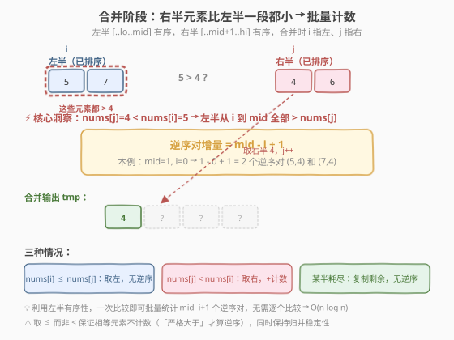
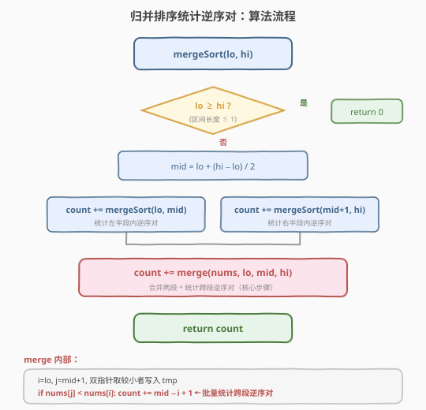

# LeetCode 数组中的逆序对 题解

## 1. 题目概述

- **标题 / 题号**：数组中的逆序对（#剑指 Offer 51，hard）
- **链接**：https://leetcode.cn/problems/shu-zu-zhong-de-ni-xu-dui-lcof/
- **难度**：困难
- **标签**：数组、分治、归并排序

**题意**：在数组中的两个数字，如果前面一个数字大于后面的数字，则这两个数字组成一个**逆序对**。给定一个数组 `nums`，返回数组中逆序对的总数。

**示例 1**：

```text
输入：nums = [7,5,6,4]
输出：5
解释：逆序对为 (7,5)、(7,6)、(7,4)、(5,4)、(6,4)，共 5 个
```

**示例 2**：

```text
输入：nums = [1,3,2,3,1]
输出：4
解释：逆序对为 (3,2)、(3,1)、(2,1)、(3,1)，共 4 个
```

**约束**：

- `0 <= nums.length <= 50000`
- 数组中没有重复元素（题目原始版本保证；若有重复，取「严格大于」仍成立）

> 💡 这是**归并排序的经典应用**——在排序过程中「顺带」统计逆序对，把暴力的 $O(n^2)$ 优化到 $O(n \log n)$。面试中常作为「归并排序能干什么 beyond 排序」的代表题，也是剑指 Offer 中出镜率最高的困难题之一。

## 2. 解题思路

### 2.1 暴力思路：双重循环枚举所有数对

最直观的做法：枚举所有 $i < j$ 的数对，若 `nums[i] > nums[j]` 则计数加一。

```text
count = 0
for i in range(n):
    for j in range(i+1, n):
        if nums[i] > nums[j]:
            count += 1
```

> ⚠️ **致命缺陷**：$n \le 5 \times 10^4$ 时，数对总数达 $\binom{n}{2} \approx 1.25 \times 10^9$，双重循环必然超时。必须找到能「批量」统计逆序对的方法。

### 2.2 核心观察：归并排序中「跨段逆序」的批量计数



关键洞察来自归并排序的**合并阶段**。归并排序把数组对半切成左右两段，递归排序后再合并。合并时，**左右两段各自已经有序**——这意味着：

- **段内逆序对**已在递归排序左右两段时被统计完毕（分治的「分」阶段）。
- **跨段逆序对**（左段某元素 $>$ 右段某元素）恰好在**合并阶段**被天然暴露。

> 💡 **为什么合并阶段能批量计数？** 合并时用双指针 `i`（指向左半）和 `j`（指向右半），每次取较小者写入辅助数组。当 `nums[j] < nums[i]` 时，说明 `nums[j]` 比**左半从 `i` 到 `mid` 的所有元素**都小（因为左半有序），因此 `nums[j]` 与这些元素分别构成逆序对，一次性计数 `mid - i + 1` 个。

这就是「批量统计」的精髓：**不必逐个比较，利用有序性一次跳过一整段**。

### 2.3 算法流程图



**完整步骤**：

1. **递归切分**：`mergeSort(lo, hi)`，若 `lo >= hi`（区间长度 $\le 1$）返回 0（无逆序对）。
2. **分治计数**：`mid = (lo + hi) / 2`，递归统计左半 `count += mergeSort(lo, mid)` 和右半 `count += mergeSort(mid+1, hi)`。
3. **合并并统计跨段逆序**：双指针 `i = lo, j = mid+1` 合并两段；当 `nums[j] < nums[i]` 时，`count += mid - i + 1`。
4. 返回 `count`。

> ⚠️ **稳定性与计数的关系**：合并时若 `nums[i] <= nums[j]` 取左半元素，此时**不产生逆序对**；若 `nums[j] < nums[i]` 取右半元素，才产生 `mid - i + 1` 个逆序对。这个「小于等于取左、严格小于取右」的分支与归并排序的稳定性一致——相等元素不构成逆序对（「严格大于」才算逆序）。

### 2.4 示例演算

以 `nums = [7,5,6,4]` 为例，完整演示归并树与每层的逆序对计数。

![示例演算：[7,5,6,4] 的归并排序逆序对统计过程](../images/reverse_pairs_example_walkthrough.svg)

**递归树（自底向上）**：

| 层级 | 区间 | 排序前 | 排序后 | 跨段逆序对 | 说明 |
|------|------|--------|--------|------------|------|
| 2 | `[7]` vs `[5]` | `[7,5]` | `[5,7]` | 1 | `7 > 5`，取右半 5，计数 `mid-i+1 = 0-0+1 = 1` |
| 2 | `[6]` vs `[4]` | `[6,4]` | `[4,6]` | 1 | `6 > 4`，取右半 4，计数 `0-0+1 = 1` |
| 1 | `[5,7]` vs `[4,6]` | `[5,7,6,4]` | `[4,5,6,7]` | 3 | `5 > 4`（计数 2）、`7 > 4`（已计入）、`7 > 6`（计数 1） |

**第 1 层合并细节**（`[5,7]` 与 `[4,6]` 合并）：

| 步骤 | `i` 指向 | `j` 指向 | 比较 | 取谁 | 逆序对增量 | 合并结果 |
|------|---------|---------|------|------|-----------|----------|
| 1 | 5 | 4 | `5 > 4` | 取右 4 | `mid-i+1 = 1-0+1 = 2` | `[4, _, _, _]` |
| 2 | 5 | 6 | `5 ≤ 6` | 取左 5 | 0 | `[4, 5, _, _]` |
| 3 | 7 | 6 | `7 > 6` | 取右 6 | `mid-i+1 = 1-1+1 = 1` | `[4, 5, 6, _]` |
| 4 | 7 | — | 右半空 | 取左 7 | 0 | `[4, 5, 6, 7]` |

总逆序对 = $1 + 1 + 3 = 5$，与示例一致。

## 3. 参考代码

### C++

```cpp
class Solution {
    vector<int> tmp;
  public:
    int reversePairs(vector<int>& nums) {
        tmp.resize(nums.size());
        return mergeSort(nums, 0, (int)nums.size() - 1);
    }

  private:
    int mergeSort(vector<int>& nums, int lo, int hi) {
        if (lo >= hi) return 0;
        int mid = lo + (hi - lo) / 2;
        int count = 0;
        count += mergeSort(nums, lo, mid);
        count += mergeSort(nums, mid + 1, hi);
        count += merge(nums, lo, mid, hi);
        return count;
    }

    int merge(vector<int>& nums, int lo, int mid, int hi) {
        int i = lo, j = mid + 1, k = lo;
        int count = 0;
        while (i <= mid && j <= hi) {
            if (nums[i] <= nums[j]) {
                tmp[k++] = nums[i++];
            } else {
                tmp[k++] = nums[j++];
                count += mid - i + 1;
            }
        }
        while (i <= mid)  tmp[k++] = nums[i++];
        while (j <= hi)   tmp[k++] = nums[j++];
        for (int p = lo; p <= hi; p++) nums[p] = tmp[p];
        return count;
    }
};
```

### Python

```python
class Solution:
    def reversePairs(self, nums: List[int]) -> int:
        self._tmp = [0] * len(nums)
        return self._merge_sort(nums, 0, len(nums) - 1)

    def _merge_sort(self, nums: List[int], lo: int, hi: int) -> int:
        if lo >= hi:
            return 0
        mid = lo + (hi - lo) // 2
        count = 0
        count += self._merge_sort(nums, lo, mid)
        count += self._merge_sort(nums, mid + 1, hi)
        count += self._merge(nums, lo, mid, hi)
        return count

    def _merge(self, nums: List[int], lo: int, mid: int, hi: int) -> int:
        tmp = self._tmp
        i, j, k = lo, mid + 1, lo
        count = 0
        while i <= mid and j <= hi:
            if nums[i] <= nums[j]:
                tmp[k] = nums[i]
                i += 1
            else:
                tmp[k] = nums[j]
                j += 1
                count += mid - i + 1
            k += 1
        while i <= mid:
            tmp[k] = nums[i]
            i += 1
            k += 1
        while j <= hi:
            tmp[k] = nums[j]
            j += 1
            k += 1
        for p in range(lo, hi + 1):
            nums[p] = tmp[p]
        return count
```

> 💡 **Python 栈深**：$n = 5 \times 10^4$ 时递归深度约 $\log_2 n \approx 16$，远低于默认限制 1000，无需 `setrecursionlimit`。

## 4. 复杂度分析

| 维度 | 复杂度 | 说明 |
|------|--------|------|
| **时间复杂度** | $O(n \log n)$ | 归并排序的递归树共 $O(\log n)$ 层，每层合并合计扫描 $O(n)$ 个元素，逆序对计数在合并时 $O(1)$ 内批量累加 |
| **空间复杂度** | $O(n)$ | 辅助数组 `tmp` 大小为 $n$；递归栈深 $O(\log n)$，主导项为辅助数组 |

## 5. 扩展：树状数组解法

除归并排序外，**树状数组**（Binary Indexed Tree / Fenwick Tree）也能在 $O(n \log n)$ 统计逆序对，且支持**动态插入**场景。

**思路**：离散化数组值域到 $[1, n]$ 后，从右往左遍历，对每个元素 `nums[i]` 查询树状数组中**比它小的已插入元素个数**（即右侧比它小的元素个数），累加即为逆序对，然后将 `nums[i]` 插入树状数组。

```cpp
class BIT {
    vector<int> tree;
    int n;
  public:
    BIT(int n) : tree(n + 1), n(n) {}
    void update(int i, int delta) {
        for (; i <= n; i += i & (-i)) tree[i] += delta;
    }
    int query(int i) {
        int sum = 0;
        for (; i > 0; i -= i & (-i)) sum += tree[i];
        return sum;
    }
};

class Solution {
  public:
    int reversePairs(vector<int>& nums) {
        // 离散化
        vector<int> sorted(nums);
        sort(sorted.begin(), sorted.end());
        sorted.erase(unique(sorted.begin(), sorted.end()), sorted.end());
        int n = sorted.size();
        BIT bit(n);

        int count = 0;
        for (int i = (int)nums.size() - 1; i >= 0; --i) {
            int rank = lower_bound(sorted.begin(), sorted.end(), nums[i])
                       - sorted.begin() + 1;
            count += bit.query(rank - 1);
            bit.update(rank, 1);
        }
        return count;
    }
};
```

> 💡 **归并 vs 树状数组**：归并排序写法更直观、面试更容易默写；树状数组适用于**在线**场景（元素逐个插入、随时查询），且是「计算右侧小于当前元素的个数」（[315. 计算右侧小于当前元素的个数](https://leetcode.cn/problems/count-of-smaller-numbers-after-self/)）的标准解法。

## 6. 面试要点

1. **为什么归并排序能统计逆序对？核心在哪里？**

   - 核心在**合并阶段**。合并时左右两段已各自有序，当右半元素 `nums[j]` 小于左半元素 `nums[i]` 时，由于左半有序，`nums[i]` 到 `nums[mid]` 的**所有元素都大于 `nums[j]`**，一次性产生 `mid - i + 1` 个逆序对。这把逐个比较优化为批量计数。

2. **`nums[i] <= nums[j]` 为什么要取等号？**

   - 取等号意味着相等元素不构成逆序对（题目要求「严格大于」才算逆序）。同时这保证了归并排序的**稳定性**——相等元素保持原始相对顺序。若题目改为「大于等于」算逆序，则改取 `<` 即可。

3. **逆序对计数会不会重复或遗漏？**

   - 不会。逆序对分两类：**段内**（两元素同在左半或同在右半）和**跨段**（一个在左半、一个在右半）。段内逆序对在递归子问题时已统计；跨段逆序对在当前合并阶段统计。两者互不重叠且覆盖所有情况，由分治的正确性保证。

4. **归并排序和树状数组各自的适用场景？**

   - 归并排序：**离线**统计（已知整个数组），代码直观，面试首选。
   - 树状数组：**在线**统计（元素逐个到来、随时查询），或需要按值域统计（如「右侧小于当前元素的个数」），但需要离散化预处理，代码更复杂。

5. **如果数组非常大（内存放不下）怎么办？**

   - 归并排序天然适合**外部排序**（多路归并 + 磁盘临时文件），逆序对统计可在合并阶段照常进行。树状数组需要值域离散化，不适合外部场景。

## 同类练习题

| # | 题目 | 与本题的关联 |
|---|------|-------------|
| 912 | [排序数组](https://leetcode.cn/problems/sort-an-array/)（[题解](../0901-1000/912_排序数组.md)） | 归并排序的母题，掌握 merge 模板后逆序对只需加一行计数 |
| 315 | [计算右侧小于当前元素的个数](https://leetcode.cn/problems/count-of-smaller-numbers-after-self/) | 逆序对变体——返回每个位置右侧比它小的元素个数，树状数组 / 归并排序均可 |
| 327 | [区间和的个数](https://leetcode.cn/problems/count-of-range-sum/) | 归并排序 + 前缀和统计区间个数，分治计数的进阶应用 |
| 493 | [翻转对](https://leetcode.cn/problems/reverse-pairs/) | 逆序对的变体——统计 `nums[i] > 2 * nums[j]` 的对数，归并排序框架不变，合并时需额外双指针 |
