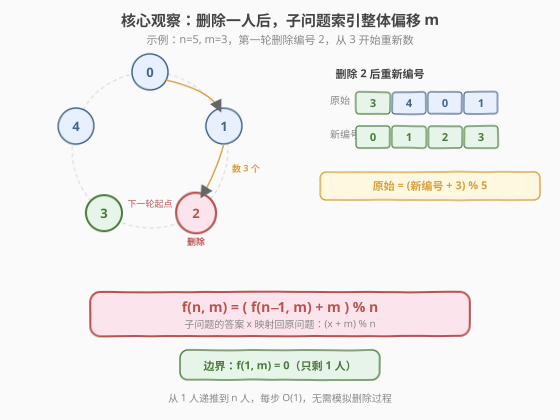
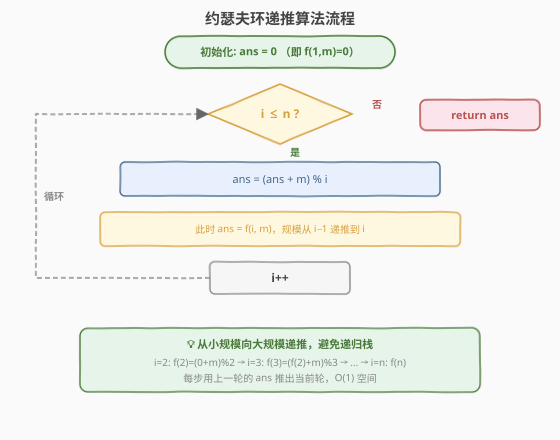
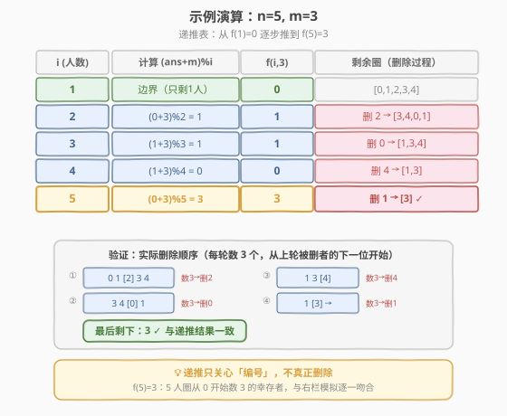

# LeetCode 圆圈中最后剩下的数字 题解

## 1. 题目概述

- **标题 / 题号**：圆圈中最后剩下的数字（#剑指 Offer 62，easy）
- **链接**：https://leetcode.cn/problems/yuan-quan-zhong-zui-hou-sheng-xia-de-shu-zi-lcof/
- **难度**：简单
- **标签**：数学、递推、动态规划

**题意**：`0,1,···,n-1` 这 `n` 个数字排成一个圆圈，从数字 `0` 开始，每次从这个圆圈里删除第 `m` 个数字（删除后从下一个数字开始继续数）。求这个圆圈里剩下的最后一个数字。

这就是经典的**约瑟夫环**（Josephus Problem）。

**示例 1**：

```text
输入：n = 5, m = 3
输出：3
解释：删除顺序为 2、0、4、1，最后剩下 3
```

**示例 2**：

```text
输入：n = 10, m = 17
输出：2
```

**约束**：

- `1 <= n <= 10^5`
- `1 <= m <= 10^6`

> 💡 这是**数学递推**的经典代表题。暴力模拟删除过程需要 $O(nm)$，而利用约瑟夫环的递推公式只需 $O(n)$ 时间、$O(1)$ 空间——「不真正删除，只用递推算编号」是本题的核心思想。

## 2. 解题思路

### 2.1 暴力思路：模拟删除过程

最直观的做法：用**循环链表**或**数组**模拟整个删除过程——每轮从当前位置数 `m` 步，删除对应元素，直到只剩一个。

```text
list = [0, 1, 2, ..., n-1]
idx = 0
while len(list) > 1:
    idx = (idx + m - 1) % len(list)
    list.remove(idx)   # 删除
return list[0]
```

> ⚠️ **致命缺陷**：每轮删除需 $O(n)$（数组删除需搬移元素），共 $n$ 轮，总计 $O(n^2)$；用链表虽删除 $O(1)$ 但数 `m` 步仍 $O(m)$，总计 $O(nm)$。当 $n = 10^5$、$m = 10^6$ 时必然超时。必须找到**不依赖模拟**的数学规律。

### 2.2 核心观察：删除一人后，子问题索引整体偏移 m



关键洞察来自**子问题与原问题的索引映射**。设 `f(n, m)` 为 `n` 个人、步长 `m` 时幸存者的**编号**。

第一轮删除的是编号 `(m - 1) % n`（从 0 开始数 `m` 个）。删除后，从编号 `m % n` 开始下一轮——剩下的 `n-1` 个人构成了一个**规模更小的约瑟夫环**。

> 💡 **为什么能递推？** 删除一人后，剩下的 `n-1` 个人围成的新圈，本质是一个**同型的子问题** `f(n-1, m)`。但新圈的「0 号」对应原圈的 `m % n` 号——两者的编号差了一个固定偏移 `m`。因此子问题的答案 `x` 映射回原问题就是 `(x + m) % n`。

由此得到**约瑟夫递推公式**：

$$f(n, m) = \big( f(n-1, m) + m \big) \bmod n$$

边界条件：$f(1, m) = 0$（只剩一人，编号必为 0）。

这就是「批量」思维的体现：**不必逐个模拟删除，利用子问题与原问题的偏移关系，一步从 `n-1` 推到 `n`**。

### 2.3 算法流程图



**完整步骤**：

1. **初始化**：`ans = 0`（对应 $f(1, m) = 0$）。
2. **递推**：令 `i` 从 `2` 到 `n`，每步执行 `ans = (ans + m) % i`——把规模 `i-1` 的答案推到规模 `i`。
3. **返回**：循环结束后 `ans` 即为 $f(n, m)$。

> ⚠️ **取模的对象是当前的 `i`**：每步 `(ans + m) % i` 中的模数是**当前规模 `i`**（而非 `n`），因为子问题的索引范围是 `[0, i-1]`。这是最易写错的地方。

### 2.4 示例演算

以 `n = 5, m = 3` 为例，展示递推表与实际删除过程的对照验证。



**递推表**：

| i（人数） | 计算 `(ans+m)%i` | f(i, 3) | 剩余圈（删除过程） |
|-----------|------------------|---------|--------------------|
| 1 | 边界（只剩 1 人） | 0 | `[0,1,2,3,4]` |
| 2 | `(0+3)%2 = 1` | 1 | 删 2 → `[3,4,0,1]` |
| 3 | `(1+3)%3 = 1` | 1 | 删 0 → `[1,3,4]` |
| 4 | `(1+3)%4 = 0` | 0 | 删 4 → `[1,3]` |
| 5 | `(0+3)%5 = 3` | **3** | 删 1 → `[3]` ✓ |

**实际删除顺序验证**（每轮从上轮被删者的下一位开始数 3 个）：

| 轮次 | 圈状态 | 数 3 个 | 删除 |
|------|--------|---------|------|
| ① | `0 1 2 3 4`（从 0 起） | 0→1→2 | 删 2 |
| ② | `3 4 0 1`（从 3 起） | 3→4→0 | 删 0 |
| ③ | `1 3 4`（从 1 起） | 1→3→4 | 删 4 |
| ④ | `1 3`（从 1 起） | 1→3→1 | 删 1 |

最后剩下 **3**，与递推结果 $f(5,3) = 3$ 完全一致。

> 💡 **对照的意义**：递推过程从不真正删除任何元素，只反复执行 `(ans+m)%i`；但它算出的编号与「真正模拟删除」的结果逐位吻合——这就是递推公式正确性的直观佐证。

## 3. 参考代码

### C++

```cpp
class Solution {
  public:
    int lastRemaining(int n, int m) {
        int ans = 0;                    // f(1, m) = 0
        for (int i = 2; i <= n; i++) {
            ans = (ans + m) % i;        // f(i, m) = (f(i-1, m) + m) % i
        }
        return ans;
    }
};
```

### Python

```python
class Solution:
    def lastRemaining(self, n: int, m: int) -> int:
        ans = 0                         # f(1, m) = 0
        for i in range(2, n + 1):
            ans = (ans + m) % i         # f(i, m) = (f(i-1, m) + m) % i
        return ans
```

> 💡 **迭代而非递归**：递推方向是**从小到大**（`i=2→n`），用循环变量 `ans` 滚动记录上一轮结果，无需递归、无需数组，空间 $O(1)$。若写成递归 `f(n,m)` 则栈深 $O(n)$，$n=10^5$ 时可能爆栈，迭代更安全。

## 4. 复杂度分析

| 维度 | 复杂度 | 说明 |
|------|--------|------|
| **时间复杂度** | $O(n)$ | 单层循环 `n-1` 次，每次一次加法 + 一次取模，均为 $O(1)$ |
| **空间复杂度** | $O(1)$ | 只用一个滚动变量 `ans`，无额外数组、无递归栈 |

> 💡 相比暴力模拟的 $O(nm)$ 或 $O(n^2)$，递推把复杂度从「与 `m` 有关」降到「只与 `n` 有关」，是理论最优。

## 5. 扩展：递推公式的严格推导

递推公式 $f(n, m) = (f(n-1, m) + m) \bmod n$ 的正确性可严格证明，核心是**索引映射的双射**。

**设定**：`n` 个人编号 `0 ~ n-1` 围成圈，从 `0` 开始数，每数 `m` 个删除一人。

**第一步：确定第一个被删者**。从 `0` 开始数 `m` 个（`0` 算第 1 个），被删者编号为：

$$t = (m - 1) \bmod n$$

**第二步：构造子问题**。删除 `t` 后，从 `t` 的下一位 `(t+1) % n` 开始新一轮。剩下的 `n-1` 个人构成新圈，记其幸存者在**新圈编号**下为 $f(n-1, m)$。

**第三步：建立映射**。新圈的「0 号」是原圈的 `(t+1) % n = m % n` 号。因此新圈编号 `x` 对应原圈编号 `(x + m) % n`。这是一个**加 `m` 取模 `n`** 的双射：

$$\text{原编号} = (\text{新编号} + m) \bmod n$$

**第四步：代入**。子问题幸存者新编号为 $f(n-1, m)$，映射回原编号即：

$$f(n, m) = \big( f(n-1, m) + m \big) \bmod n$$

**边界**：$n = 1$ 时只剩一人，$f(1, m) = 0$。

> 💡 **「加 `m` 取模 `n`」**是整个递推的灵魂——它描述了「删除一人后，幸存者编号在两个规模间的平移关系」。记住这个映射，公式自然浮现。

## 6. 面试要点

1. **递推公式是怎么来的？核心在哪一步？**

   - 核心在**索引映射**。第一轮删除编号 `(m-1)%n` 后，剩下的 `n-1` 人构成子问题。新圈的 0 号是原圈的 `m%n` 号，所以子问题答案 `x` 映射回原圈为 `(x + m) % n`，即 `f(n,m) = (f(n-1,m) + m) % n`。

2. **为什么取模的对象是 `i` 而不是 `n`？**

   - 递推是**逐规模**进行的：第 `i` 步把规模 `i-1` 的答案推到规模 `i`，此时索引范围是 `[0, i-1]`，必须对 `i` 取模才能落回合法范围。若对 `n` 取模，会得到错误的编号。

3. **为什么用迭代而非递归？**

   - 递推方向从小到大，用滚动变量即可，无需保留中间结果。递归 `f(n,m)` 调用 `f(n-1,m)` 栈深 $O(n)$，$n = 10^5$ 时有爆栈风险（Python 默认递归上限 1000），迭代 $O(1)$ 空间更安全。

4. **暴力和递推的复杂度差距来自哪里？**

   - 暴力每轮都要「数 `m` 步 + 删除」，与 `m`、`n` 都相关；递推利用了子问题与原问题的**固定偏移关系**，把「数 `m` 步找位置」压缩成「一次加法取模」，复杂度从 $O(nm)$ 降到 $O(n)$，与 `m` 无关。

5. **如果 `m = 1` 会怎样？**

   - `m = 1` 时每次删除当前位置的人，相当于从 `0` 开始依次删除 `0,1,2,...,n-2`，最后剩 `n-1`。代入公式：`f(n,1) = (f(n-1,1)+1) % n`，从 `f(1,1)=0` 递推，`f(n,1) = n-1`，与直觉一致。这是快速自检的边界用例。

## 同类练习题

| # | 题目 | 与本题的关联 |
|---|------|-------------|
| — | [剑指 Offer 51 / LCR 170. 数组中的逆序对](https://leetcode.cn/problems/shu-zu-zhong-de-ni-xu-dui-lcof/)（[题解](../0101-0200/LCOF51_数组中的逆序对.md)） | 同属剑指 Offer 经典题，用分治把暴力 $O(n^2)$ 优化到 $O(n \log n)$，思想同为「用数学结构避免逐个模拟」 |
| 390 | [消除游戏](https://leetcode.cn/problems/elimination-game/) | 交替从左右删除首元素的变体约瑟夫问题，同样用递推公式 $O(\log n)$ 求解 |
| 1823 | [找出游戏的获胜者](https://leetcode.cn/problems/find-the-winner-of-the-circular-game/) | 约瑟夫环的**完全同构题**（编号从 1 开始），套用本递推公式后加 1 即可 |
| 912 | [排序数组](https://leetcode.cn/problems/sort-an-array/)（[题解](../0901-1000/912_排序数组.md)） | 同为「用分治/递推优化暴力」的经典，体现「利用问题结构批量处理」的共性思维 |
